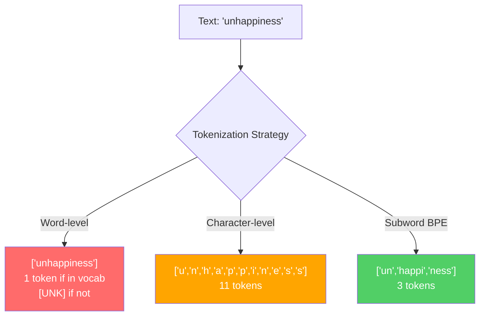
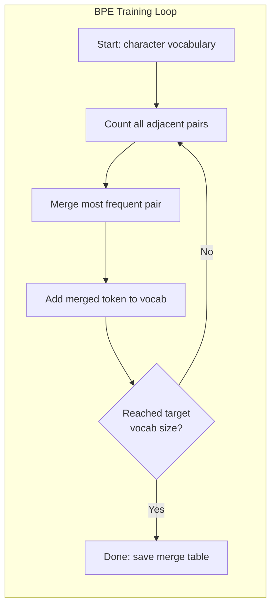
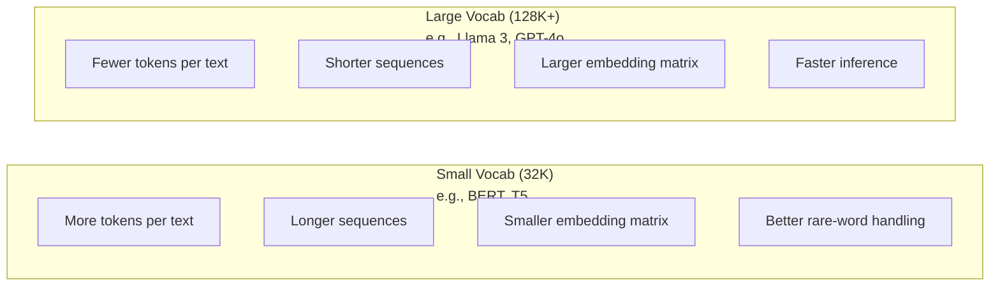

# Tokenizers: BPE, WordPiece, SentencePiece

> Seu LLM não lê inglês. Ele lê números inteiros. O tokenizer decide se esses números carregam sentido ou desperdiçam.

**Tipo:** Construir
**Linguagens:** Python
**Pré-requisitos:** Fase 05 (Fundamentos de NLP)
**Tempo:** ~90 minutos

## Objetivos de Aprendizado

- Implementar os algoritmos de tokenização BPE, WordPiece e Unigram do zero e comparar suas estratégias de merge
- Explicar como o tamanho do vocabulário afeta a eficiência do modelo: muito pequeno cria sequências longas, muito grande desperdiça parâmetros de embedding
- Analisar artefatos de tokenização em línguas e código, identificando onde tokenizers eespecificaçãoíficos falham
- Usar as bibliotecas tiktoken e sentencepiece pra tokenizar texto e inespecificaçãoionar os token IDs resultantes

## O Problema

Seu LLM não lê inglês. Não lê nenhuma língua. Ele lê números.

A distância entre "Hello, world!" e [15496, 11, 995, 0] é o tokenizer. Cada palavra, cada espaço, cada pontuação precisa ser convertida em inteiro antes que um modelo possa processar. Essa conversão não é neutra. Ela incorpora premissas no modelo que não podem ser desfeitas depois.

Erra isso e seu modelo desperdiça capacidade codificando palavras comuns com múltiplos tokens. "unfortunately" vira quatro tokens em vez de um. Sua janela de contexto de 12K encolheu 75% pra texto rico em palavras polysilábicas. Acerta e a mesma janela de contexto comporta o dobro de significado. A diferença entre "esse modelo lida bem com código" e "esse modelo sufoca em Python" frequentemente depende de como o tokenizer foi treinado.

Cada chamada de API que você faz pra GPT-4 ou Claude é cobrada por token. Cada token que seu modelo gera custa computação. Menos tokens necessários pra representar uma saída = inferência ponta-a-ponta mais rápida. Tokenização não é pré-processamento. É arquitetura.

## O Conceito

### Três Abordagens que Falharam (e Uma que Venceu)

Existem três formas óbvias de converter texto em números. Duas não funcionam em escala.

**Tokenização no nível de palavras** divide por espaços e pontuação. "The cat sat" vira ["The", "cat", "sat"]. Simples. Mas e "tokenization"? Ou "GPT-4o"? Ou uma palavra composta alemã como "Geschwindigkeitsbegrenzung"? Nível de palavra precisa de um vocabulário massivo pra cobrir cada palavra em cada língua. Falta uma palavra e você ganha o temido token `[UNK]` — o jeito do modelo dizer "não faço ideia do que é isso." Só o inglês tem mais de um milhão de formas de palavras. Adicione código, URLs, notação científica e 100 outras línguas e você precisa de um vocabulário infinito.

**Tokenização no nível de caracteres** vai no outro extremo. "hello" vira ["h", "e", "l", "l", "o"]. Vocabulário é minúsculo (algumas centenas de caracteres). Nunca tem tokens desconhecidos. Mas sequências ficam extremamente longas. Uma frase que seriam 10 tokens no nível de palavras vira 50 tokens no nível de caracteres. O modelo precisa aprender que "t", "h", "e" juntos significam "the" — queimando capacidade de attention numa coisa que humano aprende aos três anos.

**Tokenização subword** encontra o ponto justo. Palavras comuns ficam inteiras: "the" é um token. Palavras raras se decompõem em pedaços significativos: "unhappiness" vira ["un", "happi", "ness"]. Vocabulário fica gerenciável (30K a 128K tokens). Sequências ficam curtas. Tokens desconhecidos praticamente desaparecem porque qualquer palavra pode ser construída de pedaços subword.

Todo LLM moderno usa tokenização subword. GPT-2, GPT-4, BERT, Llama 3, Claude — todos. A questão é qual algoritmo.



### BPE: Byte Pair Encoding

BPE é um algoritmo de compressão guloso reaproveitado pra tokenização. A ideia é simples o bastante pra caber num cartão.

Comece com caracteres individuais. Conte cada par adjacente no corpus de treino. Mescle o par mais frequente num novo token. Repita até atingir o tamanho de vocabulário alvo.

Aqui o BPE rodando num corpus minúsculo com as palavras "lower", "lowest", e "newest":

```
Corpus (com word frequencies):
  "lower"  x5
  "lowest" x2
  "newest" x6

Step 0 -- Start with characters:
  l o w e r       (x5)
  l o w e s t     (x2)
  n e w e s t     (x6)

Step 1 -- Count adjacent pairs:
  (e,s): 8    (s,t): 8    (l,o): 7    (o,w): 7
  (w,e): 13   (e,r): 5    (n,e): 6    ...

Step 2 -- Merge most frequent pair (w,e) -> "we":
  l o we r        (x5)
  l o we s t      (x2)
  n e we s t      (x6)

Step 3 -- Recount and merge (e,s) -> "es":
  l o we r        (x5)
  l o we s t      (x2)    <- 'es' only forms from 'e'+'s', not 'we'+'s'
  n e we s t      (x6)    <- wait, the 'e' before 'we' and 's' after 'we'

Actually tracking this precisely:
  After "we" merge, remaining pairs:
  (l,o): 7   (o,we): 7   (we,r): 5   (we,s): 8
  (s,t): 8   (n,e): 6    (e,we): 6

Step 3 -- Merge (we,s) -> "wes" or (s,t) -> "st" (tied at 8, pick first):
  Merge (we,s) -> "wes":
  l o we r        (x5)
  l o wes t       (x2)
  n e wes t       (x6)

Step 4 -- Merge (wes,t) -> "west":
  l o we r        (x5)
  l o west        (x2)
  n e west        (x6)

...continue until target vocab size reached.
```

A tabela de merges É o tokenizer. Pra codificar texto novo, aplique os merges na ordem em que foram aprendidos. O corpus de treino determina quais merges existem, e essa escolha molda permanentemente o que o modelo vê.



### Byte-Level BPE (GPT-2, GPT-3, GPT-4)

BPE padrão opera em caracteres Unicode. Byte-level BPE opera em bytes brutos (0-255). Isso dá um vocabulário base de exatamente 256, lida com qualquer língua ou codificação, e nunca produz um token desconhecido.

O GPT-2 introduziu essa abordagem. O vocabulário base cobre cada byte possível. Os merges do BPE constroem sobre isso. A biblioteca tiktoken da OpenAI implementa byte-level BPE com esses tamanhos de vocabulário:

- GPT-2: 50.257 tokens
- GPT-3.5/GPT-4: ~100.256 tokens (codificação cl100k_base)
- GPT-4o: 200.019 tokens (codificação o200k_base)

### WordPiece (BERT)

WordPiece parece similar ao BPE mas escolhe merges diferente. Em vez de frequência bruta, maximiza a verossimilhança dos dados de treino:

```
BPE merge criterion:      count(A, B)
WordPiece merge criterion: count(AB) / (count(A) * count(B))
```

BPE pergunta: "Qual par aparece mais vezes?" WordPiece pergunta: "Qual par aparece junto mais vezes do que seria esperado por acaso?" Essa diferença sutil produz vocabulários diferentes. WordPiece favorece merges onde co-ocorrência é surpreendente, não só frequente.

WordPiece também usa o prefixo "##" pra subwords de continuação:

```
"unhappiness" -> ["un", "##happi", "##ness"]
"embedding"   -> ["em", "##bed", "##ding"]
```

O prefixo "##" diz que essa pedaço continua um token anterior. BERT usa WordPiece com vocabulário de 30.522 tokens. Toda variante BERT — o tokenizer do DistilBERT, RoBERTa é na verdade BPE, mas o BERT em si é WordPiece.

### SentencePiece (Llama, T5)

SentencePiece trata a entrada como um fluxo bruto de caracteres Unicode, incluindo espaços. Sem etapa de pré-tokenização. Sem regras eespecificaçãoíficas de língua sobre limites de palavras. Isso torna genuinamente agnóstico de língua — funciona em chinês, japonês, tailandês e outras línguas onde espaços não separam palavras.

SentencePiece suporta dois algoritmos:
- **Modo BPE**: mesma lógica de merge que BPE padrão, aplicada a sequências de caracteres brutos
- **Modo Unigram**: começa com um vocabulário grande e iterativamente remove tokens que menos afetam a verossimilhança geral. O inverso do BPE — poda em vez de mesclar.

Llama 2 usa SentencePiece BPE com vocabulário de 32.000 tokens. T5 usa SentencePiece Unigram com 32.000 tokens. Nota: Llama 3 mudou pra um tokenizer byte-level BPE baseado em tiktoken com 128.256 tokens.

### Tradeoffs de Tamanho de Vocabulário

Essa é uma decisão de engenharia real com consequências mensuráveis.



Números concretos. Pra um vocabulário de 128K com embeddings de 4.096 dimensões, a matriz de embedding sozinha é 128.000 x 4.096 = 524 milhões de parâmetros. Pra vocabulário de 32K, são 131 milhões. Isso é uma diferença de 400M parâmetros só pela escolha do tokenizer.

Mas vocabulários maiores comprimem texto mais agressivamente. O mesmo parágrafo em inglês que toma 100 tokens com vocabulário de 32K pode tomar 70 tokens com vocabulário de 128K. Isso significa 30% menos forward passes durante geração. Pra um modelo servindo milhões de requests, é uma redução direta no custo de computação.

A tendência é clara: tamanhos de vocabulário estão crescendo. GPT-2 usou 50.257. GPT-4 usa ~100K. Llama 3 usa 128K. GPT-4o usa 200K.

| Modelo | Tamanho Vocab | Tipo Tokenizer | Média Tokens por Palavra Inglês |
|-------|-----------|----------------|---------------------------|
| BERT | 30.522 | WordPiece | ~1.4 |
| GPT-2 | 50.257 | Byte-level BPE | ~1.3 |
| Llama 2 | 32.000 | SentencePiece BPE | ~1.4 |
| GPT-4 | ~100.256 | Byte-level BPE | ~1.2 |
| Llama 3 | 128.256 | Byte-level BPE (tiktoken) | ~1.1 |
| GPT-4o | 200.019 | Byte-level BPE | ~1.0 |

### O Imposto Multilíngue

Tokenizers treinados principalmente em inglês são brutais com outras línguas. Texto coreano no tokenizer do GPT-2 média 2-3 tokens por palavra. Chinês pode ser pior. Isso significa que um usuário coreano efetivamente tem uma janela de contexto pela metade da de um usuário inglês — pagando o mesmo preço por menos densidade de informação.

É por isso que o Llama 3 quadruplicou seu vocabulário de 32K pra 128K. Mais tokens dedicados a escritas não-inglesas significa compressão mais justa entre línguas.

## Construindo

### Passo 1: Tokenizer no Nível de Caracteres

Comece pela base. Um tokenizer no nível de caracteres mapeia cada caractere ao seu ponto de código Unicode. Sem treino necessário. Sem tokens desconhecidos. Apenas um mapeamento direto.

```python
class CharTokenizer:
    def encode(self, text):
        return [ord(c) for c in text]

    def decode(self, tokens):
        return "".join(chr(t) for t in tokens)
```

"hello" vira [104, 101, 108, 108, 111]. Cada caractere é seu próprio token. Essa é a baseline que melhoramos.

### Passo 2: Tokenizer BPE do Zero

A implementação real. Treinamos em bytes brutos (como GPT-2), contamos pares, mesclamos os mais frequentes, e registramos cada merge em ordem. A tabela de merges É o tokenizer.

```python
from collections import Counter

class BPETokenizer:
    def __init__(self):
        self.merges = {}
        self.vocab = {}

    def _get_pairs(self, tokens):
        pairs = Counter()
        for i in range(len(tokens) - 1):
            pairs[(tokens[i], tokens[i + 1])] += 1
        return pairs

    def _merge_pair(self, tokens, pair, new_token):
        merged = []
        i = 0
        while i < len(tokens):
            if i < len(tokens) - 1 and tokens[i] == pair[0] and tokens[i + 1] == pair[1]:
                merged.append(new_token)
                i += 2
            else:
                merged.append(tokens[i])
                i += 1
        return merged

    def train(self, text, num_merges):
        tokens = list(text.encode("utf-8"))
        self.vocab = {i: bytes([i]) for i in range(256)}

        for i in range(num_merges):
            pairs = self._get_pairs(tokens)
            if not pairs:
                break
            best_pair = max(pairs, key=pairs.get)
            new_token = 256 + i
            tokens = self._merge_pair(tokens, best_pair, new_token)
            self.merges[best_pair] = new_token
            self.vocab[new_token] = self.vocab[best_pair[0]] + self.vocab[best_pair[1]]

        return self

    def encode(self, text):
        tokens = list(text.encode("utf-8"))
        for pair, new_token in self.merges.items():
            tokens = self._merge_pair(tokens, pair, new_token)
        return tokens

    def decode(self, tokens):
        byte_sequence = b"".join(self.vocab[t] for t in tokens)
        return byte_sequence.decode("utf-8", errors="replace")
```

O loop de treino é o cerne do BPE: contar pares, mesclar o vencedor, repetir. Cada merge reduz a contagem total de tokens. Depois de `num_merges` rodadas, o vocabulário cresce de 256 (bytes base) pra 256 + num_merges.

Encoding aplica os merges exatamente na ordem em que foram aprendidos. Isso importa. Se o merge 1 criou "th" e o merge 5 criou "the", o encoding precisa aplicar o merge 1 primeiro pra que "the" possa se formar de "th" + "e" no merge 5.

Decoding é o inverso: procure cada token ID no vocabulário, concatene os bytes, decodifique pra UTF-8.

### Passo 3: Ida e Volta Encode-Decode

```python
corpus = (
    "The cat sat on the mat. The cat ate the rat. "
    "The dog sat on the log. The dog ate the frog. "
    "Natural language processing is the study of how computers "
    "understand and generate human language. "
    "Tokenization is the first step in any NLP pipeline."
)

tokenizer = BPETokenizer()
tokenizer.train(corpus, num_merges=40)

test_sentences = [
    "The cat sat on the mat.",
    "Natural language processing",
    "tokenization pipeline",
    "unhappiness",
]

for sentence in test_sentences:
    encoded = tokenizer.encode(sentence)
    decoded = tokenizer.decode(encoded)
    raw_bytes = len(sentence.encode("utf-8"))
    ratio = len(encoded) / raw_bytes
    print(f"'{sentence}'")
    print(f"  Tokens: {len(encoded)} (from {raw_bytes} bytes) -- ratio: {ratio:.2f}")
    print(f"  Roundtrip: {'PASS' if decoded == sentence else 'FAIL'}")
```

A taxa de compressão diz quão eficiente o tokenizer é. Uma proporção de 0.50 significa que o tokenizer comprimiu o texto pra metade do número de tokens em relação aos bytes brutos. Menor é melhor. No corpus de treino, a proporção vai ser boa. Em texto fora da distribuição como "unhappiness" (que não aparece no corpus), a proporção vai ser pior — o tokenizer recorre à codificação no nível de caracteres pra padrões não vistos.

### Passo 4: Comparar com tiktoken

```python
import tiktoken

enc = tiktoken.get_encoding("cl100k_base")

texts = [
    "The cat sat on the mat.",
    "unhappiness",
    "Hello, world!",
    "def fibonacci(n): return n if n < 2 else fibonacci(n-1) + fibonacci(n-2)",
    "Geschwindigkeitsbegrenzung",
]

for text in texts:
    our_tokens = tokenizer.encode(text)
    tiktoken_tokens = enc.encode(text)
    tiktoken_pieces = [enc.decode([t]) for t in tiktoken_tokens]
    print(f"'{text}'")
    print(f"  Our BPE:   {len(our_tokens)} tokens")
    print(f"  tiktoken:  {len(tiktoken_tokens)} tokens -> {tiktoken_pieces}")
```

tiktoken usa o mesmo algoritmo exato mas treinado em centenas de gigabytes de texto com 100.000 merges. O algoritmo é idêntico. A diferença são os dados de treino e o número de merges. Seu tokenizer treinado num parágrafo com 40 merges não consegue competir com os 100K merges do tiktoken num corpus massivo. Mas o mecanismo é o mesmo.

### Passo 5: Análise do Vocabulário

```python
def analyze_vocabulary(tokenizer, test_texts):
    total_tokens = 0
    total_chars = 0
    token_usage = Counter()

    for text in test_texts:
        encoded = tokenizer.encode(text)
        total_tokens += len(encoded)
        total_chars += len(text)
        for t in encoded:
            token_usage[t] += 1

    print(f"Vocabulary size: {len(tokenizer.vocab)}")
    print(f"Total tokens across all texts: {total_tokens}")
    print(f"Total characters: {total_chars}")
    print(f"Avg tokens per character: {total_tokens / total_chars:.2f}")

    print(f"\nMost used tokens:")
    for token_id, count in token_usage.most_common(10):
        token_bytes = tokenizer.vocab[token_id]
        display = token_bytes.decode("utf-8", errors="replace")
        print(f"  Token {token_id:4d}: '{display}' (used {count} times)")

    unused = [t for t in tokenizer.vocab if t not in token_usage]
    print(f"\nUnused tokens: {len(unused)} out of {len(tokenizer.vocab)}")
```

Isso revela a distribuição de Zipf no seu vocabulário. Alguns tokens dominam (espaços, "the", "e"). A maioria dos tokens é raramente usada. Tokenizers de produção otimizam pra essa distribuição — padrões comuns recebem IDs curtos, padrões raros recebem representações mais longas.

## Usando

Seu BPE do zero funciona. Agora veja como ferramentas de produção são.

### tiktoken (OpenAI)

```python
import tiktoken

enc = tiktoken.get_encoding("cl100k_base")

text = "Tokenizers convert text to integers"
tokens = enc.encode(text)
print(f"Tokens: {tokens}")
print(f"Pieces: {[enc.decode([t]) for t in tokens]}")
print(f"Roundtrip: {enc.decode(tokens)}")
```

tiktoken é escrito em Rust com bindings Python. Codifica milhões de tokens por segundo. Mesmo algoritmo BPE, implementação de nível industrial.

### Hugging Face tokenizers

```python
from tokenizers import Tokenizer
from tokenizers.models import BPE
from tokenizers.trainers import BpeTrainer
from tokenizers.pre_tokenizers import ByteLevel

tokenizer = Tokenizer(BPE())
tokenizer.pre_tokenizer = ByteLevel()

trainer = BpeTrainer(vocab_size=1000, especificaçãoial_tokens=["<pad>", "<eos>", "<unk>"])
tokenizer.train(["corpus.txt"], trainer)

output = tokenizer.encode("The cat sat on the mat.")
print(f"Tokens: {output.tokens}")
print(f"IDs: {output.ids}")
```

A biblioteca tokenizers da Hugging Face também é Rust por baixo. Treina BPE em corpus de gigabytes em segundos. É isso que você usa quando treina seu próprio modelo.

### Carregando o Tokenizer do Llama

```python
from transformers import AutoTokenizer

tokenizer = AutoTokenizer.from_pretrained("meta-llama/Llama-3.1-8B")

text = "Tokenizers are the unsung heroes of LLMs"
tokens = tokenizer.encode(text)
print(f"Token IDs: {tokens}")
print(f"Tokens: {tokenizer.convert_ids_to_tokens(tokens)}")
print(f"Vocab size: {tokenizer.vocab_size}")

multilingual = ["Hello world", "Hola mundo", "Bonjour le monde"]
for text in multilingual:
    ids = tokenizer.encode(text)
    print(f"'{text}' -> {len(ids)} tokens")
```

O vocabulário de 128K do Llama 3 comprime texto não-inglês significativamente melhor que o vocabulário de 50K do GPT-2. Você pode verificar isso você mesmo — codifique a mesma frase em múltiplas línguas e conte os tokens.

## Entregando

Essa aula produz `outputs/prompt-tokenizer-analyzer.md` — um prompt reutilizável que analisa eficiência de tokenização pra qualquer combinação de texto e modelo. Alimente com uma amostra de texto e ele diz qual tokenizer de modelo lida melhor.

## Exercícios

1. Modifique o tokenizer BPE pra imprimir o vocabulário a cada etapa de merge. Veja como "t" + "h" vira "th", depois "th" + "e" vira "the". Acompanhe como palavras inglesas comuns são montadas pedaço por pedaço.

2. Adicione tokens eespecificaçãoiais (`<pad>`, `<eos>`, `<unk>`) ao tokenizer BPE. Atribua IDs 0, 1, 2 e desloque todos os outros tokens adequadamente. Implemente uma etapa de pré-tokenização que divide por whitespace antes de rodar BPE.

3. Implemente o critério de merge do WordPiece (proporção de verossimilhança em vez de frequência). Treine BPE e WordPiece no mesmo corpus com o mesmo número de merges. Compare os vocabulários resultantes — qual produz subwords mais linguisticamente significativas?

4. Monte um benchmark de eficiência de tokenizers multilíngues. Pegue 10 frases em inglês, espanhol, chinês, coreano e árabe. Tokenize cada uma com tiktoken (cl100k_base) e meça a média de tokens por caractere. Quantifique o "imposto multilíngue" pra cada língua.

5. Treine seu tokenizer BPE num corpus maior (baixe um artigo da Wikipedia). Ajuste o número de merges pra atingir uma taxa de compressão dentro de 10% do tiktoken no mesmo texto. Isso te obriga a entender a relação entre tamanho do corpus, número de merges e qualidade de compressão.

## Termos-Chave

| Termo | O que dizem | O que realmente significa |
|------|-------------|-----------------------|
| Token | "Uma palavra" | Uma unidade no vocabulário do modelo — pode ser caractere, subword, palavra ou trecho multi-palavra |
| BPE | "Alguma coisa de compressão" | Byte Pair Encoding — merge iterativo do par adjacente mais frequente de tokens até atingir o tamanho de vocabulário alvo |
| WordPiece | "O tokenizer do BERT" | Como BPE mas os merges maximizam a proporção de verossimilhança count(AB)/(count(A)*count(B)) em vez de frequência bruta |
| SentencePiece | "Uma biblioteca de tokenizer" | Tokenizer agnóstico de língua que opera em Unicode bruto sem pré-tokenização, suportando algoritmos BPE e Unigram |
| Tamanho do vocabulário | "Quantas palavras ele conhece" | Número total de tokens únicos: GPT-2 tem 50.257, BERT tem 30.522, Llama 3 tem 128.256 |
| Fertility | "Não é termo de tokenizer" | Média de tokens por palavra — mede eficiência do tokenizer entre línguas (1.0 é perfeito, 3.0 significa que o modelo trabalha três vezes mais) |
| Byte-level BPE | "O tokenizer do GPT" | BPE operando em bytes brutos (0-255) em vez de caracteres Unicode, garantindo zero tokens desconhecidos pra qualquer entrada |
| Tabela de merges | "O arquivo do tokenizer" | Lista ordenada de merges de pares aprendidos durante treino — ISSO É o tokenizer do modelo, e a ordem importa |
| Pré-tokenização | "Dividir por espaços" | Regras aplicadas antes da tokenização subword: divisão por whitespace, separação de dígitos, tratamento de pontuação |
| Taxa de compressão | "Quão eficiente o tokenizer é" | Tokens produzidos divididos por bytes de entrada — menor significa melhor compressão e inferência mais rápida |

## Leitura Complementar

- [Sennrich et al., 2016 -- "Neural Machine Translation of Rare Words with Subword Units"](https://arxiv.org/abs/1508.07909) — o paper que introduziu BPE pra NLP, transformando um algoritmo de compressão de 1994 na base da tokenização moderna
- [Kudo & Richardson, 2018 -- "SentencePiece: A simple and language independent subword tokenizer"](https://arxiv.org/abs/1808.06226) — tokenização agnóstica de língua que tornou modelos multilíngues práticos
- [OpenAI tiktoken repository](https://github.com/openai/tiktoken) — implementação BPE de produção em Rust com bindings Python, usada por GPT-3.5/4/4o
- [Hugging Face Tokenizers documentation](https://huggingface.co/docs/tokenizers) — treino de tokenizer de nível produção com performance Rust
