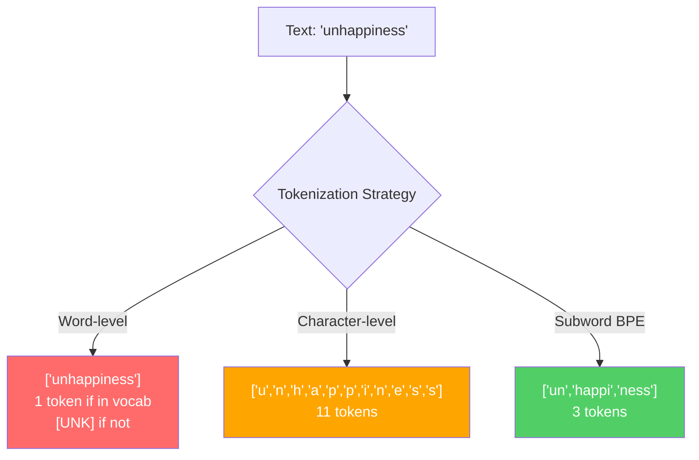
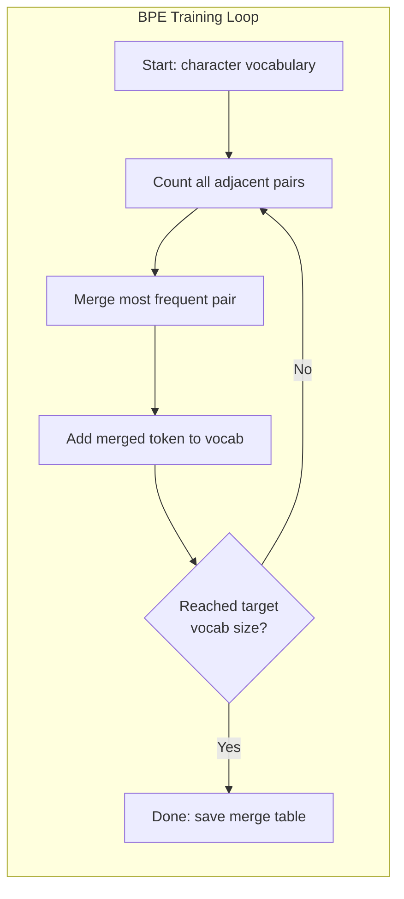
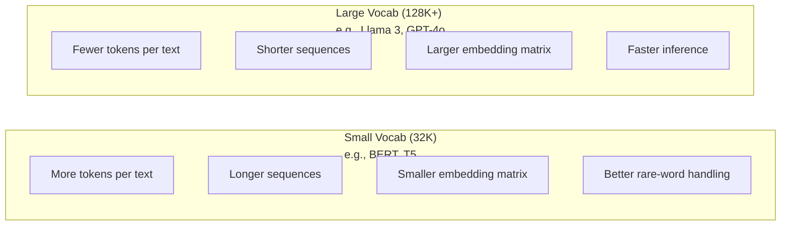

# Tokenizer'ler: BPE, WordPiece, SentencePiece

> LLM'niz İngilizce okumuyor. Tam sayıları okur. tokenizer, bu tamsayıların anlam taşıyıp taşımadığına veya onu boşa harcayıp taşımadığına karar verir.

**Tür:** Yapım
**Diller:** Python
**Önkoşullar:** Aşama 05 (NLP Temelleri)
**Süre:** ~90 dakika

## Öğrenme Hedefleri

- BPE, WordPiece ve Unigram tokenizasyon algoritmalarını sıfırdan uygulayın ve birleştirme stratejilerini karşılaştırın
- Kelime boyutunun model verimliliğini nasıl etkilediğini açıklayın: çok küçük olması uzun diziler yaratır, çok büyük olması embedding parametrelerini boşa harcar
- tokenization artifact'leri diller ve kodlar arasında analiz ederek belirli tokenizer'lerin nerede bozulduğunu belirleyin
- Metni tokenize etmek için tiktoken ve cümle kitaplıklarını kullanın ve ortaya çıkan token kimliklerini inceleyin

## Sorun

LLM'niz İngilizce okumuyor. Hiçbir dili okumuyor. Rakamları okuyor.

"Merhaba dünya!" arasındaki boşluk ve [15496, 11, 995, 0] tokenizer'dir. Bir modelin işleyebilmesi için her kelimenin, her boşluğun, her noktalama işaretinin bir tam sayıya dönüştürülmesi gerekir. Bu dönüşüm tarafsız değildir. Daha sonra geri alınamayacak varsayımları modele dahil eder.

Bunu yanlış anladığınızda modeliniz, ortak kelimeleri birden fazla token ile kodlayarak kapasiteyi boşa harcar. "maalesef" bir yerine dört token oluyor. 128K context window'niz, çok heceli sözcüklerden oluşan yoğun metin nedeniyle %75 oranında küçüldü. Doğru anladığınızda aynı context window iki kat daha fazla anlam taşır. "Bu model kodu iyi işliyor" ile "bu model Python'u boğuyor" arasındaki fark genellikle tokenizer'nin nasıl eğitildiğine bağlıdır.

GPT-4 veya Claude'a yaptığınız her API çağrısı token başına fiyatlandırılır. Modelinizin her token'si maliyet hesaplaması üretir. Bir çıktıyı temsil etmek için ne kadar az token gerekiyorsa, uçtan uca inference o kadar hızlı olur. Tokenization ön işleme değildir. Mimarlıktır.

## Konsept

### Başarısız Olan Üç Yaklaşım (ve Kazanan Bir Yaklaşım)

Metni sayılara dönüştürmenin üç belirgin yolu vardır. Bunlardan ikisi ölçekte çalışmıyor.

**Kelime düzeyinde tokenizasyon** boşluklara ve noktalama işaretlerine göre bölünür. "Oturdu kedi", ["The", "cat", "sat"] olur. Basit. Peki "tokenization" ne olacak? Veya "GPT-4o" mu? Veya "Geschwindigkeitsbegrenzung" gibi Almanca bir bileşik kelime mi? Kelime düzeyi, her dildeki her kelimeyi kapsayacak kadar büyük bir kelime dağarcığı gerektirir. Bir kelimeyi kaçırırsanız, korkunç `[UNK]` token ile karşılaşırsınız -- modelin "Bunun ne olduğu hakkında hiçbir fikrim yok" deme şekli. Yalnızca İngilizce'de bir milyondan fazla kelime biçimi vardır. Kodu, URL'leri, bilimsel gösterimi ve diğer 100 dili eklediğinizde sonsuz bir kelime dağarcığına ihtiyacınız olur.

**Karakter düzeyinde tokenizasyon** diğer yöne gider. "merhaba" ["h", "e", "l", "l", "o"] olur. Kelime dağarcığı küçüktür (birkaç yüz karakter). Hiç bilinmeyen token yok. Ancak diziler aşırı derecede uzun oluyor. Kelime düzeyinde 10 token olacak bir cümle, karakter düzeyinde 50 token olur. Model, "t", "h", "e"nin birlikte "the" anlamına geldiğini öğrenmelidir; bu da insanın üç yaşında öğrendiği bir şeye dikkat kapasitesini yakacaktır.

**Alt kelime tokenization** en uygun noktayı bulur. Ortak kelimeler bütün olarak kalır: "the" bir token'dir. Nadir kelimeler anlamlı parçalara ayrışır: "mutsuzluk" ["un", "mutluluk", "ness"] olur. Kelime dağarcığı yönetilebilir kalır (30K ila 128K token). Diziler kısa kalıyor. Bilinmeyen token'ler esasen ortadan kaybolur çünkü herhangi bir kelime alt kelime parçalarından oluşturulabilir.

Her modern LLM, tokenization alt sözcüğünü kullanır. GPT-2, GPT-4, BERT, Llama 3, Claude — hepsi. Soru hangi algoritmanın olduğudur.



### BPE: Bayt Çifti Kodlaması

BPE, tokenizasyon için yeniden tasarlanmış açgözlü bir sıkıştırma algoritmasıdır. Fikir bir dizin kartına sığacak kadar basittir.

Bireysel karakterlerle başlayın. Eğitim derlemindeki her bitişik çifti sayın. En sık görülen çifti yeni bir token ile birleştirin. Hedef kelime büyüklüğünüze ulaşana kadar tekrarlayın.

```figure
tokenizer-bpe
```

İşte BPE'nin "daha düşük", "en düşük" ve "en yeni" sözcükleriyle küçük bir külliyat üzerinde çalıştığı örneği:

```
Corpus (with word frequencies):
  "lower"  x5
  "lowest" x2
  "newest" x6

Step 0 -- Start with characters:
  l o w e r       (x5)
  l o w e s t     (x2)
  n e w e s t     (x6)

Step 1 -- Count adjacent pairs:
  (e,s): 8    (s,t): 8    (l,o): 7    (o,w): 7
  (w,e): 13   (e,r): 5    (n,e): 6    ...

Step 2 -- Merge most frequent pair (w,e) -> "we":
  l o we r        (x5)
  l o we s t      (x2)
  n e we s t      (x6)

Step 3 -- Recount and merge (e,s) -> "es":
  l o we r        (x5)
  l o we s t      (x2)    <- 'es' only forms from 'e'+'s', not 'we'+'s'
  n e we s t      (x6)    <- wait, the 'e' before 'we' and 's' after 'we'

Actually tracking this precisely:
  After "we" merge, remaining pairs:
  (l,o): 7   (o,we): 7   (we,r): 5   (we,s): 8
  (s,t): 8   (n,e): 6    (e,we): 6

Step 3 -- Merge (we,s) -> "wes" or (s,t) -> "st" (tied at 8, pick first):
  Merge (we,s) -> "wes":
  l o we r        (x5)
  l o wes t       (x2)
  n e wes t       (x6)

Step 4 -- Merge (wes,t) -> "west":
  l o we r        (x5)
  l o west        (x2)
  n e west        (x6)

...continue until target vocab size reached.
```

Birleştirme tablosu tokenizer'dir. Yeni metni kodlamak için birleştirmeleri öğrenildikleri sıraya göre uygulayın. Eğitim külliyatı hangi birleştirmelerin mevcut olduğunu belirler ve bu seçim, modelin gördüklerini kalıcı olarak şekillendirir.



### Bayt Düzeyinde BPE (GPT-2, GPT-3, GPT-4)

Standart BPE, Unicode karakterlerle çalışır. Bayt düzeyinde BPE, ham baytlarda (0-255) çalışır. Bu size tam olarak 256 kelimelik bir temel kelime dağarcığı verir, herhangi bir dili veya kodlamayı yönetir ve asla bilinmeyen bir token üretmez.

GPT-2 bu yaklaşımı tanıttı. Temel kelime dağarcığı mümkün olan her baytı kapsar. BPE bunun üzerine inşayı birleştiriyor. OpenAI'nin tiktoken kütüphanesi bayt seviyesinde BPE'yi şu kelime dağarcığı boyutlarıyla uygular:

- GPT-2: 50.257 token
- GPT-3.5/GPT-4: ~100.256 token (cl100k_base kodlaması)
- GPT-4o: 200.019 token (o200k_base kodlaması)

### Kelime Parçası (BERT)

WordPiece, BPE'ye benzer ancak birleştirmeleri farklı şekilde seçer. Ham frekans yerine eğitim verilerinin olasılığını maksimuma çıkarır:

```
BPE merge criterion:      count(A, B)
WordPiece merge criterion: count(AB) / (count(A) * count(B))
```

BPE şunu soruyor: "Hangi çift en sık görünüyor?" WordPiece şunu soruyor: "Hangi çift tesadüfen beklediğinizden daha sık bir arada görünüyor?" Bu ince fark, farklı sözcükler üretir. WordPiece, birlikte meydana gelmenin sık sık değil, şaşırtıcı olduğu durumlarda birleştirmeleri tercih eder.

WordPiece ayrıca devam alt sözcükleri için "##" önekini kullanır:

```
"unhappiness" -> ["un", "##happi", "##ness"]
"embedding"   -> ["em", "##bed", "##ding"]
```

"##" öneki size bu parçanın önceki token ile devam ettiğini belirtir. BERT, 30.522 token kelime dağarcığına sahip WordPiece'i kullanır. Her BERT çeşidi - DistilBERT, RoBERTa'nın tokenizer'si aslında BPE'dir, ancak BERT'in kendisi WordPiece'dir.

### Cümle Parçası (Llama, T5)

SentencePiece, girdiyi boşluklar da dahil olmak üzere Unicode karakterlerinden oluşan ham bir akış olarak ele alır. tokenizasyon öncesi adım yok. Kelime sınırlarıyla ilgili dile özgü kurallar yoktur. Bu onu gerçekten dilden bağımsız kılıyor; Çince, Japonca, Tayca ve boşlukların sözcükleri ayırmadığı diğer dillerde çalışıyor.

SentencePiece iki algoritmayı destekler:
- **BPE modu**: ham karakter dizilerine uygulanan standart BPE ile aynı birleştirme mantığı
- **Unigram modu**: geniş bir kelime dağarcığıyla başlar ve genel olasılığı en az etkileyen token'leri yinelemeli olarak kaldırır. BPE'nin tersi: Birleştirmek yerine budamak.

Llama 2, 32.000 token kelime dağarcığına sahip SentencePiece BPE'yi kullanıyor. T5, 32.000 token ile SentencePiece Unigram'ı kullanıyor. Not: Llama 3, 128.256 token ile tiktoken tabanlı bayt düzeyinde BPE tokenizer'ye geçti.

### Kelime Büyüklüğü Değişimleri

Bu, ölçülebilir sonuçları olan gerçek bir mühendislik kararıdır.



Somut sayılar. 4.096 boyutlu embedding içeren 128K kelime dağarcığı için embedding matrisi tek başına 128.000 x 4.096 = 524 milyon parametredir. 32K kelime dağarcığı için bu 131 milyon parametredir. Bu, yalnızca tokenizer seçimiyle karşılaştırıldığında 400M'lik bir parametre farkıdır.

Ancak daha büyük sözlükler metni daha agresif bir şekilde sıkıştırır. 32K kelime dağarcığıyla 100 token alan aynı İngilizce paragraf, 128K kelime dağarcığıyla 70 token alabilir. Bu, üretim sırasında %30 daha az ileri geçiş anlamına gelir. Milyonlarca isteğe hizmet veren bir model için bu, bilgi işlem maliyetinde doğrudan bir azalmadır.

Trend açık: Kelime dağarcığı büyüyor. GPT-2 50.257 kullandı. GPT-4 ~100K kullanır. Lama 3 128K kullanıyor. GPT-4o 200K kullanır.

| Modeli | Kelime Boyutu | Tokenizer Türü | İngilizce Kelime başına ortalama Token |
|-------|-----------|----------------|---------------------------|
| BERT | 30.522 | Kelime Parçası | ~1.4 |
| GPT-2 | 50.257 | Bayt düzeyinde BPE | ~1.3 |
| Lama 2 | 32.000 | Cümle Parçası BPE | ~1.4 |
| GPT-4 | ~100,256 | Bayt düzeyinde BPE | ~1.2 |
| Lama 3 | 128.256 | Bayt düzeyinde BPE (tiktoken) | ~1.1 |
| GPT-4o | 200.019 | Bayt düzeyinde BPE | ~1.0 |

### Çok Dilli Vergi

Öncelikle İngilizce eğitimi alan Tokenizer'ler diğer dillere karşı acımasızdır. GPT-2'nin tokenizer'sindeki Korece metin, kelime başına ortalama 2-3 token'dir. Çinliler daha kötü olabilir. Bu, Koreli bir kullanıcının, İngiliz bir kullanıcının yarısı kadar büyüklükte bir context window'ye sahip olduğu ve daha az bilgi yoğunluğu için aynı fiyatı ödediği anlamına gelir.

Bu nedenle Llama 3 kelime dağarcığını 32K'dan 128K'ya dört katına çıkardı. İngilizce olmayan komut dosyalarına ayrılmış daha fazla token, diller arasında daha adil sıkıştırma anlamına gelir.

```figure
tokenizer-tradeoff
```

## İnşa Et

### Adım 1: Karakter Düzeyi Tokenizer

Temelden başlayın. Karakter düzeyinde bir tokenizer, her karakteri kendi Unicode kod noktasına eşler. Eğitime gerek yok. Bilinmeyen token yok. Sadece doğrudan bir haritalama.

```python
class CharTokenizer:
    def encode(self, text):
        return [ord(c) for c in text]

    def decode(self, tokens):
        return "".join(chr(t) for t in tokens)
```

"merhaba" [104, 101, 108, 108, 111] olur. Her karakter kendi token'sidir. Geliştirdiğimiz temel budur.

### Adım 2: Sıfırdan BPE Tokenizer

Gerçek uygulama. Ham baytlar (GPT-2 gibi) üzerinde eğitim alıyoruz, çiftleri sayıyoruz, en sık olanları birleştiriyoruz ve her birleştirmeyi sırayla kaydediyoruz. Birleştirme tablosu tokenizer'dir.

```python
from collections import Counter

class BPETokenizer:
    def __init__(self):
        self.merges = {}
        self.vocab = {}

    def _get_pairs(self, tokens):
        pairs = Counter()
        for i in range(len(tokens) - 1):
            pairs[(tokens[i], tokens[i + 1])] += 1
        return pairs

    def _merge_pair(self, tokens, pair, new_token):
        merged = []
        i = 0
        while i < len(tokens):
            if i < len(tokens) - 1 and tokens[i] == pair[0] and tokens[i + 1] == pair[1]:
                merged.append(new_token)
                i += 2
            else:
                merged.append(tokens[i])
                i += 1
        return merged

    def train(self, text, num_merges):
        tokens = list(text.encode("utf-8"))
        self.vocab = {i: bytes([i]) for i in range(256)}

        for i in range(num_merges):
            pairs = self._get_pairs(tokens)
            if not pairs:
                break
            best_pair = max(pairs, key=pairs.get)
            new_token = 256 + i
            tokens = self._merge_pair(tokens, best_pair, new_token)
            self.merges[best_pair] = new_token
            self.vocab[new_token] = self.vocab[best_pair[0]] + self.vocab[best_pair[1]]

        return self

    def encode(self, text):
        tokens = list(text.encode("utf-8"))
        for pair, new_token in self.merges.items():
            tokens = self._merge_pair(tokens, pair, new_token)
        return tokens

    def decode(self, tokens):
        byte_sequence = b"".join(self.vocab[t] for t in tokens)
        return byte_sequence.decode("utf-8", errors="replace")
```

Eğitim döngüsü BPE'nin özüdür: çiftleri sayın, kazananı birleştirin, tekrarlayın. Her birleştirme, toplam token sayısını azaltır. `num_merges` turlarından sonra sözcük dağarcığı 256'dan (temel bayt) 256 + num_merges'e çıkar.

Kodlama, birleştirmeleri tam olarak öğrenildikleri sırayla uygular. Bu önemli. Birleştirme 1 "th"i ve birleştirme 5 "the"yi yarattıysa, kodlamanın önce birleştirme 1'i uygulaması gerekir; böylece "the", birleştirme 5'te "th" + "e"den oluşabilir.

Kod çözme bunun tersidir: sözlükte her token kimliğini arayın, baytları birleştirin, kodu UTF-8 olarak çözün.

### Adım 3: Gidiş-Dönüş Kodlama ve Kod Çözme

```python
corpus = (
    "The cat sat on the mat. The cat ate the rat. "
    "The dog sat on the log. The dog ate the frog. "
    "Natural language processing is the study of how computers "
    "understand and generate human language. "
    "Tokenization is the first step in any NLP pipeline."
)

tokenizer = BPETokenizer()
tokenizer.train(corpus, num_merges=40)

test_sentences = [
    "The cat sat on the mat.",
    "Natural language processing",
    "tokenization pipeline",
    "unhappiness",
]

for sentence in test_sentences:
    encoded = tokenizer.encode(sentence)
    decoded = tokenizer.decode(encoded)
    raw_bytes = len(sentence.encode("utf-8"))
    ratio = len(encoded) / raw_bytes
    print(f"'{sentence}'")
    print(f"  Tokens: {len(encoded)} (from {raw_bytes} bytes) -- ratio: {ratio:.2f}")
    print(f"  Roundtrip: {'PASS' if decoded == sentence else 'FAIL'}")
```

Sıkıştırma oranı size tokenizer'nin ne kadar etkili olduğunu söyler. 0,50 oranı, tokenizer'nin metni ham bayt sayısının yarısı kadar token'ye sıkıştırdığı anlamına gelir. Daha düşük olması daha iyidir. Eğitim külliyatında oran iyi olacaktır. "Mutsuzluk" gibi dağıtım dışı metinlerde (ki bu külliyatta yer almıyor) oran daha kötü olacaktır; tokenizer, görünmeyen modeller için karakter düzeyinde kodlamaya geri döner.

### Adım 4: tiktoken ile karşılaştırın

```python
import tiktoken

enc = tiktoken.get_encoding("cl100k_base")

texts = [
    "The cat sat on the mat.",
    "unhappiness",
    "Hello, world!",
    "def fibonacci(n): return n if n < 2 else fibonacci(n-1) + fibonacci(n-2)",
    "Geschwindigkeitsbegrenzung",
]

for text in texts:
    our_tokens = tokenizer.encode(text)
    tiktoken_tokens = enc.encode(text)
    tiktoken_pieces = [enc.decode([t]) for t in tiktoken_tokens]
    print(f"'{text}'")
    print(f"  Our BPE:   {len(our_tokens)} tokens")
    print(f"  tiktoken:  {len(tiktoken_tokens)} tokens -> {tiktoken_pieces}")
```

tiktoken tamamen aynı algoritmayı kullanır ancak 100.000 birleştirmeyle yüzlerce gigabaytlık metin üzerinde eğitilmiştir. Algoritma aynıdır. Aradaki fark, eğitim verileri ve birleştirme sayısıdır. 40 birleştirme içeren bir paragraf üzerinde eğitilmiş tokenizer'niz, devasa bir külliyattaki tiktoken'nin 100K birleştirmeleriyle rekabet edemez. Ama mekanizma aynıdır.

### Adım 5: Kelime Analizi

```python
def analyze_vocabulary(tokenizer, test_texts):
    total_tokens = 0
    total_chars = 0
    token_usage = Counter()

    for text in test_texts:
        encoded = tokenizer.encode(text)
        total_tokens += len(encoded)
        total_chars += len(text)
        for t in encoded:
            token_usage[t] += 1

    print(f"Vocabulary size: {len(tokenizer.vocab)}")
    print(f"Total tokens across all texts: {total_tokens}")
    print(f"Total characters: {total_chars}")
    print(f"Avg tokens per character: {total_tokens / total_chars:.2f}")

    print(f"\nMost used tokens:")
    for token_id, count in token_usage.most_common(10):
        token_bytes = tokenizer.vocab[token_id]
        display = token_bytes.decode("utf-8", errors="replace")
        print(f"  Token {token_id:4d}: '{display}' (used {count} times)")

    unused = [t for t in tokenizer.vocab if t not in token_usage]
    print(f"\nUnused tokens: {len(unused)} out of {len(tokenizer.vocab)}")
```

Bu, kelime dağarcığınızdaki Zipf dağılımını ortaya çıkarır. Birkaç token hakimdir (boşluklar, "the", "e"). Çoğu token nadiren kullanılır. Üretim tokenizer'ler bu dağıtım için optimize eder; yaygın kalıplar kısa token kimlikleri alır, nadir kalıplar ise daha uzun temsiller alır.

## Kullan onu

Çizik BPE'niz çalışıyor. Şimdi üretim araçlarının nasıl göründüğüne bakın.

### tiktoken (OpenAI)

```python
import tiktoken

enc = tiktoken.get_encoding("cl100k_base")

text = "Tokenizers convert text to integers"
tokens = enc.encode(text)
print(f"Tokens: {tokens}")
print(f"Pieces: {[enc.decode([t]) for t in tokens]}")
print(f"Roundtrip: {enc.decode(tokens)}")
```

tiktoken, Rust'ta Python bağlamalarıyla yazılmıştır. Saniyede milyonlarca token'yi kodlar. Aynı BPE algoritması, endüstriyel güçte uygulama.

### Sarılma Yüzü tokenizers

```python
from tokenizers import Tokenizer
from tokenizers.models import BPE
from tokenizers.trainers import BpeTrainer
from tokenizers.pre_tokenizers import ByteLevel

tokenizer = Tokenizer(BPE())
tokenizer.pre_tokenizer = ByteLevel()

trainer = BpeTrainer(vocab_size=1000, special_tokens=["<pad>", "<eos>", "<unk>"])
tokenizer.train(["corpus.txt"], trainer)

output = tokenizer.encode("The cat sat on the mat.")
print(f"Tokens: {output.tokens}")
print(f"IDs: {output.ids}")
```

Hugging Face tokenizer'nin kütüphanesi de Rust'un kaputunun altında. BPE'yi gigabayt ölçekli korpora üzerinde saniyeler içinde eğitir. Kendi modelinizi eğitirken kullandığınız şey budur.

### Lama'nın Tokenizer'si yükleniyor

```python
from transformers import AutoTokenizer

tokenizer = AutoTokenizer.from_pretrained("meta-llama/Llama-3.1-8B")

text = "Tokenizers are the unsung heroes of LLMs"
tokens = tokenizer.encode(text)
print(f"Token IDs: {tokens}")
print(f"Tokens: {tokenizer.convert_ids_to_tokens(tokens)}")
print(f"Vocab size: {tokenizer.vocab_size}")

multilingual = ["Hello world", "Hola mundo", "Bonjour le monde"]
for text in multilingual:
    ids = tokenizer.encode(text)
    print(f"'{text}' -> {len(ids)} tokens")
```

Llama 3'ün 128K kelime dağarcığı İngilizce olmayan metinleri GPT-2'nin 50K kelime dağarcığından önemli ölçüde daha iyi sıkıştırır. Bunu kendiniz doğrulayabilirsiniz; aynı cümleyi birden fazla dilde kodlayın ve token'leri sayın.

## Gönderin

Bu ders, herhangi bir metin ve model birleşimi için tokenleştirme verimliliğini analiz eden, yeniden kullanılabilir bir prompt olan `outputs/prompt-tokenizer-analyzer.md`'yi üretir. Ona bir metin örneği verin ve size hangi modelin tokenizer'nin bunu en iyi şekilde işlediğini söyleyecektir.

## Egzersizler

1. Her birleştirme adımında sözlüğü yazdırmak için BPE tokenizer'yi değiştirin. "t" + "h"nin nasıl "th" haline geldiğini, ardından "th" + "e"nin nasıl "the" haline geldiğini izleyin. Yaygın İngilizce kelimelerin nasıl parça parça bir araya getirildiğini takip edin.

2. BPE tokenizer'ye özel token'ler (`<pad>`, `<eos>`, `<unk>`) ekleyin. Onlara 0, 1, 2 kimliklerini atayın ve diğer tüm token'leri buna göre kaydırın. BPE'yi çalıştırmadan önce boşluklara bölünen bir tokenizasyon öncesi adım uygulayın.

3. WordPiece birleştirme kriterini uygulayın (sıklık yerine olasılık oranı). Hem BPE hem de WordPiece'i aynı sayıda birleştirmeyle aynı derlem üzerinde eğitin. Ortaya çıkan kelime dağarcığını karşılaştırın; hangisi dilsel açıdan daha anlamlı alt kelimeler üretir?

4. Çok dilli bir tokenizer verimliliği benchmark oluşturun. İngilizce, İspanyolca, Çince, Korece ve Arapça dillerinde 10 cümle alın. Her birini tiktoken (cl100k_base) ile Tokenize edin ve karakter başına ortalama token'leri ölçün. Her dil için "çok dilli verginin" miktarını belirleyin.

5. BPE tokenizer'nizi daha geniş bir külliyat üzerinde eğitin (bir Wikipedia makalesi indirin). Aynı metinde tiktoken'nin %10'u dahilinde bir sıkıştırma oranı elde etmek için birleştirme sayısını ayarlayın. Bu sizi derlem boyutu, birleştirme sayısı ve sıkıştırma kalitesi arasındaki ilişkiyi anlamaya zorlar.

## Anahtar Terimler

| Dönem | İnsanlar ne diyor | Aslında ne anlama geliyor |
|------|----------------|----------------------|
| Token | "Bir kelime" | Modelin sözlüğündeki bir birim -- bir karakter, alt kelime, kelime veya çok kelimeli bir parça olabilir |
| BPE | "Bazı sıkıştırma şeyleri" | Bayt Çifti Kodlaması - hedef kelime boyutuna ulaşılana kadar en sık görülen bitişik token çiftini yinelemeli olarak birleştirin |
| Kelime Parçası | "BERT'in tokenizer'si" | BPE'ye benzer ancak birleştirmeler, ham frekans yerine olasılık oranını say(AB)/(sayı(A)*sayı(B)) maksimuma çıkarır |
| Cümle Parçası | "Bir tokenizer kitaplığı" | BPE ve Unigram algoritmalarını destekleyen, önceden tokenleştirme olmadan ham Unicode üzerinde çalışan, dilden bağımsız bir tokenizer |
| Kelime boyutu | "Kaç kelime biliyor" | Benzersiz token'lerin toplam sayısı: GPT-2'de 50.257, BERT'te 30.522, Llama 3'te 128.256 |
| Doğurganlık | "tokenizer terimi değil" | Kelime başına ortalama token sayısı - diller arasında tokenizer verimliliğini ölçer (1,0 mükemmeldir, 3,0, modelin üç kat daha fazla çalıştığı anlamına gelir) |
| Bayt düzeyinde BPE | "GPT'nin tokenizer'si" | Unicode karakterler yerine ham baytlarla (0-255) çalışan BPE, herhangi bir giriş için bilinmeyen token olmayacağını garanti eder |
| Tabloyu birleştir | "tokenizer dosyası" | Eğitim sırasında öğrenilen çift birleştirmelerin sıralı listesi - bu tokenizer'dir ve sıra önemlidir |
| tokenizasyon Öncesi | "Boşluklara bölme" | tokenleştirme alt sözcüğünden önce uygulanan kurallar: boşluk bölme, rakam ayırma, noktalama işaretlerinin işlenmesi |
| Sıkıştırma oranı | "tokenizer ne kadar verimli" | Üretilen Token'ler giriş baytlarına bölünür - daha düşük olması daha iyi sıkıştırma ve daha hızlı anlamına gelir inference |

## Daha Fazla Okuma

- [Sennrich ve diğerleri, 2016 -- "Alt Kelime Birimleriyle Nadir Kelimelerin Nöral Makine Çevirisi"](https://arxiv.org/abs/1508.07909) -- NLP için BPE'yi tanıtan ve 1994'teki bir sıkıştırma algoritmasını modern tokenleştirmenin temeline dönüştüren makale
- [Kudo ve Richardson, 2018 -- "SentencePiece: Basit ve dilden bağımsız bir alt kelime tokenizer"](https://arxiv.org/abs/1808.06226) -- çok dilli modelleri pratik hale getiren dilden bağımsız tokenizasyon
- [OpenAI tiktoken deposu](https://github.com/openai/tiktoken) -- GPT-3.5/4/4o tarafından kullanılan, Python bağlamalarıyla Rust'ta üretim BPE uygulaması
- [Hugging Face Tokenizers belgeleri](https://huggingface.co/docs/tokenizers) -- Rust performansıyla üretim düzeyinde tokenizer eğitimi
