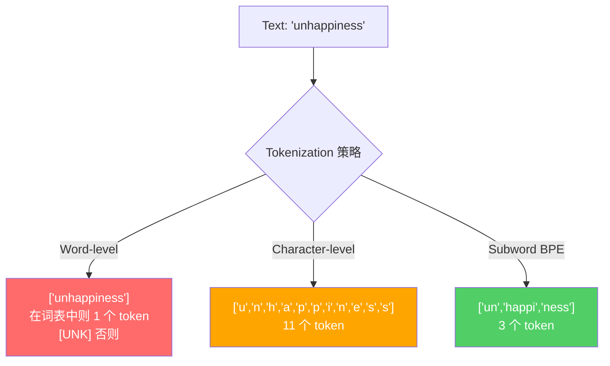
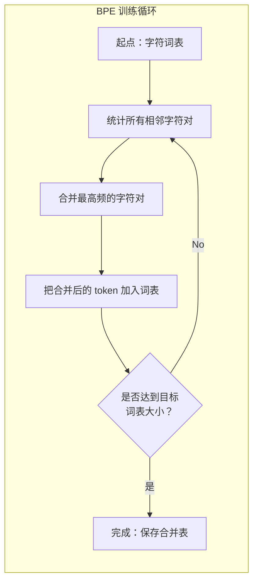
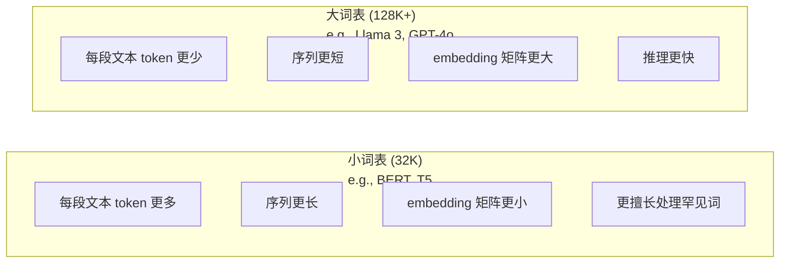

# Tokenizer：BPE、WordPiece、SentencePiece

> 译注：本文译自同目录 [`en.md`](./en.md)。术语遵循仓根 [TRANSLATION_GUIDE.md](../../../../TRANSLATION_GUIDE.md)。

> 你的 LLM 不读英文，它读整数。tokenizer 决定了这些整数是承载意义，还是把意义白白浪费掉。

**Type:** Build
**Languages:** Python
**Prerequisites:** Phase 05 (NLP Foundations)
**Time:** ~90 minutes

## 学习目标（Learning Objectives）

- 从零实现 BPE、WordPiece 和 Unigram 三种 tokenization 算法，并对比它们的合并策略
- 解释 vocabulary（词表）大小如何影响模型效率：太小导致序列过长，太大浪费 embedding 参数
- 分析 tokenization 在不同语言和代码上的产物，识别各类 tokenizer 在哪里崩盘
- 使用 tiktoken 和 sentencepiece 库对文本进行 tokenize，并观察生成的 token ID

## 问题（The Problem）

你的 LLM 不读英文，它也不读任何语言，它只读数字。

从 "Hello, world!" 到 [15496, 11, 995, 0] 之间的鸿沟，就是 tokenizer 在填。每个单词、每个空格、每个标点，在模型能处理它们之前，都必须先转换成整数。这种转换不是中立的，它会把一些假设永久地烤进模型，事后再也撕不下来。

搞砸了，你的模型就要花成倍的容量去编码常用词。"unfortunately" 变成 4 个 token 而不是 1 个。你那 128K 的 context window，对多音节词密集的文本而言，瞬间缩水 75%。搞对了，同一个 context window 能装下两倍的意义。"这模型代码处理得真不错"和"这模型一碰 Python 就卡死"之间的差距，往往就取决于 tokenizer 是怎么训练出来的。

你每一次调用 GPT-4 或 Claude 的 API，都按 token 计费。你的模型每生成一个 token，都在烧算力。表示同一段输出所需的 token 越少，端到端推理就越快。Tokenization 不是预处理，它是架构。

## 概念（The Concept）

### 三种失败的方案（和一个胜出的）

把文本变成数字，有三种显而易见的做法。其中两种规模一上来就崩了。

**Word-level tokenization（词级）** 按空格和标点切分。"The cat sat" 变成 ["The", "cat", "sat"]。简单。但 "tokenization" 怎么办？"GPT-4o" 怎么办？德语复合词 "Geschwindigkeitsbegrenzung"（限速）又怎么办？词级方案要求一个庞大的 vocabulary 去覆盖每种语言的每个单词。漏掉一个词，你就会得到那个臭名昭著的 `[UNK]` token——模型在说"我完全不知道这是什么"。光是英语就有超过一百万种词形。再加上代码、URL、科学计数法、还有另外一百种语言，你需要一个无限大的 vocabulary。

**Character-level tokenization（字符级）** 走另一个方向。"hello" 变成 ["h", "e", "l", "l", "o"]。Vocabulary 极小（几百个字符），永远不会有 unknown token。但序列变得极长。一个原本 10 个词级 token 的句子，会变成 50 个字符级 token。模型必须学会 "t"、"h"、"e" 拼一起表示 "the"——把 attention（注意力）容量烧在一个三岁小孩就能学会的东西上。

**Subword tokenization（子词级）** 找到了甜蜜点。常用词保持完整："the" 是 1 个 token。罕见词分解成有意义的片段："unhappiness" 变成 ["un", "happi", "ness"]。Vocabulary 保持可控（30K 到 128K 个 token），序列保持简短，unknown token 基本上消失了，因为任何词都能用 subword 片段拼出来。

每一个现代 LLM 都用 subword tokenization。GPT-2、GPT-4、BERT、Llama 3、Claude——全都是。问题只在于用哪个算法。



### BPE：Byte Pair Encoding

BPE 是一个被改造来做 tokenization 的贪心压缩算法。其思想简单到能写在一张索引卡上。

从单个字符开始。统计训练语料里每一对相邻字符的出现次数。把出现最频繁的那一对合并成一个新 token。重复，直到达到目标 vocabulary 大小。

下面是 BPE 在一个小语料上跑的样子，语料里只有 "lower"、"lowest" 和 "newest"：

```
Corpus (with word frequencies):
  "lower"  x5
  "lowest" x2
  "newest" x6

Step 0 -- Start with characters:
  l o w e r       (x5)
  l o w e s t     (x2)
  n e w e s t     (x6)

Step 1 -- Count adjacent pairs:
  (e,s): 8    (s,t): 8    (l,o): 7    (o,w): 7
  (w,e): 13   (e,r): 5    (n,e): 6    ...

Step 2 -- Merge most frequent pair (w,e) -> "we":
  l o we r        (x5)
  l o we s t      (x2)
  n e we s t      (x6)

Step 3 -- Recount and merge (e,s) -> "es":
  l o we r        (x5)
  l o we s t      (x2)    <- 'es' only forms from 'e'+'s', not 'we'+'s'
  n e we s t      (x6)    <- wait, the 'e' before 'we' and 's' after 'we'

Actually tracking this precisely:
  After "we" merge, remaining pairs:
  (l,o): 7   (o,we): 7   (we,r): 5   (we,s): 8
  (s,t): 8   (n,e): 6    (e,we): 6

Step 3 -- Merge (we,s) -> "wes" or (s,t) -> "st" (tied at 8, pick first):
  Merge (we,s) -> "wes":
  l o we r        (x5)
  l o wes t       (x2)
  n e wes t       (x6)

Step 4 -- Merge (wes,t) -> "west":
  l o we r        (x5)
  l o west        (x2)
  n e west        (x6)

...continue until target vocab size reached.
```

合并表（merge table）就是 tokenizer。要编码新文本，按合并被学到的顺序依次应用即可。训练语料决定了哪些合并会存在，而这个选择会永久地塑造模型所能看到的世界。



### Byte-Level BPE（GPT-2、GPT-3、GPT-4）

标准 BPE 在 Unicode 字符上工作。Byte-level BPE 在原始字节（0-255）上工作。这给你一个恰好为 256 的基础 vocabulary，能处理任何语言或编码，并且永远不会产生 unknown token。

GPT-2 引入了这个做法。基础 vocabulary 覆盖每一个可能的字节，BPE 合并在其之上构建。OpenAI 的 tiktoken 库实现了 byte-level BPE，对应的 vocabulary 大小如下：

- GPT-2: 50,257 tokens
- GPT-3.5/GPT-4: ~100,256 tokens（cl100k_base 编码）
- GPT-4o: 200,019 tokens（o200k_base 编码）

### WordPiece（BERT）

WordPiece 看起来跟 BPE 很像，但选择合并的方式不同。它不看原始频率，而是最大化训练数据的似然：

```
BPE merge criterion:      count(A, B)
WordPiece merge criterion: count(AB) / (count(A) * count(B))
```

BPE 问的是："哪一对出现得最频繁？"WordPiece 问的是："哪一对一起出现的频率，比随机情况下更高？"这个微妙的差别会产生不同的 vocabulary。WordPiece 偏爱共现"出乎意料"的合并，而不仅仅是频繁的合并。

WordPiece 还会用 "##" 前缀来标记延续型 subword：

```
"unhappiness" -> ["un", "##happi", "##ness"]
"embedding"   -> ["em", "##bed", "##ding"]
```

"##" 前缀告诉你这一片段是接在前一个 token 之后的延续。BERT 用 WordPiece，vocabulary 大小是 30,522 个 token。每个 BERT 变体——DistilBERT 也用 WordPiece，RoBERTa 的 tokenizer 其实是 BPE，但 BERT 本身是 WordPiece。

### SentencePiece（Llama、T5）

SentencePiece 把输入当作原始的 Unicode 字符流处理，连空格也算字符。没有预切分（pre-tokenization）步骤，没有针对具体语言的词边界规则。这让它真正做到了语言无关——它能在中文、日文、泰文以及其他不靠空格分词的语言上工作。

SentencePiece 支持两种算法：
- **BPE 模式**：与标准 BPE 相同的合并逻辑，作用在原始字符序列上
- **Unigram 模式**：从一个大 vocabulary 开始，迭代地移除那些对整体似然影响最小的 token。这是 BPE 的反向操作——剪枝而不是合并。

Llama 2 用 SentencePiece BPE，vocabulary 大小为 32,000 个 token。T5 用 SentencePiece Unigram，同样是 32,000 个 token。注意：Llama 3 已经切换到基于 tiktoken 的 byte-level BPE tokenizer，vocabulary 大小为 128,256 个 token。

### Vocabulary 大小的权衡

这是一个会带来可量化后果的真实工程决策。



具体数字。对于一个 vocabulary 为 128K、embedding 维度为 4,096 的模型，光是 embedding 矩阵就有 128,000 × 4,096 = 5.24 亿参数。如果 vocabulary 是 32K，那就是 1.31 亿参数。仅仅是 tokenizer 的选择，就带来了 4 亿参数的差距。

但更大的 vocabulary 对文本的压缩也更激进。同一段英文，32K vocabulary 可能要 100 个 token，128K vocabulary 可能只要 70 个。这意味着生成期间前向传播的次数减少了 30%。对于一个服务百万级请求的模型来说，这就是直接的算力成本下降。

趋势很明显：vocabulary 越来越大。GPT-2 是 50,257，GPT-4 是 ~100K，Llama 3 是 128K，GPT-4o 是 200K。

| Model | Vocab Size | Tokenizer Type | Avg Tokens per English Word |
|-------|-----------|----------------|---------------------------|
| BERT | 30,522 | WordPiece | ~1.4 |
| GPT-2 | 50,257 | Byte-level BPE | ~1.3 |
| Llama 2 | 32,000 | SentencePiece BPE | ~1.4 |
| GPT-4 | ~100,256 | Byte-level BPE | ~1.2 |
| Llama 3 | 128,256 | Byte-level BPE (tiktoken) | ~1.1 |
| GPT-4o | 200,019 | Byte-level BPE | ~1.0 |

### 多语言税

主要在英文上训练的 tokenizer，对其他语言相当残忍。GPT-2 的 tokenizer 处理韩语，平均每个词要 2-3 个 token。中文可能更糟。这意味着一个韩语用户实际上拥有的 context window 只有英语用户的一半——付一样的钱，却装更少的信息。

这就是为什么 Llama 3 把 vocabulary 从 32K 扩到了 128K，整整翻了四倍。更多 token 拨给非英语脚本，意味着跨语言之间的压缩更公平。

## 动手实现（Build It）

### Step 1：字符级 tokenizer

从根基开始。一个字符级 tokenizer 把每个字符映射到它的 Unicode 码点。无需训练，没有 unknown token，纯粹是直接映射。

```python
class CharTokenizer:
    def encode(self, text):
        return [ord(c) for c in text]

    def decode(self, tokens):
        return "".join(chr(t) for t in tokens)
```

"hello" 变成 [104, 101, 108, 108, 111]。每个字符都是它自己的 token。这是我们要在其上改进的基线。

### Step 2：从零实现 BPE Tokenizer

真正的实现。我们在原始字节上训练（像 GPT-2 那样），统计相邻对，合并最频繁的，并按顺序记录每一次合并。合并表就是 tokenizer。

```python
from collections import Counter

class BPETokenizer:
    def __init__(self):
        self.merges = {}
        self.vocab = {}

    def _get_pairs(self, tokens):
        pairs = Counter()
        for i in range(len(tokens) - 1):
            pairs[(tokens[i], tokens[i + 1])] += 1
        return pairs

    def _merge_pair(self, tokens, pair, new_token):
        merged = []
        i = 0
        while i < len(tokens):
            if i < len(tokens) - 1 and tokens[i] == pair[0] and tokens[i + 1] == pair[1]:
                merged.append(new_token)
                i += 2
            else:
                merged.append(tokens[i])
                i += 1
        return merged

    def train(self, text, num_merges):
        tokens = list(text.encode("utf-8"))
        self.vocab = {i: bytes([i]) for i in range(256)}

        for i in range(num_merges):
            pairs = self._get_pairs(tokens)
            if not pairs:
                break
            best_pair = max(pairs, key=pairs.get)
            new_token = 256 + i
            tokens = self._merge_pair(tokens, best_pair, new_token)
            self.merges[best_pair] = new_token
            self.vocab[new_token] = self.vocab[best_pair[0]] + self.vocab[best_pair[1]]

        return self

    def encode(self, text):
        tokens = list(text.encode("utf-8"))
        for pair, new_token in self.merges.items():
            tokens = self._merge_pair(tokens, pair, new_token)
        return tokens

    def decode(self, tokens):
        byte_sequence = b"".join(self.vocab[t] for t in tokens)
        return byte_sequence.decode("utf-8", errors="replace")
```

训练循环就是 BPE 的核心：统计对，合并赢家，重复。每次合并都会减少总的 token 数。`num_merges` 轮之后，vocabulary 从 256（基础字节）增长到 256 + num_merges。

编码时严格按合并被学到的顺序应用。这一点很关键。如果合并 1 创建了 "th"，合并 5 创建了 "the"，那么编码时必须先应用合并 1，这样在合并 5 中 "the" 才能由 "th" + "e" 拼出来。

解码是逆过程：在 vocabulary 里查每个 token ID，把字节拼起来，再解码成 UTF-8。

### Step 3：编码 / 解码往返

```python
corpus = (
    "The cat sat on the mat. The cat ate the rat. "
    "The dog sat on the log. The dog ate the frog. "
    "Natural language processing is the study of how computers "
    "understand and generate human language. "
    "Tokenization is the first step in any NLP pipeline."
)

tokenizer = BPETokenizer()
tokenizer.train(corpus, num_merges=40)

test_sentences = [
    "The cat sat on the mat.",
    "Natural language processing",
    "tokenization pipeline",
    "unhappiness",
]

for sentence in test_sentences:
    encoded = tokenizer.encode(sentence)
    decoded = tokenizer.decode(encoded)
    raw_bytes = len(sentence.encode("utf-8"))
    ratio = len(encoded) / raw_bytes
    print(f"'{sentence}'")
    print(f"  Tokens: {len(encoded)} (from {raw_bytes} bytes) -- ratio: {ratio:.2f}")
    print(f"  Roundtrip: {'PASS' if decoded == sentence else 'FAIL'}")
```

压缩率告诉你 tokenizer 有多有效。0.50 的比例意味着 tokenizer 把文本压到了原始字节数的一半。越低越好。在训练语料上，比例会很漂亮。在分布外文本上（比如 "unhappiness" 没出现在语料里），比例会变差——对于没见过的模式，tokenizer 会回退到字符级编码。

### Step 4：和 tiktoken 对比

```python
import tiktoken

enc = tiktoken.get_encoding("cl100k_base")

texts = [
    "The cat sat on the mat.",
    "unhappiness",
    "Hello, world!",
    "def fibonacci(n): return n if n < 2 else fibonacci(n-1) + fibonacci(n-2)",
    "Geschwindigkeitsbegrenzung",
]

for text in texts:
    our_tokens = tokenizer.encode(text)
    tiktoken_tokens = enc.encode(text)
    tiktoken_pieces = [enc.decode([t]) for t in tiktoken_tokens]
    print(f"'{text}'")
    print(f"  Our BPE:   {len(our_tokens)} tokens")
    print(f"  tiktoken:  {len(tiktoken_tokens)} tokens -> {tiktoken_pieces}")
```

tiktoken 用的是完全相同的算法，但训练数据是几百 GB，合并次数是 100,000 次。算法本身一模一样。差别在于训练数据和合并次数。你这个在一段文字上训练、只跑了 40 次合并的 tokenizer，没法和 tiktoken 在海量语料上跑出 10 万次合并的结果硬碰硬。但机制是一样的。

### Step 5：Vocabulary 分析

```python
def analyze_vocabulary(tokenizer, test_texts):
    total_tokens = 0
    total_chars = 0
    token_usage = Counter()

    for text in test_texts:
        encoded = tokenizer.encode(text)
        total_tokens += len(encoded)
        total_chars += len(text)
        for t in encoded:
            token_usage[t] += 1

    print(f"Vocabulary size: {len(tokenizer.vocab)}")
    print(f"Total tokens across all texts: {total_tokens}")
    print(f"Total characters: {total_chars}")
    print(f"Avg tokens per character: {total_tokens / total_chars:.2f}")

    print(f"\nMost used tokens:")
    for token_id, count in token_usage.most_common(10):
        token_bytes = tokenizer.vocab[token_id]
        display = token_bytes.decode("utf-8", errors="replace")
        print(f"  Token {token_id:4d}: '{display}' (used {count} times)")

    unused = [t for t in tokenizer.vocab if t not in token_usage]
    print(f"\nUnused tokens: {len(unused)} out of {len(tokenizer.vocab)}")
```

这能揭示你 vocabulary 里的 Zipf 分布。少数几个 token（空格、"the"、"e"）占据主导，大多数 token 很少被用到。生产级 tokenizer 会针对这个分布做优化——常见模式拿短的 token ID，罕见模式用更长的表示。

## 用起来（Use It）

你那个从零写的 BPE 已经能用了。现在看看生产工具长什么样。

### tiktoken（OpenAI）

```python
import tiktoken

enc = tiktoken.get_encoding("cl100k_base")

text = "Tokenizers convert text to integers"
tokens = enc.encode(text)
print(f"Tokens: {tokens}")
print(f"Pieces: {[enc.decode([t]) for t in tokens]}")
print(f"Roundtrip: {enc.decode(tokens)}")
```

tiktoken 用 Rust 写成，提供 Python 绑定。它每秒能编码上百万个 token。同样的 BPE 算法，工业级的实现。

### Hugging Face tokenizers

```python
from tokenizers import Tokenizer
from tokenizers.models import BPE
from tokenizers.trainers import BpeTrainer
from tokenizers.pre_tokenizers import ByteLevel

tokenizer = Tokenizer(BPE())
tokenizer.pre_tokenizer = ByteLevel()

trainer = BpeTrainer(vocab_size=1000, special_tokens=["<pad>", "<eos>", "<unk>"])
tokenizer.train(["corpus.txt"], trainer)

output = tokenizer.encode("The cat sat on the mat.")
print(f"Tokens: {output.tokens}")
print(f"IDs: {output.ids}")
```

Hugging Face 的 tokenizers 库底层也是 Rust。它能在几秒内对 GB 级语料训练 BPE。这是你训练自己的模型时会用的工具。

### 加载 Llama 的 Tokenizer

```python
from transformers import AutoTokenizer

tokenizer = AutoTokenizer.from_pretrained("meta-llama/Llama-3.1-8B")

text = "Tokenizers are the unsung heroes of LLMs"
tokens = tokenizer.encode(text)
print(f"Token IDs: {tokens}")
print(f"Tokens: {tokenizer.convert_ids_to_tokens(tokens)}")
print(f"Vocab size: {tokenizer.vocab_size}")

multilingual = ["Hello world", "Hola mundo", "Bonjour le monde"]
for text in multilingual:
    ids = tokenizer.encode(text)
    print(f"'{text}' -> {len(ids)} tokens")
```

Llama 3 的 128K vocabulary 在压缩非英文文本上明显比 GPT-2 的 50K vocabulary 强得多。你可以亲自验证——把同一句话翻成几种语言，然后数 token 数。

## 上线部署（Ship It）

这一课产出 `outputs/prompt-tokenizer-analyzer.md`——一个可复用的 prompt，能针对任意文本和模型组合分析 tokenization 效率。喂给它一段文本，它告诉你哪个模型的 tokenizer 处理得最好。

## 练习（Exercises）

1. 修改 BPE tokenizer，让它在每一步合并后打印 vocabulary。看着 "t" + "h" 变成 "th"，再看 "th" + "e" 变成 "the"。跟踪常见英文词如何被一片一片地拼起来。

2. 给 BPE tokenizer 加上特殊 token（`<pad>`、`<eos>`、`<unk>`）。把它们的 ID 设为 0、1、2，并把所有其他 token 相应平移。实现一个预切分（pre-tokenization）步骤，在跑 BPE 之前先按空格切分。

3. 实现 WordPiece 的合并准则（用似然比代替频率）。在同一个语料上、用相同的合并次数训练 BPE 和 WordPiece，对比得到的 vocabulary——哪个产生了语言学上更有意义的 subword？

4. 构建一个多语言 tokenizer 效率基准。取英文、西班牙文、中文、韩文、阿拉伯文各 10 句话，分别用 tiktoken（cl100k_base）做 tokenize，测量平均每字符的 token 数。给每种语言量化它的"多语言税"。

5. 在更大的语料上训练你的 BPE tokenizer（下载一篇 Wikipedia 文章）。调整合并次数，使你在同一段文本上的压缩率与 tiktoken 的差距在 10% 以内。这会逼你理解语料规模、合并次数和压缩质量三者之间的关系。

## 关键术语（Key Terms）

| Term | What people say | What it actually means |
|------|----------------|----------------------|
| Token | "一个词" | 模型 vocabulary 中的一个单位——可以是字符、subword、单词，或多词块 |
| BPE | "某种压缩玩意儿" | Byte Pair Encoding——迭代地合并出现最频繁的相邻 token 对，直到达到目标 vocabulary 大小 |
| WordPiece | "BERT 的 tokenizer" | 类似 BPE，但合并准则最大化似然比 count(AB)/(count(A)*count(B))，而不是原始频率 |
| SentencePiece | "一个 tokenizer 库" | 一个语言无关的 tokenizer，作用于原始 Unicode、不需要预切分，支持 BPE 和 Unigram 算法 |
| Vocabulary size | "它认识多少词" | 唯一 token 的总数：GPT-2 有 50,257 个，BERT 有 30,522 个，Llama 3 有 128,256 个 |
| Fertility | "不是 tokenizer 的术语吧" | 每个词平均的 token 数——衡量 tokenizer 在不同语言上的效率（1.0 是完美，3.0 意味着模型要多干三倍的活） |
| Byte-level BPE | "GPT 的 tokenizer" | 在原始字节（0-255）上跑 BPE 而不是 Unicode 字符，对任何输入都不会产生 unknown token |
| Merge table | "tokenizer 文件" | 训练期间学到的合并对的有序列表——这就是 tokenizer，顺序至关重要 |
| Pre-tokenization | "按空格切" | 在 subword tokenization 之前应用的规则：按空格切分、数字分离、标点处理 |
| Compression ratio | "tokenizer 多高效" | 产生的 token 数除以输入字节数——越低意味着压缩越好、推理越快 |

## 延伸阅读（Further Reading）

- [Sennrich et al., 2016 -- "Neural Machine Translation of Rare Words with Subword Units"](https://arxiv.org/abs/1508.07909) —— 把 BPE 引入 NLP 的论文，把 1994 年的一个压缩算法变成了现代 tokenization 的根基
- [Kudo & Richardson, 2018 -- "SentencePiece: A simple and language independent subword tokenizer"](https://arxiv.org/abs/1808.06226) —— 让多语言模型变得可行的语言无关 tokenization
- [OpenAI tiktoken repository](https://github.com/openai/tiktoken) —— 用 Rust 写成、带 Python 绑定的生产级 BPE 实现，被 GPT-3.5/4/4o 使用
- [Hugging Face Tokenizers documentation](https://huggingface.co/docs/tokenizers) —— 拥有 Rust 性能的生产级 tokenizer 训练工具
