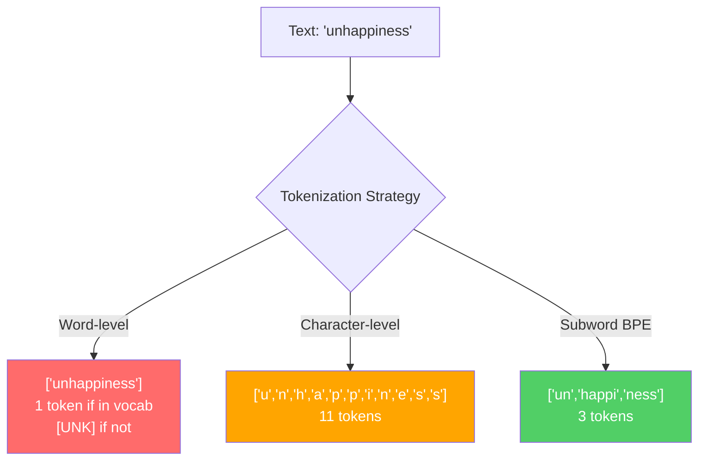
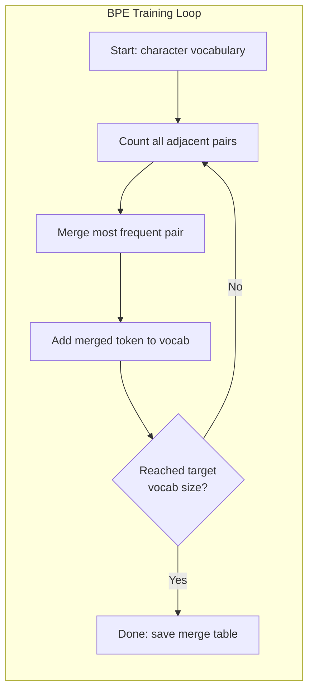
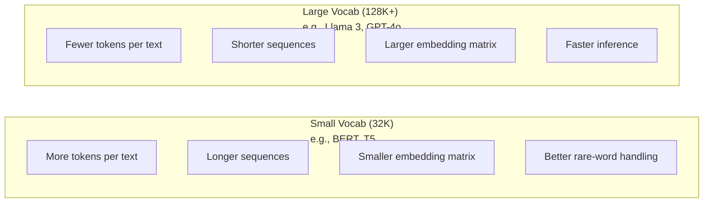

# 01 · 分词器：BPE、WordPiece 与 SentencePiece

> 你的大语言模型（LLM）读不懂英文，它读的是整数。分词器（tokenizer）决定了这些整数究竟承载意义，还是白白浪费。

**类型：** 实践构建
**语言：** Python
**前置：** 阶段 05（NLP 基础）
**时长：** 约 90 分钟

## 学习目标

- 从零实现 BPE、WordPiece 与 Unigram 三种分词算法，并比较它们的合并策略
- 解释词表大小（vocabulary size）如何影响模型效率：太小会导致序列过长，太大则浪费嵌入参数
- 分析不同语言与代码中的分词产物（tokenization artifacts），找出特定分词器在哪里崩坏
- 使用 tiktoken 与 sentencepiece 库对文本分词，并检视生成的 token ID

## 问题所在

你的大语言模型读不懂英文，它读不懂任何语言，它读的是数字。

从 "Hello, world!" 到 [15496, 11, 995, 0] 之间的鸿沟，正是分词器。每一个单词、每一个空格、每一个标点符号，都必须先转换成整数，模型才能处理。这种转换并非中立无害，它会把某些假设固化进模型，事后再也无法撤销。

弄错了，你的模型就会浪费容量，用多个 token 去编码常见词。"unfortunately" 变成四个 token 而非一个。你那 128K 的上下文窗口，面对多音节词密集的文本，瞬间缩水 75%。弄对了，同样的上下文窗口能容纳两倍的意义。"这个模型代码处理得很好" 与 "这个模型在 Python 上卡死" 之间的差距，往往取决于分词器是如何训练的。

你对 GPT-4 或 Claude 发起的每一次 API 调用，都是按 token 计价的。你的模型生成的每一个 token 都要消耗算力。表示同一段输出所需的 token 越少，端到端推理就越快。分词不是预处理，它是架构。

## 核心概念

### 三种失败的方案（与一种胜出的方案）

把文本转成数字，有三种显而易见的方式，其中两种在规模化时根本行不通。

**词级分词（Word-level tokenization）** 按空格和标点切分。"The cat sat" 变成 ["The", "cat", "sat"]。简单。但 "tokenization" 怎么办？或者 "GPT-4o"？又或者一个德语复合词 "Geschwindigkeitsbegrenzung"？词级分词需要一个庞大的词表，才能覆盖每种语言里的每个单词。漏掉一个词，你就会得到那个可怕的 `[UNK]` token——模型在说 "我完全不知道这是什么"。仅英语就有超过一百万种词形。再加上代码、URL、科学计数法和另外 100 种语言，你需要一个无限大的词表。

**字符级分词（Character-level tokenization）** 走向另一个极端。"hello" 变成 ["h", "e", "l", "l", "o"]。词表极小（几百个字符）。永远不会出现未知 token。但序列会变得极长。一句词级分词只需 10 个 token 的句子，字符级要 50 个 token。模型必须学会 "t"、"h"、"e" 连在一起就是 "the"——把注意力容量烧在一个人类三岁就学会的事情上。

**子词分词（Subword tokenization）** 找到了甜蜜点。常见词保持完整："the" 是一个 token。罕见词分解成有意义的片段："unhappiness" 变成 ["un", "happi", "ness"]。词表保持可控（30K 到 128K 个 token）。序列保持简短。未知 token 基本消失，因为任何单词都能用子词片段拼出来。

每一个现代大语言模型都使用子词分词。GPT-2、GPT-4、BERT、Llama 3、Claude——全都如此。问题只在于用哪种算法。



### BPE：字节对编码（Byte Pair Encoding）

BPE 是一种被改造用于分词的贪心压缩算法。它的思想简单到能写在一张索引卡片上。

从单个字符开始。统计训练语料中每一对相邻的字符对。把出现频率最高的字符对合并成一个新 token。重复，直到达到目标词表大小。

下面是 BPE 在一个小语料上运行的过程，语料含 "lower"、"lowest" 和 "newest" 三个词：

```
Corpus (with word frequencies):
  "lower"  x5
  "lowest" x2
  "newest" x6

Step 0 -- Start with characters:
  l o w e r       (x5)
  l o w e s t     (x2)
  n e w e s t     (x6)

Step 1 -- Count adjacent pairs:
  (e,s): 8    (s,t): 8    (l,o): 7    (o,w): 7
  (w,e): 13   (e,r): 5    (n,e): 6    ...

Step 2 -- Merge most frequent pair (w,e) -> "we":
  l o we r        (x5)
  l o we s t      (x2)
  n e we s t      (x6)

Step 3 -- Recount and merge (e,s) -> "es":
  l o we r        (x5)
  l o we s t      (x2)    <- 'es' only forms from 'e'+'s', not 'we'+'s'
  n e we s t      (x6)    <- wait, the 'e' before 'we' and 's' after 'we'

Actually tracking this precisely:
  After "we" merge, remaining pairs:
  (l,o): 7   (o,we): 7   (we,r): 5   (we,s): 8
  (s,t): 8   (n,e): 6    (e,we): 6

Step 3 -- Merge (we,s) -> "wes" or (s,t) -> "st" (tied at 8, pick first):
  Merge (we,s) -> "wes":
  l o we r        (x5)
  l o wes t       (x2)
  n e wes t       (x6)

Step 4 -- Merge (wes,t) -> "west":
  l o we r        (x5)
  l o west        (x2)
  n e west        (x6)

...continue until target vocab size reached.
```

合并表（merge table）就是分词器本身。要编码新文本，按照合并被学到的顺序逐一应用。训练语料决定了存在哪些合并，而这个选择会永久性地塑造模型所看到的一切。



### 字节级 BPE（GPT-2、GPT-3、GPT-4）

标准 BPE 在 Unicode 字符上操作。字节级 BPE（Byte-level BPE）则在原始字节（0-255）上操作。这给了你一个恰好为 256 的基础词表，能处理任何语言或编码，并且永远不会产生未知 token。

GPT-2 引入了这一方法。基础词表覆盖每一个可能的字节，BPE 合并在此之上构建。OpenAI 的 tiktoken 库实现了字节级 BPE，词表大小如下：

- GPT-2：50,257 个 token
- GPT-3.5/GPT-4：约 100,256 个 token（cl100k_base 编码）
- GPT-4o：200,019 个 token（o200k_base 编码）

### WordPiece（BERT）

WordPiece 看起来与 BPE 相似，但选择合并的方式不同。它不依据原始频率，而是最大化训练数据的似然（likelihood）：

```
BPE merge criterion:      count(A, B)
WordPiece merge criterion: count(AB) / (count(A) * count(B))
```

BPE 问的是："哪一对出现得最频繁？" WordPiece 问的是："哪一对一起出现的频率，超过了随机情况下你所预期的？" 这个微妙的差异会产生不同的词表。WordPiece 偏爱那些共现出乎意料的合并，而不仅仅是频繁的合并。

WordPiece 还用 "##" 前缀来标记续接子词（continuation subword）：

```
"unhappiness" -> ["un", "##happi", "##ness"]
"embedding"   -> ["em", "##bed", "##ding"]
```

"##" 前缀告诉你这个片段是前一个 token 的延续。BERT 使用 WordPiece，词表为 30,522 个 token。每一个 BERT 变体——DistilBERT——RoBERTa 的分词器其实是 BPE，但 BERT 本身用的是 WordPiece。

### SentencePiece（Llama、T5）

SentencePiece 把输入视为一条原始的 Unicode 字符流，包括空白字符在内。没有预分词（pre-tokenization）步骤。没有关于词边界的语言特定规则。这让它真正做到了语言无关——它能处理中文、日文、泰文，以及其他不用空格分隔单词的语言。

SentencePiece 支持两种算法：
- **BPE 模式**：与标准 BPE 相同的合并逻辑，应用于原始字符序列
- **Unigram 模式**：从一个大词表开始，迭代地移除那些对整体似然影响最小的 token。它是 BPE 的反向操作——剪枝而非合并。

Llama 2 使用 SentencePiece BPE，词表为 32,000 个 token。T5 使用 SentencePiece Unigram，词表为 32,000 个 token。注意：Llama 3 改用了基于 tiktoken 的字节级 BPE 分词器，词表为 128,256 个 token。

### 词表大小的权衡

这是一个有着可量化后果的真实工程决策。



具体数字。对于一个 128K 词表、4,096 维嵌入的模型，仅嵌入矩阵就是 128,000 x 4,096 = 5.24 亿参数。对于 32K 词表，则是 1.31 亿参数。仅仅因为分词器的选择，就相差 4 亿参数。

但更大的词表能更激进地压缩文本。同一段英文段落，用 32K 词表需要 100 个 token，用 128K 词表可能只需 70 个 token。这意味着生成时少了 30% 的前向传播。对于一个服务数百万请求的模型，这是算力成本的直接削减。

趋势很明确：词表正在变大。GPT-2 用 50,257。GPT-4 用约 100K。Llama 3 用 128K。GPT-4o 用 200K。

| 模型 | 词表大小 | 分词器类型 | 每个英文单词平均 token 数 |
|-------|-----------|----------------|---------------------------|
| BERT | 30,522 | WordPiece | ~1.4 |
| GPT-2 | 50,257 | Byte-level BPE | ~1.3 |
| Llama 2 | 32,000 | SentencePiece BPE | ~1.4 |
| GPT-4 | ~100,256 | Byte-level BPE | ~1.2 |
| Llama 3 | 128,256 | Byte-level BPE (tiktoken) | ~1.1 |
| GPT-4o | 200,019 | Byte-level BPE | ~1.0 |

### 多语言税

主要基于英语训练的分词器，对其他语言极不友好。韩文在 GPT-2 分词器里平均每个词要 2-3 个 token。中文可能更糟。这意味着一个韩文用户实际拥有的上下文窗口，只有英文用户的一半大小——付着同样的价钱，却换来更低的信息密度。

这就是为什么 Llama 3 把词表从 32K 翻了四倍到 128K。更多 token 投向非英语文字，意味着跨语言的压缩更公平。

## 动手构建

### 第 1 步：字符级分词器

从根基开始。字符级分词器把每个字符映射到它的 Unicode 码点（code point）。无需训练。没有未知 token。只是一个直接的映射。

```python
class CharTokenizer:
    def encode(self, text):
        return [ord(c) for c in text]

    def decode(self, tokens):
        return "".join(chr(t) for t in tokens)
```

"hello" 变成 [104, 101, 108, 108, 111]。每个字符就是它自己的 token。这是我们要在其之上改进的基线。

### 第 2 步：从零实现 BPE 分词器

真正的实现。我们在原始字节上训练（像 GPT-2 那样），统计字符对，合并最频繁的那一对，并按顺序记录每一次合并。合并表就是分词器。

```python
from collections import Counter

class BPETokenizer:
    def __init__(self):
        self.merges = {}
        self.vocab = {}

    def _get_pairs(self, tokens):
        pairs = Counter()
        for i in range(len(tokens) - 1):
            pairs[(tokens[i], tokens[i + 1])] += 1
        return pairs

    def _merge_pair(self, tokens, pair, new_token):
        merged = []
        i = 0
        while i < len(tokens):
            if i < len(tokens) - 1 and tokens[i] == pair[0] and tokens[i + 1] == pair[1]:
                merged.append(new_token)
                i += 2
            else:
                merged.append(tokens[i])
                i += 1
        return merged

    def train(self, text, num_merges):
        tokens = list(text.encode("utf-8"))
        self.vocab = {i: bytes([i]) for i in range(256)}

        for i in range(num_merges):
            pairs = self._get_pairs(tokens)
            if not pairs:
                break
            best_pair = max(pairs, key=pairs.get)
            new_token = 256 + i
            tokens = self._merge_pair(tokens, best_pair, new_token)
            self.merges[best_pair] = new_token
            self.vocab[new_token] = self.vocab[best_pair[0]] + self.vocab[best_pair[1]]

        return self

    def encode(self, text):
        tokens = list(text.encode("utf-8"))
        for pair, new_token in self.merges.items():
            tokens = self._merge_pair(tokens, pair, new_token)
        return tokens

    def decode(self, tokens):
        byte_sequence = b"".join(self.vocab[t] for t in tokens)
        return byte_sequence.decode("utf-8", errors="replace")
```

训练循环是 BPE 的核心：统计字符对，合并胜出者，重复。每一次合并都减少 token 总数。经过 `num_merges` 轮后，词表从 256（基础字节）增长到 256 + num_merges。

编码严格按照合并被学到的顺序应用。这一点很关键。如果合并 1 创建了 "th"，合并 5 创建了 "the"，那么编码时必须先应用合并 1，这样 "the" 才能在合并 5 中由 "th" + "e" 形成。

解码是逆过程：在词表中查找每个 token ID，拼接字节，解码为 UTF-8。

### 第 3 步：编码与解码的往返

```python
corpus = (
    "The cat sat on the mat. The cat ate the rat. "
    "The dog sat on the log. The dog ate the frog. "
    "Natural language processing is the study of how computers "
    "understand and generate human language. "
    "Tokenization is the first step in any NLP pipeline."
)

tokenizer = BPETokenizer()
tokenizer.train(corpus, num_merges=40)

test_sentences = [
    "The cat sat on the mat.",
    "Natural language processing",
    "tokenization pipeline",
    "unhappiness",
]

for sentence in test_sentences:
    encoded = tokenizer.encode(sentence)
    decoded = tokenizer.decode(encoded)
    raw_bytes = len(sentence.encode("utf-8"))
    ratio = len(encoded) / raw_bytes
    print(f"'{sentence}'")
    print(f"  Tokens: {len(encoded)} (from {raw_bytes} bytes) -- ratio: {ratio:.2f}")
    print(f"  Roundtrip: {'PASS' if decoded == sentence else 'FAIL'}")
```

压缩比（compression ratio）告诉你分词器有多有效。0.50 的比值意味着分词器把文本压缩到了原始字节数一半的 token 数。越低越好。在训练语料上，比值会很好。但在分布外（out-of-distribution）的文本上，比如 "unhappiness"（它没有出现在语料中），比值会更糟——对于没见过的模式，分词器会退化为字符级编码。

### 第 4 步：与 tiktoken 对比

```python
import tiktoken

enc = tiktoken.get_encoding("cl100k_base")

texts = [
    "The cat sat on the mat.",
    "unhappiness",
    "Hello, world!",
    "def fibonacci(n): return n if n < 2 else fibonacci(n-1) + fibonacci(n-2)",
    "Geschwindigkeitsbegrenzung",
]

for text in texts:
    our_tokens = tokenizer.encode(text)
    tiktoken_tokens = enc.encode(text)
    tiktoken_pieces = [enc.decode([t]) for t in tiktoken_tokens]
    print(f"'{text}'")
    print(f"  Our BPE:   {len(our_tokens)} tokens")
    print(f"  tiktoken:  {len(tiktoken_tokens)} tokens -> {tiktoken_pieces}")
```

tiktoken 用的是完全相同的算法，但训练于数百 GB 的文本，做了 100,000 次合并。算法是一样的。差别在于训练数据和合并次数。你那个在一个段落上、用 40 次合并训练出来的分词器，无法与 tiktoken 在海量语料上的 10 万次合并相比。但机制是相同的。

### 第 5 步：词表分析

```python
def analyze_vocabulary(tokenizer, test_texts):
    total_tokens = 0
    total_chars = 0
    token_usage = Counter()

    for text in test_texts:
        encoded = tokenizer.encode(text)
        total_tokens += len(encoded)
        total_chars += len(text)
        for t in encoded:
            token_usage[t] += 1

    print(f"Vocabulary size: {len(tokenizer.vocab)}")
    print(f"Total tokens across all texts: {total_tokens}")
    print(f"Total characters: {total_chars}")
    print(f"Avg tokens per character: {total_tokens / total_chars:.2f}")

    print(f"\nMost used tokens:")
    for token_id, count in token_usage.most_common(10):
        token_bytes = tokenizer.vocab[token_id]
        display = token_bytes.decode("utf-8", errors="replace")
        print(f"  Token {token_id:4d}: '{display}' (used {count} times)")

    unused = [t for t in tokenizer.vocab if t not in token_usage]
    print(f"\nUnused tokens: {len(unused)} out of {len(tokenizer.vocab)}")
```

这揭示了你词表中的齐普夫分布（Zipf distribution）。少数 token 占据主导地位（空格、"the"、"e"）。大多数 token 极少被用到。生产级分词器会针对这种分布优化——常见模式拿到短的 token ID，罕见模式则用更长的表示。

## 上手使用

你从零写的 BPE 跑通了。现在看看生产级工具长什么样。

### tiktoken（OpenAI）

```python
import tiktoken

enc = tiktoken.get_encoding("cl100k_base")

text = "Tokenizers convert text to integers"
tokens = enc.encode(text)
print(f"Tokens: {tokens}")
print(f"Pieces: {[enc.decode([t]) for t in tokens]}")
print(f"Roundtrip: {enc.decode(tokens)}")
```

tiktoken 用 Rust 编写，带 Python 绑定。它每秒能编码数百万个 token。同样的 BPE 算法，工业强度的实现。

### Hugging Face tokenizers

```python
from tokenizers import Tokenizer
from tokenizers.models import BPE
from tokenizers.trainers import BpeTrainer
from tokenizers.pre_tokenizers import ByteLevel

tokenizer = Tokenizer(BPE())
tokenizer.pre_tokenizer = ByteLevel()

trainer = BpeTrainer(vocab_size=1000, special_tokens=["<pad>", "<eos>", "<unk>"])
tokenizer.train(["corpus.txt"], trainer)

output = tokenizer.encode("The cat sat on the mat.")
print(f"Tokens: {output.tokens}")
print(f"IDs: {output.ids}")
```

Hugging Face tokenizers 库底层同样是 Rust。它能在几秒内于 GB 级语料上训练 BPE。当你要训练自己的模型时，用的就是它。

### 加载 Llama 的分词器

```python
from transformers import AutoTokenizer

tokenizer = AutoTokenizer.from_pretrained("meta-llama/Llama-3.1-8B")

text = "Tokenizers are the unsung heroes of LLMs"
tokens = tokenizer.encode(text)
print(f"Token IDs: {tokens}")
print(f"Tokens: {tokenizer.convert_ids_to_tokens(tokens)}")
print(f"Vocab size: {tokenizer.vocab_size}")

multilingual = ["Hello world", "Hola mundo", "Bonjour le monde"]
for text in multilingual:
    ids = tokenizer.encode(text)
    print(f"'{text}' -> {len(ids)} tokens")
```

Llama 3 的 128K 词表对非英语文本的压缩，明显优于 GPT-2 的 50K 词表。你可以自己验证——用多种语言编码同一句话，数一数 token 数。

## 交付成果

本课会产出 `outputs/prompt-tokenizer-analyzer.md`——一个可复用的提示词（prompt），能针对任意文本与模型组合分析分词效率。给它一段文本样本，它会告诉你哪个模型的分词器处理得最好。

## 练习

1. 修改 BPE 分词器，让它在每一步合并时打印词表。观察 "t" + "h" 如何变成 "th"，然后 "th" + "e" 又如何变成 "the"。追踪常见英文单词是如何被一片片拼装起来的。

2. 给 BPE 分词器添加特殊 token（`<pad>`、`<eos>`、`<unk>`）。把它们的 ID 分别设为 0、1、2，并相应地移动所有其他 token。实现一个预分词步骤，在运行 BPE 之前先按空白字符切分。

3. 实现 WordPiece 的合并准则（用似然比而非频率）。在同一语料上、用相同的合并次数，分别训练 BPE 和 WordPiece。比较得到的词表——哪一个产生的子词在语言学上更有意义？

4. 构建一个多语言分词器效率基准测试。取英语、西班牙语、中文、韩语和阿拉伯语各 10 句。用 tiktoken（cl100k_base）分别分词，测量每个字符的平均 token 数。量化每种语言的"多语言税"。

5. 在更大的语料上训练你的 BPE 分词器（下载一篇维基百科文章）。调整合并次数，使其在同一文本上达到与 tiktoken 相差 10% 以内的压缩比。这会迫使你理解语料规模、合并次数与压缩质量之间的关系。

## 关键术语

| 术语 | 大家通常怎么说 | 实际含义 |
|------|----------------|----------------------|
| Token（词元） | "一个单词" | 模型词表中的一个单位——可以是字符、子词、单词或多词块 |
| BPE | "某种压缩玩意儿" | 字节对编码（Byte Pair Encoding）——迭代地合并最频繁的相邻 token 对，直到达到目标词表大小 |
| WordPiece | "BERT 的分词器" | 类似 BPE，但合并最大化似然比 count(AB)/(count(A)*count(B))，而非原始频率 |
| SentencePiece | "一个分词器库" | 一种语言无关的分词器，在原始 Unicode 上操作而无需预分词，支持 BPE 和 Unigram 算法 |
| Vocabulary size（词表大小） | "它认识多少个词" | 唯一 token 的总数：GPT-2 有 50,257，BERT 有 30,522，Llama 3 有 128,256 |
| Fertility（繁殖度） | "这不是分词术语" | 每个单词的平均 token 数——衡量分词器跨语言的效率（1.0 完美，3.0 意味着模型要多干三倍的活） |
| Byte-level BPE（字节级 BPE） | "GPT 的分词器" | 在原始字节（0-255）而非 Unicode 字符上操作的 BPE，保证对任何输入都不产生未知 token |
| Merge table（合并表） | "那个分词器文件" | 训练期间学到的、有序的字符对合并列表——它就是分词器，且顺序至关重要 |
| Pre-tokenization（预分词） | "按空格切分" | 在子词分词之前应用的规则：空白切分、数字分离、标点处理 |
| Compression ratio（压缩比） | "分词器有多高效" | 产出的 token 数除以输入字节数——越低意味着压缩越好、推理越快 |

## 延伸阅读

- [Sennrich 等，2016——《Neural Machine Translation of Rare Words with Subword Units》](https://arxiv.org/abs/1508.07909)——将 BPE 引入 NLP 的论文，把一个 1994 年的压缩算法变成了现代分词的基石
- [Kudo & Richardson，2018——《SentencePiece: A simple and language independent subword tokenizer》](https://arxiv.org/abs/1808.06226)——语言无关的分词，让多语言模型变得切实可行
- [OpenAI tiktoken 仓库](https://github.com/openai/tiktoken)——用 Rust 实现、带 Python 绑定的生产级 BPE，供 GPT-3.5/4/4o 使用
- [Hugging Face Tokenizers 文档](https://huggingface.co/docs/tokenizers)——具备 Rust 性能的生产级分词器训练
