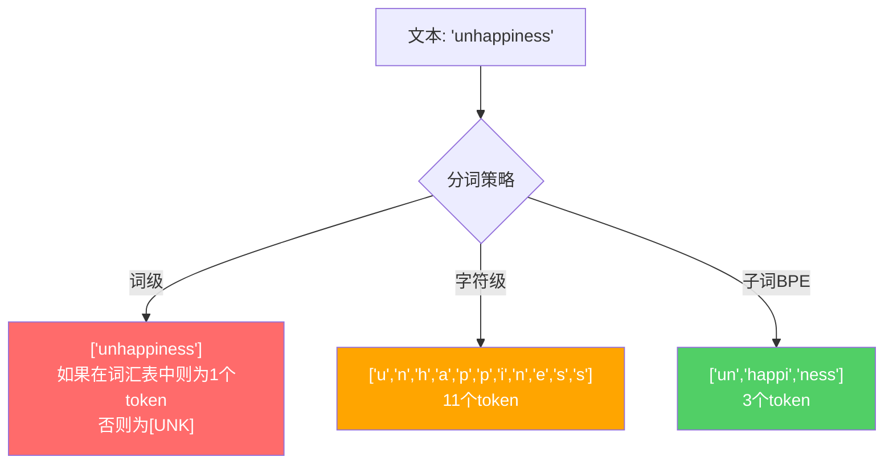
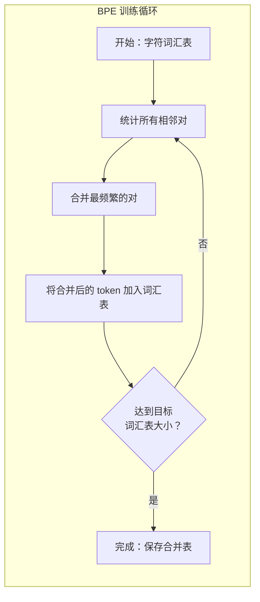
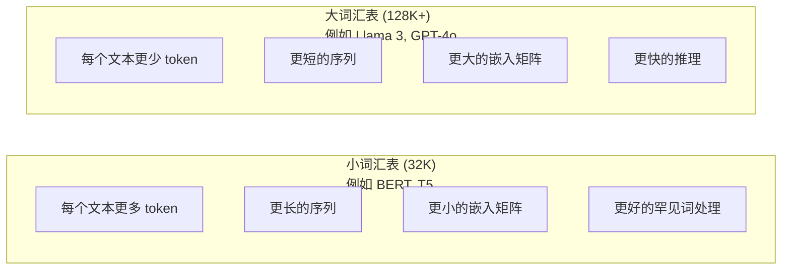

# Tokenizers: BPE, WordPiece, SentencePiece

> 你的大语言模型（LLM）并不阅读英文。它阅读的是整数。分词器（Tokenizer）决定了这些整数承载意义还是浪费意义。

**类型：** 构建  
**语言：** Python  
**前置条件：** 阶段 05（自然语言处理基础）  
**预计时间：** ~90 分钟

## 学习目标

- 从零实现 BPE、WordPiece 和 Unigram 分词算法，并比较它们的合并策略
- 解释词汇表大小如何影响模型效率：过小会产生长序列，过大则会浪费嵌入参数
- 分析跨语言和代码的分词产物，识别特定分词器失效的场景
- 使用 tiktoken 和 sentencepiece 库对文本进行分词，并检查生成的 token ID

## 问题

你的 LLM 并不阅读英文。它不阅读任何语言。它阅读的是数字。

从 "Hello, world!" 到 [15496, 11, 995, 0] 之间的桥梁就是分词器。每个单词、每个空格、每个标点符号都必须转换为整数，模型才能处理。这种转换并非中性。它将无法撤销的假设植入了模型之中。

如果这一步搞错了，你的模型就会浪费容量，将常用词编码成多个 token。例如 "unfortunately" 会变成四个 token 而不是一个。对于多音节词密集的文本，你的 128K 上下文窗口就缩水了 75%。如果搞对了，同一个上下文窗口就能承载两倍的意义。"这个模型能很好地处理代码"和"这个模型在 Python 上会卡住"之间的区别，往往取决于分词器的训练方式。

你向 GPT-4 或 Claude 发出的每一次 API 调用都是按 token 计价的。模型生成的每个 token 都需要消耗算力。表示一个输出所需的 token 越少，端到端推理速度就越快。分词不是预处理。它是架构。

## 概念

### 三种失败的方法（以及一种成功的方法）

将文本转换为数字有三种显而易见的方法。其中两种在大规模场景下行不通。

**词级分词（Word-level tokenization）** 按空格和标点切分。"The cat sat" 变成 ["The", "cat", "sat"]。简单。但 "tokenization" 怎么办？"GPT-4o" 呢？或者像 "Geschwindigkeitsbegrenzung" 这样的德语复合词呢？词级分词需要庞大的词汇表才能覆盖每种语言中的每个词。漏掉一个词，你就会得到可怕的 `[UNK]` token——模型在说"我不知道这是什么"。仅英语就有超过一百万个词形。再加上代码、URL、科学符号以及另外 100 种语言，你需要一个无限的词汇表。

**字符级分词（Character-level tokenization）** 则走向另一个极端。"hello" 变成 ["h", "e", "l", "l", "o"]。词汇表很小（几百个字符）。永远不会有未知 token。但序列会变得非常长。一个用词级分词只有 10 个 token 的句子，用字符级分词会变成 50 个 token。模型必须学会 "t"、"h"、"e" 在一起表示 "the"——把注意力容量浪费在人三岁就能学会的事情上。

**子词分词（Subword tokenization）** 找到了最佳平衡点。常用词保持完整："the" 是一个 token。罕见词分解成有意义的片段："unhappiness" 变成 ["un", "happi", "ness"]。词汇表保持在可控范围内（30K 到 128K token）。序列保持较短。未知词基本上消失了，因为任何词都可以用子词片段构建出来。

每一个现代 LLM 都使用子词分词。GPT-2、GPT-4、BERT、Llama 3、Claude——都是如此。问题只在于使用哪种算法。



### BPE：字节对编码（Byte Pair Encoding）

BPE 是一种贪心压缩算法，被重新用于分词。这个想法简单到可以记在一张索引卡上。

从单个字符开始。统计训练语料中每一对相邻字符对。将出现频率最高的字符对合并为一个新 token。重复此过程，直到达到目标词汇表大小。

以下是 BPE 在一个包含 "lower"、"lowest" 和 "newest" 的小型语料上运行的过程：

```
语料（带词频）：
  "lower"  x5
  "lowest" x2
  "newest" x6

步骤 0 —— 从字符开始：
  l o w e r       (x5)
  l o w e s t     (x2)
  n e w e s t     (x6)

步骤 1 —— 统计相邻字符对：
  (e,s): 8    (s,t): 8    (l,o): 7    (o,w): 7
  (w,e): 13   (e,r): 5    (n,e): 6    ...

步骤 2 —— 合并最频繁的对 (w,e) -> "we"：
  l o we r        (x5)
  l o we s t      (x2)
  n e we s t      (x6)

步骤 3 —— 重新统计并合并 (e,s) -> "es"：
  l o we r        (x5)
  l o we s t      (x2)    <- 'es' 只能由 'e'+'s' 形成，不能由 'we'+'s' 形成
  n e we s t      (x6)    <- 等等，'we' 前面的 'e' 和 'we' 后面的 's'

实际上精确追踪一下：
  合并 "we" 之后，剩余的对：
  (l,o): 7   (o,we): 7   (we,r): 5   (we,s): 8
  (s,t): 8   (n,e): 6    (e,we): 6

步骤 3 —— 合并 (we,s) -> "wes" 或 (s,t) -> "st"（均为8，选择第一个）：
  合并 (we,s) -> "wes"：
  l o we r        (x5)
  l o wes t       (x2)
  n e wes t       (x6)

步骤 4 —— 合并 (wes,t) -> "west"：
  l o we r        (x5)
  l o west        (x2)
  n e west        (x6)

...继续直到达到目标词汇表大小。
```

合并表就是分词器。要编码新文本，按照合并学习到的顺序应用合并。训练语料决定了存在哪些合并，而这种选择将永久地塑造模型所看到的内容。



### 字节级 BPE（GPT-2, GPT-3, GPT-4）

标准 BPE 基于 Unicode 字符。字节级 BPE 基于原始字节（0-255）。这赋予了你一个恰好为 256 的基础词汇表，可以处理任何语言或编码，并且永远不会产生未知 token。

GPT-2 引入了这种方法。基础词汇表覆盖了每一个可能的字节。BPE 合并在此基础上构建。OpenAI 的 tiktoken 库实现了字节级 BPE，词汇表大小如下：

- GPT-2：50,257 个 token
- GPT-3.5/GPT-4：~100,256 个 token（cl100k_base 编码）
- GPT-4o：200,019 个 token（o200k_base 编码）

### WordPiece（BERT）

WordPiece 看起来与 BPE 类似，但选择合并的方式不同。它不依赖原始频率，而是最大化训练数据的似然：

```
BPE 合并准则：           count(A, B)
WordPiece 合并准则：     count(AB) / (count(A) * count(B))
```

BPE 问："哪一对出现得最频繁？" WordPiece 问："哪一对共同出现的次数比随机预期更多？" 这种微妙的差异会产生不同的词汇表。WordPiece 倾向于选择那些共现令人惊讶（而不仅仅是频繁）的合并。

WordPiece 还使用 "##" 前缀表示续写子词：

```
"unhappiness" -> ["un", "##happi", "##ness"]
"embedding"   -> ["em", "##bed", "##ding"]
```

"##" 前缀告诉你这个片段是前一个 token 的延续。BERT 使用 WordPiece，词汇表大小为 30,522 个 token。每一个 BERT 变体——DistilBERT，RoBERTa 的分词器实际上是 BPE，但 BERT 本身是 WordPiece。

### SentencePiece（Llama, T5）

SentencePiece 将输入视为原始 Unicode 字符流，包括空白字符。没有预分词步骤。没有关于词边界的语言特定规则。这使得它真正与语言无关——它适用于中文、日语、泰语以及其他不以空格分隔单词的语言。

SentencePiece 支持两种算法：
- **BPE 模式**：与标准 BPE 相同的合并逻辑，应用于原始字符序列
- **Unigram 模式**：从一个大词汇表开始，迭代地移除对整体似然影响最小的 token。与 BPE 相反——修剪而非合并。

Llama 2 使用 SentencePiece BPE，词汇表大小为 32,000 个 token。T5 使用 SentencePiece Unigram，词汇表大小为 32,000 个 token。注意：Llama 3 切换到了基于 tiktoken 的字节级 BPE 分词器，词汇表大小为 128,256 个 token。

### 词汇表大小的权衡

这是一个真正的工程决策，具有可衡量的后果。



具体数字。对于一个 128K 词汇表，嵌入维度为 4,096，仅嵌入矩阵就有 128,000 x 4,096 = 5.24 亿个参数。对于一个 32K 词汇表，则为 1.31 亿个参数。仅凭分词器选择就产生了 4 亿个参数的差异。

但更大的词汇表能更激进地压缩文本。同一个英文段落，32K 词汇表需要 100 个 token，128K 词汇表可能只需要 70 个 token。这意味着生成过程中前向传播次数减少了 30%。对于服务数百万请求的模型，这直接降低了计算成本。

趋势很明确：词汇表大小在增长。GPT-2 使用 50,257。GPT-4 使用 ~100K。Llama 3 使用 128K。GPT-4o 使用 200K。

| 模型 | 词汇表大小 | 分词器类型 | 每个英文单词平均 token 数 |
|-------|-----------|----------------|---------------------------|
| BERT | 30,522 | WordPiece | ~1.4 |
| GPT-2 | 50,257 | 字节级 BPE | ~1.3 |
| Llama 2 | 32,000 | SentencePiece BPE | ~1.4 |
| GPT-4 | ~100,256 | 字节级 BPE | ~1.2 |
| Llama 3 | 128,256 | 字节级 BPE (tiktoken) | ~1.1 |
| GPT-4o | 200,019 | 字节级 BPE | ~1.0 |

### 多语言税

主要基于英语训练的分词器对其他语言非常不友好。在 GPT-2 的分词器中，韩语文本平均每个单词需要 2-3 个 token。中文可能更糟。这意味着一个韩语用户实际上只有英语用户一半大小的上下文窗口——支付相同的价格却获得更低的信息密度。

这就是为什么 Llama 3 将其词汇表从 32K 增加到了 128K。为非英语文字分配更多 token，意味着跨语言更公平的压缩。

## 构建它

### 步骤 1：字符级分词器

从基础开始。字符级分词器将每个字符映射到其 Unicode 码点。无需训练。没有未知 token。只是一个直接的映射。

```python
class CharTokenizer:
    def encode(self, text):
        return [ord(c) for c in text]

    def decode(self, tokens):
        return "".join(chr(t) for t in tokens)
```

"hello" 变成 [104, 101, 108, 108, 111]。每个字符都是自己的 token。这就是我们要改进的基线。

### 步骤 2：从头实现 BPE 分词器

真正的实现。我们在原始字节上训练（像 GPT-2 一样），统计对，合并最频繁的，并按顺序记录每一次合并。合并表就是分词器。

```python
from collections import Counter

class BPETokenizer:
    def __init__(self):
        self.merges = {}
        self.vocab = {}

    def _get_pairs(self, tokens):
        pairs = Counter()
        for i in range(len(tokens) - 1):
            pairs[(tokens[i], tokens[i + 1])] += 1
        return pairs

    def _merge_pair(self, tokens, pair, new_token):
        merged = []
        i = 0
        while i < len(tokens):
            if i < len(tokens) - 1 and tokens[i] == pair[0] and tokens[i + 1] == pair[1]:
                merged.append(new_token)
                i += 2
            else:
                merged.append(tokens[i])
                i += 1
        return merged

    def train(self, text, num_merges):
        tokens = list(text.encode("utf-8"))
        self.vocab = {i: bytes([i]) for i in range(256)}

        for i in range(num_merges):
            pairs = self._get_pairs(tokens)
            if not pairs:
                break
            best_pair = max(pairs, key=pairs.get)
            new_token = 256 + i
            tokens = self._merge_pair(tokens, best_pair, new_token)
            self.merges[best_pair] = new_token
            self.vocab[new_token] = self.vocab[best_pair[0]] + self.vocab[best_pair[1]]

        return self

    def encode(self, text):
        tokens = list(text.encode("utf-8"))
        for pair, new_token in self.merges.items():
            tokens = self._merge_pair(tokens, pair, new_token)
        return tokens

    def decode(self, tokens):
        byte_sequence = b"".join(self.vocab[t] for t in tokens)
        return byte_sequence.decode("utf-8", errors="replace")
```

训练循环是 BPE 的核心：统计对，合并胜者，重复。每一次合并都会减少总的 token 数。经过 `num_merges` 轮之后，词汇表从 256（基础字节）增长到 256 + num_merges。

编码按照学习到的确切顺序应用合并。这一点很重要。如果合并 1 创建了 "th"，合并 5 创建了 "the"，那么编码必须先应用合并 1，这样 "the" 才能在第 5 次合并中由 "th" + "e" 形成。

解码是逆过程：在词汇表中查找每个 token ID，拼接字节，解码为 UTF-8。

### 步骤 3：编码与解码的往返验证

```python
corpus = (
    "The cat sat on the mat. The cat ate the rat. "
    "The dog sat on the log. The dog ate the frog. "
    "Natural language processing is the study of how computers "
    "understand and generate human language. "
    "Tokenization is the first step in any NLP pipeline."
)

tokenizer = BPETokenizer()
tokenizer.train(corpus, num_merges=40)

test_sentences = [
    "The cat sat on the mat.",
    "Natural language processing",
    "tokenization pipeline",
