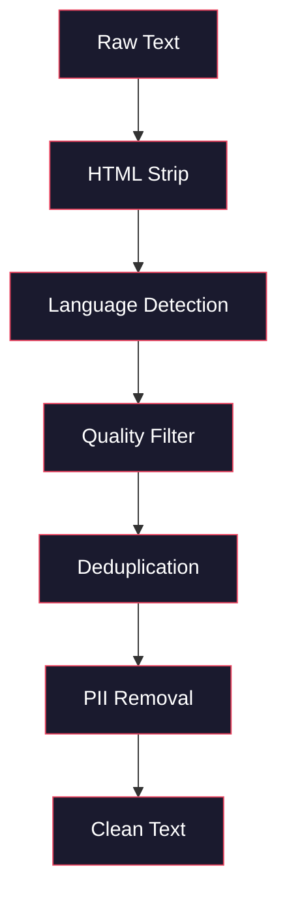
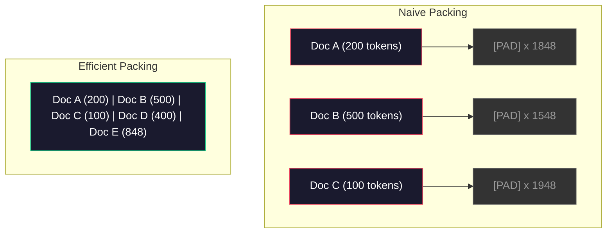

# 事前学習のためのデータパイプライン

> モデルは鏡です。与えたデータをそのまま映します。ゴミを与えれば、完璧に流暢なゴミを映します。

**種類:** 実装
**言語:** Python
**前提条件:** フェーズ 10、レッスン 01-02 (トークナイザー、トークナイザーの構築)
**時間:** 約90分

## 学習目標

- テラバイト規模のテキストをすべてメモリに読み込まず、トークン化、チャンク化、シャッフル、バッチ化するストリーミングデータパイプラインを構築する
- 実際の事前学習パイプラインで使われるデータ品質フィルター、つまり重複排除、言語検出、コンテンツフィルタリングを実装する
- 適切な attention mask と文書境界処理を備えた固定長の訓練シーケンスを作成する
- dataloader が GPU 訓練速度に追いつくように、パイプラインのスループットをプロファイルする

## 課題

トークナイザーは手に入りました。次に必要なのはデータです。

データセットではありません。CSV ファイルでもありません。テラバイト規模のテキストです。クリーニングされ、重複が取り除かれ、品質でフィルタリングされ、固定長シーケンスへトークン化され、8 GPU クラスタが次のバッチを待たずに済む速度でランダム化バッチとして供給される必要があります。

多くの人は、LLM の訓練はモデルアーキテクチャの話だと考えます。そうではありません。Llama 3 は15.6兆トークンを使いました。GPT-3 は3000億トークンを使いました。DeepSeek-V2 は8.1兆トークンを使いました。3つのアーキテクチャはおおむね同じです。attention と feedforward 層を持つ transformer ブロックの積み重ねです。出力品質の差は、圧倒的にデータから来ます。

DeepMind の Chinchilla 論文はこれを精密に示しました。一定の計算予算に対して、モデルパラメータ数と訓練トークン数には最適な比率があります。Chinchilla は、2022年時点の多くのモデルが大幅に訓練不足だったことを示しました。見たデータ量に対して、パラメータが多すぎたのです。1.4兆トークンで訓練された70Bパラメータモデル、つまり Chinchilla 最適なモデルは、3000億トークンで訓練された280Bモデルの Gopher を上回りました。

データパイプラインは、モデルが言語を学ぶのか、ノイズを学ぶのかを決めます。

## 考え方

### データはどこから来るのか

すべての大規模言語モデルは、複数ソースの混合データで訓練されます。正確な構成は多くの研究所にとって厳重な秘密ですが、カテゴリを理解するには十分な情報があります。

| ソース | サイズ | 品質 | 利用例 |
|--------|------|------|--------|
| Common Crawl | 生データ約250 TB | 低い (重いフィルタリングが必要) | GPT-3、Llama、多くのオープンモデル |
| Wikipedia | 約20 GB | 高い | 主要な LLM ほぼすべて |
| GitHub code | 約1 TB以上 | 中程度 (重複、死んだコードが多い) | StarCoder、CodeLlama、DeepSeek-Coder |
| Books (BookCorpus, Pile) | 約100 GB | 高い | GPT-2、GPT-3、初期モデル |
| Academic papers (arXiv, S2ORC) | 約100 GB | STEM では高い | Llama、Galactica |
| StackOverflow, Reddit | 約100 GB | 中程度 | Llama、Falcon |
| Curated web (C4, RefinedWeb) | 約5 TB | 中から高 (事前フィルタ済み) | T5、Falcon |

Llama 3 はデータ構成を公開しました。おおよそ 50% が Web データ、25% がコード、13% が書籍と学術論文、8% が数学データ、4% が多言語 Web データです。総量は、5 TB を超える生テキストソースから得た15.6兆トークンでした。

比率は総量と同じくらい重要です。Web データが多すぎると、モデルは Reddit のものまねになります。コードが少なすぎると、プログラミングができません。数学が少なすぎると、推論に失敗します。この混合比を正しくすることは LLM 訓練で最も難しい部分の1つであり、公式はありません。実験と評価が必要です。

### データクリーニング

生の Web データは汚れています。典型的な Common Crawl のダンプには次のものが含まれます。

- HTML タグと JavaScript
- ボイラープレートのヘッダー、フッター、ナビゲーションメニュー
- 重複ページ (完全重複と近似重複)
- 機械生成スパム
- 個人識別情報 (PII)
- 低品質テキスト (キーワード列、SEO スパム)
- テキストとしてエンコードされた非テキストコンテンツ

これをクリーニングすることは任意ではありません。一貫した段落を生成するモデルと、HTML タグを商品リストに混ぜて出力するモデルの差になります。



各ステップは、ノイズの特定カテゴリを取り除きます。

**HTML 除去:** すべてのマークアップを削除します。可視テキストだけを残します。`trafilatura` や `readability` のようなライブラリは、ナビゲーション、広告、ボイラープレートを捨てながら記事本文を抽出します。

**言語検出:** fastText の言語識別モデル (`lid.176.bin`) を使って各文書を分類します。対象言語だけを残します。信頼度 0.8 未満で英語と分類された文書は、おそらくきれいな英語ではありません。

**品質フィルタリング:** ここが面白い部分です。Falcon の背後にあるデータセット RefinedWeb は、perplexity ベースのフィルターを使います。Wikipedia で小さな言語モデルを訓練し、各文書にスコアを付けます。perplexity が高いということは、その文書が Wikipedia らしくない、つまりスパム、キーワード列、機械生成コンテンツである可能性が高いという意味です。閾値を超えた文書は削除されます。

**重複排除:** クリーニングで最も影響の大きいステップです。Common Crawl には大量の重複ページがあります。法的免責、Cookie 通知、利用規約などです。重複で訓練すると計算を浪費し、モデルが特定の文章を暗記してそのまま吐き出す原因になります。

**PII 除去:** 名前、メールアドレス、電話番号、社会保障番号。構造化された PII には正規表現による検出を使い、文脈内の名前には NER モデルを使います。

### MinHash による重複排除

完全重複の排除は簡単です。各文書をハッシュ化して重複を削除します。本当の問題は近似重複です。同じニュース記事でも、周囲の広告が少し違えば近似重複になります。本文は95%同じでも、バイト単位では異なります。

MinHash と Locality-Sensitive Hashing (LSH) はこれを効率的に解決します。


考え方は次の通りです。

1. **Shingling:** 各文書を n-gram の集合へ変換します。たとえば単語または文字の 5-gram です。`"the quick brown fox"` を3単語 shingle にすると、`{"the quick brown", "quick brown fox"}` になります。

2. **MinHash:** 各文書の shingle 集合について、k 個のハッシュ値を計算します。各ハッシュ値は、異なるハッシュ関数のもとで全 shingle のうち最小のハッシュです。これにより、任意の2文書間の Jaccard 類似度を近似する固定長の「シグネチャ」ができます。

3. **LSH:** MinHash シグネチャの帯、つまり band に基づいて文書をバケットへグループ化します。同じバケットに入った文書は近似重複候補です。これにより、すべてのペアを比較せずに済みます。候補だけを比較します。

4. **検証:** 各候補ペアについて正確な Jaccard 類似度を計算します。類似度が閾値、通常は 0.8 を超えた場合、一方を削除します。

Llama チームは、重複排除によって Web データのおよそ38%を削除したと報告しています。これは小さな数字ではありません。Common Crawl の3分の1以上が重複または近似重複コンテンツなのです。

### シーケンスパッキング

モデルは固定長の入力シーケンスを期待します。文書は可変長です。50トークンの文書もあれば、50,000トークンの文書もあります。

素朴な方法は、すべての文書を最大シーケンス長まで padding することです。これは学習に何も寄与しない padding トークンに大量の計算を浪費します。

より良い方法は、複数文書を1つのシーケンスに詰め、間に end-of-sequence トークンを挟むことです。2048トークンのシーケンスに、3つの短い文書を [EOS] トークンで連結して入れることができます。



attention mask は正しく設定しなければなりません。同じ packed sequence 内にあっても、Document A のトークンが Document B のトークンへ attend してはいけません。そのためには block-diagonal の attention mask が必要です。

長い文書は、シーケンス境界で切り詰めるか分割します。分割位置は重要です。文の途中で切ると、モデルは不完全な考えを見ることになります。パイプラインによっては、可能な限り段落や文の境界に分割位置を合わせます。

### Chinchilla スケーリング則

固定された計算予算 C、つまり FLOPs で測られる予算に対して、最適なモデルサイズ N とデータセットサイズ D は次に従います。

```
N_opt ~ C^0.5
D_opt ~ C^0.5
```

実務的には、モデルサイズとデータセットサイズをおおむね同じ比率で増やすべきだという意味です。パラメータ数が10倍のモデルは、同じ損失に到達するために、おおむね10倍の訓練トークンを必要とします。

| モデル | パラメータ数 | 訓練トークン | Chinchilla 最適か |
|-------|-----------|--------------|-------------------|
| GPT-3 | 175B | 300B | いいえ (3-4倍の訓練不足) |
| Chinchilla | 70B | 1.4T | はい (設計上) |
| Llama 2 | 70B | 2T | 過剰訓練 (意図的) |
| Llama 3 | 70B | 15T | 大幅な過剰訓練 |

Llama 3 は意図的に Chinchilla 則から外れています。Meta は、計算最適比を大きく超えて追加データで過剰訓練すると、推論時により良いモデルになることを見つけました。追加の訓練コストは一度だけ支払えばよく、小さいモデルは以後ずっと安く提供できます。これは「推論最適」なスケーリング手法と呼ばれることがあり、2024年以降の業界標準になっています。

## 作ってみる

### ステップ1: テキストクリーニング

HTML を取り除き、空白を正規化し、非テキストコンテンツを削除します。ここでは小さなコーパスとして、パブリックドメインのテキスト (Project Gutenberg) を使います。

```python
import re

def clean_text(text):
    text = re.sub(r"<[^>]+>", "", text)
    text = re.sub(r"http\S+", "", text)
    text = re.sub(r"[^\x20-\x7E\n]", "", text)
    text = re.sub(r"\n{3,}", "\n\n", text)
    text = re.sub(r" {2,}", " ", text)
    return text.strip()

def quality_filter(text, min_words=50, max_ratio_caps=0.3, max_ratio_special=0.1):
    words = text.split()
    if len(words) < min_words:
        return False
    caps_ratio = sum(1 for w in words if w.isupper()) / len(words)
    if caps_ratio > max_ratio_caps:
        return False
    special_chars = sum(1 for c in text if not c.isalnum() and not c.isspace())
    if special_chars / max(len(text), 1) > max_ratio_special:
        return False
    return True
```

品質フィルターは SEO スパム (ALL CAPS)、機械生成ノイズ (特殊文字比率が高い)、スタブページ (短すぎる) を捕まえます。この3つのチェックだけでも、Web クロールから驚くほど多くのゴミを取り除けます。

### ステップ2: MinHash 重複排除

MinHash をゼロから実装します。外部ライブラリは不要です。`hashlib` だけを使います。

```python
import hashlib
from collections import defaultdict

def get_shingles(text, k=5):
    words = text.lower().split()
    if len(words) < k:
        return set()
    return {" ".join(words[i:i+k]) for i in range(len(words) - k + 1)}

def minhash_signature(shingles, num_hashes=128):
    signature = []
    for i in range(num_hashes):
        min_hash = float("inf")
        for shingle in shingles:
            h = int(hashlib.sha256(f"{i}:{shingle}".encode()).hexdigest(), 16)
            min_hash = min(min_hash, h)
        signature.append(min_hash)
    return signature

def lsh_buckets(signature, bands=16):
    rows_per_band = len(signature) // bands
    buckets = []
    for b in range(bands):
        start = b * rows_per_band
        band_data = tuple(signature[start:start + rows_per_band])
        bucket_hash = hashlib.md5(str(band_data).encode()).hexdigest()
        buckets.append((b, bucket_hash))
    return buckets

def deduplicate(documents, threshold=0.8, num_hashes=128, bands=16):
    signatures = []
    shingle_sets = []
    for doc in documents:
        shingles = get_shingles(doc)
        shingle_sets.append(shingles)
        signatures.append(minhash_signature(shingles, num_hashes))

    bucket_map = defaultdict(list)
    for doc_idx, sig in enumerate(signatures):
        for band_id, bucket_hash in lsh_buckets(sig, bands):
            bucket_map[(band_id, bucket_hash)].append(doc_idx)

    duplicate_pairs = set()
    for bucket_docs in bucket_map.values():
        if len(bucket_docs) < 2:
            continue
        for i in range(len(bucket_docs)):
            for j in range(i + 1, len(bucket_docs)):
                duplicate_pairs.add((bucket_docs[i], bucket_docs[j]))

    removed = set()
    for i, j in duplicate_pairs:
        if i in removed or j in removed:
            continue
        s1, s2 = shingle_sets[i], shingle_sets[j]
        if not s1 or not s2:
            continue
        jaccard = len(s1 & s2) / len(s1 | s2)
        if jaccard >= threshold:
            removed.add(j)

    return [doc for idx, doc in enumerate(documents) if idx not in removed], len(removed)
```

`num_hashes=128` と `bands=16` は precision と recall のトレードオフを制御します。ハッシュ数を増やすと類似度推定がより正確になります。band 数を増やすと recall が上がり、より多くの重複を捕まえますが、false positive も増えます。これらの値は一般的な Web テキストでうまく機能します。

### ステップ3: トークン化してシーケンスへ詰める

クリーニングされ、重複排除されたテキストをトークン化し、訓練用の固定長シーケンスへ詰めます。

```python
def tokenize_corpus(documents, tokenizer):
    all_tokens = []
    for doc in documents:
        tokens = tokenizer.encode(doc)
        all_tokens.extend(tokens)
        all_tokens.append(tokenizer.eos_id)
    return all_tokens

def pack_sequences(token_ids, seq_length, pad_id=0):
    sequences = []
    attention_masks = []
    for i in range(0, len(token_ids), seq_length):
        seq = token_ids[i:i + seq_length]
        mask = [1] * len(seq)
        if len(seq) < seq_length:
            pad_count = seq_length - len(seq)
            seq = seq + [pad_id] * pad_count
            mask = mask + [0] * pad_count
        sequences.append(seq)
        attention_masks.append(mask)
    return sequences, attention_masks
```

### ステップ4: 訓練用 DataLoader

packed sequence のランダム化バッチを yield します。訓練ループが消費するのはこれです。

```python
import random

class PreTrainingDataLoader:
    def __init__(self, sequences, attention_masks, batch_size, shuffle=True):
        self.sequences = sequences
        self.attention_masks = attention_masks
        self.batch_size = batch_size
        self.shuffle = shuffle

    def __len__(self):
        return (len(self.sequences) + self.batch_size - 1) // self.batch_size

    def __iter__(self):
        indices = list(range(len(self.sequences)))
        if self.shuffle:
            random.shuffle(indices)
        for start in range(0, len(indices), self.batch_size):
            batch_idx = indices[start:start + self.batch_size]
            batch_seqs = [self.sequences[i] for i in batch_idx]
            batch_masks = [self.attention_masks[i] for i in batch_idx]
            yield batch_seqs, batch_masks
```

### ステップ5: データセット統計

重要な数値を計算します。総トークン数、一意なトークン数、圧縮率、文書長の分布です。

```python
from collections import Counter

def compute_statistics(documents, token_ids, sequences, tokenizer_vocab_size):
    total_chars = sum(len(d) for d in documents)
    total_tokens = len(token_ids)
    unique_tokens = len(set(token_ids))
    compression_ratio = total_chars / total_tokens

    doc_lengths = [len(d.split()) for d in documents]
    avg_doc_length = sum(doc_lengths) / max(len(doc_lengths), 1)
    max_doc_length = max(doc_lengths) if doc_lengths else 0
    min_doc_length = min(doc_lengths) if doc_lengths else 0

    token_counts = Counter(token_ids)
    top_tokens = token_counts.most_common(10)

    non_pad_tokens = sum(sum(1 for t in seq if t != 0) for seq in sequences)
    total_positions = sum(len(seq) for seq in sequences)
    utilization = non_pad_tokens / max(total_positions, 1)

    stats = {
        "total_documents": len(documents),
        "total_characters": total_chars,
        "total_tokens": total_tokens,
        "unique_tokens": unique_tokens,
        "vocab_utilization": unique_tokens / tokenizer_vocab_size,
        "compression_ratio": compression_ratio,
        "avg_doc_length_words": avg_doc_length,
        "max_doc_length_words": max_doc_length,
        "min_doc_length_words": min_doc_length,
        "num_sequences": len(sequences),
        "sequence_utilization": utilization,
        "top_10_tokens": top_tokens,
    }
    return stats
```

圧縮率は、このコーパス上でトークナイザーがどれほど効率的かを示します。英語テキストは通常、1トークンあたり約3から4文字に圧縮されます。1トークンあたり1.5文字なら、トークナイザーが細かく分割しすぎています。8以上なら、非常にドメイン特化したマージを学んでいます。

シーケンス利用率は、packed sequence のうち実データがどれだけを占め、padding がどれだけかを示します。90%を下回るなら、パッキングが非効率です。padding トークンに計算を浪費しています。

## 使ってみる

### HuggingFace Datasets と比較する

同じコーパスを HuggingFace の `datasets` ライブラリで読み込み、パイプライン速度を比較します。

```python
from datasets import load_dataset
from transformers import AutoTokenizer

ds = load_dataset("wikitext", "wikitext-2-raw-v1", split="train")
tokenizer = AutoTokenizer.from_pretrained("meta-llama/Meta-Llama-3-8B")

import time

start = time.time()
tokenized = ds.map(
    lambda x: tokenizer(x["text"], truncation=True, max_length=2048),
    batched=True,
    num_proc=4,
)
hf_time = time.time() - start
total_tokens = sum(len(t) for t in tokenized["input_ids"])
print(f"HuggingFace: {total_tokens:,} tokens in {hf_time:.2f}s ({total_tokens/hf_time:,.0f} tokens/sec)")
```

HuggingFace のパイプラインは、内部で Rust トークナイザーを使い、4コアで並列処理します。純粋な Python パイプラインは10から50倍遅くなります。この差が、本番チームがコンパイル済みトークナイザーを使う理由です。アルゴリズムは同じです。実装言語が違います。

## 形にして届ける

このレッスンでは、LLM 訓練パイプラインのデータ品質を検証し、デバッグするためのプロンプトを作ります。`outputs/prompt-data-quality-checker.md` を参照してください。

## 演習

1. **易:** 文字種分析のような単純なヒューリスティックを使って、クリーニングパイプラインに言語検出を追加してください。英語文書だけを残し、何件の文書が削除されたかを測定します。
2. **中:** MinHash による近似重複排除に加えて、SHA-256 ハッシュを使った完全重複排除を実装してください。Web スクレイピングしたコーパスで、それぞれの方法が捕まえる重複数を比較します。
3. **難:** perplexity ベースの品質フィルターを作ってください。Wikipedia テキストで小さな bigram 言語モデルを訓練し、各文書を perplexity でスコアリングし、下位20%を削除します。フィルタ済みデータと未フィルタデータで訓練した場合のモデル出力品質を比較してください。

## 重要用語

| 用語 | よくある言い方 | 実際の意味 |
|------|----------------|------------|
| Common Crawl | 「インターネット」 | 毎月 Web をクロールする非営利団体。生データ約250TBで、多くの LLM 訓練データの出発点 |
| MinHash | 「何かのハッシュ技法」 | 固定長シグネチャを使って集合間の Jaccard 類似度を推定する技法。大規模な近似重複検出を可能にする |
| LSH | 「Locality-Sensitive Hashing」 | 類似アイテムを同じバケットへ集める方法。ペア比較を `O(n^2)` からほぼ線形へ減らす |
| Sequence packing | 「文書を連結すること」 | 複数文書を適切な attention mask とともに固定長シーケンスへ収めること。padding の無駄をなくす |
| Chinchilla scaling | 「もっとデータで訓練すること」 | 固定計算予算では、最適性能のためにモデルサイズと訓練トークンをほぼ同じ比率で増やす必要がある |
| Fertility | 「単語あたりトークン数」 | 単語あたりの平均トークン数。GPT-4 の英語では約1.3、非ラテン文字体系ではより高い |
| Data mixing | 「訓練データを選ぶこと」 | コード、テキスト、数学、多言語データの比率。公式はなく、実験が必要 |
| Perplexity filter | 「品質スコアリング」 | 小さな言語モデルで文書をスコアリングすること。高い perplexity は、きれいな参照データに似ていないテキストを意味する |
| Deduplication | 「コピーを消すこと」 | 完全重複と近似重複文書を取り除くこと。通常、生 Web データの30から40%を削除する |
| Attention mask | 「どのトークンを見るか」 | packed sequence 内で文書境界を越えた attention を防ぐバイナリマスク |

## 参考資料

- [Hoffmann et al., 2022 -- Training Compute-Optimal Large Language Models (Chinchilla)](https://arxiv.org/abs/2203.15556) -- データスケールに対する考え方を変えた論文
- [Penedo et al., 2023 -- The RefinedWeb Dataset for Falcon LLM](https://arxiv.org/abs/2306.01116) -- Common Crawl を高品質化するフィルタリング方法
- [Touvron et al., 2023 -- Llama 2: Open Foundation and Fine-Tuned Chat Models](https://arxiv.org/abs/2307.09288) -- Llama 2 のデータパイプライン詳細
- [Lee et al., 2022 -- Deduplicating Training Data Makes Language Models Better](https://arxiv.org/abs/2107.06499) -- 重複排除が想像以上に重要である理由
- [Broder, 1997 -- On the Resemblance and Containment of Documents](https://ieeexplore.ieee.org/document/666900) -- 元祖 MinHash 論文
- [Meta, 2024 -- Llama 3 Technical Report](https://arxiv.org/abs/2407.21783) -- 15.6T トークン、データ混合比、フィルタリングパイプライン
