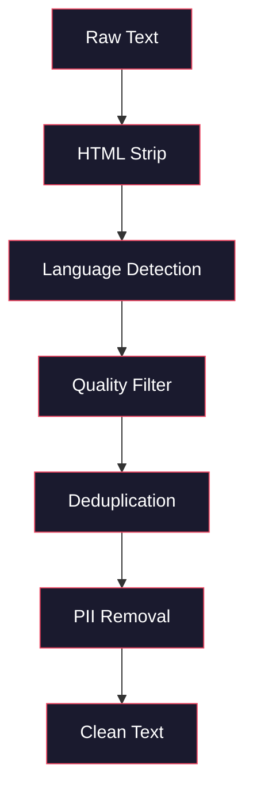
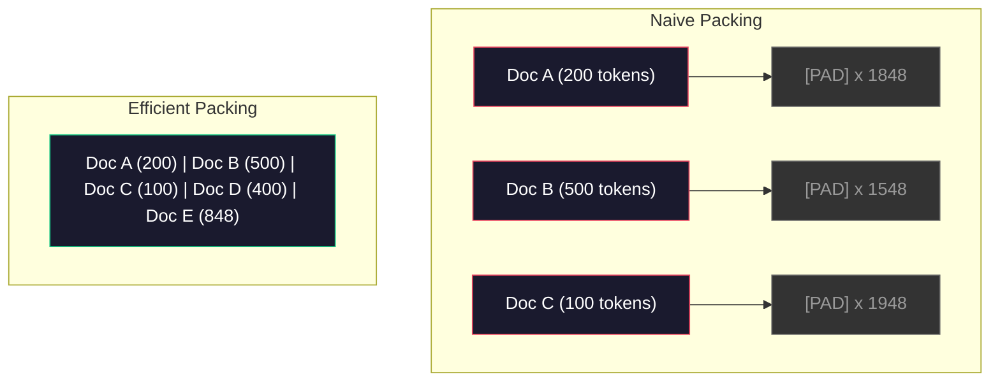

# Pipelines de Dados para Pré-Treinamento

> O modelo é um espelho. Ele reflete qualquer dado que você alimenta nele. Alimenta com lixo, ele reflete lixo com fluência perfeita.

**Tipo:** Build
**Linguagens:** Python
**Pré-requisitos:** Fase 10, Lições 01-02 (Tokenizers, Construindo um Tokenizer)
**Tempo:** ~90 minutos

## Objetivos de Aprendizado

- Construir um pipeline de dados streaming que tokeniza, chunk, embaralha e cria batches de terabytes de texto sem carregar tudo na memória
- Implementar filtros de qualidade de dados (deduplicação, detecção de idioma, filtro de conteúdo) usados em pipelines reais de pré-treinamento
- Criar sequências de treinamento de tamanho fixo com masks de atenção adequadas e tratamento de limites de documentos
- Fazer profiling do throughput do pipeline pra garantir que o dataloader acompanhe a velocidade de treinamento da GPU

## O Problema

Você tem um tokenizer. Agora precisa de dados.

Não é um dataset. Não é um arquivo CSV. São terabytes de texto -- limpos, deduplicados, filtrados por qualidade, tokenizados em sequências de tamanho fixo, e servidos em batches aleatórios rápidos o suficiente pra que seu cluster de 8 GPUs nunca espere pelo próximo batch.

A maioria das pessoas acha que treinar um LLM é sobre a arquitetura do modelo. Não é. Llama 3 usou 15,6 trilhões de tokens. GPT-3 usou 300 bilhões. DeepSeek-V2 usou 8,1 trilhões. A arquitetura dos três é basicamente a mesma: blocos de transformer empilhados com camadas de attention e feedforward. A diferença na qualidade da saída vem esmagadoramente dos dados.

O paper Chinchilla do DeepMind deixou isso preciso. Para um orçamento de compute dado, existe uma proporção otimizada entre parâmetros do modelo e tokens de treinamento. O Chinchilla mostrou que a maioria dos modelos em 2022 foram treinados dramaticamente abaixo do ideal -- tinham parâmetros demais pra quantidade de dados que viram. Um modelo de 70B parâmetros treinado em 1,4 trilhão de tokens (Chinchilla-ótimo) superou um modelo de 280B treinado em 300 bilhões de tokens (Gopher).

Seu pipeline de dados determina se seu modelo aprende linguagem ou aprende ruído.

## O Conceito

### De Onde Vem os Dados

Todo modelo de linguagem é treinado em uma mistura de fontes. A composição exata é um segredo bem guardado pra maioria dos laboratórios, mas sabemos o suficiente pra entender as categorias.

| Fonte | Tamanho | Qualidade | Usado Por |
|--------|------|---------|---------|
| Common Crawl | ~250 TB bruto | Baixa (precisa de filtragem pesada) | GPT-3, Llama, maioria dos modelos open |
| Wikipedia | ~20 GB | Alta | Todo LLM importante |
| Código do GitHub | ~1 TB+ | Média (muitos duplicados, código morto) | StarCoder, CodeLlama, DeepSeek-Coder |
| Livros (BookCorpus, Pile) | ~100 GB | Alta | GPT-2, GPT-3, modelos iniciais |
| Papers acadêmicos (arXiv, S2ORC) | ~100 GB | Alta pra STEM | Llama, Galactica |
| StackOverflow, Reddit | ~100 GB | Média | Llama, Falcon |
| Web curado (C4, RefinedWeb) | ~5 TB | Média-Alta (pré-filtrado) | T5, Falcon |

Llama 3 divulgou sua mistura de dados: aproximadamente 50% dados da web, 25% código, 13% livros e papers acadêmicos, 8% dados de matemática, e 4% dados da web multilíngue. O total foi 15,6 trilhões de tokens de fontes que excediam 5 TB de texto bruto.

A proporção importa tanto quanto o tamanho total. Dados de web demais e o modelo vira um papagaio do Reddit. Código de menos e ele não consegue programar. Matemática de menos e ele falha no raciocínio. Acertar essa mistura é uma das partes mais difíceis de treinar um LLM, e não existe fórmula -- requer experimentação e avaliação.

### Limpeza de Dados

Dados brutos da web são sujos. Um dump típico do Common Crawl contém:

- Tags HTML e JavaScript
- Headers, footers e menus de navegação boilerplate
- Páginas duplicadas (exatas e quase-exatas)
- Spam gerado por máquina
- Informações pessoalmente identificáveis (PII)
- Texto de baixa qualidade (listas de palavras-chave, spam de SEO)
- Conteúdo não-texto codificado como texto

Limpar isso não é opcional. É a diferença entre um modelo que gera parágrafos coerentes e um que mistura tags HTML com listagens de produtos.



Cada passo elimina uma categoria de ruído:

**Remoção de HTML:** Remove toda a marcação. Mantém apenas o texto visível. Bibliotecas como `trafilatura` ou `readability` extraem o conteúdo do artigo descartando navegação, anúncios e boilerplate.

**Detecção de idioma:** Use o modelo de identificação de idioma do fastText (lid.176.bin) pra classificar cada documento. Filtre pelos idiomas-alvo. Um documento classificado como inglês com confiança menor que 0,8 provavelmente não é inglês limpo.

**Filtro de qualidade:** Aqui fica interessante. O RefinedWeb (o dataset por trás do Falcon) usa um filtro baseado em perplexidade: treine um modelo pequeno de linguagem na Wikipedia, depois pontue cada documento. Perplexidade alta significa que o documento não se parece com a Wikipedia -- provavelmente spam, listas de palavras-chave, ou conteúdo gerado por máquina. Documentos com perplexidade acima de um threshold são removidos.

**Deduplicação:** O passo de limpeza com maior impacto individual. O Common Crawl contém números enormes de páginas duplicadas -- avisos legais, avisos de cookies, termos de serviço. Treinar em duplicatas desperdiça compute e pode fazer o modelo memorizar e regurgitar trechos eespecificaçãoíficos literalmente.

**Remoção de PII:** Nomes, endereços de e-mail, números de telefone, números de segurança social. Detecção baseada em regex pra PII estruturada, modelos de NER pra nomes em contexto.

### Deduplicação com MinHash

Deduplicação exata é fácil: hashe cada documento, remova duplicatas. Mas quase-duplicatas são o problema real. Duas cópias da mesma notícia com anúncios levemente diferentes ao redor são quase-duplicatas. O conteúdo é 95% idêntico, mas byte a byte eles diferem.

MinHash + Locality-Sensitive Hashing (LSH) resolve isso de forma eficiente.


A ideia:

1. **Shingling:** Converte cada documento em um conjunto de n-grams (por exemplo, 5-grams de palavras ou caracteres). "the quick brown fox" com shingles de 3 palavras vira {"the quick brown", "quick brown fox"}.

2. **MinHash:** Pra cada conjunto de shingles do documento, calcula k valores de hash. Cada valor de hash é o hash mínimo de todos os shingles sob uma função de hash diferente. Isso cria uma "assinatura" de tamanho fixo que aproxima a similaridade de Jaccard entre quaisquer dois documentos.

3. **LSH:** Agrupa documentos em buckets baseado em bandas da assinatura MinHash. Documentos no mesmo bucket são candidatos a quase-duplicatas. Isso evita comparar todos os pares -- você só compara candidatos.

4. **Verificação:** Pra cada par candidato, calcula a similaridade de Jaccard exata. Remove uma cópia se a similaridade exceder um threshold (tipicamente 0,8).

A equipe do Llama relatou remover aproximadamente 38% dos seus dados da web através da deduplicação. Isso não é um número pequeno. Mais de um terço do Common Crawl é conteúdo duplicado ou quase-duplicado.

### Empacotamento de Sequências

Seu modelo espera sequências de entrada de tamanho fixo. Seus documentos são de tamanho variável. Alguns têm 50 tokens. Alguns têm 50.000 tokens.

Abordagem ingênua: padder cada documento até o tamanho máximo da sequência. Isso desperdiça uma quantidade enorme de compute em tokens de padding que não contribuem nada pro aprendizado.

Abordagem melhor: empacotar múltiplos documentos em uma única sequência, separados por tokens de fim de sequência. Uma sequência de 2048 tokens pode conter três documentos curtos concatenados com tokens [EOS] entre eles.



A mask de atenção precisa ser configurada corretamente. Tokens do Documento A não devem prestar atenção em tokens do Documento B dentro da mesma sequência empacotada. Isso requer uma mask de atenção em bloco diagonal.

Documentos longos são truncados ou divididos em chunks nos limites das sequências. O ponto de divisão importa: dividir no meio de uma frase força o modelo a ver pensamentos incompletos. Alguns pipelines alinham divisões nos limites de parágrafo ou frase quando possível.

### A Lei de Escala do Chinchilla

Para um orçamento fixo de compute C (medido em FLOPs), o tamanho ótimo do modelo N e o tamanho do dataset D seguem:

```
N_opt ~ C^0.5
D_opt ~ C^0.5
```

Na prática, isso significa que você deve escalar o tamanho do modelo e do dataset aproximadamente igualmente. Um modelo com 10x mais parâmetros precisa de aproximadamente 10x mais tokens de treinamento pra atingir a mesma loss.

| Modelo | Parâmetros | Tokens de Treinamento | Chinchilla-Ótimo? |
|-------|-----------|----------------|-------------------|
| GPT-3 | 175B | 300B | Não (subtreinado 3-4x) |
| Chinchilla | 70B | 1,4T | Sim (por design) |
| Llama 2 | 70B | 2T | Sobretreinado (intencionalmente) |
| Llama 3 | 70B | 15T | Pesadamente sobretreinado |

Llama 3 viola deliberadamente a lei do Chinchilla. A Meta descobriu que sobretreinar com mais dados -- muito além da proporção ótima de compute -- produz modelos melhores pra inferência. O custo extra de treinamento é pago uma vez, mas o modelo menor é mais barato pra servir pra sempre. Isso é às vezes chamado de abordagem de escala "ótima pra inferência", e se tornou o padrão da indústria desde 2024.

## Construir

### Passo 1: Limpeza de Texto

Remove HTML, normaliza espaços em branco, remove conteúdo não-texto. Vamos usar um texto de domínio público (Project Gutenberg) como nosso pequeno corpus.

```python
import re

def clean_text(text):
    text = re.sub(r"<[^>]+>", "", text)
    text = re.sub(r"http\S+", "", text)
    text = re.sub(r"[^\x20-\x7E\n]", "", text)
    text = re.sub(r"\n{3,}", "\n\n", text)
    text = re.sub(r" {2,}", " ", text)
    return text.strip()

def quality_filter(text, min_words=50, max_ratio_caps=0.3, max_ratio_especificaçãoial=0.1):
    words = text.split()
    if len(words) < min_words:
        return False
    caps_ratio = sum(1 for w in words if w.isupper()) / len(words)
    if caps_ratio > max_ratio_caps:
        return False
    especificaçãoial_chars = sum(1 for c in text if not c.isalnum() and not c.isspace())
    if especificaçãoial_chars / max(len(text), 1) > max_ratio_especificaçãoial:
        return False
    return True
```

O filtro de qualidade pega spam de SEO (TODO EM MAIÚSCULO), ruído gerado por máquina (alta proporção de caracteres eespecificaçãoiais) e páginas stub (curtas demais). Essas três verificações sozinhas removem uma quantidade surpreendente de lixo dos crawls da web.

### Passo 2: Deduplicação com MinHash

Implemente MinHash do zero. Sem bibliotecas externas necessárias -- apenas `hashlib`.

```python
import hashlib
from collections import defaultdict

def get_shingles(text, k=5):
    words = text.lower().split()
    if len(words) < k:
        return set()
    return {" ".join(words[i:i+k]) for i in range(len(words) - k + 1)}

def minhash_signature(shingles, num_hashes=128):
    signature = []
    for i in range(num_hashes):
        min_hash = float("inf")
        for shingle in shingles:
            h = int(hashlib.sha256(f"{i}:{shingle}".encode()).hexdigest(), 16)
            min_hash = min(min_hash, h)
        signature.append(min_hash)
    return signature

def lsh_buckets(signature, bands=16):
    rows_per_band = len(signature) // bands
    buckets = []
    for b in range(bands):
        start = b * rows_per_band
        band_data = tuple(signature[start:start + rows_per_band])
        bucket_hash = hashlib.md5(str(band_data).encode()).hexdigest()
        buckets.append((b, bucket_hash))
    return buckets

def deduplicate(documents, threshold=0.8, num_hashes=128, bands=16):
    signatures = []
    shingle_sets = []
    for doc in documents:
        shingles = get_shingles(doc)
        shingle_sets.append(shingles)
        signatures.append(minhash_signature(shingles, num_hashes))

    bucket_map = defaultdict(list)
    for doc_idx, sig in enumerate(signatures):
        for band_id, bucket_hash in lsh_buckets(sig, bands):
            bucket_map[(band_id, bucket_hash)].append(doc_idx)

    duplicate_pairs = set()
    for bucket_docs in bucket_map.values():
        if len(bucket_docs) < 2:
            continue
        for i in range(len(bucket_docs)):
            for j in range(i + 1, len(bucket_docs)):
                duplicate_pairs.add((bucket_docs[i], bucket_docs[j]))

    removed = set()
    for i, j in duplicate_pairs:
        if i in removed or j in removed:
            continue
        s1, s2 = shingle_sets[i], shingle_sets[j]
        if not s1 or not s2:
            continue
        jaccard = len(s1 & s2) / len(s1 | s2)
        if jaccard >= threshold:
            removed.add(j)

    return [doc for idx, doc in enumerate(documents) if idx not in removed], len(removed)
```

Os parâmetros `num_hashes=128` e `bands=16` controlam o tradeoff entre precisão e recall. Mais hashes dão estimativas de similaridade mais precisas. Mais bands aumentam o recall (pegam mais duplicatas) ao custo de mais falsos positivos. Esses valores funcionam bem pra texto web típico.

### Passo 3: Tokenizar e Empacotar Sequências

Pega o texto limpo e deduplicado, tokeniza ele, e empacota em sequências de tamanho fixo pro treinamento.

```python
def tokenize_corpus(documents, tokenizer):
    all_tokens = []
    for doc in documents:
        tokens = tokenizer.encode(doc)
        all_tokens.extend(tokens)
        all_tokens.append(tokenizer.eos_id)
    return all_tokens

def pack_sequences(token_ids, seq_length, pad_id=0):
    sequences = []
    attention_masks = []
    for i in range(0, len(token_ids), seq_length):
        seq = token_ids[i:i + seq_length]
        mask = [1] * len(seq)
        if len(seq) < seq_length:
            pad_count = seq_length - len(seq)
            seq = seq + [pad_id] * pad_count
            mask = mask + [0] * pad_count
        sequences.append(seq)
        attention_masks.append(mask)
    return sequences, attention_masks
```

### Passo 4: DataLoader pro Treinamento

Yield batches aleatórios de sequências empacotadas. É isso que o loop de treinamento consome.

```python
import random

class PreTrainingDataLoader:
    def __init__(self, sequences, attention_masks, batch_size, shuffle=True):
        self.sequences = sequences
        self.attention_masks = attention_masks
        self.batch_size = batch_size
        self.shuffle = shuffle

    def __len__(self):
        return (len(self.sequences) + self.batch_size - 1) // self.batch_size

    def __iter__(self):
        indices = list(range(len(self.sequences)))
        if self.shuffle:
            random.shuffle(indices)
        for start in range(0, len(indices), self.batch_size):
            batch_idx = indices[start:start + self.batch_size]
            batch_seqs = [self.sequences[i] for i in batch_idx]
            batch_masks = [self.attention_masks[i] for i in batch_idx]
            yield batch_seqs, batch_masks
```

### Passo 5: Estatísticas do Dataset

Calcula os números que importam: total de tokens, tokens únicos, taxa de compressão, distribuição de tamanho de documentos.

```python
from collections import Counter

def compute_statistics(documents, token_ids, sequences, tokenizer_vocab_size):
    total_chars = sum(len(d) for d in documents)
    total_tokens = len(token_ids)
    unique_tokens = len(set(token_ids))
    compression_ratio = total_chars / total_tokens

    doc_lengths = [len(d.split()) for d in documents]
    avg_doc_length = sum(doc_lengths) / max(len(doc_lengths), 1)
    max_doc_length = max(doc_lengths) if doc_lengths else 0
    min_doc_length = min(doc_lengths) if doc_lengths else 0

    token_counts = Counter(token_ids)
    top_tokens = token_counts.most_common(10)

    non_pad_tokens = sum(sum(1 for t in seq if t != 0) for seq in sequences)
    total_positions = sum(len(seq) for seq in sequences)
    utilization = non_pad_tokens / max(total_positions, 1)

    stats = {
        "total_documents": len(documents),
        "total_characters": total_chars,
        "total_tokens": total_tokens,
        "unique_tokens": unique_tokens,
        "vocab_utilization": unique_tokens / tokenizer_vocab_size,
        "compression_ratio": compression_ratio,
        "avg_doc_length_words": avg_doc_length,
        "max_doc_length_words": max_doc_length,
        "min_doc_length_words": min_doc_length,
        "num_sequences": len(sequences),
        "sequence_utilization": utilization,
        "top_10_tokens": top_tokens,
    }
    return stats
```

A taxa de compressão te diz quão eficiente o tokenizer é nesse corpus. Texto em inglês tipicamente comprime pra aproximadamente 3-4 caracteres por token. Se você vê 1,5 caracteres por token, seu tokenizer está dividindo agressivamente demais. Se vê 8+, ele aprendeu merges muito eespecificaçãoíficos de domínio.

A utilização de sequência te diz quanto das suas sequências empacotadas são dados reais versus padding. Abaixo de 90% significa que seu empacotamento é ineficiente -- você está desperdiçando compute em tokens de padding.

## Usar

### Comparar Com HuggingFace Datasets

Carrega o mesmo corpus através da biblioteca datasets do HuggingFace e compara a velocidade do pipeline.

```python
from datasets import load_dataset
from transformers import AutoTokenizer

ds = load_dataset("wikitext", "wikitext-2-raw-v1", split="train")
tokenizer = AutoTokenizer.from_pretrained("meta-llama/Meta-Llama-3-8B")

import time

start = time.time()
tokenized = ds.map(
    lambda x: tokenizer(x["text"], truncation=True, max_length=2048),
    batched=True,
    num_proc=4,
)
hf_time = time.time() - start
total_tokens = sum(len(t) for t in tokenized["input_ids"])
print(f"HuggingFace: {total_tokens:,} tokens em {hf_time:.2f}s ({total_tokens/hf_time:,.0f} tokens/sec)")
```

O pipeline do HuggingFace usa tokenizers compilados em Rust por baixo dos panos e processamento paralelo em 4 cores. Seu pipeline puro em Python vai ser 10-50x mais lento. Essa lacuna é por que equipes de produção usam tokenizers compilados. O algoritmo é o mesmo. A linguagem de implementação é a diferença.

## Publicar

Essa aula produz um prompt pra validar e depurar a qualidade de dados em pipelines de treinamento de LLM. Veja `outputs/prompt-data-quality-checker.md`.

## Exercícios

1. **Fácil:** Adicione detecção de idioma ao pipeline de limpeza usando uma heurística simples (análise de conjunto de caracteres). Filtre apenas documentos em inglês e meça quantos documentos são removidos.
2. **Médio:** Implemente deduplicação exata usando hashes SHA-256 junto com a deduplicação quase-exata por MinHash. Compare o número de duplicatas encontradas por cada método em um corpus extraído da web.
3. **Difícil:** Construa um filtro de qualidade baseado em perplexidade. Treine um modelo de linguagem bigram pequeno em texto da Wikipedia, pontue cada documento por perplexidade, e remova os 20% piores. Compare a qualidade da saída do modelo ao treinar em dados filtrados vs não-filtrados.

## Termos Principais

| Termo | O que as pessoas dizem | O que realmente significa |
|------|----------------|----------------------|
| Common Crawl | "A internet" | Uma organização sem fins lucrativos que crawla a web mensalmente -- ~250TB brutos, o ponto de partida pra dados de treinamento da maioria dos LLMs |
| MinHash | "Alguma técnica de hashing" | Uma técnica pra estimar a similaridade de Jaccard entre conjuntos usando assinaturas de tamanho fixo -- possibilita detecção de quase-duplicatas em escala |
| LSH | "Locality-Sensitive Hashing" | Um método pra agrupar itens similares no mesmo bucket -- reduz comparações pareadas de O(n^2) pra quase-linear |
| Empacotamento de sequência | "Concatenar documentos" | Encaixar múltiplos documentos em sequências de tamanho fixo com masks de atenção adequadas -- elimina desperdício de padding |
| Escala Chinchilla | "Treinar com mais dados" | Pra um orçamento fixo de compute, performance ótima requer escalar o tamanho do modelo e os tokens de treinamento aproximadamente igualmente |
| Fertilidade | "Tokens por palavra" | Número médio de tokens por palavra -- 1,3 pra inglês no GPT-4, maior pra escritas não-latinas |
| Mistura de dados | "Escolher dados de treinamento" | A proporção de código vs texto vs matemática vs dados multilíngues -- não existe fórmula, requer experimentação |
| Filtro de perplexidade | "Pontuação de qualidade" | Usar um modelo de linguagem pequeno pra pontuar documentos -- perplexidade alta significa que o texto não se parece com dados de referência limpos |
| Deduplicação | "Remover cópias" | Eliminar documentos exatos e quase-duplicados -- tipicamente remove 30-40% dos dados brutos da web |
| Mask de atenção | "Quais tokens olhar" | Uma mask binária que previne atenção através dos limites de documentos em sequências empacotadas |

## Leitura Complementar

- [Hoffmann et al., 2022 -- Training Compute-Optimal Large Language Models (Chinchilla)](https://arxiv.org/abs/2203.15556) -- o paper que mudou como pensamos sobre escala de dados
- [Penedo et al., 2023 -- The RefinedWeb Dataset for Falcon LLM](https://arxiv.org/abs/2306.01116) -- como filtrar o Common Crawl pra alta qualidade
- [Touvron et al., 2023 -- Llama 2: Open Foundation and Fine-Tuned Chat Models](https://arxiv.org/abs/2307.09288) -- detalhes do pipeline de dados do Llama 2
- [Lee et al., 2022 -- Deduplicating Training Data Makes Language Models Better](https://arxiv.org/abs/2107.06499) -- por que deduplicação importa mais do que você imagina
- [Broder, 1997 -- On the Resemblance and Containment of Documents](https://ieeexplore.ieee.org/document/666900) -- o paper original do MinHash
- [Meta, 2024 -- Llama 3 Technical Report](https://arxiv.org/abs/2407.21783) -- 15,6T tokens, proporções de mistura de dados, pipeline de filtragem
