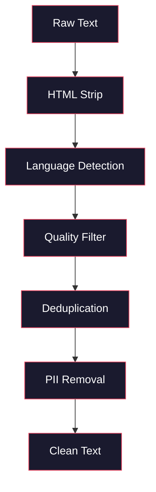
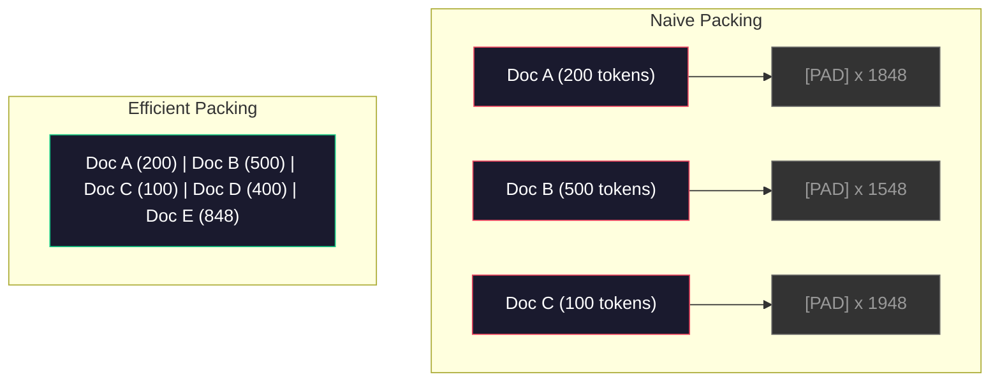

# Eğitim Öncesi için Veri İşlem Hatları

> Model bir aynadır. Hangi veriyi beslerseniz onu yansıtır. Çöpü besle, çöpü mükemmel akıcılıkla yansıtır.

**Tür:** Yapım
**Diller:** Python
**Önkoşullar:** Aşama 10, Dersler 01-02 (Tokenizers, Bir Tokenizer Oluşturmak)
**Süre:** ~90 dakika

## Öğrenme Hedefleri

- Terabaytlarca metni, hepsini belleğe yüklemeden tokenparçalayan, parçalayan, karıştıran ve gruplandıran bir akış veri hattı oluşturun
- Gerçek eğitim öncesi ardışık düzenlerde kullanılan veri kalitesi filtrelerini (tekilleştirme, dil algılama, içerik filtreleme) uygulayın
- Uygun dikkat maskeleri ve belge sınırlarının ele alınmasıyla sabit uzunlukta eğitim dizileri oluşturun
- Veri yükleyicinin GPU eğitim hızına ayak uydurmasını sağlamak için profil hattı çıkışı

## Sorun

Bir tokenizer'niz var. Artık verilere ihtiyacınız var.

dataset değil. CSV dosyası değil. Terabaytlarca metin; temizlendi, tekilleştirildi, kalite açısından filtrelendi, tokensabit uzunluklu dizilere ayrıldı ve 8 GPU'lu kümenizin bir sonraki grubu asla beklememesini sağlayacak kadar hızlı, rastgele gruplar halinde sunuldu.

Çoğu kişi Yüksek Lisans eğitiminin model mimarisiyle ilgili olduğunu düşünüyor. Değil. Llama 3, 15,6 trilyon token saniye kullandı. GPT-3 300 milyar kullandı. DeepSeek-V2 8,1 trilyon kullandı. Üçünün de mimarisi kabaca aynıdır: dikkat ve ileri besleme katmanlarına sahip yığılmış transformer bloklar. Çıktı kalitesindeki fark büyük ölçüde verilerden kaynaklanmaktadır.

DeepMind'ın Chinchilla makalesi bunu kesin olarak ortaya koyuyor. Belirli bir işlem bütçesi için model parametrelerinin eğitim token'lerine optimal bir oranı vardır. Chinchilla, 2022'deki çoğu modelin önemli ölçüde yetersiz eğitildiğini, gördükleri veri miktarına göre çok fazla parametreye sahip olduklarını gösterdi. 1,4 trilyon tokens (Chinchilla-optimal) üzerinde eğitilen bir 70B parametre modeli, 300 milyar tokens (Gopher) üzerinde eğitilen bir 280B modelinden daha iyi performans gösterdi.

Veri hattınız, modelinizin dili mi yoksa gürültüyü mü öğrendiğini belirler.

## Konsept

### Veriler Nereden Geliyor?

Her büyük dil modeli, çeşitli kaynakların karışımıyla eğitilir. Tam bileşim çoğu laboratuvar için yakından korunan bir sırdır, ancak kategorileri anlayacak kadar bilgimiz var.

| Kaynak | Boyut | Kalite | Kullanan |
|--------|------|---------|---------|
| Common Crawl | ~250 TB ham | Düşük (yoğun filtreleme gerektirir) | GPT-3, Llama, en açık modeller |
| Vikipedi | ~20 GB | Yüksek | Her büyük LLM |
| GitHub kodu | ~1TB+ | Orta (çok sayıda kopya, ölü kod) | StarCoder, CodeLlama, DeepSeek-Coder |
| Kitaplar (BookCorpus, Pile) | ~100GB | Yüksek | GPT-2, GPT-3, eski modeller |
| Akademik makaleler (arXiv, S2ORC) | ~100GB | STEM için Yüksek | Llama, Galactica |
| StackOverflow, Reddit | ~100GB | Orta | Llama, Şahin |
| Düzenlenmiş web (C4, RefinedWeb) | ~5TB | Orta-Yüksek (önceden filtrelenmiş) | T5, Şahin |

Llama 3 veri karışımını açıkladı: kabaca %50 web verisi, %25 kod, %13 kitap ve akademik makaleler, %8 matematik verisi ve %4 çok dilli web verisi. Toplamda 5 TB ham metni aşan kaynaklardan gelen 15,6 trilyon tokens vardı.

Oran, toplam büyüklük kadar önemlidir. Çok fazla web verisi varsa model bir Reddit papağanına dönüşür. Çok az kod var ve programlanamıyor. Çok az matematik ve akıl yürütmede başarısız olur. Bu karışımı doğru bir şekilde oluşturmak, Yüksek Lisans eğitiminin en zor kısımlarından biridir ve bunun bir formülü yoktur; deneme ve değerlendirme gerektirir.

### Veri Temizleme

Ham web verileri kirli. Tipik bir Common Crawl dökümü şunları içerir:

- HTML etiketleri ve JavaScript
- Standart başlıklar, altbilgiler, gezinme menüleri
- Yinelenen sayfalar (aynı ve neredeyse kopya)
- Makine tarafından oluşturulan spam
- Kişisel olarak tanımlanabilir bilgiler (PII)
- Düşük kaliteli metin (anahtar kelime listeleri, SEO spam'ı)
- Metin olarak kodlanmış metin olmayan içerik

Bunun temizlenmesi isteğe bağlı değildir. Tutarlı paragraflar oluşturan bir model ile ürün listelemeleriyle karışık HTML etiketleri çıkaran bir model arasındaki farktır.



Her adım bir gürültü kategorisini ortadan kaldırır:

**HTML ayıklama:** Tüm işaretlemeleri kaldırın. Yalnızca görünür metin içeriğini saklayın. `trafilatura` veya `readability` gibi kitaplıklar, gezinmeyi, reklamları ve ortak metni atarken makale içeriğini çıkarır.

**Dil algılama:** Her belgeyi sınıflandırmak için fastText'in dil tanımlama modelini (lid.176.bin) kullanın. Hedef dillerinize göre filtreleyin. Güvenirliği 0,8'den az olan İngilizce olarak sınıflandırılan bir belge muhtemelen temiz İngilizce değildir.

**Kalite filtreleme:** İş bu noktada ilginçleşiyor. RefinedWeb (Falcon'un arkasındaki dataset) kafa karışıklığına dayalı bir filtre kullanır: Wikipedia'da küçük bir dil modeli eğitin, ardından her belgeyi puanlayın. Yüksek karışıklık, belgenin Wikipedia'ya benzemediği anlamına gelir; muhtemelen spam, anahtar kelime listeleri veya makine tarafından oluşturulan içeriktir. Bir eşiğin üzerinde karmaşıklığa sahip belgeler kaldırılır.

**Tekilleştirme:** En etkili tek temizleme adımı. Common Crawl, yasal sorumluluk reddi beyanları, çerez bildirimleri, hizmet şartları gibi çok sayıda yinelenen sayfa içerir. Kopyalarla ilgili eğitim, hesaplamayı boşa harcar ve modelin belirli pasajları ezberlemesine ve kelimesi kelimesine tekrar etmesine neden olabilir.

**PII'lerin kaldırılması:** İsimler, e-posta adresleri, telefon numaraları, sosyal güvenlik numaraları. Yapılandırılmış PII için Regex tabanlı algılama, bağlamdaki adlar için NER modelleri.

### MinHash ile tekilleştirme

Kesin olarak tekilleştirme kolaydır: her belgeye hash işlemi uygulayın, kopyaları kaldırın. Ancak asıl sorun neredeyse kopyalardır. Aynı haber makalesinin, etrafında biraz farklı reklamlar bulunan iki kopyası neredeyse kopyadır. İçerik %95 aynıdır, ancak bayttan bayta farklılık gösterirler.

MinHash + Yerelliğe Duyarlı Hashing (LSH) bunu verimli bir şekilde çözer.


Fikir:

1. **Parçalama:** Her belgeyi bir n gramlık sete (e.g., 5 gramlık kelime veya karakter) dönüştürün. 3 kelimelik zona içeren "hızlı kahverengi tilki", {"hızlı kahverengi", "hızlı kahverengi tilki"} olur.

2. **MinHash:** Her belgenin kiremit seti için k hash değerlerini hesaplayın. Her karma değeri, farklı bir karma işlevi altındaki tüm zonalardaki minimum karma değeridir. Bu, herhangi iki belge arasındaki Jaccard benzerliğine yaklaşan sabit boyutlu bir "imza" oluşturur.

3. **LSH:** Belgeleri MinHash imzalarının bantlarına göre gruplar halinde gruplayın. Aynı paketteki belgeler neredeyse kopya olmaya adaydır. Bu, her çiftin karşılaştırılmasını önler; yalnızca adayları karşılaştırırsınız.

4. **Doğrulayın:** Her aday çift için Jaccard benzerliğini tam olarak hesaplayın. Benzerlik bir eşiği (genellikle 0,8) aşarsa bir kopyayı kaldırın.

Llama ekibi, tekilleştirme yoluyla web verilerinin yaklaşık %38'inin kaldırıldığını bildirdi. Bu az bir rakam değil. Common Crawlnın üçte birinden fazlası yinelenen veya neredeyse yinelenen içeriktir.

### Sıra Paketleme

Modeliniz sabit uzunluklu giriş dizileri bekliyor. Belgeleriniz değişken uzunluktadır. Bazıları 50 tokensaniyedir. Bazıları 50.000 token saniyedir.

Naif yaklaşım: Her belgeyi maksimum dizi uzunluğuna kadar doldurun. Bu, öğrenmeye hiçbir katkısı olmayan token'ların doldurulmasında çok büyük hesaplama israfına neden olur.

Daha iyi yaklaşım: birden fazla belgeyi, sıra sonu token'larla ayrılmış tek bir sıraya paketleyin. Bir 2048-token dizisi, aralarında [EOS] token'lerle birleştirilmiş üç kısa belge içerebilir.



Dikkat maskesinin doğru ayarlanması gerekir. A Belgesindeki Token'lar, B Belgesindeki token'lere aynı paketlenmiş sıra içinde katılmamalıdır. Bu, blok çapraz bir dikkat maskesi gerektirir.

Uzun belgeler kesilir veya sıra sınırlarında parçalara bölünür. Ayırma noktası önemlidir: Cümlenin ortasında bölünme, modeli eksik düşünceleri görmeye zorlar. Bazı ardışık düzenler, mümkün olduğunda bölmeleri paragraf veya cümle sınırlarına göre hizalar.

### Chinchilla Ölçeklendirme Yasası

Sabit bir işlem bütçesi C (FLOP olarak ölçülür) için en uygun model boyutu N ve dataset boyut D aşağıdaki gibidir:

```
N_opt ~ C^0.5
D_opt ~ C^0.5
```

Uygulamada bu, model boyutunu ve dataset boyutunu kabaca eşit şekilde ölçeklendirmeniz gerektiği anlamına gelir. 10 kat daha fazla parametreye sahip bir model, aynı kayba ulaşmak için yaklaşık 10 kat daha fazla eğitim token'ye ihtiyaç duyar.

| Modeli | Parametreler | Eğitim Token'ler | Chinchilla-Optimal mi? |
|-------|-----------|----------------|-------------------|
| GPT-3 | 175B | 300B | Hayır (eğitimsiz 3-4x) |
| Chinchilla | 70B | 1.4T | Evet (tasarım gereği) |
| Llama 2 | 70B | 2T | Aşırı eğitimli (kasıtlı olarak) |
| Llama 3 | 70B | 15T | Aşırı derecede aşırı eğitilmiş |

Llama 3, Chinchilla yasasını kasıtlı olarak ihlal ediyor. Meta, daha fazla veri üzerinde aşırı eğitimin (en uygun hesaplama oranının çok ötesinde) inference için daha iyi modeller ürettiğini buldu. Ekstra eğitim maliyeti bir kez ödenir, ancak daha küçük modelin sonsuza kadar hizmet vermesi daha ucuzdur. Buna bazen "inference-optimal" ölçeklendirme yaklaşımı da denir ve 2024'ten beri endüstri standardı haline gelmiştir.

## İnşa Et

### Adım 1: Metin Temizleme

HTML'yi soyun, boşlukları normalleştirin, metin olmayan içeriği kaldırın. Küçük külliyatımız olarak kamuya açık bir metin (Gutenberg Projesi) kullanacağız.

```python
import re

def clean_text(text):
    text = re.sub(r"<[^>]+>", "", text)
    text = re.sub(r"http\S+", "", text)
    text = re.sub(r"[^\x20-\x7E\n]", "", text)
    text = re.sub(r"\n{3,}", "\n\n", text)
    text = re.sub(r" {2,}", " ", text)
    return text.strip()

def quality_filter(text, min_words=50, max_ratio_caps=0.3, max_ratio_special=0.1):
    words = text.split()
    if len(words) < min_words:
        return False
    caps_ratio = sum(1 for w in words if w.isupper()) / len(words)
    if caps_ratio > max_ratio_caps:
        return False
    special_chars = sum(1 for c in text if not c.isalnum() and not c.isspace())
    if special_chars / max(len(text), 1) > max_ratio_special:
        return False
    return True
```

Kalite filtresi, SEO spam'ını (TÜMÜ BÜYÜK HARF), makine tarafından oluşturulan gürültüyü (yüksek özel karakter oranı) ve saplama sayfalarını (çok kısa) yakalar. Bu üç kontrol tek başına web taramalarından şaşırtıcı miktarda çöpü ortadan kaldırır.

### Adım 2: MinHash Veri Tekilleştirme

MinHash'ı sıfırdan uygulayın. Harici kütüphaneye gerek yok -- yalnızca `hashlib`.

```python
import hashlib
from collections import defaultdict

def get_shingles(text, k=5):
    words = text.lower().split()
    if len(words) < k:
        return set()
    return {" ".join(words[i:i+k]) for i in range(len(words) - k + 1)}

def minhash_signature(shingles, num_hashes=128):
    signature = []
    for i in range(num_hashes):
        min_hash = float("inf")
        for shingle in shingles:
            h = int(hashlib.sha256(f"{i}:{shingle}".encode()).hexdigest(), 16)
            min_hash = min(min_hash, h)
        signature.append(min_hash)
    return signature

def lsh_buckets(signature, bands=16):
    rows_per_band = len(signature) // bands
    buckets = []
    for b in range(bands):
        start = b * rows_per_band
        band_data = tuple(signature[start:start + rows_per_band])
        bucket_hash = hashlib.md5(str(band_data).encode()).hexdigest()
        buckets.append((b, bucket_hash))
    return buckets

def deduplicate(documents, threshold=0.8, num_hashes=128, bands=16):
    signatures = []
    shingle_sets = []
    for doc in documents:
        shingles = get_shingles(doc)
        shingle_sets.append(shingles)
        signatures.append(minhash_signature(shingles, num_hashes))

    bucket_map = defaultdict(list)
    for doc_idx, sig in enumerate(signatures):
        for band_id, bucket_hash in lsh_buckets(sig, bands):
            bucket_map[(band_id, bucket_hash)].append(doc_idx)

    duplicate_pairs = set()
    for bucket_docs in bucket_map.values():
        if len(bucket_docs) < 2:
            continue
        for i in range(len(bucket_docs)):
            for j in range(i + 1, len(bucket_docs)):
                duplicate_pairs.add((bucket_docs[i], bucket_docs[j]))

    removed = set()
    for i, j in duplicate_pairs:
        if i in removed or j in removed:
            continue
        s1, s2 = shingle_sets[i], shingle_sets[j]
        if not s1 or not s2:
            continue
        jaccard = len(s1 & s2) / len(s1 | s2)
        if jaccard >= threshold:
            removed.add(j)

    return [doc for idx, doc in enumerate(documents) if idx not in removed], len(removed)
```

`num_hashes=128` ve `bands=16` parametreleri hassas geri çağırma dengesini kontrol eder. Daha fazla karma, daha doğru benzerlik tahminleri sağlar. Daha fazla bant, daha fazla yanlış pozitiflik pahasına hatırlamayı artırır (daha fazla kopya yakalar). Bu değerler tipik web metni için iyi çalışır.

### 3. Adım: TokenDizileri Boyutlandırın ve Paketleyin

Temiz, tekilleştirilmiş metni alın, tokenbiçimlendirin ve eğitim için sabit uzunluktaki dizilere paketleyin.

```python
def tokenize_corpus(documents, tokenizer):
    all_tokens = []
    for doc in documents:
        tokens = tokenizer.encode(doc)
        all_tokens.extend(tokens)
        all_tokens.append(tokenizer.eos_id)
    return all_tokens

def pack_sequences(token_ids, seq_length, pad_id=0):
    sequences = []
    attention_masks = []
    for i in range(0, len(token_ids), seq_length):
        seq = token_ids[i:i + seq_length]
        mask = [1] * len(seq)
        if len(seq) < seq_length:
            pad_count = seq_length - len(seq)
            seq = seq + [pad_id] * pad_count
            mask = mask + [0] * pad_count
        sequences.append(seq)
        attention_masks.append(mask)
    return sequences, attention_masks
```

### Adım 4: Eğitim için DataLoader

Paketlenmiş dizilerden rastgele gruplar elde edin. Eğitim döngüsünün tükettiği şey budur.

```python
import random

class PreTrainingDataLoader:
    def __init__(self, sequences, attention_masks, batch_size, shuffle=True):
        self.sequences = sequences
        self.attention_masks = attention_masks
        self.batch_size = batch_size
        self.shuffle = shuffle

    def __len__(self):
        return (len(self.sequences) + self.batch_size - 1) // self.batch_size

    def __iter__(self):
        indices = list(range(len(self.sequences)))
        if self.shuffle:
            random.shuffle(indices)
        for start in range(0, len(indices), self.batch_size):
            batch_idx = indices[start:start + self.batch_size]
            batch_seqs = [self.sequences[i] for i in batch_idx]
            batch_masks = [self.attention_masks[i] for i in batch_idx]
            yield batch_seqs, batch_masks
```

### Adım 5: Dataset İstatistikler

Önemli olan sayıları hesaplayın: toplam token'lar, benzersiz token'ler, sıkıştırma oranı, belge uzunluğu dağılımı.

```python
from collections import Counter

def compute_statistics(documents, token_ids, sequences, tokenizer_vocab_size):
    total_chars = sum(len(d) for d in documents)
    total_tokens = len(token_ids)
    unique_tokens = len(set(token_ids))
    compression_ratio = total_chars / total_tokens

    doc_lengths = [len(d.split()) for d in documents]
    avg_doc_length = sum(doc_lengths) / max(len(doc_lengths), 1)
    max_doc_length = max(doc_lengths) if doc_lengths else 0
    min_doc_length = min(doc_lengths) if doc_lengths else 0

    token_counts = Counter(token_ids)
    top_tokens = token_counts.most_common(10)

    non_pad_tokens = sum(sum(1 for t in seq if t != 0) for seq in sequences)
    total_positions = sum(len(seq) for seq in sequences)
    utilization = non_pad_tokens / max(total_positions, 1)

    stats = {
        "total_documents": len(documents),
        "total_characters": total_chars,
        "total_tokens": total_tokens,
        "unique_tokens": unique_tokens,
        "vocab_utilization": unique_tokens / tokenizer_vocab_size,
        "compression_ratio": compression_ratio,
        "avg_doc_length_words": avg_doc_length,
        "max_doc_length_words": max_doc_length,
        "min_doc_length_words": min_doc_length,
        "num_sequences": len(sequences),
        "sequence_utilization": utilization,
        "top_10_tokens": top_tokens,
    }
    return stats
```

Sıkıştırma oranı size tokenizer'nin bu korpusta ne kadar verimli olduğunu söyler. İngilizce metin genellikle token başına yaklaşık 3-4 karaktere sıkıştırılır. Eğer token başına 1,5 karakter görürseniz, tokenizer cihazınız çok agresif bir şekilde bölünüyor demektir. 8+ görüyorsanız, çok alana özgü birleştirmeler öğrenmiştir.

Dizi kullanımı, paketlenmiş dizilerinizin ne kadarının dolguya göre gerçek veri olduğunu gösterir. %90'ın altında paketlemenizin verimsiz olduğu anlamına gelir; token'ları doldurmak için bilgi işlem israfı yapıyorsunuz.

## Kullan onu

### HuggingFace Dataset'lerle Karşılaştırın

Aynı külliyatı HuggingFace'in datasetkütüphanesine yükleyin ve ardışık düzen hızını karşılaştırın.

```python
from datasets import load_dataset
from transformers import AutoTokenizer

ds = load_dataset("wikitext", "wikitext-2-raw-v1", split="train")
tokenizer = AutoTokenizer.from_pretrained("meta-llama/Meta-Llama-3-8B")

import time

start = time.time()
tokenized = ds.map(
    lambda x: tokenizer(x["text"], truncation=True, max_length=2048),
    batched=True,
    num_proc=4,
)
hf_time = time.time() - start
total_tokens = sum(len(t) for t in tokenized["input_ids"])
print(f"HuggingFace: {total_tokens:,} tokens in {hf_time:.2f}s ({total_tokens/hf_time:,.0f} tokens/sec)")
```

HuggingFace ardışık düzeni, Rust tokenizer'ları ve 4 çekirdekte paralel işlemeyi kullanır. Saf Python boru hattınız 10-50 kat daha yavaş olacaktır. Bu boşluk, üretim ekiplerinin derlenmiş tokenizer'leri kullanmasının nedenidir. Algoritma aynı. Uygulama dili farktır.

## Gönderin

Bu ders, LLM eğitim işlem hatlarında veri kalitesini doğrulamak ve hata ayıklamak için bir prompt üretir. Bkz. `outputs/prompt-data-quality-checker.md`.

## Egzersizler

1. **Kolay:** Basit bir buluşsal yöntem (karakter seti analizi) kullanarak temizleme hattına dil algılama ekleyin. Yalnızca İngilizce belgeleri filtreleyin ve kaç belgenin kaldırıldığını ölçün.
2. **Orta:** MinHash neredeyse tekilleştirmenin yanı sıra SHA-256 karmalarını kullanarak tam tekilleştirme uygulayın. Web'den kazınmış bir derlemede her yöntemin yakaladığı kopyaların sayısını karşılaştırın.
3. **Zor:** Şaşkınlığa dayalı bir kalite filtresi oluşturun. Vikipedi metninde küçük bir bigram dil modeli eğitin, her belgeyi şaşkınlık derecesine göre puanlayın ve alttaki %20'yi kaldırın. Filtrelenmiş ve filtrelenmemiş veriler üzerinde eğitim yaparken model çıktı kalitesini karşılaştırın.

## Anahtar Terimler

| Dönem | İnsanlar ne diyor | Aslında ne anlama geliyor |
|------|----------------|----------------------|
| Common Crawl | "İnternet" | Aylık olarak web'i tarayan kar amacı gütmeyen bir kuruluş -- ~250 TB ham, çoğu LLM eğitim verisi için başlangıç ​​noktası |
| MinHash | "Bazı karma hileleri" | Sabit boyutlu imzalar kullanarak kümeler arasındaki Jaccard benzerliğini tahmin etmeye yönelik bir teknik, aynı ölçekteki kopyalara yakın algılamayı mümkün kılıyor |
| LSH | "Yerelliğe Duyarlı Karma" | Benzer öğeleri aynı grupta gruplandırmaya yönelik bir yöntem - ikili karşılaştırmaları O(n^2)'den neredeyse doğrusala indirir |
| Sıralı paketleme | "Belgeleri birleştirme" | Birden fazla belgeyi uygun dikkat maskeleriyle sabit uzunluklu dizilere sığdırmak dolgu israfını ortadan kaldırır |
| Chinchilla ölçeklendirme | "Daha fazla veri üzerinde eğitim alın" | Sabit bir işlem bütçesi için optimum performans, model boyutunun ölçeklendirilmesini ve eğitim tokens'nin kabaca eşit olmasını gerektirir |
| Doğurganlık | "Tokens kelime başına" | Kelime başına ortalama token sayısı -- GPT-4'teki İngilizce için 1,3, Latin olmayan alfabeler için daha yüksek |
| Veri karıştırma | "Eğitim verilerini seçme" | Kod, metin, matematik ve çok dilli verilerin oranı - formül yok, deneme gerektirir |
| Şaşkınlık filtresi | "Kalite puanlaması" | Belgeleri puanlamak için küçük bir dil modeli kullanın; yüksek karışıklık, metnin temiz referans verilerinden farklı olduğu anlamına gelir |
| Tekilleştirme | "Kopyaları kaldırma" | Tam ve neredeyse yinelenen belgelerin ortadan kaldırılması -- genellikle ham web verilerinin %30-40'ını kaldırır |
| Dikkat maskesi | "Hangi token'lere bakmalı" | Paketlenmiş sıralarda belge sınırlarının ötesinde dikkati önleyen ikili maske |

## Daha Fazla Okuma

- [Hoffmann ve diğerleri, 2022 -- Training Compute-Optimal Large Language Models (Chinchilla)](https://arxiv.org/abs/2203.15556) -- veri ölçeği hakkındaki düşüncelerimizi değiştiren makale
- [Penedo ve diğerleri, 2023 -- The RefinedWeb Dataset for Falcon LLM](https://arxiv.org/abs/2306.01116) -- Common Crawl'un yüksek kaliteli içerik için nasıl filtrelendiği
- [Touvron ve diğerleri, 2023 -- Llama 2: Açık Temel ve İnce Ayarlı Sohbet Modelleri](https://arxiv.org/abs/2307.09288) -- Llama 2 için veri hattı ayrıntıları
- [Lee ve diğerleri, 2022 -- Eğitim Verilerini Tekilleştirmek Dil Modellerini Daha İyi Hale Getirir](https://arxiv.org/abs/2107.06499) -- neden tekilleştirme düşündüğünüzden daha önemli
- [Broder, 1997 -- Belgelerin Benzerliği ve Kapsamı Üzerine](https://ieeexplore.ieee.org/document/666900) -- orijinal MinHash makalesi
- [Meta, 2024 -- Llama 3 Teknik Raporu](https://arxiv.org/abs/2407.21783) -- 15,6T tokens, veri karıştırma oranları, filtreleme ardışık düzeni
