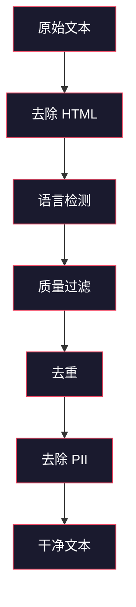
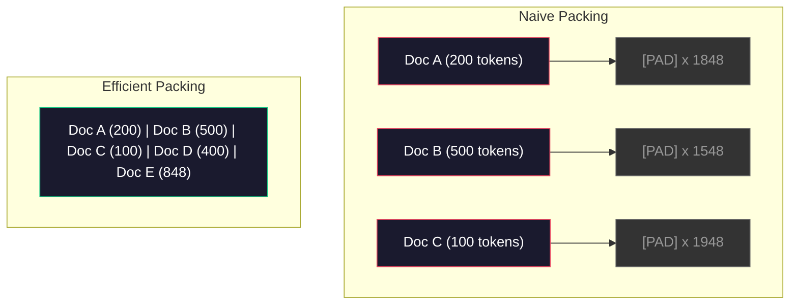

# 预训练数据流水线（Data Pipelines for Pre-Training）

> 译注：本文译自同目录 [`en.md`](./en.md)。术语遵循仓根 [TRANSLATION_GUIDE.md](../../../../TRANSLATION_GUIDE.md)。

> 模型是一面镜子。你喂它什么，它就反射什么。喂垃圾进去，它就用极其流利的语言反射出垃圾来。

**Type:** Build
**Languages:** Python
**Prerequisites:** Phase 10, Lessons 01-02 (Tokenizers, Building a Tokenizer)
**Time:** ~90 minutes

## 学习目标（Learning Objectives）

- 构建一条流式数据流水线（pipeline），对 TB 级文本完成 tokenize、切片（chunk）、shuffle 和打 batch，全程不把数据全部装入内存
- 实现真实预训练流水线里用到的数据质量过滤器：去重（deduplication）、语言检测、内容过滤
- 生成定长训练序列，配上正确的 attention mask，并妥善处理文档边界
- profile 流水线吞吐，确保 dataloader 能跟上 GPU 训练速度

## 问题（The Problem）

你已经有了 tokenizer，现在需要数据。

不是某个 dataset，也不是一个 CSV 文件。是 TB 级的文本——经过清洗、去重、质量过滤、tokenize 成定长序列，并以足够快的速度被随机打成 batch 喂出来，让你 8 卡 GPU 集群永远不会卡在等下一个 batch 上。

大多数人以为训练 LLM 关键在模型架构。错。Llama 3 用了 15.6 万亿 token，GPT-3 用了 3000 亿，DeepSeek-V2 用了 8.1 万亿。这三家的架构其实大同小异：堆叠的 transformer 块，里面是 attention 和前馈层。输出质量的差距，绝大部分来自数据。

DeepMind 的 Chinchilla 论文把这件事讲清楚了：在给定的算力预算下，模型参数量和训练 token 量存在一个最优比例。Chinchilla 表明 2022 年的大多数模型都被严重欠训练（undertrained）——参数量相对于看到的数据量太大了。一个用 1.4 万亿 token 训练的 70B 模型（Chinchilla 最优）跑赢了用 3000 亿 token 训练的 280B 模型（Gopher）。

你的数据流水线决定了模型学到的是语言，还是噪声。

## 概念（The Concept）

### 数据从哪来（Where the Data Comes From）

每个大语言模型都是在多种来源的混合数据上训练的。具体配比对大多数实验室来说是核心机密，但我们对类别的了解已经够看懂全貌。

| 来源 | 体量 | 质量 | 谁在用 |
|--------|------|---------|---------|
| Common Crawl | 原始 ~250 TB | 低（需要重度过滤） | GPT-3、Llama，多数开源模型 |
| Wikipedia | ~20 GB | 高 | 几乎所有主流 LLM |
| GitHub 代码 | ~1 TB+ | 中（重复多、死代码多） | StarCoder、CodeLlama、DeepSeek-Coder |
| 图书（BookCorpus、Pile） | ~100 GB | 高 | GPT-2、GPT-3，早期模型 |
| 学术论文（arXiv、S2ORC） | ~100 GB | STEM 领域质量高 | Llama、Galactica |
| StackOverflow、Reddit | ~100 GB | 中 | Llama、Falcon |
| 精选 Web（C4、RefinedWeb） | ~5 TB | 中—高（已预过滤） | T5、Falcon |

Llama 3 公开了它的数据配比：约 50% 网页数据、25% 代码、13% 图书与学术论文、8% 数学数据、4% 多语种网页数据。总量是 15.6 万亿 token，原始来源超过 5 TB 文本。

配比和总量同样重要。网页数据太多，模型就变成 Reddit 复读机；代码太少，模型不会编程；数学太少，推理就垮。把这个 mix 调好是训练 LLM 最难的部分之一，没有现成公式——必须靠实验和评估。

### 数据清洗（Data Cleaning）

原始网页数据脏得很。一个典型的 Common Crawl dump 里包含：

- HTML 标签和 JavaScript
- 模板化的页头、页脚、导航菜单
- 重复页面（完全重复和近似重复）
- 机器生成的垃圾内容
- 个人身份信息（PII）
- 低质量文本（关键词列表、SEO 垃圾）
- 以文本形式编码的非文本内容

清洗不是可选项。它决定了你的模型是输出连贯段落，还是吐出 HTML 标签夹杂着商品列表。



每一步都消除一类噪声：

**HTML 剥离：** 去掉所有标记，只留下可见文本内容。`trafilatura` 或 `readability` 这类库会抽取正文，丢掉导航、广告和模板。

**语言检测：** 用 fastText 的语言识别模型（lid.176.bin）给每篇文档分类，过滤到目标语言。如果一篇文档被判为英文但置信度不到 0.8，那它多半就不是干净的英文。

**质量过滤：** 这一步开始有意思。RefinedWeb（Falcon 背后的数据集）用基于 perplexity（困惑度）的过滤器：先在 Wikipedia 上训练一个小语言模型，再给每篇文档打分。perplexity 高意味着这篇文档不像 Wikipedia——很可能是垃圾、关键词列表或机器生成内容。perplexity 超过阈值的文档被剔除。

**Deduplication（去重）：** 对最终效果影响最大的清洗步骤。Common Crawl 里有海量重复页面——法律免责声明、cookie 提示、服务条款。在重复数据上训练既浪费算力，又会导致模型死记硬背、原文复述特定段落。

**PII 移除：** 姓名、邮箱、电话、社保号等。结构化 PII 用正则检测，上下文里的人名用 NER 模型识别。

### 用 MinHash 做去重（Deduplication with MinHash）

完全去重很简单：每篇文档算个 hash，重复的删掉。但真正的麻烦是近似重复（near-duplicate）。同一篇新闻文章的两份拷贝、四周广告稍有不同，就是近似重复——内容 95% 一样，逐字节比却不同。

MinHash + Locality-Sensitive Hashing（LSH，局部敏感哈希）能高效解决这个问题。


思路：

1. **Shingling（分片）：** 把每篇文档转成 n-gram 集合（比如词或字符的 5-gram）。"the quick brown fox" 用 3 词 shingle 就变成 {"the quick brown", "quick brown fox"}。

2. **MinHash：** 对每篇文档的 shingle 集合，计算 k 个 hash 值。每个 hash 值是用一个不同 hash 函数对所有 shingle 求得的最小 hash。这样得到一个固定大小的"签名"，能近似两篇文档间的 Jaccard 相似度。

3. **LSH：** 把 MinHash 签名按"带"（band）分组，再把文档放进 bucket。落在同一 bucket 的文档就是候选近似重复对。这样就不用两两比较——只比候选对。

4. **验证：** 对每对候选，计算精确的 Jaccard 相似度。相似度超过阈值（通常 0.8）就删掉一份。

Llama 团队报告说去重后他们的网页数据被砍掉了大约 38%。这不是个小数。Common Crawl 里超过三分之一的内容是重复或近似重复的。

### 序列打包（Sequence Packing）

模型期望的是定长输入序列，可你的文档是变长的。有的 50 token，有的 50000 token。

朴素做法：把每篇文档 pad 到最大序列长度。这会把巨量算力浪费在对训练毫无贡献的 padding token 上。

更好的做法：把多篇文档打包到同一条序列里，用 end-of-sequence token 分隔。一条 2048-token 的序列可以装下三篇短文档，中间用 [EOS] 分隔。



attention mask 必须设对。同一条打包序列里，文档 A 的 token 不应该 attend 到文档 B 的 token，这就需要一个块对角的 attention mask。

长文档会被截断或在序列边界切成多块。切的位置很关键：从句子中间切，会逼模型看不完整的语义。一些流水线会尽量把切点对齐到段落或句子边界。

### Chinchilla 缩放定律（The Chinchilla Scaling Law）

在算力预算 C 固定（以 FLOPs 计）时，最优模型规模 N 和数据集大小 D 满足：

```
N_opt ~ C^0.5
D_opt ~ C^0.5
```

实际意义是：模型规模和数据集大小要大致同步扩张。参数多 10 倍的模型，需要大约 10 倍的训练 token 才能达到同样的损失（loss）。

| 模型 | 参数量 | 训练 token | 是否 Chinchilla 最优？ |
|-------|-----------|----------------|-------------------|
| GPT-3 | 175B | 300B | 否（欠训练 3-4 倍） |
| Chinchilla | 70B | 1.4T | 是（设计如此） |
| Llama 2 | 70B | 2T | 过训练（有意为之） |
| Llama 3 | 70B | 15T | 严重过训练 |

Llama 3 是故意违背 Chinchilla 定律的。Meta 发现：在远超算力最优比例的数据上过训练，能换来更好的推理（inference）模型。多花的训练成本只付一次，但更小的模型在长期 serving 中便宜得多。这种思路常被称为"inference-optimal"缩放，2024 年起已成为业界标准。

## 动手实现（Build It）

### 第 1 步：文本清洗（Step 1: Text Cleaning）

剥离 HTML、规范化空白、去除非文本内容。我们用一段公共领域文本（Project Gutenberg）当小语料库。

```python
import re

def clean_text(text):
    text = re.sub(r"<[^>]+>", "", text)
    text = re.sub(r"http\S+", "", text)
    text = re.sub(r"[^\x20-\x7E\n]", "", text)
    text = re.sub(r"\n{3,}", "\n\n", text)
    text = re.sub(r" {2,}", " ", text)
    return text.strip()

def quality_filter(text, min_words=50, max_ratio_caps=0.3, max_ratio_special=0.1):
    words = text.split()
    if len(words) < min_words:
        return False
    caps_ratio = sum(1 for w in words if w.isupper()) / len(words)
    if caps_ratio > max_ratio_caps:
        return False
    special_chars = sum(1 for c in text if not c.isalnum() and not c.isspace())
    if special_chars / max(len(text), 1) > max_ratio_special:
        return False
    return True
```

这个质量过滤器能拦下 SEO 垃圾（全大写）、机器生成噪声（特殊字符比例高）和残桩页面（太短）。仅这三个检查，就能从网页爬取数据里剔除惊人比例的垃圾。

### 第 2 步：MinHash 去重（Step 2: MinHash Deduplication）

从零实现 MinHash，不用任何外部库——只用 `hashlib`。

```python
import hashlib
from collections import defaultdict

def get_shingles(text, k=5):
    words = text.lower().split()
    if len(words) < k:
        return set()
    return {" ".join(words[i:i+k]) for i in range(len(words) - k + 1)}

def minhash_signature(shingles, num_hashes=128):
    signature = []
    for i in range(num_hashes):
        min_hash = float("inf")
        for shingle in shingles:
            h = int(hashlib.sha256(f"{i}:{shingle}".encode()).hexdigest(), 16)
            min_hash = min(min_hash, h)
        signature.append(min_hash)
    return signature

def lsh_buckets(signature, bands=16):
    rows_per_band = len(signature) // bands
    buckets = []
    for b in range(bands):
        start = b * rows_per_band
        band_data = tuple(signature[start:start + rows_per_band])
        bucket_hash = hashlib.md5(str(band_data).encode()).hexdigest()
        buckets.append((b, bucket_hash))
    return buckets

def deduplicate(documents, threshold=0.8, num_hashes=128, bands=16):
    signatures = []
    shingle_sets = []
    for doc in documents:
        shingles = get_shingles(doc)
        shingle_sets.append(shingles)
        signatures.append(minhash_signature(shingles, num_hashes))

    bucket_map = defaultdict(list)
    for doc_idx, sig in enumerate(signatures):
        for band_id, bucket_hash in lsh_buckets(sig, bands):
            bucket_map[(band_id, bucket_hash)].append(doc_idx)

    duplicate_pairs = set()
    for bucket_docs in bucket_map.values():
        if len(bucket_docs) < 2:
            continue
        for i in range(len(bucket_docs)):
            for j in range(i + 1, len(bucket_docs)):
                duplicate_pairs.add((bucket_docs[i], bucket_docs[j]))

    removed = set()
    for i, j in duplicate_pairs:
        if i in removed or j in removed:
            continue
        s1, s2 = shingle_sets[i], shingle_sets[j]
        if not s1 or not s2:
            continue
        jaccard = len(s1 & s2) / len(s1 | s2)
        if jaccard >= threshold:
            removed.add(j)

    return [doc for idx, doc in enumerate(documents) if idx not in removed], len(removed)
```

`num_hashes=128` 和 `bands=16` 这两个参数控制 precision-recall 取舍。hash 越多，相似度估计越准；band 越多，召回越高（能抓到更多重复），但误报也增多。这组数值在常见网页文本上效果不错。

### 第 3 步：tokenize 并打包序列（Step 3: Tokenize and Pack Sequences）

把清洗、去重后的文本拿去 tokenize，再打包成定长序列供训练用。

```python
def tokenize_corpus(documents, tokenizer):
    all_tokens = []
    for doc in documents:
        tokens = tokenizer.encode(doc)
        all_tokens.extend(tokens)
        all_tokens.append(tokenizer.eos_id)
    return all_tokens

def pack_sequences(token_ids, seq_length, pad_id=0):
    sequences = []
    attention_masks = []
    for i in range(0, len(token_ids), seq_length):
        seq = token_ids[i:i + seq_length]
        mask = [1] * len(seq)
        if len(seq) < seq_length:
            pad_count = seq_length - len(seq)
            seq = seq + [pad_id] * pad_count
            mask = mask + [0] * pad_count
        sequences.append(seq)
        attention_masks.append(mask)
    return sequences, attention_masks
```

### 第 4 步：训练用 DataLoader（Step 4: DataLoader for Training）

吐出随机打 batch 的打包序列，这就是训练循环要消费的东西。

```python
import random

class PreTrainingDataLoader:
    def __init__(self, sequences, attention_masks, batch_size, shuffle=True):
        self.sequences = sequences
        self.attention_masks = attention_masks
        self.batch_size = batch_size
        self.shuffle = shuffle

    def __len__(self):
        return (len(self.sequences) + self.batch_size - 1) // self.batch_size

    def __iter__(self):
        indices = list(range(len(self.sequences)))
        if self.shuffle:
            random.shuffle(indices)
        for start in range(0, len(indices), self.batch_size):
            batch_idx = indices[start:start + self.batch_size]
            batch_seqs = [self.sequences[i] for i in batch_idx]
            batch_masks = [self.attention_masks[i] for i in batch_idx]
            yield batch_seqs, batch_masks
```

### 第 5 步：数据集统计（Step 5: Dataset Statistics）

算出真正重要的数字：总 token 数、unique token 数、压缩比、文档长度分布。

```python
from collections import Counter

def compute_statistics(documents, token_ids, sequences, tokenizer_vocab_size):
    total_chars = sum(len(d) for d in documents)
    total_tokens = len(token_ids)
    unique_tokens = len(set(token_ids))
    compression_ratio = total_chars / total_tokens

    doc_lengths = [len(d.split()) for d in documents]
    avg_doc_length = sum(doc_lengths) / max(len(doc_lengths), 1)
    max_doc_length = max(doc_lengths) if doc_lengths else 0
    min_doc_length = min(doc_lengths) if doc_lengths else 0

    token_counts = Counter(token_ids)
    top_tokens = token_counts.most_common(10)

    non_pad_tokens = sum(sum(1 for t in seq if t != 0) for seq in sequences)
    total_positions = sum(len(seq) for seq in sequences)
    utilization = non_pad_tokens / max(total_positions, 1)

    stats = {
        "total_documents": len(documents),
        "total_characters": total_chars,
        "total_tokens": total_tokens,
        "unique_tokens": unique_tokens,
        "vocab_utilization": unique_tokens / tokenizer_vocab_size,
        "compression_ratio": compression_ratio,
        "avg_doc_length_words": avg_doc_length,
        "max_doc_length_words": max_doc_length,
        "min_doc_length_words": min_doc_length,
        "num_sequences": len(sequences),
        "sequence_utilization": utilization,
        "top_10_tokens": top_tokens,
    }
    return stats
```

压缩比能告诉你 tokenizer 在这个语料上效率如何。英文文本通常压缩到每 token 大约 3-4 个字符。如果你看到每 token 1.5 个字符，说明 tokenizer 切得太碎；如果到了 8+，说明它学到了非常领域特定的合并。

序列利用率告诉你打包序列里多大比例是真数据、多少是 padding。低于 90% 说明打包效率不行——你在 padding token 上浪费算力。

## 用起来（Use It）

### 与 HuggingFace Datasets 对比（Compare With HuggingFace Datasets）

把同样的语料用 HuggingFace 的 datasets 库走一遍，对比流水线速度。

```python
from datasets import load_dataset
from transformers import AutoTokenizer

ds = load_dataset("wikitext", "wikitext-2-raw-v1", split="train")
tokenizer = AutoTokenizer.from_pretrained("meta-llama/Meta-Llama-3-8B")

import time

start = time.time()
tokenized = ds.map(
    lambda x: tokenizer(x["text"], truncation=True, max_length=2048),
    batched=True,
    num_proc=4,
)
hf_time = time.time() - start
total_tokens = sum(len(t) for t in tokenized["input_ids"])
print(f"HuggingFace: {total_tokens:,} tokens in {hf_time:.2f}s ({total_tokens/hf_time:,.0f} tokens/sec)")
```

HuggingFace 流水线底层用 Rust 实现的 tokenizer，再加上 4 核并行处理。你用纯 Python 写的流水线会慢 10-50 倍。这个差距就是为什么生产团队都用编译好的 tokenizer。算法是同一个，差别只在实现语言。

## 上线部署（Ship It）

本课产出一个用于在 LLM 训练流水线里校验和调试数据质量的 prompt，见 `outputs/prompt-data-quality-checker.md`。

## 练习（Exercises）

1. **Easy：** 用一个简单的启发式（字符集分析）给清洗流水线加上语言检测。过滤到只剩英文文档，并测量被剔除了多少篇。
2. **Medium：** 在 MinHash 近似去重旁边再实现一个用 SHA-256 hash 的精确去重。在网页爬取语料上对比两种方法各自抓到多少重复。
3. **Hard：** 构建一个基于 perplexity 的质量过滤器。在 Wikipedia 文本上训练一个小的 bigram 语言模型，按 perplexity 给每篇文档打分，剔除最差 20%。对比在过滤后 vs 未过滤数据上训练的模型输出质量。

## 关键术语（Key Terms）

| 术语 | 大家口头怎么说 | 实际含义 |
|------|----------------|----------------------|
| Common Crawl | "互联网" | 一个非营利组织，每月爬取整个网页——原始约 250TB，是大多数 LLM 训练数据的起点 |
| MinHash | "某种 hash 技巧" | 用固定大小签名估计集合 Jaccard 相似度的一种技术——让大规模近似重复检测成为可能 |
| LSH | "Locality-Sensitive Hashing" | 把相似项归到同一 bucket 的方法——把两两比较从 O(n^2) 降到接近线性 |
| Sequence packing | "把文档拼起来" | 把多篇文档塞进定长序列，配上正确的 attention mask——消除 padding 浪费 |
| Chinchilla scaling | "多用点数据" | 在固定算力预算下，达到最佳效果需要把模型规模和训练 token 大致同步扩张 |
| Fertility | "每词多少 token" | 平均每个词产生多少 token——GPT-4 在英文上是 1.3，非拉丁文字更高 |
| Data mixing | "选训练数据" | 代码、文本、数学、多语种数据的配比——没有公式，要靠实验 |
| Perplexity filter | "质量打分" | 用一个小语言模型给文档打分——perplexity 高意味着文本不像干净参考数据 |
| Deduplication | "删重复" | 剔除完全重复和近似重复的文档——通常砍掉 30-40% 的原始网页数据 |
| Attention mask | "看哪些 token" | 在打包序列里阻止 attention 跨文档边界的二值掩码 |

## 延伸阅读（Further Reading）

- [Hoffmann et al., 2022 — Training Compute-Optimal Large Language Models (Chinchilla)](https://arxiv.org/abs/2203.15556)——改变我们对数据规模认知的论文
- [Penedo et al., 2023 — The RefinedWeb Dataset for Falcon LLM](https://arxiv.org/abs/2306.01116)——如何把 Common Crawl 过滤到高质量
- [Touvron et al., 2023 — Llama 2: Open Foundation and Fine-Tuned Chat Models](https://arxiv.org/abs/2307.09288)——Llama 2 的数据流水线细节
- [Lee et al., 2022 — Deduplicating Training Data Makes Language Models Better](https://arxiv.org/abs/2107.06499)——为什么去重比你以为的更重要
- [Broder, 1997 — On the Resemblance and Containment of Documents](https://ieeexplore.ieee.org/document/666900)——MinHash 原始论文
- [Meta, 2024 — Llama 3 Technical Report](https://arxiv.org/abs/2407.21783)——15.6T token、数据混合配比、过滤流水线
