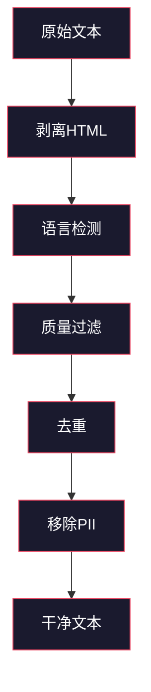
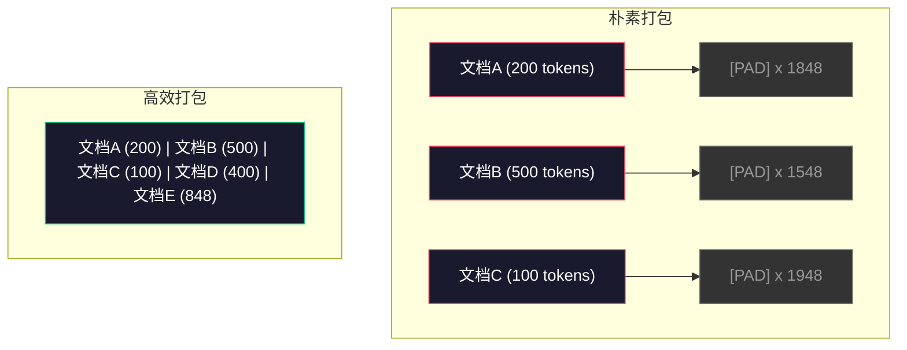

# 预训练数据管道

> 模型是一面镜子。它忠实地反映你输入的任何数据。你输入垃圾，它就会流利地输出垃圾。

**类型：** 构建
**语言：** Python
**先决条件：** 阶段10，课程01-02（分词器，构建分词器）
**时间：** 约90分钟

## 学习目标

- 构建一个流式数据管道，无需将所有数据加载到内存即可对TB级文本进行分词、分块、打乱和分批
- 实现实际预训练管道中使用的数据质量过滤器（去重、语言检测、内容过滤）
- 创建固定长度的训练序列，并带有正确的注意力掩码和文档边界处理
- 分析管道吞吐量，确保数据加载器跟上GPU训练速度

## 问题

你已经有了一个分词器。现在你需要数据。

不是数据集。不是CSV文件。而是TB级的文本——经过清洗、去重、质量过滤、分词为固定长度序列，并以随机批次的形式快速提供，让你的8GPU集群永远不必等待下一个批次。

大多数人认为训练LLM是关于模型架构的。但并非如此。Llama 3使用了15.6万亿个token。GPT-3使用了3000亿。DeepSeek-V2使用了8.1万亿。这三者的架构大致相同：堆叠的Transformer块，包含注意力层和前馈层。输出质量的差异主要来自数据。

DeepMind的Chinchilla论文精确地阐述了这一点。对于给定的计算预算，模型参数与训练token之间存在最优比例。Chinchilla表明，2022年的大多数模型都严重训练不足——它们的参数过多，而看到的数据量不足。一个700亿参数的模型在1.4万亿token上训练（Chinchilla最优），其性能优于一个2800亿参数模型在3000亿token上训练（Gopher）。

你的数据管道决定了你的模型是学习语言还是学习噪声。

## 概念

### 数据来源

每个大型语言模型都在多种来源的混合数据上进行训练。确切的组成对大多数实验室来说是严格保密的，但我们了解得足够多，可以理解这些类别。

| 来源 | 大小 | 质量 | 使用方 |
|--------|------|---------|---------|
| Common Crawl | 约250 TB原始 | 低（需要大量过滤） | GPT-3, Llama, 大多数开源模型 |
| 维基百科 | 约20 GB | 高 | 每个主要LLM |
| GitHub代码 | 约1 TB+ | 中等（大量重复、死代码） | StarCoder, CodeLlama, DeepSeek-Coder |
| 书籍（BookCorpus, Pile） | 约100 GB | 高 | GPT-2, GPT-3, 早期模型 |
| 学术论文（arXiv, S2ORC） | 约100 GB | 高（适用于STEM） | Llama, Galactica |
| StackOverflow, Reddit | 约100 GB | 中等 | Llama, Falcon |
| 策展网络数据（C4, RefinedWeb） | 约5 TB | 中高（预过滤） | T5, Falcon |

Llama 3公开了它的数据组合：大约50%的网络数据，25%的代码，13%的书籍和学术论文，8%的数学数据，以及4%的多语言网络数据。总共15.6万亿个token，来自超过5 TB的原始文本。

比例与总大小同样重要。网络数据太多，模型就会变成Reddit的鹦鹉。代码太少，模型就无法编程。数学太少，模型就会推理失败。正确组合是训练LLM最困难的部分之一，没有公式——需要实验和评估。

### 数据清洗

原始网络数据是肮脏的。一个典型的Common Crawl转储包含：

- HTML标签和JavaScript
- 模板化的页眉、页脚、导航菜单
- 重复页面（完全重复和近似重复）
- 机器生成的垃圾信息
- 个人身份信息（PII）
- 低质量文本（关键词列表、SEO垃圾信息）
- 编码为文本的非文本内容

清洗是不可选的。这是模型生成连贯段落与输出混有产品列表的HTML标签之间的区别。



每个步骤消除一类噪声：

**HTML剥离：** 移除所有标记。只保留可见文本内容。像`trafilatura`或`readability`这样的库可以提取文章内容，同时丢弃导航、广告和模板文本。

**语言检测：** 使用fastText的语言识别模型（lid.176.bin）对每篇文档进行分类。过滤到目标语言。一篇文档被分类为英文但置信度低于0.8，可能不是干净的英文。

**质量过滤：** 这是有趣的地方。RefinedWeb（Falcon背后的数据集）使用基于困惑度的过滤器：在维基百科文本上训练一个小型语言模型，然后对每篇文档进行评分。高困惑度意味着文档不像维基百科——可能是垃圾信息、关键词列表或机器生成的内容。困惑度超过阈值的文档被移除。

**去重：** 单个影响最大的清洗步骤。Common Crawl包含数量巨大的重复页面——法律免责声明、Cookie通知、服务条款。在重复数据上训练浪费计算资源，并可能导致模型逐字记忆和复述特定段落。

**PII移除：** 姓名、电子邮件地址、电话号码、社会安全号码。使用基于正则表达式的检测处理结构化PII，使用命名实体识别（NER）模型处理上下文中的姓名。

### 使用最小哈希（MinHash）进行去重

精确去重很容易：对每篇文档进行哈希，移除重复项。但近似重复才是真正的问题。同一篇新闻文章的两个副本，周围带有略有不同的广告，就是近似重复。内容有95%相同，但逐字节比较它们不同。

最小哈希（MinHash） + 局部敏感哈希（LSH）可以高效地解决这个问题。


思路：

1. **分片（Shingling）：** 将每篇文档转换为一组n-gram（例如，5-gram的词或字符）。"the quick brown fox"使用3词分片，变成 {"the quick brown", "quick brown fox"}。

2. **最小哈希（MinHash）：** 对于每个文档的分片集合，计算k个哈希值。每个哈希值是在不同哈希函数下所有分片的最小哈希值。这创建了一个固定大小的“签名”，可以近似任何两篇文档之间的杰卡德相似度。

3. **局部敏感哈希（LSH）：** 基于最小哈希签名的带（band）将文档分组到桶中。在同一桶中的文档是候选近似重复。这避免了对每一对进行比较——你只比较候选对。

4. **验证：** 对于每个候选对，计算精确杰卡德相似度。如果相似度超过阈值（通常为0.8），移除其中一个副本。

Llama团队报告说，通过去重移除了大约38%的网络数据。这不是一个小数字。超过三分之一的Common Crawl是重复或近似重复内容。

### 序列打包

你的模型期望固定长度的输入序列。你的文档是可变长度的。有些只有50个token。有些有50,000个token。

朴素方法：将每个文档填充到最大序列长度。这在填充token上浪费了大量计算资源，这些token对学习没有任何贡献。

更好的方法：将多个文档打包成一个序列，用序列结束token分隔。一个2048 token的序列可能包含三个短文档，它们之间用[EOS] token连接。



注意力掩码必须正确设置。文档A的token不应关注同一打包序列中文档B的token。这需要块对角注意力掩码。

长文档被截断或在序列边界处分成块。分割点很重要：在句子中间分割迫使模型看到不完整的思路。一些管道尽可能在段落或句子边界处对齐分割。

### 冷杉（Chinchilla）缩放定律

对于固定计算预算C（以FLOPs衡量），最优模型大小N和数据集大小D遵循：

```
N_opt ~ C^0.5
D_opt ~ C^0.5
```

在实践中，这意味着你应该大致相等地缩放模型大小和数据集大小。一个参数增加10倍的模型需要大约10倍的训练token才能达到相同的损失。

| 模型 | 参数 | 训练Token | 冷杉最优？ |
|-------|-----------|----------------|-------------------|
| GPT-3 | 175B | 300B | 否（训练不足3-4倍） |
| Chinchilla | 70B | 1.4T | 是（按设计） |
| Llama 2 | 70B | 2T | 过度训练（有意为之） |
| Llama 3 | 70B | 15T | 严重过度训练 |

Llama 3故意违反了Chinchilla定律。Meta发现，在更多数据上过度训练——远远超出计算最优比例——会产生更好的推理模型。额外的训练成本只支付一次，但较小的模型永远更便宜提供服务。这有时被称为“推理最优”缩放方法，并且自2024年以来已成为行业标准。

## 构建它

### 步骤1：文本清洗

剥离HTML，规范化空白，移除非文本内容。我们将使用公共领域文本（古腾堡计划）作为我们的小型语料库。

```python
import re

def clean_text(text):
    text = re.sub(r"<[^>]+>", "", text)  # 移除HTML标签
    text = re.sub(r"http\S+", "", text)  # 移除URL
    text = re.sub(r"[^\x20-\x7E\n]", "", text)  # 移除非ASCII可打印字符
    text = re.sub(r"\n{3,}", "\n\n", text)  # 将多个换行符替换为两个
    text = re.sub(r" {2,}", " ", text)  # 将多个空格替换为一个
    return text.strip()

def quality_filter(text, min_words=50, max_ratio_caps=0.3, max_ratio_special=0.1):
    words = text.split()
    if len(words) < min_words:  # 少于最小词数，过滤
        return False
    caps_ratio = sum(1 for w in words if w.isupper()) / len(words)  # 大写词比例
    if caps_ratio > max_ratio_caps:
        return False
    special_chars = sum(1 for c in text if not c.isalnum() and not c.isspace())  # 特殊字符数
    if special_chars / max(len(text), 1) > max_ratio_special:
        return False
    return True
```

质量过滤器可以捕获SEO垃圾（全大写）、机器生成的噪声（高特殊字符比例）和页面片段（太短）。仅这三个检查就能从网络爬虫中移除令人惊讶的大量垃圾。

### 步骤2：MinHash去重

从头实现MinHash。不需要外部库——只需`hashlib`。

```python
import hashlib
from collections import defaultdict

def get_shingles(text, k=5):
    """将文本转换为k词分片集合"""
    words = text.lower().split()
    if len(words) < k:
        return set()
    return {" ".join(words[i:i+k]) for i in range(len(words) - k + 1)}

def minhash_signature(shingles, num_hashes=128):
    """为分片集合计算MinHash签名"""
    signature = []
    for i in range(num_hashes):
        min_hash = float("inf")
        for shingle in shingles:
            h = int(hashlib.sha256(f"{i}:{shingle}".encode()).hexdigest(), 16)
            min_hash = min(min_hash, h)
        signature.append(min_hash)
    return signature

def lsh_buckets(signature, bands=16):
    """将签名划分为多个带，并生成桶哈希"""
    rows_per_band = len(signature) // bands
    buckets = []
    for b in range(bands):
        start = b * rows_per_band
        band_data = tuple(signature[start:start + rows_per_band])
        bucket_hash = hashlib.md5(str(band_data).encode()).hexdigest()
        buckets.append((b, bucket_hash))
    return buckets

def deduplicate(documents, threshold=0.8, num_hashes=128, bands=16):
    """对文档列表进行去重，返回去重后的文档和移除的数量"""
    signatures = []
    shingle_sets = []
    for doc in documents:
        shingles = get_shingles(doc)
        shingle_sets.append(shingles)
        signatures.append(minhash_signature(shingles, num_hashes))

    bucket_map = defaultdict(list)
    for doc_idx, sig in enumerate(signatures):
        for band_id, bucket_hash in lsh_buckets(sig, bands):
            bucket_map[(band_id, bucket_hash)].append(doc_idx)

    duplicate_pairs = set()
    for bucket_docs in bucket_map.values():
        if len(bucket_docs) < 2:
            continue
        for i in range(len(bucket_docs)):
            for j in range(i + 1, len(bucket_docs)):
                duplicate_pairs.add((bucket_docs[i], bucket_docs[j]))

    removed = set()
    for i, j in duplicate_pairs:
        if i in removed or j in removed:
            continue
        s1, s2 = shingle_sets[i], shingle_sets[j]
        if not s1 or not s2:
            continue
        jaccard = len(s1 & s2) / len(s1 | s2)
        if jaccard >= threshold:
            removed.add(j)

    return [doc for idx, doc in enumerate(documents) if idx not in removed], len(removed)
```

`num_hashes=128`和`bands=16`参数控制精确率-