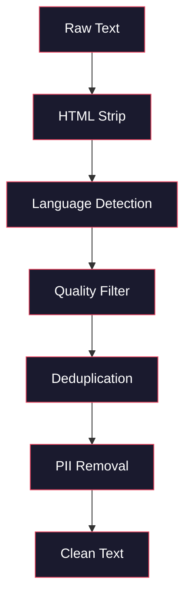
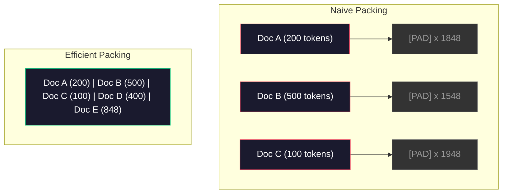

# 03 · 面向预训练的数据管线

> 模型是一面镜子。你喂给它什么数据，它就反射出什么。喂它垃圾，它就用完美的流畅度反射出垃圾。

**类型：** 实践构建
**语言：** Python
**前置：** 阶段 10，第 01-02 课（分词器、构建一个分词器）
**时长：** 约 90 分钟

## 学习目标

- 构建一条流式（streaming）数据管线，对 TB 级文本进行分词、切块、打乱与分批，而无需把全部数据载入内存
- 实现真实预训练管线中使用的数据质量过滤器（去重、语言检测、内容过滤）
- 创建定长训练序列，并正确处理注意力掩码（attention mask）与文档边界
- 对管线吞吐量做性能剖析（profile），确保数据加载器（dataloader）能跟上 GPU 的训练速度

## 问题所在

你已经有了一个分词器。现在你需要数据。

不是一个数据集，不是一个 CSV 文件。而是 TB 级的文本——经过清洗、去重、质量过滤，分词成定长序列，并以随机化的批次足够快地供给，让你的 8 卡 GPU 集群永远不必等待下一个批次。

大多数人以为训练大语言模型靠的是模型架构。并非如此。Llama 3 用了 15.6 万亿个 token。GPT-3 用了 3000 亿。DeepSeek-V2 用了 8.1 万亿。这三者的架构大致相同：堆叠的 transformer 块，配以注意力层和前馈层。输出质量上的差异，绝大部分来自数据。

DeepMind 的 Chinchilla 论文把这件事讲得很精确。对于给定的算力预算，模型参数量与训练 token 数之间存在一个最优比例。Chinchilla 表明，2022 年大多数模型都被严重「训练不足（undertrained）」——相对于它们所见的数据量，参数太多了。一个用 1.4 万亿 token 训练的 70B 参数模型（Chinchilla 最优配置）胜过一个用 3000 亿 token 训练的 280B 模型（Gopher）。

你的数据管线决定了你的模型究竟是学会了语言，还是学会了噪声。

## 核心概念

### 数据从哪里来

每个大语言模型都是在多种来源的混合数据上训练的。对大多数实验室而言，确切的配比是严守的秘密，但我们对各个类别的了解已经足够。

| 来源 | 规模 | 质量 | 使用者 |
|--------|------|---------|---------|
| Common Crawl | 原始约 250 TB | 低（需要重度过滤） | GPT-3、Llama，大多数开源模型 |
| Wikipedia | 约 20 GB | 高 | 每一个主流 LLM |
| GitHub 代码 | 约 1 TB+ | 中（大量重复、失效代码） | StarCoder、CodeLlama、DeepSeek-Coder |
| 图书（BookCorpus、Pile） | 约 100 GB | 高 | GPT-2、GPT-3，早期模型 |
| 学术论文（arXiv、S2ORC） | 约 100 GB | STEM 领域高 | Llama、Galactica |
| StackOverflow、Reddit | 约 100 GB | 中 | Llama、Falcon |
| 精选网页（C4、RefinedWeb） | 约 5 TB | 中高（已预过滤） | T5、Falcon |

Llama 3 披露了它的数据配比：约 50% 网页数据、25% 代码、13% 图书与学术论文、8% 数学数据、4% 多语种网页数据。总量为 15.6 万亿 token，源自超过 5 TB 原始文本的素材。

配比与总规模同等重要。网页数据过多，模型就变成一只「Reddit 鹦鹉」。代码太少，它就不会编程。数学太少，它就在推理上栽跟头。把这套配比调对，是训练 LLM 中最难的部分之一，而且没有公式——它需要实验与评估。

### 数据清洗

原始网页数据脏得很。一份典型的 Common Crawl 转储（dump）包含：

- HTML 标签和 JavaScript
- 样板式的页眉、页脚、导航菜单
- 重复页面（完全重复与近似重复）
- 机器生成的垃圾内容
- 个人可识别信息（PII）
- 低质量文本（关键词堆砌、SEO 垃圾）
- 编码为文本的非文本内容

清洗这些并非可选项。它决定了你的模型究竟是生成连贯的段落，还是输出夹杂着商品列表的 HTML 标签。



每一步都消除一类噪声：

**HTML 剥离：** 移除所有标记，只保留可见的文本内容。像 `trafilatura` 或 `readability` 这样的库能提取文章正文，同时丢弃导航、广告和样板内容。

**语言检测：** 使用 fastText 的语言识别模型（lid.176.bin）对每篇文档分类。过滤到你的目标语言。一篇被判定为英语但置信度低于 0.8 的文档，多半不是干净的英语。

**质量过滤：** 这里开始变得有意思。RefinedWeb（Falcon 背后的数据集）使用一种基于困惑度（perplexity）的过滤器：在 Wikipedia 上训练一个小型语言模型，然后给每篇文档打分。困惑度高意味着这篇文档与 Wikipedia 不像——很可能是垃圾内容、关键词列表或机器生成的内容。困惑度超过阈值的文档会被移除。

**去重（Deduplication）：** 影响最大的单个清洗步骤。Common Crawl 包含数量惊人的重复页面——法律免责声明、Cookie 提示、服务条款。在重复内容上训练会浪费算力，还可能导致模型逐字记忆并复述特定段落。

**PII 移除：** 姓名、电子邮件地址、电话号码、社会保障号。对结构化 PII 采用基于正则（regex）的检测，对上下文中的姓名采用命名实体识别（NER）模型。

### 用 MinHash 去重

完全去重很简单：对每篇文档做哈希，移除重复项。但近似重复才是真正的难题。同一篇新闻文章的两份副本，周围广告略有不同，就构成近似重复。内容 95% 相同，但逐字节看却有差异。

MinHash + 局部敏感哈希（Locality-Sensitive Hashing，LSH）能高效解决这个问题。


思路如下：

1. **分片（Shingling）：** 将每篇文档转换成一个 n-gram 集合（例如词或字符的 5-gram）。"the quick brown fox" 用 3 词分片后变成 {"the quick brown", "quick brown fox"}。

2. **MinHash：** 对每篇文档的分片集合，计算 k 个哈希值。每个哈希值是在某个不同哈希函数下，所有分片中的最小哈希。这就生成了一个定长「签名（signature）」，它近似了任意两篇文档之间的 Jaccard 相似度。

3. **LSH：** 根据 MinHash 签名的若干「带（band）」把文档分组到桶（bucket）里。落在同一个桶中的文档就是候选近似重复项。这样就避免了两两比较——你只需比较候选对。

4. **校验：** 对每个候选对，计算精确的 Jaccard 相似度。若相似度超过阈值（通常为 0.8），就移除其中一份副本。

Llama 团队报告称，通过去重移除了约 38% 的网页数据。这可不是小数目。Common Crawl 中有超过三分之一是重复或近似重复内容。

### 序列打包

你的模型期望定长的输入序列。而你的文档长度可变。有的 50 个 token，有的 50000 个 token。

朴素做法：把每篇文档填充（pad）到最大序列长度。这会在对学习毫无贡献的填充 token 上浪费巨量算力。

更好的做法：把多篇文档打包进单个序列，用序列结束（end-of-sequence）token 分隔。一个 2048-token 的序列可能包含三篇短文档，中间用 [EOS] token 拼接。



注意力掩码必须设置正确。在同一个打包序列内，来自文档 A 的 token 不应注意到来自文档 B 的 token。这需要一个块对角（block-diagonal）注意力掩码。

长文档会在序列边界处被截断或切分成块。切分点很重要：在句子中间切分会迫使模型看到不完整的语义。一些管线会在可能时把切分点对齐到段落或句子边界。

### Chinchilla 缩放定律

对于固定的算力预算 C（以 FLOPs 衡量），最优模型规模 N 与数据集规模 D 遵循：

```
N_opt ~ C^0.5
D_opt ~ C^0.5
```

实践中，这意味着你应当大致等比例地扩大模型规模与数据集规模。一个参数多 10 倍的模型，大约需要多 10 倍的训练 token 才能达到相同的损失。

| 模型 | 参数量 | 训练 token | 是否 Chinchilla 最优？ |
|-------|-----------|----------------|-------------------|
| GPT-3 | 175B | 300B | 否（训练不足 3-4 倍） |
| Chinchilla | 70B | 1.4T | 是（按设计） |
| Llama 2 | 70B | 2T | 过度训练（有意为之） |
| Llama 3 | 70B | 15T | 严重过度训练 |

Llama 3 有意违背了 Chinchilla 定律。Meta 发现，在更多数据上「过度训练（overtraining）」——远超算力最优配比——能产出推理表现更好的模型。额外的训练成本只付一次，而更小的模型在部署服务时永远更便宜。这有时被称为「推理最优（inference-optimal）」的缩放思路，自 2024 年以来已成为业界标准。

## 动手构建

### 第 1 步：文本清洗

剥离 HTML、规范化空白字符、移除非文本内容。我们将使用一段公有领域文本（Project Gutenberg）作为小型语料库。

```python
import re

def clean_text(text):
    text = re.sub(r"<[^>]+>", "", text)
    text = re.sub(r"http\S+", "", text)
    text = re.sub(r"[^\x20-\x7E\n]", "", text)
    text = re.sub(r"\n{3,}", "\n\n", text)
    text = re.sub(r" {2,}", " ", text)
    return text.strip()

def quality_filter(text, min_words=50, max_ratio_caps=0.3, max_ratio_special=0.1):
    words = text.split()
    if len(words) < min_words:
        return False
    caps_ratio = sum(1 for w in words if w.isupper()) / len(words)
    if caps_ratio > max_ratio_caps:
        return False
    special_chars = sum(1 for c in text if not c.isalnum() and not c.isspace())
    if special_chars / max(len(text), 1) > max_ratio_special:
        return False
    return True
```

质量过滤器能抓出 SEO 垃圾（全大写）、机器生成的噪声（特殊字符比例过高）以及残桩页面（太短）。仅这三项检查，就能从网页爬取数据中移除多得惊人的垃圾。

### 第 2 步：MinHash 去重

从零实现 MinHash。无需任何外部库——只用 `hashlib`。

```python
import hashlib
from collections import defaultdict

def get_shingles(text, k=5):
    words = text.lower().split()
    if len(words) < k:
        return set()
    return {" ".join(words[i:i+k]) for i in range(len(words) - k + 1)}

def minhash_signature(shingles, num_hashes=128):
    signature = []
    for i in range(num_hashes):
        min_hash = float("inf")
        for shingle in shingles:
            h = int(hashlib.sha256(f"{i}:{shingle}".encode()).hexdigest(), 16)
            min_hash = min(min_hash, h)
        signature.append(min_hash)
    return signature

def lsh_buckets(signature, bands=16):
    rows_per_band = len(signature) // bands
    buckets = []
    for b in range(bands):
        start = b * rows_per_band
        band_data = tuple(signature[start:start + rows_per_band])
        bucket_hash = hashlib.md5(str(band_data).encode()).hexdigest()
        buckets.append((b, bucket_hash))
    return buckets

def deduplicate(documents, threshold=0.8, num_hashes=128, bands=16):
    signatures = []
    shingle_sets = []
    for doc in documents:
        shingles = get_shingles(doc)
        shingle_sets.append(shingles)
        signatures.append(minhash_signature(shingles, num_hashes))

    bucket_map = defaultdict(list)
    for doc_idx, sig in enumerate(signatures):
        for band_id, bucket_hash in lsh_buckets(sig, bands):
            bucket_map[(band_id, bucket_hash)].append(doc_idx)

    duplicate_pairs = set()
    for bucket_docs in bucket_map.values():
        if len(bucket_docs) < 2:
            continue
        for i in range(len(bucket_docs)):
            for j in range(i + 1, len(bucket_docs)):
                duplicate_pairs.add((bucket_docs[i], bucket_docs[j]))

    removed = set()
    for i, j in duplicate_pairs:
        if i in removed or j in removed:
            continue
        s1, s2 = shingle_sets[i], shingle_sets[j]
        if not s1 or not s2:
            continue
        jaccard = len(s1 & s2) / len(s1 | s2)
        if jaccard >= threshold:
            removed.add(j)

    return [doc for idx, doc in enumerate(documents) if idx not in removed], len(removed)
```

参数 `num_hashes=128` 和 `bands=16` 控制着精确率与召回率之间的权衡。哈希越多，相似度估计越准确。带数越多，召回率越高（抓出更多重复项），代价是更多误报。这些取值对典型的网页文本效果良好。

### 第 3 步：分词并打包序列

取经过清洗、去重的文本，对其分词，再打包成定长序列以供训练。

```python
def tokenize_corpus(documents, tokenizer):
    all_tokens = []
    for doc in documents:
        tokens = tokenizer.encode(doc)
        all_tokens.extend(tokens)
        all_tokens.append(tokenizer.eos_id)
    return all_tokens

def pack_sequences(token_ids, seq_length, pad_id=0):
    sequences = []
    attention_masks = []
    for i in range(0, len(token_ids), seq_length):
        seq = token_ids[i:i + seq_length]
        mask = [1] * len(seq)
        if len(seq) < seq_length:
            pad_count = seq_length - len(seq)
            seq = seq + [pad_id] * pad_count
            mask = mask + [0] * pad_count
        sequences.append(seq)
        attention_masks.append(mask)
    return sequences, attention_masks
```

### 第 4 步：用于训练的 DataLoader

产出（yield）随机化的打包序列批次。这正是训练循环所消费的内容。

```python
import random

class PreTrainingDataLoader:
    def __init__(self, sequences, attention_masks, batch_size, shuffle=True):
        self.sequences = sequences
        self.attention_masks = attention_masks
        self.batch_size = batch_size
        self.shuffle = shuffle

    def __len__(self):
        return (len(self.sequences) + self.batch_size - 1) // self.batch_size

    def __iter__(self):
        indices = list(range(len(self.sequences)))
        if self.shuffle:
            random.shuffle(indices)
        for start in range(0, len(indices), self.batch_size):
            batch_idx = indices[start:start + self.batch_size]
            batch_seqs = [self.sequences[i] for i in batch_idx]
            batch_masks = [self.attention_masks[i] for i in batch_idx]
            yield batch_seqs, batch_masks
```

### 第 5 步：数据集统计

计算那些真正重要的数字：总 token 数、唯一 token 数、压缩比、文档长度分布。

```python
from collections import Counter

def compute_statistics(documents, token_ids, sequences, tokenizer_vocab_size):
    total_chars = sum(len(d) for d in documents)
    total_tokens = len(token_ids)
    unique_tokens = len(set(token_ids))
    compression_ratio = total_chars / total_tokens

    doc_lengths = [len(d.split()) for d in documents]
    avg_doc_length = sum(doc_lengths) / max(len(doc_lengths), 1)
    max_doc_length = max(doc_lengths) if doc_lengths else 0
    min_doc_length = min(doc_lengths) if doc_lengths else 0

    token_counts = Counter(token_ids)
    top_tokens = token_counts.most_common(10)

    non_pad_tokens = sum(sum(1 for t in seq if t != 0) for seq in sequences)
    total_positions = sum(len(seq) for seq in sequences)
    utilization = non_pad_tokens / max(total_positions, 1)

    stats = {
        "total_documents": len(documents),
        "total_characters": total_chars,
        "total_tokens": total_tokens,
        "unique_tokens": unique_tokens,
        "vocab_utilization": unique_tokens / tokenizer_vocab_size,
        "compression_ratio": compression_ratio,
        "avg_doc_length_words": avg_doc_length,
        "max_doc_length_words": max_doc_length,
        "min_doc_length_words": min_doc_length,
        "num_sequences": len(sequences),
        "sequence_utilization": utilization,
        "top_10_tokens": top_tokens,
    }
    return stats
```

压缩比告诉你分词器在这个语料库上有多高效。英文文本通常压缩到每个 token 约 3-4 个字符。如果你看到每个 token 只有 1.5 个字符，说明你的分词器切分得太激进了。如果看到 8 个以上，说明它学到了非常领域特定的合并（merge）。

序列利用率告诉你打包序列中有多少是真实数据，多少是填充。低于 90% 意味着你的打包效率低下——你在填充 token 上浪费了算力。

## 实际运用

### 与 HuggingFace Datasets 对比

通过 HuggingFace 的 datasets 库加载同一份语料库，并对比管线速度。

```python
from datasets import load_dataset
from transformers import AutoTokenizer

ds = load_dataset("wikitext", "wikitext-2-raw-v1", split="train")
tokenizer = AutoTokenizer.from_pretrained("meta-llama/Meta-Llama-3-8B")

import time

start = time.time()
tokenized = ds.map(
    lambda x: tokenizer(x["text"], truncation=True, max_length=2048),
    batched=True,
    num_proc=4,
)
hf_time = time.time() - start
total_tokens = sum(len(t) for t in tokenized["input_ids"])
print(f"HuggingFace: {total_tokens:,} tokens in {hf_time:.2f}s ({total_tokens/hf_time:,.0f} tokens/sec)")
```

HuggingFace 管线底层使用 Rust 编写的分词器，并在 4 个核心上做并行处理。你纯 Python 编写的管线会慢 10-50 倍。这道差距正是生产团队使用编译型分词器的原因。算法是一样的，差别在于实现语言。

## 交付落地

本课产出一个用于校验和调试 LLM 训练管线中数据质量的提示词（prompt）。参见 `outputs/prompt-data-quality-checker.md`。

## 练习

1. **简单：** 用一个简单的启发式方法（字符集分析）为清洗管线添加语言检测。过滤到只保留英文文档，并测量有多少文档被移除。
2. **中等：** 在 MinHash 近似去重之外，用 SHA-256 哈希实现精确去重。在一份网络爬取的语料库上，比较两种方法各自抓出的重复数量。
3. **困难：** 构建一个基于困惑度的质量过滤器。在 Wikipedia 文本上训练一个小型 bigram 语言模型，用困惑度给每篇文档打分，移除排名最末的 20%。比较在过滤后数据与未过滤数据上训练时的模型输出质量。

## 关键术语

| 术语 | 人们通常怎么说 | 它实际指什么 |
|------|----------------|----------------------|
| Common Crawl | 「整个互联网」 | 一个每月爬取网络的非营利组织——原始约 250TB，是大多数 LLM 训练数据的起点 |
| MinHash | 「某种哈希技巧」 | 一种用定长签名估计集合间 Jaccard 相似度的技术——使大规模近似重复检测成为可能 |
| LSH | 「局部敏感哈希」 | 一种把相似条目分到同一个桶的方法——把两两比较从 O(n^2) 降到接近线性 |
| 序列打包 | 「拼接文档」 | 把多篇文档装入定长序列，并配以正确的注意力掩码——消除填充浪费 |
| Chinchilla 缩放 | 「在更多数据上训练」 | 在固定算力预算下，最优性能要求大致等比例地扩大模型规模与训练 token |
| 繁殖率（Fertility） | 「每词 token 数」 | 每个词的平均 token 数——GPT-4 中英语为 1.3，非拉丁文字更高 |
| 数据混合 | 「选择训练数据」 | 代码、文本、数学、多语种数据之间的配比——没有公式，需要实验 |
| 困惑度过滤器 | 「质量打分」 | 用一个小型语言模型给文档打分——困惑度高意味着文本与干净的参考数据不像 |
| 去重 | 「移除副本」 | 消除完全重复与近似重复的文档——通常移除原始网页数据的 30-40% |
| 注意力掩码 | 「看哪些 token」 | 一个二值掩码，在打包序列中阻止注意力跨越文档边界 |

## 延伸阅读

- [Hoffmann et al., 2022 — Training Compute-Optimal Large Language Models (Chinchilla)](https://arxiv.org/abs/2203.15556) —— 改变了我们看待数据规模方式的论文
- [Penedo et al., 2023 — The RefinedWeb Dataset for Falcon LLM](https://arxiv.org/abs/2306.01116) —— 如何把 Common Crawl 过滤到高质量
- [Touvron et al., 2023 — Llama 2: Open Foundation and Fine-Tuned Chat Models](https://arxiv.org/abs/2307.09288) —— Llama 2 的数据管线细节
- [Lee et al., 2022 — Deduplicating Training Data Makes Language Models Better](https://arxiv.org/abs/2107.06499) —— 为什么去重比你想象的更重要
- [Broder, 1997 — On the Resemblance and Containment of Documents](https://ieeexplore.ieee.org/document/666900) —— 最初的 MinHash 论文
- [Meta, 2024 — Llama 3 Technical Report](https://arxiv.org/abs/2407.21783) —— 15.6T token、数据混合配比、过滤管线
