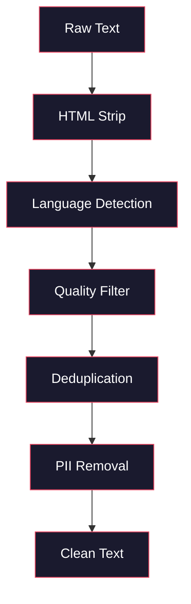
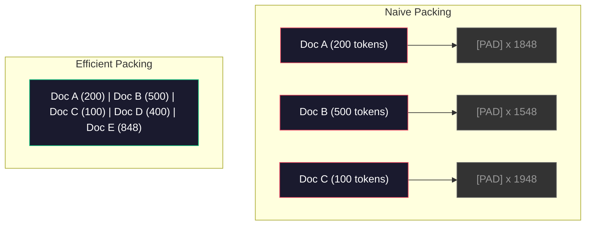

# 预训练数据管线

> 模型是一面镜子。它反映你喂给它的任何数据。喂给它垃圾，它就会完美流畅地反映垃圾。

**类型：** 构建
**语言：** Python
**前置条件：** 阶段 10，第 01-02 课（分词器、构建分词器）
**时长：** ~90 分钟

## 学习目标

- 构建一个流式数据管线，对数 TB 文本进行分词、分块、打乱和批处理，而无需全部加载到内存中
- 实现真实预训练管线中使用的数据质量过滤器（去重、语言检测、内容过滤）
- 创建带正确注意力掩码和文档边界处理的定长训练序列
- 分析管线吞吐量，确保数据加载器跟得上 GPU 训练速度

## 问题

你有了一个分词器。现在你需要数据。

不是一个数据集。不是一个 CSV 文件。是数 TB 的文本——经过清洗、去重、质量过滤、分词为定长序列，并以随机批次的形式提供，速度快到你的 8-GPU 集群从不需要等待下一个批次。

大多数人认为训练 LLM 是关于模型架构的。其实不是。Llama 3 使用了 15.6 万亿个 token。GPT-3 使用了 3000 亿个。DeepSeek-V2 使用了 8.1 万亿个。这三者的架构大致相同：堆叠的 transformer 块，带有注意力层和前馈层。输出质量的差异绝大部分来自数据。

DeepMind 的 Chinchilla 论文精确地指出了这一点。对于给定的计算预算，存在一个模型参数与训练 token 的最优比例。Chinchilla 表明，2022 年的大多数模型都严重欠训练——相对于它们看到的数据量，它们的参数太多了。一个 70B 参数的模型在 1.4 万亿个 token 上训练（Chinchilla 最优）超过了在 3000 亿个 token 上训练的 280B 模型（Gopher）。

你的数据管线决定了你的模型是学习语言还是学习噪声。

## 概念

### 数据来源

每个大型语言模型都在多种来源的混合数据上训练。确切的组成对大多数实验室来说是严密保守的秘密，但我们足以理解这些类别。

| 来源 | 大小 | 质量 | 使用方 |
|--------|------|---------|---------|
| Common Crawl | ~250 TB 原始 | 低（需要大量过滤） | GPT-3、Llama、大多数开源模型 |
| Wikipedia | ~20 GB | 高 | 每个主要 LLM |
| GitHub 代码 | ~1 TB+ | 中（大量重复、死代码） | StarCoder、CodeLlama、DeepSeek-Coder |
| 书籍（BookCorpus、Pile） | ~100 GB | 高 | GPT-2、GPT-3、早期模型 |
| 学术论文（arXiv、S2ORC） | ~100 GB | STEM 领域高 | Llama、Galactica |
| StackOverflow、Reddit | ~100 GB | 中 | Llama、Falcon |
| 精选网络（C4、RefinedWeb） | ~5 TB | 中高（已预过滤） | T5、Falcon |

Llama 3 公开了其数据配比：大约 50% 网络数据、25% 代码、13% 书籍和学术论文、8% 数学数据和 4% 多语言网络数据。总计 15.6 万亿个 token，来自超过 5 TB 的原始文本。

配比与总大小同样重要。网络数据太多，模型就会变成 Reddit 复读机。代码太少，它就无法编程。数学太少，它在推理上就会失败。把这个配比搞对是训练 LLM 最困难的部分之一，而且没有公式——它需要实验和评估。

### 数据清洗

原始网络数据是肮脏的。一个典型的 Common Crawl 转储包含：

- HTML 标签和 JavaScript
- 样板页眉、页脚、导航菜单
- 重复页面（精确重复和近似重复）
- 机器生成的垃圾内容
- 个人身份信息（PII）
- 低质量文本（关键词列表、SEO 垃圾）
- 编码为文本的非文本内容

清洗这一步不是可选的。它决定了模型生成的是连贯的段落，还是夹杂着产品列表的 HTML 标签。


```mermaid
graph TD
    A[Raw Text] --> B[HTML Strip]
    B --> C[Language Detection]
    C --> D[Quality Filter]
    D --> E[Deduplication]
    E --> F[PII Removal]
    F --> G[Clean Text]

    style A fill:#1a1a2e,stroke:#e94560,color:#fff
    style B fill:#1a1a2e,stroke:#e94560,color:#fff
    style C fill:#1a1a2e,stroke:#e94560,color:#fff
    style D fill:#1a1a2e,stroke:#e94560,color:#fff
    style E fill:#1a1a2e,stroke:#e94560,color:#fff
    style F fill:#1a1a2e,stroke:#e94560,color:#fff
    style G fill:#1a1a2e,stroke:#e94560,color:#fff
```

每个步骤消除一类噪声：

**HTML 剥离：** 移除所有标记。只保留可见文本内容。像 `trafilatura` 或 `readability` 这样的库可以提取文章内容，同时丢弃导航、广告和样板内容。

**语言检测：** 使用 fastText 的语言识别模型（lid.176.bin）对每个文档进行分类。过滤到你的目标语言。置信度低于 0.8 的被分类为英语的文档，可能不是干净的英语。

**质量过滤：** 这是有趣的部分。RefinedWeb（Falcon 背后的数据集）使用了一个基于困惑度的过滤器：在 Wikipedia 上训练一个小语言模型，然后对每个文档打分。高困惑度意味着该文档不像 Wikipedia——很可能是垃圾内容、关键词列表或机器生成的内容。困惑度超过阈值的文档被移除。

**去重：** 最有影响力的单一清洗步骤。Common Crawl 包含大量重复页面——法律免责声明、Cookie 通知、服务条款。在重复数据上训练浪费算力，并可能导致模型记忆并逐字重复特定段落。

**PII 移除：** 姓名、电子邮件地址、电话号码、社会安全号码。基于正则表达式的结构化 PII 检测，NER 模型用于上下文中的姓名。

### 使用 MinHash 去重

精确去重很容易：对每个文档进行哈希，移除重复项。但近似重复才是真正的问题。同一篇新闻文章的两个副本，周围有略微不同的广告，就是近似重复。内容 95% 相同，但逐字节比较则不同。

MinHash + 局部敏感哈希（LSH）高效地解决了这个问题。


```mermaid
graph LR
    A[Document] --> B[Shingling]
    B --> C[MinHash Signature]
    C --> D[LSH Buckets]
    D --> E[Candidate Pairs]
    E --> F[Jaccard Similarity]
    F --> G[Deduplicated Set]

    style A fill:#1a1a2e,stroke:#e94560,color:#fff
    style B fill:#1a1a2e,stroke:#e94560,color:#fff
    style C fill:#1a1a2e,stroke:#e94560,color:#fff
    style D fill:#1a1a2e,stroke:#e94560,color:#fff
    style E fill:#1a1a2e,stroke:#e94560,color:#fff
    style F fill:#1a1a2e,stroke:#e94560,color:#fff
    style G fill:#1a1a2e,stroke:#e94560,color:#fff
```

思路：

1. **Shingling：** 将每个文档转换为一组 n-gram（例如，5-gram 的词或字符）。"the quick brown fox" 使用 3 词 shingle 变成 {"the quick brown", "quick brown fox"}。

2. **MinHash：** 对于每个文档的 shingle 集合，计算 k 个哈希值。每个哈希值是在不同哈希函数下所有 shingle 中的最小哈希值。这创建了一个固定大小的"签名"，近似任意两个文档之间的 Jaccard 相似度。

3. **LSH：** 基于 MinHash 签名的条带（band）将文档分到不同的桶中。在同一桶中的文档是候选的近似重复。这避免了比较每一对文档——你只比较候选对。

4. **验证：** 对于每个候选对，计算精确的 Jaccard 相似度。如果相似度超过阈值（通常为 0.8），移除其中一个副本。

Llama 团队报告通过去重移除了大约 38% 的网络数据。这不是一个小数字。Common Crawl 中超过三分之一是重复或近似重复内容。

### 序列打包

你的模型期望定长的输入序列。你的文档是变长的。有些是 50 个 token。有些是 50,000 个 token。

朴素的方法：将每个文档填充到最大序列长度。这会在填充 token 上浪费大量算力，而它们对学习毫无贡献。

更好的方法：将多个文档打包到一个序列中，用序列结束 token 分隔。一个 2048-token 的序列可能包含三个短文档，它们之间用 [EOS] token 连接。


```mermaid
graph TD
    subgraph Naive Packing
        A1["Doc A (200 tokens)"] --> P1["[PAD] x 1848"]
        A2["Doc B (500 tokens)"] --> P2["[PAD] x 1548"]
        A3["Doc C (100 tokens)"] --> P3["[PAD] x 1948"]
    end

    subgraph Efficient Packing
        B1["Doc A (200) | Doc B (500) | Doc C (100) | Doc D (400) | Doc E (848)"]
    end

    style A1 fill:#1a1a2e,stroke:#e94560,color:#fff
    style A2 fill:#1a1a2e,stroke:#e94560,color:#fff
    style A3 fill:#1a1a2e,stroke:#e94560,color:#fff
    style P1 fill:#333,stroke:#666,color:#999
    style P2 fill:#333,stroke:#666,color:#999
    style P3 fill:#333,stroke:#666,color:#999
    style B1 fill:#1a1a2e,stroke:#16c784,color:#fff
```

注意力掩码必须正确设置。文档 A 的 token 不应该关注同一打包序列中来自文档 B 的 token。这需要一个块对角注意力掩码。

长文档会在序列边界处被截断或分割成块。分割点很重要：在句子中间分割迫使模型看到不完整的思想。有些管线尽可能将分割点对齐到段落或句子边界。

### Chinchilla 缩放定律

对于固定的计算预算 C（以 FLOPs 衡量），最优模型大小 N 和数据集大小 D 满足：

```
N_opt ~ C^0.5
D_opt ~ C^0.5
```

在实践中，这意味着你应该大致同等规模地缩放模型大小和数据集大小。一个拥有 10 倍参数的模型，大约需要 10 倍的训练 token 才能达到相同的损失。

| 模型 | 参数 | 训练 token | Chinchilla 最优？ |
|-------|-----------|----------------|-------------------|
| GPT-3 | 175B | 300B | 否（欠训练 3-4 倍） |
| Chinchilla | 70B | 1.4T | 是（按设计） |
| Llama 2 | 70B | 2T | 过训练（有意为之） |
| Llama 3 | 70B | 15T | 严重过训练 |

Llama 3 故意违反了 Chinchilla 定律。Meta 发现，在远超计算最优比率的数据上进行过训练会产生更好的推理模型。额外的训练成本只支付一次，但更小的模型在服务时永远更便宜。这有时被称为"推理最优"缩放方法，自 2024 年以来已成为行业标准。

## 动手构建

### 步骤 1：文本清洗

剥离 HTML、规范化空白、移除非文本内容。我们将使用一个公有领域文本（Project Gutenberg）作为小语料库。

```python
import re

def clean_text(text):
    text = re.sub(r"<[^>]+>", "", text)
    text = re.sub(r"http\S+", "", text)
    text = re.sub(r"[^\x20-\x7E\n]", "", text)
    text = re.sub(r"\n{3,}", "\n\n", text)
    text = re.sub(r" {2,}", " ", text)
    return text.strip()

def quality_filter(text, min_words=50, max_ratio_caps=0.3, max_ratio_special=0.1):
    words = text.split()
    if len(words) < min_words:
        return False
    caps_ratio = sum(1 for w in words if w.isupper()) / len(words)
    if caps_ratio > max_ratio_caps:
        return False
    special_chars = sum(1 for c in text if not c.isalnum() and not c.isspace())
    if special_chars / max(len(text), 1) > max_ratio_special:
        return False
    return True
```

质量过滤器可以捕获 SEO 垃圾内容（全大写）、机器生成的噪声（高特殊字符比率）和短页面（太短）。仅这三个检查就能从网络爬虫数据中移除大量垃圾。

### 步骤 2：MinHash 去重

从零实现 MinHash。不需要外部库——只需 `hashlib`。

```python
import hashlib
from collections import defaultdict

def get_shingles(text, k=5):
    words = text.lower().split()
    if len(words) < k:
        return set()
    return {" ".join(words[i:i+k]) for i in range(len(words) - k + 1)}

def minhash_signature(shingles, num_hashes=128):
    signature = []
    for i in range(num_hashes):
        min_hash = float("inf")
        for shingle in shingles:
            h = int(hashlib.sha256(f"{i}:{shingle}".encode()).hexdigest(), 16)
            min_hash = min(min_hash, h)
        signature.append(min_hash)
    return signature

def lsh_buckets(signature, bands=16):
    rows_per_band = len(signature) // bands
    buckets = []
    for b in range(bands):
        start = b * rows_per_band
        band_data = tuple(signature[start:start + rows_per_band])
        bucket_hash = hashlib.md5(str(band_data).encode()).hexdigest()
        buckets.append((b, bucket_hash))
    return buckets

def deduplicate(documents, threshold=0.8, num_hashes=128, bands=16):
    signatures = []
    shingle_sets = []
    for doc in documents:
        shingles = get_shingles(doc)
        shingle_sets.append(shingles)
        signatures.append(minhash_signature(shingles, num_hashes))

    bucket_map = defaultdict(list)
    for doc_idx, sig in enumerate(signatures):
        for band_id, bucket_hash in lsh_buckets(sig, bands):
            bucket_map[(band_id, bucket_hash)].append(doc_idx)

    duplicate_pairs = set()
    for bucket_docs in bucket_map.values():
        if len(bucket_docs) < 2:
            continue
        for i in range(len(bucket_docs)):
            for j in range(i + 1, len(bucket_docs)):
                duplicate_pairs.add((bucket_docs[i], bucket_docs[j]))

    removed = set()
    for i, j in duplicate_pairs:
        if i in removed or j in removed:
            continue
        s1, s2 = shingle_sets[i], shingle_sets[j]
        if not s1 or not s2:
            continue
        jaccard = len(s1 & s2) / len(s1 | s2)
        if jaccard >= threshold:
            removed.add(j)

    return [doc for idx, doc in enumerate(documents) if idx not in removed], len(removed)
```

`num_hashes=128` 和 `bands=16` 参数控制了精确率-召回率的权衡。更多哈希值提供更准确的相似度估计。更多条带增加召回率（捕获更多重复）但以更多误报为代价。这些值对典型的网络文本效果良好。

### 步骤 3：分词和序列打包

获取清洗、去重后的文本，进行分词，并打包成用于训练的定长序列。

```python
def tokenize_corpus(documents, tokenizer):
    all_tokens = []
    for doc in documents:
        tokens = tokenizer.encode(doc)
        all_tokens.extend(tokens)
        all_tokens.append(tokenizer.eos_id)
    return all_tokens

def pack_sequences(token_ids, seq_length, pad_id=0):
    sequences = []
    attention_masks = []
    for i in range(0, len(token_ids), seq_length):
        seq = token_ids[i:i + seq_length]
        mask = [1] * len(seq)
        if len(seq) < seq_length:
            pad_count = seq_length - len(seq)
            seq = seq + [pad_id] * pad_count
            mask = mask + [0] * pad_count
        sequences.append(seq)
        attention_masks.append(mask)
    return sequences, attention_masks
```

### 步骤 4：训练数据加载器

生成打包序列的随机批次。这就是训练循环消耗的内容。

```python
import random

class PreTrainingDataLoader:
    def __init__(self, sequences, attention_masks, batch_size, shuffle=True):
        self.sequences = sequences
        self.attention_masks = attention_masks
        self.batch_size = batch_size
        self.shuffle = shuffle

    def __len__(self):
        return (len(self.sequences) + self.batch_size - 1) // self.batch_size

    def __iter__(self):
        indices = list(range(len(self.sequences)))
        if self.shuffle:
            random.shuffle(indices)
        for start in range(0, len(indices), self.batch_size):
            batch_idx = indices[start:start + self.batch_size]
            batch_seqs = [self.sequences[i] for i in batch_idx]
            batch_masks = [self.attention_masks[i] for i in batch_idx]
            yield batch_seqs, batch_masks
```

### 步骤 5：数据集统计

计算重要的数字：总 token、唯一 token、压缩比率、文档长度分布。

```python
from collections import Counter

def compute_statistics(documents, token_ids, sequences, tokenizer_vocab_size):
    total_chars = sum(len(d) for d in documents)
    total_tokens = len(token_ids)
    unique_tokens = len(set(token_ids))
    compression_ratio = total_chars / total_tokens

    doc_lengths = [len(d.split()) for d in documents]
    avg_doc_length = sum(doc_lengths) / max(len(doc_lengths), 1)
    max_doc_length = max(doc_lengths) if doc_lengths else 0
    min_doc_length = min(doc_lengths) if doc_lengths else 0

    token_counts = Counter(token_ids)
    top_tokens = token_counts.most_common(10)

    non_pad_tokens = sum(sum(1 for t in seq if t != 0) for seq in sequences)
    total_positions = sum(len(seq) for seq in sequences)
    utilization = non_pad_tokens / max(total_positions, 1)

    stats = {
        "total_documents": len(documents),
        "total_characters": total_chars,
        "total_tokens": total_tokens,
        "unique_tokens": unique_tokens,
        "vocab_utilization": unique_tokens / tokenizer_vocab_size,
        "compression_ratio": compression_ratio,
        "avg_doc_length_words": avg_doc_length,
        "max_doc_length_words": max_doc_length,
        "min_doc_length_words": min_doc_length,
        "num_sequences": len(sequences),
        "sequence_utilization": utilization,
        "top_10_tokens": top_tokens,
    }
    return stats
```

压缩比率告诉你分词器在该语料库上的效率。英文文本通常压缩到每 token 约 3-4 个字符。如果你看到每 token 1.5 个字符，你的分词器分割得太激进了。如果看到 8+，则表示它学习了非常领域特定的合并。

序列利用率告诉你打包序列中有多少是真实数据 vs 填充。低于 90% 意味着你的打包效率低下——你在填充 token 上浪费算力。

## 使用它

### 与 HuggingFace Datasets 比较

通过 HuggingFace 的 datasets 库加载相同的语料库，并比较管线速度。

```python
from datasets import load_dataset
from transformers import AutoTokenizer

ds = load_dataset("wikitext", "wikitext-2-raw-v1", split="train")
tokenizer = AutoTokenizer.from_pretrained("meta-llama/Meta-Llama-3-8B")

import time

start = time.time()
tokenized = ds.map(
    lambda x: tokenizer(x["text"], truncation=True, max_length=2048),
    batched=True,
    num_proc=4,
)
hf_time = time.time() - start
total_tokens = sum(len(t) for t in tokenized["input_ids"])
print(f"HuggingFace: {total_tokens:,} tokens in {hf_time:.2f}s ({total_tokens/hf_time:,.0f} tokens/sec)")
```

HuggingFace 管线底层使用 Rust 分词器，并在 4 个核心上并行处理。你的纯 Python 管线会慢 10-50 倍。这个差距就是为什么生产团队使用编译型分词器。算法相同。实现语言是差异所在。

## 交付

本课程产出一个用于验证和调试 LLM 训练管线中数据质量的提示词。见 `outputs/prompt-data-quality-checker.md`。

## 练习

1. **简单：** 使用简单的启发式方法（字符集分析）向清洗管线添加语言检测。只过滤英文文档，并测量有多少文档被移除。
2. **中等：** 使用 SHA-256 哈希实现精确去重，与 MinHash 近似去重并列。比较在网页抓取语料库上每种方法捕获的重复数量。
3. **困难：** 构建一个基于困惑度的质量过滤器。在 Wikipedia 文本上训练一个小的二元语言模型，对每个文档进行困惑度评分，并移除底部 20%。比较在有过滤和无过滤数据上训练时的模型输出质量。

## 关键术语

| 术语 | 人们怎么说 | 实际含义 |
|------|----------------|----------------------|
| Common Crawl | "互联网" | 每月爬取网络的非营利组织——约 250TB 原始数据，大多数 LLM 训练数据的起点 |
| MinHash | "某种哈希技巧" | 一种使用固定大小签名估计集合间 Jaccard 相似度的技术——支持大规模近似重复检测 |
| LSH | "局部敏感哈希" | 将相似项分组到同一桶中的方法——将配对比较从 O(n²) 减少到近线性 |
| 序列打包 | "拼接文档" | 将多个文档以正确的注意力掩码放入定长序列中——消除填充浪费 |
| Chinchilla 缩放 | "用更多数据训练" | 对于固定计算预算，最优性能需要大致同等地缩放模型大小和训练 token 数 |
| Fertility | "每个词的 token 数" | 每个词的平均 token 数——GPT-4 英文约 1.3，非拉丁文字更高 |
| 数据混合 | "选择训练数据" | 代码 vs 文本 vs 数学 vs 多语言数据的比率——没有公式，需要实验 |
| 困惑度过滤器 | "质量评分" | 使用小语言模型对文档评分——高困惑度意味着文本不像干净的参考数据 |
| 去重 | "移除副本" | 消除精确和近似重复文档——通常移除 30-40% 的原始网络数据 |
| 注意力掩码 | "哪些 token 可以看" | 防止在打包序列中跨文档边界进行注意力计算的二进制掩码 |

## 延伸阅读

- [Hoffmann et al., 2022 -- Training Compute-Optimal Large Language Models (Chinchilla)](https://arxiv.org/abs/2203.15556) -- 改变了我们对数据规模思考方式的论文
- [Penedo et al., 2023 -- The RefinedWeb Dataset for Falcon LLM](https://arxiv.org/abs/2306.01116) -- 如何将 Common Crawl 过滤为高质量数据
- [Touvron et al., 2023 -- Llama 2: Open Foundation and Fine-Tuned Chat Models](https://arxiv.org/abs/2307.09288) -- Llama 2 的数据管线细节
- [Lee et al., 2022 -- Deduplicating Training Data Makes Language Models Better](https://arxiv.org/abs/2107.06499) -- 为什么去重比你想象的更重要
- [Broder, 1997 -- On the Resemblance and Containment of Documents](https://ieeexplore.ieee.org/document/666900) -- MinHash 原始论文
- [Meta, 2024 -- Llama 3 Technical Report](https://arxiv.org/abs/2407.21783) -- 15.6T token、数据混合比例、过滤管线
