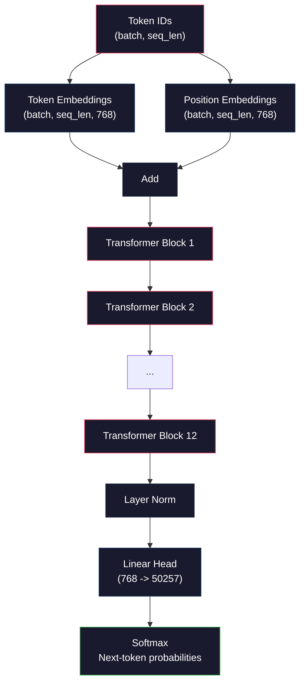
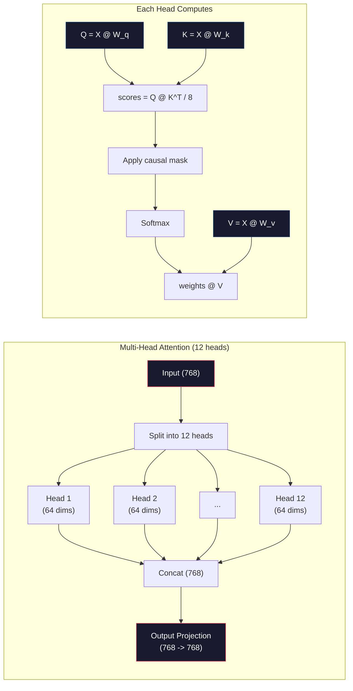
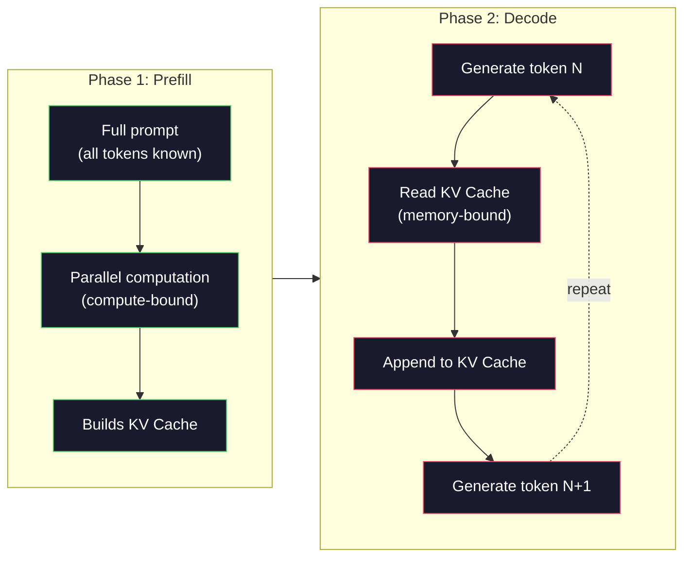

# Mini GPT を事前訓練する (124M パラメータ)

> GPT-2 Small は 1 億 2400 万パラメータのモデルです。12 個の transformer レイヤー、12 個の attention head、768 次元の埋め込みを持ちます。単一 GPU でも数時間でゼロから訓練できます。ほとんどの人はこれをやりません。事前訓練済みチェックポイントを使います。しかし、自分で訓練したことがなければ、自分がプロダクト構築に使っているモデルの内部で何が起きているのかを本当には理解していません。

**種類:** Build
**言語:** Python (with numpy)
**前提条件:** Phase 10, Lessons 01-03 (Tokenizers, Building a Tokenizer, Data Pipelines)
**時間:** 約 120 分

## 学習目標

- GPT-2 の完全なアーキテクチャ (124M パラメータ) をゼロから実装する: token embeddings、positional embeddings、transformer blocks、language model head
- next-token prediction と cross-entropy loss を使って、テキストコーパス上で GPT モデルを訓練する
- temperature sampling と top-k/top-p filtering を使った自己回帰的テキスト生成を実装する
- 訓練損失曲線を監視し、モデルが一貫した言語パターンを学習していることを確認する

## 課題

あなたは transformer が何かを知っています。図も読んだことがあります。"attention is all you need" と暗唱でき、ホワイトボードに "Multi-Head Attention" と書かれた箱を描けます。

それでも、モデルがテキストを生成するときに何が起きているかを理解しているとは限りません。

GPT-2 Small には、weight tying を使った場合で 124,438,272 個のパラメータがあります。その 1 つ 1 つは、訓練ループを回すことで設定されました。forward pass、loss の計算、backward pass、重みの更新です。12 個の transformer block。各 block に 12 個の attention head。768 次元の埋め込み空間。50,257 トークンの語彙。モデルが 1 トークンを生成するたびに、1 億 2400 万個のすべてのパラメータが、トークン ID の系列を受け取って次トークンの確率分布を出す 1 本の行列乗算チェーンに参加します。

これを自分で作ったことがなければ、あなたはブラックボックスを扱っています。API は使えます。fine-tune もできます。しかし何かがうまくいかないとき、モデルが hallucination を起こすとき、同じことを繰り返すとき、指示に従わないとき、なぜそうなるのかを説明するメンタルモデルがありません。

このレッスンでは GPT-2 Small をゼロから構築します。PyTorch ではありません。numpy で作ります。すべての行列乗算が見えます。すべての勾配はあなたのコードで計算されます。次の単語を予測するために 1 億 2400 万個の数値がどのように連携するのかを、正確に見ることになります。

## 概念

### GPT アーキテクチャ

GPT は自己回帰型の言語モデルです。「自己回帰」とは、1 回に 1 トークンずつ生成し、各トークンがそれ以前のすべてのトークンに条件づけられるという意味です。アーキテクチャは transformer decoder block のスタックです。

トークン ID から次トークン確率までの計算グラフ全体は次のとおりです。

1. Token IDs が入ります。Shape: (batch_size, seq_len)。
2. Token embedding lookup。各 ID が 768 次元ベクトルに対応します。Shape: (batch_size, seq_len, 768)。
3. Position embedding lookup。各位置 (0, 1, 2, ...) が 768 次元ベクトルに対応します。同じ shape です。
4. token embeddings + position embeddings を加算します。
5. 12 個の transformer blocks を通します。
6. 最後の layer normalization を適用します。
7. 語彙サイズへの線形射影を行います。Shape: (batch_size, seq_len, vocab_size)。
8. Softmax で確率を得ます。

これがモデル全体です。畳み込みはありません。再帰もありません。埋め込み、attention、feedforward networks、layer norms を 12 回積み重ねただけです。



### Transformer Block

12 個の block はすべて同じパターンに従います。pre-norm アーキテクチャです (GPT-2 は original transformer のような post-norm ではなく pre-norm を使います)。

1. LayerNorm
2. Multi-Head Self-Attention
3. Residual connection (入力を足し戻す)
4. LayerNorm
5. Feed-Forward Network (MLP)
6. Residual connection (入力を足し戻す)

residual connection は非常に重要です。これがないと、backpropagation 中に勾配が block 1 に届くまでに消えてしまいます。これがあると、勾配は "skip" 経路を通って loss から任意の層へ直接流れられます。12、32、さらには 96 block まで積めるのはこのためです (GPT-4 は 120 block を使っているとうわさされています)。

### Attention: 中核メカニズム

self-attention により、すべてのトークンがそれ以前のすべてのトークンを見て、それぞれにどれだけ注目するかを決められます。数学は次のとおりです。

各トークン位置について、入力から 3 種類のベクトルを計算します。
- **Query (Q)**: 「私は何を探しているのか」
- **Key (K)**: 「私は何を含んでいるのか」
- **Value (V)**: 「私はどんな情報を持っているのか」

```
Q = input @ W_q    (768 -> 768)
K = input @ W_k    (768 -> 768)
V = input @ W_v    (768 -> 768)

attention_scores = Q @ K^T / sqrt(d_k)
attention_scores = mask(attention_scores)   # causal mask: -inf for future positions
attention_weights = softmax(attention_scores)
output = attention_weights @ V
```

causal mask が GPT を自己回帰にしています。位置 5 は位置 0-5 に注目できますが、6、7、8 などには注目できません。これにより、訓練中に未来のトークンを見る「ズル」を防ぎます。

**Multi-head attention** は 768 次元空間を、それぞれ 64 次元の 12 head に分割します。各 head は異なる attention pattern を学習します。ある head は構文関係 (主語と動詞の一致) を追跡するかもしれません。別の head は意味的類似性 (同義語) を追跡するかもしれません。さらに別の head は位置的な近さ (近くの単語) を追跡するかもしれません。12 head すべての出力は連結され、768 次元へ射影し直されます。



sqrt(d_k) で割ること、つまり sqrt(64) = 8 で割ることはスケーリングです。これがないと、高次元ベクトルでは dot product が大きくなり、softmax が勾配ほぼゼロの領域へ押し込まれます。これは元論文 "Attention Is All You Need" の重要な洞察の 1 つでした。

### KV Cache: 推論が速い理由

訓練中は系列全体を一度に処理します。推論中は 1 トークンずつ生成します。最適化なしでは、トークン N を生成するために、それ以前の N-1 個すべてのトークンについて attention を再計算する必要があります。これは生成トークンあたり O(N^2)、長さ N の系列全体では O(N^3) です。

KV Cache はこれを解決します。各トークンの K と V を計算したら保存します。トークン N+1 を生成するときは、新しいトークンの Q だけを計算し、以前のすべてのトークンの K と V はキャッシュから読み出せばよくなります。これにより、K と V の計算に関するトークンあたりコストは O(N) から O(1) になります。過去すべての位置に注目するため attention score の計算はまだ O(N) ですが、入力に対する重複した行列乗算は避けられます。

12 layers、12 heads の GPT-2 では、KV cache はトークンごとに 2 (K + V) x 12 layers x 12 heads x 64 dims = 18,432 個の値を保存します。1024 トークンの系列では、FP32 で約 75MB です。128 layers の Llama 3 405B では、単一系列の KV cache が 10GB を超えることがあります。長コンテキスト推論がメモリ律速になるのはこのためです。

### Prefill vs Decode: 推論の 2 フェーズ

LLM にプロンプトを送ると、推論は 2 つの異なるフェーズで行われます。

**Prefill** はプロンプト全体を並列に処理します。すべてのトークンが既知なので、モデルは全位置の attention を同時に計算できます。このフェーズは計算律速です。GPU は行列乗算を最大スループットで実行しています。A100 上で 1000 トークンのプロンプトなら、prefill はおよそ 20-50ms です。

**Decode** は 1 トークンずつ生成します。各新トークンはそれ以前のすべてのトークンに依存します。このフェーズはメモリ律速です。ボトルネックは行列計算そのものではなく、GPU メモリからモデル重みと KV cache を読み出すことです。GPU の計算コアは、メモリ読み出しを待つ時間が多くなります。GPT-2 では、各 decode step は matmul に必要な FLOPs がどれだけあるかに関係なくほぼ同じ時間がかかります。制約がメモリ帯域だからです。

この区別は本番システムでは重要です。Prefill のスループットは GPU の計算能力に比例します (FLOPS が多いほど prefill は速い)。Decode のスループットはメモリ帯域に比例します (メモリが速いほど decode は速い)。NVIDIA の H100 が A100 よりメモリ帯域の改善に重点を置いたのは、これがトークン生成を直接高速化するからです。



### 訓練ループ

LLM の訓練は next-token prediction です。トークン [0, 1, 2, ..., N-1] が与えられたら、トークン [1, 2, 3, ..., N] を予測します。損失関数は、モデルが予測した確率分布と実際の次トークンの間の cross-entropy です。

1 回の訓練ステップは次のとおりです。

1. **Forward pass**: batch を 12 block すべてに通します。各位置の logits (softmax 前のスコア) を得ます。
2. **Compute loss**: logits と target tokens (入力を 1 位置ずらしたもの) の間の cross-entropy を計算します。
3. **Backward pass**: backpropagation により 124M パラメータすべての勾配を計算します。
4. **Optimizer step**: 重みを更新します。GPT-2 は学習率 warmup と cosine decay を伴う Adam を使います。

learning rate schedule は想像以上に重要です。GPT-2 は最初の 2,000 steps で学習率を 0 からピーク値まで warmup し、その後 cosine curve に従って減衰させます。高い学習率で始めるとモデルは発散します。高い学習率を一定に保つと、訓練後半で振動します。warmup してから decay するパターンは、主要な LLM のすべてで使われています。

### GPT-2 Small: 数字で見る

| Component | Shape | Parameters |
|-----------|-------|------------|
| Token embeddings | (50257, 768) | 38,597,376 |
| Position embeddings | (1024, 768) | 786,432 |
| Per-block attention (W_q, W_k, W_v, W_out) | 4 x (768, 768) | 2,359,296 |
| Per-block FFN (up + down) | (768, 3072) + (3072, 768) | 4,718,592 |
| Per-block LayerNorms (2x) | 2 x 768 x 2 | 3,072 |
| Final LayerNorm | 768 x 2 | 1,536 |
| **Total per block** | | **7,080,960** |
| **Total (12 blocks)** | | **85,054,464 + 39,383,808 = 124,438,272** |

出力射影 (logits head) は token embedding matrix と重みを共有します。これは weight tying と呼ばれます。パラメータ数を 38M 減らし、性能も向上します。入力と出力で同じ表現空間を使うようモデルに強制するからです。

## 作ってみる

### Step 1: Embedding Layer

Token embeddings は、50,257 個の可能なトークンそれぞれを 768 次元ベクトルへ対応させます。Position embeddings は、各トークンが系列内のどこにあるかという情報を追加します。この 2 つを加算します。

```python
import numpy as np

class Embedding:
    def __init__(self, vocab_size, embed_dim, max_seq_len):
        self.token_embed = np.random.randn(vocab_size, embed_dim) * 0.02
        self.pos_embed = np.random.randn(max_seq_len, embed_dim) * 0.02

    def forward(self, token_ids):
        seq_len = token_ids.shape[-1]
        tok_emb = self.token_embed[token_ids]
        pos_emb = self.pos_embed[:seq_len]
        return tok_emb + pos_emb
```

初期化で使っている 0.02 の標準偏差は GPT-2 論文に由来します。大きすぎると、初期の forward pass で極端な値が出て訓練が不安定になります。小さすぎると、すべての入力に対する初期出力がほぼ同じになり、初期の勾配信号が役に立たなくなります。

### Step 2: causal mask 付き self-attention

まずは single-head attention です。causal mask は softmax の前に未来位置を負の無限大に設定し、各位置が自分自身とそれ以前の位置だけに注目できるようにします。

```python
def attention(Q, K, V, mask=None):
    d_k = Q.shape[-1]
    scores = Q @ K.transpose(0, -1, -2 if Q.ndim == 4 else 1) / np.sqrt(d_k)
    if mask is not None:
        scores = scores + mask
    weights = np.exp(scores - scores.max(axis=-1, keepdims=True))
    weights = weights / weights.sum(axis=-1, keepdims=True)
    return weights @ V
```

この softmax 実装では、指数を取る前に最大値を引いています。これをしないと exp(large_number) が infinity にオーバーフローします。これは数値安定性のための工夫であり、softmax(x - c) = softmax(x) は任意の定数 c で成り立つため、出力は変わりません。

### Step 3: Multi-Head Attention

768 次元入力を、それぞれ 64 次元の 12 head に分割します。各 head は独立に attention を計算します。結果を連結し、768 次元へ射影し直します。

```python
class MultiHeadAttention:
    def __init__(self, embed_dim, num_heads):
        self.num_heads = num_heads
        self.head_dim = embed_dim // num_heads
        self.W_q = np.random.randn(embed_dim, embed_dim) * 0.02
        self.W_k = np.random.randn(embed_dim, embed_dim) * 0.02
        self.W_v = np.random.randn(embed_dim, embed_dim) * 0.02
        self.W_out = np.random.randn(embed_dim, embed_dim) * 0.02

    def forward(self, x, mask=None):
        batch, seq_len, d = x.shape
        Q = (x @ self.W_q).reshape(batch, seq_len, self.num_heads, self.head_dim).transpose(0, 2, 1, 3)
        K = (x @ self.W_k).reshape(batch, seq_len, self.num_heads, self.head_dim).transpose(0, 2, 1, 3)
        V = (x @ self.W_v).reshape(batch, seq_len, self.num_heads, self.head_dim).transpose(0, 2, 1, 3)

        scores = Q @ K.transpose(0, 1, 3, 2) / np.sqrt(self.head_dim)
        if mask is not None:
            scores = scores + mask
        weights = np.exp(scores - scores.max(axis=-1, keepdims=True))
        weights = weights / weights.sum(axis=-1, keepdims=True)
        attn_out = weights @ V

        attn_out = attn_out.transpose(0, 2, 1, 3).reshape(batch, seq_len, d)
        return attn_out @ self.W_out
```

reshape-transpose-reshape の手順は、multi-head attention で最も混乱しやすい部分です。起きていることはこうです。(batch, seq_len, 768) テンソルが (batch, seq_len, 12, 64) になり、さらに (batch, 12, seq_len, 64) になります。これで 12 個の head それぞれが、attention を計算するための独自の (seq_len, 64) 行列を持ちます。attention の後は逆の処理をします。(batch, 12, seq_len, 64) が (batch, seq_len, 12, 64) になり、最後に (batch, seq_len, 768) へ戻ります。

### Step 4: Transformer Block

完全な transformer block 1 つです。LayerNorm、residual 付き multi-head attention、LayerNorm、residual 付き feedforward から成ります。

```python
class LayerNorm:
    def __init__(self, dim, eps=1e-5):
        self.gamma = np.ones(dim)
        self.beta = np.zeros(dim)
        self.eps = eps

    def forward(self, x):
        mean = x.mean(axis=-1, keepdims=True)
        var = x.var(axis=-1, keepdims=True)
        return self.gamma * (x - mean) / np.sqrt(var + self.eps) + self.beta


class FeedForward:
    def __init__(self, embed_dim, ff_dim):
        self.W1 = np.random.randn(embed_dim, ff_dim) * 0.02
        self.b1 = np.zeros(ff_dim)
        self.W2 = np.random.randn(ff_dim, embed_dim) * 0.02
        self.b2 = np.zeros(embed_dim)

    def forward(self, x):
        h = x @ self.W1 + self.b1
        h = np.maximum(0, h)  # GELU approximation: ReLU for simplicity
        return h @ self.W2 + self.b2


class TransformerBlock:
    def __init__(self, embed_dim, num_heads, ff_dim):
        self.ln1 = LayerNorm(embed_dim)
        self.attn = MultiHeadAttention(embed_dim, num_heads)
        self.ln2 = LayerNorm(embed_dim)
        self.ffn = FeedForward(embed_dim, ff_dim)

    def forward(self, x, mask=None):
        x = x + self.attn.forward(self.ln1.forward(x), mask)
        x = x + self.ffn.forward(self.ln2.forward(x))
        return x
```

feedforward network は 768 次元入力を 3,072 次元 (4x) に拡張し、非線形性を適用してから 768 次元へ戻します。この拡張と収縮のパターンにより、モデルは各位置でより「広い」内部表現を扱えます。GPT-2 は GELU activation を使いますが、ここではアーキテクチャ理解を簡単にするため ReLU を使います。この違いは理解目的では小さいものです。

### Step 5: 完全な GPT モデル

12 個の transformer blocks を積み重ねます。前段に embedding layer を追加し、後段に output projection を追加します。

```python
class MiniGPT:
    def __init__(self, vocab_size=50257, embed_dim=768, num_heads=12,
                 num_layers=12, max_seq_len=1024, ff_dim=3072):
        self.embedding = Embedding(vocab_size, embed_dim, max_seq_len)
        self.blocks = [
            TransformerBlock(embed_dim, num_heads, ff_dim)
            for _ in range(num_layers)
        ]
        self.ln_f = LayerNorm(embed_dim)
        self.vocab_size = vocab_size
        self.embed_dim = embed_dim

    def forward(self, token_ids):
        seq_len = token_ids.shape[-1]
        mask = np.triu(np.full((seq_len, seq_len), -1e9), k=1)

        x = self.embedding.forward(token_ids)
        for block in self.blocks:
            x = block.forward(x, mask)
        x = self.ln_f.forward(x)

        logits = x @ self.embedding.token_embed.T
        return logits

    def count_parameters(self):
        total = 0
        total += self.embedding.token_embed.size
        total += self.embedding.pos_embed.size
        for block in self.blocks:
            total += block.attn.W_q.size + block.attn.W_k.size
            total += block.attn.W_v.size + block.attn.W_out.size
            total += block.ffn.W1.size + block.ffn.b1.size
            total += block.ffn.W2.size + block.ffn.b2.size
            total += block.ln1.gamma.size + block.ln1.beta.size
            total += block.ln2.gamma.size + block.ln2.beta.size
        total += self.ln_f.gamma.size + self.ln_f.beta.size
        return total
```

weight tying に注目してください。`logits = x @ self.embedding.token_embed.T` です。出力射影は token embedding matrix を転置して再利用しています。これは単なるパラメータ削減の工夫ではありません。トークンを理解するための空間 (embeddings) と、トークンを予測するための空間 (output) に同じベクトル空間を使うという意味です。

### Step 6: 訓練ループ

124M パラメータで本格的に訓練するには、GPU と PyTorch が必要です。この訓練ループは、純粋な numpy で動く小さなモデルを使って仕組みを示します。扱いやすくするため、tiny model (4 layers, 4 heads, 128 dims) を使います。

```python
def cross_entropy_loss(logits, targets):
    batch, seq_len, vocab_size = logits.shape
    logits_flat = logits.reshape(-1, vocab_size)
    targets_flat = targets.reshape(-1)

    max_logits = logits_flat.max(axis=-1, keepdims=True)
    log_softmax = logits_flat - max_logits - np.log(
        np.exp(logits_flat - max_logits).sum(axis=-1, keepdims=True)
    )

    loss = -log_softmax[np.arange(len(targets_flat)), targets_flat].mean()
    return loss


def train_mini_gpt(text, vocab_size=256, embed_dim=128, num_heads=4,
                   num_layers=4, seq_len=64, num_steps=200, lr=3e-4):
    tokens = np.array(list(text.encode("utf-8")[:2048]))
    model = MiniGPT(
        vocab_size=vocab_size, embed_dim=embed_dim, num_heads=num_heads,
        num_layers=num_layers, max_seq_len=seq_len, ff_dim=embed_dim * 4
    )

    print(f"Model parameters: {model.count_parameters():,}")
    print(f"Training tokens: {len(tokens):,}")
    print(f"Config: {num_layers} layers, {num_heads} heads, {embed_dim} dims")
    print()

    for step in range(num_steps):
        start_idx = np.random.randint(0, max(1, len(tokens) - seq_len - 1))
        batch_tokens = tokens[start_idx:start_idx + seq_len + 1]

        input_ids = batch_tokens[:-1].reshape(1, -1)
        target_ids = batch_tokens[1:].reshape(1, -1)

        logits = model.forward(input_ids)
        loss = cross_entropy_loss(logits, target_ids)

        if step % 20 == 0:
            print(f"Step {step:4d} | Loss: {loss:.4f}")

    return model
```

loss は ln(vocab_size) 付近から始まります。256 トークンのバイトレベル語彙では ln(256) = 5.55 です。ランダムなモデルは、すべてのトークンに等しい確率を割り当てます。訓練が進むと、モデルは "t" の後に "h"、ピリオドの後にスペース、といった一般的なパターンを学習するため、loss は下がります。

本番では、gradient accumulation、learning rate warmup、gradient clipping を伴う Adam optimizer を使います。forward-pass-loss-backward-update のループは同じです。optimizer がより洗練されているだけです。

### Step 7: テキスト生成

生成では、訓練済みモデルを使って 1 トークンずつ予測します。各予測は出力分布から sampling されます (または argmax として greedy に選ばれます)。

```python
def generate(model, prompt_tokens, max_new_tokens=100, temperature=0.8):
    tokens = list(prompt_tokens)
    seq_len = model.embedding.pos_embed.shape[0]

    for _ in range(max_new_tokens):
        context = np.array(tokens[-seq_len:]).reshape(1, -1)
        logits = model.forward(context)
        next_logits = logits[0, -1, :]

        next_logits = next_logits / temperature
        probs = np.exp(next_logits - next_logits.max())
        probs = probs / probs.sum()

        next_token = np.random.choice(len(probs), p=probs)
        tokens.append(next_token)

    return tokens
```

temperature はランダム性を制御します。Temperature 1.0 は生の分布を使います。Temperature 0.5 は分布を鋭くします (より決定的になり、モデルの上位候補がより頻繁に選ばれます)。Temperature 1.5 は分布を平坦にします (よりランダムになり、低確率トークンにも大きなチャンスが与えられます)。Temperature 0.0 は greedy decoding です (常に最高確率トークンを選びます)。

`tokens[-seq_len:]` の窓が必要なのは、モデルには最大コンテキスト長があるからです (GPT-2 では 1024)。それを超えたら、最も古いトークンを落とす必要があります。これが、誰もが話題にする「コンテキストウィンドウ」です。

## 使ってみる

### 完全な訓練と生成のデモ

```python
corpus = """The transformer architecture has revolutionized natural language processing.
Attention mechanisms allow the model to focus on relevant parts of the input.
Self-attention computes relationships between all pairs of positions in a sequence.
Multi-head attention splits the representation into multiple subspaces.
Each attention head can learn different types of relationships.
The feedforward network provides nonlinear transformations at each position.
Residual connections enable gradient flow through deep networks.
Layer normalization stabilizes training by normalizing activations.
Position embeddings give the model information about token ordering.
The causal mask ensures autoregressive generation during training.
Pre-training on large text corpora teaches the model general language understanding.
Fine-tuning adapts the pre-trained model to specific downstream tasks."""

model = train_mini_gpt(corpus, num_steps=200)

prompt = list("The transformer".encode("utf-8"))
output_tokens = generate(model, prompt, max_new_tokens=100, temperature=0.8)
generated_text = bytes(output_tokens).decode("utf-8", errors="replace")
print(f"\nGenerated: {generated_text}")
```

小さなコーパスと小さなモデルでは、生成テキストはよくても半分程度しか一貫しません。訓練テキストからバイトレベルのパターンをいくらか学習しますが、40GB の訓練データと完全な 124M パラメータアーキテクチャを使う GPT-2 のようには一般化できません。重要なのは出力品質ではありません。embedding lookup、attention computation、feedforward transformation、logit projection、softmax、sampling の各ステップを追跡できることです。すべての操作が見えます。

## 提出物

このレッスンでは `outputs/prompt-gpt-architecture-analyzer.md` を作成します。これは任意の GPT 風モデルにおけるアーキテクチャ上の選択を分析するためのプロンプトです。model card や technical report を入力すると、パラメータ配分、attention design、scaling decisions を分解します。

## 演習

1. モデルを 12/12 ではなく 24 layers、16 heads に変更してください。パラメータ数を数えてください。深さを倍にすることは、幅 (embedding dimension) を倍にすることと比べてどう違いますか？

2. GELU activation function (GELU(x) = x * 0.5 * (1 + erf(x / sqrt(2)))) を実装し、feedforward network の ReLU を置き換えてください。それぞれの activation で 500 steps 訓練し、最終 loss を比較してください。

3. 生成関数に KV cache を追加してください。最初の forward pass の後、各 layer の K と V tensors を保存し、以後のトークンで再利用します。高速化を測定してください。cache ありとなしで 200 tokens を生成し、wall-clock time を比較します。

4. top-k sampling (確率が高い上位 k トークンだけを考慮する) と top-p sampling (nucleus sampling: 累積確率が p を超える最小のトークン集合を考慮する) を実装してください。temperature 0.8 で top-k=50 と top-p=0.95 の出力品質を比較してください。

5. 訓練 loss curve plotter を作ってください。モデルを 1000 steps 訓練し、loss vs step をプロットします。3 つのフェーズを特定してください。急速な初期下降 (よくあるバイトの学習)、ゆるやかな中盤 (バイトパターンの学習)、plateau (小さなコーパスへの過学習) です。この曲線の形は、128-dim モデルでも GPT-4 でも同じです。

## 重要用語

| 用語 | よく言われる説明 | 実際の意味 |
|------|----------------|----------------------|
| Autoregressive | 「1 単語ずつ生成する」 | 各出力トークンがそれ以前のすべてのトークンに条件づけられます。モデルは P(token_n \| token_0, ..., token_{n-1}) を予測します |
| Causal mask | 「未来が見えない」 | 訓練中に未来位置へ attention するのを防ぐ、-infinity 値の上三角行列 |
| Multi-head attention | 「複数の attention pattern」 | Q、K、V を並列 head に分割すること (例: GPT-2 では 64 dims の head が 12 個)。各 head が異なる関係タイプを学習できます |
| KV Cache | 「高速化のためのキャッシュ」 | 自己回帰生成中の重複計算を避けるため、過去トークンから計算済みの Key と Value tensors を保存すること |
| Prefill | 「プロンプトの処理」 | すべての prompt tokens を並列に処理する最初の推論フェーズ。GPU FLOPS による計算律速です |
| Decode | 「トークン生成」 | トークンを 1 つずつ生成する 2 番目の推論フェーズ。GPU memory bandwidth によるメモリ律速です |
| Weight tying | 「埋め込みの共有」 | 入力 token embeddings と output projection head に同じ行列を使うこと。GPT-2 では 38M params を節約します |
| Residual connection | 「Skip connection」 | sublayer の出力に入力を直接加えること (x + sublayer(x))。深い network での勾配の流れを可能にします |
| Layer normalization | 「activation の正規化」 | feature 次元に沿って平均 0、分散 1 に正規化し、学習可能な scale と bias parameters を持たせること |
| Cross-entropy loss | 「予測がどれだけ間違っているか」 | 正しい次トークンに割り当てられた確率の -log を全位置で平均したもの。標準的な LLM 訓練目的です |

## 参考文献

- [Radford et al., 2019 -- "Language Models are Unsupervised Multitask Learners" (GPT-2)](https://cdn.openai.com/better-language-models/language_models_are_unsupervised_multitask_learners.pdf) -- 124M から 1.5B パラメータの系列を導入した GPT-2 論文
- [Vaswani et al., 2017 -- "Attention Is All You Need"](https://arxiv.org/abs/1706.03762) -- scaled dot-product attention と multi-head attention を導入した元祖 transformer 論文
- [Llama 3 Technical Report](https://arxiv.org/abs/2407.21783) -- Meta が 16K GPU で GPT アーキテクチャを 405B パラメータまでスケールさせた方法
- [Pope et al., 2022 -- "Efficiently Scaling Transformer Inference"](https://arxiv.org/abs/2211.05102) -- prefill vs decode と KV cache 分析を定式化した論文
