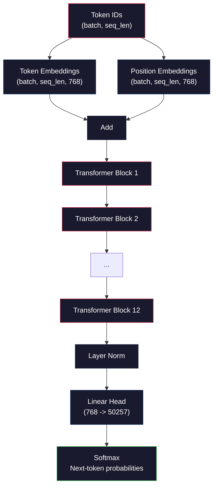
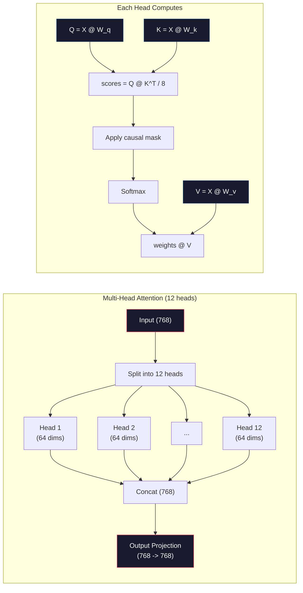
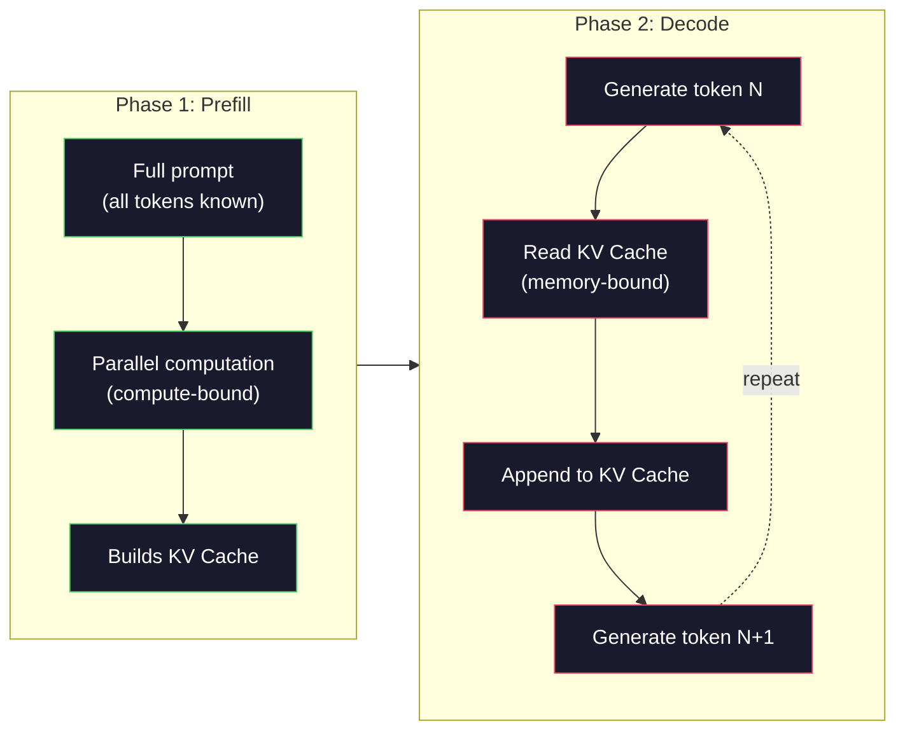

# Pré-Treinamento de um Mini GPT (124 Milhões de Parâmetros)

> O GPT-2 Small tem 124 milhões de parâmetros. São 12 camadas transformer, 12 cabeças de atenção e embeddings de 768 dimensões. Voce pode treinar ele do zero em uma GPU em poucas horas. A maioria das pessoas nunca faz isso. Elas usam checkpoints pré-treinados. Mas se voce nunca treinou um voce mesmo, voce na verdade não entende o que acontece dentro do modelo no qual voce está construindo produtos.

**Tipo:** Construir
**Linguagens:** Python (com numpy)
**Pré-requisitos:** Fase 10, Lições 01-03 (Tokenizers, Construindo um Tokenizer, Pipelines de Dados)
**Tempo:** ~120 minutos

## Objetivos de Aprendizado

- Implementar a arquitetura completa do GPT-2 (124 milhões de parâmetros) do zero: embeddings de tokens, embeddings posicionais, blocos transformer e a camada de linguagem
- Treinar um modelo GPT em um corpus de texto usando previsão do próximo token com perda de entropia cruzada
- Implementar geração de texto autoregressiva com amostragem por temperatura e filtragem top-k/top-p
- Monitorar curvas de perda de treinamento e validar que o modelo aprende padrões de linguagem coerentes

## O Problema

Voce sabe o que é um transformer. Voce leu os diagramas. Voce consegue citar "attention is all you need" e desenhar caixas rotuladas "Multi-Head Attention" em um quadro branco.

Nada disso significa que voce entende o que acontece quando um modelo gera texto.

Existem 124.438.272 parâmetros no GPT-2 Small (com weight tying). Cada um deles foi definido rodando um loop de treinamento: forward pass, calcular perda, backward pass, atualizar pesos. Doze blocos transformer. Doze cabeças de atenção por bloco. Um espaço de embedding de 768 dimensões. Um vocabulário de 50.257 tokens. Toda vez que o modelo gera um token, todos os 124 milhões de parâmetros participam de uma cadeia de multiplicações matriciais que recebe uma sequência de IDs de tokens e produz uma distribuição de probabilidades sobre o próximo token.

Se voce nunca construiu isso voce mesmo, voce está trabalhando com uma caixa preta. Voce pode usar a API. Voce pode fazer fine-tune. Mas quando algo dá errado -- quando o modelo alucina, quando ele se repete, quando ele se recusa a seguir instruções -- voce não tem um modelo mental pra entender *por quê*.

Essa lição constrói o GPT-2 Small do zero. Não em PyTorch. Em numpy. Cada multiplicação matricial é visível. Cada gradiente é calculado pelo seu código. Voce vai ver exatamente como 124 milhões de números conspiram pra prever a próxima palavra.

## O Conceito

### A Arquitetura GPT

O GPT é um modelo de linguagem autoregressivo. "Autoregressivo" significa que ele gera um token por vez, cada um condicionado em todos os tokens anteriores. A arquitetura é uma pilha de blocos decoder transformer.

Aqui está o grafo completo de computação de IDs de tokens a probabilidades do próximo token:

1. Os IDs de tokens entram. Formato: (batch_size, seq_len).
2. Lookup de embedding de token. Cada ID mapeia para um vetor de 768 dimensões. Formato: (batch_size, seq_len, 768).
3. Lookup de embedding posicional. Cada posição (0, 1, 2, ...) mapeia para um vetor de 768 dimensões. Mesmo formato.
4. Soma dos embeddings de token + embeddings posicionais.
5. Passa por 12 blocos transformer.
6. Layer normalization final.
7. Projeção linear pro tamanho do vocabulário. Formato: (batch_size, seq_len, vocab_size).
8. Softmax pra obter as probabilidades.

Esse é o modelo inteiro. Sem convoluções. Sem recorrência. Apenas embeddings, attention, redes feedforward e layer norms empilhados 12 vezes.



### O Bloco Transformer

Cada um dos 12 blocos segue o mesmo padrão. Arquitetura pre-norm (o GPT-2 usa pre-norm, não post-norm como o transformer original):

1. LayerNorm
2. Multi-Head Self-Attention
3. Conexão residual (somar o input de volta)
4. LayerNorm
5. Rede Feed-Forward (MLP)
6. Conexão residual (somar o input de volta)

As conexões residuais são críticas. Sem elas, os gradientes desaparecem quando chegam ao bloco 1 durante o backpropagation. Com elas, os gradientes podem fluir diretamente da perda pra qualquer camada através do caminho "skip". É por isso que voce pode empilhar 12, 32 ou até 96 blocos (dizem que o GPT-4 usa 120).

### Attention: O Mecanismo Central

O self-attention permite que cada token olhe pra cada token anterior e decida quanto attend pra cada um. Aqui vai a matemática.

Para cada posição do token, calculam-se três vetores do input:
- **Query (Q)**: "O que eu estou procurando?"
- **Key (K)**: "O que eu contém?"
- **Value (V)**: "Que informação eu carrego?"

```
Q = input @ W_q    (768 -> 768)
K = input @ W_k    (768 -> 768)
V = input @ W_v    (768 -> 768)

attention_scores = Q @ K^T / sqrt(d_k)
attention_scores = mask(attention_scores)   # causal mask: -inf for future positions
attention_weights = softmax(attention_scores)
output = attention_weights @ V
```

O causal mask é o que torna o GPT autoregressivo. A posição 5 pode attend às posições 0-5 mas não a 6, 7, 8 e assim por diante. Isso impede que o modelo "trapaceie" olhando tokens futuros durante o treinamento.

**A multi-head attention** divide o espaço de 768 dimensões em 12 cabeças de 64 dimensões cada. Cada cabeça aprende um padrão de atenção diferente. Uma cabeça pode rastrear relações sintáticas (concordância sujeito-verbo). Outra pode rastrear similaridade semântica (sinônimos). Outra pode rastrear proximidade posicional (palavras próximas). As saídas de todas as 12 cabeças são concatenadas e projetadas de volta pra 768 dimensões.



A divisão por sqrt(d_k) -- sqrt(64) = 8 -- é scaling. Sem ela, os produtos escalares ficam grandes pra vetores de alta dimensão, empurrando o softmax pra regiões onde os gradientes são quase zero. Essa foi uma das principais ideias do paper original "Attention Is All You Need".

### KV Cache: Por Que a Inferência É Rápida

Durante o treinamento, voce processa a sequência inteira de uma vez. Durante a inferência, voce gera um token por vez. Sem otimização, gerar o token N requer recalcular a atenção pra todos os N-1 tokens anteriores. Isso é O(N^2) por token gerado, ou O(N^3) no total pra uma sequência de tamanho N.

O KV Cache resolve isso. Após calcular K e V pra cada token, armazene-os. Quando gerar o token N+1, voce só precisa calcular Q pro novo token e olhar os K e V em cache de todos os tokens anteriores. Isso reduz o custo por token de O(N) pra O(1) pro cálculo de K e V. O cálculo do score de atenção ainda é O(N) porque voce attend a todas as posições anteriores, mas voce evita multiplicações matriciais redundantes no input.

Pra o GPT-2 com 12 camadas e 12 cabeças, o KV cache armazena 2 (K + V) x 12 camadas x 12 cabeças x 64 dims = 18.432 valores por token. Pra uma sequência de 1024 tokens, são cerca de 75MB em FP32. Pro Llama 3 405B com 128 camadas, o KV cache pra uma única sequência pode passar de 10GB. É por isso que inferência com contexto longo é limitada por memória.

### Prefill vs Decode: Duas Fases da Inferência

Quando voce envia um prompt pra um LLM, a inferência acontece em duas fases distintas.

**Prefill** processa seu prompt inteiro em paralelo. Todos os tokens são conhecidos, então o modelo pode calcular a atenção pra todas as posições simultaneamente. Essa fase é compute-bound -- a GPU está fazendo multiplicações matriciais em throughput máximo. Pra um prompt de 1000 tokens num A100, o prefill leva cerca de 20-50ms.

**Decode** gera tokens um por vez. Cada novo token depende de todos os tokens anteriores. Essa fase é memory-bound -- o gargalo é ler os pesos do modelo e o KV cache da memória da GPU, não a matemática matricial em si. Os cores de computação da GPU ficam maior parte do tempo ociosos esperando leituras de memória. Pro GPT-2, cada passo de decode leva mais ou menos o mesmo tempo independente de quantos FLOPs os matmuls requerem, porque a largura de banda de memória é a restrição.

Essa distinção importa pra sistemas em produção. O throughput do prefill escala com o compute da GPU (mais FLOPS = prefill mais rápido). O throughput do decode escala com a largura de banda da memória (memória mais rápida = decode mais rápido). É por isso que o H100 da NVIDIA focou em melhorias de largura de banda de memória sobre o A100 -- isso acelera diretamente a geração de tokens.



### O Loop de Treinamento

Treinar um LLM é previsão do próximo token. Dados os tokens [0, 1, 2, ..., N-1], prever os tokens [1, 2, 3, ..., N]. A função de perda é a entropia cruzada entre a distribuição de probabilidade prevista pelo modelo e o token seguinte real.

Um passo de treinamento:

1. **Forward pass**: Roda o batch por todos os 12 blocos. Obtém logits (scores pré-softmax) pra cada posição.
2. **Calcular perda**: Entropia cruzada entre logits e tokens alvo (o input deslocado por uma posição).
3. **Backward pass**: Calcula gradientes pra todos os 124M de parâmetros usando backpropagation.
4. **Passo do otimizador**: Atualiza pesos. O GPT-2 usa Adam com warmup da taxa de aprendizado e cosine decay.

O cronograma de taxa de aprendizado importa mais do que voce imagina. O GPT-2 faz warmup de 0 até a taxa de aprendizado máxima nos primeiros 2.000 passos, depois decresce seguindo uma curva cosseno. Começar com uma taxa de aprendizado alta faz o modelo divergir. Manter uma taxa alta constante causa oscilação no treinamento posterior. O padrão de warmup-then-decay é usado por todo grande LLM.

### GPT-2 Small: Os Números

| Componente | Formato | Parâmetros |
|-----------|-------|------------|
| Embeddings de token | (50257, 768) | 38.597.376 |
| Embeddings posicionais | (1024, 768) | 786.432 |
| Attention por bloco (W_q, W_k, W_v, W_out) | 4 x (768, 768) | 2.359.296 |
| FFN por bloco (up + down) | (768, 3072) + (3072, 768) | 4.718.592 |
| LayerNorms por bloco (2x) | 2 x 768 x 2 | 3.072 |
| LayerNorm Final | 768 x 2 | 1.536 |
| **Total por bloco** | | **7.080.960** |
| **Total (12 blocos)** | | **85.054.464 + 39.383.808 = 124.438.272** |

A projeção de saída (logits head) compartilha pesos com a matriz de embedding de token. Isso se chama weight tying -- reduz a contagem de parâmetros em 38M e melhora a performance porque força o modelo a usar o mesmo espaço de representação pra entrada e saída.

## Construir

### Passo 1: Camada de Embedding

Os embeddings de token mapeiam cada um dos 50.257 tokens possíveis pra um vetor de 768 dimensões. Os embeddings posicionais adicionam informação sobre onde cada token está na sequência. Os dois são somados.

```python
import numpy as np

class Embedding:
    def __init__(self, vocab_size, embed_dim, max_seq_len):
        self.token_embed = np.random.randn(vocab_size, embed_dim) * 0.02
        self.pos_embed = np.random.randn(max_seq_len, embed_dim) * 0.02

    def forward(self, token_ids):
        seq_len = token_ids.shape[-1]
        tok_emb = self.token_embed[token_ids]
        pos_emb = self.pos_embed[:seq_len]
        return tok_emb + pos_emb
```

O desvio padrão de 0.02 pra inicialização vem do paper do GPT-2. Muito grande e os forward passes iniciais produzem valores extremos que desestabilizam o treinamento. Muito pequeno e as saídas iniciais são quase idênticas pra todos os inputs, tornando os sinais de gradiente inúteis no início.

### Passo 2: Self-Attention com Causal Mask

Primeiro, a atenção de cabeça única. O causal mask define posições futuras como negativo infinito antes do softmax, garantindo que cada posição só possa attend a si mesma e a posições anteriores.

```python
def attention(Q, K, V, mask=None):
    d_k = Q.shape[-1]
    scores = Q @ K.transpose(0, -1, -2 if Q.ndim == 4 else 1) / np.sqrt(d_k)
    if mask is not None:
        scores = scores + mask
    weights = np.exp(scores - scores.max(axis=-1, keepdims=True))
    weights = weights / weights.sum(axis=-1, keepdims=True)
    return weights @ V
```

A implementação do softmax subtrai o máximo antes de exponenciar. Sem isso, exp(número_grande) estoura pra infinito. Esse é um truque de estabilidade numérica que não muda a saída porque softmax(x - c) = softmax(x) pra qualquer constante c.

### Passo 3: Multi-Head Attention

Divide o input de 768 dimensões em 12 cabeças de 64 dimensões cada. Cada cabeça calcula a atenção independentemente. Concatena os resultados e projeta de volta pra 768 dimensões.

```python
class MultiHeadAttention:
    def __init__(self, embed_dim, num_heads):
        self.num_heads = num_heads
        self.head_dim = embed_dim // num_heads
        self.W_q = np.random.randn(embed_dim, embed_dim) * 0.02
        self.W_k = np.random.randn(embed_dim, embed_dim) * 0.02
        self.W_v = np.random.randn(embed_dim, embed_dim) * 0.02
        self.W_out = np.random.randn(embed_dim, embed_dim) * 0.02

    def forward(self, x, mask=None):
        batch, seq_len, d = x.shape
        Q = (x @ self.W_q).reshape(batch, seq_len, self.num_heads, self.head_dim).transpose(0, 2, 1, 3)
        K = (x @ self.W_k).reshape(batch, seq_len, self.num_heads, self.head_dim).transpose(0, 2, 1, 3)
        V = (x @ self.W_v).reshape(batch, seq_len, self.num_heads, self.head_dim).transpose(0, 2, 1, 3)

        scores = Q @ K.transpose(0, 1, 3, 2) / np.sqrt(self.head_dim)
        if mask is not None:
            scores = scores + mask
        weights = np.exp(scores - scores.max(axis=-1, keepdims=True))
        weights = weights / weights.sum(axis=-1, keepdims=True)
        attn_out = weights @ V

        attn_out = attn_out.transpose(0, 2, 1, 3).reshape(batch, seq_len, d)
        return attn_out @ self.W_out
```

A dança de reshape-transpose-reshape é a parte mais confusa da multi-head attention. Aqui vai o que acontece: o tensor (batch, seq_len, 768) vira (batch, seq_len, 12, 64), depois (batch, 12, seq_len, 64). Agora cada uma das 12 cabeças tem sua própria matriz (seq_len, 64) pra rodar a atenção. Depois da atenção, a gente reverte o processo: (batch, 12, seq_len, 64) vira (batch, seq_len, 12, 64) que vira (batch, seq_len, 768).

### Passo 4: Bloco Transformer

Um bloco transformer completo: LayerNorm, multi-head attention com residual, LayerNorm, feedforward com residual.

```python
class LayerNorm:
    def __init__(self, dim, eps=1e-5):
        self.gamma = np.ones(dim)
        self.beta = np.zeros(dim)
        self.eps = eps

    def forward(self, x):
        mean = x.mean(axis=-1, keepdims=True)
        var = x.var(axis=-1, keepdims=True)
        return self.gamma * (x - mean) / np.sqrt(var + self.eps) + self.beta


class FeedForward:
    def __init__(self, embed_dim, ff_dim):
        self.W1 = np.random.randn(embed_dim, ff_dim) * 0.02
        self.b1 = np.zeros(ff_dim)
        self.W2 = np.random.randn(ff_dim, embed_dim) * 0.02
        self.b2 = np.zeros(embed_dim)

    def forward(self, x):
        h = x @ self.W1 + self.b1
        h = np.maximum(0, h)  # GELU approximation: ReLU for simplicity
        return h @ self.W2 + self.b2


class TransformerBlock:
    def __init__(self, embed_dim, num_heads, ff_dim):
        self.ln1 = LayerNorm(embed_dim)
        self.attn = MultiHeadAttention(embed_dim, num_heads)
        self.ln2 = LayerNorm(embed_dim)
        self.ffn = FeedForward(embed_dim, ff_dim)

    def forward(self, x, mask=None):
        x = x + self.attn.forward(self.ln1.forward(x), mask)
        x = x + self.ffn.forward(self.ln2.forward(x))
        return x
```

A rede feedforward expande o input de 768 dimensões pra 3.072 dimensões (4x), aplica uma não-linearidade, e projeta de volta pra 768. Esse padrão de expansão-contração dá ao modelo uma representação interna "mais larga" pra trabalhar em cada posição. O GPT-2 usa ativação GELU, mas aqui usamos ReLU por simplicidade -- a diferença é mínima pra entender a arquitetura.

### Passo 5: Modelo GPT Completo

Empilha 12 blocos transformer. Adiciona a camada de embedding na frente e a projeção de saída no final.

```python
class MiniGPT:
    def __init__(self, vocab_size=50257, embed_dim=768, num_heads=12,
                 num_layers=12, max_seq_len=1024, ff_dim=3072):
        self.embedding = Embedding(vocab_size, embed_dim, max_seq_len)
        self.blocks = [
            TransformerBlock(embed_dim, num_heads, ff_dim)
            for _ in range(num_layers)
        ]
        self.ln_f = LayerNorm(embed_dim)
        self.vocab_size = vocab_size
        self.embed_dim = embed_dim

    def forward(self, token_ids):
        seq_len = token_ids.shape[-1]
        mask = np.triu(np.full((seq_len, seq_len), -1e9), k=1)

        x = self.embedding.forward(token_ids)
        for block in self.blocks:
            x = block.forward(x, mask)
        x = self.ln_f.forward(x)

        logits = x @ self.embedding.token_embed.T
        return logits

    def count_parameters(self):
        total = 0
        total += self.embedding.token_embed.size
        total += self.embedding.pos_embed.size
        for block in self.blocks:
            total += block.attn.W_q.size + block.attn.W_k.size
            total += block.attn.W_v.size + block.attn.W_out.size
            total += block.ffn.W1.size + block.ffn.b1.size
            total += block.ffn.W2.size + block.ffn.b2.size
            total += block.ln1.gamma.size + block.ln1.beta.size
            total += block.ln2.gamma.size + block.ln2.beta.size
        total += self.ln_f.gamma.size + self.ln_f.beta.size
        return total
```

Note o weight tying: `logits = x @ self.embedding.token_embed.T`. A projeção de saída reutiliza a matriz de embedding de token (transposta). Isso não é só um truque pra economizar parâmetros. Significa que o modelo usa o mesmo espaço vetorial pra entender tokens (embeddings) e pra prevê-los (saída).

### Passo 6: Loop de Treinamento

Pra um treinamento real de 124M de parâmetros, voce precisaria de uma GPU e PyTorch. Esse loop de treinamento demonstra as mecânicas num modelo pequeno que roda em numpy puro. Usamos um modelo minúsculo (4 camadas, 4 cabeças, 128 dims) pra tornar viável.

```python
def cross_entropy_loss(logits, targets):
    batch, seq_len, vocab_size = logits.shape
    logits_flat = logits.reshape(-1, vocab_size)
    targets_flat = targets.reshape(-1)

    max_logits = logits_flat.max(axis=-1, keepdims=True)
    log_softmax = logits_flat - max_logits - np.log(
        np.exp(logits_flat - max_logits).sum(axis=-1, keepdims=True)
    )

    loss = -log_softmax[np.arange(len(targets_flat)), targets_flat].mean()
    return loss


def train_mini_gpt(text, vocab_size=256, embed_dim=128, num_heads=4,
                   num_layers=4, seq_len=64, num_steps=200, lr=3e-4):
    tokens = np.array(list(text.encode("utf-8")[:2048]))
    model = MiniGPT(
        vocab_size=vocab_size, embed_dim=embed_dim, num_heads=num_heads,
        num_layers=num_layers, max_seq_len=seq_len, ff_dim=embed_dim * 4
    )

    print(f"Model parameters: {model.count_parameters():,}")
    print(f"Training tokens: {len(tokens):,}")
    print(f"Config: {num_layers} layers, {num_heads} heads, {embed_dim} dims")
    print()

    for step in range(num_steps):
        start_idx = np.random.randint(0, max(1, len(tokens) - seq_len - 1))
        batch_tokens = tokens[start_idx:start_idx + seq_len + 1]

        input_ids = batch_tokens[:-1].reshape(1, -1)
        target_ids = batch_tokens[1:].reshape(1, -1)

        logits = model.forward(input_ids)
        loss = cross_entropy_loss(logits, target_ids)

        if step % 20 == 0:
            print(f"Step {step:4d} | Loss: {loss:.4f}")

    return model
```

A perda começa perto de ln(vocab_size) -- pra um vocabulário de 256 tokens em nível de byte, é ln(256) = 5.55. Um modelo aleatório atribui probabilidade igual pra cada token. Conforme o treinamento avança, a perda cai porque o modelo aprende a prever padrões comuns: "th" depois de "t", espaço depois de um ponto, e assim por diante.

Em produção, voce usaria o otimizador Adam com gradient accumulation, warmup da taxa de aprendizado e gradient clipping. O loop forward-loss-backward-update é idêntico. O otimizador é mais sofisticado.

### Passo 7: Geração de Texto

A geração usa o modelo treinado pra prever um token por vez. Cada previsão é amostrada da distribuição de saída (ou pega gananciosamente como o argmax).

```python
def generate(model, prompt_tokens, max_new_tokens=100, temperature=0.8):
    tokens = list(prompt_tokens)
    seq_len = model.embedding.pos_embed.shape[0]

    for _ in range(max_new_tokens):
        context = np.array(tokens[-seq_len:]).reshape(1, -1)
        logits = model.forward(context)
        next_logits = logits[0, -1, :]

        next_logits = next_logits / temperature
        probs = np.exp(next_logits - next_logits.max())
        probs = probs / probs.sum()

        next_token = np.random.choice(len(probs), p=probs)
        tokens.append(next_token)

    return tokens
```

A temperatura controla a aleatoriedade. Temperatura 1.0 usa a distribuição bruta. Temperatura 0.5 a agudiza (mais determinista -- o modelo escolhe seus top picks mais vezes). Temperatura 1.5 a aplaina (mais aleatório -- tokens de baixa probabilidade ganham uma chance maior). Temperatura 0.0 é decoding ganancioso (sempre escolher o token de maior probabilidade).

A janela `tokens[-seq_len:]` é necessária porque o modelo tem um tamanho máximo de contexto (1024 pro GPT-2). Uma vez que voce excede isso, voce precisa descartar os tokens mais antigos. Essa é a "janela de contexto" que todo mundo fala.

## Usar

### Demo Completa de Treinamento e Geração

```python
corpus = """The transformer architecture has revolutionized natural language processing.
Attention mechanisms allow the model to focus on relevant parts of the input.
Self-attention computes relationships between all pairs of positions in a sequence.
Multi-head attention splits the representation into multiple subspaces.
Each attention head can learn different types of relationships.
The feedforward network provides nonlinear transformations at each position.
Residual connections enable gradient flow through deep networks.
Layer normalization stabilizes training by normalizing activations.
Position embeddings give the model information about token ordering.
The causal mask ensures autoregressive generation during training.
Pre-training on large text corpora teaches the model general language understanding.
Fine-tuning adapts the pre-trained model to especificaçãoific downstream tasks."""

model = train_mini_gpt(corpus, num_steps=200)

prompt = list("The transformer".encode("utf-8"))
output_tokens = generate(model, prompt, max_new_tokens=100, temperature=0.8)
generated_text = bytes(output_tokens).decode("utf-8", errors="replace")
print(f"\nGenerated: {generated_text}")
```

Num corpus pequeno com um modelo pequeno, o texto gerado vai ser semicoerente no máximo. Ele vai aprender alguns padrões em nível de byte do texto de treinamento mas não consegue generalizar da forma como o GPT-2 faz com 40GB de dados de treinamento e a arquitetura completa de 124M de parâmetros. O ponto não é a qualidade da saída. O ponto é que voce pode rastrear cada passo: lookup de embedding, cálculo de atenção, transformação feedforward, projeção de logits, softmax e amostragem. Cada operação é visível.

## Publicar

Essa lição produz `outputs/prompt-gpt-architecture-analyzer.md` -- um prompt que analisa as escolhas de arquitetura em qualquer modelo do estilo GPT. Alimente ele com um model card ou relatório técnico e ele descompõe a alocação de parâmetros, o design de atenção e decisões de scaling.

## Exercícios

1. Modifique o modelo pra usar 24 camadas e 16 cabeças ao invés de 12/12. Conte os parâmetros. Como duplicar a profundidade se compara a duplicar a largura (dimensão do embedding)?

2. Implemente a função de ativação GELU (GELU(x) = x * 0.5 * (1 + erf(x / sqrt(2)))) e substitua o ReLU na rede feedforward. Rode o treinamento por 500 passos com cada ativação e compare a perda final.

3. Adicione um KV cache na função de geração. Armazene os tensores K e V de cada camada após o primeiro forward pass e reutilize-os pra tokens subsequentes. Meça a aceleração: gere 200 tokens com e sem o cache e compare o tempo de parede.

4. Implemente top-k sampling (só considerar os k tokens de maior probabilidade) e top-p sampling (nucleus sampling: considerar o menor conjunto de tokens cuja probabilidade cumulativa excede p). Compare a qualidade da saída na temperatura 0.8 com top-k=50 vs top-p=0.95.

5. Construa um gráfico de curva de perda de treinamento. Treine o modelo por 1000 passos e plote perda vs passo. Identifique as três fases: queda inicial rápida (aprendendo bytes comuns), fase intermediária mais lenta (aprendendo padrões de byte) e platô (overfitting no corpus pequeno). A forma dessa curva é a mesma tanto se voce estiver treinando um modelo de 128 dims quanto o GPT-4.

## Termos Principais

| Termo | O que a gente diz | O que realmente significa |
|------|----------------|----------------------|
| Autoregressive | "Ele gera uma palavra por vez" | Cada token de saída é condicionado em todos os tokens anteriores -- o modelo prevê P(token_n \| token_0, ..., token_{n-1}) |
| Causal mask | "Ele não enxerga o futuro" | Uma matriz triangular superior de valores negativo infinito que impede atenção a posições futuras durante o treinamento |
| Multi-head attention | "Múltiplos padrões de atenção" | Dividir Q, K, V em cabeças paralelas (ex.: 12 cabeças de 64 dims cada pro GPT-2) pra que cada cabeça aprenda tipos de relação diferentes |
| KV Cache | "Cache pra velocidade" | Armazenar tensores Key e Value computados de tokens anteriores pra evitar computação redundante durante geração autoregressiva |
| Prefill | "Processando o prompt" | A primeira fase de inferência onde todos os tokens do prompt são processados em paralelo -- compute-bound no FLOPS da GPU |
| Decode | "Gerando tokens" | A segunda fase de inferência onde tokens são gerados um por vez -- memory-bound na largura de banda da GPU |
| Weight tying | "Compartilhando embeddings" | Usar a matriz de entrada de embeddings de token e a camada de projeção de saída -- economiza 38M de parâmetros no GPT-2 |
| Conexão residual | "Skip connection" | Somar o input diretamente à saída de uma subcamada (x + sublayer(x)) -- habilita fluxo de gradiente em redes profundas |
| Layer normalization | "Normalizando ativações" | Normalizar na dimensão de features pra média 0 e variância 1, com parâmetros de escala e viés aprendíveis |
| Perda de entropia cruzada | "O quanto as previsões estão erradas" | -log(probabilidade atribuída ao token correto seguinte), média sobre todas as posições -- o objetivo padrão de treinamento de LLM |

## Leitura Complementar

- [Radford et al., 2019 -- "Language Models are Unsupervised Multitask Learners" (GPT-2)](https://cdn.openai.com/better-language-models/language_models_are_unsupervised_multitask_learners.pdf) -- o paper do GPT-2 que introduziu a família de modelos de 124M a 1.5B parâmetros
- [Vaswani et al., 2017 -- "Attention Is All You Need"](https://arxiv.org/abs/1706.03762) -- o paper original do transformer com scaled dot-product attention e multi-head attention
- [Relatório Técnico do Llama 3](https://arxiv.org/abs/2407.21783) -- como a Meta escala a arquitetura GPT pra 405B de parâmetros com 16K GPUs
- [Pope et al., 2022 -- "Efficiently Scaling Transformer Inference"](https://arxiv.org/abs/2211.05102) -- o paper que formalizou prefill vs decode e análise de KV cache
