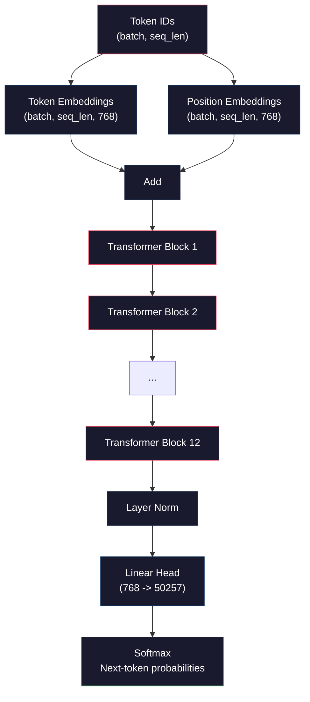
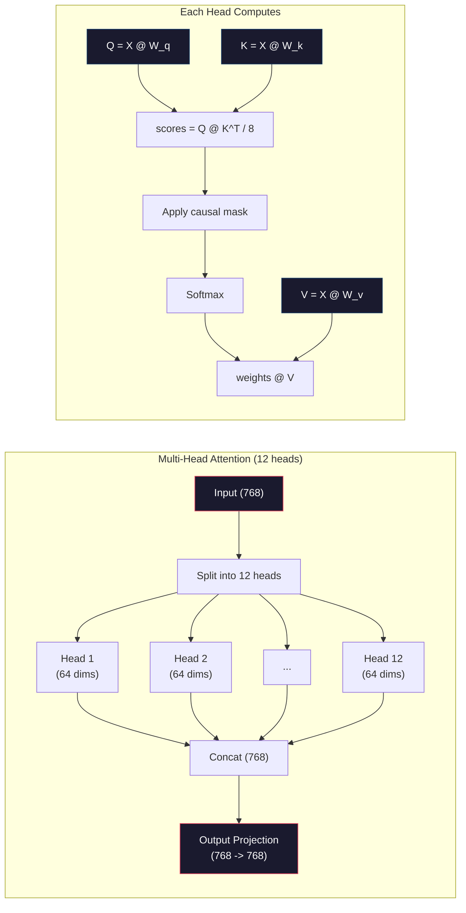
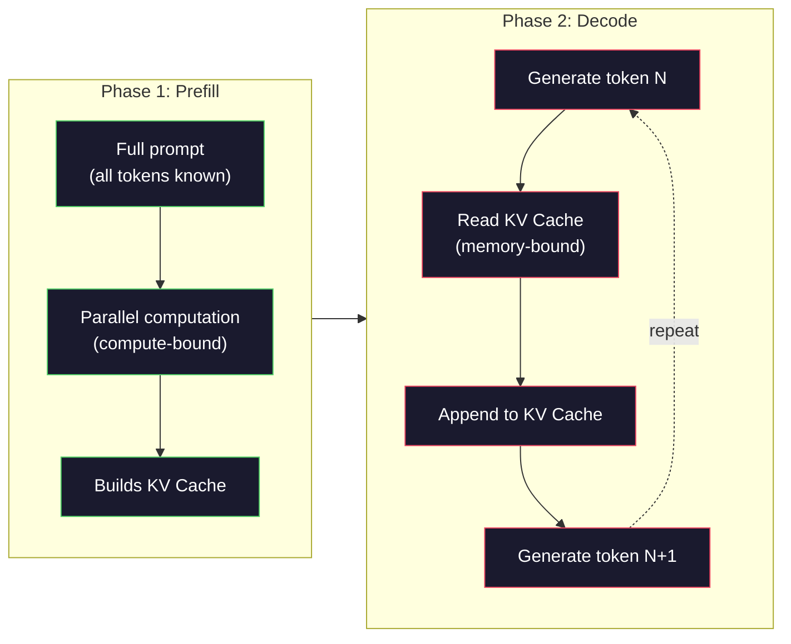

# Mini GPT'nin Ön Eğitimi (124M Parametreleri)

> GPT-2 Small'un 124 milyon parametresi vardır. Bu 12 transformer katman, 12 dikkat kafası ve 768 boyutlu embedding'dur. Birkaç saat içinde tek bir GPU üzerinde sıfırdan eğitebilirsiniz. Çoğu insan bunu asla yapmaz. Önceden eğitilmiş kontrol noktalarını kullanırlar. Ancak kendiniz eğitmezseniz, üzerine ürün oluşturduğunuz modelin içinde neler olduğunu gerçekten anlamıyorsunuz.

**Tür:** Yapım
**Diller:** Python (numpy ile)
**Önkoşullar:** Aşama 10, Dersler 01-03 (Tokenizers, Bir Tokenizer Oluşturmak, Veri Boru Hatları)
**Süre:** ~120 dakika

## Öğrenme Hedefleri

- GPT-2 mimarisinin tamamını (124 milyon parametre) sıfırdan uygulayın: token embedding'ler, konumsal embedding'ler, transformer bloklar ve dil modeli başlığı
- Çapraz entropi kaybıyla sonraki-token tahminini kullanarak bir metin külliyatı üzerinde bir GPT modeli eğitin
- Sıcaklık örneklemesi ve top-k/top-p filtrelemeyle otoregresif metin oluşturmayı uygulayın
- Eğitim kaybı eğrilerini izleyin ve modelin tutarlı dil kalıplarını öğrendiğini doğrulayın

## Sorun

transformer'nin ne olduğunu biliyorsun. Diyagramları okudunuz. Beyaz tahtaya "İhtiyacınız olan tek şey dikkat" diyebilir ve "Çok Kafalı Dikkat" etiketli kutular çizebilirsiniz.

Bunların hiçbiri, bir model metin oluşturduğunda ne olacağını anladığınız anlamına gelmez.

GPT-2 Small'da (ağırlık bağlamalı) 124.438.272 parametre bulunmaktadır. Bunların her biri bir eğitim döngüsü çalıştırılarak belirlendi: ileri geçiş, hesaplama kaybı, geri geçiş, güncelleme ağırlıkları. On iki transformer blok. Blok başına on iki dikkat kafası. 768 boyutlu bir embedding uzayı. 50.257 token'lik kelime dağarcığı. Model her token ürettiğinde, 124 milyon parametrenin tümü, bir token kimlik dizisini alan ve sonraki token üzerinde bir olasılık dağılımı üreten tek bir matris çarpım zincirine katılır.

Bunu hiç kendiniz yapmadıysanız, bir kara kutuyla çalışıyorsunuz demektir. API'yi kullanabilirsiniz. İnce ayar yapabilirsiniz. Ancak bir şeyler ters gittiğinde, model halüsinasyon gördüğünde, kendini tekrarladığında, talimatları takip etmeyi reddettiğinde, *neden* olduğuna dair hiçbir zihinsel modele sahip olmazsınız.

Bu ders GPT-2 Small'u sıfırdan oluşturur. PyTorch'ta değil. Numpy'de. Her matris çarpımı görülebilir. Her gradient kodunuz tarafından hesaplanır. 124 milyon rakamın bir sonraki kelimeyi tahmin etmek için nasıl bir araya geldiğini tam olarak göreceksiniz.

## Konsept

### GPT Mimarisi

GPT otoregresif bir dil modelidir. "Otoregresif", her biri önceki tüm token'lere koşullandırılan, her defasında bir token ürettiği anlamına gelir. Mimari, transformer kod çözücü bloğundan oluşan bir yığındır.

İşte token kimliklerden sonraki-token olasılıklara kadar tam hesaplama grafiği:

1. Token kimlik gelir. Şekil: (batch_size, seq_len).
2. Token embedding araması. Her kimlik 768 boyutlu bir vektörle eşleşir. Şekil: (batch_size, seq_len, 768).
3. Konum embedding araması. Her konum (0, 1, 2, ...) 768 boyutlu bir vektöre eşlenir. Aynı şekil.
4. token embedding'leri + konum embedding'leri ekleyin.
5. 12 transformer bloktan geçin.
6. Son katman normalizasyonu.
7. Kelime büyüklüğüne doğrusal projeksiyon. Şekil: (batch_size, seq_len, vocab_size).
8. Olasılıkları elde etmek için Softmax.

Modelin tamamı budur. Kıvrım yok. Tekrarlama yok. Yalnızca embedding'lar, dikkat, ileri beslemeli ağlar ve katman normları 12 kez istiflendi.



### Transformer Bloğu

12 bloğun her biri aynı modeli takip ediyor. Norm öncesi mimari (GPT-2, orijinal transformer gibi post-norm değil, ön-norm kullanır):

1. KatmanNormu
2. Çok Kafalı Kişisel Dikkat
3. Artık bağlantı (girişi geri ekleyin)
4. Katman Normu
5. İleri Beslemeli Ağ (MLP)
6. Artık bağlantı (girişi geri ekleyin)

Artık bağlantılar kritiktir. Onlar olmadan, gradient'lar, backpropagation sırasında 1. bloğa ulaştıklarında yok olurlar. Onlarla, gradient'ler kayıptan doğrudan "atlama" yolu aracılığıyla herhangi bir katmana akabilir. Bu nedenle 12, 32 ve hatta 96 blok istifleyebilirsiniz (GPT-4'ün 120 blok kullandığı söyleniyor).

### Dikkat: Temel Mekanizma

Öz-dikkat, her token'nin önceki her token'ye bakmasına ve her birine ne kadar dikkat edeceğine karar vermesine olanak tanır. İşte matematik.

Her token konumu için girişten üç vektör hesaplayın:
- **Sorgu (S)**: "Neyi arıyorum?"
- **Anahtar (K)**: "İçimde ne var?"
- **Değer (V)**: "Hangi bilgileri taşıyorum?"

```
Q = input @ W_q    (768 -> 768)
K = input @ W_k    (768 -> 768)
V = input @ W_v    (768 -> 768)

attention_scores = Q @ K^T / sqrt(d_k)
attention_scores = mask(attention_scores)   # causal mask: -inf for future positions
attention_weights = softmax(attention_scores)
output = attention_weights @ V
```

Nedensel maske GPT'yi otoregresif yapan şeydir. Pozisyon 5, 0-5 arasındaki pozisyonlara katılabilir ancak 6, 7, 8 vb. pozisyonlara katılamaz. Bu, modelin eğitim sırasında gelecekteki token'lere bakarak "hile yapmasını" engeller.

**Çok kafalı dikkat** 768 boyutlu alanı her biri 64 boyutlu 12 başa böler. Her kafa farklı bir dikkat modelini öğrenir. Bir kafa sözdizimsel ilişkileri (özne-fiil uyumu) ​​izleyebilir. Bir diğeri anlamsal benzerliği (eş anlamlılar) izleyebilir. Bir diğeri konumsal yakınlığı (yakındaki kelimeler) izleyebilir. 12 kafanın tümünün çıktıları birleştirilir ve 768 boyuta yansıtılır.



sqrt(d_k) -- sqrt(64) = 8 -- ile bölme ölçeklendirmedir. Bu olmadan, nokta çarpımları yüksek boyutlu vektörler için büyür ve softmax'ı gradient'ların neredeyse sıfır olduğu bölgelere iter. Bu, orijinal "İhtiyacınız Olan Tek Şey Dikkat" makalesindeki en önemli görüşlerden biriydi.

### KV Önbelleği: Inference Neden Hızlı?

Eğitim sırasında tüm sıralamayı aynı anda işlersiniz. inference sırasında, her seferinde bir token üretirsiniz. Optimizasyon olmadan, token N'yi oluşturmak, önceki tüm N-1 token'ler için dikkatin yeniden hesaplanmasını gerektirir. Bu, oluşturulan token başına O(N^2) veya N uzunluğundaki bir dizi için toplam O(N^3)'tür.

KV Cache bunu çözüyor. Her token için K ve V'yi hesapladıktan sonra bunları saklayın. token N+1 oluştururken, yalnızca yeni token için Q'yu hesaplamanız ve önceki tüm token'lerden önbelleğe alınmış K ve V'yi aramanız gerekir. Bu, K ve V hesaplaması için -token başına maliyeti O(N)'den O(1)'e düşürür. Dikkat puanı hesaplaması hala O(N)'dir çünkü önceki tüm pozisyonlara katılırsınız ancak girdide gereksiz matris çarpımlarından kaçınırsınız.

12 katman ve 12 kafalı GPT-2 için KV önbelleği, token başına 2 (K + V) x 12 katman x 12 kafa x 64 sönük = 18.432 değer depolar. Bir 1024-token dizisi için bu, FP32'de yaklaşık 75 MB'tır. 128 katmanlı Llama 3 405B için tek bir diziye ait KV önbellek 10 GB'ı aşabilir. Uzun içerikli inference'nin belleğe bağlı olmasının nedeni budur.

### Ön Doldurma ve Kod Çözme: Inference'nin İki Aşaması

Bir LLM'ye prompt gönderdiğinizde, inference iki farklı aşamada gerçekleşir.

**Ön Doldurma** prompt dosyanızın tamamını paralel olarak işler. Tüm token'ler bilinmektedir, dolayısıyla model aynı anda tüm konumlar için dikkati hesaplayabilir. Bu aşama hesaplamaya bağlıdır; GPU, matris çarpımlarını tam verimle yapar. A100'de 1000-token prompt için ön dolum yaklaşık 20-50 ms sürer.

**Kod Çözme** token'ları teker teker üretir. Her yeni token önceki tüm token'lere bağlıdır. Bu aşama belleğe bağlıdır; darboğaz, matris matematiğinin kendisinden değil, model ağırlıklarının ve GPU belleğinden KV önbelleğinin okunmasıdır. GPU'nun hesaplama çekirdekleri çoğunlukla boşta durup bellek okumalarını bekler. GPT-2 için, bellek bant genişliği kısıtlama olduğundan, matmulların kaç FLOP gerektirdiğine bakılmaksızın her kod çözme adımı yaklaşık olarak aynı süreyi alır.

Bu ayrım üretim sistemleri için önemlidir. GPU hesaplamasıyla önceden doldurma aktarım hızı ölçekleri (daha fazla FLOPS = daha hızlı önceden doldurma). Kod çözme verimi bellek bant genişliğine göre ölçeklenir (daha hızlı bellek = daha hızlı kod çözme). Bu nedenle NVIDIA'nın H100'ü, A100'e kıyasla bellek bant genişliği iyileştirmelerine odaklandı; doğrudan token neslini hızlandırıyor.



### Eğitim Döngüsü

Bir Yüksek Lisans eğitimi almak sonraki-token tahmindir. tokens [0, 1, 2, ..., N-1] verildiğinde, tokens [1, 2, 3, ..., N]'yi tahmin edin. loss function, modelin tahmin edilen olasılık dağılımı ile gerçek sonraki token arasındaki çapraz entropidir.

Bir eğitim adımı:

1. **İleri geçiş**: Grubu 12 bloğun tamamından geçirin. Her pozisyon için logit (softmax öncesi puanlar) alın.
2. **Hesaplama kaybı**: Logitler ve hedef token'ler arasındaki çapraz entropi (giriş bir konum kaydırılmıştır).
3. **Geriye doğru geçiş**: backpropagation kullanarak tüm 124M parametreler için gradient'leri hesaplayın.
4. **Optimize edici adımı**: Ağırlıkları güncelleyin. GPT-2, Adam'ı öğrenme hızı ısınması ve kosinüs azalmasıyla birlikte kullanır.

Öğrenme oranı çizelgesi beklediğinizden daha önemlidir. GPT-2, ilk 2.000 adımda 0'dan en yüksek öğrenme oranına kadar ısınır, ardından kosinüs eğrisini izleyerek azalır. Yüksek bir öğrenme oranıyla başlamak modelin sapmasına neden olur. Sabit bir yüksek oranın tutulması daha sonraki eğitimlerde salınımlara neden olur. Isınma-sonra-bozunma modeli her büyük LLM tarafından kullanılır.

### GPT-2 Küçük: Sayılar

| Bileşen | Şekil | Parametreler |
|-----------|-------|------------|
| Token embeddings | (50257, 768) | 38.597.376 |
| Konum embeddings | (1024, 768) | 786.432 |
| Blok başına dikkat (W_q, W_k, W_v, W_out) | 4 adet (768, 768) | 2.359.296 |
| Blok başına FFN (yukarı + aşağı) | (768, 3072) + (3072, 768) | 4.718.592 |
| Blok Başına Katman Normları (2x) | 2 x 768 x 2 | 3,072 |
| Son KatmanNormu | 768x2 | 1.536 |
| **Blok başına toplam** | | **7.080.960** |
| **Toplam (12 blok)** | | **85.054.464 + 39.383.808 = 124.438.272** |

Çıkış projeksiyonu (logit başı), ağırlıkları token embedding matrisiyle paylaşır. Buna ağırlık bağlama denir; parametre sayısını 38M azaltır ve modeli giriş ve çıkış için aynı temsil alanını kullanmaya zorladığından performansı artırır.

## İnşa Et

### Adım 1: Embedding Katman

Token embedding'ler, 50.257 olası token'nin her birini 768 boyutlu bir vektöre eşler. Konum embedding'lar, her bir token'nin dizide nerede bulunduğuna ilişkin bilgi ekler. İkisi toplanır.

```python
import numpy as np

class Embedding:
    def __init__(self, vocab_size, embed_dim, max_seq_len):
        self.token_embed = np.random.randn(vocab_size, embed_dim) * 0.02
        self.pos_embed = np.random.randn(max_seq_len, embed_dim) * 0.02

    def forward(self, token_ids):
        seq_len = token_ids.shape[-1]
        tok_emb = self.token_embed[token_ids]
        pos_emb = self.pos_embed[:seq_len]
        return tok_emb + pos_emb
```

Başlatma için 0,02 standart sapma GPT-2 makalesinden gelmektedir. Çok büyük ve ilk ileri paslar, antrenmanın dengesini bozan aşırı değerler üretir. Çok küçük ve ilk çıkışlar tüm girişler için neredeyse aynı, bu da erken gradient sinyallerini işe yaramaz hale getiriyor.

### Adım 2: Nedensel Maskeyle Kişisel Dikkat

Önce tek kafalı dikkat. Nedensel maske, gelecek pozisyonları softmax'tan önce negatif sonsuza ayarlayarak her pozisyonun yalnızca kendisine ve önceki pozisyonlara odaklanabilmesini sağlar.

```python
def attention(Q, K, V, mask=None):
    d_k = Q.shape[-1]
    scores = Q @ K.transpose(0, -1, -2 if Q.ndim == 4 else 1) / np.sqrt(d_k)
    if mask is not None:
        scores = scores + mask
    weights = np.exp(scores - scores.max(axis=-1, keepdims=True))
    weights = weights / weights.sum(axis=-1, keepdims=True)
    return weights @ V
```

Softmax uygulaması, üstelleştirmeden önce maksimumu çıkarır. Bu olmadan exp(large_number) sonsuza taşar. Bu, herhangi bir c sabiti için softmax(x - c) = softmax(x) olduğundan çıktıyı değiştirmeyen sayısal bir kararlılık hilesidir.

### Adım 3: Çok Kafalı Dikkat

768 boyutlu girişi her biri 64 boyutlu 12 başlığa bölün. Her kafa dikkati bağımsız olarak hesaplar. Sonuçları birleştirin ve 768 boyuta yansıtın.

```python
class MultiHeadAttention:
    def __init__(self, embed_dim, num_heads):
        self.num_heads = num_heads
        self.head_dim = embed_dim // num_heads
        self.W_q = np.random.randn(embed_dim, embed_dim) * 0.02
        self.W_k = np.random.randn(embed_dim, embed_dim) * 0.02
        self.W_v = np.random.randn(embed_dim, embed_dim) * 0.02
        self.W_out = np.random.randn(embed_dim, embed_dim) * 0.02

    def forward(self, x, mask=None):
        batch, seq_len, d = x.shape
        Q = (x @ self.W_q).reshape(batch, seq_len, self.num_heads, self.head_dim).transpose(0, 2, 1, 3)
        K = (x @ self.W_k).reshape(batch, seq_len, self.num_heads, self.head_dim).transpose(0, 2, 1, 3)
        V = (x @ self.W_v).reshape(batch, seq_len, self.num_heads, self.head_dim).transpose(0, 2, 1, 3)

        scores = Q @ K.transpose(0, 1, 3, 2) / np.sqrt(self.head_dim)
        if mask is not None:
            scores = scores + mask
        weights = np.exp(scores - scores.max(axis=-1, keepdims=True))
        weights = weights / weights.sum(axis=-1, keepdims=True)
        attn_out = weights @ V

        attn_out = attn_out.transpose(0, 2, 1, 3).reshape(batch, seq_len, d)
        return attn_out @ self.W_out
```

Yeniden şekillendirme-yer değiştirme-yeniden şekillendirme dansı, çok kafalı dikkatin en kafa karıştırıcı kısmıdır. Olan şu: (batch, seq_len, 768) tensörü (batch, seq_len, 12, 64), ardından (batch, 12, seq_len, 64) olur. Artık 12 kafanın her birinin dikkati çekecek kendi (seq_len, 64) matrisi var. Dikkat ettikten sonra süreci tersine çeviririz: (batch, 12, seq_len, 64) olur (batch, seq_len, 12, 64) olur (batch, seq_len, 768).

### Adım 4: Transformer Blokla

Tam bir transformer blok: KatmanNorm, artık ile çok kafalı dikkat, KatmanNorm, artık ile ileri besleme.

```python
class LayerNorm:
    def __init__(self, dim, eps=1e-5):
        self.gamma = np.ones(dim)
        self.beta = np.zeros(dim)
        self.eps = eps

    def forward(self, x):
        mean = x.mean(axis=-1, keepdims=True)
        var = x.var(axis=-1, keepdims=True)
        return self.gamma * (x - mean) / np.sqrt(var + self.eps) + self.beta


class FeedForward:
    def __init__(self, embed_dim, ff_dim):
        self.W1 = np.random.randn(embed_dim, ff_dim) * 0.02
        self.b1 = np.zeros(ff_dim)
        self.W2 = np.random.randn(ff_dim, embed_dim) * 0.02
        self.b2 = np.zeros(embed_dim)

    def forward(self, x):
        h = x @ self.W1 + self.b1
        h = np.maximum(0, h)  # GELU approximation: ReLU for simplicity
        return h @ self.W2 + self.b2


class TransformerBlock:
    def __init__(self, embed_dim, num_heads, ff_dim):
        self.ln1 = LayerNorm(embed_dim)
        self.attn = MultiHeadAttention(embed_dim, num_heads)
        self.ln2 = LayerNorm(embed_dim)
        self.ffn = FeedForward(embed_dim, ff_dim)

    def forward(self, x, mask=None):
        x = x + self.attn.forward(self.ln1.forward(x), mask)
        x = x + self.ffn.forward(self.ln2.forward(x))
        return x
```

İleri beslemeli ağ, 768 boyutlu girişi 3.072 boyuta (4x) genişletir, doğrusal olmayan bir durum uygular ve ardından 768'e geri yansıtır. Bu genişleme-daralma modeli, modele her konumda çalışmak için "daha geniş" bir dahili temsil sağlar. GPT-2, GELU aktivasyonunu kullanır, ancak burada basitlik amacıyla ReLU'yu kullanıyoruz; mimariyi anlamak açısından fark küçüktür.

### Adım 5: Tam GPT Modeli

12 transformer bloğu istifleyin. Ön tarafa embedding katmanını ve arkaya çıktı projeksiyonunu ekleyin.

```python
class MiniGPT:
    def __init__(self, vocab_size=50257, embed_dim=768, num_heads=12,
                 num_layers=12, max_seq_len=1024, ff_dim=3072):
        self.embedding = Embedding(vocab_size, embed_dim, max_seq_len)
        self.blocks = [
            TransformerBlock(embed_dim, num_heads, ff_dim)
            for _ in range(num_layers)
        ]
        self.ln_f = LayerNorm(embed_dim)
        self.vocab_size = vocab_size
        self.embed_dim = embed_dim

    def forward(self, token_ids):
        seq_len = token_ids.shape[-1]
        mask = np.triu(np.full((seq_len, seq_len), -1e9), k=1)

        x = self.embedding.forward(token_ids)
        for block in self.blocks:
            x = block.forward(x, mask)
        x = self.ln_f.forward(x)

        logits = x @ self.embedding.token_embed.T
        return logits

    def count_parameters(self):
        total = 0
        total += self.embedding.token_embed.size
        total += self.embedding.pos_embed.size
        for block in self.blocks:
            total += block.attn.W_q.size + block.attn.W_k.size
            total += block.attn.W_v.size + block.attn.W_out.size
            total += block.ffn.W1.size + block.ffn.b1.size
            total += block.ffn.W2.size + block.ffn.b2.size
            total += block.ln1.gamma.size + block.ln1.beta.size
            total += block.ln2.gamma.size + block.ln2.beta.size
        total += self.ln_f.gamma.size + self.ln_f.beta.size
        return total
```

Ağırlık bağlantısına dikkat edin: `logits = x @ self.embedding.token_embed.T`. Çıkış projeksiyonu, token embedding matrisini (transpoze edilmiş) yeniden kullanır. Bu sadece parametre tasarrufu sağlayan bir numara değil. Bu, modelin tokens (embeddings)'yi anlamak ve bunları tahmin etmek (çıktı) için aynı vektör uzayını kullandığı anlamına gelir.

### Adım 6: Eğitim Döngüsü

124M parametreler üzerinde gerçek bir eğitim çalışması için GPU ve PyTorch'a ihtiyacınız olacaktır. Bu eğitim döngüsü, saf numpy ile çalışan küçük bir modelin mekaniğini gösterir. İşlenebilir hale getirmek için küçük bir model (4 katman, 4 kafa, 128 dim) kullanıyoruz.

```python
def cross_entropy_loss(logits, targets):
    batch, seq_len, vocab_size = logits.shape
    logits_flat = logits.reshape(-1, vocab_size)
    targets_flat = targets.reshape(-1)

    max_logits = logits_flat.max(axis=-1, keepdims=True)
    log_softmax = logits_flat - max_logits - np.log(
        np.exp(logits_flat - max_logits).sum(axis=-1, keepdims=True)
    )

    loss = -log_softmax[np.arange(len(targets_flat)), targets_flat].mean()
    return loss


def train_mini_gpt(text, vocab_size=256, embed_dim=128, num_heads=4,
                   num_layers=4, seq_len=64, num_steps=200, lr=3e-4):
    tokens = np.array(list(text.encode("utf-8")[:2048]))
    model = MiniGPT(
        vocab_size=vocab_size, embed_dim=embed_dim, num_heads=num_heads,
        num_layers=num_layers, max_seq_len=seq_len, ff_dim=embed_dim * 4
    )

    print(f"Model parameters: {model.count_parameters():,}")
    print(f"Training tokens: {len(tokens):,}")
    print(f"Config: {num_layers} layers, {num_heads} heads, {embed_dim} dims")
    print()

    for step in range(num_steps):
        start_idx = np.random.randint(0, max(1, len(tokens) - seq_len - 1))
        batch_tokens = tokens[start_idx:start_idx + seq_len + 1]

        input_ids = batch_tokens[:-1].reshape(1, -1)
        target_ids = batch_tokens[1:].reshape(1, -1)

        logits = model.forward(input_ids)
        loss = cross_entropy_loss(logits, target_ids)

        if step % 20 == 0:
            print(f"Step {step:4d} | Loss: {loss:.4f}")

    return model
```

Kayıp, ln(vocab_size) yakınında başlar -- 256-token bayt düzeyindeki bir kelime dağarcığı için, yani ln(256) = 5,55. Rastgele bir model her token'ye eşit olasılık atar. Eğitim ilerledikçe kayıp azalır çünkü model ortak kalıpları tahmin etmeyi öğrenir: "t"den sonra "th", noktadan sonra boşluk vb.

Üretimde, Adam optimize ediciyi gradient birikimi, öğrenme hızı ısınması ve gradient kırpma ile kullanırsınız. İleri-geçiş-kayıp-geriye-güncelleme döngüsü aynıdır. Optimize edici daha karmaşıktır.

### Adım 7: Metin Oluşturma

Nesil, her seferinde bir token tahmin etmek için eğitilmiş modeli kullanır. Her tahmin çıktı dağılımından örneklenir (veya açgözlülükle argmax olarak alınır).

```python
def generate(model, prompt_tokens, max_new_tokens=100, temperature=0.8):
    tokens = list(prompt_tokens)
    seq_len = model.embedding.pos_embed.shape[0]

    for _ in range(max_new_tokens):
        context = np.array(tokens[-seq_len:]).reshape(1, -1)
        logits = model.forward(context)
        next_logits = logits[0, -1, :]

        next_logits = next_logits / temperature
        probs = np.exp(next_logits - next_logits.max())
        probs = probs / probs.sum()

        next_token = np.random.choice(len(probs), p=probs)
        tokens.append(next_token)

    return tokens
```

Sıcaklık rastgeleliği kontrol eder. Sıcaklık 1.0 ham dağıtımı kullanır. Sıcaklık 0,5 onu keskinleştirir (daha belirleyicidir; model en iyi seçenekleri daha sık seçer). Sıcaklık 1,5 onu düzleştirir (daha rastgele -- düşük olasılıklı token'ların şansı daha yüksektir). Sıcaklık 0,0 açgözlü kod çözmedir (her zaman en yüksek olasılığı seçin token).

Modelin maksimum bağlam uzunluğu (GPT-2 için 1024) olması nedeniyle `tokens[-seq_len:]` penceresi gereklidir. Bu sınırı aştığınızda en eski token'leri bırakmalısınız. Bu herkesin bahsettiği "context window".

```figure
sampling-decoder
```

## Kullan onu

### Tam Eğitim ve Nesil Demosu

```python
corpus = """The transformer architecture has revolutionized natural language processing.
Attention mechanisms allow the model to focus on relevant parts of the input.
Self-attention computes relationships between all pairs of positions in a sequence.
Multi-head attention splits the representation into multiple subspaces.
Each attention head can learn different types of relationships.
The feedforward network provides nonlinear transformations at each position.
Residual connections enable gradient flow through deep networks.
Layer normalization stabilizes training by normalizing activations.
Position embeddings give the model information about token ordering.
The causal mask ensures autoregressive generation during training.
Pre-training on large text corpora teaches the model general language understanding.
Fine-tuning adapts the pre-trained model to specific downstream tasks."""

model = train_mini_gpt(corpus, num_steps=200)

prompt = list("The transformer".encode("utf-8"))
output_tokens = generate(model, prompt, max_new_tokens=100, temperature=0.8)
generated_text = bytes(output_tokens).decode("utf-8", errors="replace")
print(f"\nGenerated: {generated_text}")
```

Küçük bir modele sahip küçük bir derlemde oluşturulan metin en iyi ihtimalle yarı tutarlı olacaktır. Eğitim metninden bazı bayt düzeyindeki kalıpları öğrenecektir ancak GPT-2'nin 40 GB eğitim verisi ve tam 124M parametre mimarisiyle yaptığı yöntemi genelleştiremez. Önemli olan çıktı kalitesi değil. Önemli olan her adımı takip edebilmenizdir: embedding arama, dikkat hesaplama, ileri beslemeli dönüşüm, logit projeksiyon, softmax ve örnekleme. Her işlem görülebilir.

## Gönderin

Bu ders, herhangi bir GPT tarzı modeldeki mimari seçimlerini analiz eden bir prompt olan `outputs/prompt-gpt-architecture-analyzer.md`'ı üretir. Ona bir model kartı veya teknik rapor verin; parametre tahsisini, dikkat tasarımını ve ölçeklendirme kararlarını ayrıntılı olarak açıklayın.

## Egzersizler

1. Modeli 12/12 yerine 24 katman ve 16 kafa kullanacak şekilde değiştirin. Parametreleri sayın. Derinliği iki katına çıkarmak, genişliği iki katına çıkarmakla (embedding boyut) nasıl karşılaştırılır?

2. GELU aktivasyon fonksiyonunu uygulayın (GELU(x) = x * 0,5 * (1 + erf(x / sqrt(2)))) ve ileri beslemeli ağda ReLU'yu değiştirin. Her aktivasyonda eğitimi 500 adım boyunca çalıştırın ve son kaybı karşılaştırın.

3. Oluşturma işlevine bir KV önbelleği ekleyin. İlk ileri geçişten sonra her katman için K ve V tensörlerini saklayın ve bunları sonraki token'lar için yeniden kullanın. Hızlanmayı ölçün: önbellekle ve önbellek olmadan 200 token saniye oluşturun ve duvar saati süresini karşılaştırın.

4. Üst-k örneklemeyi uygulayın (yalnızca en yüksek olasılıklı k token'leri dikkate alın) ve üst-p örneklemeyi (çekirdek örnekleme: kümülatif olasılığı p'yi aşan en küçük token kümesini düşünün) uygulayın. 0,8 sıcaklıktaki çıktı kalitesini top-k=50 ve top-p=0,95 ile karşılaştırın.

5. Bir eğitim kaybı eğrisi çizicisi oluşturun. Modeli 1000 adım için eğitin ve kayıp-adım grafiğini çizin. Üç aşamayı tanımlayın: hızlı ilk iniş (ortak baytların öğrenilmesi), daha yavaş orta aşama (bayt kalıplarının öğrenilmesi) ve plato (küçük veri kümesine aşırı uyum). Bu eğrinin şekli, ister 128-dimli bir modeli, ister GPT-4'ü eğitiyor olun, aynıdır.

## Anahtar Terimler

| Dönem | İnsanlar ne diyor | Aslında ne anlama geliyor |
|------|----------------|----------------------|
| Otoregresif | "Her seferinde bir kelime üretir" | Her bir token çıkışı, önceki tüm token'lere koşullandırılır -- model, P(token _n \| {{T3} _0, ..., {{T4} _{n-1}) |
| Nedensel maske | "Geleceği göremiyor" | Eğitim sırasında gelecekteki konumlara dikkat edilmesini engelleyen -sonsuz değerlerin üst üçgen matrisi |
| Çok kafalı dikkat | "Çoklu Dikkat Modelleri" | Q, K, V'yi paralel kafalara bölmek (e.g., GPT-2 için her biri 64 solukluk 12 kafa), böylece her kafa farklı ilişki türlerini öğrenebilir |
| KV Önbellek | "Hız için önbelleğe alma" | Otoregresif oluşturma sırasında gereksiz hesaplamayı önlemek için önceki token'lerden hesaplanan Anahtar ve Değer tensörlerinin saklanması |
| Ön Dolum | "prompt İşleniyor" | Tüm prompt token'lerin paralel olarak işlendiği ilk inference aşaması - GPU FLOPS'ta hesaplamaya bağlı |
| Kod Çözme | "token'ler oluşturuluyor" | token'lerin teker teker oluşturulduğu ikinci inference aşaması - GPU bant genişliğinde belleğe bağlı |
| Ağırlık bağlama | "embedding'lar paylaşılıyor" | Giriş token embedding'ler ve çıkış projeksiyon kafası için aynı matrisin kullanılması, GPT-2'de 38M parametre tasarrufu sağlar |
| Artık bağlantı | "Bağlantıyı atla" | Girişi doğrudan bir alt katmanın (x + alt katman(x)) çıkışına eklemek - derin ağlarda gradient akışını etkinleştirir |
| Katman normalleştirme | "Aktivasyonların normalleştirilmesi" | Öğrenilebilir ölçek ve sapma parametreleriyle özellik boyutu boyunca ortalama 0 ve varyans 1 olacak şekilde normalleştirme |
| Çapraz entropi kaybı | "Tahminler ne kadar yanlış" | -log(sonraki doğru token'ya atanan olasılık), tüm pozisyonların ortalaması alınır - standart LLM eğitim hedefi |

## Daha Fazla Okuma

- [Radford ve diğerleri, 2019 -- "Dil Modelleri Denetimsiz Çoklu Görev Öğrenicileridir" (GPT-2)](https://cdn.openai.com/better-language-models/language_models_are_unsupervised_multitask_learners.pdf) -- 124M ila 1,5B parametre ailesini tanıtan GPT-2 makalesi
- [Vaswani ve diğerleri, 2017 -- "Tek İhtiyacınız Olan Dikkat"](https://arxiv.org/abs/1706.03762) -- ölçekli nokta-ürün dikkati ve çok kafalı dikkat içeren orijinal transformer makalesi
- [Llama 3 Teknik Raporu](https://arxiv.org/abs/2407.21783) -- Meta, GPT mimarisini 16K GPU'larla 405B parametrelere nasıl ölçeklendirdi?
- [Pope ve diğerleri, 2022 -- "Etkin Şekilde Ölçeklendirme Transformer Inference"](https://arxiv.org/abs/2211.05102) -- kod çözme ve KV önbellek analizine karşı ön doldurmayı resmileştiren makale
