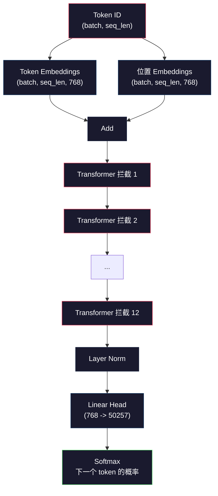
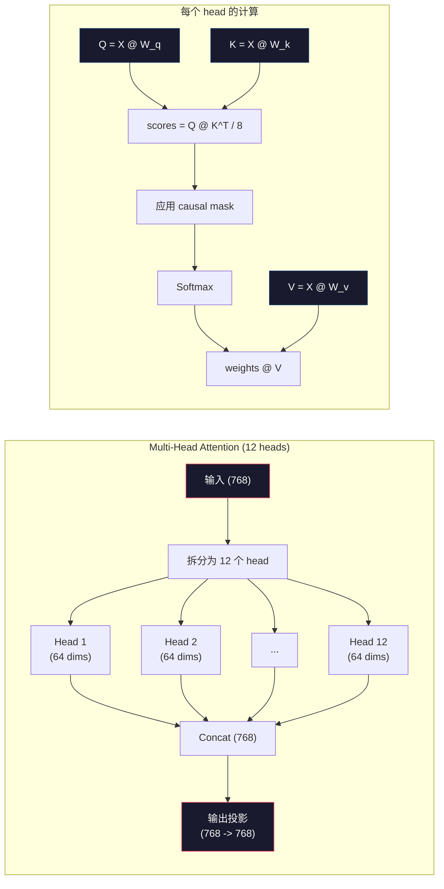
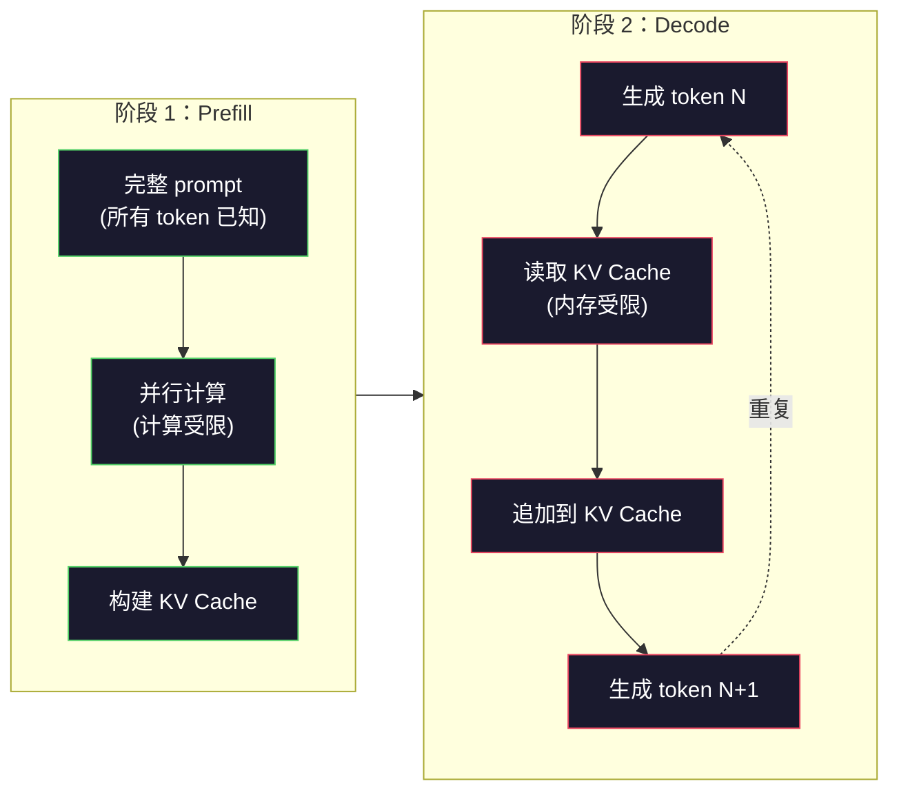

# 从零预训练一个 Mini GPT（124M 参数）

> 译注：本文译自同目录 [`en.md`](./en.md)。术语遵循仓根 [TRANSLATION_GUIDE.md](../../../../TRANSLATION_GUIDE.md)。

> GPT-2 Small 有 1.24 亿参数。12 个 transformer 层、12 个 attention head、768 维 embedding。在单张 GPU 上几个小时就能从零训出来。但绝大多数人从来不做这件事。他们直接用预训练好的 checkpoint。可如果你没自己训过一次，你其实并不真正理解你正在其上构建产品的那个模型内部到底在发生什么。

**Type:** Build
**Languages:** Python (with numpy)
**Prerequisites:** Phase 10, Lessons 01-03 (Tokenizers, Building a Tokenizer, Data Pipelines)
**Time:** ~120 minutes

## 学习目标（Learning Objectives）

- 从零实现完整的 GPT-2 架构（124M 参数）：token embedding、位置 embedding、transformer block、以及语言模型 head
- 用 next-token 预测和交叉熵 loss 在文本语料上训练一个 GPT 模型
- 实现 autoregressive 文本生成，包括 temperature 采样和 top-k / top-p 过滤
- 监控训练 loss 曲线，并验证模型确实学到了连贯的语言模式

## 问题（The Problem）

你知道 transformer 是什么。你看过那些示意图。你能背出 "attention is all you need"，还能在白板上画出标着 "Multi-Head Attention" 的方框。

这些都不代表你理解模型生成文本时究竟发生了什么。

GPT-2 Small 有 124,438,272 个参数（带 weight tying）。每一个都是通过一遍遍训练循环设定下来的：前向传播、计算 loss、反向传播、更新权重。12 个 transformer block。每个 block 12 个 attention head。768 维的 embedding 空间。50,257 个 token 的词表。每生成一个 token，全部 1.24 亿参数都参与一条矩阵乘法链：输入是 token ID 序列，输出是下一个 token 上的概率分布。

如果你从来没自己搭过一遍，那它对你就是个黑盒。你能调 API。你能微调。但当出问题时——模型 hallucinate（幻觉）了、它开始重复自己、它拒绝按指令执行——你脑子里没有任何关于 *为什么* 的心智模型。

这一课会从零搭出 GPT-2 Small。不是用 PyTorch，是用 numpy。每一个矩阵乘法都看得见。每一个 gradient 都由你自己的代码算出来。你会清清楚楚看到 1.24 亿个数字是如何合谋去预测下一个词的。

## 概念（The Concept）

### GPT 架构（The GPT Architecture）

GPT 是一个 autoregressive 语言模型。"Autoregressive" 的意思是它一次生成一个 token，每个 token 都基于此前所有 token。架构是一摞 transformer decoder block。

下面是从 token ID 到下一个 token 概率的完整计算图：

1. token ID 进来。形状：(batch_size, seq_len)。
2. token embedding 查表。每个 ID 映射到一个 768 维向量。形状：(batch_size, seq_len, 768)。
3. 位置 embedding 查表。每个位置（0, 1, 2, ...）映射到一个 768 维向量。同样形状。
4. token embedding 和位置 embedding 相加。
5. 经过 12 个 transformer block。
6. 最后一层 layer norm。
7. 线性投影到词表大小。形状：(batch_size, seq_len, vocab_size)。
8. softmax 得到概率。

这就是整个模型。没有卷积。没有循环。只有 embedding、attention、feedforward 网络和 layer norm，叠 12 次。



### Transformer Block（The Transformer Block）

12 个 block 都遵循同一个模板。pre-norm 架构（GPT-2 用 pre-norm，不是原始 transformer 那种 post-norm）：

1. LayerNorm
2. Multi-head self-attention
3. 残差连接（把输入加回来）
4. LayerNorm
5. Feed-forward 网络（MLP）
6. 残差连接（把输入加回来）

残差连接至关重要。没有它，反向传播到 block 1 时 gradient 早就消失了。有了它，gradient 可以通过 "skip" 路径从 loss 直接流到任何一层。这就是为什么你能叠 12 层、32 层，甚至 96 层 block（传闻 GPT-4 用了 120 层）。

### Attention：核心机制（Attention: The Core Mechanism）

self-attention 让每个 token 都能去看所有它之前的 token，并决定对每一个分配多少注意力。下面是数学。

对每一个 token 位置，从输入计算出三个向量：
- **Query (Q)**: "我在找什么？"
- **Key (K)**: "我里面有什么？"
- **Value (V)**: "我携带了什么信息？"

```
Q = input @ W_q    (768 -> 768)
K = input @ W_k    (768 -> 768)
V = input @ W_v    (768 -> 768)

attention_scores = Q @ K^T / sqrt(d_k)
attention_scores = mask(attention_scores)   # causal mask: -inf for future positions
attention_weights = softmax(attention_scores)
output = attention_weights @ V
```

causal mask（因果掩码）正是让 GPT 成为 autoregressive 的关键。位置 5 可以 attend 到位置 0-5，但看不到 6、7、8 等。这防止模型在训练时通过偷看未来 token 来 "作弊"。

**Multi-head attention（多头 attention）** 把 768 维空间拆成 12 个 head，每个 64 维。每个 head 学到不同的 attention 模式。一个 head 可能跟踪句法关系（主谓一致）。另一个可能跟踪语义相似度（同义词）。还有一个可能跟踪位置邻近度（附近的词）。12 个 head 的输出拼接起来，再投影回 768 维。



除以 sqrt(d_k)——sqrt(64) = 8——是 scaling。如果不除，高维向量的点积会变得很大，把 softmax 推到 gradient 几乎为零的区域。这是原始 "Attention Is All You Need" 论文里的关键洞见之一。

### KV Cache：为什么推理可以很快（KV Cache: Why Inference Is Fast）

训练时你一次性处理整段序列。推理时你一次只生成一个 token。如果不优化，生成第 N 个 token 就要重新计算前 N-1 个 token 的 attention。每生成一个 token 就是 O(N^2)，长度 N 的序列总共是 O(N^3)。

KV cache 解决了这个问题。每个 token 算完 K 和 V 之后就把它们存起来。生成第 N+1 个 token 时，你只需要为新 token 计算 Q，并从所有此前 token 中查出缓存的 K 和 V。这把 K、V 计算的单 token 成本从 O(N) 降到 O(1)。attention score 计算还是 O(N)，因为你要 attend 到所有此前位置，但你避免了对输入做冗余的矩阵乘法。

对于 12 层 12 head 的 GPT-2，KV cache 每个 token 存 2（K + V）x 12 层 x 12 head x 64 维 = 18,432 个值。1024 token 的序列在 FP32 下大约 75MB。对于 128 层的 Llama 3 405B，单条序列的 KV cache 可以超过 10GB。这就是长上下文 context window 推理是 memory-bound（内存受限）的原因。

### Prefill 与 Decode：推理的两个阶段（Prefill vs Decode: Two Phases of Inference）

当你向 LLM 发一个 prompt 时，推理会经历两个截然不同的阶段。

**Prefill** 把整个 prompt 并行处理。所有 token 都已知，所以模型可以同时算出所有位置的 attention。这个阶段是 compute-bound（计算受限）——GPU 以满吞吐做矩阵乘法。1000 个 token 的 prompt 在 A100 上 prefill 大概要 20-50ms。

**Decode** 一次生成一个 token。每个新 token 都依赖此前所有 token。这个阶段是 memory-bound（内存受限）——瓶颈是从 GPU 内存里读模型权重和 KV cache，而不是矩阵运算本身。GPU 的计算核心大部分时间都在等内存读取。对 GPT-2 来说，无论 matmul 需要多少 FLOPs，每一步 decode 耗时差不多——因为内存带宽才是约束。

这个区别对生产系统很重要。Prefill 吞吐随 GPU 算力扩展（FLOPS 越多，prefill 越快）。Decode 吞吐随内存带宽扩展（内存越快，decode 越快）。这就是为什么 NVIDIA 的 H100 相对 A100 重点提升了内存带宽——它直接加快 token 生成速度。



### 训练循环（The Training Loop）

训练 LLM 就是 next-token 预测。给定 token [0, 1, 2, ..., N-1]，预测 token [1, 2, 3, ..., N]。loss 函数是模型预测的概率分布与真实下一个 token 之间的交叉熵。

一次训练步：

1. **前向传播**：把 batch 跑完所有 12 个 block。得到每个位置的 logits（softmax 之前的分数）。
2. **计算 loss**：logits 与 target token（输入向后挪一位）之间的交叉熵。
3. **反向传播**：用反向传播计算全部 124M 参数的 gradient。
4. **Optimizer step**：更新权重。GPT-2 用 Adam，配 learning rate warmup 和 cosine 衰减。

learning rate 调度的重要性比你想的还要大。GPT-2 在前 2,000 步从 0 warmup 到峰值 learning rate，然后按余弦曲线衰减。一上来就高 learning rate 会让模型发散。一直保持高 learning rate 会让训练后期来回震荡。"先 warmup 再衰减" 的模式在每一个主流 LLM 上都被采用。

### GPT-2 Small：数字（GPT-2 Small: The Numbers）

| 组件 | 形状 | 参数量 |
|-----------|-------|------------|
| Token embeddings | (50257, 768) | 38,597,376 |
| Position embeddings | (1024, 768) | 786,432 |
| 单 block attention（W_q, W_k, W_v, W_out） | 4 x (768, 768) | 2,359,296 |
| 单 block FFN（up + down） | (768, 3072) + (3072, 768) | 4,718,592 |
| 单 block LayerNorm（2 个） | 2 x 768 x 2 | 3,072 |
| 最终 LayerNorm | 768 x 2 | 1,536 |
| **单 block 合计** | | **7,080,960** |
| **总计（12 个 block）** | | **85,054,464 + 39,383,808 = 124,438,272** |

输出投影（logits head）和 token embedding 矩阵共享权重。这叫 weight tying（权重绑定）——可以省下 38M 参数，并且效果更好，因为它强迫模型用同一个表示空间来理解输入和预测输出。

## 动手实现（Build It）

### Step 1：Embedding 层（Embedding Layer）

token embedding 把 50,257 个可能的 token 各映射到一个 768 维向量。位置 embedding 加入每个 token 在序列中位置的信息。两者相加。

```python
import numpy as np

class Embedding:
    def __init__(self, vocab_size, embed_dim, max_seq_len):
        self.token_embed = np.random.randn(vocab_size, embed_dim) * 0.02
        self.pos_embed = np.random.randn(max_seq_len, embed_dim) * 0.02

    def forward(self, token_ids):
        seq_len = token_ids.shape[-1]
        tok_emb = self.token_embed[token_ids]
        pos_emb = self.pos_embed[:seq_len]
        return tok_emb + pos_emb
```

初始化用 0.02 的标准差，这是 GPT-2 论文里的设定。太大，初期的前向传播会产生极端值，让训练不稳；太小，初始输出对所有输入几乎一样，让早期 gradient 信号毫无作用。

### Step 2：带因果掩码的 self-attention（Self-Attention with Causal Mask）

先来单头 attention。causal mask 在 softmax 之前把未来位置设成负无穷，确保每个位置只能 attend 到自己和此前位置。

```python
def attention(Q, K, V, mask=None):
    d_k = Q.shape[-1]
    scores = Q @ K.transpose(0, -1, -2 if Q.ndim == 4 else 1) / np.sqrt(d_k)
    if mask is not None:
        scores = scores + mask
    weights = np.exp(scores - scores.max(axis=-1, keepdims=True))
    weights = weights / weights.sum(axis=-1, keepdims=True)
    return weights @ V
```

softmax 实现里在取指数之前先减去了最大值。否则 exp(大数) 会上溢成无穷大。这是个数值稳定性的小技巧，对结果没有影响——因为对任意常数 c，softmax(x - c) = softmax(x)。

### Step 3：Multi-head attention（Multi-Head Attention）

把 768 维输入拆成 12 个 head，每个 64 维。每个 head 各自算 attention。把结果拼起来再投影回 768 维。

```python
class MultiHeadAttention:
    def __init__(self, embed_dim, num_heads):
        self.num_heads = num_heads
        self.head_dim = embed_dim // num_heads
        self.W_q = np.random.randn(embed_dim, embed_dim) * 0.02
        self.W_k = np.random.randn(embed_dim, embed_dim) * 0.02
        self.W_v = np.random.randn(embed_dim, embed_dim) * 0.02
        self.W_out = np.random.randn(embed_dim, embed_dim) * 0.02

    def forward(self, x, mask=None):
        batch, seq_len, d = x.shape
        Q = (x @ self.W_q).reshape(batch, seq_len, self.num_heads, self.head_dim).transpose(0, 2, 1, 3)
        K = (x @ self.W_k).reshape(batch, seq_len, self.num_heads, self.head_dim).transpose(0, 2, 1, 3)
        V = (x @ self.W_v).reshape(batch, seq_len, self.num_heads, self.head_dim).transpose(0, 2, 1, 3)

        scores = Q @ K.transpose(0, 1, 3, 2) / np.sqrt(self.head_dim)
        if mask is not None:
            scores = scores + mask
        weights = np.exp(scores - scores.max(axis=-1, keepdims=True))
        weights = weights / weights.sum(axis=-1, keepdims=True)
        attn_out = weights @ V

        attn_out = attn_out.transpose(0, 2, 1, 3).reshape(batch, seq_len, d)
        return attn_out @ self.W_out
```

reshape-transpose-reshape 这一连串变形是 multi-head attention 里最让人头大的部分。过程是这样的：(batch, seq_len, 768) 的张量先变成 (batch, seq_len, 12, 64)，再变 (batch, 12, seq_len, 64)。现在 12 个 head 各自有了一个 (seq_len, 64) 的矩阵可以跑 attention。算完之后把过程倒过来：(batch, 12, seq_len, 64) → (batch, seq_len, 12, 64) → (batch, seq_len, 768)。

### Step 4：Transformer block（Transformer Block）

一个完整的 transformer block：LayerNorm，带残差的 multi-head attention，LayerNorm，带残差的 feedforward。

```python
class LayerNorm:
    def __init__(self, dim, eps=1e-5):
        self.gamma = np.ones(dim)
        self.beta = np.zeros(dim)
        self.eps = eps

    def forward(self, x):
        mean = x.mean(axis=-1, keepdims=True)
        var = x.var(axis=-1, keepdims=True)
        return self.gamma * (x - mean) / np.sqrt(var + self.eps) + self.beta


class FeedForward:
    def __init__(self, embed_dim, ff_dim):
        self.W1 = np.random.randn(embed_dim, ff_dim) * 0.02
        self.b1 = np.zeros(ff_dim)
        self.W2 = np.random.randn(ff_dim, embed_dim) * 0.02
        self.b2 = np.zeros(embed_dim)

    def forward(self, x):
        h = x @ self.W1 + self.b1
        h = np.maximum(0, h)  # GELU approximation: ReLU for simplicity
        return h @ self.W2 + self.b2


class TransformerBlock:
    def __init__(self, embed_dim, num_heads, ff_dim):
        self.ln1 = LayerNorm(embed_dim)
        self.attn = MultiHeadAttention(embed_dim, num_heads)
        self.ln2 = LayerNorm(embed_dim)
        self.ffn = FeedForward(embed_dim, ff_dim)

    def forward(self, x, mask=None):
        x = x + self.attn.forward(self.ln1.forward(x), mask)
        x = x + self.ffn.forward(self.ln2.forward(x))
        return x
```

feedforward 网络把 768 维输入扩展到 3,072 维（4 倍），经过一个非线性，再投影回 768 维。这种 "扩张-收缩" 模式让模型在每个位置都有更 "宽" 的内部表示空间可用。GPT-2 用的是 GELU 激活，这里为了简单用 ReLU——对于理解架构，差别可以忽略。

### Step 5：完整 GPT 模型（Full GPT Model）

叠 12 个 transformer block。前面接 embedding 层，后面接输出投影。

```python
class MiniGPT:
    def __init__(self, vocab_size=50257, embed_dim=768, num_heads=12,
                 num_layers=12, max_seq_len=1024, ff_dim=3072):
        self.embedding = Embedding(vocab_size, embed_dim, max_seq_len)
        self.blocks = [
            TransformerBlock(embed_dim, num_heads, ff_dim)
            for _ in range(num_layers)
        ]
        self.ln_f = LayerNorm(embed_dim)
        self.vocab_size = vocab_size
        self.embed_dim = embed_dim

    def forward(self, token_ids):
        seq_len = token_ids.shape[-1]
        mask = np.triu(np.full((seq_len, seq_len), -1e9), k=1)

        x = self.embedding.forward(token_ids)
        for block in self.blocks:
            x = block.forward(x, mask)
        x = self.ln_f.forward(x)

        logits = x @ self.embedding.token_embed.T
        return logits

    def count_parameters(self):
        total = 0
        total += self.embedding.token_embed.size
        total += self.embedding.pos_embed.size
        for block in self.blocks:
            total += block.attn.W_q.size + block.attn.W_k.size
            total += block.attn.W_v.size + block.attn.W_out.size
            total += block.ffn.W1.size + block.ffn.b1.size
            total += block.ffn.W2.size + block.ffn.b2.size
            total += block.ln1.gamma.size + block.ln1.beta.size
            total += block.ln2.gamma.size + block.ln2.beta.size
        total += self.ln_f.gamma.size + self.ln_f.beta.size
        return total
```

注意 weight tying：`logits = x @ self.embedding.token_embed.T`。输出投影复用 token embedding 矩阵（转置）。这不仅仅是省参数的小技巧。它意味着模型用同一个向量空间去理解 token（embedding）和预测 token（输出）。

### Step 6：训练循环（Training Loop）

要真做 124M 参数的训练，你得有 GPU 和 PyTorch。下面这个训练循环只是用纯 numpy 在小模型上演示机制。我们用一个很小的模型（4 层、4 head、128 维）让它能跑起来。

```python
def cross_entropy_loss(logits, targets):
    batch, seq_len, vocab_size = logits.shape
    logits_flat = logits.reshape(-1, vocab_size)
    targets_flat = targets.reshape(-1)

    max_logits = logits_flat.max(axis=-1, keepdims=True)
    log_softmax = logits_flat - max_logits - np.log(
        np.exp(logits_flat - max_logits).sum(axis=-1, keepdims=True)
    )

    loss = -log_softmax[np.arange(len(targets_flat)), targets_flat].mean()
    return loss


def train_mini_gpt(text, vocab_size=256, embed_dim=128, num_heads=4,
                   num_layers=4, seq_len=64, num_steps=200, lr=3e-4):
    tokens = np.array(list(text.encode("utf-8")[:2048]))
    model = MiniGPT(
        vocab_size=vocab_size, embed_dim=embed_dim, num_heads=num_heads,
        num_layers=num_layers, max_seq_len=seq_len, ff_dim=embed_dim * 4
    )

    print(f"Model parameters: {model.count_parameters():,}")
    print(f"Training tokens: {len(tokens):,}")
    print(f"Config: {num_layers} layers, {num_heads} heads, {embed_dim} dims")
    print()

    for step in range(num_steps):
        start_idx = np.random.randint(0, max(1, len(tokens) - seq_len - 1))
        batch_tokens = tokens[start_idx:start_idx + seq_len + 1]

        input_ids = batch_tokens[:-1].reshape(1, -1)
        target_ids = batch_tokens[1:].reshape(1, -1)

        logits = model.forward(input_ids)
        loss = cross_entropy_loss(logits, target_ids)

        if step % 20 == 0:
            print(f"Step {step:4d} | Loss: {loss:.4f}")

    return model
```

loss 起始值大约在 ln(vocab_size)——对于 256 个 token 的字节级词表，是 ln(256) = 5.55。一个随机模型给每个 token 都赋予相等的概率。随着训练推进，loss 下降，因为模型学到了常见模式："t" 后面跟 "h"、句号后面跟空格，等等。

生产环境里你会用 Adam optimizer，加上 gradient accumulation、learning rate warmup、gradient clipping。"前向 → loss → 反向 → 更新" 的循环本身一模一样，只是 optimizer 更精巧。

### Step 7：文本生成（Text Generation）

生成是用训练好的模型一次预测一个 token。每次预测从输出分布里采样（或贪心地取 argmax）。

```python
def generate(model, prompt_tokens, max_new_tokens=100, temperature=0.8):
    tokens = list(prompt_tokens)
    seq_len = model.embedding.pos_embed.shape[0]

    for _ in range(max_new_tokens):
        context = np.array(tokens[-seq_len:]).reshape(1, -1)
        logits = model.forward(context)
        next_logits = logits[0, -1, :]

        next_logits = next_logits / temperature
        probs = np.exp(next_logits - next_logits.max())
        probs = probs / probs.sum()

        next_token = np.random.choice(len(probs), p=probs)
        tokens.append(next_token)

    return tokens
```

temperature 控制随机性。temperature 1.0 用原始分布。temperature 0.5 让分布变尖（更确定——模型更频繁地选它的最高分选项）。temperature 1.5 让分布变平（更随机——低概率 token 也获得更大机会）。temperature 0.0 是贪心解码（始终选最高概率的 token）。

`tokens[-seq_len:]` 这个窗口是必须的，因为模型有最大上下文长度（GPT-2 是 1024）。一旦超过，就必须把最早的 token 丢掉。这就是大家口中的 "context window"。

## 用起来（Use It）

### 完整训练 + 生成 demo（Full Training and Generation Demo）

```python
corpus = """The transformer architecture has revolutionized natural language processing.
Attention mechanisms allow the model to focus on relevant parts of the input.
Self-attention computes relationships between all pairs of positions in a sequence.
Multi-head attention splits the representation into multiple subspaces.
Each attention head can learn different types of relationships.
The feedforward network provides nonlinear transformations at each position.
Residual connections enable gradient flow through deep networks.
Layer normalization stabilizes training by normalizing activations.
Position embeddings give the model information about token ordering.
The causal mask ensures autoregressive generation during training.
Pre-training on large text corpora teaches the model general language understanding.
Fine-tuning adapts the pre-trained model to specific downstream tasks."""

model = train_mini_gpt(corpus, num_steps=200)

prompt = list("The transformer".encode("utf-8"))
output_tokens = generate(model, prompt, max_new_tokens=100, temperature=0.8)
generated_text = bytes(output_tokens).decode("utf-8", errors="replace")
print(f"\nGenerated: {generated_text}")
```

在这么小的语料 + 这么小的模型上，生成出来的文本顶多半连贯。它会从训练文本里学到一些字节级的模式，但没法像有 40GB 训练数据 + 完整 124M 参数架构的 GPT-2 那样泛化。重点不是输出质量，重点是你能把每一步都追踪下来：embedding 查表、attention 计算、feedforward 变换、logit 投影、softmax、采样。每个操作都看得见。

## 上线部署（Ship It）

这一课产出 `outputs/prompt-gpt-architecture-analyzer.md`——一段用来分析任意 GPT 风格模型架构选择的 prompt。把模型卡或技术报告喂给它，它会拆解出参数分配、attention 设计、以及 scaling 决策。

## 练习（Exercises）

1. 把模型改成 24 层 + 16 head（取代原本的 12/12）。数一下参数。深度翻倍 vs 宽度翻倍（embedding 维度），二者效果如何对比？

2. 实现 GELU 激活函数（GELU(x) = x * 0.5 * (1 + erf(x / sqrt(2)))），把 feedforward 里的 ReLU 替换掉。两种激活分别训练 500 步，比较最终 loss。

3. 给生成函数加上 KV cache。第一次前向传播之后，把每一层的 K 和 V 张量存起来，后续 token 生成时直接复用。测速：分别开关缓存生成 200 个 token，对比 wall-clock 时间。

4. 实现 top-k 采样（只考虑概率最高的 k 个 token）和 top-p 采样（nucleus sampling：考虑累积概率超过 p 的最小 token 集合）。在 temperature 0.8 下比较 top-k=50 vs top-p=0.95 的输出质量。

5. 写一个训练 loss 曲线绘图器。训练 1000 步，画出 loss vs step。识别三个阶段：快速初始下降（学常见字节）、较慢的中段（学字节模式）、平台期（在小语料上过拟合）。这条曲线的形状无论你训的是 128 维小模型还是 GPT-4 都一样。

## 关键术语（Key Terms）

| 术语 | 大家嘴上说的 | 它实际指什么 |
|------|----------------|----------------------|
| Autoregressive | "它一次生成一个词" | 每个输出 token 都基于此前所有 token——模型预测 P(token_n \| token_0, ..., token_{n-1}) |
| Causal mask | "它看不见未来" | 一个上三角的负无穷矩阵，训练时阻止 attention 看到未来位置 |
| Multi-head attention | "多种 attention 模式" | 把 Q、K、V 拆成多个并行的 head（比如 GPT-2 的 12 个 64 维 head），让每个 head 学习不同类型的关系 |
| KV cache | "为速度做缓存" | 把此前 token 算出的 Key 和 Value 张量存起来，在 autoregressive 生成时避免重复计算 |
| Prefill | "处理 prompt" | 推理的第一阶段，整个 prompt 的所有 token 并行处理——在 GPU FLOPS 上是 compute-bound |
| Decode | "生成 token" | 推理的第二阶段，token 一次生成一个——在 GPU 带宽上是 memory-bound |
| Weight tying | "共享 embedding" | 输入 token embedding 和输出投影 head 用同一个矩阵——在 GPT-2 上省下 38M 参数 |
| Residual connection | "跳跃连接" | 把输入直接加到子层输出上（x + sublayer(x)）——让 gradient 在深层网络中流动 |
| Layer normalization | "归一化激活" | 在特征维度上归一化到均值 0、方差 1，并带可学习的 scale 和 bias 参数 |
| Cross-entropy loss | "预测错得多离谱" | -log(分配给正确下一个 token 的概率)，在所有位置上取平均——LLM 训练的标准目标函数 |

## 延伸阅读（Further Reading）

- [Radford et al., 2019 -- "Language Models are Unsupervised Multitask Learners" (GPT-2)](https://cdn.openai.com/better-language-models/language_models_are_unsupervised_multitask_learners.pdf) —— 推出 124M 到 1.5B 参数家族的 GPT-2 论文
- [Vaswani et al., 2017 -- "Attention Is All You Need"](https://arxiv.org/abs/1706.03762) —— 原始 transformer 论文，提出 scaled dot-product attention 和 multi-head attention
- [Llama 3 Technical Report](https://arxiv.org/abs/2407.21783) —— Meta 如何用 16K 块 GPU 把 GPT 架构 scale 到 405B 参数
- [Pope et al., 2022 -- "Efficiently Scaling Transformer Inference"](https://arxiv.org/abs/2211.05102) —— 把 prefill vs decode 与 KV cache 分析正式形式化的论文
