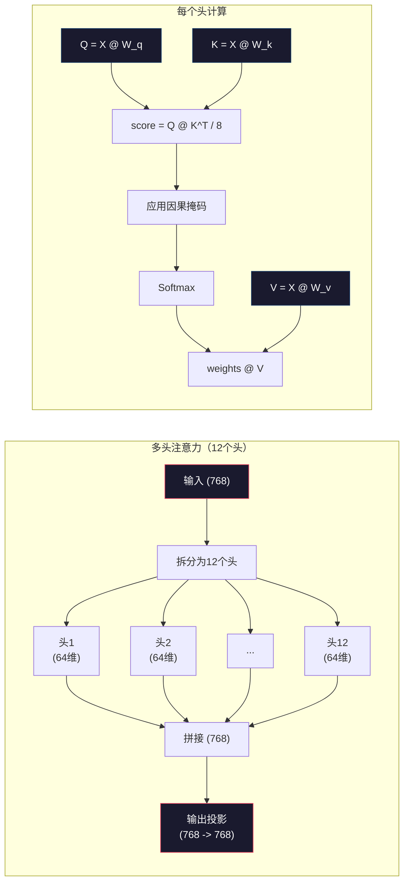
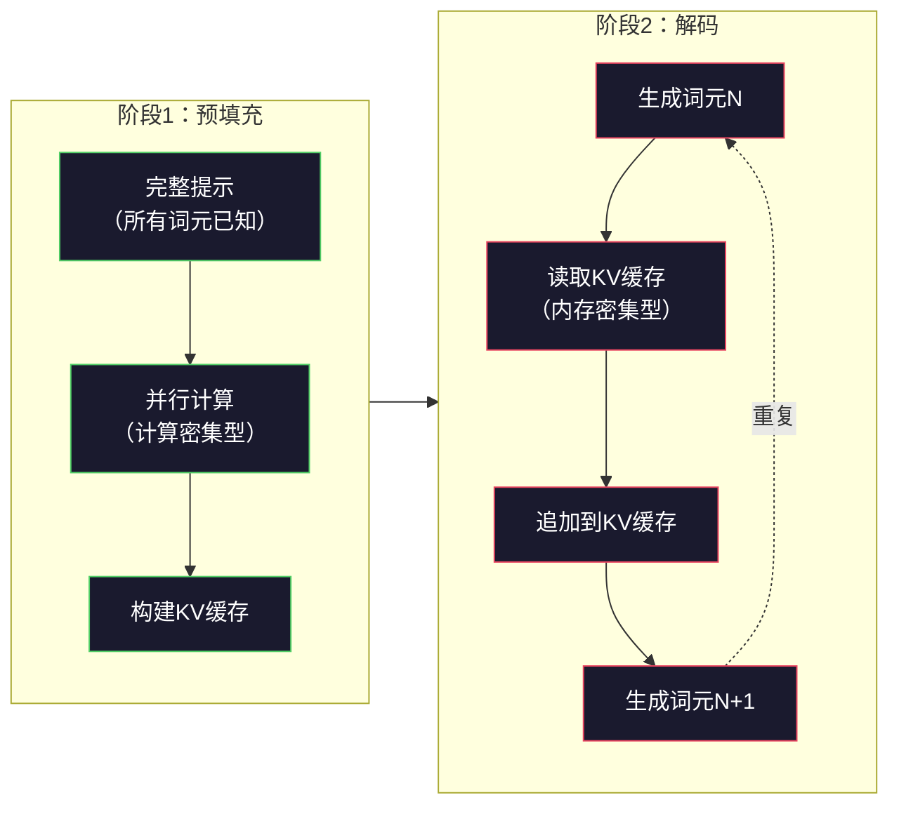

# 预训练迷你GPT（124M参数）

> GPT-2 Small 拥有1.24亿个参数。它包含12个Transformer层、12个注意力头，以及768维的嵌入。你可以在单个GPU上用几小时从头训练它。但大多数人从未这样做过——他们直接使用预训练好的检查点。然而，如果你不亲自训练一个，你就无法真正理解你所构建产品背后的模型内部发生了什么。

**类型：** 动手实践  
**语言：** Python（使用NumPy）  
**前置要求：** 阶段10，课程01-03（分词器、构建分词器、数据流水线）  
**时长：** 约120分钟

## 学习目标

- 从头实现完整的GPT-2架构（124M参数）：词元嵌入、位置嵌入、Transformer块和语言模型头部
- 使用下一个词元预测和交叉熵损失，在文本语料上训练GPT模型
- 实现带有温度采样和top-k/top-p过滤的自回归文本生成
- 监控训练损失曲线，并验证模型是否学到了连贯的语言模式

## 问题

你知道什么是Transformer。你看过示意图。你能背诵"注意力就是一切"，并在白板上画出标有"多头注意力"的方框。

但这并不意味着你真正理解模型生成文本时发生了什么。

GPT-2 Small（使用权值绑定）共有124,438,272个参数。每一个参数都是通过运行训练循环来设定的：前向传播、计算损失、反向传播、更新权重。12个Transformer块，每个块12个注意力头，768维的嵌入空间，50,257个词元的词汇表。每当模型生成一个词元时，所有1.24亿个参数都参与进一个矩阵乘法链中，该链条接收一系列词元ID，并在下一个词元上产生一个概率分布。

如果你从未亲手构建过这个系统，你就是在使用一个黑盒。你可以调用API，可以微调。但当某些问题出现时——比如模型产生幻觉、重复输出、拒绝遵循指令——你心中没有一个关于*为什么*的心智模型。

本课程从头开始构建GPT-2 Small。不是用PyTorch，而是用NumPy。每一个矩阵乘法都是可见的。每一个梯度都由你的代码计算。你将亲眼看到1.24亿个数字如何串通一气来预测下一个词。

## 概念

### GPT架构

GPT是一个自回归语言模型。"自回归"意味着它一次生成一个词元，每个词元都依赖于之前的所有词元。其架构是一堆Transformer解码器块。

以下是从词元ID到下一个词元概率的完整计算图：

1. 输入词元ID。形状：(batch_size, seq_len)。
2. 词元嵌入查找。每个ID映射到一个768维向量。形状：(batch_size, seq_len, 768)。
3. 位置嵌入查找。每个位置（0, 1, 2, ...）映射到一个768维向量。形状相同。
4. 将词元嵌入和位置嵌入相加。
5. 通过12个Transformer块。
6. 最终层归一化。
7. 线性投影到词汇表大小。形状：(batch_size, seq_len, vocab_size)。
8. Softmax得到概率。

这就是整个模型。没有卷积，没有循环。只有嵌入、注意力、前馈网络和层归一化，堆叠了12次。


### Transformer块

12个块中的每一个都遵循相同的模式。这是前归一化（Pre-norm）架构（GPT-2使用前归一化，而非原始Transformer的后归一化）：

1. 层归一化（LayerNorm）
2. 多头自注意力（Multi-Head Self-Attention）
3. 残差连接（加回输入）
4. 层归一化
5. 前馈网络（MLP）
6. 残差连接（加回输入）

残差连接至关重要。没有它们，在反向传播时梯度到达块1之前就会消失。有了它们，梯度可以通过"跳跃"路径直接从损失流向任何层。这就是为什么你可以堆叠12、32甚至96个块（GPT-4据称使用了120个）。

### 注意力：核心机制

自注意力让每个词元查看所有之前的词元，并决定对每个词元关注多少。以下是数学原理。

对于每个词元位置，从输入计算三个向量：
- **查询（Query，Q）**："我在找什么？"
- **键（Key，K）**："我包含什么？"
- **值（Value，V）**："我携带什么信息？"

```
Q = input @ W_q    (768 -> 768)
K = input @ W_k    (768 -> 768)
V = input @ W_v    (768 -> 768)

attention_scores = Q @ K^T / sqrt(d_k)
attention_scores = mask(attention_scores)   # 因果掩码：对未来位置设置为 -inf
attention_weights = softmax(attention_scores)
output = attention_weights @ V
```

因果掩码（causal mask）使GPT成为自回归模型。位置5可以关注位置0-5，但不能关注6、7、8等。这防止了模型在训练时通过"偷看"未来词元来作弊。

**多头注意力**将768维空间拆分为12个64维的头。每个头学习不同的注意力模式。一个头可能跟踪句法关系（主谓一致）。另一个可能跟踪语义相似性（同义词）。另一个可能跟踪位置邻近（附近的词）。所有12个头的输出被拼接起来，然后投影回768维。



除以 sqrt(d_k) —— sqrt(64) = 8 —— 是为了缩放。如果不这样做，对于高维向量，点积会变得很大，将 softmax 推入梯度几乎为零的区域。这是原始论文《Attention Is All You Need》中的关键见解之一。

### KV缓存：推理为何很快

在训练期间，你一次性处理整个序列。在推理期间，你一次生成一个词元。如果不优化，生成第N个词元需要为所有之前的N-1个词元重新计算注意力。这对于每个生成的词元来说是O(N^2)，对于长度为N的序列来说总共是O(N^3)。

KV缓存解决了这个问题。在计算每个词元的K和V之后，将其存储起来。当生成第N+1个词元时，你只需要为新词元计算Q，并查找所有之前词元的缓存K和V。这将每个词元的K和V计算成本从O(N)降低到O(1)。注意力分数的计算仍然是O(N)，因为你需要关注所有之前的位置，但你避免了在输入上进行冗余的矩阵乘法。

对于具有12层和12个头的GPT-2，KV缓存存储2（K+V）×12层×12头×64维 = 每个词元18,432个值。对于1024个词元的序列，这大约是75MB（FP32）。对于具有128层的Llama 3 405B，单个序列的KV缓存可以超过10GB。这就是长上下文推理受限于内存的原因。

### 预填充 vs 解码：推理的两个阶段

当你向LLM发送一个提示时，推理发生在两个不同的阶段。

**预填充（Prefill）**并行处理你的整个提示。所有的词元都是已知的，所以模型可以同时计算所有位置的注意力。这个阶段是计算密集型的——GPU以全吞吐量进行矩阵乘法。对于A100上的1000词元提示，预填充大约需要20-50毫秒。

**解码（Decode）**一次生成一个词元。每个新词元依赖于所有之前的词元。这个阶段是内存密集型的——瓶颈是从GPU内存读取模型权重和KV缓存，而不是矩阵运算本身。GPU的计算核心大部分时间空闲，等待内存读取。对于GPT-2，无论矩阵乘法需要多少FLOPs，每个解码步骤所需的时间大致相同，因为内存带宽是约束条件。

这种区别对于生产系统至关重要。预填充吞吐量随GPU计算能力扩展（更多FLOPS = 更快的预填充）。解码吞吐量随内存带宽扩展（更快的内存 = 更快的解码）。这就是为什么NVIDIA的H100专注于比A100提高内存带宽——它直接加快了词元生成速度。



### 训练循环

训练LLM就是下一个词元预测。给定词元[0, 1, 2, ..., N-1]，预测词元[1, 2, 3, ..., N]。损失函数是模型预测的概率分布与实际下一个词元之间的交叉熵。

一个训练步骤：

1. **前向传播**：将批次通过所有12个块。得到每个位置的logits（softmax之前的分数）。
2. **计算损失**：logits与目标词元（输入向右偏移一位）之间的交叉熵。
3. **反向传播**：使用反向传播计算所有1.24亿个参数的梯度。
4. **优化器步骤**：更新权重。GPT-2使用Adam，配合学习率预热和余弦衰减。

学习率调度的重要性可能超出你的预期。GPT-2在前2,000步从0预热到峰值学习率，然后按照余弦曲线衰减。以高学习率开始会导致模型发散。保持恒定较高的学习率则会在训练后期引起振荡。预热然后衰减的模式被每一个主要的LLM所采用。

### GPT-2 Small：数值

| 组件 | 形状 | 参数量 |
|-----------|-------|------------|
| 词元嵌入 | (50257, 768) | 38,597,376 |
| 位置嵌入 | (1024, 768) | 786,432 |
| 每块注意力 (W_q, W_k, W_v, W_out) | 4 x (768, 768) | 2,359,296 |
| 每块FFN (升维 + 降维) | (768, 3072) + (3072, 768) | 4,718,592 |
| 每块层归一化 (2x) | 2 x 768 x 2 | 3,072 |
| 最终层归一化 | 768 x 2 | 1,536 |
| **每块总计** | | **7,080,960** |
| **总计 (12块)** | | **85,054,464 + 39,383,808 = 124,438,272** |

输出投影（logits头）与词元嵌入矩阵共享权重。这称为权值绑定（weight tying）——它减少了约3,800万参数，并提升了性能，因为它迫使模型对输入和输出使用相同的表示空间。

## 动手构建

### 步骤1：嵌入层

词元嵌入将50,257个可能的词元中的每一个映射到768维向量。位置嵌入添加关于每个词元在序列中位置的信息。两者相加。

```python
import numpy as np

class Embedding:
    def __init__(self, vocab_size, embed_dim, max_seq_len):
        self.token_embed = np.random.randn(vocab_size, embed_dim) * 0.02
        self.pos_embed = np.random.randn(max_seq_len, embed_dim) * 0.02

    def forward(self, token_ids):
        seq_len = token_ids.shape[-1]
        tok_emb = self.token_embed[token_ids]
        pos_emb = self.pos_embed[:seq_len]
        return tok_emb + pos_emb
```

初始化标准差0.02来自GPT-2论文。如果太大，初始前向传播会产生极端值，破坏训练的稳定性；如果太小，初始输出对于所有输入几乎相同，导致早期梯度信号无效。

### 步骤2：带因果掩码的自注意力

先实现单头注意力。因果掩码在softmax之前将未来位置设置为负无穷，确保每个位置只能关注自身和之前的位置。

```python
def attention(Q, K, V, mask=None):
    d_k = Q.shape[-1]
    scores = Q @ K.transpose(0, -1, -2 if Q.ndim == 4 else 1) / np.sqrt(d_k)
    if mask is not None:
        scores = scores + mask
    weights = np.exp(scores - scores.max(axis=-1, keepdims=True))
    weights = weights / weights.sum(axis=-1, keepdims=True)
    return weights @ V
```

softmax实现中，在求指数之前减去了最大值。如果不这样做，exp(大数)会溢出到无穷大。这是一种数值稳定性技巧，不会改变输出，因为对于任何常数c，softmax(x - c) = softmax(x)。

### 步骤3：多头注意力

将768维输入拆分为12个