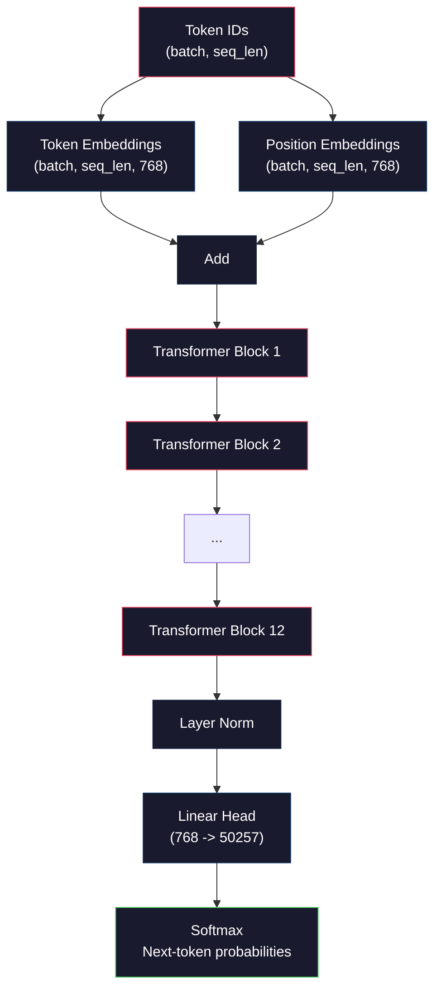
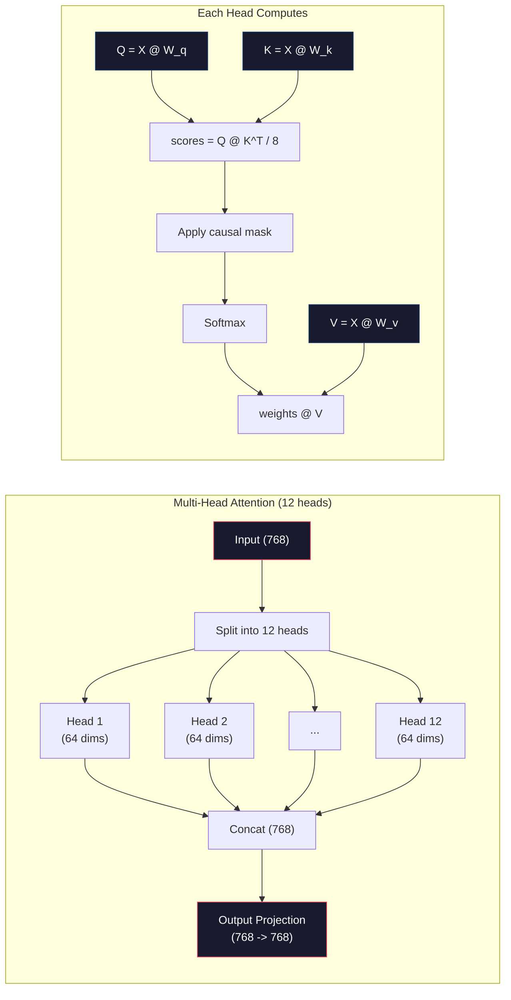
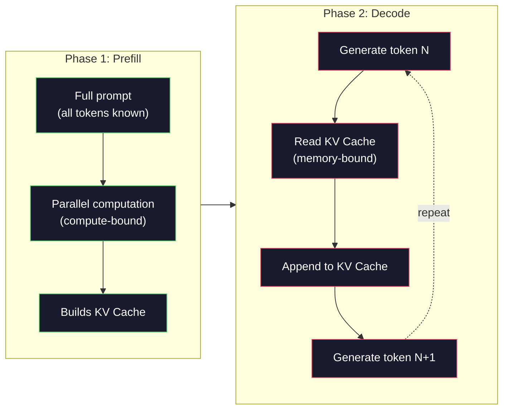

# 04 · 预训练一个迷你 GPT（1.24 亿参数）

> GPT-2 Small 有 1.24 亿个参数。也就是 12 个 transformer 层、12 个注意力头、768 维的嵌入。你可以在单张 GPU 上用几个小时从零训练它。大多数人从不这样做，他们直接用预训练好的检查点（checkpoint）。但如果你不亲手训练一次，你就无法真正理解你正在其上构建产品的那个模型内部到底发生了什么。

**类型：** 构建
**语言：** Python（配合 numpy）
**前置：** 阶段 10，课程 01-03（分词器、构建分词器、数据管线）
**时长：** 约 120 分钟

## 学习目标

- 从零实现完整的 GPT-2 架构（1.24 亿参数）：词元嵌入（token embeddings）、位置嵌入（positional embeddings）、transformer 块、以及语言模型头（language model head）
- 使用「下一词元预测（next-token prediction）」配合交叉熵损失（cross-entropy loss），在文本语料上训练一个 GPT 模型
- 实现带温度采样（temperature sampling）和 top-k/top-p 过滤的自回归（autoregressive）文本生成
- 监控训练损失曲线，并验证模型确实学到了连贯的语言模式

## 问题所在

你知道 transformer 是什么，你看过那些示意图，你能背出「attention is all you need」，能在白板上画出标着「Multi-Head Attention」的方框。

但这些都不意味着你理解模型生成文本时究竟发生了什么。

GPT-2 Small 共有 124,438,272 个参数（采用权重绑定）。其中每一个参数都是由一个训练循环设定的：前向传播、计算损失、反向传播、更新权重。12 个 transformer 块。每个块 12 个注意力头。768 维的嵌入空间。50,257 个词元的词表。每当模型生成一个词元，全部 1.24 亿个参数都会参与一条矩阵乘法链——它接收一串词元 ID，产出对下一个词元的概率分布。

如果你从未亲手构建过它，那么你面对的就是一个黑箱。你能调用 API，能做微调。但当出问题时——当模型产生幻觉、当它不断重复、当它拒绝遵循指令时——你心里没有一个能解释「为什么」的模型。

本课从零构建 GPT-2 Small。不是用 PyTorch，而是用 numpy。每一次矩阵乘法都清晰可见，每一个梯度都由你的代码计算。你将亲眼看到这 1.24 亿个数字是如何合谋预测出下一个词的。

## 核心概念

### GPT 架构

GPT 是一种自回归（autoregressive）语言模型。「自回归」意味着它一次生成一个词元，每个词元都以之前所有词元为条件。其架构是一摞 transformer 解码器块（decoder block）。

下面是从词元 ID 到下一词元概率的完整计算图：

1. 词元 ID 输入。形状：(batch_size, seq_len)。
2. 词元嵌入查表。每个 ID 映射到一个 768 维向量。形状：(batch_size, seq_len, 768)。
3. 位置嵌入查表。每个位置（0, 1, 2, ...）映射到一个 768 维向量。形状相同。
4. 将词元嵌入 + 位置嵌入相加。
5. 通过 12 个 transformer 块。
6. 最终层归一化（layer normalization）。
7. 线性投影到词表大小。形状：(batch_size, seq_len, vocab_size)。
8. Softmax 得到概率。

这就是整个模型。没有卷积，没有循环。只是嵌入、注意力、前馈网络（feedforward network）和层归一化堆叠 12 次。



### Transformer 块

12 个块中的每一个都遵循同样的模式。这是预归一化（pre-norm）架构（GPT-2 使用 pre-norm，而非原始 transformer 那样的 post-norm）：

1. LayerNorm
2. 多头自注意力（Multi-Head Self-Attention）
3. 残差连接（residual connection，把输入加回来）
4. LayerNorm
5. 前馈网络（Feed-Forward Network，MLP）
6. 残差连接（把输入加回来）

残差连接至关重要。没有它们，梯度在反向传播到达第 1 块时就已经消失了。有了它们，梯度可以通过「跳跃（skip）」路径从损失直接流向任意层。这正是你能堆叠 12 层、32 层、甚至 96 层的原因（据传 GPT-4 用了 120 层）。

### 注意力：核心机制

自注意力让每个词元都能查看它之前的每一个词元，并决定对每一个应该投入多少注意力。下面是其中的数学。

对每个词元位置，从输入计算出三个向量：
- **查询（Query, Q）**：「我在找什么？」
- **键（Key, K）**：「我包含什么？」
- **值（Value, V）**：「我携带什么信息？」

```
Q = input @ W_q    (768 -> 768)
K = input @ W_k    (768 -> 768)
V = input @ W_v    (768 -> 768)

attention_scores = Q @ K^T / sqrt(d_k)
attention_scores = mask(attention_scores)   # 因果掩码：未来位置置为 -inf
attention_weights = softmax(attention_scores)
output = attention_weights @ V
```

正是因果掩码（causal mask）使 GPT 成为自回归的。位置 5 可以关注位置 0-5，但不能关注 6、7、8 等等。这防止了模型在训练时通过偷看未来词元来「作弊」。

**多头注意力（Multi-head attention）** 将 768 维空间拆分成 12 个各 64 维的头。每个头学习一种不同的注意力模式。某个头可能追踪句法关系（主谓一致），另一个可能追踪语义相似性（同义词），又一个可能追踪位置邻近性（相邻词）。12 个头的输出被拼接起来，再投影回 768 维。



除以 sqrt(d_k)——sqrt(64) = 8——是缩放操作。没有它，高维向量的点积会变得很大，把 softmax 推到梯度几乎为零的区域。这是原始「Attention Is All You Need」论文中的关键洞见之一。

### KV 缓存：为什么推理很快

训练时，你一次处理整条序列。推理时，你一次生成一个词元。如果不做优化，生成第 N 个词元就需要为前面全部 N-1 个词元重新计算注意力。这是每生成一个词元 O(N^2)，对于长度为 N 的序列总共 O(N^3)。

KV 缓存（KV Cache）解决了这个问题。在为每个词元计算出 K 和 V 之后，把它们存起来。生成第 N+1 个词元时，你只需为这个新词元计算 Q，再从所有之前词元中查出缓存的 K 和 V。这把 K、V 计算的每词元成本从 O(N) 降到了 O(1)。注意力分数的计算仍然是 O(N)，因为你要关注所有之前的位置，但你避免了在输入上做冗余的矩阵乘法。

对于 12 层、12 个头的 GPT-2，KV 缓存每个词元存储 2（K + V）× 12 层 × 12 头 × 64 维 = 18,432 个值。对一条 1024 词元的序列，这在 FP32 下约为 75MB。对于 128 层的 Llama 3 405B，单条序列的 KV 缓存可能超过 10GB。这正是长上下文推理受内存制约（memory-bound）的原因。

### 预填充 vs 解码：推理的两个阶段

当你向一个 LLM 发送提示词时，推理分两个截然不同的阶段进行。

**预填充（Prefill）** 并行处理你的整条提示词。所有词元都是已知的，因此模型可以同时为所有位置计算注意力。这个阶段是计算受限（compute-bound）的——GPU 在以满吞吐做矩阵乘法。在 A100 上处理一条 1000 词元的提示词，预填充大约耗时 20-50ms。

**解码（Decode）** 一次生成一个词元。每个新词元都依赖之前的所有词元。这个阶段是内存受限（memory-bound）的——瓶颈在于从 GPU 显存读取模型权重和 KV 缓存，而不是矩阵运算本身。GPU 的计算核心大多处于空闲，等待内存读取。对 GPT-2 来说，每个解码步骤所花的时间大致相同，与矩阵乘法需要多少 FLOPs 无关，因为约束在于内存带宽。

这一区分对生产系统很重要。预填充吞吐随 GPU 算力扩展（FLOPS 越多，预填充越快）。解码吞吐随内存带宽扩展（内存越快，解码越快）。这就是为什么 NVIDIA 的 H100 相对 A100 着重提升了内存带宽——它直接加速了词元生成。



### 训练循环

训练一个 LLM 就是下一词元预测。给定词元 [0, 1, 2, ..., N-1]，预测词元 [1, 2, 3, ..., N]。损失函数是模型预测的概率分布与真实下一词元之间的交叉熵。

一个训练步骤：

1. **前向传播**：让这一批数据通过全部 12 个块。为每个位置得到 logits（softmax 前的分数）。
2. **计算损失**：logits 与目标词元（输入向右平移一位）之间的交叉熵。
3. **反向传播**：用反向传播为全部 1.24 亿个参数计算梯度。
4. **优化器步骤**：更新权重。GPT-2 使用带学习率预热（warmup）和余弦衰减（cosine decay）的 Adam。

学习率调度（learning rate schedule）的重要性超出你的预期。GPT-2 在前 2,000 步内从 0 预热到峰值学习率，然后沿余弦曲线衰减。一开始就用高学习率会导致模型发散。一直保持高学习率会在训练后期引起震荡。「先预热再衰减」的模式被每一个主流 LLM 采用。

### GPT-2 Small：具体数字

| 组件 | 形状 | 参数量 |
|-----------|-------|------------|
| 词元嵌入 | (50257, 768) | 38,597,376 |
| 位置嵌入 | (1024, 768) | 786,432 |
| 每块注意力 (W_q, W_k, W_v, W_out) | 4 x (768, 768) | 2,359,296 |
| 每块 FFN（升维 + 降维） | (768, 3072) + (3072, 768) | 4,718,592 |
| 每块 LayerNorm（2 个） | 2 x 768 x 2 | 3,072 |
| 最终 LayerNorm | 768 x 2 | 1,536 |
| **每块合计** | | **7,080,960** |
| **总计（12 块）** | | **85,054,464 + 39,383,808 = 124,438,272** |

输出投影（logits 头）与词元嵌入矩阵共享权重。这称为权重绑定（weight tying）——它把参数量减少了 3800 万，并提升了性能，因为它迫使模型对输入和输出使用同一套表示空间。

## 动手构建

### 第 1 步：嵌入层

词元嵌入把 50,257 个可能词元中的每一个映射为一个 768 维向量。位置嵌入则加入关于每个词元在序列中位置的信息。两者相加。

```python
import numpy as np

class Embedding:
    def __init__(self, vocab_size, embed_dim, max_seq_len):
        self.token_embed = np.random.randn(vocab_size, embed_dim) * 0.02
        self.pos_embed = np.random.randn(max_seq_len, embed_dim) * 0.02

    def forward(self, token_ids):
        seq_len = token_ids.shape[-1]
        tok_emb = self.token_embed[token_ids]
        pos_emb = self.pos_embed[:seq_len]
        return tok_emb + pos_emb
```

初始化时 0.02 的标准差来自 GPT-2 论文。太大，初始前向传播会产生极端值，破坏训练稳定性。太小，初始输出对所有输入几乎相同，使早期的梯度信号毫无用处。

### 第 2 步：带因果掩码的自注意力

先做单头注意力。因果掩码在 softmax 之前把未来位置置为负无穷，确保每个位置只能关注自身和更早的位置。

```python
def attention(Q, K, V, mask=None):
    d_k = Q.shape[-1]
    scores = Q @ K.transpose(0, -1, -2 if Q.ndim == 4 else 1) / np.sqrt(d_k)
    if mask is not None:
        scores = scores + mask
    weights = np.exp(scores - scores.max(axis=-1, keepdims=True))
    weights = weights / weights.sum(axis=-1, keepdims=True)
    return weights @ V
```

这个 softmax 实现在求指数之前先减去最大值。否则，exp(大数) 会溢出为无穷。这是一个数值稳定性技巧，它不改变输出，因为对任意常数 c 都有 softmax(x - c) = softmax(x)。

### 第 3 步：多头注意力

把 768 维输入拆成 12 个各 64 维的头。每个头独立计算注意力。拼接结果，再投影回 768 维。

```python
class MultiHeadAttention:
    def __init__(self, embed_dim, num_heads):
        self.num_heads = num_heads
        self.head_dim = embed_dim // num_heads
        self.W_q = np.random.randn(embed_dim, embed_dim) * 0.02
        self.W_k = np.random.randn(embed_dim, embed_dim) * 0.02
        self.W_v = np.random.randn(embed_dim, embed_dim) * 0.02
        self.W_out = np.random.randn(embed_dim, embed_dim) * 0.02

    def forward(self, x, mask=None):
        batch, seq_len, d = x.shape
        Q = (x @ self.W_q).reshape(batch, seq_len, self.num_heads, self.head_dim).transpose(0, 2, 1, 3)
        K = (x @ self.W_k).reshape(batch, seq_len, self.num_heads, self.head_dim).transpose(0, 2, 1, 3)
        V = (x @ self.W_v).reshape(batch, seq_len, self.num_heads, self.head_dim).transpose(0, 2, 1, 3)

        scores = Q @ K.transpose(0, 1, 3, 2) / np.sqrt(self.head_dim)
        if mask is not None:
            scores = scores + mask
        weights = np.exp(scores - scores.max(axis=-1, keepdims=True))
        weights = weights / weights.sum(axis=-1, keepdims=True)
        attn_out = weights @ V

        attn_out = attn_out.transpose(0, 2, 1, 3).reshape(batch, seq_len, d)
        return attn_out @ self.W_out
```

「reshape-transpose-reshape」这套腾挪是多头注意力中最让人困惑的部分。它做的事情是：(batch, seq_len, 768) 张量先变成 (batch, seq_len, 12, 64)，再变成 (batch, 12, seq_len, 64)。这样 12 个头各自就有了自己的 (seq_len, 64) 矩阵来跑注意力。注意力之后，再把这个过程反过来：(batch, 12, seq_len, 64) 变回 (batch, seq_len, 12, 64)，再变回 (batch, seq_len, 768)。

### 第 4 步：Transformer 块

一个完整的 transformer 块：LayerNorm、带残差的多头注意力、LayerNorm、带残差的前馈网络。

```python
class LayerNorm:
    def __init__(self, dim, eps=1e-5):
        self.gamma = np.ones(dim)
        self.beta = np.zeros(dim)
        self.eps = eps

    def forward(self, x):
        mean = x.mean(axis=-1, keepdims=True)
        var = x.var(axis=-1, keepdims=True)
        return self.gamma * (x - mean) / np.sqrt(var + self.eps) + self.beta


class FeedForward:
    def __init__(self, embed_dim, ff_dim):
        self.W1 = np.random.randn(embed_dim, ff_dim) * 0.02
        self.b1 = np.zeros(ff_dim)
        self.W2 = np.random.randn(ff_dim, embed_dim) * 0.02
        self.b2 = np.zeros(embed_dim)

    def forward(self, x):
        h = x @ self.W1 + self.b1
        h = np.maximum(0, h)  # GELU 的近似：为简洁起见用 ReLU
        return h @ self.W2 + self.b2


class TransformerBlock:
    def __init__(self, embed_dim, num_heads, ff_dim):
        self.ln1 = LayerNorm(embed_dim)
        self.attn = MultiHeadAttention(embed_dim, num_heads)
        self.ln2 = LayerNorm(embed_dim)
        self.ffn = FeedForward(embed_dim, ff_dim)

    def forward(self, x, mask=None):
        x = x + self.attn.forward(self.ln1.forward(x), mask)
        x = x + self.ffn.forward(self.ln2.forward(x))
        return x
```

前馈网络把 768 维输入扩展到 3,072 维（4 倍），施加一个非线性，再投影回 768 维。这种「扩张-收缩」模式给了模型在每个位置上一个更「宽」的内部表示来发挥。GPT-2 使用 GELU 激活，但这里为简洁起见用 ReLU——对于理解架构而言两者差别很小。

### 第 5 步：完整的 GPT 模型

堆叠 12 个 transformer 块。前面加上嵌入层，后面加上输出投影。

```python
class MiniGPT:
    def __init__(self, vocab_size=50257, embed_dim=768, num_heads=12,
                 num_layers=12, max_seq_len=1024, ff_dim=3072):
        self.embedding = Embedding(vocab_size, embed_dim, max_seq_len)
        self.blocks = [
            TransformerBlock(embed_dim, num_heads, ff_dim)
            for _ in range(num_layers)
        ]
        self.ln_f = LayerNorm(embed_dim)
        self.vocab_size = vocab_size
        self.embed_dim = embed_dim

    def forward(self, token_ids):
        seq_len = token_ids.shape[-1]
        mask = np.triu(np.full((seq_len, seq_len), -1e9), k=1)

        x = self.embedding.forward(token_ids)
        for block in self.blocks:
            x = block.forward(x, mask)
        x = self.ln_f.forward(x)

        logits = x @ self.embedding.token_embed.T
        return logits

    def count_parameters(self):
        total = 0
        total += self.embedding.token_embed.size
        total += self.embedding.pos_embed.size
        for block in self.blocks:
            total += block.attn.W_q.size + block.attn.W_k.size
            total += block.attn.W_v.size + block.attn.W_out.size
            total += block.ffn.W1.size + block.ffn.b1.size
            total += block.ffn.W2.size + block.ffn.b2.size
            total += block.ln1.gamma.size + block.ln1.beta.size
            total += block.ln2.gamma.size + block.ln2.beta.size
        total += self.ln_f.gamma.size + self.ln_f.beta.size
        return total
```

注意这里的权重绑定：`logits = x @ self.embedding.token_embed.T`。输出投影复用了词元嵌入矩阵（转置后）。这不只是一个省参数的技巧。它意味着模型对「理解词元」（嵌入）和「预测词元」（输出）使用同一个向量空间。

### 第 6 步：训练循环

要在 1.24 亿参数上做真正的训练，你需要 GPU 和 PyTorch。这个训练循环用纯 numpy 在一个小模型上演示其机理。我们用一个极小的模型（4 层、4 头、128 维）使其可计算。

```python
def cross_entropy_loss(logits, targets):
    batch, seq_len, vocab_size = logits.shape
    logits_flat = logits.reshape(-1, vocab_size)
    targets_flat = targets.reshape(-1)

    max_logits = logits_flat.max(axis=-1, keepdims=True)
    log_softmax = logits_flat - max_logits - np.log(
        np.exp(logits_flat - max_logits).sum(axis=-1, keepdims=True)
    )

    loss = -log_softmax[np.arange(len(targets_flat)), targets_flat].mean()
    return loss


def train_mini_gpt(text, vocab_size=256, embed_dim=128, num_heads=4,
                   num_layers=4, seq_len=64, num_steps=200, lr=3e-4):
    tokens = np.array(list(text.encode("utf-8")[:2048]))
    model = MiniGPT(
        vocab_size=vocab_size, embed_dim=embed_dim, num_heads=num_heads,
        num_layers=num_layers, max_seq_len=seq_len, ff_dim=embed_dim * 4
    )

    print(f"Model parameters: {model.count_parameters():,}")
    print(f"Training tokens: {len(tokens):,}")
    print(f"Config: {num_layers} layers, {num_heads} heads, {embed_dim} dims")
    print()

    for step in range(num_steps):
        start_idx = np.random.randint(0, max(1, len(tokens) - seq_len - 1))
        batch_tokens = tokens[start_idx:start_idx + seq_len + 1]

        input_ids = batch_tokens[:-1].reshape(1, -1)
        target_ids = batch_tokens[1:].reshape(1, -1)

        logits = model.forward(input_ids)
        loss = cross_entropy_loss(logits, target_ids)

        if step % 20 == 0:
            print(f"Step {step:4d} | Loss: {loss:.4f}")

    return model
```

损失起始值接近 ln(vocab_size)——对于一个 256 个词元的字节级词表，就是 ln(256) = 5.55。一个随机模型对每个词元赋予相等的概率。随着训练推进，损失下降，因为模型学会了预测常见模式：「t」后面跟「th」、句点后面跟空格，等等。

在生产环境中，你会用 Adam 优化器，配合梯度累积（gradient accumulation）、学习率预热和梯度裁剪（gradient clipping）。「前向-计算损失-反向-更新」这个循环是一样的，只是优化器更复杂。

### 第 7 步：文本生成

生成使用训练好的模型来一次预测一个词元。每次预测都从输出分布中采样（或贪婪地取 argmax）。

```python
def generate(model, prompt_tokens, max_new_tokens=100, temperature=0.8):
    tokens = list(prompt_tokens)
    seq_len = model.embedding.pos_embed.shape[0]

    for _ in range(max_new_tokens):
        context = np.array(tokens[-seq_len:]).reshape(1, -1)
        logits = model.forward(context)
        next_logits = logits[0, -1, :]

        next_logits = next_logits / temperature
        probs = np.exp(next_logits - next_logits.max())
        probs = probs / probs.sum()

        next_token = np.random.choice(len(probs), p=probs)
        tokens.append(next_token)

    return tokens
```

温度（temperature）控制随机性。温度 1.0 使用原始分布。温度 0.5 使分布更尖锐（更确定——模型更频繁地选择它的首选）。温度 1.5 使分布更平坦（更随机——低概率词元获得更大机会）。温度 0.0 是贪婪解码（greedy decoding，总是选概率最高的词元）。

`tokens[-seq_len:]` 这个窗口是必要的，因为模型有最大上下文长度（GPT-2 为 1024）。一旦超出，你必须丢掉最旧的词元。这就是所有人都在谈论的「上下文窗口（context window）」。

## 实际运用

### 完整的训练与生成演示

```python
corpus = """The transformer architecture has revolutionized natural language processing.
Attention mechanisms allow the model to focus on relevant parts of the input.
Self-attention computes relationships between all pairs of positions in a sequence.
Multi-head attention splits the representation into multiple subspaces.
Each attention head can learn different types of relationships.
The feedforward network provides nonlinear transformations at each position.
Residual connections enable gradient flow through deep networks.
Layer normalization stabilizes training by normalizing activations.
Position embeddings give the model information about token ordering.
The causal mask ensures autoregressive generation during training.
Pre-training on large text corpora teaches the model general language understanding.
Fine-tuning adapts the pre-trained model to specific downstream tasks."""

model = train_mini_gpt(corpus, num_steps=200)

prompt = list("The transformer".encode("utf-8"))
output_tokens = generate(model, prompt, max_new_tokens=100, temperature=0.8)
generated_text = bytes(output_tokens).decode("utf-8", errors="replace")
print(f"\nGenerated: {generated_text}")
```

在一个小语料、小模型上，生成的文本顶多算是半连贯。它会从训练文本中学到一些字节级模式，但无法像 GPT-2 那样用 40GB 训练数据和完整的 1.24 亿参数架构去泛化。重点不在于输出质量，而在于你能追踪每一步：嵌入查表、注意力计算、前馈变换、logit 投影、softmax 和采样。每一个操作都清晰可见。

## 交付上线

本课会产出 `outputs/prompt-gpt-architecture-analyzer.md`——一个用于分析任意 GPT 风格模型架构选择的提示词。把一份模型卡或技术报告喂给它，它会拆解参数分配、注意力设计和扩展决策。

## 练习

1. 把模型改为 24 层、16 个头，替换原来的 12/12。统计参数量。深度翻倍与宽度翻倍（嵌入维度）相比如何？

2. 实现 GELU 激活函数（GELU(x) = x * 0.5 * (1 + erf(x / sqrt(2)))）并替换前馈网络中的 ReLU。用每种激活各训练 500 步，对比最终损失。

3. 给生成函数加上 KV 缓存。在第一次前向传播后为每一层存储 K 和 V 张量，并在后续词元中复用它们。测量加速比：生成 200 个词元，对比有缓存和无缓存的真实耗时。

4. 实现 top-k 采样（只考虑概率最高的 k 个词元）和 top-p 采样（核采样，nucleus sampling：考虑累计概率超过 p 的最小词元集合）。在温度 0.8 下，对比 top-k=50 与 top-p=0.95 的输出质量。

5. 构建一个训练损失曲线绘图器。训练模型 1000 步，绘制损失对步数的曲线。识别其中三个阶段：初期的快速下降（学习常见字节）、中期的较慢阶段（学习字节模式）、平台期（在小语料上过拟合）。无论你训练的是 128 维模型还是 GPT-4，这条曲线的形状都是一样的。

## 关键术语

| 术语 | 人们怎么说 | 它实际指什么 |
|------|----------------|----------------------|
| 自回归（Autoregressive） | 「它一次生成一个词」 | 每个输出词元都以之前所有词元为条件——模型预测 P(token_n \| token_0, ..., token_{n-1}) |
| 因果掩码（Causal mask） | 「它看不到未来」 | 一个由 -无穷 值构成的上三角矩阵，在训练时阻止对未来位置的注意力 |
| 多头注意力（Multi-head attention） | 「多种注意力模式」 | 把 Q、K、V 拆分成并行的头（例如 GPT-2 的 12 个各 64 维的头），让每个头学习不同类型的关系 |
| KV 缓存（KV Cache） | 「为提速做的缓存」 | 存储之前词元已算出的 Key 和 Value 张量，以在自回归生成时避免冗余计算 |
| 预填充（Prefill） | 「处理提示词」 | 第一个推理阶段，所有提示词词元被并行处理——在 GPU FLOPS 上计算受限 |
| 解码（Decode） | 「生成词元」 | 第二个推理阶段，词元被一次一个地生成——在 GPU 带宽上内存受限 |
| 权重绑定（Weight tying） | 「共享嵌入」 | 对输入词元嵌入和输出投影头使用同一个矩阵——在 GPT-2 中省下 3800 万参数 |
| 残差连接（Residual connection） | 「跳跃连接」 | 把输入直接加到某个子层的输出上（x + sublayer(x)）——在深层网络中实现梯度流动 |
| 层归一化（Layer normalization） | 「归一化激活」 | 在特征维度上归一化到均值 0、方差 1，带有可学习的缩放和偏置参数 |
| 交叉熵损失（Cross-entropy loss） | 「预测有多错」 | -log(赋予正确下一词元的概率)，在所有位置上取平均——标准的 LLM 训练目标 |

## 延伸阅读

- [Radford et al., 2019 -- "Language Models are Unsupervised Multitask Learners" (GPT-2)](https://cdn.openai.com/better-language-models/language_models_are_unsupervised_multitask_learners.pdf) -- 引入 1.24 亿至 15 亿参数家族的 GPT-2 论文
- [Vaswani et al., 2017 -- "Attention Is All You Need"](https://arxiv.org/abs/1706.03762) -- 提出缩放点积注意力和多头注意力的原始 transformer 论文
- [Llama 3 Technical Report](https://arxiv.org/abs/2407.21783) -- Meta 如何用 1.6 万张 GPU 把 GPT 架构扩展到 4050 亿参数
- [Pope et al., 2022 -- "Efficiently Scaling Transformer Inference"](https://arxiv.org/abs/2211.05102) -- 将预填充 vs 解码以及 KV 缓存分析形式化的论文
