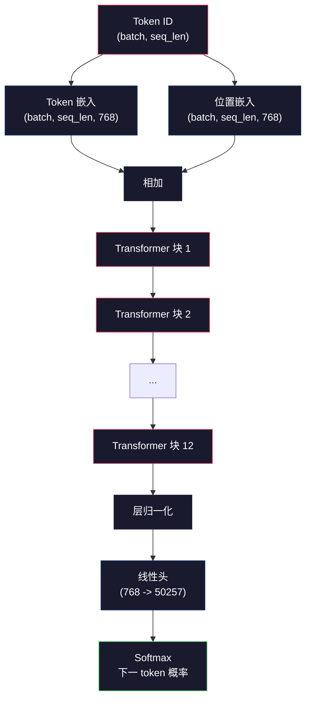
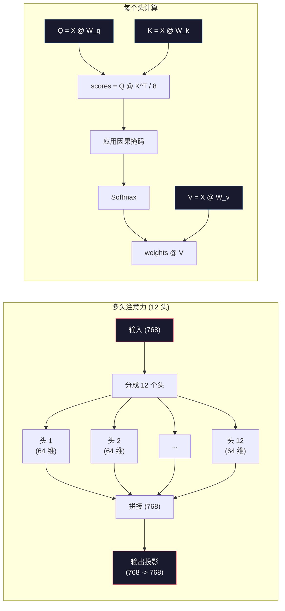
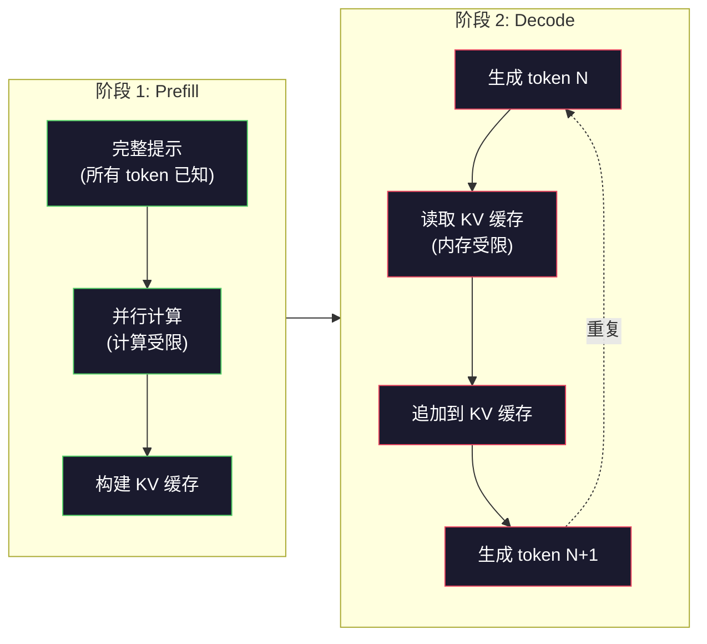

# 预训练 Mini GPT（1.24 亿参数）

> GPT-2 Small 有 1.24 亿参数。那是 12 个 transformer 层、12 个注意力头和 768 维嵌入。你可以在单个 GPU 上几小时从头训练它。大多数人从不这样做。他们使用预训练检查点。但如果你自己不训练一个，你就不真正理解你正在构建产品的模型内部发生了什么。

**类型：** 构建
**语言：** Python（使用 numpy）
**前置知识：** 第十阶段，第 01-03 课（分词器、构建分词器、数据流水线）
**时间：** ~120 分钟

## 学习目标

- 从零实现完整的 GPT-2 架构（1.24 亿参数）：token 嵌入、位置嵌入、transformer 块和语言模型头
- 使用下一 token 预测和交叉熵损失在文本语料上训练 GPT 模型
- 实现带有温度采样和 top-k/top-p 过滤的自回归文本生成
- 监控训练损失曲线并验证模型学习连贯的语言模式

## 问题

你知道 transformer 是什么。你读过图表。你能背诵"attention is all you need"并在白板上画标着"Multi-Head Attention"的方框。

这些都不意味着你理解模型生成文本时发生了什么。

GPT-2 Small 有 124,438,272 个参数（含权重绑定）。每一个都是通过运行训练循环设置的：前向传播、计算损失、反向传播、更新权重。十二个 transformer 块。每个块十二个注意力头。一个 768 维的嵌入空间。一个 50,257 token 的词表。每次模型生成一个 token，所有 1.24 亿参数都参与一个单一的矩阵乘法链，将 token ID 序列转换为下一个 token 的概率分布。

如果你从未自己构建过这个，你就是在和一个黑盒打交道。你可以用 API。你可以微调。但当出问题——当模型幻觉、当它重复自己、当它拒绝遵循指令时——你没有 mental model 来理解*为什么*。

这一课从头构建 GPT-2 Small。不是用 PyTorch。用 numpy。每个矩阵乘法都可见。每个梯度都由你的代码计算。你会精确看到 1.24 亿个数字如何合谋预测下一个词。

## 概念

### GPT 架构

GPT 是自回归语言模型。"自回归"意味着它一次生成一个 token，每个 token 以所有之前的 token 为条件。架构是一堆 transformer 解码器块。

以下是从 token ID 到下一 token 概率的完整计算图：

1. Token ID 输入。形状：(batch_size, seq_len)。
2. Token 嵌入查找。每个 ID 映射到一个 768 维向量。形状：(batch_size, seq_len, 768)。
3. 位置嵌入查找。每个位置 (0, 1, 2, ...) 映射到一个 768 维向量。相同形状。
4. Token 嵌入 + 位置嵌入相加。
5. 通过 12 个 transformer 块。
6. 最终层归一化。
7. 线性投影到词表大小。形状：(batch_size, seq_len, vocab_size)。
8. Softmax 得到概率。

这就是整个模型。没有卷积。没有循环。只是嵌入、注意力、前馈网络和层归一化堆叠 12 次。



### Transformer 块

12 个块中的每一个都遵循相同的模式。Pre-norm 架构（GPT-2 使用 pre-norm，不像原始 transformer 使用 post-norm）：

1. 层归一化
2. 多头自注意力
3. 残差连接（加回输入）
4. 层归一化
5. 前馈网络（MLP）
6. 残差连接（加回输入）

残差连接至关重要。没有它们，反向传播时梯度在到达第 1 块之前就消失了。有了它们，梯度可以通过"跳跃"路径直接从损失流向任何层。这就是你能堆叠 12、32 甚至 96 个块的原因（GPT-4 据传使用 120 个）。

### 注意力：核心机制

自注意力让每个 token 查看每个之前的 token，并决定对每个 token 关注多少。以下是数学。

对每个 token 位置，从输入计算三个向量：
- **Query (Q)**："我在找什么？"
- **Key (K)**："我包含什么？"
- **Value (V)**："我携带什么信息？"

```
Q = input @ W_q    (768 -> 768)
K = input @ W_k    (768 -> 768)
V = input @ W_v    (768 -> 768)

attention_scores = Q @ K^T / sqrt(d_k)
attention_scores = mask(attention_scores)   # 因果掩码：未来位置为 -inf
attention_weights = softmax(attention_scores)
output = attention_weights @ V
```

因果掩码使 GPT 成为自回归模型。位置 5 可以关注位置 0-5，但不能关注 6、7、8 等。这防止模型在训练时通过"偷看"未来 token 来作弊。

**多头注意力** 将 768 维空间分成 12 个 64 维的头。每个头学习不同的注意力模式。一个头可能追踪句法关系（主谓一致）。另一个可能追踪语义相似性（同义词）。另一个可能追踪位置邻近性（附近的词）。所有 12 个头的输出被拼接并投影回 768 维。



除以 sqrt(d_k)——sqrt(64) = 8——是缩放。没有它，高维向量的点积会变大，将 softmax 推到梯度几乎为零的区域。这是原始"Attention Is All You Need"论文的关键见解之一。

### KV 缓存：为什么推理很快

训练时，你一次性处理整个序列。推理时，你一次生成一个 token。没有优化的话，生成 token N 需要重新计算所有 N-1 个之前 token 的注意力。这是每个生成 token O(N²)，或者整个序列 O(N³)。

KV 缓存解决了这个问题。计算每个 token 的 K 和 V 后，存储它们。生成 token N+1 时，你只需要为新 token 计算 Q，并查找所有之前 token 的缓存 K 和 V。这将每个 token 的 K 和 V 计算成本从 O(N) 降低到 O(1)。注意力分数计算仍然是 O(N)，因为你需要关注所有之前的位置，但你避免了对输入的冗余矩阵乘法。

对于 GPT-2 的 12 层 12 头，KV 缓存每个 token 存储 2 (K + V) x 12 层 x 12 头 x 64 维 = 18,432 个值。对于 1024 token 的序列，FP32 下约 75MB。对于 Llama 3 405B 的 128 层，单个序列的 KV 缓存可以超过 10GB。这就是长上下文推理受内存限制的原因。

### Prefill vs Decode：推理的两个阶段

当你向大语言模型发送提示时，推理发生在两个不同的阶段。

**Prefill** 并行处理你的整个提示。所有 token 都已知，所以模型可以同时计算所有位置的注意力。这个阶段受计算限制——GPU 以全吞吐量进行矩阵乘法。对于 A100 上的 1000 token 提示，prefill 大约需要 20-50ms。

**Decode** 一次生成一个 token。每个新 token 依赖于所有之前的 token。这个阶段受内存限制——瓶颈是从 GPU 内存读取模型权重和 KV 缓存，而不是矩阵运算本身。GPU 的计算核心大部分时间在等待内存读取而空闲。对于 GPT-2，每个解码步骤花费的时间大致相同，无论矩阵乘法需要多少 FLOP，因为内存带宽是限制因素。

这种区别对生产系统很重要。Prefill 吞吐量随 GPU 计算能力缩放（更多 FLOPS = 更快 prefill）。Decode 吞吐量随内存带宽缩放（更快内存 = 更快 decode）。这就是 NVIDIA H100 相对于 A100 专注于内存带宽改进的原因——它直接加速 token 生成。



### 训练循环

训练大语言模型就是下一 token 预测。给定 token [0, 1, 2, ..., N-1]，预测 token [1, 2, 3, ..., N]。损失函数是模型预测的概率分布与实际下一 token 之间的交叉熵。

一个训练步骤：

1. **前向传播**：将批次通过所有 12 个块。获取每个位置的 logits（softmax 前的分数）。
2. **计算损失**：logits 与目标 token（输入向后移动一个位置）之间的交叉熵。
3. **反向传播**：使用反向传播计算所有 1.24 亿参数的梯度。
4. **优化器步骤**：更新权重。GPT-2 使用 Adam，带学习率预热和余弦衰减。

学习率调度比你想象的更重要。GPT-2 在前 2,000 步从 0 预热到峰值学习率，然后沿余弦曲线衰减。以高学习率开始会导致模型发散。保持恒定高率会导致后期训练振荡。预热-然后-衰减的模式被每个主要大语言模型使用。

### GPT-2 Small：数字

| 组件 | 形状 | 参数 |
|------|------|------|
| Token 嵌入 | (50257, 768) | 38,597,376 |
| 位置嵌入 | (1024, 768) | 786,432 |
| 每块注意力 (W_q, W_k, W_v, W_out) | 4 x (768, 768) | 2,359,296 |
| 每块 FFN (up + down) | (768, 3072) + (3072, 768) | 4,718,592 |
| 每块层归一化 (2x) | 2 x 768 x 2 | 3,072 |
| 最终层归一化 | 768 x 2 | 1,536 |
| **每块总计** | | **7,080,960** |
| **总计 (12 块)** | | **85,054,464 + 39,383,808 = 124,438,272** |

输出投影（logits 头）与 token 嵌入矩阵共享权重。这称为权重绑定——它将参数数量减少 3800 万，并提高性能，因为它强制模型对输入和输出使用相同的表示空间。

## 构建

### 第 1 步：嵌入层

Token 嵌入将 50,257 个可能的 token 中的每一个映射到一个 768 维向量。位置嵌入添加关于每个 token 在序列中位置的信息。两者相加。

```python
import numpy as np

class Embedding:
    def __init__(self, vocab_size, embed_dim, max_seq_len):
        self.token_embed = np.random.randn(vocab_size, embed_dim) * 0.02
        self.pos_embed = np.random.randn(max_seq_len, embed_dim) * 0.02

    def forward(self, token_ids):
        seq_len = token_ids.shape[-1]
        tok_emb = self.token_embed[token_ids]
        pos_emb = self.pos_embed[:seq_len]
        return tok_emb + pos_emb
```

0.02 的标准差来自 GPT-2 论文。太大，初始前向传播产生极端值，使训练不稳定。太小，初始输出对所有输入几乎相同，使早期梯度信号无用。

### 第 2 步：带因果掩码的自注意力

先单头注意力。因果掩码在 softmax 前将未来位置设为负无穷，确保每个位置只能关注自己和更早的位置。

```python
def attention(Q, K, V, mask=None):
    d_k = Q.shape[-1]
    scores = Q @ K.transpose(0, -1, -2 if Q.ndim == 4 else 1) / np.sqrt(d_k)
    if mask is not None:
        scores = scores + mask
    weights = np.exp(scores - scores.max(axis=-1, keepdims=True))
    weights = weights / weights.sum(axis=-1, keepdims=True)
    return weights @ V
```

Softmax 实现在指数化前减去最大值。没有这一步，exp(大数) 会溢出为无穷大。这是一个数值稳定性技巧，不改变输出，因为 softmax(x - c) = softmax(x) 对任何常数 c 都成立。

### 第 3 步：多头注意力

将 768 维输入分成 12 个 64 维的头。每个头独立计算注意力。拼接结果并投影回 768 维。

```python
class MultiHeadAttention:
    def __init__(self, embed_dim, num_heads):
        self.num_heads = num_heads
        self.head_dim = embed_dim // num_heads
        self.W_q = np.random.randn(embed_dim, embed_dim) * 0.02
        self.W_k = np.random.randn(embed_dim, embed_dim) * 0.02
        self.W_v = np.random.randn(embed_dim, embed_dim) * 0.02
        self.W_out = np.random.randn(embed_dim, embed_dim) * 0.02

    def forward(self, x, mask=None):
        batch, seq_len, d = x.shape
        Q = (x @ self.W_q).reshape(batch, seq_len, self.num_heads, self.head_dim).transpose(0, 2, 1, 3)
        K = (x @ self.W_k).reshape(batch, seq_len, self.num_heads, self.head_dim).transpose(0, 2, 1, 3)
        V = (x @ self.W_v).reshape(batch, seq_len, self.num_heads, self.head_dim).transpose(0, 2, 1, 3)

        scores = Q @ K.transpose(0, 1, 3, 2) / np.sqrt(self.head_dim)
        if mask is not None:
            scores = scores + mask
        weights = np.exp(scores - scores.max(axis=-1, keepdims=True))
        weights = weights / weights.sum(axis=-1, keepdims=True)
        attn_out = weights @ V

        attn_out = attn_out.transpose(0, 2, 1, 3).reshape(batch, seq_len, d)
        return attn_out @ self.W_out
```

reshape-transpose-reshape 的舞蹈是多头注意力中最令人困惑的部分。以下是发生的事情：(batch, seq_len, 768) 张量变成 (batch, seq_len, 12, 64)，然后 (batch, 12, seq_len, 64)。现在 12 个头中的每一个都有自己的 (seq_len, 64) 矩阵来运行注意力。注意力之后，我们反向操作：(batch, 12, seq_len, 64) 变成 (batch, seq_len, 12, 64) 变成 (batch, seq_len, 768)。

### 第 4 步：Transformer 块

一个完整的 transformer 块：层归一化、带残差的多头注意力、层归一化、带残差的前馈。

```python
class LayerNorm:
    def __init__(self, dim, eps=1e-5):
        self.gamma = np.ones(dim)
        self.beta = np.zeros(dim)
        self.eps = eps

    def forward(self, x):
        mean = x.mean(axis=-1, keepdims=True)
        var = x.var(axis=-1, keepdims=True)
        return self.gamma * (x - mean) / np.sqrt(var + self.eps) + self.beta


class FeedForward:
    def __init__(self, embed_dim, ff_dim):
        self.W1 = np.random.randn(embed_dim, ff_dim) * 0.02
        self.b1 = np.zeros(ff_dim)
        self.W2 = np.random.randn(ff_dim, embed_dim) * 0.02
        self.b2 = np.zeros(embed_dim)

    def forward(self, x):
        h = x @ self.W1 + self.b1
        h = np.maximum(0, h)  # GELU 近似：为简单用 ReLU
        return h @ self.W2 + self.b2


class TransformerBlock:
    def __init__(self, embed_dim, num_heads, ff_dim):
        self.ln1 = LayerNorm(embed_dim)
        self.attn = MultiHeadAttention(embed_dim, num_heads)
        self.ln2 = LayerNorm(embed_dim)
        self.ffn = FeedForward(embed_dim, ff_dim)

    def forward(self, x, mask=None):
        x = x + self.attn.forward(self.ln1.forward(x), mask)
        x = x + self.ffn.forward(self.ln2.forward(x))
        return x
```

前馈网络将 768 维输入扩展到 3,072 维（4 倍），应用非线性，然后投影回 768。这种扩展-收缩模式给模型在每个位置提供了"更宽"的内部表示来工作。GPT-2 使用 GELU 激活，但我们这里用 ReLU 简化——差异对理解架构来说很小。

### 第 5 步：完整 GPT 模型

堆叠 12 个 transformer 块。在前面加嵌入层，在后面加输出投影。

```python
class MiniGPT:
    def __init__(self, vocab_size=50257, embed_dim=768, num_heads=12,
                 num_layers=12, max_seq_len=1024, ff_dim=3072):
        self.embedding = Embedding(vocab_size, embed_dim, max_seq_len)
        self.blocks = [
            TransformerBlock(embed_dim, num_heads, ff_dim)
            for _ in range(num_layers)
        ]
        self.ln_f = LayerNorm(embed_dim)
        self.vocab_size = vocab_size
        self.embed_dim = embed_dim

    def forward(self, token_ids):
        seq_len = token_ids.shape[-1]
        mask = np.triu(np.full((seq_len, seq_len), -1e9), k=1)

        x = self.embedding.forward(token_ids)
        for block in self.blocks:
            x = block.forward(x, mask)
        x = self.ln_f.forward(x)

        logits = x @ self.embedding.token_embed.T
        return logits

    def count_parameters(self):
        total = 0
        total += self.embedding.token_embed.size
        total += self.embedding.pos_embed.size
        for block in self.blocks:
            total += block.attn.W_q.size + block.attn.W_k.size
            total += block.attn.W_v.size + block.attn.W_out.size
            total += block.ffn.W1.size + block.ffn.b1.size
            total += block.ffn.W2.size + block.ffn.b2.size
            total += block.ln1.gamma.size + block.ln1.beta.size
            total += block.ln2.gamma.size + block.ln2.beta.size
        total += self.ln_f.gamma.size + self.ln_f.beta.size
        return total
```

注意权重绑定：`logits = x @ self.embedding.token_embed.T`。输出投影重用 token 嵌入矩阵（转置）。这不仅仅是省参数的技巧。它意味着模型对理解 token（嵌入）和预测 token（输出）使用相同的向量空间。

### 第 6 步：训练循环

对于 1.24 亿参数的真实训练运行，你需要 GPU 和 PyTorch。这个训练循环在纯 numpy 的小模型上演示机制。我们使用一个微型模型（4 层、4 头、128 维）来使其可处理。

```python
def cross_entropy_loss(logits, targets):
    batch, seq_len, vocab_size = logits.shape
    logits_flat = logits.reshape(-1, vocab_size)
    targets_flat = targets.reshape(-1)

    max_logits = logits_flat.max(axis=-1, keepdims=True)
    log_softmax = logits_flat - max_logits - np.log(
        np.exp(logits_flat - max_logits).sum(axis=-1, keepdims=True)
    )

    loss = -log_softmax[np.arange(len(targets_flat)), targets_flat].mean()
    return loss


def train_mini_gpt(text, vocab_size=256, embed_dim=128, num_heads=4,
                   num_layers=4, seq_len=64, num_steps=200, lr=3e-4):
    tokens = np.array(list(text.encode("utf-8")[:2048]))
    model = MiniGPT(
        vocab_size=vocab_size, embed_dim=embed_dim, num_heads=num_heads,
        num_layers=num_layers, max_seq_len=seq_len, ff_dim=embed_dim * 4
    )

    print(f"模型参数: {model.count_parameters():,}")
    print(f"训练 token: {len(tokens):,}")
    print(f"配置: {num_layers} 层, {num_heads} 头, {embed_dim} 维")
    print()

    for step in range(num_steps):
        start_idx = np.random.randint(0, max(1, len(tokens) - seq_len - 1))
        batch_tokens = tokens[start_idx:start_idx + seq_len + 1]

        input_ids = batch_tokens[:-1].reshape(1, -1)
        target_ids = batch_tokens[1:].reshape(1, -1)

        logits = model.forward(input_ids)
        loss = cross_entropy_loss(logits, target_ids)

        if step % 20 == 0:
            print(f"Step {step:4d} | 损失: {loss:.4f}")

    return model
```

损失从接近 ln(vocab_size) 开始——对于 256 token 的字节级词表，那是 ln(256) = 5.55。随机模型给每个 token 分配相等的概率。随着训练进行，损失下降，因为模型学会预测常见模式："t" 后的 "th"，句号后的空格，等等。

在生产中，你会使用 Adam 优化器，带梯度累积、学习率预热和梯度裁剪。前向-损失-反向-更新循环是相同的。优化器更复杂。

### 第 7 步：文本生成

生成使用训练好的模型一次预测一个 token。每个预测从输出分布中采样（或贪婪地取 argmax）。

```python
def generate(model, prompt_tokens, max_new_tokens=100, temperature=0.8):
    tokens = list(prompt_tokens)
    seq_len = model.embedding.pos_embed.shape[0]

    for _ in range(max_new_tokens):
        context = np.array(tokens[-seq_len:]).reshape(1, -1)
        logits = model.forward(context)
        next_logits = logits[0, -1, :]

        next_logits = next_logits / temperature
        probs = np.exp(next_logits - next_logits.max())
        probs = probs / probs.sum()

        next_token = np.random.choice(len(probs), p=probs)
        tokens.append(next_token)

    return tokens
```

温度控制随机性。温度 1.0 使用原始分布。温度 0.5 使分布更尖锐（更确定性——模型更常选择其首选）。温度 1.5 使分布更平坦（更随机——低概率 token 获得更大机会）。温度 0.0 是贪婪解码（总是选最高概率 token）。

`tokens[-seq_len:]` 窗口是必要的，因为模型有最大上下文长度（GPT-2 为 1024）。一旦超过，就必须丢弃最旧的 token。这就是每个人都在谈论的"上下文窗口"。

## 使用

### 完整训练和生成演示

```python
corpus = """The transformer architecture has revolutionized natural language processing.
Attention mechanisms allow the model to focus on relevant parts of the input.
Self-attention computes relationships between all pairs of positions in a sequence.
Multi-head attention splits the representation into multiple subspaces.
Each attention head can learn different types of relationships.
The feedforward network provides nonlinear transformations at each position.
Residual connections enable gradient flow through deep networks.
Layer normalization stabilizes training by normalizing activations.
Position embeddings give the model information about token ordering.
The causal mask ensures autoregressive generation during training.
Pre-training on large text corpora teaches the model general language understanding.
Fine-tuning adapts the pre-trained model to specific downstream tasks."""

model = train_mini_gpt(corpus, num_steps=200)

prompt = list("The transformer".encode("utf-8"))
output_tokens = generate(model, prompt, max_new_tokens=100, temperature=0.8)
generated_text = bytes(output_tokens).decode("utf-8", errors="replace")
print(f"\n生成: {generated_text}")
```

在小语料上的小模型上，生成文本最多是半连贯的。它会从训练文本中学到一些字节级模式，但无法像 GPT-2 那样泛化，后者有 40GB 训练数据和完整的 1.24 亿参数架构。重点不是输出质量。重点是你可以追踪每一步：嵌入查找、注意力计算、前馈变换、logit 投影、softmax 和采样。每个操作都可见。

## 交付

本课产出 `outputs/prompt-gpt-architecture-analyzer.md`——一个分析任何 GPT 风格模型架构选择的提示词。输入模型卡或技术报告，它会分解参数分配、注意力设计和缩放决策。

## 练习

1. 将模型修改为 24 层 16 头，而不是 12/12。统计参数。 doubling 深度与 doubling 宽度（嵌入维度）相比如何？

2. 实现 GELU 激活函数（GELU(x) = x * 0.5 * (1 + erf(x / sqrt(2)))）并替换前馈网络中的 ReLU。用每种激活运行 500 步训练并比较最终损失。

3. 为生成函数添加 KV 缓存。在第一次前向传播后存储每层的 K 和 V 张量，并在后续 token 中重用它们。测量加速：有和没有缓存生成 200 个 token 并比较 wall-clock 时间。

4. 实现 top-k 采样（只考虑 k 个最高概率 token）和 top-p 采样（核采样：考虑累积概率超过 p 的最小 token 集合）。在温度 0.8 下比较 top-k=50 与 top-p=0.95 的输出质量。

5. 构建训练损失曲线绘图器。训练模型 1000 步并绘制损失 vs 步数。识别三个阶段：快速初始下降（学习常见字节）、较慢中期（学习字节模式）、平台期（在小语料上过拟合）。这条曲线的形状无论你训练 128 维模型还是 GPT-4 都是一样的。

## 关键术语

| 术语 | 人们怎么说 | 实际含义 |
|------|-----------|---------|
| 自回归 | "它一次生成一个词" | 每个输出 token 以所有之前 token 为条件——模型预测 P(token_n \| token_0, ..., token_{n-1}) |
| 因果掩码 | "它不能看到未来" | 一个上三角的 -infinity 值矩阵，防止训练时关注未来位置 |
| 多头注意力 | "多种注意力模式" | 将 Q、K、V 分成并行头（例如 GPT-2 的 12 个 64 维头），让每个头学习不同类型的关系 |
| KV 缓存 | "加速缓存" | 存储之前 token 计算的 Key 和 Value 张量，避免自回归生成中的冗余计算 |
| Prefill | "处理提示" | 第一个推理阶段，所有提示 token 并行处理——受 GPU FLOPS 计算限制 |
| Decode | "生成 token" | 第二个推理阶段，token 一次一个生成——受 GPU 内存带宽限制 |
| 权重绑定 | "共享嵌入" | 对输入 token 嵌入和输出投影头使用相同矩阵——在 GPT-2 中节省 3800 万参数 |
| 残差连接 | "跳跃连接" | 将输入直接加到子层输出上（x + sublayer(x)）——实现深度网络中的梯度流动 |
| 层归一化 | "归一化激活" | 跨特征维度归一化到均值 0 和方差 1，带可学习的缩放和偏置参数 |
| 交叉熵损失 | "预测有多错" | -log(分配给正确下一 token 的概率)，对所有位置取平均——标准大语言模型训练目标 |

## 延伸阅读

- [Radford et al., 2019 -- "Language Models are Unsupervised Multitask Learners" (GPT-2)](https://cdn.openai.com/better-language-models/language_models_are_unsupervised_multitask_learners.pdf) —— 引入 124M 到 1.5B 参数家族的 GPT-2 论文
- [Vaswani et al., 2017 -- "Attention Is All You Need"](https://arxiv.org/abs/1706.03762) —— 原始 transformer 论文，含缩放点积注意力和多头注意力
- [Llama 3 Technical Report](https://arxiv.org/abs/2407.21783) —— Meta 如何将 GPT 架构缩放到 405B 参数和 16K GPU
- [Pope et al., 2022 -- "Efficiently Scaling Transformer Inference"](https://arxiv.org/abs/2211.05102) —— 形式化 prefill vs decode 和 KV 缓存分析的论文
