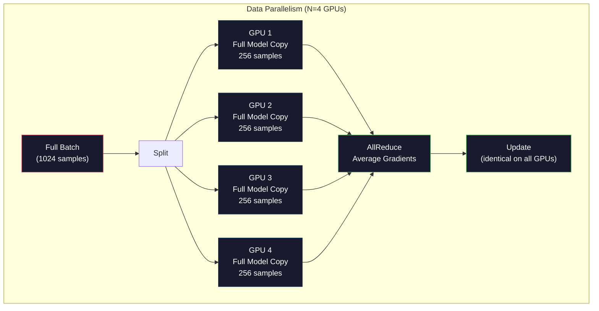
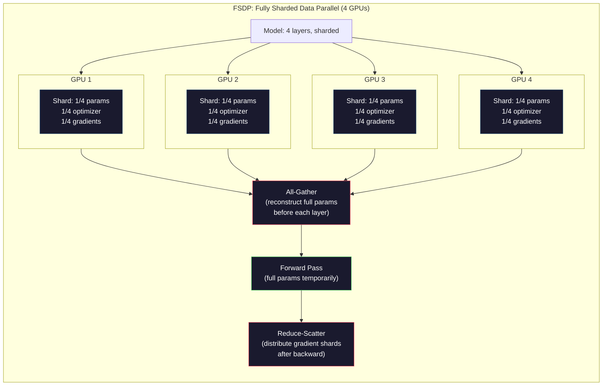
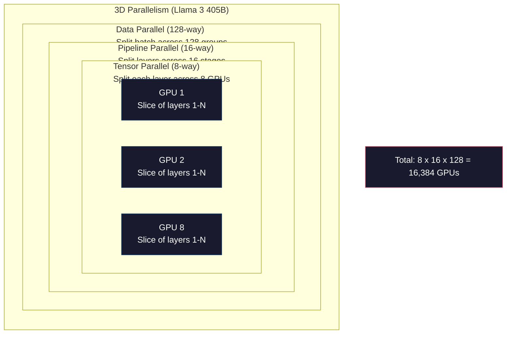

# スケーリング: 分散学習、FSDP、DeepSpeed

> 124Mモデルは1枚のGPUで学習できました。では70億パラメータに挑戦してみましょう。モデルはメモリに収まりません。データは1台のマシンでは数週間かかります。大規模では分散学習は任意ではありません。前に進むための唯一の道です。

**種類:** Build
**言語:** Python
**前提条件:** フェーズ10、レッスン04（Mini GPTの事前学習）
**所要時間:** 約120分

## 学習目標

- 3種類の並列化（データ、テンソル、パイプライン）を説明し、モデルサイズとクラスタサイズに応じてどれが必要になるか判断する
- PyTorch DDPを使って、複数GPU間で勾配を同期するデータ並列学習を実装する
- 指定されたモデルサイズのメモリ予算（重み + オプティマイザ状態 + 勾配 + 活性化）を計算し、必要な最小ハードウェアを見積もる
- FSDPまたはDeepSpeed ZeROのステージを設定し、モデル状態をGPU間でシャーディングして、単一GPUメモリを超えるモデルを収める

## 問題

70億パラメータのモデルは、FP16では重みだけで14GB必要です。Adamオプティマイザは各パラメータについて追加のコピーを2つ（一次モーメントと二次モーメントの推定値）保持します。これだけでさらに28GBです。逆伝播中の勾配がさらに14GBを追加します。活性化を1つも保存する前に、すでに56GBです。

NVIDIA A100のメモリは80GBです。

80GBのうち56GBを消費しました。残りは24GBです。ここに入れる必要があるのは活性化、つまり順伝播で計算され、逆伝播のために保持しなければならない中間値です。2048トークンのシーケンスと4096次元モデルの場合、1層分の活性化だけで約64MBを使います。32層なら1サンプルあたり2GBです。バッチサイズ8なら16GB。残りは24GBです。バッチサイズ12にすると破綻します。

次に700億パラメータを試します。重みだけでFP16では140GBです。1枚のGPUには入りません。重みを保持するだけでも少なくともA100が2枚（2 x 80GB = 160GB）必要です。オプティマイザ状態と勾配を加えるとさらに多く必要です。最低でも3枚以上、シャーディング戦略によっては現実的には8から16枚が必要になります。

Llama 3 405Bは16,384枚のNVIDIA H100 GPUで学習されました。この学習実行の計算コストは推定1億ドルです。DeepSeek V3は、アーキテクチャ（Mixture of Expertsにより、各トークンで有効化されるパラメータは一部だけ）と学習効率を工夫することで、同程度のモデルを約560万ドルで学習しました。

このレッスンでは、大規模学習を可能にする4つの戦略、データ並列、テンソル並列、パイプライン並列、完全シャーディングデータ並列を扱います。分散学習フレームワークに触れる前に、まず純粋なPythonでそれぞれをシミュレートし、仕組みを理解します。

## 概念

### なぜ分散が必要なのか

実際のモデルのメモリ計算を見てみましょう。すべての数値は見積もりではなく計算値です。

| モデル | パラメータ | 重み (FP16) | Adam状態 | 勾配 (FP16) | 合計（活性化なし） |
|-------|--------|----------------|-------------|------------------|----------------------|
| GPT-2 Small | 124M | 248 MB | 992 MB | 248 MB | 1.5 GB |
| Llama 3 8B | 8B | 16 GB | 64 GB | 16 GB | 96 GB |
| Llama 3 70B | 70B | 140 GB | 560 GB | 140 GB | 840 GB |
| Llama 3 405B | 405B | 810 GB | 3,240 GB | 810 GB | 4,860 GB |

「Adam状態」の列が致命的です。Adamは各パラメータについて、移動平均 (m) と移動分散 (v) をどちらもFP32で保持します。70Bモデルでは、70B x 4バイト x 2 = 560GBです。オプティマイザだけでA100が7枚必要です。

H100単体のメモリは80GBです。Llama 3 405Bでは、重み、オプティマイザ、勾配を保持するだけでも少なくとも61枚のH100が必要です。活性化を加えると必要枚数はさらに増えます。Metaが16,384枚のGPUを使ったのは、使いたかったからではありません。そうしなければならなかったからです。

### データ並列

最も単純な分散戦略です。モデル全体をN枚のGPUにコピーします。各学習バッチをN個の等しい部分に分割します。各GPUは自分のデータシャードで順伝播と逆伝播を実行します。逆伝播後、すべてのGPU間で勾配を平均します。各GPUは同じ平均勾配で自分の重みコピーを更新し、すべてのコピーを同期状態に保ちます。

**利点:** スループットが線形に伸びます。N枚のGPUは1ステップあたりN倍のデータを処理します。通信は勾配平均に限られ、計算と重ね合わせられます。

**欠点:** すべてのGPUがモデル、オプティマイザ状態、勾配の完全なコピーを保持します。70Bモデルでは各GPUに840GBが必要です。データ並列はGPUあたりのメモリをまったく減らしません。短縮するのは学習時間だけです。

**計算:** 実効バッチサイズ = per_gpu_batch_size x N。N=64 GPUでGPUあたりバッチ16なら、実効バッチは1,024です。Llama 3は1ステップあたり1,600万トークンの実効バッチサイズを使いました。



### テンソル並列

個々の層をGPU間で分割します。1つの行列乗算をGPU間で分割し、各GPUが結果の一部を計算します。

フィードフォワード層にある形状 (8192, 8192) の重み行列を考えます。4-wayテンソル並列では、各GPUが (8192, 2048) のシャードを保持します。各GPUは入力に自分のシャードを掛け、部分結果を生成します。部分結果を（all-reduceまたはall-gatherで）結合し、完全な出力を作ります。

**利点:** モデル重みのGPUあたりメモリを減らします。70Bモデルを8枚のGPUに分割すると、各GPUが保持する重みは約8.75Bパラメータ分になります。

**欠点:** 各層の後に高速なGPU間通信が必要です。各matmul後のall-reduceがレイテンシを追加します。同一ノード内GPU間のNVLink（900 GB/s）ではうまく機能しますが、InfiniBand（400 Gb/s、約50 GB/s）で接続されたノード間では不利です。テンソル並列はほぼ常に単一ノード内（8 GPU）に限定されます。

**実運用:** Megatron-LMがテンソル並列を先駆けました。Llama 3 405Bは各ノード内で8-wayテンソル並列を使います。

### パイプライン並列

モデルを層ごとに分割します。GPU 1は1-8層を実行します。GPU 2は9-16層を実行します。GPU 3は17-24層を実行します。GPU 4は25-32層を実行します。データはパイプラインを流れます。GPU 1が自分の層を計算して活性化をGPU 2へ送り、GPU 2が自分の層を計算してGPU 3へ送る、という流れです。

**利点:** GPU間通信が最小です。層境界の活性化だけを送ればよく、これは勾配や重みと比べて小さいです。帯域要件が低いため、ノードをまたいでも機能します。

**欠点:** パイプラインバブルがあります。GPU 4がマイクロバッチ1の順伝播を計算している間、GPU 1、2、3は（自分の担当部分をすでに転送済みなので）アイドルです。逆伝播中はこのパターンが逆になります。素朴なパイプラインでは、N個のパイプラインステージに対するGPU利用率は1/Nに過ぎません。

**GPipeとPipeDream** は、バッチをマイクロバッチに分割することでバブル問題を解きます。GPU 1はマイクロバッチ1の転送が終わるとすぐにマイクロバッチ2を開始します。これによりパイプラインステージ間で計算が重なります。M個のマイクロバッチとNステージでは、バブル率は (N-1)/M まで下がります。N=4ステージでM=16マイクロバッチを使うと、バブルは3/16 = 18.75%のアイドル時間です。

### FSDP: 完全シャーディングデータ並列

FSDPは、データ並列のスケーラビリティとシャーディングのメモリ効率を組み合わせます。各GPUがモデル全体のコピーを持つ代わりに、各GPUはパラメータ、勾配、オプティマイザ状態の1/Nだけを保持します。

ある層の順伝播前に、FSDPは **all-gather** を実行し、すべてのGPUから完全なパラメータを集めて各GPUのメモリ上に再構築します。順伝播後、各GPUはローカルでないパラメータを破棄します。逆伝播中にも、勾配計算のためにパラメータを再構築するall-gatherが再度実行されます。逆伝播後、**reduce-scatter** が勾配シャードを分配し、各GPUが勾配の1/Nだけを保存するようにします。

**8 GPU上の70Bモデルの計算:**

| コンポーネント | FSDPなし | FSDPあり |
|-----------|-------------|-----------|
| 重み (FP16) | GPUあたり140 GB | GPUあたり17.5 GB |
| Adam状態 (FP32) | GPUあたり560 GB | GPUあたり70 GB |
| 勾配 (FP16) | GPUあたり140 GB | GPUあたり17.5 GB |
| **合計** | **GPUあたり840 GB** | **GPUあたり105 GB** |

FSDPなしでは、70Bモデルは1枚の80GB GPUに収まりません。8 GPUでFSDPを使うと、各GPUは105GB使います。待ってください、それでも収まりません。GPUあたり80GB未満にするには少なくとも16 GPUが必要です。あるいはFSDPと活性化チェックポイント（活性化を保存せず、逆伝播中に再計算する）を組み合わせます。

各層の前にall-gatherが必要なため、通信コストは通常のデータ並列より高くなります。それでも、メモリ節約により、それまで不可能だった学習実行が可能になります。



### DeepSpeed ZeRO

DeepSpeedのZeRO（Zero Redundancy Optimizer）は概念的にはFSDPと同じですが、Microsoftによって独立に開発されました。ZeROは3つのステージを定義し、ステージが進むほどより積極的にシャーディングします。

| ステージ | シャーディング対象 | メモリ節約 | 通信 |
|-------|--------|---------------|---------------|
| ZeRO-1 | オプティマイザ状態のみ | 約4倍削減 | データ並列と同じ |
| ZeRO-2 | + 勾配 | 約8倍削減 | やや増える |
| ZeRO-3 | + パラメータ | 約N倍削減（N GPU） | 層ごとにall-gather |

ZeRO-3はFSDPと同等です。名前は違いますが、仕組みは同じです。DeepSpeedがこの概念を実証した後、PyTorchはネイティブ実装としてFSDPを追加しました。

DeepSpeedはZeRO-Offload（オプティマイザ状態を、より安価で大容量なCPU RAMへオフロードする）とZeRO-Infinity（NVMe SSDへオフロードする）も導入しました。これらは計算速度をメモリ容量と交換する手法です。オフロードされた処理は遅くなりますが、GPUメモリを解放します。

### 混合精度学習

現代の学習では、複数の浮動小数点フォーマットを同時に使います。

- **順伝播**: FP16またはBF16（16ビット）。FP32の半分のメモリです。テンソルコア上ではmatmulが2倍高速に動きます。
- **マスター重み**: FP32（32ビット）。重み更新時の数値精度のために、オプティマイザが保持します。
- **損失スケーリング**: FP16勾配がゼロへアンダーフローするのを防ぐため、逆伝播前に損失へ大きな定数を掛けます。オプティマイザステップ前に同じ定数で割ります。

BF16（Brain Float 16）はFP32と同じ指数範囲（指数8ビット）を持ちますが、精度は低くなります（仮数7ビット、FP32は23ビット）。同じ値域を表現できるため、通常は損失スケーリングをほとんど必要としません。FP16は指数5ビット、仮数10ビットです。細かい値は表現できますが、極端な大きさではオーバーフローやアンダーフローが発生します。

GoogleのTPUはBF16をネイティブに使います。NVIDIAのA100とH100はFP16とBF16の両方をサポートします。損失スケーリングの煩雑さをなくせるため、業界は概ねBF16へ移行しました。

**7Bモデルのメモリ比較:**

| 精度 | 重み | オプティマイザ | 勾配 | 合計 |
|-----------|---------|-----------|-----------|-------|
| すべてFP32 | 28 GB | 56 GB | 28 GB | 112 GB |
| 混合 (BF16 + FP32 master) | 14 GB | 56 GB | 14 GB | 84 GB |

このモデルでは混合精度により28GB節約できます。オプティマイザ状態は精度に関係なくFP32のままです。メモリの大半はここで消費されます。

### Megatron-LMと3D並列

実際の大規模学習では、3種類の並列化すべてを組み合わせます。

- **データ並列** をノードグループ間で使う（バッチサイズをスケールする）
- **テンソル並列** をノード内で使う（層を8 GPUに分割する）
- **パイプライン並列** をノード間で使う（層グループをマシン間で分割する）

16,384枚のH100上のLlama 3 405B:
- 各ノード内で8-wayテンソル並列（1ノードあたり8 GPU）
- ノード間で16-wayパイプライン並列（16パイプラインステージ）
- 残りの次元で128-wayデータ並列（16,384 / 8 / 16 = 128）

この3D分解（8 x 16 x 128 = 16,384）によって、数千GPUへスケールできます。各GPUは異なるデータシャードを見て（データ並列）、各層の1スライスを保持し（テンソル並列）、異なる層の集合を計算します（パイプライン並列）。

DeepSeek V3は別のアプローチを取りました。Mixture of Expertsアーキテクチャでは、671Bパラメータのうち各トークンで有効化されるのは37Bだけです。つまり各GPUは、有効なパラメータだけを計算し、その活性化だけを保存すればよくなります。彼らは2,048枚のH800 GPUで学習しました。これはMetaのGPU数の1/8未満で、コストも推定1億ドルに対して560万ドルでした。



## 作ってみよう

### ステップ1: データ並列をシミュレートする

バッチをシミュレートされたGPUに分割します。各GPUは自分のシャードで順伝播を計算します。「勾配」を平均します（ここでは損失値としてシミュレートします）。

```python
import numpy as np

def simulate_data_parallelism(data, num_gpus, model_fn):
    batch_size = len(data)
    shard_size = batch_size // num_gpus
    remainder = batch_size % num_gpus

    gpu_losses = []
    gpu_gradients = []

    offset = 0
    for gpu_id in range(num_gpus):
        extra = 1 if gpu_id < remainder else 0
        shard = data[offset:offset + shard_size + extra]
        offset += shard_size + extra

        loss, grad = model_fn(shard)
        gpu_losses.append(loss)
        gpu_gradients.append(grad)

    avg_loss = np.mean(gpu_losses)
    avg_gradient = np.mean(gpu_gradients, axis=0)

    return avg_loss, avg_gradient
```

all-reduce操作（勾配の平均）が、データ並列における唯一の通信です。実際には、これはNVIDIA GPU上でNCCLライブラリを使います。NCCLはリングall-reduceを実装しており、各GPUが勾配の1/Nを隣へ送り、反対側の隣から1/Nを受け取り、N-1ステップ後にはすべてのGPUが完全な平均を持ちます。総通信量は 2 x gradient_size x (N-1)/N で、大きなNでは勾配サイズの約2倍に近づきます。

### ステップ2: テンソル並列をシミュレートする

重み行列をGPU間で分割します。各GPUは部分的な行列乗算を計算します。結果を結合します。

```python
def simulate_tensor_parallelism(input_data, weight_matrix, num_gpus):
    d_in, d_out = weight_matrix.shape
    assert d_out % num_gpus == 0, f"d_out {d_out} not divisible by num_gpus {num_gpus}"
    shard_size = d_out // num_gpus

    partial_results = []
    for gpu_id in range(num_gpus):
        start = gpu_id * shard_size
        end = start + shard_size
        weight_shard = weight_matrix[:, start:end]

        partial = input_data @ weight_shard
        partial_results.append(partial)

    full_output = np.concatenate(partial_results, axis=-1)

    direct_output = input_data @ weight_matrix
    error = np.abs(full_output - direct_output).max()

    return full_output, error
```

誤差は正確にゼロ（または機械イプシロン）になるはずです。テンソル並列は数学的に厳密です。1枚のGPUで完全なmatmulを計算した場合と同じ結果を生成します。分割は出力次元に沿って行われるため、各GPUは異なる列チャンクを生成し、連結によって完全な結果を再構築します。

列並列の線形層（出力次元を分割する場合）では連結します。行並列（入力次元を分割する場合）では合計します。TransformerのFFNでは、最初の線形層（拡張）が列並列を使い、2番目の線形層（縮小）が行並列を使います。これにより、2層の間のall-reduceを避けられます。

### ステップ3: パイプライン並列をシミュレートする

モデルの層を仮想GPU間で分割します。後段ステージが計算している間に前段ステージがアイドルになる、バブル問題を示します。

```python
def simulate_pipeline_parallelism(num_layers, num_stages, num_microbatches):
    layers_per_stage = num_layers // num_stages

    timeline = {}
    clock = 0

    for mb in range(num_microbatches):
        for stage in range(num_stages):
            start_time = max(
                timeline.get((stage, mb - 1, "fwd"), (0, 0))[1] if mb > 0 else 0,
                timeline.get((stage - 1, mb, "fwd"), (0, 0))[1] if stage > 0 else 0,
            )
            end_time = start_time + layers_per_stage
            timeline[(stage, mb, "fwd")] = (start_time, end_time)

    last_fwd_end = max(v[1] for v in timeline.values())

    for mb in range(num_microbatches - 1, -1, -1):
        for stage in range(num_stages - 1, -1, -1):
            deps = [last_fwd_end]
            if mb < num_microbatches - 1 and (stage, mb + 1, "bwd") in timeline:
                deps.append(timeline[(stage, mb + 1, "bwd")][1])
            if stage < num_stages - 1 and (stage + 1, mb, "bwd") in timeline:
                deps.append(timeline[(stage + 1, mb, "bwd")][1])
            start_time = max(deps)
            end_time = start_time + layers_per_stage
            timeline[(stage, mb, "bwd")] = (start_time, end_time)

    total_time = max(v[1] for v in timeline.values())
    compute_time = num_microbatches * num_stages * layers_per_stage * 2
    bubble_fraction = 1.0 - compute_time / (total_time * num_stages)

    return timeline, total_time, bubble_fraction
```

4ステージでマイクロバッチが1つの場合、バブル率は75%です。常に4枚中3枚のGPUがアイドルになります。16マイクロバッチでは約19%まで下がります。バブルを減らす代償はメモリです。飛行中のすべてのマイクロバッチについて、活性化を同時に保存しなければなりません。

### ステップ4: メモリ計算機

任意のモデルサイズについて、学習に必要な正確なメモリ量を計算します。

```python
def memory_calculator(
    params_billions,
    precision_bytes=2,
    optimizer="adam",
    num_gpus=1,
    sharding="none",
    sequence_length=2048,
    batch_size_per_gpu=1,
    hidden_dim=None,
    num_layers=None,
):
    params = params_billions * 1e9

    weight_memory = params * precision_bytes

    if optimizer == "adam":
        optimizer_memory = params * 4 * 2
    elif optimizer == "sgd":
        optimizer_memory = params * 4
    else:
        optimizer_memory = 0

    gradient_memory = params * precision_bytes

    total_no_activation = weight_memory + optimizer_memory + gradient_memory

    if hidden_dim and num_layers:
        activation_per_layer = (
            sequence_length * batch_size_per_gpu * hidden_dim * precision_bytes * 4
        )
        activation_memory = activation_per_layer * num_layers
    else:
        activation_memory = params * precision_bytes * 0.5

    if sharding == "fsdp" or sharding == "zero3":
        weight_memory /= num_gpus
        optimizer_memory /= num_gpus
        gradient_memory /= num_gpus
    elif sharding == "zero2":
        optimizer_memory /= num_gpus
        gradient_memory /= num_gpus
    elif sharding == "zero1":
        optimizer_memory /= num_gpus

    per_gpu_total = weight_memory + optimizer_memory + gradient_memory + activation_memory

    return {
        "params_billions": params_billions,
        "weights_gb": weight_memory / 1e9,
        "optimizer_gb": optimizer_memory / 1e9,
        "gradients_gb": gradient_memory / 1e9,
        "activations_gb": activation_memory / 1e9,
        "per_gpu_total_gb": per_gpu_total / 1e9,
        "total_across_gpus_gb": per_gpu_total * num_gpus / 1e9,
        "fits_on_80gb": per_gpu_total / 1e9 <= 80,
        "num_gpus": num_gpus,
        "sharding": sharding,
    }
```

この計算機は、すべてのMLエンジニアが問う「何枚のGPUが必要か？」に答えます。モデルサイズを入力し、収まるか確認します。GPUあたり合計が80GB未満になるまで、シャーディング戦略を調整します。

### ステップ5: 混合精度のシミュレーション

FP32、FP16、混合精度学習のメモリ使用量を比較します。

```python
def mixed_precision_comparison(params_billions):
    params = params_billions * 1e9

    fp32_weights = params * 4
    fp32_optimizer = params * 4 * 2
    fp32_gradients = params * 4
    fp32_total = fp32_weights + fp32_optimizer + fp32_gradients

    fp16_weights = params * 2
    fp16_master = params * 4
    fp16_optimizer = params * 4 * 2
    fp16_gradients = params * 2
    fp16_total = fp16_weights + fp16_master + fp16_optimizer + fp16_gradients

    mixed_weights = params * 2
    mixed_optimizer = params * 4 * 2
    mixed_gradients = params * 2
    mixed_total = mixed_weights + mixed_optimizer + mixed_gradients

    return {
        "fp32_total_gb": fp32_total / 1e9,
        "fp16_with_master_gb": fp16_total / 1e9,
        "mixed_bf16_gb": mixed_total / 1e9,
        "savings_vs_fp32": 1 - mixed_total / fp32_total,
    }
```

多くの人にとって意外なのは、混合精度がメモリを半分にはしないことです。オプティマイザ状態（Adamのmとv）は精度に関係なくFP32のままです。7Bモデルでは、FP32学習は112GBを使います。混合精度は84GBです。削減率は50%ではなく25%です。オプティマイザが支配的なのです。

## 使ってみよう

### すべてのシミュレーションを実行する

```python
def run_all_demos():
    print("=" * 70)
    print("DATA PARALLELISM SIMULATION")
    print("=" * 70)

    np.random.seed(42)
    data = np.random.randn(64, 32)
    weight = np.random.randn(32, 16)

    def model_fn(batch):
        output = batch @ weight
        loss = np.mean(output ** 2)
        grad = 2 * batch.T @ (batch @ weight) / len(batch)
        return loss, grad

    for n_gpus in [1, 2, 4, 8]:
        loss, grad = simulate_data_parallelism(data, n_gpus, model_fn)
        print(f"  {n_gpus} GPUs: loss={loss:.4f}, grad_norm={np.linalg.norm(grad):.4f}")

    print()
    print("=" * 70)
    print("TENSOR PARALLELISM SIMULATION")
    print("=" * 70)

    x = np.random.randn(4, 8192)
    W = np.random.randn(8192, 8192)

    for n_gpus in [1, 2, 4, 8]:
        output, error = simulate_tensor_parallelism(x, W, n_gpus)
        print(f"  {n_gpus} GPUs: output_shape={output.shape}, max_error={error:.2e}")

    print()
    print("=" * 70)
    print("PIPELINE PARALLELISM SIMULATION")
    print("=" * 70)

    for n_mb in [1, 4, 8, 16, 32]:
        _, total_t, bubble = simulate_pipeline_parallelism(32, 4, n_mb)
        print(f"  {n_mb:2d} micro-batches: total_time={total_t:4d}, bubble={bubble:.1%}")

    print()
    print("=" * 70)
    print("MEMORY CALCULATOR")
    print("=" * 70)

    configs = [
        (7, "none", 1),
        (7, "fsdp", 8),
        (70, "none", 1),
        (70, "fsdp", 8),
        (70, "fsdp", 16),
        (405, "fsdp", 64),
        (405, "fsdp", 128),
    ]

    print(f"  {'Model':>8} {'Sharding':>8} {'GPUs':>5} {'Per-GPU':>10} {'Fits 80GB':>10}")
    print("  " + "-" * 50)
    for params, shard, gpus in configs:
        result = memory_calculator(params, num_gpus=gpus, sharding=shard)
        fits = "Yes" if result["fits_on_80gb"] else "No"
        print(f"  {params:>6}B {shard:>8} {gpus:>5} {result['per_gpu_total_gb']:>8.1f}GB {fits:>10}")

    print()
    print("=" * 70)
    print("MIXED PRECISION COMPARISON")
    print("=" * 70)

    for params_b in [7, 13, 70, 405]:
        result = mixed_precision_comparison(params_b)
        print(f"  {params_b}B: FP32={result['fp32_total_gb']:.0f}GB, "
              f"Mixed BF16={result['mixed_bf16_gb']:.0f}GB, "
              f"Savings={result['savings_vs_fp32']:.0%}")
```

## 出荷しよう

このレッスンでは `outputs/prompt-distributed-training-planner.md` を作成します。これは、モデルサイズと利用可能なハードウェアを受け取り、並列化戦略、メモリ予算、通信オーバーヘッド、期待スループットを含む完全な分散学習計画を生成するプロンプトです。

## 演習

1. メモリ計算機を修正して、活性化チェックポイントを含めましょう。チェックポイントでは、K層ごとにのみ活性化を保存します（典型的なK=1は、すべて再計算することを意味します）。メモリと計算のトレードオフを示してください。チェックポイントはどれだけメモリを節約し、どれだけ学習を遅くするでしょうか（完全チェックポイントでは、おおよそ33%多い計算が必要です）。

2. パイプライン並列シミュレーションを拡張し、PipeDreamで使われる1F1B（one forward, one backward）スケジュールを実装しましょう。4ステージ、8マイクロバッチで、素朴なスケジュールとバブル率を比較してください。1F1Bスケジュールは逆伝播を早く開始するため、ピークメモリが小さくなるはずです。

3. 勾配蓄積シミュレータを実装しましょう。各マイクロバッチ後にall-reduceする代わりに、Kステップ分の勾配をローカルに蓄積してからall-reduceします。通信がK分の1に減る一方で、最終的な勾配（したがって学習）は同一になることを示してください。

4. コスト見積もり器を作りましょう。モデルサイズ、目標トークン数、GPU種類（A100は$2/hr、H100は$3.50/hr）、並列化戦略を与え、総学習コストをドルで見積もります。既知のコストで検証してください。Llama 3 405Bは約1億ドル、DeepSeek V3は約560万ドルかかったと報告されています。

5. メモリ計算機にZeRO-Offloadを追加しましょう。CPU RAMはノードあたり512GB、NVMeは2TBと仮定します。オプティマイザ状態をCPUへオフロードすると、70Bモデルを16 GPUではなく4 GPUで学習できるようになる一方、オプティマイザステップが30-50%遅くなることを示してください。

## 重要用語

| 用語 | よく言われる説明 | 実際の意味 |
|------|----------------|----------------------|
| データ並列 | 「モデルをすべてのGPUへコピーする」 | 各GPUが異なるデータシャードを処理し、各ステップ後に勾配をall-reduceで平均する |
| テンソル並列 | 「層をGPU間で分割する」 | 重み行列を分割し、各GPUがmatmulの一部を計算する。高速なNVLink接続が必要 |
| パイプライン並列 | 「層をGPU間で分割する」 | 各GPUが異なる層グループを実行する。データはマイクロバッチでパイプラインを流れ、バブルを減らす |
| FSDP | 「すべてをシャーディングする」 | Fully Sharded Data Parallel。各GPUが重み、勾配、オプティマイザ状態の1/Nを保持し、計算前にall-gatherする |
| ZeRO | 「DeepSpeed版のFSDP」 | 3ステージのZero Redundancy Optimizer。オプティマイザをシャード（Stage 1）、+ 勾配（Stage 2）、+ パラメータ（Stage 3） |
| All-reduce | 「GPU間で平均する」 | 各GPUが全GPU入力の合計（または平均）を最終的に持つ集合通信。通常はリングall-reduceで実装される |
| All-gather | 「すべてのGPUから集める」 | 各GPUが全GPUデータを連結した結果を最終的に持つ集合通信。FSDPで完全なパラメータを再構築するために使う |
| Reduce-scatter | 「合計して分配する」 | データをreduce（合計）し、異なるチャンクを異なるGPUへscatterする集合通信。FSDPで勾配シャーディングに使う |
| 混合精度 | 「半精度で学習する」 | 順伝播/逆伝播にFP16/BF16を使い、オプティマイザ状態にFP32を使う。オプティマイザが支配的なため、メモリ節約は50%ではなく約25% |
| パイプラインバブル | 「パイプライン内のアイドル時間」 | GPUが前段ステージからのデータを待ってアイドルになる時間の割合。マイクロバッチを増やすことで減らせる |

## 参考文献

- [Rajbhandari et al., 2020 -- "ZeRO: Memory Optimizations Toward Training Trillion Parameter Models"](https://arxiv.org/abs/1910.02054) -- 3つのシャーディングステージを定義したDeepSpeed ZeROの論文
- [Shoeybi et al., 2020 -- "Megatron-LM: Training Multi-Billion Parameter Language Models Using Model Parallelism"](https://arxiv.org/abs/1909.08053) -- Transformer向けのNVIDIAのテンソル並列
- [Narayanan et al., 2021 -- "Efficient Large-Scale Language Model Training on GPU Clusters Using Megatron-LM"](https://arxiv.org/abs/2104.04473) -- データ、テンソル、パイプラインを組み合わせる3D並列
- [Zhao et al., 2023 -- "PyTorch FSDP: Experiences on Scaling Fully Sharded Data Parallel"](https://arxiv.org/abs/2304.11277) -- PyTorchネイティブのFSDP実装
- [Llama 3 Technical Report](https://arxiv.org/abs/2407.21783) -- 16,384 GPU学習と3D並列の詳細
- [DeepSeek-V3 Technical Report](https://arxiv.org/abs/2412.19437) -- MoEアーキテクチャが学習コストを一桁削減する仕組み
