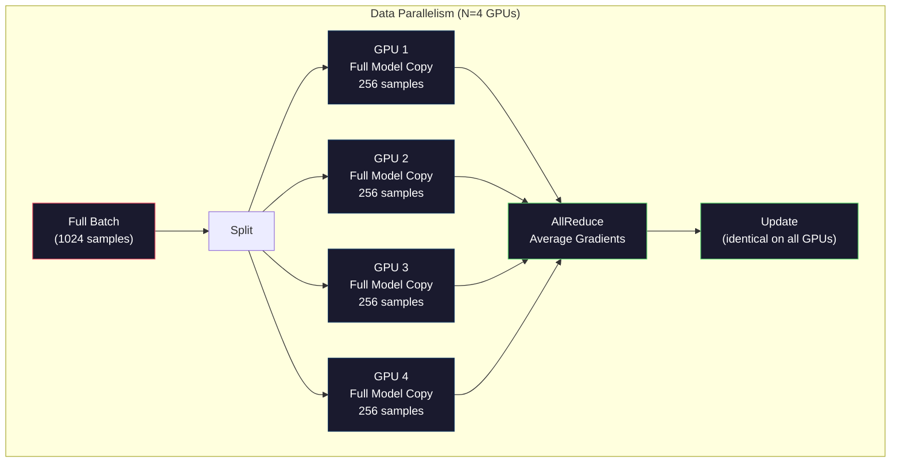
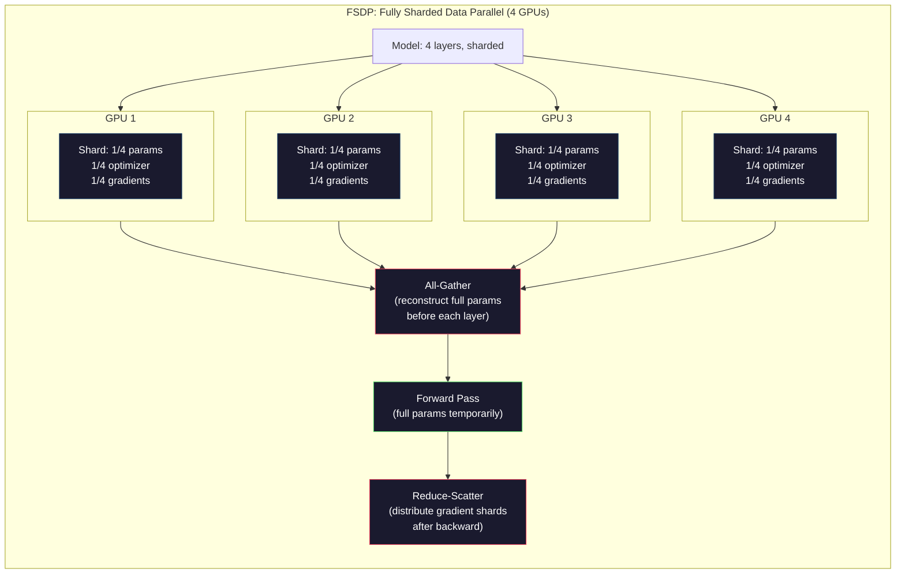
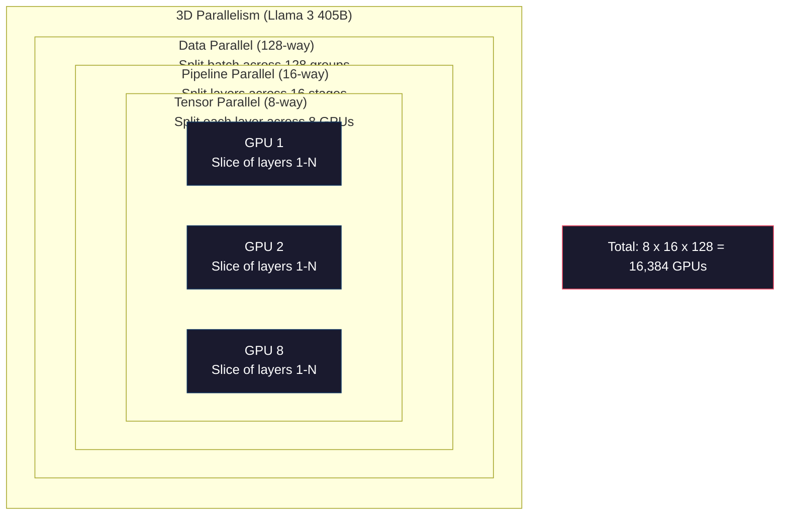

# Ölçeklendirme: Dağıtılmış Eğitim, FSDP, DeepSpeed

> 124M modeliniz tek GPU üzerinde eğitilmiştir. Şimdi 7 milyar parametreyi deneyin. Model belleğe sığmıyor. Verilerin tek bir makinede işlenmesi haftalar alır. Dağıtılmış eğitim geniş ölçekte isteğe bağlı değildir. İleriye giden tek yol bu.

**Tür:** Yapım
**Diller:** Python
**Önkoşullar:** Aşama 10, Ders 04 (Mini GPT Ön Eğitimi)
**Süre:** ~120 dakika

## Öğrenme Hedefleri

- Üç tür paralelliği (veri, tensör, boru hattı) ve model ve küme boyutuna göre her birinin ne zaman gerekli olduğunu açıklayın
- Birden fazla GPU arasında gradient senkronizasyonu ile PyTorch DDP kullanarak veri paralel eğitimi uygulayın
- Minimum donanımı belirlemek için belirli bir model boyutuna (ağırlıklar + optimizer durumları + gradient'ler + aktivasyonlar) ilişkin bellek bütçesini hesaplayın
- GPU'lar arasında model durumlarını parçalamak ve tek GPU belleğini aşan modelleri sığdırmak için FSDP veya DeepSpeed Zero aşamalarını yapılandırın

## Sorun

FP16'daki 7B parametreli modelin yalnızca ağırlıklar için 14 GB'a ihtiyacı vardır. Adam optimizer, her parametrenin (birinci ve ikinci moment tahminleri) iki ek kopyasını saklar. Bu başka bir 28GB. backpropagation sırasındaki Gradient'ler 14 GB daha ekler. Tek bir aktivasyon saklanmadan önce 56 GB'tasınız.

NVIDIA A100'ün 80 GB belleği vardır.

80GB'ın 56GB'ı tüketildi. Geriye aktivasyonlar için 24 GB kalıyor; ileri geçiş sırasında hesaplanan ve backpropagation için canlı tutulması gereken ara değerler. 4096 boyutlu bir modele sahip bir 2048-token dizisi için, tek bir katmanın aktivasyonları yaklaşık 64MB kullanır. 32 katmanla örnek başına 2 GB'a ihtiyacınız vardır. 8'lik bir parti boyutu 16 GB gerektirir. 24 GB'ınız var. 12'lik bir parti büyüklüğü patlıyor.

Şimdi 70B parametrelerini deneyin. Yalnızca ağırlıklar: FP16'da 140 GB. Tek bir GPU'ya sığmaz. Ağırlıkları taşıyabilmek için en az 2 adet A100'e (2 x 80GB = 160GB) ihtiyacınız var. Optimize edici durumları ve gradient'leri eklediğinizde çok daha fazlasına ihtiyacınız olur: minimum 3+ GPU ve parçalama stratejisine bağlı olarak gerçekçi olarak 8-16.

Llama 3 405B, 16.384 NVIDIA H100 GPU'yla eğitildi. Mimari (Uzmanların Karması, token başına parametrelerin yalnızca bir kısmının etkinleştirilmesi anlamına gelir) ve eğitim verimliliği konusunda akıllı olunması nedeniyle eğitim çalışmasının maliyeti tahmini $100 million in compute. DeepSeek V3 trained a comparable model for roughly $5,6 milyondur.

Bu ders, büyük ölçekli eğitimi mümkün kılan dört stratejiyi kapsar: veri paralelliği, tensör paralelliği, ardışık düzen paralelliği ve tamamen parçalanmış veri paralelliği. Dağıtılmış bir eğitim framework'ye dokunmadan önce mekaniği anlamak için her birini saf Python'da simüle edeceksiniz.

## Konsept

### Dağıtım Neden Gereklidir?

İşte gerçek modeller için hafıza matematiği. Her sayı hesaplanır, tahmin edilmez.

| Modeli | Parametreler | Ağırlıklar (FP16) | Adam Devletleri | Gradient'ler (FP16) | Toplam (aktivasyon yok) |
|-------|--------|----------------|-------------|------------------|----------------------|
| GPT-2 Küçük | 124M | 248 MB | 992 MB | 248 MB | 1,5GB |
| Lama 3 8B | 8B | 16GB | 64GB | 16GB | 96GB |
| Lama 3 70B | 70B | 140GB | 560GB | 140GB | 840GB |
| Lama 3 405B | 405B | 810GB | 3.240 GB | 810GB | 4.860 GB |

"Adem Devletleri" sütunu katildir. Adam, her ikisi de FP32'de her parametre için bir çalışan ortalamayı (m) ve bir değişen varyansı (v) saklar. 70B modeli için bu, 70B x 4 bayt x 2 = 560 GB'dir. Optimize edicinin tek başına yedi A100'e ihtiyacı var.

Tek bir H100'de 80 GB bulunur. Llama 3 405B'nin ağırlıkları, optimize ediciyi ve gradient'leri tutabilmesi için en az 61 H100'e ihtiyacı vardır. Aktivasyonlar eklediğinizde sayı daha da artar. Meta, 16.384 GPU'yu istediği için değil, mecbur olduğu için kullandı.

### Veri Paralelliği

En basit dağıtılmış strateji. Modelin tamamını N GPU'lara kopyalayın. Her eğitim grubunu N eşit parçaya bölün. Her GPU, kendi veri parçasında ileri ve geri geçiş gerçekleştirir. Geri geçişten sonra tüm GPU'lardaki gradient'lerin ortalamasını alın. Her GPU, kendi ağırlık kopyasını aynı ortalama gradient'lerle günceller ve tüm kopyaları senkronize halde tutar.

**İyi yönleri:** Doğrusal aktarım hızı ölçeklendirmesi. N GPU'lar adım başına N kat daha fazla veri işler. İletişim, hesaplamayla örtüşen gradient ortalama almayla sınırlıdır.

**Kötü tarafı:** Her GPU modelin, optimize edici durumlarının ve gradient'lerin tam bir kopyasını içerir. 70B modeli için her GPU'nun 840 GB'a ihtiyacı vardır. Veri paralelliği, GPU başına belleği azaltmak için hiçbir şey yapmaz. Sadece eğitim süresini azaltır.

**Matematik:** Etkin toplu iş boyutu = per_gpu_batch_size x N. GPU başına toplu iş sayısı 16 olan N=64 GPU için etkin toplu iş 1.024'tür. Llama 3, adım başına 16 milyon token'lik etkili toplu iş boyutunu kullandı.



### Tensör Paralelliği

Bireysel katmanları GPU'lara bölün. Tek bir matris çarpımı, her biri sonucun hesaplama kısmı olan GPU'lar arasında bölünür.

İleri beslemeli bir katmandaki şeklin (8192, 8192) ağırlık matrisini düşünün. 4 yönlü tensör paralelliğiyle her GPU bir (8192, 2048) parçayı tutar. Her GPU, girişi kendi parçasıyla çarparak kısmi bir sonuç üretir. Kısmi sonuçlar, tam çıktıyı üretmek için birleştirilir (hepsini azaltma veya hepsini toplama yoluyla).

**İyi yönleri:** Model ağırlıkları için GPU başına belleği azaltır. 8 GPU'ya bölünmüş bir 70B modeli, her GPU'nun ~8,75B parametre değerinde ağırlık taşıdığı anlamına gelir.

**Kötü tarafı:** Her katmandan sonra GPU'lar arası hızlı iletişim gerektirir. Her matmul'dan sonraki all-reduce işlemi gecikmeyi artırır. Bu, NVLink ile iyi çalışır (aynı düğümdeki GPU'lar arasında 900 GB/sn), ancak InfiniBand ile bağlanan düğümler arasında zayıf çalışır (400 Gb/sn, yaklaşık 50 GB/sn). Tensör paralelliği neredeyse her zaman tek bir düğüm (8 GPU) ile sınırlıdır.

**Gerçek kullanım:** Megatron-LM tensör paralelliğine öncülük etti. Llama 3 405B, her düğümde 8 yollu tensör paralelliğini kullanır.

### Boru Hattı Paralelliği

Modeli katmanlara bölün. GPU 1, 1-8 arasındaki katmanları çalıştırır. GPU 2, 9-16. katmanları çalıştırır. GPU 3, 17-24. katmanları çalıştırır. GPU 4, 25-32. katmanları çalıştırır. Veriler ardışık düzen üzerinden akar: GPU 1, katmanlarını hesaplar ve etkinleştirmeleri GPU 2'ye gönderir, GPU da katmanlarını hesaplar ve GPU 3'e gönderir, vb.

**İyi tarafı:** GPU'lar arasındaki iletişim minimum düzeydedir; yalnızca katman sınırlarındaki aktivasyonlar, gradient'lere veya ağırlıklara kıyasla küçüktür. Bant genişliği gereksinimleri düşük olduğundan düğümler arasında çalışır.

**Kötü tarafı:** Boru hattında baloncuklar. GPU 4, mikro grup 1'deki ileri geçişi hesaplarken, GPU 1, 2 ve 3 boştadır (kendi paylarını zaten iletmişlerdir). Geriye doğru geçiş sırasında desen tersine döner. Saf ardışık düzen ile GPU kullanımı N ardışık düzen aşaması için yalnızca 1/N'dir.

**GPipe ve PipeDream** kabarcık sorununu, partiyi mikro partilere bölerek çözer. GPU 1, mikro grup 1'i iletmeyi bitirir bitirmez mikro grup 2'de başlar. Bu, ardışık düzen aşamaları boyunca hesaplamayla çakışır. M mikro partiler ve N aşamalarıyla kabarcık fraksiyonu (N-1)/M'ye düşer. N=4 aşamalı M=16 mikro partiler kullanın ve kabarcık 3/16 = %18,75 boşta kalma süresidir.

### FSDP: Tamamen Parçalanmış Veri Paralel

FSDP, veri paralelliğinin ölçeklenebilirliğini parçalamanın bellek verimliliğiyle birleştirir. Her GPU modelin tam bir kopyasını tutmak yerine, her GPU parametrelerin, gradient'lerin ve optimize edici durumlarının yalnızca 1/N'sini tutar.

Bir katmanın ileri geçişinden önce FSDP, tüm GPU'lardaki tüm parametreleri her bir GPU'nun belleğine toplamak için **hepsi toplama** işlemini çalıştırır. İleri geçişten sonra her GPU yerel olmayan parametreleri atar. Geriye doğru sırasında, tüm toplama gradient hesaplaması için parametreleri yeniden oluşturmak üzere yeniden çalışır. Geriye doğru geçişin ardından **dağılımı azalt** gradient parçalarını dağıtır, böylece her GPU gradient'lerin yalnızca 1/N'sini depolar.

**8 GPU'lu 70B modelinin matematiği:**

| Bileşen | FSDP'siz | FSDP ile |
|-----------|-------------|-----------|
| Ağırlıklar (FP16) | GPU başına 140 GB | GPU başına 17,5 GB |
| Adam Devletleri (FP32) | GPU başına 560 GB | GPU başına 70 GB |
| Gradient'ler (FP16) | GPU başına 140 GB | GPU başına 17,5 GB |
| **Toplam** | **GPU başına 840 GB** | **GPU başına 105 GB** |

FSDP olmadan, 70B modelini tek bir 80 GB GPU'ya sığdıramazsınız. 8 GPU'daki FSDP ile her GPU 105 GB kullanır; bekleyin, bu hala uymuyor. GPU başına 80 GB'ın altına inmek için en az 16 GPU'ya ihtiyacınız var veya FSDP'yi etkinleştirme kontrol noktasıyla birleştiriyorsunuz (etkinleştirmeleri depolamak yerine geriye doğru yeniden hesaplayın).

Her katmandan önce tümünün toplanması nedeniyle iletişim maliyeti sıradan veri paralelliğinden daha yüksektir. Ancak bellek tasarrufu, daha önce imkansız olan eğitim çalışmalarını mümkün kılıyor.



### Derin Hız Sıfır

DeepSpeed'in ZeRO'su (Sıfır Artıklık Optimize Edici) kavramsal olarak FSDP ile aynıdır ancak Microsoft tarafından bağımsız olarak geliştirilmiştir. Her biri daha agresif bir şekilde parçalanan üç aşamayı tanımlar:

| Sahne | Parçalar | Bellek Tasarrufu | İletişim |
|-------|--------|---------------|---------------|
| Sıfır-1 | Yalnızca optimize edici durumları | ~4x azalma | Veri paraleliyle aynı |
| Sıfır-2 | + Gradient'ler | ~8x azalma | Biraz daha |
| Sıfır-3 | + Parametreler | ~Nx azaltma (N GPU) | Katman başına tümünü topla |

ZeRO-3, FSDP'ye eşdeğerdir. İsimlendirme farklı, mekanizma aynı. PyTorch, DeepSpeed'in konsepti kanıtlamasının ardından FSDP'yi yerel bir uygulama olarak ekledi.

DeepSpeed ayrıca ZeRO-Offload (yük boşaltma optimizer durumlarını daha ucuz ve daha büyük olan CPU RAM'e) ve ZeRO-Infinity'yi (NVMe SSD'lere boşaltma) tanıttı. Bunlar işlem hızını bellek kapasitesiyle değiştirir; yüksüz işlemler daha yavaştır ancak GPU belleğinde yer açar.

### Karma Hassasiyet Eğitimi

Modern eğitim aynı anda birden fazla kayan nokta formatını kullanır:

- **İleri geçiş**: FP16 veya BF16 (16 bit). FP32'nin belleğinin yarısı. Matmul'lar tensör çekirdeklerinde 2 kat daha hızlı çalışır.
- **Ana ağırlıklar**: FP32 (32 bit). Ağırlık güncellemeleri sırasında sayısal hassasiyet için optimize edici tarafından korunur.
- **Kayıp ölçeklendirme**: FP16 gradient'lerin sıfıra kadar taşmasını önlemek için geri geçişten önce kaybı büyük bir sabitle çarpın. Optimize edici adımdan önce aynı sabite bölün.

BF16 (Brain Float 16), FP32 ile aynı üs aralığına sahiptir (8 üslü bit), ancak hassasiyeti düşüktür (FP32'nin 23'üne karşı 7 mantis biti). Aynı değer aralığını temsil edebildiği için nadiren kayıp ölçeklendirmesine ihtiyaç duyar. FP16'nın 5 üs biti ve 10 mantis biti vardır; ince taneli değerleri temsil edebilir, ancak aşırı büyüklüklerde taşmaları/eksiklikleri temsil edebilir.

Google'ın TPU'ları yerel olarak BF16'yı kullanır. NVIDIA'nın A100 ve H100'ü hem FP16'yı hem de BF16'yı destekler. Sektör büyük ölçüde BF16'ya geçti çünkü kayıp ölçeklendirme sorunlarını ortadan kaldırıyor.

**7B modeli için bellek karşılaştırması:**

| Hassasiyet | Ağırlıklar | Optimize Edici | Gradient'ler | Toplam |
|-----------|---------|-----------|-----------|-------|
| FP32 her yerde | 28GB | 56GB | 28GB | 112GB |
| Karışık (BF16 + FP32 ana) | 14GB | 56GB | 14GB | 84GB |

Karma hassasiyet bu modelde 28 GB tasarruf sağlar. Optimize edici durumları ne olursa olsun FP32'de kalır; belleğin çoğu buraya gider.

### Megatron-LM ve 3D Paralellik

Gerçek büyük ölçekli eğitim üç paralelliğin tümünü birleştirir:

- Düğüm grupları arasında **veri paralelliği** (ölçek toplu iş boyutu)
- Bir düğüm içindeki **Tensör paralelliği** (katmanları 8 GPU'ya bölme)
- Düğümler arasında **boru hattı paralelliği** (katman gruplarını makineler arasında bölme)

16.384 H100'de Lama 3 405B:
- Her düğümde 8 yollu tensör paralelliği (düğüm başına 8 GPU)
- Düğümler arasında 16 yollu boru hattı paralelliği (16 boru hattı aşaması)
- Kalan boyutta 128 yollu veri paralelliği (16,384 / 8 / 16 = 128)

Bu 3 boyutlu ayrıştırma (8 x 16 x 128 = 16.384), binlerce GPU'ya ölçeklendirme yönteminizdir. Her GPU farklı bir veri parçasını görür (veri paralel), her katmanın bir dilimini tutar (tensör paralel) ve farklı bir katman kümesini hesaplar (boru hattı paralel).

DeepSeek V3 farklı bir yaklaşım benimsedi. Uzman Karışımı mimarisi, token başına 671B parametreden yalnızca 37B'sini etkinleştirir. Bu, her GPU'nun yalnızca aktif parametreleri hesaplaması (ve aktivasyonları saklaması) gerektiği anlamına gelir. $5.6M vs Meta's estimated $100M için 2.048 H800 GPU (Meta'nın GPU sayısının 1/8'inden az) üzerinde eğitim aldılar.



```figure
paged-kv-cache
```

## İnşa Et

### Adım 1: Veri Paralelliğini Simüle Edin

Bir grubu simüle edilmiş GPU'lara bölün. Her GPU, kendi parçası üzerinde bir ileri geçiş hesaplar. "gradient"lerin ortalamasını alın (bunları kayıp değerleri olarak simüle ederiz).

```python
import numpy as np

def simulate_data_parallelism(data, num_gpus, model_fn):
    batch_size = len(data)
    shard_size = batch_size // num_gpus
    remainder = batch_size % num_gpus

    gpu_losses = []
    gpu_gradients = []

    offset = 0
    for gpu_id in range(num_gpus):
        extra = 1 if gpu_id < remainder else 0
        shard = data[offset:offset + shard_size + extra]
        offset += shard_size + extra

        loss, grad = model_fn(shard)
        gpu_losses.append(loss)
        gpu_gradients.append(grad)

    avg_loss = np.mean(gpu_losses)
    avg_gradient = np.mean(gpu_gradients, axis=0)

    return avg_loss, avg_gradient
```

Tümünü azaltma işlemi (gradient'lerin ortalamasını alma), veri paralelliğinde tek iletişimdir. Uygulamada bu, NVIDIA GPU'lar üzerindeki NCCL kitaplığını kullanır ve bu kitaplık, ring all-reduce'u uygular: her GPU, gradient'lerinin 1/N'sini komşusuna gönderir, diğer komşusundan 1/N alır ve N-1 adımdan sonra her GPU tam ortalamaya sahip olur. Toplam iletişim hacmi: 2 x gradient_size x (N-1)/N, büyük N için gradient boyutunun 2 katına yaklaşıyor.

### Adım 2: Tensör Paralelliğini Simüle Edin

Ağırlık matrisini GPU'lara bölün. Her GPU kısmi bir matris çarpımını hesaplar. Sonuçları birleştirin.

```python
def simulate_tensor_parallelism(input_data, weight_matrix, num_gpus):
    d_in, d_out = weight_matrix.shape
    assert d_out % num_gpus == 0, f"d_out {d_out} not divisible by num_gpus {num_gpus}"
    shard_size = d_out // num_gpus

    partial_results = []
    for gpu_id in range(num_gpus):
        start = gpu_id * shard_size
        end = start + shard_size
        weight_shard = weight_matrix[:, start:end]

        partial = input_data @ weight_shard
        partial_results.append(partial)

    full_output = np.concatenate(partial_results, axis=-1)

    direct_output = input_data @ weight_matrix
    error = np.abs(full_output - direct_output).max()

    return full_output, error
```

Hata tam olarak sıfır (veya makine epsilon) olmalıdır. Tensör paralelliği matematiksel olarak kesindir; tüm matmul'un tek bir GPU'da hesaplanmasıyla aynı sonucu üretir. Bölünme çıktı boyutu boyunca olduğundan, her GPU farklı bir sütun yığını üretir ve birleştirme, tam sonucu yeniden oluşturur.

Sütun paralel doğrusal katmanlar için (çıktı boyutunu bölerek) birleştirirsiniz. Satır paralelliği için (giriş boyutunu bölmek) toplamı alırsınız. Bir transformer FFN'de, ilk doğrusal (genişletme) sütun paralelini kullanır ve ikinci doğrusal (sözleşme) satır paralelini kullanır. Bu, iki katman arasında tamamen azalmayı önler.

### Adım 3: Boru Hattı Paralelliğini Simüle Edin

Bir modelin katmanlarını sanal GPU'lara bölün. İlk aşamaların boşta kaldığı, sonraki aşamaların ise hesaplama yaptığı kabarcık problemini gösterin.

```python
def simulate_pipeline_parallelism(num_layers, num_stages, num_microbatches):
    layers_per_stage = num_layers // num_stages

    timeline = {}
    clock = 0

    for mb in range(num_microbatches):
        for stage in range(num_stages):
            start_time = max(
                timeline.get((stage, mb - 1, "fwd"), (0, 0))[1] if mb > 0 else 0,
                timeline.get((stage - 1, mb, "fwd"), (0, 0))[1] if stage > 0 else 0,
            )
            end_time = start_time + layers_per_stage
            timeline[(stage, mb, "fwd")] = (start_time, end_time)

    last_fwd_end = max(v[1] for v in timeline.values())

    for mb in range(num_microbatches - 1, -1, -1):
        for stage in range(num_stages - 1, -1, -1):
            deps = [last_fwd_end]
            if mb < num_microbatches - 1 and (stage, mb + 1, "bwd") in timeline:
                deps.append(timeline[(stage, mb + 1, "bwd")][1])
            if stage < num_stages - 1 and (stage + 1, mb, "bwd") in timeline:
                deps.append(timeline[(stage + 1, mb, "bwd")][1])
            start_time = max(deps)
            end_time = start_time + layers_per_stage
            timeline[(stage, mb, "bwd")] = (start_time, end_time)

    total_time = max(v[1] for v in timeline.values())
    compute_time = num_microbatches * num_stages * layers_per_stage * 2
    bubble_fraction = 1.0 - compute_time / (total_time * num_stages)

    return timeline, total_time, bubble_fraction
```

4 aşama ve 1 mikro parti ile kabarcık oranı %75'tir; yani dört GPU'dan üçü herhangi bir zamanda boştadır. 16 mikro parti ile yaklaşık %19'a düşer. Baloncukları ortadan kaldırmanın maliyeti hafızadır: uçuş sırasındaki tüm mikro partiler için aktivasyonları aynı anda saklamanız gerekir.

### Adım 4: Bellek Hesaplayıcı

Herhangi bir model boyutunu eğitmek için tam bellek gereksinimlerini hesaplayın.

```python
def memory_calculator(
    params_billions,
    precision_bytes=2,
    optimizer="adam",
    num_gpus=1,
    sharding="none",
    sequence_length=2048,
    batch_size_per_gpu=1,
    hidden_dim=None,
    num_layers=None,
):
    params = params_billions * 1e9

    weight_memory = params * precision_bytes

    if optimizer == "adam":
        optimizer_memory = params * 4 * 2
    elif optimizer == "sgd":
        optimizer_memory = params * 4
    else:
        optimizer_memory = 0

    gradient_memory = params * precision_bytes

    total_no_activation = weight_memory + optimizer_memory + gradient_memory

    if hidden_dim and num_layers:
        activation_per_layer = (
            sequence_length * batch_size_per_gpu * hidden_dim * precision_bytes * 4
        )
        activation_memory = activation_per_layer * num_layers
    else:
        activation_memory = params * precision_bytes * 0.5

    if sharding == "fsdp" or sharding == "zero3":
        weight_memory /= num_gpus
        optimizer_memory /= num_gpus
        gradient_memory /= num_gpus
    elif sharding == "zero2":
        optimizer_memory /= num_gpus
        gradient_memory /= num_gpus
    elif sharding == "zero1":
        optimizer_memory /= num_gpus

    per_gpu_total = weight_memory + optimizer_memory + gradient_memory + activation_memory

    return {
        "params_billions": params_billions,
        "weights_gb": weight_memory / 1e9,
        "optimizer_gb": optimizer_memory / 1e9,
        "gradients_gb": gradient_memory / 1e9,
        "activations_gb": activation_memory / 1e9,
        "per_gpu_total_gb": per_gpu_total / 1e9,
        "total_across_gpus_gb": per_gpu_total * num_gpus / 1e9,
        "fits_on_80gb": per_gpu_total / 1e9 <= 80,
        "num_gpus": num_gpus,
        "sharding": sharding,
    }
```

Bu hesaplayıcı, her makine öğrenimi mühendisinin sorduğu soruyu yanıtlıyor: "Kaç GPU'ya ihtiyacım var?" Model boyutunu besleyin ve uyup uymadığını görün. GPU başına toplam 80 GB'ın altına düşene kadar parçalama stratejisini ayarlayın.

### Adım 5: Karma Hassas Simülasyon

FP32, FP16 ve karma hassas eğitim arasındaki bellek kullanımını karşılaştırın.

```python
def mixed_precision_comparison(params_billions):
    params = params_billions * 1e9

    fp32_weights = params * 4
    fp32_optimizer = params * 4 * 2
    fp32_gradients = params * 4
    fp32_total = fp32_weights + fp32_optimizer + fp32_gradients

    fp16_weights = params * 2
    fp16_master = params * 4
    fp16_optimizer = params * 4 * 2
    fp16_gradients = params * 2
    fp16_total = fp16_weights + fp16_master + fp16_optimizer + fp16_gradients

    mixed_weights = params * 2
    mixed_optimizer = params * 4 * 2
    mixed_gradients = params * 2
    mixed_total = mixed_weights + mixed_optimizer + mixed_gradients

    return {
        "fp32_total_gb": fp32_total / 1e9,
        "fp16_with_master_gb": fp16_total / 1e9,
        "mixed_bf16_gb": mixed_total / 1e9,
        "savings_vs_fp32": 1 - mixed_total / fp32_total,
    }
```

Çoğu insan için en büyük sürpriz: karışık hassasiyet hafızayı yarıya indirmez. Optimize edici durumlar (Adem'in m ve v'si), hassasiyetten bağımsız olarak FP32'de kalır. 7B modeli için FP32 eğitimi 112 GB kullanır. Karma hassasiyet 84 GB kullanır. Bu %50 değil %25 oranında bir azalmadır. Optimize edici hakimdir.

## Kullan onu

### Tüm Simülasyonları Çalıştır

```python
def run_all_demos():
    print("=" * 70)
    print("DATA PARALLELISM SIMULATION")
    print("=" * 70)

    np.random.seed(42)
    data = np.random.randn(64, 32)
    weight = np.random.randn(32, 16)

    def model_fn(batch):
        output = batch @ weight
        loss = np.mean(output ** 2)
        grad = 2 * batch.T @ (batch @ weight) / len(batch)
        return loss, grad

    for n_gpus in [1, 2, 4, 8]:
        loss, grad = simulate_data_parallelism(data, n_gpus, model_fn)
        print(f"  {n_gpus} GPUs: loss={loss:.4f}, grad_norm={np.linalg.norm(grad):.4f}")

    print()
    print("=" * 70)
    print("TENSOR PARALLELISM SIMULATION")
    print("=" * 70)

    x = np.random.randn(4, 8192)
    W = np.random.randn(8192, 8192)

    for n_gpus in [1, 2, 4, 8]:
        output, error = simulate_tensor_parallelism(x, W, n_gpus)
        print(f"  {n_gpus} GPUs: output_shape={output.shape}, max_error={error:.2e}")

    print()
    print("=" * 70)
    print("PIPELINE PARALLELISM SIMULATION")
    print("=" * 70)

    for n_mb in [1, 4, 8, 16, 32]:
        _, total_t, bubble = simulate_pipeline_parallelism(32, 4, n_mb)
        print(f"  {n_mb:2d} micro-batches: total_time={total_t:4d}, bubble={bubble:.1%}")

    print()
    print("=" * 70)
    print("MEMORY CALCULATOR")
    print("=" * 70)

    configs = [
        (7, "none", 1),
        (7, "fsdp", 8),
        (70, "none", 1),
        (70, "fsdp", 8),
        (70, "fsdp", 16),
        (405, "fsdp", 64),
        (405, "fsdp", 128),
    ]

    print(f"  {'Model':>8} {'Sharding':>8} {'GPUs':>5} {'Per-GPU':>10} {'Fits 80GB':>10}")
    print("  " + "-" * 50)
    for params, shard, gpus in configs:
        result = memory_calculator(params, num_gpus=gpus, sharding=shard)
        fits = "Yes" if result["fits_on_80gb"] else "No"
        print(f"  {params:>6}B {shard:>8} {gpus:>5} {result['per_gpu_total_gb']:>8.1f}GB {fits:>10}")

    print()
    print("=" * 70)
    print("MIXED PRECISION COMPARISON")
    print("=" * 70)

    for params_b in [7, 13, 70, 405]:
        result = mixed_precision_comparison(params_b)
        print(f"  {params_b}B: FP32={result['fp32_total_gb']:.0f}GB, "
              f"Mixed BF16={result['mixed_bf16_gb']:.0f}GB, "
              f"Savings={result['savings_vs_fp32']:.0%}")
```

## Gönderin

Bu ders, bir model boyutunu ve mevcut donanımı alan ve ardından eksiksiz bir dağıtılmış eğitim planı üreten `outputs/prompt-distributed-training-planner.md` -- bir prompt'yi üretir: paralellik stratejisi, bellek bütçesi, iletişim ek yükü ve beklenen verim.

## Egzersizler

1. Bellek hesaplayıcıyı etkinleştirme kontrol noktasını içerecek şekilde değiştirin. Kontrol noktası oluşturmayla, aktivasyonları yalnızca her K. katmanda depolayın (tipik K=1, tümünün yeniden hesaplanması anlamına gelir). Bellek-hesaplama dengesini gösterin: Denetim noktası oluşturma ne kadar bellek tasarrufu sağlar ve eğitimi ne kadar yavaşlatır (tam denetim noktası oluşturma için yaklaşık %33 daha fazla bilgi işlem)?

2. PipeDream tarafından kullanılan 1F1B (bir ileri, bir geri) zamanlamasını uygulamak için ardışık düzen paralellik simülasyonunu genişletin. Kabarcık fraksiyonunu 4 aşama ve 8 mikro parti için saf programla karşılaştırın. 1F1B programı, geriye doğru geçişlere daha erken başladığından dolayı daha küçük bir tepe belleğe sahip olmalıdır.

3. Bir gradient birikim simülatörü uygulayın. Her mikro partiden sonra hepsini azaltmak yerine, gradient'leri K adım için yerel olarak biriktirin, ardından hepsini azaltın. Bunun iletişimi nasıl K kat azalttığını ancak aynı nihai gradient'leri (ve dolayısıyla aynı eğitimi) nasıl ürettiğini gösterin.

4. Bir maliyet tahmin aracı oluşturun. Model boyutu, hedef token sayısı, GPU türü ($2/hr, H100 at $3,50/saatte A100) ve paralellik stratejisi göz önüne alındığında, toplam eğitim maliyetini dolar cinsinden tahmin edin. Bilinen maliyetlere göre doğrulama: Llama 3 405B'nin maliyetinin ~$100M, DeepSeek V3 cost ~$5,6 milyon olduğu bildirildi.

5. Bellek hesaplayıcıya Sıfır Boşaltma ekleyin. CPU RAM'inin düğüm başına 512 GB ve NVMe'nin 2 TB olduğunu varsayalım. Optimize edici durumlarının CPU'ya aktarılmasının, %30-50 daha yavaş optimize edici adımları pahasına 70B modelinin 16 yerine 4 GPU üzerinde eğitim almasına nasıl olanak tanıdığını gösterin.

## Anahtar Terimler

| Dönem | İnsanlar ne diyor | Aslında ne anlama geliyor |
|------|----------------|----------------------|
| Veri paralelliği | "Modeli her GPU'ya kopyalayın" | Her GPU farklı bir veri parçasını işler; gradient'lerin ortalaması, her adımdan sonra tümü azaltılarak alınır |
| Tensör paralelliği | "Bir katmanı GPU'lara böl" | Bölüm ağırlığı matrislerini, her GPU'nun matmulun bir kısmını hesaplaması için ayırın; hızlı NVLink ara bağlantısı gerektirir |
| Boru hattı paralelliği | "Katmanları GPU'lara böl" | Her GPU farklı bir katman grubunu çalıştırır; kabarcıkları azaltmak için veriler mikro gruplar halinde boru hattından akıyor |
| FSDP | "Her şeyi parçala" | Tamamen Parçalanmış Veri Paralel - her GPU 1/N ağırlık, gradient ve optimize edici durumlarını tutar; hesaplamadan önce her şeyi toplayın |
| Sıfır | "DeepSpeed'in FSDP sürümü" | 3 aşamalı Sıfır Artıklık Optimize Edici: parça optimize edici (1. Aşama), + gradient'ler (2. Aşama), + parametreler (3. Aşama) |
| Tamamen azalt | "GPU'lar genelinde ortalama" | Her GPU'nun, tüm GPU girişlerinin toplamı (veya ortalamasıyla) ile bittiği toplu işlem - genellikle ring all-reduce |
| Hepsi bir arada | "Tüm GPU'lardan topla" | Her GPU'nun, tüm GPU verilerinin birleştirilmesiyle sona erdiği toplu işlem - FSDP'de tüm parametreleri yeniden oluşturmak için kullanılır |
| Dağılımı azaltın | "Topla ve dağıt" | Verileri azaltan (toplayan) ve farklı parçaları farklı GPU'lara dağıtan toplu işlem - FSDP'de gradient parçalama için kullanılır |
| Karışık hassasiyet | "Yarı hassasiyetle eğitim verin" | İleri/geri için FP16/BF16'yı ve optimize edici durumları için FP32'yi kullanın; optimize edici hakim olduğundan %50 değil ~%25 bellek tasarrufu sağlar |
| Boru hattı balonu | "Boru hattında boşta kalma süresi" | GPU'ların önceki aşamadaki verileri beklerken boşta kalma süreleri - daha fazla mikro yığın kullanılmasıyla azaltıldı |

## Daha Fazla Okuma

- [Rajbhandari ve diğerleri, 2020 -- "ZeRO: Trilyonluk Parametre Modellerinin Eğitimine Yönelik Bellek Optimizasyonları"](https://arxiv.org/abs/1910.02054) -- üç parçalama aşamasını tanımlayan DeepSpeed Zero makalesi
- [Shoeybi ve diğerleri, 2020 -- "Megatron-LM: Model Paralelliğini Kullanarak Milyarlarca Parametreli Dil Modellerinin Eğitimi"](https://arxiv.org/abs/1909.08053) -- NVIDIA'nın transformer'ler için tensör paralelliği
- [Narayanan ve diğerleri, 2021 -- "Megatron-LM Kullanan GPU Kümelerinde Verimli Büyük Ölçekli Dil Modeli Eğitimi"](https://arxiv.org/abs/2104.04473) -- Verileri, tensörü ve boru hattını birleştiren 3B paralellik
- [Zhao ve diğerleri, 2023 -- "PyTorch FSDP: Tamamen Parçalanmış Verileri Paralel Olarak Ölçeklendirme Deneyimleri"](https://arxiv.org/abs/2304.11277) -- PyTorch'un yerel FSDP uygulaması
- [Llama 3 Teknik Raporu](https://arxiv.org/abs/2407.21783) -- 3D paralellik ayrıntılarıyla 16.384 GPU eğitimi
- [DeepSeek-V3 Teknik Raporu](https://arxiv.org/abs/2412.19437) -- MoE mimarisi eğitim maliyetini nasıl büyük ölçüde azaltır?
