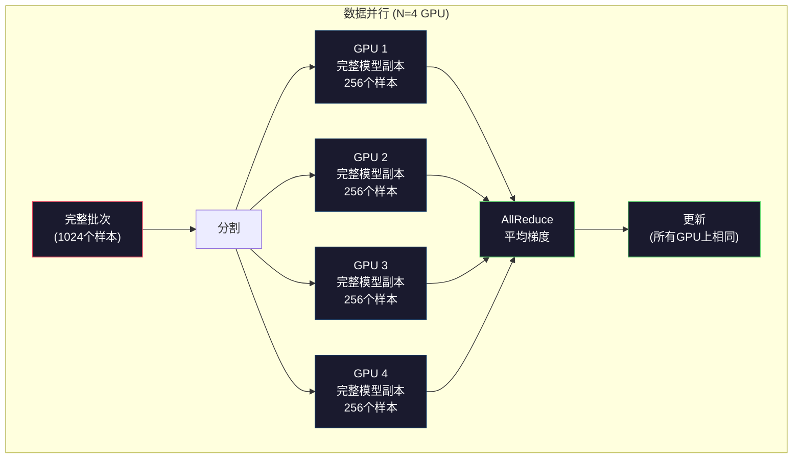

# 扩展：分布式训练、FSDP、DeepSpeed

> 你在单个GPU上训练的124M模型。现在试试70亿参数。模型无法放入内存。在单台机器上处理数据需要数周。大规模训练下，分布式训练不是可选的，而是唯一的出路。

**类型：** 构建
**语言：** Python
**先决条件：** 第10阶段，第04课（预训练迷你GPT）
**时间：** 约120分钟

## 学习目标

- 解释三种并行类型（数据并行、张量并行、流水线并行）以及基于模型和集群规模何时需要每种类型
- 使用PyTorch DDP实现数据并行训练，在多个GPU之间进行梯度同步
- 计算给定模型大小的内存预算（权重 + 优化器状态 + 梯度 + 激活值），以确定最低硬件要求
- 配置FSDP或DeepSpeed ZeRO阶段，在GPU之间分片模型状态，使超过单个GPU内存的模型能够适配

## 问题

FP16中的70亿参数模型仅权重就需要14GB。Adam优化器为每个参数存储两个额外的副本（一阶和二阶矩估计）。这又需要28GB。反向传播过程中的梯度再增加14GB。在存储任何激活值之前，你已经需要56GB。

NVIDIA A100有80GB内存。

已消耗80GB中的56GB。剩下24GB用于激活值——前向传播过程中计算的中间值，必须保留用于反向传播。对于具有4096维模型的2048个token序列，单个层的激活值使用约64MB。32层需要每样本2GB。批量大小为8需要16GB。你有24GB。批量大小为12就会超出内存限制。

现在试试70亿参数。仅权重：FP16中为140GB。无法放入单个GPU。至少需要2个A100（2 x 80GB = 160GB）来存储权重。加上优化器状态和梯度，需要更多：至少3+个GPU，实际上根据分片策略需要8-16个。

Llama 3 405B在16,384个NVIDIA H100 GPU上训练。计算成本估计为1亿美元。DeepSeek V3通过巧妙的架构（专家混合意味着每个token只激活一小部分参数）和训练效率，以约560万美元的成本训练了类似模型。

本课程介绍了使大规模训练成为可能的四种策略：数据并行、张量并行、流水线并行和完全分片数据并行。你将在纯Python中模拟每种策略，以理解其机制，然后再接触分布式训练框架。

## 概念

### 为什么需要分布式

以下是真实模型的内存计算。所有数字都是计算得出的，而非估计值。

| 模型 | 参数数 | 权重(FP16) | Adam状态 | 梯度(FP16) | 总计(不含激活值) |
|-------|--------|----------------|-------------|------------------|----------------------|
| GPT-2 Small | 124M | 248 MB | 992 MB | 248 MB | 1.5 GB |
| Llama 3 8B | 8B | 16 GB | 64 GB | 16 GB | 96 GB |
| Llama 3 70B | 70B | 140 GB | 560 GB | 140 GB | 840 GB |
| Llama 3 405B | 405B | 810 GB | 3,240 GB | 810 GB | 4,860 GB |

"Adam状态"列是关键。Adam为每个参数存储运行均值(m)和运行方差(v)，两者都使用FP32。对于70B模型，需要70B x 4字节 x 2 = 560GB。仅优化器就需要7个A100。

单个H100有80GB。Llama 3 405B至少需要61个H100来存储权重、优化器和梯度。加上激活值，数量会进一步增加。Meta使用16,384个GPU不是因为他们想这样做，而是因为他们必须这样做。

### 数据并行

最简单的分布式策略。将整个模型复制到N个GPU。将每个训练批次分成N个相等的部分。每个GPU在其数据分片上运行前向和反向传播。反向传播后，在所有GPU之间平均梯度。每个GPU使用相同的平均梯度更新其权重副本，保持所有副本同步。

**优点:** 线性吞吐量扩展。N个GPU每步处理N倍的数据。通信仅限于梯度平均，与计算重叠。

**缺点:** 每个GPU都持有完整的模型、优化器状态和梯度副本。对于70B模型，每个GPU需要840GB。数据并行并不能减少每个GPU的内存。它只减少训练时间。

**计算:** 有效批量大小 = 每GPU批量大小 × N。对于N=64个GPU，每GPU批量为16，有效批量为1,024。Llama 3每步使用1600万个token的有效批量大小。



### 张量并行

在GPU之间分割单个层。单个矩阵乘法在GPU之间分配，每个GPU计算结果的一部分。

考虑前馈层中形状为(8192, 8192)的权重矩阵。使用4路张量并行，每个GPU持有(8192, 2048)的分片。每个GPU将输入与其分片相乘，产生部分结果。部分结果通过all-reduce或all-gather组合，产生完整输出。

**优点:** 减少每个GPU的模型权重内存。70B模型分布在8个GPU上，意味着每个GPU持有约87.5亿参数的权重。

**缺点:** 每个层后需要快速的GPU间通信。每个矩阵乘法后的all-reduce会增加延迟。这在NVLink(同一节点上GPU间900 GB/s)上效果良好，但在通过InfiniBand连接的节点间效果较差(400 Gb/s，约50 GB/s)。张量并行几乎总是限制在单个节点内(8个GPU)。

**实际应用:** Megatron-LM开创了张量并行。Llama 3 405B在每个节点内使用8路张量并行。

### 流水线并行

按层分割模型。GPU 1运行第1-8层。GPU 2运行第9-16层。GPU 3运行第17-24层。GPU 4运行第25-32层。数据流经流水线：GPU 1计算其层并将激活值发送到GPU 2，GPU 2计算其层并发送到GPU 3，依此类推。

**优点:** GPU间通信最小化——只有层边界的激活值，与梯度或权重相比很小。因为带宽需求低，可以在节点间工作。

**缺点:** 流水线气泡。当GPU 4正在计算第1个微批次的前向传播时，GPU 1、2和3处于空闲状态（它们已经完成了前向传播部分）。在反向传播期间，模式相反。使用简单流水线时，N个流水线阶段的GPU利用率仅为1/N。

**GPipe和PipeDream**通过将批次分割为微批次来解决气泡问题。GPU 1完成第1个微批次的前向传播后立即开始第2个微批次。这使流水线阶段的计算重叠。使用M个微批次和N个阶段，气泡比例降至(N-1)/M。使用M=16个微批次和N=4个阶段，气泡为3/16 = 18.75%的空闲时间。

### FSDP：完全分片数据并行

FSDP结合了数据并行的可扩展性和分片的内存效率。每个GPU不持有完整的模型副本，而是只持有参数、梯度和优化器状态的1/N。

在层的前向传播之前，FSDP运行**all-gather**从所有GPU收集完整参数到每个GPU的内存中。前向传播后，每个GPU丢弃非本地参数。在反向传播期间，all-gather再次运行以重建参数用于梯度计算。反向传播后，**reduce-scatter**分发梯度分片，使每个GPU只存储1/N的梯度。

**70B模型在8个GPU上的计算:**

| 组件 | 不使用FSDP | 使用FSDP |
|-----------|-------------|-----------|
| 权重(FP16) | 每GPU 140 GB | 每GPU 17.5 GB |
| Adam状态(FP32) | 每GPU 560 GB | 每GPU 70 GB |
| 梯度(FP16) | 每GPU 140 GB | 每GPU 17.5 GB |
| **总计** | **每GPU 840 GB** | **每GPU 105 GB** |

没有FSDP，你无法将70B模型放入单个80GB GPU。使用8个GPU的FSDP，每个GPU使用105GB——等等，这仍然不够。你至少需要16个GPU才能使每GPU内存低于80GB，或者将FSDP与激活检查点（在反向传播期间重新计算激活值而非存储）结合使用。

通信成本比普通数据并行高，因为每个层前都需要all-gather。但内存节省使之前不可能的训练成为可能。

```mermaid
graph TD
    subgraph FSDP["FSDP: 完全分片数据并行 (4 GPU)"]
        direction TB
        S["模型: 4层，分片"]

        subgraph GPU1["GPU 1"]
            G1S["分片: 1/4参数\n1/4优化器\n1/4梯度"]
        end
        subgraph GPU2["GPU 2"]
            G2S["分片: 1/4参数\n1/4优化器\n1/4梯度"]
        end
        subgraph GPU3["GPU 3"]
            G3S