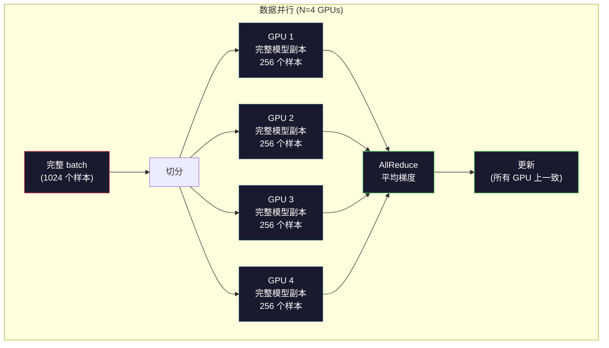
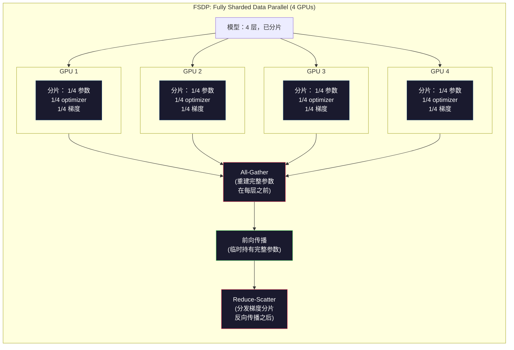
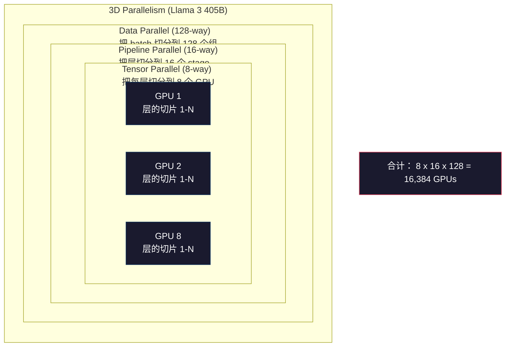

# 规模化：分布式训练、FSDP、DeepSpeed

> 译注：本文译自同目录 [`en.md`](./en.md)。术语遵循仓根 [TRANSLATION_GUIDE.md](../../../../TRANSLATION_GUIDE.md)。

> 你那 124M 模型在一块 GPU 上训练完了。现在试试 70 亿参数。模型塞不进显存。数据放在单机上要跑好几周。规模一上去，分布式训练就不是可选项，而是唯一出路。

**Type:** Build
**Languages:** Python
**Prerequisites:** Phase 10, Lesson 04 (Pre-Training a Mini GPT)
**Time:** ~120 minutes

## 学习目标（Learning Objectives）

- 解释三类并行方式（data、tensor、pipeline）的差别，并根据模型与集群规模判断各自必要性
- 用 PyTorch DDP 实现数据并行训练，在多块 GPU 之间做梯度同步
- 计算给定模型规模的内存预算（权重 + optimizer 状态 + 梯度 + 激活），从而确定最低硬件门槛
- 配置 FSDP 或 DeepSpeed ZeRO 各 stage，对模型状态做分片，让超出单卡显存的模型也能训起来

## 问题（The Problem）

一个 7B 参数、FP16 的模型，光权重就要 14GB。Adam optimizer 还要为每个参数额外存两份（一阶矩和二阶矩估计），又是 28GB。反向传播时的梯度再加 14GB。一根 activation 都还没存呢，你已经 56GB 没了。

NVIDIA A100 一共 80GB 显存。

80GB 用掉 56GB，只剩 24GB 留给 activation——也就是前向传播过程中算出来、必须留着给反向传播用的中间值。一条 2048 token 的序列、模型维度 4096，单层 activation 大约要 64MB；32 层下来，每个样本 2GB。batch size 8 就要 16GB。你只有 24GB。batch size 12 直接炸。

再看 70B。光权重在 FP16 下就是 140GB，单卡装不下。光是装权重就至少要 2 块 A100（2 × 80GB = 160GB）。再加上 optimizer 状态和梯度，至少 3 块起步，根据 sharding 策略实际上要 8–16 块。

Llama 3 405B 是在 16,384 块 NVIDIA H100 上训练的，算力成本估计 1 亿美金。DeepSeek V3 训练规模相当的模型只花了大约 560 万美金——靠的是架构上的巧思（Mixture of Experts 意味着每个 token 只激活一小部分参数）和训练效率。

本课讲解让大规模训练成为可能的四种策略：data parallelism（数据并行）、tensor parallelism（张量并行）、pipeline parallelism（流水线并行）和 fully sharded data parallelism（全分片数据并行）。在你接触任何分布式训练框架之前，我们会用纯 Python 把每一种都模拟一遍，把机制吃透。

## 概念（The Concept）

### 为什么必须分布式（Why Distribution is Required）

下面是真实模型的内存账，每个数都是算出来的，不是估的。

| 模型 | 参数量 | 权重（FP16） | Adam 状态 | 梯度（FP16） | 合计（不含 activation） |
|-------|--------|----------------|-------------|------------------|----------------------|
| GPT-2 Small | 124M | 248 MB | 992 MB | 248 MB | 1.5 GB |
| Llama 3 8B | 8B | 16 GB | 64 GB | 16 GB | 96 GB |
| Llama 3 70B | 70B | 140 GB | 560 GB | 140 GB | 840 GB |
| Llama 3 405B | 405B | 810 GB | 3,240 GB | 810 GB | 4,860 GB |

「Adam 状态」这一列才是杀手。Adam 给每个参数都存一份 running mean（m）和 running variance（v），全是 FP32。70B 模型就是 70B × 4 字节 × 2 = 560GB。光 optimizer 就要七块 A100。

单块 H100 是 80GB。Llama 3 405B 光是装下权重、optimizer、梯度就至少要 61 块 H100，再加 activation 数字还要涨。Meta 用了 16,384 块 GPU 不是因为想用，是因为不得不。

### 数据并行（Data Parallelism）

最朴素的分布式策略：把整个模型拷贝到 N 块 GPU 上。每个训练 batch 切成 N 等份。每块 GPU 在自己那份数据上跑一次前向加反向。反向结束后，把所有 GPU 的梯度做平均。每块 GPU 都用同一份平均梯度去更新自己的权重副本，所有副本始终保持一致。

**好处：** 吞吐线性扩展。N 块 GPU 一步处理 N 倍的数据。通信只在梯度平均这一步，并且可以和计算 overlap。

**坏处：** 每块 GPU 都得装一整份模型、optimizer 状态和梯度。70B 模型每块卡都要 840GB。数据并行完全不省单卡显存，它只缩短训练时间。

**算账：** 有效 batch size = per_gpu_batch_size × N。N=64 块 GPU、每卡 batch 16，有效 batch 就是 1,024。Llama 3 用的有效 batch 是每步 1600 万 token。



### 张量并行（Tensor Parallelism）

把单层切到多块 GPU 上。一次矩阵乘法被几块 GPU 分着算，每块 GPU 算结果的一部分。

考虑一个 feedforward 层里 (8192, 8192) 的权重矩阵。4 路 tensor parallelism 下，每块 GPU 持有一个 (8192, 2048) 的分片。每块 GPU 拿输入乘自己那一片，得到一个 partial result。所有 partial result 通过 all-reduce 或 all-gather 拼起来，得到完整输出。

**好处：** 减少每卡上模型权重占用。70B 模型切到 8 块 GPU 上，每块卡只装 ~8.75B 参数量级的权重。

**坏处：** 每一层之后都要做高速 GPU 间通信。每次 matmul 之后的 all-reduce 都增加延迟。在 NVLink 下（同节点 GPU 之间 900 GB/s）表现不错，但跨节点 InfiniBand（400 Gb/s，约 50 GB/s）下就很差了。tensor parallelism 几乎只在单节点（8 块 GPU）内部使用。

**实战：** Megatron-LM 是 tensor parallelism 的开创者。Llama 3 405B 在每个节点内部用 8 路 tensor parallelism。

### 流水线并行（Pipeline Parallelism）

按层切模型。GPU 1 负责 1–8 层，GPU 2 负责 9–16 层，GPU 3 负责 17–24 层，GPU 4 负责 25–32 层。数据顺着流水线流动：GPU 1 算完自己那几层，把 activation 发给 GPU 2，GPU 2 算完发给 GPU 3，依次类推。

**好处：** GPU 之间通信很少——只在层边界传 activation，和梯度或权重比起来很小。带宽要求低，跨节点也能用。

**坏处：** Pipeline bubble（流水线气泡）。GPU 4 在算 micro-batch 1 的前向时，GPU 1、2、3 都闲着（它们的部分早就转交出去了）。反向时模式反过来。朴素流水线下，GPU 利用率只有 1/N（N 是流水线阶段数）。

**GPipe 和 PipeDream** 通过把 batch 切成 micro-batch 来解决气泡问题。GPU 1 一旦把 micro-batch 1 转给下一阶段，立刻开始算 micro-batch 2。这样不同阶段的计算就能 overlap。M 个 micro-batch、N 个 stage 时，气泡比例降到 (N-1)/M。M=16、N=4，气泡就是 3/16 = 18.75% 的空闲。

### FSDP：全分片数据并行（FSDP: Fully Sharded Data Parallel）

FSDP 把数据并行的可扩展性和 sharding 的内存效率结合起来。每块 GPU 不再持有完整的模型副本，而是只持有 1/N 的参数、梯度和 optimizer 状态。

某层的前向传播之前，FSDP 跑一次 **all-gather**，把所有 GPU 上的完整参数收集到每块 GPU 的内存里。前向跑完，每块 GPU 把不属于自己的参数丢掉。反向时再 all-gather 一次，重建参数用于梯度计算。反向结束后，**reduce-scatter** 把梯度分片分发出去，每块 GPU 只存 1/N 的梯度。

**70B 模型在 8 块 GPU 上的账：**

| 项目 | 不用 FSDP | 用 FSDP |
|-----------|-------------|-----------|
| 权重（FP16） | 每卡 140 GB | 每卡 17.5 GB |
| Adam 状态（FP32） | 每卡 560 GB | 每卡 70 GB |
| 梯度（FP16） | 每卡 140 GB | 每卡 17.5 GB |
| **合计** | **每卡 840 GB** | **每卡 105 GB** |

不用 FSDP，单块 80GB 的卡根本装不下 70B 模型。用 FSDP 切到 8 卡，每卡 105GB——还是装不下。要么至少 16 卡才能压到每卡 80GB 以内，要么把 FSDP 和 activation checkpointing（反向时重算 activation 而不是存下来）一起上。

通信开销比朴素的数据并行更高，因为每层之前都要 all-gather。但是省下来的内存让原本不可能的训练任务变成可能。



### DeepSpeed ZeRO

DeepSpeed 的 ZeRO（Zero Redundancy Optimizer，零冗余优化器）在概念上和 FSDP 一致，是微软独立做出来的。它定义了三个 stage，sharding 一级比一级激进：

| Stage | 切分对象 | 内存节省 | 通信 |
|-------|--------|---------------|---------------|
| ZeRO-1 | 仅 optimizer 状态 | 约 4× | 与数据并行相同 |
| ZeRO-2 | 加上梯度 | 约 8× | 略多 |
| ZeRO-3 | 加上参数 | 约 N× （N 卡） | 每层一次 all-gather |

ZeRO-3 等同于 FSDP。叫法不同，机制一致。DeepSpeed 验证了这条路之后，PyTorch 把 FSDP 做成了原生实现。

DeepSpeed 还提出了 ZeRO-Offload（把 optimizer 状态卸载到 CPU 内存，更便宜也更大）和 ZeRO-Infinity（卸载到 NVMe SSD）。这些是用计算速度换显存容量——卸载后的运算更慢，但腾出了 GPU 显存。

### 混合精度训练（Mixed Precision Training）

现代训练同时使用多种浮点格式：

- **前向传播**：FP16 或 BF16（16 位）。内存只有 FP32 的一半。tensor core 上 matmul 速度快一倍。
- **Master 权重**：FP32（32 位）。由 optimizer 维护，用于权重更新时保留数值精度。
- **Loss scaling**：反向之前把 loss 乘一个大常数，防止 FP16 梯度下溢到零。optimizer 步骤前再除回来。

BF16（Brain Float 16）的指数范围和 FP32 一样（8 位指数），但精度更低（7 位尾数 vs FP32 的 23 位）。它几乎不需要 loss scaling，因为能表示同样的数值范围。FP16 是 5 位指数 + 10 位尾数——能表示精细数值，但在极端量级会上溢/下溢。

Google 的 TPU 原生支持 BF16。NVIDIA A100 和 H100 同时支持 FP16 和 BF16。业界基本上都迁到了 BF16，因为它免去了 loss scaling 的麻烦事。

**7B 模型的内存对比：**

| 精度 | 权重 | Optimizer | 梯度 | 合计 |
|-----------|---------|-----------|-----------|-------|
| 全 FP32 | 28 GB | 56 GB | 28 GB | 112 GB |
| 混合（BF16 + FP32 master） | 14 GB | 56 GB | 14 GB | 84 GB |

混合精度在这个模型上省了 28GB。无论怎么搞，optimizer 状态都留在 FP32——大头还是它。

### Megatron-LM 与 3D 并行（Megatron-LM and 3D Parallelism）

真正的大规模训练把三种并行都用上：

- **数据并行**横跨多组节点（扩 batch size）
- **张量并行**在单节点内（把每层切到 8 块 GPU）
- **流水线并行**横跨节点（把层组分布到不同机器）

Llama 3 405B 在 16,384 块 H100 上：
- 每节点内 8 路 tensor parallelism（每节点 8 卡）
- 跨节点 16 路 pipeline parallelism（16 个流水线 stage）
- 在剩下的维度上 128 路 data parallelism（16,384 / 8 / 16 = 128）

这种 3D 分解（8 × 16 × 128 = 16,384）是把训练扩展到上千 GPU 的方式。每块 GPU 看到不同的数据分片（数据并行）、持有每层的一个切片（张量并行）、负责一部分层（流水线并行）。

DeepSeek V3 走了另一条路。他们的 Mixture of Experts 架构对每个 token 只激活 671B 参数中的 37B。这意味着每块 GPU 只需要计算（并存 activation）激活的那部分参数。他们在 2,048 块 H800 GPU 上训练——不到 Meta GPU 数量的 1/8——花了 560 万美金，对比 Meta 估算的 1 亿美金。



## 动手实现（Build It）

### Step 1：模拟数据并行（Simulate Data Parallelism）

把 batch 切到模拟的 GPU 上。每块 GPU 在自己那份分片上算前向。把「梯度」（这里用 loss 值代替）做平均。

```python
import numpy as np

def simulate_data_parallelism(data, num_gpus, model_fn):
    batch_size = len(data)
    shard_size = batch_size // num_gpus
    remainder = batch_size % num_gpus

    gpu_losses = []
    gpu_gradients = []

    offset = 0
    for gpu_id in range(num_gpus):
        extra = 1 if gpu_id < remainder else 0
        shard = data[offset:offset + shard_size + extra]
        offset += shard_size + extra

        loss, grad = model_fn(shard)
        gpu_losses.append(loss)
        gpu_gradients.append(grad)

    avg_loss = np.mean(gpu_losses)
    avg_gradient = np.mean(gpu_gradients, axis=0)

    return avg_loss, avg_gradient
```

all-reduce 操作（梯度求平均）是数据并行里唯一的通信。在实际部署里，NVIDIA GPU 上用 NCCL 库实现 ring all-reduce：每块 GPU 把自己梯度的 1/N 发给邻居，从另一边邻居那里收 1/N，N-1 步之后每块 GPU 都拿到了完整平均值。总通信量：2 × gradient_size × (N-1)/N，N 大时趋近梯度大小的两倍。

### Step 2：模拟张量并行（Simulate Tensor Parallelism）

把权重矩阵切到几块 GPU 上。每块 GPU 算一部分矩阵乘法，最后把结果拼起来。

```python
def simulate_tensor_parallelism(input_data, weight_matrix, num_gpus):
    d_in, d_out = weight_matrix.shape
    assert d_out % num_gpus == 0, f"d_out {d_out} not divisible by num_gpus {num_gpus}"
    shard_size = d_out // num_gpus

    partial_results = []
    for gpu_id in range(num_gpus):
        start = gpu_id * shard_size
        end = start + shard_size
        weight_shard = weight_matrix[:, start:end]

        partial = input_data @ weight_shard
        partial_results.append(partial)

    full_output = np.concatenate(partial_results, axis=-1)

    direct_output = input_data @ weight_matrix
    error = np.abs(full_output - direct_output).max()

    return full_output, error
```

误差应该恰好为零（或者机器精度量级）。tensor parallelism 在数学上是精确的——和单卡跑完整 matmul 结果一致。这里沿着输出维度切，每块 GPU 产出一组不同的列，concat 起来就是完整结果。

列并行（column-parallel）的线性层（切输出维度）用 concat；行并行（row-parallel，切输入维度）用 sum。在 transformer FFN 里，第一个线性层（expand）用列并行，第二个线性层（contract）用行并行。这样两层之间就免去了 all-reduce。

### Step 3：模拟流水线并行（Simulate Pipeline Parallelism）

把模型按层切到虚拟 GPU 上。展示气泡问题：早期 stage 在干等后面的 stage 算完。

```python
def simulate_pipeline_parallelism(num_layers, num_stages, num_microbatches):
    layers_per_stage = num_layers // num_stages

    timeline = {}
    clock = 0

    for mb in range(num_microbatches):
        for stage in range(num_stages):
            start_time = max(
                timeline.get((stage, mb - 1, "fwd"), (0, 0))[1] if mb > 0 else 0,
                timeline.get((stage - 1, mb, "fwd"), (0, 0))[1] if stage > 0 else 0,
            )
            end_time = start_time + layers_per_stage
            timeline[(stage, mb, "fwd")] = (start_time, end_time)

    last_fwd_end = max(v[1] for v in timeline.values())

    for mb in range(num_microbatches - 1, -1, -1):
        for stage in range(num_stages - 1, -1, -1):
            deps = [last_fwd_end]
            if mb < num_microbatches - 1 and (stage, mb + 1, "bwd") in timeline:
                deps.append(timeline[(stage, mb + 1, "bwd")][1])
            if stage < num_stages - 1 and (stage + 1, mb, "bwd") in timeline:
                deps.append(timeline[(stage + 1, mb, "bwd")][1])
            start_time = max(deps)
            end_time = start_time + layers_per_stage
            timeline[(stage, mb, "bwd")] = (start_time, end_time)

    total_time = max(v[1] for v in timeline.values())
    compute_time = num_microbatches * num_stages * layers_per_stage * 2
    bubble_fraction = 1.0 - compute_time / (total_time * num_stages)

    return timeline, total_time, bubble_fraction
```

4 个 stage、1 个 micro-batch 时，气泡占比 75%——任意时刻四块 GPU 里有三块闲着。16 个 micro-batch 时降到约 19%。消除气泡的代价是内存：所有 in-flight micro-batch 的 activation 都得同时存着。

### Step 4：内存计算器（Memory Calculator）

为任意大小的模型算出精确的显存需求。

```python
def memory_calculator(
    params_billions,
    precision_bytes=2,
    optimizer="adam",
    num_gpus=1,
    sharding="none",
    sequence_length=2048,
    batch_size_per_gpu=1,
    hidden_dim=None,
    num_layers=None,
):
    params = params_billions * 1e9

    weight_memory = params * precision_bytes

    if optimizer == "adam":
        optimizer_memory = params * 4 * 2
    elif optimizer == "sgd":
        optimizer_memory = params * 4
    else:
        optimizer_memory = 0

    gradient_memory = params * precision_bytes

    total_no_activation = weight_memory + optimizer_memory + gradient_memory

    if hidden_dim and num_layers:
        activation_per_layer = (
            sequence_length * batch_size_per_gpu * hidden_dim * precision_bytes * 4
        )
        activation_memory = activation_per_layer * num_layers
    else:
        activation_memory = params * precision_bytes * 0.5

    if sharding == "fsdp" or sharding == "zero3":
        weight_memory /= num_gpus
        optimizer_memory /= num_gpus
        gradient_memory /= num_gpus
    elif sharding == "zero2":
        optimizer_memory /= num_gpus
        gradient_memory /= num_gpus
    elif sharding == "zero1":
        optimizer_memory /= num_gpus

    per_gpu_total = weight_memory + optimizer_memory + gradient_memory + activation_memory

    return {
        "params_billions": params_billions,
        "weights_gb": weight_memory / 1e9,
        "optimizer_gb": optimizer_memory / 1e9,
        "gradients_gb": gradient_memory / 1e9,
        "activations_gb": activation_memory / 1e9,
        "per_gpu_total_gb": per_gpu_total / 1e9,
        "total_across_gpus_gb": per_gpu_total * num_gpus / 1e9,
        "fits_on_80gb": per_gpu_total / 1e9 <= 80,
        "num_gpus": num_gpus,
        "sharding": sharding,
    }
```

这个计算器回答了每个 ML 工程师都会问的问题：「我到底要几块 GPU？」把模型大小喂进去，看它能不能装下。调 sharding 策略直到每卡总量低于 80GB。

### Step 5：混合精度模拟（Mixed Precision Simulation）

对比 FP32、FP16、混合精度训练的内存占用。

```python
def mixed_precision_comparison(params_billions):
    params = params_billions * 1e9

    fp32_weights = params * 4
    fp32_optimizer = params * 4 * 2
    fp32_gradients = params * 4
    fp32_total = fp32_weights + fp32_optimizer + fp32_gradients

    fp16_weights = params * 2
    fp16_master = params * 4
    fp16_optimizer = params * 4 * 2
    fp16_gradients = params * 2
    fp16_total = fp16_weights + fp16_master + fp16_optimizer + fp16_gradients

    mixed_weights = params * 2
    mixed_optimizer = params * 4 * 2
    mixed_gradients = params * 2
    mixed_total = mixed_weights + mixed_optimizer + mixed_gradients

    return {
        "fp32_total_gb": fp32_total / 1e9,
        "fp16_with_master_gb": fp16_total / 1e9,
        "mixed_bf16_gb": mixed_total / 1e9,
        "savings_vs_fp32": 1 - mixed_total / fp32_total,
    }
```

大多数人最意外的一点：混合精度并不会把内存砍半。Adam 的 m 和 v 那部分 optimizer 状态无论如何都在 FP32。7B 模型，FP32 训练要 112GB，混合精度 84GB，只省了 25%，不是 50%。占大头的是 optimizer。

## 用起来（Use It）

### 跑全部模拟（Run All Simulations）

```python
def run_all_demos():
    print("=" * 70)
    print("DATA PARALLELISM SIMULATION")
    print("=" * 70)

    np.random.seed(42)
    data = np.random.randn(64, 32)
    weight = np.random.randn(32, 16)

    def model_fn(batch):
        output = batch @ weight
        loss = np.mean(output ** 2)
        grad = 2 * batch.T @ (batch @ weight) / len(batch)
        return loss, grad

    for n_gpus in [1, 2, 4, 8]:
        loss, grad = simulate_data_parallelism(data, n_gpus, model_fn)
        print(f"  {n_gpus} GPUs: loss={loss:.4f}, grad_norm={np.linalg.norm(grad):.4f}")

    print()
    print("=" * 70)
    print("TENSOR PARALLELISM SIMULATION")
    print("=" * 70)

    x = np.random.randn(4, 8192)
    W = np.random.randn(8192, 8192)

    for n_gpus in [1, 2, 4, 8]:
        output, error = simulate_tensor_parallelism(x, W, n_gpus)
        print(f"  {n_gpus} GPUs: output_shape={output.shape}, max_error={error:.2e}")

    print()
    print("=" * 70)
    print("PIPELINE PARALLELISM SIMULATION")
    print("=" * 70)

    for n_mb in [1, 4, 8, 16, 32]:
        _, total_t, bubble = simulate_pipeline_parallelism(32, 4, n_mb)
        print(f"  {n_mb:2d} micro-batches: total_time={total_t:4d}, bubble={bubble:.1%}")

    print()
    print("=" * 70)
    print("MEMORY CALCULATOR")
    print("=" * 70)

    configs = [
        (7, "none", 1),
        (7, "fsdp", 8),
        (70, "none", 1),
        (70, "fsdp", 8),
        (70, "fsdp", 16),
        (405, "fsdp", 64),
        (405, "fsdp", 128),
    ]

    print(f"  {'Model':>8} {'Sharding':>8} {'GPUs':>5} {'Per-GPU':>10} {'Fits 80GB':>10}")
    print("  " + "-" * 50)
    for params, shard, gpus in configs:
        result = memory_calculator(params, num_gpus=gpus, sharding=shard)
        fits = "Yes" if result["fits_on_80gb"] else "No"
        print(f"  {params:>6}B {shard:>8} {gpus:>5} {result['per_gpu_total_gb']:>8.1f}GB {fits:>10}")

    print()
    print("=" * 70)
    print("MIXED PRECISION COMPARISON")
    print("=" * 70)

    for params_b in [7, 13, 70, 405]:
        result = mixed_precision_comparison(params_b)
        print(f"  {params_b}B: FP32={result['fp32_total_gb']:.0f}GB, "
              f"Mixed BF16={result['mixed_bf16_gb']:.0f}GB, "
              f"Savings={result['savings_vs_fp32']:.0%}")
```

## 上线部署（Ship It）

本课产出 `outputs/prompt-distributed-training-planner.md`——一个 prompt，输入模型规模和可用硬件，输出完整的分布式训练方案：并行策略、内存预算、通信开销、预期吞吐。

## 练习（Exercises）

1. 改造内存计算器，加入 activation checkpointing。开启 checkpointing 后，只在每 K 层存一次 activation（典型 K=1，意味着全部重算）。展示内存–计算的权衡：checkpointing 省了多少内存，又让训练慢了多少（全量 checkpointing 大约多 33% 计算量）？

2. 把流水线并行的模拟扩展到 PipeDream 用的 1F1B（one forward, one backward）调度。在 4 个 stage、8 个 micro-batch 下对比朴素调度和 1F1B 的气泡比例。1F1B 的峰值内存应该更小，因为它更早开始反向。

3. 实现一个梯度累积模拟器。不在每个 micro-batch 之后都做 all-reduce，而是本地累积 K 步再 all-reduce。展示这样能把通信减少 K 倍，但最终梯度（以及训练结果）完全一致。

4. 写一个成本估算器。给定模型规模、目标 token 数量、GPU 类型（A100 每小时 \$2，H100 每小时 \$3.50）和并行策略，估算训练总成本（美元）。拿已知数字校验：Llama 3 405B 据说约 1 亿美元，DeepSeek V3 约 560 万美元。

5. 给内存计算器加 ZeRO-Offload。假设每节点 CPU 内存 512GB、NVMe 2TB。展示把 optimizer 状态卸载到 CPU 后，70B 模型可以在 4 卡上训练（而非 16 卡），代价是 optimizer 步骤慢 30–50%。

## 关键术语（Key Terms）

| 术语 | 大家会怎么说 | 实际含义 |
|------|----------------|----------------------|
| Data parallelism | 「把模型拷到每块 GPU 上」 | 每块 GPU 处理不同的数据分片；每步之后通过 all-reduce 平均梯度 |
| Tensor parallelism | 「把一层切到多块 GPU」 | 把权重矩阵切分，每块 GPU 算 matmul 的一部分；需要 NVLink 这种高速互联 |
| Pipeline parallelism | 「把层切到多块 GPU」 | 每块 GPU 跑不同的层组；数据流过流水线，通过 micro-batch 减少气泡 |
| FSDP | 「全部 sharding」 | Fully Sharded Data Parallel——每块 GPU 持有 1/N 的权重、梯度、optimizer 状态；计算前 all-gather |
| ZeRO | 「DeepSpeed 版的 FSDP」 | Zero Redundancy Optimizer，3 个 stage：切 optimizer（Stage 1）、加梯度（Stage 2）、加参数（Stage 3） |
| All-reduce | 「在 GPU 之间做平均」 | 集合通信操作，结束时每块 GPU 拿到所有 GPU 输入的总和（或平均）——通常用 ring all-reduce 实现 |
| All-gather | 「从所有 GPU 收集」 | 集合通信操作，结束时每块 GPU 拿到所有 GPU 数据的拼接——FSDP 用它重建完整参数 |
| Reduce-scatter | 「求和并分发」 | 集合通信操作，把数据 reduce（求和）然后把不同 chunk 散发给不同 GPU——FSDP 用它做梯度分片 |
| Mixed precision | 「半精度训练」 | 前向/反向用 FP16/BF16、optimizer 状态用 FP32——省约 25% 内存而非 50%，因为 optimizer 占大头 |
| Pipeline bubble | 「流水线里的空闲时间」 | GPU 等上一阶段数据时的空闲比例——更多 micro-batch 可降低气泡 |

## 延伸阅读（Further Reading）

- [Rajbhandari et al., 2020 -- "ZeRO: Memory Optimizations Toward Training Trillion Parameter Models"](https://arxiv.org/abs/1910.02054)——定义了三阶 sharding 的 DeepSpeed ZeRO 论文
- [Shoeybi et al., 2020 -- "Megatron-LM: Training Multi-Billion Parameter Language Models Using Model Parallelism"](https://arxiv.org/abs/1909.08053)——NVIDIA 在 transformer 上做 tensor parallelism 的经典工作
- [Narayanan et al., 2021 -- "Efficient Large-Scale Language Model Training on GPU Clusters Using Megatron-LM"](https://arxiv.org/abs/2104.04473)——把数据、张量、流水线并行结合起来的 3D 并行
- [Zhao et al., 2023 -- "PyTorch FSDP: Experiences on Scaling Fully Sharded Data Parallel"](https://arxiv.org/abs/2304.11277)——PyTorch 原生 FSDP 实现
- [Llama 3 Technical Report](https://arxiv.org/abs/2407.21783)——16,384 GPU 训练和 3D 并行细节
- [DeepSeek-V3 Technical Report](https://arxiv.org/abs/2412.19437)——MoE 架构如何把训练成本降一个数量级
