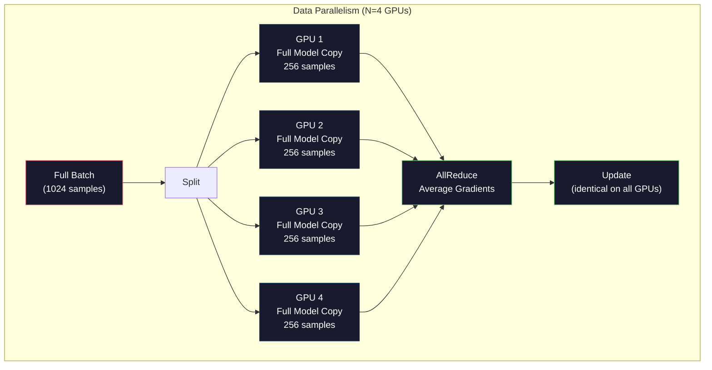
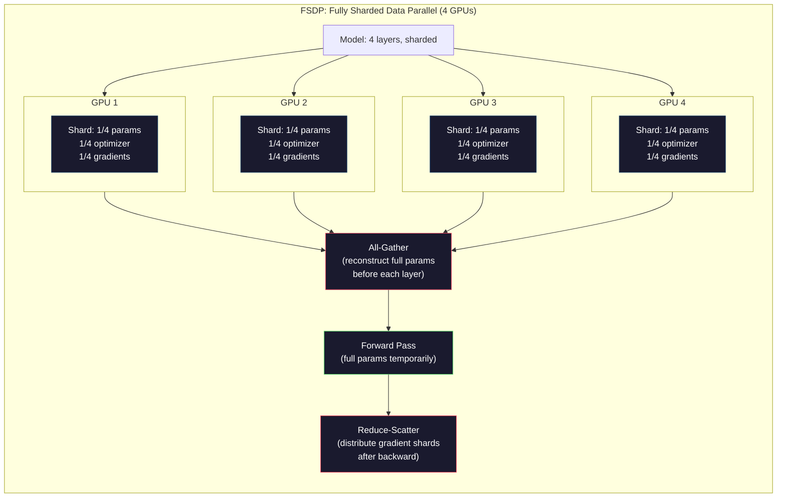
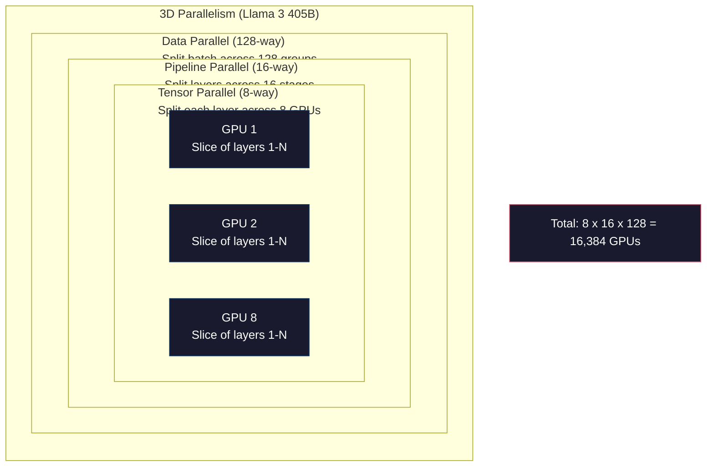

# 05 · 规模化：分布式训练、FSDP 与 DeepSpeed

> 你的 124M 模型在单张 GPU 上训练完成。现在试试 70 亿参数。模型装不进显存。数据在单台机器上要跑几周。到了这个规模，分布式训练不是可选项，而是唯一出路。

**类型：** 实战（Build）
**语言：** Python
**前置：** 阶段 10，第 04 课（预训练一个 Mini GPT）
**时长：** 约 120 分钟

## 学习目标

- 解释三种并行方式（数据并行、张量并行、流水线并行）以及在何种模型规模与集群规模下分别需要哪一种
- 使用 PyTorch DDP 实现数据并行训练，并在多张 GPU 间完成梯度同步
- 计算给定模型规模的显存预算（权重 + 优化器状态 + 梯度 + 激活值），以确定最低硬件需求
- 配置 FSDP 或 DeepSpeed ZeRO 各阶段，将模型状态分片到多张 GPU 上，让超出单卡显存的模型也能装下

## 问题所在

一个 FP16 精度的 7B 参数模型，仅权重就需要 14GB。Adam 优化器为每个参数额外存储两份副本（一阶矩与二阶矩估计），这又是 28GB。反向传播时的梯度再加 14GB。还没存一个激活值，你就已经用掉了 56GB。

一张 NVIDIA A100 有 80GB 显存。

80GB 里用掉 56GB，只剩 24GB 留给激活值——也就是前向传播过程中计算出、必须保留到反向传播时使用的中间结果。对于一个 2048-token 的序列、4096 维的模型，单层激活值约占 64MB。32 层就需要每个样本 2GB。批大小为 8 时需要 16GB。你有 24GB。批大小提到 12 就爆了。

现在试试 70B 参数。仅权重：FP16 下就要 140GB。单张 GPU 装不下。光是装权重你就至少需要 2 张 A100（2 × 80GB = 160GB）。再加上优化器状态和梯度，需求远不止于此：至少 3 张以上 GPU，实际上根据分片策略要 8 到 16 张。

Llama 3 405B 是在 16,384 张 NVIDIA H100 GPU 上训练的。这次训练的算力成本估计高达 1 亿美元。而 DeepSeek V3 训练出一个相当规模的模型，成本却只有约 560 万美元——靠的是在架构上的巧思（混合专家「Mixture of Experts」意味着每个 token 只激活一小部分参数）以及训练效率的提升。

本课讲解使大规模训练成为可能的四种策略：数据并行、张量并行、流水线并行，以及完全分片数据并行。在你接触任何分布式训练框架之前，我们会用纯 Python 模拟每一种，帮你理解其内在机制。

## 核心概念

### 为什么必须分布式

下面是真实模型的显存计算。每个数字都是算出来的，不是估出来的。

| 模型 | 参数量 | 权重（FP16） | Adam 状态 | 梯度（FP16） | 总计（不含激活值） |
|-------|--------|----------------|-------------|------------------|----------------------|
| GPT-2 Small | 124M | 248 MB | 992 MB | 248 MB | 1.5 GB |
| Llama 3 8B | 8B | 16 GB | 64 GB | 16 GB | 96 GB |
| Llama 3 70B | 70B | 140 GB | 560 GB | 140 GB | 840 GB |
| Llama 3 405B | 405B | 810 GB | 3,240 GB | 810 GB | 4,860 GB |

「Adam 状态」这一列才是真正的杀手。Adam 为每个参数存储一个滑动均值（m）和一个滑动方差（v），且都是 FP32。对于 70B 模型，这就是 70B × 4 字节 × 2 = 560GB。光优化器本身就需要七张 A100。

单张 H100 有 80GB。Llama 3 405B 仅为装下权重、优化器和梯度就至少需要 61 张 H100。再算上激活值，数字还会更大。Meta 用 16,384 张 GPU，不是因为他们想用——而是因为不得不用。

### 数据并行（Data Parallelism）

最简单的分布式策略。把整个模型复制到 N 张 GPU 上。把每个训练批次切成 N 等份。每张 GPU 在自己那份数据上做一次前向和反向传播。反向传播后，在所有 GPU 间对梯度求平均。每张 GPU 都用同样的平均梯度更新自己那份权重，从而让所有副本保持同步。

**优点：** 吞吐量线性扩展。N 张 GPU 每步处理的数据量是原来的 N 倍。通信仅限于梯度求平均，而这部分可以与计算重叠。

**缺点：** 每张 GPU 都持有模型、优化器状态和梯度的完整副本。对于 70B 模型，每张 GPU 需要 840GB。数据并行完全无法降低单卡显存占用，它只能缩短训练时间。

**计算公式：** 有效批大小 = per_gpu_batch_size × N。当 N=64 张 GPU、每卡批大小为 16 时，有效批大小为 1,024。Llama 3 使用的有效批大小为每步 1,600 万 token。



### 张量并行（Tensor Parallelism）

把单个层拆分到多张 GPU 上。一次矩阵乘法被分摊到多张 GPU，每张各算出结果的一部分。

考虑前馈层中一个形状为 (8192, 8192) 的权重矩阵。采用 4 路张量并行时，每张 GPU 持有一个 (8192, 2048) 的分片。每张 GPU 用输入乘以自己的分片，得到部分结果。这些部分结果通过 all-reduce 或 all-gather 合并，得到完整输出。

**优点：** 降低单卡的模型权重显存占用。一个 70B 模型切分到 8 张 GPU 上，意味着每张 GPU 只持有约 8.75B 参数量的权重。

**缺点：** 每层之后都需要快速的 GPU 间通信。每次矩阵乘法后的 all-reduce 都会增加延迟。这在 NVLink（同一节点内 GPU 间 900 GB/s）上表现良好，但在通过 InfiniBand 连接的跨节点场景（400 Gb/s，约 50 GB/s）下表现很差。张量并行几乎总是被限制在单个节点（8 张 GPU）以内。

**实际应用：** Megatron-LM 开创了张量并行。Llama 3 405B 在每个节点内使用 8 路张量并行。

### 流水线并行（Pipeline Parallelism）

按层切分模型。GPU 1 跑第 1–8 层。GPU 2 跑第 9–16 层。GPU 3 跑第 17–24 层。GPU 4 跑第 25–32 层。数据沿流水线流动：GPU 1 计算自己的层并把激活值发给 GPU 2，GPU 2 计算自己的层并发给 GPU 3，依此类推。

**优点：** GPU 间通信量极小——只有层边界处的激活值，相比梯度或权重要小得多。由于带宽需求低，它可以跨节点运行。

**缺点：** 流水线气泡（pipeline bubble）。当 GPU 4 正在对微批次 1 做前向传播时，GPU 1、2、3 处于空闲（它们已经传完了自己那部分）。反向传播时模式反转。采用朴素流水线时，N 个流水线阶段的 GPU 利用率只有 1/N。

**GPipe 和 PipeDream** 通过把批次切分成微批次（micro-batch）来解决气泡问题。GPU 1 一旦完成微批次 1 的前向传播，立刻开始处理微批次 2。这样就让各流水线阶段的计算重叠起来。在 M 个微批次、N 个阶段的情况下，气泡占比降到 (N-1)/M。用 M=16 个微批次、N=4 个阶段，气泡就是 3/16 = 18.75% 的空闲时间。

### FSDP：完全分片数据并行

FSDP 把数据并行的可扩展性与分片的显存效率结合起来。不再让每张 GPU 持有模型的完整副本，而是每张 GPU 只持有 1/N 的参数、梯度和优化器状态。

在某一层前向传播之前，FSDP 执行一次 **all-gather**，把所有 GPU 上的完整参数收集到每张 GPU 的显存中。前向传播之后，每张 GPU 丢弃非本地参数。反向传播时再次运行 all-gather 以重建参数用于梯度计算。反向传播之后，一次 **reduce-scatter** 把梯度分片分发出去，使每张 GPU 只存储 1/N 的梯度。

**70B 模型在 8 张 GPU 上的计算：**

| 组成部分 | 无 FSDP | 有 FSDP |
|-----------|-------------|-----------|
| 权重（FP16） | 每卡 140 GB | 每卡 17.5 GB |
| Adam 状态（FP32） | 每卡 560 GB | 每卡 70 GB |
| 梯度（FP16） | 每卡 140 GB | 每卡 17.5 GB |
| **总计** | **每卡 840 GB** | **每卡 105 GB** |

没有 FSDP，你无法把 70B 模型装进单张 80GB 的 GPU。用 FSDP 在 8 张 GPU 上，每张 GPU 占用 105GB——等等，这还是装不下。你至少需要 16 张 GPU 才能把每卡降到 80GB 以下，或者把 FSDP 与激活检查点（activation checkpointing，反向传播时重新计算激活值而非存储它们）结合使用。

由于每层之前都要做 all-gather，其通信开销高于普通数据并行。但显存的节省让以前不可能完成的训练成为可能。



### DeepSpeed ZeRO

DeepSpeed 的 ZeRO（Zero Redundancy Optimizer，零冗余优化器）在概念上与 FSDP 完全相同，但由微软独立开发。它定义了三个阶段，分片一个比一个更激进：

| 阶段 | 分片对象 | 显存节省 | 通信 |
|-------|--------|---------------|---------------|
| ZeRO-1 | 仅优化器状态 | 约 4 倍降低 | 与数据并行相同 |
| ZeRO-2 | + 梯度 | 约 8 倍降低 | 略多一些 |
| ZeRO-3 | + 参数 | 约 N 倍降低（N 张 GPU） | 每层一次 all-gather |

ZeRO-3 等价于 FSDP。命名不同，机制相同。在 DeepSpeed 验证了这个概念之后，PyTorch 把 FSDP 加入为原生实现。

DeepSpeed 还引入了 ZeRO-Offload（把优化器状态卸载到更便宜、更大的 CPU 内存）和 ZeRO-Infinity（卸载到 NVMe SSD）。它们用计算速度换显存容量——被卸载的操作更慢，但能腾出 GPU 显存。

### 混合精度训练（Mixed Precision Training）

现代训练会同时使用多种浮点格式：

- **前向传播**：FP16 或 BF16（16 位）。显存是 FP32 的一半。矩阵乘法在张量核心上快 2 倍。
- **主权重（Master weights）**：FP32（32 位）。由优化器维护，用于权重更新时保证数值精度。
- **损失缩放（Loss scaling）**：反向传播前把损失乘以一个大常数，防止 FP16 梯度下溢为零。优化器步进前再除以同一个常数。

BF16（Brain Float 16）拥有与 FP32 相同的指数范围（8 位指数）但精度更低（7 位尾数，对比 FP32 的 23 位）。它很少需要损失缩放，因为它能表示相同范围的取值。FP16 有 5 位指数、10 位尾数——它能表示细粒度的值，但在极端量级下会上溢/下溢。

Google 的 TPU 原生使用 BF16。NVIDIA 的 A100 和 H100 同时支持 FP16 与 BF16。业界已大体转向 BF16，因为它免去了损失缩放的麻烦。

**7B 模型的显存对比：**

| 精度 | 权重 | 优化器 | 梯度 | 总计 |
|-----------|---------|-----------|-----------|-------|
| 全程 FP32 | 28 GB | 56 GB | 28 GB | 112 GB |
| 混合（BF16 + FP32 主权重） | 14 GB | 56 GB | 14 GB | 84 GB |

在这个模型上，混合精度节省了 28GB。无论如何优化器状态都保持 FP32——显存的大头就在这里。

### Megatron-LM 与 3D 并行

真实的大规模训练会把三种并行结合起来：

- **数据并行** 跨节点组使用（扩大批大小）
- **张量并行** 在节点内使用（把层切分到 8 张 GPU 上）
- **流水线并行** 跨节点使用（把层组切分到不同机器上）

Llama 3 405B 在 16,384 张 H100 上：
- 每个节点内 8 路张量并行（每节点 8 张 GPU）
- 跨节点 16 路流水线并行（16 个流水线阶段）
- 在剩下的维度上做 128 路数据并行（16,384 / 8 / 16 = 128）

这种 3D 分解（8 × 16 × 128 = 16,384）就是扩展到数千张 GPU 的方法。每张 GPU 看到不同的数据分片（数据并行），持有每一层的一个切片（张量并行），并计算不同的一组层（流水线并行）。

DeepSeek V3 走了另一条路。他们的混合专家架构每个 token 只激活 671B 参数中的 37B。这意味着每张 GPU 只需为被激活的参数做计算（并存储其激活值）。他们在 2,048 张 H800 GPU 上训练——不到 Meta 的 1/8——成本 560 万美元，对比 Meta 估算的 1 亿美元。



## 动手实现

### 第 1 步：模拟数据并行

把一个批次切分到模拟的多张 GPU 上。每张 GPU 在自己的分片上做前向传播。对「梯度」（这里用损失值来模拟）求平均。

```python
import numpy as np

def simulate_data_parallelism(data, num_gpus, model_fn):
    batch_size = len(data)
    shard_size = batch_size // num_gpus
    remainder = batch_size % num_gpus

    gpu_losses = []
    gpu_gradients = []

    offset = 0
    for gpu_id in range(num_gpus):
        extra = 1 if gpu_id < remainder else 0
        shard = data[offset:offset + shard_size + extra]
        offset += shard_size + extra

        loss, grad = model_fn(shard)
        gpu_losses.append(loss)
        gpu_gradients.append(grad)

    avg_loss = np.mean(gpu_losses)
    avg_gradient = np.mean(gpu_gradients, axis=0)

    return avg_loss, avg_gradient
```

all-reduce 操作（对梯度求平均）是数据并行中唯一的通信。实践中这会用到 NVIDIA GPU 上的 NCCL 库，它实现了环形 all-reduce（ring all-reduce）：每张 GPU 把自己 1/N 的梯度发给邻居，从另一个邻居接收 1/N，经过 N-1 步后每张 GPU 都拥有完整的平均值。总通信量为 2 × gradient_size × (N-1)/N，当 N 很大时趋近于梯度大小的 2 倍。

### 第 2 步：模拟张量并行

把一个权重矩阵切分到多张 GPU 上。每张 GPU 计算一次部分矩阵乘法。再合并结果。

```python
def simulate_tensor_parallelism(input_data, weight_matrix, num_gpus):
    d_in, d_out = weight_matrix.shape
    assert d_out % num_gpus == 0, f"d_out {d_out} not divisible by num_gpus {num_gpus}"
    shard_size = d_out // num_gpus

    partial_results = []
    for gpu_id in range(num_gpus):
        start = gpu_id * shard_size
        end = start + shard_size
        weight_shard = weight_matrix[:, start:end]

        partial = input_data @ weight_shard
        partial_results.append(partial)

    full_output = np.concatenate(partial_results, axis=-1)

    direct_output = input_data @ weight_matrix
    error = np.abs(full_output - direct_output).max()

    return full_output, error
```

误差应当严格为零（或机器精度级别）。张量并行在数学上是精确的——它产生的结果与在单张 GPU 上计算完整矩阵乘法完全相同。切分沿输出维度进行，因此每张 GPU 产生一块不同的列，拼接后即可重建完整结果。

对于列并行线性层（切分输出维度），你做拼接（concatenate）。对于行并行（切分输入维度），你做求和（sum）。在 Transformer 的 FFN 中，第一个线性层（升维）用列并行，第二个线性层（降维）用行并行。这样就避免了两层之间的 all-reduce。

### 第 3 步：模拟流水线并行

把一个模型的各层切分到虚拟 GPU 上。展示气泡问题：早期阶段在等待后期阶段计算时处于空闲。

```python
def simulate_pipeline_parallelism(num_layers, num_stages, num_microbatches):
    layers_per_stage = num_layers // num_stages

    timeline = {}
    clock = 0

    for mb in range(num_microbatches):
        for stage in range(num_stages):
            start_time = max(
                timeline.get((stage, mb - 1, "fwd"), (0, 0))[1] if mb > 0 else 0,
                timeline.get((stage - 1, mb, "fwd"), (0, 0))[1] if stage > 0 else 0,
            )
            end_time = start_time + layers_per_stage
            timeline[(stage, mb, "fwd")] = (start_time, end_time)

    last_fwd_end = max(v[1] for v in timeline.values())

    for mb in range(num_microbatches - 1, -1, -1):
        for stage in range(num_stages - 1, -1, -1):
            deps = [last_fwd_end]
            if mb < num_microbatches - 1 and (stage, mb + 1, "bwd") in timeline:
                deps.append(timeline[(stage, mb + 1, "bwd")][1])
            if stage < num_stages - 1 and (stage + 1, mb, "bwd") in timeline:
                deps.append(timeline[(stage + 1, mb, "bwd")][1])
            start_time = max(deps)
            end_time = start_time + layers_per_stage
            timeline[(stage, mb, "bwd")] = (start_time, end_time)

    total_time = max(v[1] for v in timeline.values())
    compute_time = num_microbatches * num_stages * layers_per_stage * 2
    bubble_fraction = 1.0 - compute_time / (total_time * num_stages)

    return timeline, total_time, bubble_fraction
```

在 4 个阶段、1 个微批次时，气泡占比为 75%——任意时刻四张 GPU 中有三张空闲。用 16 个微批次时，它降到约 19%。消除气泡的代价是显存：你必须同时存储所有在途微批次的激活值。

### 第 4 步：显存计算器

精确计算训练任意规模模型所需的显存。

```python
def memory_calculator(
    params_billions,
    precision_bytes=2,
    optimizer="adam",
    num_gpus=1,
    sharding="none",
    sequence_length=2048,
    batch_size_per_gpu=1,
    hidden_dim=None,
    num_layers=None,
):
    params = params_billions * 1e9

    weight_memory = params * precision_bytes

    if optimizer == "adam":
        optimizer_memory = params * 4 * 2
    elif optimizer == "sgd":
        optimizer_memory = params * 4
    else:
        optimizer_memory = 0

    gradient_memory = params * precision_bytes

    total_no_activation = weight_memory + optimizer_memory + gradient_memory

    if hidden_dim and num_layers:
        activation_per_layer = (
            sequence_length * batch_size_per_gpu * hidden_dim * precision_bytes * 4
        )
        activation_memory = activation_per_layer * num_layers
    else:
        activation_memory = params * precision_bytes * 0.5

    if sharding == "fsdp" or sharding == "zero3":
        weight_memory /= num_gpus
        optimizer_memory /= num_gpus
        gradient_memory /= num_gpus
    elif sharding == "zero2":
        optimizer_memory /= num_gpus
        gradient_memory /= num_gpus
    elif sharding == "zero1":
        optimizer_memory /= num_gpus

    per_gpu_total = weight_memory + optimizer_memory + gradient_memory + activation_memory

    return {
        "params_billions": params_billions,
        "weights_gb": weight_memory / 1e9,
        "optimizer_gb": optimizer_memory / 1e9,
        "gradients_gb": gradient_memory / 1e9,
        "activations_gb": activation_memory / 1e9,
        "per_gpu_total_gb": per_gpu_total / 1e9,
        "total_across_gpus_gb": per_gpu_total * num_gpus / 1e9,
        "fits_on_80gb": per_gpu_total / 1e9 <= 80,
        "num_gpus": num_gpus,
        "sharding": sharding,
    }
```

这个计算器回答了每个 ML 工程师都会问的问题：「我需要多少张 GPU？」把模型规模喂给它，看看是否装得下。调整分片策略，直到单卡总占用降到 80GB 以下。

### 第 5 步：混合精度模拟

对比 FP32、FP16 和混合精度训练之间的显存占用。

```python
def mixed_precision_comparison(params_billions):
    params = params_billions * 1e9

    fp32_weights = params * 4
    fp32_optimizer = params * 4 * 2
    fp32_gradients = params * 4
    fp32_total = fp32_weights + fp32_optimizer + fp32_gradients

    fp16_weights = params * 2
    fp16_master = params * 4
    fp16_optimizer = params * 4 * 2
    fp16_gradients = params * 2
    fp16_total = fp16_weights + fp16_master + fp16_optimizer + fp16_gradients

    mixed_weights = params * 2
    mixed_optimizer = params * 4 * 2
    mixed_gradients = params * 2
    mixed_total = mixed_weights + mixed_optimizer + mixed_gradients

    return {
        "fp32_total_gb": fp32_total / 1e9,
        "fp16_with_master_gb": fp16_total / 1e9,
        "mixed_bf16_gb": mixed_total / 1e9,
        "savings_vs_fp32": 1 - mixed_total / fp32_total,
    }
```

对大多数人来说最大的意外是：混合精度并不会把显存减半。优化器状态（Adam 的 m 和 v）无论精度如何都保持 FP32。对于 7B 模型，FP32 训练用 112GB，混合精度用 84GB。这是减少 25%，不是 50%。优化器才是主导因素。

## 实际运用

### 运行所有模拟

```python
def run_all_demos():
    print("=" * 70)
    print("DATA PARALLELISM SIMULATION")
    print("=" * 70)

    np.random.seed(42)
    data = np.random.randn(64, 32)
    weight = np.random.randn(32, 16)

    def model_fn(batch):
        output = batch @ weight
        loss = np.mean(output ** 2)
        grad = 2 * batch.T @ (batch @ weight) / len(batch)
        return loss, grad

    for n_gpus in [1, 2, 4, 8]:
        loss, grad = simulate_data_parallelism(data, n_gpus, model_fn)
        print(f"  {n_gpus} GPUs: loss={loss:.4f}, grad_norm={np.linalg.norm(grad):.4f}")

    print()
    print("=" * 70)
    print("TENSOR PARALLELISM SIMULATION")
    print("=" * 70)

    x = np.random.randn(4, 8192)
    W = np.random.randn(8192, 8192)

    for n_gpus in [1, 2, 4, 8]:
        output, error = simulate_tensor_parallelism(x, W, n_gpus)
        print(f"  {n_gpus} GPUs: output_shape={output.shape}, max_error={error:.2e}")

    print()
    print("=" * 70)
    print("PIPELINE PARALLELISM SIMULATION")
    print("=" * 70)

    for n_mb in [1, 4, 8, 16, 32]:
        _, total_t, bubble = simulate_pipeline_parallelism(32, 4, n_mb)
        print(f"  {n_mb:2d} micro-batches: total_time={total_t:4d}, bubble={bubble:.1%}")

    print()
    print("=" * 70)
    print("MEMORY CALCULATOR")
    print("=" * 70)

    configs = [
        (7, "none", 1),
        (7, "fsdp", 8),
        (70, "none", 1),
        (70, "fsdp", 8),
        (70, "fsdp", 16),
        (405, "fsdp", 64),
        (405, "fsdp", 128),
    ]

    print(f"  {'Model':>8} {'Sharding':>8} {'GPUs':>5} {'Per-GPU':>10} {'Fits 80GB':>10}")
    print("  " + "-" * 50)
    for params, shard, gpus in configs:
        result = memory_calculator(params, num_gpus=gpus, sharding=shard)
        fits = "Yes" if result["fits_on_80gb"] else "No"
        print(f"  {params:>6}B {shard:>8} {gpus:>5} {result['per_gpu_total_gb']:>8.1f}GB {fits:>10}")

    print()
    print("=" * 70)
    print("MIXED PRECISION COMPARISON")
    print("=" * 70)

    for params_b in [7, 13, 70, 405]:
        result = mixed_precision_comparison(params_b)
        print(f"  {params_b}B: FP32={result['fp32_total_gb']:.0f}GB, "
              f"Mixed BF16={result['mixed_bf16_gb']:.0f}GB, "
              f"Savings={result['savings_vs_fp32']:.0%}")
```

## 交付成果

本课产出 `outputs/prompt-distributed-training-planner.md`——一个提示词（prompt），它接受模型规模和可用硬件，然后产出一份完整的分布式训练方案：并行策略、显存预算、通信开销与预期吞吐量。

## 练习

1. 修改显存计算器，加入激活检查点（activation checkpointing）。使用检查点时，只在每隔 K 层处存储激活值（典型 K=1，即全部重算）。展示显存与计算的取舍：检查点能省多少显存，又会让训练慢多少（完全检查点大约多 33% 的计算量）？

2. 扩展流水线并行模拟，实现 PipeDream 所用的 1F1B（一前一后，one forward, one backward）调度。在 4 个阶段、8 个微批次的情况下，把它的气泡占比与朴素调度对比。1F1B 调度因为更早开始反向传播，峰值显存应当更小。

3. 实现一个梯度累积模拟器。不在每个微批次后做 all-reduce，而是在本地累积 K 步梯度后再做一次 all-reduce。展示这如何把通信减少 K 倍，却产生完全相同的最终梯度（从而训练完全一致）。

4. 构建一个成本估算器。给定模型规模、目标 token 数量、GPU 型号（A100 每小时 2 美元、H100 每小时 3.50 美元）和并行策略，估算以美元计的总训练成本。用已知成本来验证：据报道 Llama 3 405B 花费约 1 亿美元，DeepSeek V3 花费约 560 万美元。

5. 给显存计算器加入 ZeRO-Offload。假设每节点 CPU 内存为 512GB、NVMe 为 2TB。展示把优化器状态卸载到 CPU 如何让一个 70B 模型只用 4 张 GPU（而非 16 张）就能训练，代价是优化器步进慢 30–50%。

## 关键术语

| 术语 | 人们怎么说 | 它实际指什么 |
|------|----------------|----------------------|
| 数据并行（Data parallelism） | 「把模型复制到每张 GPU」 | 每张 GPU 处理不同的数据分片；每步之后通过 all-reduce 对梯度求平均 |
| 张量并行（Tensor parallelism） | 「把一层切分到多张 GPU」 | 划分权重矩阵，使每张 GPU 计算矩阵乘法的一部分；需要快速的 NVLink 互连 |
| 流水线并行（Pipeline parallelism） | 「把层切分到多张 GPU」 | 每张 GPU 跑不同的一组层；数据用微批次流经流水线以减少气泡 |
| FSDP | 「分片一切」 | 完全分片数据并行——每张 GPU 持有 1/N 的权重、梯度和优化器状态；计算前做 all-gather |
| ZeRO | 「DeepSpeed 版的 FSDP」 | 零冗余优化器，分 3 个阶段：分片优化器（阶段 1）、+ 梯度（阶段 2）、+ 参数（阶段 3） |
| All-reduce | 「在 GPU 间求平均」 | 一种集合通信操作，结束后每张 GPU 都得到所有 GPU 输入的和（或平均）——通常以环形 all-reduce 实现 |
| All-gather | 「从所有 GPU 收集」 | 一种集合通信操作，结束后每张 GPU 都得到所有 GPU 数据的拼接——FSDP 中用它来重建完整参数 |
| Reduce-scatter | 「求和并分发」 | 一种集合通信操作，对数据做归约（求和）并把不同分块散发给不同 GPU——FSDP 中用于梯度分片 |
| 混合精度（Mixed precision） | 「用半精度训练」 | 前向/反向用 FP16/BF16，优化器状态用 FP32——省约 25% 显存，而非 50%，因为优化器是主导 |
| 流水线气泡（Pipeline bubble） | 「流水线中的空闲时间」 | GPU 因等待上一阶段数据而空闲的时间占比——通过使用更多微批次来减少 |

## 延伸阅读

- [Rajbhandari 等，2020 ——《ZeRO: Memory Optimizations Toward Training Trillion Parameter Models》](https://arxiv.org/abs/1910.02054)——定义三种分片阶段的 DeepSpeed ZeRO 论文
- [Shoeybi 等，2020 ——《Megatron-LM: Training Multi-Billion Parameter Language Models Using Model Parallelism》](https://arxiv.org/abs/1909.08053)——NVIDIA 面向 Transformer 的张量并行
- [Narayanan 等，2021 ——《Efficient Large-Scale Language Model Training on GPU Clusters Using Megatron-LM》](https://arxiv.org/abs/2104.04473)——结合数据、张量与流水线的 3D 并行
- [Zhao 等，2023 ——《PyTorch FSDP: Experiences on Scaling Fully Sharded Data Parallel》](https://arxiv.org/abs/2304.11277)——PyTorch 的原生 FSDP 实现
- [Llama 3 技术报告](https://arxiv.org/abs/2407.21783)——含 3D 并行细节的 16,384 GPU 训练
- [DeepSeek-V3 技术报告](https://arxiv.org/abs/2412.19437)——MoE 架构如何把训练成本降低一个数量级
