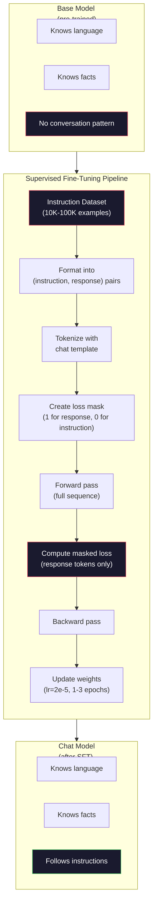

# Instruction Tuning (SFT)

> ベースモデルは次のトークンを予測します。それだけです。指示に従ったり、質問に答えたり、有害な要求を拒否したりはしません。SFTは、トークン予測器と有用なアシスタントの橋渡しです。あなたが会話したことのあるモデル、Claude、GPT、Llama Chatは、すべてこのステップを通っています。

**種類:** Build
**言語:** Python（numpy使用）
**前提条件:** フェーズ10、レッスン04（Mini GPTの事前学習）
**所要時間:** 約90分

## 学習目標

- ベース言語モデルを指示に従うアシスタントへ変換する教師ありファインチューニング（SFT）を実装する
- system、user、assistantのロールを持つチャットテンプレートで学習データを整形し、assistant以外のトークンに対する損失をマスクする
- SFTが必要な理由を説明する。ベースモデルは質問に答えるのではなく、テキストを継続する
- 保留した指示セット上で、ベースモデルとファインチューニング済みモデルの応答を比較し、SFT品質を評価する

## 問題

レッスン04でモデルを学習しました。モデルは、シーケンスを与えられると次のトークンを予測できます。`"The transformer architecture"` を与えると、`"has revolutionized natural language processing."` のように続けるかもしれません。次トークン予測器としては見事です。

では、次を試してください。`"What is the capital of France?"` を与えます。ベースモデルは `"Paris."` と答えません。パターンを継続します。質問リストを含む文書から学習したため、`"What is the capital of Germany? What is the capital of Spain?"` のように生成するかもしれません。あるいは、もっともらしい次トークン継続として `"is a question that many people ask"` を生成するかもしれません。モデルには *答える* という概念がありません。知っているのは *継続する* ことだけです。

これがGPT-3（ベースモデル、2020年6月公開）とChatGPT（指示チューニング済み、2022年11月公開）の差です。同じアーキテクチャ。同じ事前学習。違いは、会話パターンに従うことをモデルに教えた、慎重に作られた20,000から100,000件の（指示、応答）ペアです。

Stanford Alpacaは、数百万件の例が不要であることを示しました。2023年3月、彼らはGPT-3.5で生成した52,000件の指示応答ペアだけを使って、Llama 7Bをファインチューニングしました。総コストは600ドルでした。その結果、指示に従い、質問に答え、会話を続けられるチャットボットができました。ChatGPTほどではありませんが、600ドルと数時間の学習としては驚くほど近いものでした。

MetaのLlama 2 Chatは、初期SFT段階で約27,000件の高品質な例しか使っていません。重要な洞察は、量より質が大切だということです。熟練したアノテータが書いた27,000件の例は、インターネットから収集したノイズの多い100万件の例に勝ります。

## 概念

### SFTが実際に行うこと

Supervised Fine-Tuningは、事前学習と同じ学習ループ、つまり順伝播、損失計算、逆伝播、重み更新を続けます。ただし、データの種類が違います。生テキストではなく、構造化された会話で学習します。

```json
{
  "system": "You are a helpful assistant.",
  "user": "What is the capital of France?",
  "assistant": "The capital of France is Paris."
}
```

モデルは、パリがフランスの首都であることをすでに知っています。事前学習中にWikipedia、教科書、Webページから学んでいます。SFTはモデルに新しい事実を教えるものではありません。モデルに新しい *振る舞い* を教えます。質問を見たら答えを生成する。指示を見たら完了を生成する。有害な要求を見たら拒否する。

こう考えてください。事前学習はモデルに知識を与えます。SFTはモデルに作法を与えます。

### データ形式

業界では3つの形式が主流です。どれも同じ情報、つまり誰が何を言ったかを、異なる区切り記号で符号化します。

**Alpaca形式**（Stanford、2023年3月）:

```json
{
  "instruction": "Summarize the following article in 3 sentences.",
  "input": "The European Central Bank raised interest rates...",
  "output": "The ECB increased rates by 25 basis points..."
}
```

単純で広く使われています。`input` フィールドは任意です。多くの指示では追加コンテキストが不要です。Stanfordはこの形式で52,000件の例を公開しました。GPT-3.5で600ドルをかけて生成したものです。これがオープンソースの指示チューニング運動の始まりになりました。

**ShareGPT形式**（コミュニティ、2023年）:

```json
{
  "conversations": [
    {"from": "system", "value": "You are a helpful assistant."},
    {"from": "human", "value": "What causes tides?"},
    {"from": "gpt", "value": "Tides are caused by the gravitational pull of the Moon..."},
    {"from": "human", "value": "How often do they occur?"},
    {"from": "gpt", "value": "Most coastal areas experience two high tides and two low tides per day..."}
  ]
}
```

複数ターンの会話をサポートします。実際のモデルに関係なく、慣習として `"from"` フィールドには `"human"` と `"gpt"` を使います。Vicunaは、ユーザーが共有したChatGPTの会話記録から収集された70,000件のShareGPT会話で学習されました。

**ChatML形式**（OpenAI、多くのオープンソースモデルで使用）:

```
<|im_start|>system
You are a helpful assistant.<|im_end|>
<|im_start|>user
What is the capital of France?<|im_end|>
<|im_start|>assistant
The capital of France is Paris.<|im_end|>
```

ロールを区切るために特殊トークン（`<|im_start|>`、`<|im_end|>`）を使います。これらのトークンは、ファインチューニング中にトークナイザの語彙へ追加されます。Qwen、Yi、その他多くのモデルがChatMLを使います。

3つの形式はすべて同じことを実現します。「これが指示、これが応答。このパターンを学べ」とモデルに伝えます。

### なぜうまくいくのか

モデルは事前学習によって、すでに言語を知っています。質問に続く回答、指示に続く完了、人同士の会話を、何十億もの例で見ています。パターンはすでに重みに符号化されています。

SFTはこの潜在能力を集中させます。モデルが文脈から、質問に答えるべきなのか文書を続けるべきなのかを推測する代わりに、SFTは会話パターンを明示的に学習します。数千件の例を見た後、モデルは学びます。assistantロールのマーカーを見たら、有用な応答を生成するのだ、と。

だから27,000件の例で十分なのです。モデルに英語を教えているわけではありません。世界についての事実を教えているわけでもありません。教えているのは、指示に応答するという1つの単純な振る舞いです。知識はすでにそこにあります。

### マスク付き損失

これはSFTで最も重要な技術的詳細ですが、多くのチュートリアルでは省略されます。

事前学習では、すべてのトークンに対して損失を計算します。モデルはシーケンス内のすべての次トークンを予測するように学習します。SFTでは、*応答* トークンに対してのみ損失を計算します。指示トークンはコンテキストとして存在しますが、それらを「予測」できなくてもモデルにペナルティを与えません。

なぜでしょうか。モデルに指示を *生成* することを学ばせたいわけではないからです。指示に *応答* することを学ばせたいのです。指示トークンに損失を計算すると、モデルが質問する側であるかのように `"What is the capital of France?"` を予測するよう学習してしまいます。これは勾配信号の無駄であり、モデルの役割理解を混乱させる可能性があります。

実際には、損失マスクを作ります。応答トークンは1、指示トークンは0です。平均する前に、トークンごとの損失にこのマスクを掛けます。

```
Tokens:    [SYS] You are helpful [USER] What is the capital? [ASST] Paris is the capital [EOS]
Loss mask:   0    0    0     0      0     0   0  0     0       1     1    1   1     1      1
```

`[ASST]` 以降のトークンだけが損失に寄与します。モデルは順伝播中に会話全体を見ます（正しい応答を出すには指示が必要です）が、重み更新は応答をどれだけうまく予測したかに基づいてのみ行われます。

### 学習ハイパーパラメータ

SFTは事前学習とは大きく異なるハイパーパラメータを使います。ゼロから学習しているわけではありません。すでに機能しているモデルを調整しています。

| パラメータ | 事前学習 (Llama 2 7B) | SFT (Llama 2 Chat) |
|-----------|---------------------------|---------------------|
| 学習率 | 3e-4（ピーク） | 2e-5 |
| エポック | 1（データを1回だけ通す） | 2 |
| バッチサイズ | 4M tokens | 64 examples |
| ウォームアップステップ | 2,000 | 0-100 |
| 重み減衰 | 0.1 | 0.0-0.1 |
| データサイズ | 2T tokens | 27,000 examples |

SFTの学習率は15倍低くなります。これは重要です。ファインチューニング中に高い学習率を使うと、事前学習済みの知識が破壊されます。モデルは学習したことを「忘れ」、小さなファインチューニングデータセットへ過学習します。これが破滅的忘却です。

2エポックとは、モデルが各学習例を2回見るという意味です。小さなデータセットで3エポックを超えると記憶が起こり、モデルは汎化する代わりに学習例をそのまま再現し始めます。

### 破滅的忘却

ファインチューニングは一般能力を破壊することがあります。指示追従データで長く学習しすぎると、モデルはコードを書いたり、数学を解いたり、創造的な文章を生成したりする能力を失います。学習データの特定形式には非常に強くなりますが、それ以外は苦手になります。

3つの緩和策があります。

1. **低い学習率。** 1e-5から5e-5。更新を小さくすると、事前学習済み特徴の破壊が少なくなります。

2. **短い学習。** 1-3エポック。モデルが過学習する前に止めます。

3. **事前学習データを混ぜる。** Llama 2 Chatは、SFTデータセットに少量（2-5%）の生の事前学習データを混ぜました。これにより、新しい指示追従の振る舞いを学びながら、モデルに一般能力を「思い出させる」ことができます。

### 実際の数値

10,000件の高品質な指示ペアで7Bモデルをファインチューニングするには、NVIDIA A100 80GB GPU 1枚でおよそ1時間かかります。計算は次のとおりです。

- 10,000 examples x 平均512 tokens = 5.12M tokens
- 2 epochs = 合計10.24M tokens
- 7BモデルのA100ファインチューニングスループット: 約3,000 tokens/second
- 10.24M / 3,000 = 約3,400秒 = 約57分

このMini GPT（4層、128次元）の学習はほぼ一瞬です。重要なのはスケールではなく、仕組みを理解することです。



## 作ってみよう

### ステップ1: 指示データセット

合成の指示データセットを作ります。本番では、Scale AIやAnthropicのような企業が人間のアノテータを雇ってこれらを書きます。ここでは形式を示すためにプログラムで作ります。

```python
import numpy as np

INSTRUCTION_DATA = [
    {
        "instruction": "What is the capital of France?",
        "response": "The capital of France is Paris."
    },
    {
        "instruction": "Explain gravity in one sentence.",
        "response": "Gravity is the force that attracts objects with mass toward each other."
    },
    {
        "instruction": "Write a haiku about the ocean.",
        "response": "Waves crash on the shore, salt and foam beneath the sun, endless blue expanse."
    },
    {
        "instruction": "What is 15 multiplied by 7?",
        "response": "15 multiplied by 7 is 105."
    },
    {
        "instruction": "Name three programming languages.",
        "response": "Three programming languages are Python, Rust, and TypeScript."
    },
    {
        "instruction": "Summarize photosynthesis.",
        "response": "Photosynthesis converts sunlight, water, and carbon dioxide into glucose and oxygen."
    },
    {
        "instruction": "What year did World War II end?",
        "response": "World War II ended in 1945."
    },
    {
        "instruction": "Define machine learning.",
        "response": "Machine learning is a field where algorithms learn patterns from data to make predictions."
    },
]
```

8件の例は非常に小さいです。Stanford Alpacaは52,000件を使いました。しかし、8件でも52,000件でも仕組みは同じです。トークン化し、マスクし、応答だけに損失を計算します。

### ステップ2: チャットテンプレートでトークン化する

指示応答ペアを、特殊なロールマーカー付きのトークン列へ変換します。マーカーは、指示がどこで終わり、応答がどこで始まるかをモデルに伝えます。

```python
SPECIAL_TOKENS = {
    "INST_START": 253,
    "INST_END": 254,
    "RESP_START": 255,
}


def tokenize_instruction_pair(instruction, response, vocab_size=256):
    inst_tokens = list(instruction.encode("utf-8"))
    resp_tokens = list(response.encode("utf-8"))

    inst_tokens = [min(t, vocab_size - 4) for t in inst_tokens]
    resp_tokens = [min(t, vocab_size - 4) for t in resp_tokens]

    tokens = (
        [SPECIAL_TOKENS["INST_START"]]
        + inst_tokens
        + [SPECIAL_TOKENS["INST_END"]]
        + [SPECIAL_TOKENS["RESP_START"]]
        + resp_tokens
    )

    return tokens


def create_loss_mask(tokens):
    mask = np.zeros(len(tokens), dtype=np.float32)
    in_response = False

    for i, token in enumerate(tokens):
        if token == SPECIAL_TOKENS["RESP_START"]:
            in_response = True
            continue
        if in_response:
            mask[i] = 1.0

    return mask
```

損失マスクは、指示トークンではすべて0、応答トークンではすべて1です。`RESP_START` トークン自体のマスクは0です。これは区切り記号であり、応答本文の一部ではないからです。

### ステップ3: マスク付きクロスエントロピー損失

標準的なクロスエントロピーですが、損失マスクを掛けます。応答トークンだけが勾配に寄与します。

```python
def masked_cross_entropy_loss(logits, targets, loss_mask):
    batch, seq_len, vocab_size = logits.shape
    logits_flat = logits.reshape(-1, vocab_size)
    targets_flat = targets.reshape(-1)
    mask_flat = loss_mask.reshape(-1)

    max_logits = logits_flat.max(axis=-1, keepdims=True)
    log_softmax = logits_flat - max_logits - np.log(
        np.exp(logits_flat - max_logits).sum(axis=-1, keepdims=True)
    )

    per_token_loss = -log_softmax[np.arange(len(targets_flat)), targets_flat]

    masked_loss = per_token_loss * mask_flat
    num_response_tokens = mask_flat.sum()
    if num_response_tokens == 0:
        return 0.0
    loss = masked_loss.sum() / num_response_tokens

    return loss
```

分母は `seq_len` ではなく `num_response_tokens` です。総シーケンス長で割ると、長い指示が勾配信号を薄めてしまいます。応答トークン数で割ることで、指示長に関係なく、応答トークンごとの重みを等しくできます。

### ステップ4: SFT学習ループ

レッスン04のMiniGPTを再利用します。学習ループは事前学習とほぼ同じですが、指示形式化とマスク付き損失が加わります。

```python
import sys
import os
sys.path.insert(0, os.path.join(os.path.dirname(__file__), "..", "..", "04-pre-training-mini-gpt", "code"))
from main import MiniGPT, LayerNorm, FeedForward, MultiHeadAttention, TransformerBlock, Embedding


def sft_train(model, dataset, num_epochs=2, lr=2e-5, seq_len=64):
    formatted_data = []
    for example in dataset:
        tokens = tokenize_instruction_pair(example["instruction"], example["response"])
        mask = create_loss_mask(tokens)
        formatted_data.append((tokens, mask))

    print(f"SFT Training: {len(formatted_data)} examples, {num_epochs} epochs, lr={lr}")
    print(f"Total tokens: {sum(len(t) for t, _ in formatted_data):,}")
    print()

    losses = []

    for epoch in range(num_epochs):
        epoch_loss = 0.0
        num_batches = 0

        indices = np.random.permutation(len(formatted_data))

        for idx in indices:
            tokens, mask = formatted_data[idx]

            if len(tokens) < 3:
                continue
            if len(tokens) > seq_len:
                tokens = tokens[:seq_len]
                mask = mask[:seq_len]

            input_ids = np.array(tokens[:-1]).reshape(1, -1)
            target_ids = np.array(tokens[1:]).reshape(1, -1)
            loss_mask = np.array(mask[1:]).reshape(1, -1)

            logits = model.forward(input_ids)
            loss = masked_cross_entropy_loss(logits, target_ids, loss_mask)

            batch_size, s_len, v_size = logits.shape
            probs = np.exp(logits - logits.max(axis=-1, keepdims=True))
            probs = probs / probs.sum(axis=-1, keepdims=True)
            dlogits = probs.copy()
            dlogits[np.arange(batch_size)[:, None], np.arange(s_len), target_ids] -= 1.0

            mask_expanded = loss_mask[:, :, np.newaxis]
            num_resp = loss_mask.sum()
            if num_resp > 0:
                dlogits = dlogits * mask_expanded / num_resp

            for block in model.blocks:
                block.ffn.W1 -= lr * np.random.randn(*block.ffn.W1.shape) * 0.01
                block.ffn.W2 -= lr * np.random.randn(*block.ffn.W2.shape) * 0.01
                block.ffn.b1 -= lr * np.random.randn(*block.ffn.b1.shape) * 0.01
                block.ffn.b2 -= lr * np.random.randn(*block.ffn.b2.shape) * 0.01

            epoch_loss += loss
            num_batches += 1
            losses.append(loss)

        avg_loss = epoch_loss / max(num_batches, 1)
        print(f"Epoch {epoch + 1}/{num_epochs} | Avg Loss: {avg_loss:.4f}")

    return model, losses
```

学習率は2e-5で、Llama 2 Chatに合わせています。事前学習で使った3e-4と比べてください。15倍小さいです。勾配はマスクされています。指示トークンはゼロ勾配を生みます。重みを押すのは応答トークンだけです。

### ステップ5: ベースモデルとSFTモデルを比較する

SFTの目的は振る舞いの変化です。指示形式の入力と生テキストの継続に対するモデルの応答を確認して測定します。

```python
def generate_response(model, prompt_tokens, max_new_tokens=50, temperature=0.8):
    tokens = list(prompt_tokens)
    seq_len = model.embedding.pos_embed.shape[0]

    for _ in range(max_new_tokens):
        context = np.array(tokens[-seq_len:]).reshape(1, -1)
        logits = model.forward(context)
        next_logits = logits[0, -1, :]

        next_logits = next_logits / max(temperature, 1e-8)
        probs = np.exp(next_logits - next_logits.max())
        probs = probs / probs.sum()
        probs = np.clip(probs, 1e-10, 1.0)
        probs = probs / probs.sum()

        next_token = np.random.choice(len(probs), p=probs)
        tokens.append(int(next_token))

    return tokens


def evaluate_instruction_following(model, instructions):
    print("Evaluating instruction following:")
    print("-" * 50)

    for instruction in instructions:
        tokens = (
            [SPECIAL_TOKENS["INST_START"]]
            + [min(t, 252) for t in list(instruction.encode("utf-8"))]
            + [SPECIAL_TOKENS["INST_END"]]
            + [SPECIAL_TOKENS["RESP_START"]]
        )

        output = generate_response(model, tokens, max_new_tokens=30, temperature=0.6)
        response_start = len(tokens)
        response_tokens = output[response_start:]
        response_bytes = bytes([t for t in response_tokens if t < 128])
        response_text = response_bytes.decode("utf-8", errors="replace")

        print(f"  Q: {instruction}")
        print(f"  A: {response_text[:80]}")
        print()
```

8件の例で学習した小さなモデルでは、応答は意味のあるものになりません。それは想定どおりです。重要なのは *構造* です。モデルは、さらに指示を生成し続けるのではなく、応答マーカーの後に出力を生成することを学びます。

### ステップ6: 破滅的忘却を測る

SFT前後で、モデルの次トークン予測能力を比較します。SFTが一般能力を損なっている場合、生テキスト上の損失が増えます。

```python
def measure_forgetting(model, test_text, seq_len=64):
    tokens = np.array(list(test_text.encode("utf-8")[:512]))

    total_loss = 0.0
    num_windows = 0

    for start in range(0, len(tokens) - seq_len - 1, seq_len):
        input_ids = tokens[start:start + seq_len].reshape(1, -1)
        target_ids = tokens[start + 1:start + seq_len + 1].reshape(1, -1)

        logits = model.forward(input_ids)

        batch, s_len, vocab_size = logits.shape
        logits_flat = logits.reshape(-1, vocab_size)
        targets_flat = target_ids.reshape(-1)

        max_logits = logits_flat.max(axis=-1, keepdims=True)
        log_softmax = logits_flat - max_logits - np.log(
            np.exp(logits_flat - max_logits).sum(axis=-1, keepdims=True)
        )

        loss = -log_softmax[np.arange(len(targets_flat)), targets_flat].mean()
        total_loss += loss
        num_windows += 1

    return total_loss / max(num_windows, 1)
```

実際のファインチューニングでは、学習中ずっとこの指標を追跡します。生テキスト損失が10-15%を超えて増えるなら、SFTが強すぎます。学習率を下げるか、エポック数を減らしてください。

## 使ってみよう

### 完全なSFTパイプラインのデモ

```python
if __name__ == "__main__":
    np.random.seed(42)

    test_text = """The transformer architecture processes sequences through self-attention.
Each layer applies multi-head attention followed by a feedforward network.
Residual connections and layer normalization stabilize deep networks.
The model learns to predict the next token given all previous tokens."""

    print("=" * 70)
    print("INSTRUCTION TUNING (SFT) DEMO")
    print("=" * 70)
    print()

    model = MiniGPT(
        vocab_size=256, embed_dim=128, num_heads=4,
        num_layers=4, max_seq_len=128, ff_dim=512
    )
    print(f"Model: {model.count_parameters():,} parameters")
    print(f"Config: 4 layers, 4 heads, 128 dims (mini GPT from Lesson 04)")
    print()

    print("PRE-SFT: Measuring base model loss on raw text")
    base_loss = measure_forgetting(model, test_text)
    print(f"  Base model loss: {base_loss:.4f}")
    print()

    print("=" * 70)
    print("SFT TRAINING")
    print("=" * 70)

    model, losses = sft_train(
        model, INSTRUCTION_DATA, num_epochs=3, lr=2e-5, seq_len=128
    )

    print()
    print("POST-SFT: Measuring fine-tuned model loss on raw text")
    sft_loss = measure_forgetting(model, test_text)
    print(f"  SFT model loss: {sft_loss:.4f}")
    print(f"  Change: {((sft_loss - base_loss) / base_loss * 100):+.1f}%")
    if abs(sft_loss - base_loss) / base_loss < 0.15:
        print("  Minimal forgetting (< 15% change)")
    else:
        print("  Significant forgetting detected")
    print()

    print("=" * 70)
    print("INSTRUCTION FOLLOWING EVALUATION")
    print("=" * 70)
    print()

    test_instructions = [
        "What is the capital of France?",
        "Name a programming language.",
        "Define gravity.",
    ]
    evaluate_instruction_following(model, test_instructions)

    print("=" * 70)
    print("DATA FORMAT EXAMPLES")
    print("=" * 70)
    print()

    for i, example in enumerate(INSTRUCTION_DATA[:3]):
        tokens = tokenize_instruction_pair(example["instruction"], example["response"])
        mask = create_loss_mask(tokens)
        resp_count = int(mask.sum())
        total_count = len(tokens)
        print(f"  Example {i + 1}: {total_count} tokens, {resp_count} response tokens ({resp_count/total_count:.0%} of sequence)")
        print(f"    Instruction: {example['instruction']}")
        print(f"    Response: {example['response']}")
        print()

    print("=" * 70)
    print("TRAINING LOSS CURVE")
    print("=" * 70)
    print()

    if losses:
        window = max(1, len(losses) // 5)
        for i in range(0, len(losses), window):
            chunk = losses[i:i + window]
            avg = sum(chunk) / len(chunk)
            print(f"  Steps {i:3d}-{i + len(chunk) - 1:3d}: avg loss = {avg:.4f}")
```

## 出荷しよう

このレッスンでは `outputs/prompt-sft-data-curator.md` を作成します。これは、SFT用の指示データセットを設計し、キュレーションするためのプロンプトです。対象能力（コード生成、数学、会話）を与えると、形式仕様、品質基準、多様性要件を含むデータ収集計画を生成します。

## 演習

1. systemプロンプトのサポートを追加しましょう。`tokenize_instruction_pair` を修正し、systemメッセージを受け取り、指示の前に付加できるようにします。異なるsystemプロンプト（`"You are a poet"`、`"You are a math tutor"`）を持つ例を5件作り、学習中にモデルが異なるsystemプロンプトを見ることを確認してください。

2. データ混合を実装しましょう。SFTデータセットと生テキストコーパスを受け取り、5%が生テキスト（マスクなし）、95%が指示ペア（マスクあり）になる学習バッチを作る関数を作成します。3エポック実行し、純粋なSFT学習と忘却指標を比較してください。

3. データ品質スコアラーを作りましょう。各指示応答ペアについて、(a) 応答長（トークン数）、(b) 指示対応答比、(c) 語彙多様性（unique tokens / total tokens）を計算します。応答長が10トークン未満、または多様性が0.3未満の例を除外します。フィルタリングが最終損失へどう影響するかを示してください。

4. 複数ターン会話の学習を実装しましょう。トークン化を拡張し、3ターン会話（user-assistant-user-assistant-user-assistant）を扱えるようにします。損失マスクは3つすべてのassistantターンを覆うべきです。1つの例についてトークンとマスクの対応を出力し、マスクが正しいことを確認してください。

5. 学習率を比較しましょう。同じモデルを lr=1e-4、lr=2e-5、lr=1e-6 で3回学習します。損失曲線をプロットしてください。1e-4の実行は初期に急速に下がるものの最終損失が高くなる（過学習）でしょう。1e-6の実行はほとんど動かないはずです。2e-5がちょうどよいはずです。

## 重要用語

| 用語 | よく言われる説明 | 実際の意味 |
|------|----------------|----------------------|
| SFT | 「会話でファインチューニングする」 | Supervised Fine-Tuning。応答トークンだけに損失を計算しながら、（指示、応答）ペアで学習を続けること |
| Instruction tuning | 「モデルに指示へ従うことを教える」 | ベースモデルが新しい知識ではなく会話パターンを学ぶように、明示的な指示応答ペアで学習すること |
| Loss masking | 「プロンプトを無視する」 | 指示トークンの損失をゼロにし、応答トークン予測からだけ勾配が流れるようにすること |
| ChatML | 「Chat Markup Language」 | `<\|im_start\|>` と `<\|im_end\|>` 区切りで会話データ内の話者ロールを示すトークン形式 |
| Alpaca format | 「Stanfordの形式」 | instruction/input/outputフィールドを持つJSON形式。600ドルで生成された52K件のGPT-3.5例に使われた |
| Catastrophic forgetting | 「モデルが賢くなくなる」 | 勾配更新が一般知識をタスク固有パターンで上書きし、ファインチューニングが事前学習能力を破壊すること |
| Weight tying | 「共有埋め込み」 | 入力トークン埋め込みと出力予測ヘッドに同じ行列を使い、パラメータを節約して一貫性を改善すること |
| Chat template | 「プロンプトの整形方法」 | モデル向けに会話を構造化する、ロールマーカーや区切り記号を含む具体的なトークン列 |

## 参考文献

- [Ouyang et al., 2022 -- "Training language models to follow instructions with human feedback" (InstructGPT)](https://arxiv.org/abs/2203.02155) -- OpenAIで指示チューニング + RLHFを導入した論文
- [Taori et al., 2023 -- "Stanford Alpaca: An Instruction-following LLaMA Model"](https://github.com/tatsu-lab/stanford_alpaca) -- 600ドルで作った52K件の指示例により、小規模データセットでもSFTが機能することを示した
- [Touvron et al., 2023 -- "Llama 2: Open Foundation and Fine-Tuned Chat Models"](https://arxiv.org/abs/2307.09288) -- 27K件の高品質例を用いたMetaのSFT + RLHFパイプライン
- [Chiang et al., 2023 -- "Vicuna: An Open-Source Chatbot Impressing GPT-4"](https://lmsys.org/blog/2023-03-30-vicuna/) -- 70K件のShareGPT会話での学習
- [Zhou et al., 2023 -- "LIMA: Less Is More for Alignment"](https://arxiv.org/abs/2305.11206) -- 慎重にキュレーションした1,000件の例が、はるかに大きなデータセットでのSFTに匹敵し得ることを示した論文
