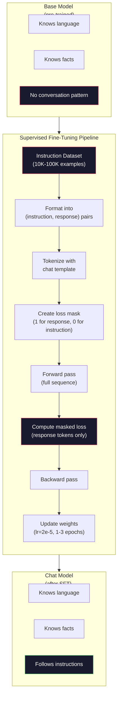

# Talimat Ayarlama (SFT)

> Bir temel model bir sonraki token'yi tahmin eder. İşte bu. Talimatlara uymaz, soruları yanıtlamaz veya zararlı istekleri reddetmez. SFT, token tahmincisi ile kullanışlı bir asistan arasındaki köprüdür. Şu ana kadar konuştuğunuz her model (Claude, GPT, Llama Chat) bu adımdan geçti.

**Tür:** Yapım
**Diller:** Python (numpy ile)
**Önkoşullar:** Aşama 10, Ders 04 (Mini GPT Ön Eğitimi)
**Süre:** ~90 dakika

## Öğrenme Hedefleri

- Temel dil modelini talimat takip eden bir asistana dönüştüren denetimli fine-tuning (SFT) uygulamasını uygulayın
- Sistem, kullanıcı ve asistan rolleri içeren sohbet şablonlarını kullanarak eğitim verilerini biçimlendirin ve asistan olmayan token'lerde maske kaybı
- SFT'nin neden gerekli olduğunu açıklayın: temel modeller soruları yanıtlamak yerine metnin devamını sağlar
- Uzatılmış bir talimat setinde temel model ile ince ayarlı model yanıtlarını karşılaştırarak SFT kalitesini değerlendirin

## Sorun

Ders 04'te bir model eğittiniz. Bu model, bir dizi verildiğinde sonraki token'yi tahmin edebilir. Bunu "transformer mimarisi" ile beslerseniz "doğal dil işlemede devrim yarattı" şeklinde devam edebilir. Bir sonraki token tahmincisi için bu etkileyici.

Şimdi şunu deneyin: besleyin "Fransa'nın başkenti nedir?" Temel model "Paris"e cevap vermiyor. Deseni devam ettiriyor. "Almanya'nın başkenti nedir? İspanya'nın başkenti nedir?" sorusunu üretebilir. çünkü soru listelerini içeren belgelerden öğrendi. Veya "birçok insanın sorduğu bir soru" ortaya çıkabilir çünkü bu, token'nin bir sonraki makul devamıdır. Modelde *cevap verme* kavramı yoktur. Sadece *devam etmeyi* biliyor.

Bu, GPT-3 (temel model, Haziran 2020'de yayınlandı) ile ChatGPT (talimatlara göre ayarlanmış, Kasım 2022'de yayınlandı) arasındaki boşluktur. Aynı mimari. Aynı ön eğitim. Aradaki fark, modele konuşma modelini takip etmeyi öğreten, dikkatlice hazırlanmış (talimat, yanıt) çiftlerin 20.000 ila 100.000'idir.

Stanford Alpaca milyonlarca örneğe ihtiyacınız olmadığını kanıtladı. Mart 2023'te Llama 7B'de GPT-3.5 tarafından oluşturulan yalnızca 52.000 talimat-yanıt çiftinde ince ayar yaptılar. Toplam maliyet: $600. The result was a chatbot that could follow instructions, answer questions, and hold conversations. Not as good as ChatGPT, but shockingly close for $600 ve birkaç saatlik eğitim.

Meta'nın Llama 2 Chat'i, ilk SFT aşamasında yalnızca ~27.000 yüksek kaliteli örnek kullandı. Temel fikir: nitelik nicelikten daha önemlidir. Yetenekli yorumcular tarafından yazılan 27.000 örnek, internetten alınan 1 milyon gürültülü örneği geride bıraktı.

## Konsept

### SFT Aslında Ne Yapar?

Denetimli Fine-Tuning, eğitim öncesi ile aynı eğitim döngüsünü (ileri geçiş, hesaplama kaybı, geri geçiş, güncelleme ağırlıkları) ancak farklı türde verilerle sürdürür. Ham metin yerine yapılandırılmış konuşmalar üzerinde eğitim alırsınız:

```json
{
  "system": "You are a helpful assistant.",
  "user": "What is the capital of France?",
  "assistant": "The capital of France is Paris."
}
```

Model zaten Paris'in Fransa'nın başkenti olduğunu biliyor. Bunu Vikipedi, ders kitapları ve web sayfalarındaki ön eğitim sırasında öğrendi. SFT modele yeni gerçekleri öğretmez. Modele yeni bir *davranış* öğretir: Bir soru gördüğünüzde cevap üretme. Bir talimat gördüğünüzde bir tamamlama üretin. Zararlı bir istek gördüğünüzde, bir ret cevabı verin.

Bunu bu şekilde düşünün. Ön eğitim model bilgisini verir. SFT modelin davranışlarını verir.

### Veri Formatları

Sektöre üç format hakimdir. Her biri aynı bilgiyi (kimin ne söylediğini) farklı sınırlayıcılarla kodlar.

**Alpaka Formatı** (Stanford, Mart 2023):

```json
{
  "instruction": "Summarize the following article in 3 sentences.",
  "input": "The European Central Bank raised interest rates...",
  "output": "The ECB increased rates by 25 basis points..."
}
```

Basit ve yaygın olarak kullanılır. `input` alanı isteğe bağlıdır; birçok talimatın ek bağlama ihtiyacı yoktur. Stanford, GPT-3.5 tarafından 600 $ karşılığında oluşturulan bu formatta 52.000 örnek yayınladı. Bu, açık kaynaklı talimat ayarlama hareketini başlattı.

**ShareGPT Formatı** (topluluk, 2023):

```json
{
  "conversations": [
    {"from": "system", "value": "You are a helpful assistant."},
    {"from": "human", "value": "What causes tides?"},
    {"from": "gpt", "value": "Tides are caused by the gravitational pull of the Moon..."},
    {"from": "human", "value": "How often do they occur?"},
    {"from": "gpt", "value": "Most coastal areas experience two high tides and two low tides per day..."}
  ]
}
```

Çok turlu konuşmaları destekler. "Kimden" alanı, gerçek modelden bağımsız olarak geleneksel olarak "insan" ve "gpt"yi kullanır. Vicuna, kullanıcı tarafından paylaşılan ChatGPT transkriptlerinden alınan 70.000 ShareGPT konuşması üzerine eğitildi.

**ChatML Formatı** (OpenAI, birçok açık kaynaklı model tarafından kullanılır):

```
<|im_start|>system
You are a helpful assistant.<|im_end|>
<|im_start|>user
What is the capital of France?<|im_end|>
<|im_start|>assistant
The capital of France is Paris.<|im_end|>
```

Rolleri sınırlamak için özel token'leri (`<|im_start|>`, `<|im_end|>`) kullanır. Bu token'ler, fine-tuning sırasında tokenizer'nin sözlüğüne eklenir. Qwen, Yi ve diğer birçok model ChatML'i kullanıyor.

Her üç format da aynı şeyi başarıyor: Modele "talimat bu, yanıt bu, bu modeli öğren" diyorlar.

### Neden Çalışıyor?

Model dili zaten ön eğitimden biliyor. Milyarlarca soru örneğinin ardından yanıtlar, talimatların ardından tamamlamalar ve insanlar arasındaki konuşmalar görüldü. Desenler zaten ağırlıklarda kodlanmıştır.

SFT bu gizli yeteneği yoğunlaştırır. Modelin bağlamdan bir soruyu yanıtlaması mı yoksa bir belgeye devam etmesi mi gerektiğini anlaması yerine, SFT açıkça konuşma modeli üzerinde eğitim veriyor. Birkaç bin örnekten sonra model şunları öğrenir: Asistan rolü işaretçisini gördüğünüzde yararlı bir yanıt verin.

Bu nedenle 27.000 örnek yeterlidir. Örnek İngilizce öğretmiyorsunuz. Ona dünya hakkındaki gerçekleri öğretmiyorsunuz. Ona basit bir davranışı öğretiyorsunuz: talimatlara yanıt vermek. Bilgi zaten oradaydı.

### Maskelenmiş Kayıp

Bu, SFT'deki en önemli teknik detaydır ve çoğu eğitimde bunu atlar.

Eğitim öncesi sırasında, her token'deki kaybı hesaplarsınız. Model, dizideki her bir sonraki token'yi tahmin etmeyi öğrenir. SFT sırasında, yalnızca *yanıt* token'lerdeki kaybı hesaplarsınız. token talimatları bağlam için oradadır, ancak model bunları yanlış "tahmin ettiği" için cezalandırılmaz.

Neden? Çünkü modelin talimat *oluşturmayı* öğrenmesini istemezsiniz. Talimatlara *yanıt vermeyi* öğrenmesini istiyorsunuz. Eğer kaybı tokens talimatına göre hesaplıyorsanız, modeli "Fransa'nın başkenti nedir?" tahmininde bulunacak şekilde eğitiyorsunuz demektir. sanki soruyu soran oydu. Bu, gradient sinyalini boşa harcar ve modelin rolü konusunda kafa karıştırıcı olabilir.

Pratikte bir kayıp maskesi yaratırsınız: token yanıtı için 1, token talimatı için 0. Ortalamayı almadan önce token başına kaybı bu maskeyle çarpın.

```
Tokens:    [SYS] You are helpful [USER] What is the capital? [ASST] Paris is the capital [EOS]
Loss mask:   0    0    0     0      0     0   0  0     0       1     1    1   1     1      1
```

Yalnızca `[ASST]`'den sonraki token'ler kayba katkıda bulunur. Model, ileri geçiş sırasında konuşmanın tamamını görür (doğru yanıtı üretmek için talimata ihtiyaç duyar) ancak ağırlıklarını yalnızca yanıtı ne kadar iyi tahmin ettiğine bağlı olarak günceller.

### Eğitim Hiperparametreleri

SFT, ön eğitimden önemli ölçüde farklı hiperparametreler kullanır. Sıfırdan eğitim almıyorsunuz. Zaten çalışan bir modeli ayarlıyorsunuz.

| Parametre | Ön Eğitim (Llama 2 7B) | SFT (Llama 2 Sohbeti) |
|-----------|---------------------------|---------------------|
| Öğrenme oranı | 3e-4 (zirve) | 2e-5 |
| Çağlar | 1 (tek geçişli veri) | 2 |
| Parti boyutu | 4M token | 64 örnek |
| Isınma adımları | 2.000 | 0-100 |
| Ağırlık azalması | 0.1 | 0.0-0.1 |
| Veri boyutu | 2T token'ler | 27.000 örnek |

Öğrenme oranı SFT için 15 kat daha düşüktür. Bu çok kritik. fine-tuning sırasındaki yüksek öğrenme oranı, önceden eğitilmiş bilgiyi yok eder. Model öğrendiklerini "unutuyor" ve küçük fine-tuning dataset'ye aşırı uyum sağlıyor. Bu felaket bir unutkanlıktır.

İki dönem, modelin her eğitim örneğini iki kez gördüğü anlamına gelir. Küçük bir dataset üzerinde 3'ten fazla dönem ezberlemeye yol açar; model, genelleme yapmak yerine eğitim örneklerini kelimesi kelimesine yeniden üretmeye başlar.

### Felaketli Unutuş

Fine-tuning genel yetenekleri yok edebilir. Talimatları takip eden veriler üzerinde çok uzun süre eğitim verirseniz model kod yazma, matematik yapma veya yaratıcı metin üretme yeteneğini kaybeder. Eğitim verilerinin özel formatında çok iyi, geri kalan her şeyde ise berbat hale geliyor.

Üç hafifletme:

1. **Düşük öğrenme oranı.** 1e-5 ila 5e-5. Daha küçük güncellemeler, önceden eğitilmiş özelliklerin daha az tahrip olması anlamına gelir.

2. **Kısa eğitim.** 1-3 dönem. Model fazla oturmadan önce durun.

3. **Eğitim öncesi verileri karıştırın.** Llama 2 Chat, ham eğitim öncesi verilerinin küçük bir yüzdesini (%2-5) SFT dataset'ye karıştırdı. Bu, yeni talimat izleme davranışını öğrenirken modele genel yeteneklerini "hatırlatır".

### Gerçek Sayılar

Fine-tuning 10.000 yüksek kaliteli talimat çiftinden oluşan bir 7B modeli, tek bir NVIDIA A100 80 GB GPU'da yaklaşık 1 saat sürer. İşte matematik:

- 10.000 örnek x 512 token ortalaması = 5,12 milyon token
- 2 dönem = toplam 10,24 milyon token
- 7B modeli fine-tuning için A100 verimi: ~3.000 tokens/saniye
- 10,24M / 3.000 = ~3.400 saniye = ~57 dakika

Mini GPT'miz (4 katman, 128 karartma) için eğitim neredeyse anında gerçekleşir. Önemli olan ölçeği değil mekaniği anlamaktır.



## İnşa Et

### Adım 1: Talimat Dataset

Sentetik bir talimat dataset oluşturun. Üretimde Scale AI ve Anthropic gibi şirketler bunları yazmak için insan yorumlayıcıları kullanıyor. Formatı göstermek için bunları programlı olarak oluşturacağız.

```python
import numpy as np

INSTRUCTION_DATA = [
    {
        "instruction": "What is the capital of France?",
        "response": "The capital of France is Paris."
    },
    {
        "instruction": "Explain gravity in one sentence.",
        "response": "Gravity is the force that attracts objects with mass toward each other."
    },
    {
        "instruction": "Write a haiku about the ocean.",
        "response": "Waves crash on the shore, salt and foam beneath the sun, endless blue expanse."
    },
    {
        "instruction": "What is 15 multiplied by 7?",
        "response": "15 multiplied by 7 is 105."
    },
    {
        "instruction": "Name three programming languages.",
        "response": "Three programming languages are Python, Rust, and TypeScript."
    },
    {
        "instruction": "Summarize photosynthesis.",
        "response": "Photosynthesis converts sunlight, water, and carbon dioxide into glucose and oxygen."
    },
    {
        "instruction": "What year did World War II end?",
        "response": "World War II ended in 1945."
    },
    {
        "instruction": "Define machine learning.",
        "response": "Machine learning is a field where algorithms learn patterns from data to make predictions."
    },
]
```

Sekiz örnek çok küçük. Stanford Alpaca 52.000 kullandı. Ancak mekanik, ister 8 ister 52.000 olsun aynıdır: tokenize, maske, yalnızca yanıtlarda hesaplama kaybı.

### Adım 2: Sohbet Şablonu ile Tokenize

Özel rol işaretleyicileriyle talimat-yanıt çiftlerini token dizilerine dönüştürün. İşaretçiler modele talimatın nerede bittiğini ve yanıtın nerede başladığını söyler.

```python
SPECIAL_TOKENS = {
    "INST_START": 253,
    "INST_END": 254,
    "RESP_START": 255,
}


def tokenize_instruction_pair(instruction, response, vocab_size=256):
    inst_tokens = list(instruction.encode("utf-8"))
    resp_tokens = list(response.encode("utf-8"))

    inst_tokens = [min(t, vocab_size - 4) for t in inst_tokens]
    resp_tokens = [min(t, vocab_size - 4) for t in resp_tokens]

    tokens = (
        [SPECIAL_TOKENS["INST_START"]]
        + inst_tokens
        + [SPECIAL_TOKENS["INST_END"]]
        + [SPECIAL_TOKENS["RESP_START"]]
        + resp_tokens
    )

    return tokens


def create_loss_mask(tokens):
    mask = np.zeros(len(tokens), dtype=np.float32)
    in_response = False

    for i, token in enumerate(tokens):
        if token == SPECIAL_TOKENS["RESP_START"]:
            in_response = True
            continue
        if in_response:
            mask[i] = 1.0

    return mask
```

Kayıp maskesinin tamamı token talimatları için sıfırlardan ve token yanıtı için tamamı birlerden oluşur. `RESP_START` token'nin kendisi 0 maskesi alır çünkü bu, yanıt içeriğinin bir parçası değil, bir sınırlayıcıdır.

### Adım 3: Maskelenmiş Çapraz Entropi Kaybı

Standart çapraz entropi, ancak kayıp maskesiyle çarpılır. Yalnızca yanıt token'ler gradient'ye katkıda bulunur.

```python
def masked_cross_entropy_loss(logits, targets, loss_mask):
    batch, seq_len, vocab_size = logits.shape
    logits_flat = logits.reshape(-1, vocab_size)
    targets_flat = targets.reshape(-1)
    mask_flat = loss_mask.reshape(-1)

    max_logits = logits_flat.max(axis=-1, keepdims=True)
    log_softmax = logits_flat - max_logits - np.log(
        np.exp(logits_flat - max_logits).sum(axis=-1, keepdims=True)
    )

    per_token_loss = -log_softmax[np.arange(len(targets_flat)), targets_flat]

    masked_loss = per_token_loss * mask_flat
    num_response_tokens = mask_flat.sum()
    if num_response_tokens == 0:
        return 0.0
    loss = masked_loss.sum() / num_response_tokens

    return loss
```

Payda `seq_len` değil, `num_response_tokens`'dir. Toplam dizi uzunluğuna bölerseniz, daha uzun komutlar gradient sinyalini sulandırır. Yanıt token sayısına bölmek, talimat uzunluğundan bağımsız olarak token yanıt başına eşit ağırlık sağlar.

### Adım 4: SFT Eğitim Döngüsü

Ders 04'teki MiniGPT'yi yeniden kullanın. Eğitim döngüsü, eğitim öncesi ile neredeyse aynı görünüyor ancak talimat formatı ve maskelenmiş kayıp var.

```python
import sys
import os
sys.path.insert(0, os.path.join(os.path.dirname(__file__), "..", "..", "04-pre-training-mini-gpt", "code"))
from main import MiniGPT, LayerNorm, FeedForward, MultiHeadAttention, TransformerBlock, Embedding


def sft_train(model, dataset, num_epochs=2, lr=2e-5, seq_len=64):
    formatted_data = []
    for example in dataset:
        tokens = tokenize_instruction_pair(example["instruction"], example["response"])
        mask = create_loss_mask(tokens)
        formatted_data.append((tokens, mask))

    print(f"SFT Training: {len(formatted_data)} examples, {num_epochs} epochs, lr={lr}")
    print(f"Total tokens: {sum(len(t) for t, _ in formatted_data):,}")
    print()

    losses = []

    for epoch in range(num_epochs):
        epoch_loss = 0.0
        num_batches = 0

        indices = np.random.permutation(len(formatted_data))

        for idx in indices:
            tokens, mask = formatted_data[idx]

            if len(tokens) < 3:
                continue
            if len(tokens) > seq_len:
                tokens = tokens[:seq_len]
                mask = mask[:seq_len]

            input_ids = np.array(tokens[:-1]).reshape(1, -1)
            target_ids = np.array(tokens[1:]).reshape(1, -1)
            loss_mask = np.array(mask[1:]).reshape(1, -1)

            logits = model.forward(input_ids)
            loss = masked_cross_entropy_loss(logits, target_ids, loss_mask)

            batch_size, s_len, v_size = logits.shape
            probs = np.exp(logits - logits.max(axis=-1, keepdims=True))
            probs = probs / probs.sum(axis=-1, keepdims=True)
            dlogits = probs.copy()
            dlogits[np.arange(batch_size)[:, None], np.arange(s_len), target_ids] -= 1.0

            mask_expanded = loss_mask[:, :, np.newaxis]
            num_resp = loss_mask.sum()
            if num_resp > 0:
                dlogits = dlogits * mask_expanded / num_resp

            for block in model.blocks:
                block.ffn.W1 -= lr * np.random.randn(*block.ffn.W1.shape) * 0.01
                block.ffn.W2 -= lr * np.random.randn(*block.ffn.W2.shape) * 0.01
                block.ffn.b1 -= lr * np.random.randn(*block.ffn.b1.shape) * 0.01
                block.ffn.b2 -= lr * np.random.randn(*block.ffn.b2.shape) * 0.01

            epoch_loss += loss
            num_batches += 1
            losses.append(loss)

        avg_loss = epoch_loss / max(num_batches, 1)
        print(f"Epoch {epoch + 1}/{num_epochs} | Avg Loss: {avg_loss:.4f}")

    return model, losses
```

Öğrenme oranı 2e-5'tir ve Lama 2 Chat ile eşleşir. Bunu eğitim öncesi kullanılan 3e-4 ile karşılaştırın - 15 kat daha küçük. gradient maskelenmiştir: token'lerin talimatı sıfır gradient üretir. Yalnızca yanıt token'ler ağırlıkları zorlar.

### Adım 5: Temel ile SFT Modelini Karşılaştırın

SFT'nin asıl amacı davranış değişikliğidir. Modelin talimat formatlı girdilere ve ham metin devamlarına nasıl tepki verdiğini kontrol ederek bunu ölçelim.

```python
def generate_response(model, prompt_tokens, max_new_tokens=50, temperature=0.8):
    tokens = list(prompt_tokens)
    seq_len = model.embedding.pos_embed.shape[0]

    for _ in range(max_new_tokens):
        context = np.array(tokens[-seq_len:]).reshape(1, -1)
        logits = model.forward(context)
        next_logits = logits[0, -1, :]

        next_logits = next_logits / max(temperature, 1e-8)
        probs = np.exp(next_logits - next_logits.max())
        probs = probs / probs.sum()
        probs = np.clip(probs, 1e-10, 1.0)
        probs = probs / probs.sum()

        next_token = np.random.choice(len(probs), p=probs)
        tokens.append(int(next_token))

    return tokens


def evaluate_instruction_following(model, instructions):
    print("Evaluating instruction following:")
    print("-" * 50)

    for instruction in instructions:
        tokens = (
            [SPECIAL_TOKENS["INST_START"]]
            + [min(t, 252) for t in list(instruction.encode("utf-8"))]
            + [SPECIAL_TOKENS["INST_END"]]
            + [SPECIAL_TOKENS["RESP_START"]]
        )

        output = generate_response(model, tokens, max_new_tokens=30, temperature=0.6)
        response_start = len(tokens)
        response_tokens = output[response_start:]
        response_bytes = bytes([t for t in response_tokens if t < 128])
        response_text = response_bytes.decode("utf-8", errors="replace")

        print(f"  Q: {instruction}")
        print(f"  A: {response_text[:80]}")
        print()
```

8 örnekli küçük bir modelde yanıtlar anlamlı olmayacaktır. Bu bekleniyor. Önemli olan *yapı*: model, daha fazla talimat üretmeye devam etmek yerine yanıt işaretçisinden sonra çıktı üretmeyi öğrenir.

### Adım 6: Felaketli Unutmayı Ölçün

Modelin SFT'den önceki ve sonraki token tahmin yeteneğini karşılaştırın. SFT'nin genel yeteneklere zarar vermesi durumunda ham metindeki kayıp artacaktır.

```python
def measure_forgetting(model, test_text, seq_len=64):
    tokens = np.array(list(test_text.encode("utf-8")[:512]))

    total_loss = 0.0
    num_windows = 0

    for start in range(0, len(tokens) - seq_len - 1, seq_len):
        input_ids = tokens[start:start + seq_len].reshape(1, -1)
        target_ids = tokens[start + 1:start + seq_len + 1].reshape(1, -1)

        logits = model.forward(input_ids)

        batch, s_len, vocab_size = logits.shape
        logits_flat = logits.reshape(-1, vocab_size)
        targets_flat = target_ids.reshape(-1)

        max_logits = logits_flat.max(axis=-1, keepdims=True)
        log_softmax = logits_flat - max_logits - np.log(
            np.exp(logits_flat - max_logits).sum(axis=-1, keepdims=True)
        )

        loss = -log_softmax[np.arange(len(targets_flat)), targets_flat].mean()
        total_loss += loss
        num_windows += 1

    return total_loss / max(num_windows, 1)
```

Gerçek fine-tuning'de bu ölçümü eğitim boyunca takip edeceksiniz. Ham metin kaybı %10-15'ten fazla artarsa ​​SFT'niz çok agresif demektir. Öğrenme oranını düşürün veya dönem sayısını azaltın.

## Kullan onu

### Tam SFT Ardışık Düzen Demosu

```python
if __name__ == "__main__":
    np.random.seed(42)

    test_text = """The transformer architecture processes sequences through self-attention.
Each layer applies multi-head attention followed by a feedforward network.
Residual connections and layer normalization stabilize deep networks.
The model learns to predict the next token given all previous tokens."""

    print("=" * 70)
    print("INSTRUCTION TUNING (SFT) DEMO")
    print("=" * 70)
    print()

    model = MiniGPT(
        vocab_size=256, embed_dim=128, num_heads=4,
        num_layers=4, max_seq_len=128, ff_dim=512
    )
    print(f"Model: {model.count_parameters():,} parameters")
    print(f"Config: 4 layers, 4 heads, 128 dims (mini GPT from Lesson 04)")
    print()

    print("PRE-SFT: Measuring base model loss on raw text")
    base_loss = measure_forgetting(model, test_text)
    print(f"  Base model loss: {base_loss:.4f}")
    print()

    print("=" * 70)
    print("SFT TRAINING")
    print("=" * 70)

    model, losses = sft_train(
        model, INSTRUCTION_DATA, num_epochs=3, lr=2e-5, seq_len=128
    )

    print()
    print("POST-SFT: Measuring fine-tuned model loss on raw text")
    sft_loss = measure_forgetting(model, test_text)
    print(f"  SFT model loss: {sft_loss:.4f}")
    print(f"  Change: {((sft_loss - base_loss) / base_loss * 100):+.1f}%")
    if abs(sft_loss - base_loss) / base_loss < 0.15:
        print("  Minimal forgetting (< 15% change)")
    else:
        print("  Significant forgetting detected")
    print()

    print("=" * 70)
    print("INSTRUCTION FOLLOWING EVALUATION")
    print("=" * 70)
    print()

    test_instructions = [
        "What is the capital of France?",
        "Name a programming language.",
        "Define gravity.",
    ]
    evaluate_instruction_following(model, test_instructions)

    print("=" * 70)
    print("DATA FORMAT EXAMPLES")
    print("=" * 70)
    print()

    for i, example in enumerate(INSTRUCTION_DATA[:3]):
        tokens = tokenize_instruction_pair(example["instruction"], example["response"])
        mask = create_loss_mask(tokens)
        resp_count = int(mask.sum())
        total_count = len(tokens)
        print(f"  Example {i + 1}: {total_count} tokens, {resp_count} response tokens ({resp_count/total_count:.0%} of sequence)")
        print(f"    Instruction: {example['instruction']}")
        print(f"    Response: {example['response']}")
        print()

    print("=" * 70)
    print("TRAINING LOSS CURVE")
    print("=" * 70)
    print()

    if losses:
        window = max(1, len(losses) // 5)
        for i in range(0, len(losses), window):
            chunk = losses[i:i + window]
            avg = sum(chunk) / len(chunk)
            print(f"  Steps {i:3d}-{i + len(chunk) - 1:3d}: avg loss = {avg:.4f}")
```

## Gönderin

Bu ders, SFT için dataset talimatlarını tasarlamanıza ve düzenlemenize yardımcı olan bir prompt olan `outputs/prompt-sft-data-curator.md`'yi üretir. Hedef yetenek (kod oluşturma, matematik, konuşma) göz önüne alındığında, format spesifikasyonları, kalite kriterleri ve çeşitlilik gereksinimleriyle birlikte bir veri toplama planı üretir.

## Egzersizler

1. Sistem prompt desteğini ekleyin. Bir sistem mesajını kabul etmek ve talimatın önüne eklemek için `tokenize_instruction_pair`'yi değiştirin. Farklı sistem prompt'lerle 5 örnek oluşturun ("Sen bir şairsin", "Sen bir matematik öğretmenisin") ve modelin eğitim sırasında farklı sistem prompt'leri gördüğünü doğrulayın.

2. Veri karıştırmayı uygulayın. Bir SFT dataset ve bir ham metin derlemi alan, ardından örneklerin %5'inin ham metin (maskeleme yok) ve %95'inin talimat çiftleri (maskeli) olduğu eğitim grupları üreten bir işlev oluşturun. 3 dönem çalıştırın ve unutma ölçümlerini saf SFT eğitimiyle karşılaştırın.

3. Bir veri kalitesi puanlayıcı oluşturun. Her talimat-yanıt çifti için şunları hesaplayın: (a) token cinsinden yanıt uzunluğunu, (b) talimat-yanıt oranını, (c) kelime dağarcığı çeşitliliğini (benzersiz token'ler / toplam token'ler). Yanıt uzunluğu < 10 token veya çeşitlilik < 0,3 olan örnekleri filtreleyin. Filtrelemenin nihai kaybı nasıl etkilediğini gösterin.

4. Çok yönlü konuşma eğitimini uygulayın. tokenization'ı 3 turlu konuşmaları yönetecek şekilde genişletin (kullanıcı-asistan-kullanıcı-asistan-kullanıcı-asistan). Kayıp maskesi üç asistan dönüşünü de kapsamalıdır. Bir örnek için token maskesi hizalamasını yazdırarak maskenin doğru olduğunu doğrulayın.

5. Öğrenme oranlarını karşılaştırın. Aynı modeli lr=1e-4, lr=2e-5 ve lr=1e-6 ile üç kez eğitin. Kayıp eğrilerini çizin. 1e-4 koşusu hızlı bir başlangıç ​​alçalması ancak daha yüksek nihai kayıp (fazla uyum) göstermelidir. 1e-6 koşusu zorlukla hareket etmelidir. 2e-5 koşusu tatlı nokta olmalı.

## Anahtar Terimler

| Dönem | İnsanlar ne diyor | Aslında ne anlama geliyor |
|------|----------------|----------------------|
| SFT | "Konuşmalarda Fine-tuning" | Denetimli Fine-Tuning: kayıp yalnızca yanıta göre hesaplanan (talimat, yanıt) çiftler üzerinde sürekli eğitim tokens |
| Talimat ayarlama | "Modele talimatlara uymayı öğretme" | Temel modelin yeni bilgiyi değil konuşma modelini öğrenmesi için açık talimat-yanıt çiftleri üzerine eğitim |
| Kayıp maskeleme | "prompt Yoksayılıyor" | token talimatı için kayıp sıfıra ayarlanıyor, böylece gradient'ler yalnızca token yanıt tahminlerinden akıyor |
| ChatML | "Sohbet İşaretleme Dili" | Konuşma verilerindeki konuşmacı rollerini işaretlemek için `<\|im_start\|>` ve `<\|im_end\|>` sınırlayıcılarını kullanan bir token biçimi |
| Alpaka formatı | "Stanford'un formatı" | 600 $'a mal olan 52K GPT-3.5 ile oluşturulmuş örnekler için kullanılan, talimat/giriş/çıkış alanlarına sahip bir JSON formatı |
| Felaketsel unutma | "Model giderek aptallaşıyor" | Fine-tuning, önceden eğitilmiş yetenekleri yok eder çünkü gradient güncellemeleri, göreve özel kalıplarla genel bilginin üzerine yazar |
| Ağırlık bağlama | "Paylaşılan embedding'ler" | Giriş token embedding'ler ve çıkış tahmin başlığı için aynı matrisin kullanılması, parametrelerin kaydedilmesi ve tutarlılığın iyileştirilmesi |
| Sohbet şablonu | "prompt'yi nasıl biçimlendirirsiniz" | Model için bir konuşmayı yapılandıran belirli token dizisi (rol işaretleri, sınırlayıcılar) |

## Daha Fazla Okuma

- [Ouyang ve diğerleri, 2022 -- "İnsan geri bildirimiyle talimatları takip etmek için dil modellerini eğitmek" (InstructGPT)](https://arxiv.org/abs/2203.02155) -- OpenAI'de talimat ayarlama + RLHF'yi tanıtan makale
- [Taori ve diğerleri, 2023 -- "Stanford Alpaca: Talimatları Takip Eden LLaMA Modeli"](https://github.com/tatsu-lab/stanford_alpaca) -- 600 $ karşılığında 52 bin talimat örneği, SFT'nin küçük dataset'ler üzerinde çalıştığını kanıtlıyor
- [Touvron ve diğerleri, 2023 -- "Llama 2: Açık Temel ve İnce Ayarlı Sohbet Modelleri"](https://arxiv.org/abs/2307.09288) -- Meta'nın 27K yüksek kaliteli örneklerle SFT + RLHF ardışık düzeni
- [Chiang ve diğerleri, 2023 -- "Vicuna: GPT-4'ü Etkileyen Açık Kaynaklı Bir Chatbot"](https://lmsys.org/blog/2023-03-30-vicuna/) -- 70.000 ShareGPT sohbeti eğitimi
- [Zhou ve diğerleri, 2023 -- "LIMA: Hizalama için Daha Azı Daha Fazlasıdır"](https://arxiv.org/abs/2305.11206) -- dikkatle seçilmiş 1000 örneğin çok daha büyük dataset'lerdeki SFT ile eşleşebileceğini kanıtlıyor
