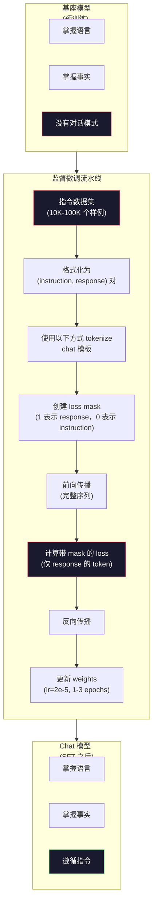

# 指令微调（Instruction Tuning / SFT）

> 译注：本文译自同目录 [`en.md`](./en.md)。术语遵循仓根 [TRANSLATION_GUIDE.md](../../../../TRANSLATION_GUIDE.md)。

> 一个 base model 只会预测下一个 token。仅此而已。它不会跟随指令，不会回答问题，也不会拒绝有害请求。SFT 就是从 token 预测器到可用助手之间的那座桥。你聊过的每一个模型——Claude、GPT、Llama Chat——都经历过这一步。

**Type:** Build
**Languages:** Python（配合 numpy）
**Prerequisites:** Phase 10, Lesson 04（Pre-Training a Mini GPT）
**Time:** ~90 分钟

## 学习目标（Learning Objectives）

- 实现 supervised fine-tuning（SFT，监督微调），把一个 base 语言模型转变为能跟随指令的助手
- 用 chat template（聊天模板）格式化训练数据，区分 system、user、assistant 三种角色，并对非 assistant 的 token 做 loss 屏蔽
- 解释为什么必须做 SFT：base model 只会续写文本，不会回答问题
- 通过比较 base model 与微调后的模型在留出指令集上的表现，评估 SFT 的质量

## 问题（The Problem）

你在 Lesson 04 里训练过一个模型。它可以根据一段序列预测下一个 token。喂它「The transformer architecture」，它可能续写「has revolutionized natural language processing.」。作为一个 next-token 预测器，这已经很惊艳了。

现在试试这个：喂它「What is the capital of France?」。一个 base model 不会回答「Paris」。它会延续模式。它可能产出「What is the capital of Germany? What is the capital of Spain?」，因为它从包含问题列表的文档里学到了这种模式。或者它会产出「is a question that many people ask」，因为这是一个合理的下一个 token 续写。模型完全没有「回答」这一概念，它只懂「续写」。

这正是 GPT-3（base model，2020 年 6 月发布）和 ChatGPT（指令微调版，2022 年 11 月发布）之间的鸿沟。同一套架构，同一份预训练。差别在于那 2 万到 10 万条精心打磨的（instruction, response）pair，正是它们教会模型遵循对话模式。

Stanford Alpaca 证明了你不需要上百万条样本。2023 年 3 月，他们用 GPT-3.5 生成的 52,000 条指令-回答对，对 Llama 7B 做了微调。总成本：600 美元。结果是一个能跟随指令、回答问题、维持对话的聊天机器人。虽然不如 ChatGPT，但以 600 美元和几小时训练换来的效果已经惊人地接近。

Meta 的 Llama 2 Chat 在初始 SFT 阶段只用了约 27,000 条高质量样本。关键洞察是：质量比数量更重要。由熟练标注员撰写的 27,000 条样本，胜过从互联网上爬来的 100 万条嘈杂样本。

## 概念（The Concept）

### SFT 到底在做什么（What SFT Actually Does）

Supervised Fine-Tuning 沿用了预训练里同一套训练循环——前向传播、计算 loss、反向传播、更新权重——只是数据形态不一样了。你不再在原始文本上训练，而是在结构化对话上训练：

```json
{
  "system": "You are a helpful assistant.",
  "user": "What is the capital of France?",
  "assistant": "The capital of France is Paris."
}
```

模型其实早就知道 Paris 是法国的首都。它在预训练阶段从维基百科、教科书和网页里就学到了。SFT 不是教模型新事实，而是教模型一种新*行为*：看到问题就给答案，看到指令就给完成项，看到有害请求就拒绝。

可以这样理解：预训练给了模型知识，SFT 给了模型礼仪。

### 数据格式（Data Formats）

业界主流有三种格式。它们编码的是同样的信息——谁说了什么——只是分隔符不同。

**Alpaca Format**（Stanford，2023 年 3 月）：

```json
{
  "instruction": "Summarize the following article in 3 sentences.",
  "input": "The European Central Bank raised interest rates...",
  "output": "The ECB increased rates by 25 basis points..."
}
```

简单且使用广泛。`input` 字段是可选的——很多指令并不需要额外上下文。Stanford 以这种格式发布了 52,000 条样本，由 GPT-3.5 生成，成本 600 美元。这开启了开源指令微调运动。

**ShareGPT Format**（社区，2023）：

```json
{
  "conversations": [
    {"from": "system", "value": "You are a helpful assistant."},
    {"from": "human", "value": "What causes tides?"},
    {"from": "gpt", "value": "Tides are caused by the gravitational pull of the Moon..."},
    {"from": "human", "value": "How often do they occur?"},
    {"from": "gpt", "value": "Most coastal areas experience two high tides and two low tides per day..."}
  ]
}
```

支持多轮对话。`from` 字段约定使用 `human` 和 `gpt`，无论实际模型是什么。Vicuna 就是用从用户分享的 ChatGPT 记录中爬取的 70,000 条 ShareGPT 对话训练的。

**ChatML Format**（OpenAI 提出，被许多开源模型采用）：

```
<|im_start|>system
You are a helpful assistant.<|im_end|>
<|im_start|>user
What is the capital of France?<|im_end|>
<|im_start|>assistant
The capital of France is Paris.<|im_end|>
```

用特殊 token（`<|im_start|>`、`<|im_end|>`）来标记角色边界。这些 token 在微调时被加进 tokenizer 的词表。Qwen、Yi 以及许多其他模型都用 ChatML。

三种格式做的是同一件事：告诉模型「这是指令，这是回答，学会这个模式」。

### 为什么有效（Why It Works）

模型在预训练阶段已经掌握了语言。它见过几十亿条「问题后跟答案」「指令后跟完成项」「人与人对话」的样本。这些模式已经编码在权重里了。

SFT 把这种潜在能力聚焦起来。模型不必再从上下文里推断自己该回答问题还是续写文档；SFT 显式地把对话模式训进去。几千条样本之后，模型就学会了：看到 assistant 角色标记，就产出一段有用的回应。

这就是为什么 27,000 条样本就够用。你不是在教模型英语，也不是在教它世界常识。你只是在教它一个简单的行为：响应指令。知识本来就在那。

### Masked Loss（屏蔽损失）

这是 SFT 里最重要的技术细节，但大多数教程都跳过了。

预训练时，你会对每一个 token 计算 loss。模型要学会预测序列中每一个下一 token。SFT 时，你只对*回答*的 token 计算 loss。指令的 token 仅作为上下文存在，模型即使「预测」错了它们也不会被惩罚。

为什么？因为你不想让模型学会*生成*指令，你想让它学会*响应*指令。如果你对指令 token 也算 loss，等于在训练模型把「What is the capital of France?」当作自己要提的问题去预测。这不仅浪费了梯度信号，还会让模型对自己角色的认知混乱。

具体做法是：构造一个 loss mask，回答 token 处为 1，指令 token 处为 0。在求平均之前，把每个 token 的 loss 乘上这个 mask。

```
Tokens:    [SYS] You are helpful [USER] What is the capital? [ASST] Paris is the capital [EOS]
Loss mask:   0    0    0     0      0     0   0  0     0       1     1    1   1     1      1
```

只有 `[ASST]` 之后的 token 会贡献 loss。模型在前向传播时能看到完整对话（它需要指令才能产出正确回答），但只根据它对回答的预测好坏来更新权重。

### 训练超参数（Training Hyperparameters）

SFT 的超参数和预训练截然不同。你不是在从零训练，而是在调整一个已经能用的模型。

| 参数 | 预训练（Llama 2 7B） | SFT（Llama 2 Chat） |
|-----------|---------------------------|---------------------|
| 学习率 | 3e-4（峰值） | 2e-5 |
| Epoch 数 | 1（数据过一遍） | 2 |
| Batch size | 4M tokens | 64 examples |
| Warmup steps | 2,000 | 0–100 |
| 权重衰减 | 0.1 | 0.0–0.1 |
| 数据规模 | 2T tokens | 27,000 examples |

SFT 的学习率比预训练低 15 倍。这一点至关重要。微调时学习率过高会摧毁预训练得到的知识。模型会「遗忘」它学过的东西，并对小小的微调数据集过拟合。这就是 catastrophic forgetting（灾难性遗忘）。

两个 epoch 意味着模型把每条训练样本看两遍。在小数据集上超过 3 个 epoch 就会导致背诵——模型开始原样复述训练样本，而不是泛化。

### 灾难性遗忘（Catastrophic Forgetting）

微调可能毁掉模型的通用能力。在指令跟随数据上训得太久，模型就会失去写代码、做数学题或写创意文本的能力。它会变得在训练数据的特定格式上很好，而在其他一切上都很糟糕。

三种缓解办法：

1. **低学习率。** 1e-5 到 5e-5。更小的更新意味着对预训练特征的破坏更少。

2. **短训练。** 1–3 个 epoch。在模型过拟合之前停下。

3. **混入预训练数据。** Llama 2 Chat 在 SFT 数据集里掺了一小部分（2%–5%）原始预训练数据。这会在学习新指令跟随行为的同时「提醒」模型保留通用能力。

### 真实数字（Real Numbers）

在单张 NVIDIA A100 80GB GPU 上，用 10,000 条高质量指令对微调一个 7B 模型大约要 1 小时。算账如下：

- 10,000 examples × 平均 512 tokens = 5.12M tokens
- 2 个 epoch = 总共 10.24M tokens
- A100 上 7B 模型微调吞吐：~3,000 tokens/秒
- 10.24M / 3,000 ≈ 3,400 秒 ≈ 57 分钟

对我们这个 mini GPT（4 层、128 维）来说，训练几乎是瞬间完成的。重点是理解机制，而不是规模。



## 动手实现（Build It）

### Step 1：指令数据集（Instruction Dataset）

构造一个合成的指令数据集。在生产环境中，Scale AI、Anthropic 这类公司会雇佣人类标注员来撰写。我们这里用程序生成，用来演示格式即可。

```python
import numpy as np

INSTRUCTION_DATA = [
    {
        "instruction": "What is the capital of France?",
        "response": "The capital of France is Paris."
    },
    {
        "instruction": "Explain gravity in one sentence.",
        "response": "Gravity is the force that attracts objects with mass toward each other."
    },
    {
        "instruction": "Write a haiku about the ocean.",
        "response": "Waves crash on the shore, salt and foam beneath the sun, endless blue expanse."
    },
    {
        "instruction": "What is 15 multiplied by 7?",
        "response": "15 multiplied by 7 is 105."
    },
    {
        "instruction": "Name three programming languages.",
        "response": "Three programming languages are Python, Rust, and TypeScript."
    },
    {
        "instruction": "Summarize photosynthesis.",
        "response": "Photosynthesis converts sunlight, water, and carbon dioxide into glucose and oxygen."
    },
    {
        "instruction": "What year did World War II end?",
        "response": "World War II ended in 1945."
    },
    {
        "instruction": "Define machine learning.",
        "response": "Machine learning is a field where algorithms learn patterns from data to make predictions."
    },
]
```

8 条样本太少了。Stanford Alpaca 用了 52,000 条。但无论你有 8 条还是 52,000 条，机制都一样：tokenize、mask、只在回答上算 loss。

### Step 2：用 Chat Template 进行 Tokenize

把指令-回答对转成带角色标记的 token 序列。这些标记告诉模型指令在哪里结束、回答从哪里开始。

```python
SPECIAL_TOKENS = {
    "INST_START": 253,
    "INST_END": 254,
    "RESP_START": 255,
}


def tokenize_instruction_pair(instruction, response, vocab_size=256):
    inst_tokens = list(instruction.encode("utf-8"))
    resp_tokens = list(response.encode("utf-8"))

    inst_tokens = [min(t, vocab_size - 4) for t in inst_tokens]
    resp_tokens = [min(t, vocab_size - 4) for t in resp_tokens]

    tokens = (
        [SPECIAL_TOKENS["INST_START"]]
        + inst_tokens
        + [SPECIAL_TOKENS["INST_END"]]
        + [SPECIAL_TOKENS["RESP_START"]]
        + resp_tokens
    )

    return tokens


def create_loss_mask(tokens):
    mask = np.zeros(len(tokens), dtype=np.float32)
    in_response = False

    for i, token in enumerate(tokens):
        if token == SPECIAL_TOKENS["RESP_START"]:
            in_response = True
            continue
        if in_response:
            mask[i] = 1.0

    return mask
```

loss mask 在指令 token 处全为 0，在回答 token 处全为 1。`RESP_START` token 自身的 mask 也是 0，因为它是分隔符，不属于回答内容。

### Step 3：Masked Cross-Entropy Loss

标准的 cross-entropy，再乘上 loss mask。只有回答 token 会贡献梯度。

```python
def masked_cross_entropy_loss(logits, targets, loss_mask):
    batch, seq_len, vocab_size = logits.shape
    logits_flat = logits.reshape(-1, vocab_size)
    targets_flat = targets.reshape(-1)
    mask_flat = loss_mask.reshape(-1)

    max_logits = logits_flat.max(axis=-1, keepdims=True)
    log_softmax = logits_flat - max_logits - np.log(
        np.exp(logits_flat - max_logits).sum(axis=-1, keepdims=True)
    )

    per_token_loss = -log_softmax[np.arange(len(targets_flat)), targets_flat]

    masked_loss = per_token_loss * mask_flat
    num_response_tokens = mask_flat.sum()
    if num_response_tokens == 0:
        return 0.0
    loss = masked_loss.sum() / num_response_tokens

    return loss
```

分母是 `num_response_tokens`，不是 `seq_len`。如果你除以总序列长度，越长的指令会稀释梯度信号。除以回答 token 数能保证每个回答 token 的权重相同，与指令长度无关。

### Step 4：SFT 训练循环（SFT Training Loop）

复用 Lesson 04 里的 MiniGPT。训练循环和预训练几乎一样，只是多了指令格式化和 masked loss。

```python
import sys
import os
sys.path.insert(0, os.path.join(os.path.dirname(__file__), "..", "..", "04-pre-training-mini-gpt", "code"))
from main import MiniGPT, LayerNorm, FeedForward, MultiHeadAttention, TransformerBlock, Embedding


def sft_train(model, dataset, num_epochs=2, lr=2e-5, seq_len=64):
    formatted_data = []
    for example in dataset:
        tokens = tokenize_instruction_pair(example["instruction"], example["response"])
        mask = create_loss_mask(tokens)
        formatted_data.append((tokens, mask))

    print(f"SFT Training: {len(formatted_data)} examples, {num_epochs} epochs, lr={lr}")
    print(f"Total tokens: {sum(len(t) for t, _ in formatted_data):,}")
    print()

    losses = []

    for epoch in range(num_epochs):
        epoch_loss = 0.0
        num_batches = 0

        indices = np.random.permutation(len(formatted_data))

        for idx in indices:
            tokens, mask = formatted_data[idx]

            if len(tokens) < 3:
                continue
            if len(tokens) > seq_len:
                tokens = tokens[:seq_len]
                mask = mask[:seq_len]

            input_ids = np.array(tokens[:-1]).reshape(1, -1)
            target_ids = np.array(tokens[1:]).reshape(1, -1)
            loss_mask = np.array(mask[1:]).reshape(1, -1)

            logits = model.forward(input_ids)
            loss = masked_cross_entropy_loss(logits, target_ids, loss_mask)

            batch_size, s_len, v_size = logits.shape
            probs = np.exp(logits - logits.max(axis=-1, keepdims=True))
            probs = probs / probs.sum(axis=-1, keepdims=True)
            dlogits = probs.copy()
            dlogits[np.arange(batch_size)[:, None], np.arange(s_len), target_ids] -= 1.0

            mask_expanded = loss_mask[:, :, np.newaxis]
            num_resp = loss_mask.sum()
            if num_resp > 0:
                dlogits = dlogits * mask_expanded / num_resp

            for block in model.blocks:
                block.ffn.W1 -= lr * np.random.randn(*block.ffn.W1.shape) * 0.01
                block.ffn.W2 -= lr * np.random.randn(*block.ffn.W2.shape) * 0.01
                block.ffn.b1 -= lr * np.random.randn(*block.ffn.b1.shape) * 0.01
                block.ffn.b2 -= lr * np.random.randn(*block.ffn.b2.shape) * 0.01

            epoch_loss += loss
            num_batches += 1
            losses.append(loss)

        avg_loss = epoch_loss / max(num_batches, 1)
        print(f"Epoch {epoch + 1}/{num_epochs} | Avg Loss: {avg_loss:.4f}")

    return model, losses
```

学习率是 2e-5，与 Llama 2 Chat 一致。和预训练的 3e-4 比起来——小了 15 倍。梯度被屏蔽了：指令 token 产生的梯度为零，只有回答 token 才会推动权重更新。

### Step 5：对比 Base 与 SFT 模型（Compare Base vs SFT Model）

SFT 的全部意义在于行为上的变化。我们来量一量：在指令格式输入上的反应，相对原始文本续写，有什么差别。

```python
def generate_response(model, prompt_tokens, max_new_tokens=50, temperature=0.8):
    tokens = list(prompt_tokens)
    seq_len = model.embedding.pos_embed.shape[0]

    for _ in range(max_new_tokens):
        context = np.array(tokens[-seq_len:]).reshape(1, -1)
        logits = model.forward(context)
        next_logits = logits[0, -1, :]

        next_logits = next_logits / max(temperature, 1e-8)
        probs = np.exp(next_logits - next_logits.max())
        probs = probs / probs.sum()
        probs = np.clip(probs, 1e-10, 1.0)
        probs = probs / probs.sum()

        next_token = np.random.choice(len(probs), p=probs)
        tokens.append(int(next_token))

    return tokens


def evaluate_instruction_following(model, instructions):
    print("Evaluating instruction following:")
    print("-" * 50)

    for instruction in instructions:
        tokens = (
            [SPECIAL_TOKENS["INST_START"]]
            + [min(t, 252) for t in list(instruction.encode("utf-8"))]
            + [SPECIAL_TOKENS["INST_END"]]
            + [SPECIAL_TOKENS["RESP_START"]]
        )

        output = generate_response(model, tokens, max_new_tokens=30, temperature=0.6)
        response_start = len(tokens)
        response_tokens = output[response_start:]
        response_bytes = bytes([t for t in response_tokens if t < 128])
        response_text = response_bytes.decode("utf-8", errors="replace")

        print(f"  Q: {instruction}")
        print(f"  A: {response_text[:80]}")
        print()
```

在一个仅有 8 条样本的微型模型上，回答不会有什么实际意义。这是预期的。重要的是*结构*：模型学会在回答标记之后产生输出，而不是继续生成更多指令。

### Step 6：测量灾难性遗忘（Measure Catastrophic Forgetting）

比较 SFT 前后模型的 next-token 预测能力。如果 SFT 损害了通用能力，原始文本上的 loss 会变高。

```python
def measure_forgetting(model, test_text, seq_len=64):
    tokens = np.array(list(test_text.encode("utf-8")[:512]))

    total_loss = 0.0
    num_windows = 0

    for start in range(0, len(tokens) - seq_len - 1, seq_len):
        input_ids = tokens[start:start + seq_len].reshape(1, -1)
        target_ids = tokens[start + 1:start + seq_len + 1].reshape(1, -1)

        logits = model.forward(input_ids)

        batch, s_len, vocab_size = logits.shape
        logits_flat = logits.reshape(-1, vocab_size)
        targets_flat = target_ids.reshape(-1)

        max_logits = logits_flat.max(axis=-1, keepdims=True)
        log_softmax = logits_flat - max_logits - np.log(
            np.exp(logits_flat - max_logits).sum(axis=-1, keepdims=True)
        )

        loss = -log_softmax[np.arange(len(targets_flat)), targets_flat].mean()
        total_loss += loss
        num_windows += 1

    return total_loss / max(num_windows, 1)
```

在真实的微调里，你会全程跟踪这个指标。如果原始文本上的 loss 涨了 10%–15% 以上，说明你的 SFT 力度太猛。要么降低学习率，要么减少 epoch 数。

## 用起来（Use It）

### 完整 SFT 流水线 Demo（Full SFT Pipeline Demo）

```python
if __name__ == "__main__":
    np.random.seed(42)

    test_text = """The transformer architecture processes sequences through self-attention.
Each layer applies multi-head attention followed by a feedforward network.
Residual connections and layer normalization stabilize deep networks.
The model learns to predict the next token given all previous tokens."""

    print("=" * 70)
    print("INSTRUCTION TUNING (SFT) DEMO")
    print("=" * 70)
    print()

    model = MiniGPT(
        vocab_size=256, embed_dim=128, num_heads=4,
        num_layers=4, max_seq_len=128, ff_dim=512
    )
    print(f"Model: {model.count_parameters():,} parameters")
    print(f"Config: 4 layers, 4 heads, 128 dims (mini GPT from Lesson 04)")
    print()

    print("PRE-SFT: Measuring base model loss on raw text")
    base_loss = measure_forgetting(model, test_text)
    print(f"  Base model loss: {base_loss:.4f}")
    print()

    print("=" * 70)
    print("SFT TRAINING")
    print("=" * 70)

    model, losses = sft_train(
        model, INSTRUCTION_DATA, num_epochs=3, lr=2e-5, seq_len=128
    )

    print()
    print("POST-SFT: Measuring fine-tuned model loss on raw text")
    sft_loss = measure_forgetting(model, test_text)
    print(f"  SFT model loss: {sft_loss:.4f}")
    print(f"  Change: {((sft_loss - base_loss) / base_loss * 100):+.1f}%")
    if abs(sft_loss - base_loss) / base_loss < 0.15:
        print("  Minimal forgetting (< 15% change)")
    else:
        print("  Significant forgetting detected")
    print()

    print("=" * 70)
    print("INSTRUCTION FOLLOWING EVALUATION")
    print("=" * 70)
    print()

    test_instructions = [
        "What is the capital of France?",
        "Name a programming language.",
        "Define gravity.",
    ]
    evaluate_instruction_following(model, test_instructions)

    print("=" * 70)
    print("DATA FORMAT EXAMPLES")
    print("=" * 70)
    print()

    for i, example in enumerate(INSTRUCTION_DATA[:3]):
        tokens = tokenize_instruction_pair(example["instruction"], example["response"])
        mask = create_loss_mask(tokens)
        resp_count = int(mask.sum())
        total_count = len(tokens)
        print(f"  Example {i + 1}: {total_count} tokens, {resp_count} response tokens ({resp_count/total_count:.0%} of sequence)")
        print(f"    Instruction: {example['instruction']}")
        print(f"    Response: {example['response']}")
        print()

    print("=" * 70)
    print("TRAINING LOSS CURVE")
    print("=" * 70)
    print()

    if losses:
        window = max(1, len(losses) // 5)
        for i in range(0, len(losses), window):
            chunk = losses[i:i + window]
            avg = sum(chunk) / len(chunk)
            print(f"  Steps {i:3d}-{i + len(chunk) - 1:3d}: avg loss = {avg:.4f}")
```

## 上线部署（Ship It）

本课的产物是 `outputs/prompt-sft-data-curator.md`——一个帮你为 SFT 设计和打磨指令数据集的 prompt。给定一个目标能力（代码生成、数学、对话），它会产出一份数据采集计划，包括格式规范、质量标准和多样性要求。

## 练习（Exercises）

1. 加上 system prompt 支持。修改 `tokenize_instruction_pair`，让它接受一段 system 消息，并在指令前面拼上去。构造 5 条带不同 system prompt 的样本（「You are a poet」「You are a math tutor」），并验证模型在训练中确实看到了不同的 system prompt。

2. 实现数据混合。写一个函数，输入是一个 SFT 数据集和一份原始文本语料，输出训练 batch：5% 的样本是原始文本（不做 mask），95% 是指令对（做 mask）。跑 3 个 epoch，与纯 SFT 训练对比遗忘指标。

3. 做一个数据质量打分器。对每个指令-回答对，计算：(a) 回答的 token 长度，(b) 指令-回答比，(c) 词表多样性（unique tokens / total tokens）。过滤掉回答 token 数 < 10 或多样性 < 0.3 的样本。展示过滤如何影响最终 loss。

4. 实现多轮对话训练。把 tokenize 扩展到支持 3 轮对话（user-assistant-user-assistant-user-assistant）。loss mask 应覆盖全部三个 assistant 轮次。打印一条样本的 token-mask 对齐结果，验证 mask 正确无误。

5. 对比学习率。用 lr=1e-4、lr=2e-5、lr=1e-6 三种学习率分别训练同一个模型。画出 loss 曲线。1e-4 那次应该呈现快速下降但最终 loss 偏高（过拟合）；1e-6 那次几乎不动；2e-5 应该是甜点。

## 关键术语（Key Terms）

| 术语 | 大家是怎么说的 | 实际是什么 |
|------|----------------|----------------------|
| SFT | 「在对话上做微调」 | Supervised Fine-Tuning：在 (instruction, response) 对上继续训练，仅对回答 token 计算 loss |
| Instruction tuning（指令微调） | 「教模型跟随指令」 | 在显式的指令-回答对上训练，让 base model 学会对话模式，而不是新知识 |
| Loss masking（损失屏蔽） | 「忽略 prompt」 | 把指令 token 的 loss 设为 0，让梯度只来自回答 token 的预测 |
| ChatML | 「Chat Markup Language」 | 用 `<\|im_start\|>` 和 `<\|im_end\|>` 分隔符标记说话角色的 token 格式 |
| Alpaca format | 「Stanford 那种格式」 | 一种 JSON 格式，包含 instruction/input/output 字段，用于 5.2 万条 GPT-3.5 生成、成本 600 美元的样本 |
| Catastrophic forgetting（灾难性遗忘） | 「模型变笨了」 | 微调摧毁了预训练能力，因为梯度更新用任务相关模式覆盖了通用知识 |
| Weight tying（权重共享） | 「shared embeddings」 | 输入 token embedding 与输出预测头共用同一个矩阵，节省参数并提升一致性 |
| Chat template（聊天模板） | 「prompt 怎么排版」 | 用来组织一段对话的具体 token 序列（角色标记、分隔符） |

## 延伸阅读（Further Reading）

- [Ouyang et al., 2022 -- "Training language models to follow instructions with human feedback" (InstructGPT)](https://arxiv.org/abs/2203.02155) -- OpenAI 引入指令微调 + RLHF 的论文
- [Taori et al., 2023 -- "Stanford Alpaca: An Instruction-following LLaMA Model"](https://github.com/tatsu-lab/stanford_alpaca) -- 5.2 万条指令样本，600 美元，证明 SFT 在小数据集上可行
- [Touvron et al., 2023 -- "Llama 2: Open Foundation and Fine-Tuned Chat Models"](https://arxiv.org/abs/2307.09288) -- Meta 用 2.7 万条高质量样本完成的 SFT + RLHF 流水线
- [Chiang et al., 2023 -- "Vicuna: An Open-Source Chatbot Impressing GPT-4"](https://lmsys.org/blog/2023-03-30-vicuna/) -- 在 7 万条 ShareGPT 对话上训练
- [Zhou et al., 2023 -- "LIMA: Less Is More for Alignment"](https://arxiv.org/abs/2305.11206) -- 证明 1,000 条精心筛选的样本就能匹敌大数据集 SFT
