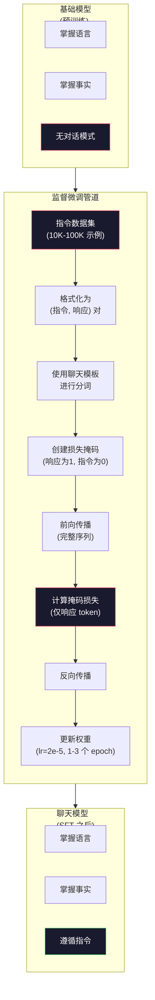

# 指令微调（Instruction Tuning，SFT）

> 基础模型只做一件事：预测下一个 token。它不会遵循指令、回答问题，也不会拒绝有害请求。SFT 是将 token 预测器转变为有用助手的桥梁。你曾交互过的每一个模型——Claude、GPT、Llama Chat——都经过这一步。

**类型：** 构建  
**语言：** Python（使用 numpy）  
**前置条件：** 阶段 10，第 04 课（预训练一个微型 GPT）  
**时长：** ~90 分钟

## 学习目标

- 实现监督微调（Supervised Fine-Tuning，SFT），将基础语言模型转换为能遵循指令的助手
- 使用包含系统、用户和助手角色的聊天模板格式化训练数据，并对非助手的 token 进行损失掩码（loss masking）
- 解释为什么需要 SFT：基础模型会延续文本，而不是回答问题
- 通过在保留的指令集上比较基础模型与微调模型的响应，评估 SFT 质量

## 问题

你在第 04 课中训练了一个模型。它能根据给定序列预测下一个 token。输入 "The transformer architecture" 可能会继续生成 "has revolutionized natural language processing." 对于一个 next-token 预测器来说，这令人印象深刻。

现在试试这个：输入 "What is the capital of France?" 基础模型不会回答 "Paris"。它会延续模式。它可能会生成 "What is the capital of Germany? What is the capital of Spain?"，因为它从包含问题列表的文档中学到了这种模式。或者它可能生成 "is a question that many people ask"，因为这是一个合理的 next-token 延续。模型没有“回答”的概念。它只知道“延续”。

这就是 GPT-3（基础模型，2020 年 6 月发布）和 ChatGPT（指令微调，2022 年 11 月发布）之间的差距。相同的架构，相同的预训练。区别在于 20,000 到 100,000 个精心制作的（指令，响应）对，教会了模型遵循对话模式。

Stanford Alpaca 证明了你不需要数百万条示例。2023 年 3 月，他们在仅 52,000 个由 GPT-3.5 生成的指令-响应对上微调了 Llama 7B。总成本：$600。结果是一个能遵循指令、回答问题并进行对话的聊天机器人。虽然不如 ChatGPT，但考虑到成本仅 $600 和几小时的训练，效果惊人地接近。

Meta 的 Llama 2 Chat 在其初始 SFT 阶段仅使用了约 27,000 个高质量示例。关键洞察：质量比数量更重要。由熟练标注员编写的 27,000 个示例胜过了从互联网上抓取的 100 万个嘈杂示例。

## 概念

### SFT 实际上在做什么

监督微调延续了预训练中相同的训练循环——前向传播、计算损失、反向传播、更新权重——但在不同类型的数据上。不是原始文本，而是训练结构化对话：

```json
{
  "system": "You are a helpful assistant.",
  "user": "What is the capital of France?",
  "assistant": "The capital of France is Paris."
}
```

模型已经知道巴黎是法国的首都。它在维基百科、教科书和网页的预训练中学到了这一点。SFT 不教新事实，而是教一种新的*行为*：当你看到问题时生成答案；当你看到指令时生成回应；当你看到有害请求时生成拒绝。

可以这样理解：预训练赋予模型知识；SFT 赋予模型礼仪。

### 数据格式

行业中有三种主流格式。每种都用不同的分隔符编码相同的信息——“谁说了什么”。

**Alpaca 格式**（Stanford，2023 年 3 月）：

```json
{
  "instruction": "Summarize the following article in 3 sentences.",
  "input": "The European Central Bank raised interest rates...",
  "output": "The ECB increased rates by 25 basis points..."
}
```

简单且广泛使用。`input` 字段是可选的——很多指令不需要额外上下文。Stanford 以 $600 成本发布了 52,000 个 GPT-3.5 生成的这种格式的示例，开启了开源指令微调运动。

**ShareGPT 格式**（社区，2023 年）：

```json
{
  "conversations": [
    {"from": "system", "value": "You are a helpful assistant."},
    {"from": "human", "value": "What causes tides?"},
    {"from": "gpt", "value": "Tides are caused by the gravitational pull of the Moon..."},
    {"from": "human", "value": "How often do they occur?"},
    {"from": "gpt", "value": "Most coastal areas experience two high tides and two low tides per day..."}
  ]
}
```

支持多轮对话。"from" 字段按惯例使用 "human" 和 "gpt"，无论实际模型是什么。Vicuna 在从用户共享的 ChatGPT 转录中抓取的 70,000 个 ShareGPT 对话上进行了训练。

**ChatML 格式**（OpenAI，被许多开源模型采用）：

```
<|im_start|>system
You are a helpful assistant.<|im_end|>
<|im_start|>user
What is the capital of France?<|im_end|>
<|im_start|>assistant
The capital of France is Paris.<|im_end|>
```

使用特殊 token（`<|im_start|>`，`<|im_end|>`）来分隔角色。这些 token 在微调期间被添加到分词器的词汇表中。Qwen、Yi 等许多模型都使用 ChatML。

这三种格式都完成同样的事情：告诉模型“这是指令，这是响应，学习这个模式。”

### 为什么它有效

模型已经从预训练中学会了语言。它已经见过数十亿个问题后跟答案、指令后跟完成、以及人与人之间的对话的例子。这些模式已经编码在权重中。

SFT 集中了这种潜在能力。模型不再需要根据上下文来判断是应该回答问题还是延续文档，SFT 明确地在对话模式上训练。经过几千个示例，模型学会：当你看到助手角色标记时，产生有用的响应。

这就是为什么 27,000 个示例就够了。你不是在教模型英语，也不是在教它世界知识。你只教它一个简单的行为：响应指令。知识已经存在了。

### 掩码损失

这是 SFT 中最重要的技术细节，大多数教程都跳过了它。

预训练期间，你在每个 token 上计算损失。模型学习预测序列中的每一个下一个 token。在 SFT 期间，你只在*响应* token 上计算损失。指令 token 只为提供上下文，但模型不会因为“预测”它们错误而受到惩罚。

为什么？因为你不希望模型学会*生成*指令。你希望它学会*响应*指令。如果在指令 token 上计算损失，你就是在训练模型将 "What is the capital of France?" 当作是自己在提问一样去预测。这会浪费梯度信号，并可能混淆模型对自身角色的理解。

实践中，你会创建一个损失掩码：响应 token 为 1，指令 token 为 0。在平均之前，将每个 token 的损失乘以这个掩码。

```
Token:    [SYS] You are helpful [USER] What is the capital? [ASST] Paris is the capital [EOS]
损失掩码:   0    0    0     0      0     0   0  0     0       1     1    1   1     1      1
```

只有 `[ASST]` 之后的 token 对损失有贡献。前向传播时模型看到完整的对话（它需要指令才能产生正确的响应），但只根据它预测响应的好坏来更新权重。

### 训练超参数

SFT 使用的超参数与预训练截然不同。你不是从头开始训练，而是在调整一个已经工作的模型。

| 参数           | 预训练（Llama 2 7B） | SFT（Llama 2 Chat） |
|----------------|----------------------|---------------------|
| 学习率         | 3e-4（峰值）         | 2e-5                |
| 训练轮数（Epochs） | 1（单次遍历数据）  | 2                   |
| 批次大小       | 4M tokens            | 64 个示例           |
| 预热步数       | 2,000                | 0-100               |
| 权重衰减       | 0.1                  | 0.0-0.1             |
| 数据大小       | 2T tokens            | 27,000 个示例       |

SFT 的学习率低 15 倍。这至关重要。微调时学习率太高会破坏预训练知识。模型“遗忘”了学到的内容，过拟合到小的微调数据集上。这就是灾难性遗忘（Catastrophic Forgetting）。

两个 epoch 意味着模型看到每个训练示例两次。在小数据集上超过 3 个 epoch 会导致记忆化——模型开始逐字复现训练示例而不是泛化。

### 灾难性遗忘

微调可能会破坏通用能力。在指令遵循数据上训练太久，模型会失去编写代码、做数学或生成创意文本的能力。它变得非常擅长它的训练数据的特定格式，而在其他方面表现糟糕。

三种缓解措施：

1. **低学习率**。1e-5 到 5e-5。更小的更新意味着对预训练特征的破坏更少。
2. **短训练**。1-3 个 epoch。在模型过拟合之前停止。
3. **混合预训练数据**。Llama 2 Chat 将一小部分（2-5%）原始预训练数据混合到 SFT 数据集中。这“提醒”模型其通用能力，同时学习新的指令遵循行为。

### 实际数字

在单个 NVIDIA A100 80GB GPU 上微调一个 7B 模型，处理 10,000 个高质量指令对大约需要 1 小时。计算如下：

- 10,000 个示例 x 平均 512 tokens = 5.12M tokens
- 2 个 epoch = 10.24M tokens 总计
- A100 对 7B 模型微调的吞吐量：~3,000 tokens/秒
- 10.24M / 3,000 = ~3,400 秒 = ~57 分钟

对于我们的小型 GPT（4 层，128 维），训练几乎是瞬间的。重点在于理解机制，而不是规模。



## 动手构建

### 步骤 1：指令数据集

创建一个合成指令数据集。在生产中，Scale AI 和 Anthropic 等公司会雇佣人类标注员来编写这些。我们将通过编程方式创建它们以演示格式。

```python
import numpy as np

INSTRUCTION_DATA = [
    {
        "instruction": "What is the capital of France?",
        "response": "The capital of France is Paris."
    },
    {
        "instruction": "Explain gravity in one sentence.",
        "response": "Gravity is the force that attracts objects with mass toward each other."
    },
    {
        "instruction": "Write a haiku about the ocean.",
        "response": "Waves crash on the shore, salt and foam beneath the sun, endless blue expanse."
    },
    {
        "instruction": "What is 15 multiplied by 7?",
        "response": "15 multiplied by 7 is 105."
    },
    {
        "instruction": "Name three programming languages.",
        "response": "Three programming languages are Python, Rust, and TypeScript."
    },
    {
        "instruction": "Summarize photosynthesis.",
        "response": "Photosynthesis converts sunlight, water, and carbon dioxide into glucose and oxygen."
    },
    {
        "instruction": "What year did World War II end?",
        "response": "World War II ended in 1945."
    },
    {
        "instruction": "Define machine learning.",
        "response": "Machine learning is a field where algorithms learn patterns from data to make predictions."
    },
]
```

八个示例很小。Stanford Alpaca 使用了 52,000 个。但无论是 8 个还是 52,000 个，其机制完全相同：分词、掩码、仅在响应上计算损失。

### 步骤 2：使用聊天模板分词

将指令-响应对转换为带有特殊角色标记的 token 序列。这些标记告诉模型指令在哪里结束，响应在哪里开始。

```python
SPECIAL_TOKENS = {
    "INST_START": 253,   # 指令开始
    "INST_END": 254,     # 指令结束
    "RESP_START": 255,   # 响应开始
}


def tokenize_instruction_pair(instruction, response, vocab_size=256):
    """将指令-响应对转换为 token 序列"""
    inst_tokens = list(instruction.encode("utf-8"))
    resp_tokens = list(response.encode("utf-8"))

    # 确保 token 在词汇表范围内
    inst_tokens = [min(t, vocab_size - 4) for t in inst_tokens]
    resp_tokens = [min(t, vocab_size - 4) for t in resp_tokens]

    tokens = (
        [SPECIAL_TOKENS["INST_START"]]
        + inst_tokens
        + [SPECIAL_TOKENS["INST_END"]]
        + [SPECIAL_TOKENS["RESP_START"]]
        + resp_tokens
    )

    return tokens


def create_loss_mask(tokens):
    """创建损失掩码：指令 token 为 0，响应 token（及之后）为 1"""
    mask = np.zeros(len(tokens), dtype=np.float32)
    in_response = False

    for i, token in enumerate(tokens):
        if token == SPECIAL_TOKENS["RESP_START"]:
            in_response = True
            continue  # 分隔符本身不参与损失计算
        if in_response:
            mask[i] = 1.0

    return mask
```

损失掩码：指令 token 全为零，响应 token 全为一。`RESP_START` 本身掩码为 0，因为它是分隔符，不是响应内容的一部分。

### 步骤 3：掩码交叉熵损失

标准交叉熵，但乘以损失掩码。只有响应 token 对梯度有贡献。

```python
def masked_cross_entropy_loss(logits, targets, loss_mask):
    """计算掩码交叉熵损失，仅计算响应 token 的损失"""
    batch, seq_len, vocab_size = logits.shape
    logits_flat = logits.reshape(-1, vocab_size)
    targets_flat = targets.reshape(-1)
    mask_flat = loss_mask.reshape(-1)

    # 稳定化 log_softmax
    max_logits = logits_flat.max(axis=-1, keepdims=True)
    log_softmax = logits_flat - max_logits - np.log(
        np.exp(logits_flat - max_logits).sum(axis=-1, keepdims=True)
    )

    per_token_loss = -log_softmax[np.arange(len(targets_flat)), targets_flat]

    masked_loss = per_token_loss * mask_flat
    num_response_tokens = mask_flat.sum()
    if num_response_tokens == 0:
        return 0.0
    loss = masked_loss.sum() / num_response_tokens

    return loss
```

分母是 `num_response_tokens`，而不是 `seq_len`。如果除以总序列长度，较长的指令会稀释梯度信号。除以响应 token 数量确保了无论指令长度如何，每个响应 token 的权重相等。

### 步骤 4：SFT 训练循环

重用第 04 课的 MiniGPT。训练循环看起来与预训练几乎相同，但使用指令格式化和掩码损失。

```python
import sys
import os
sys.path.insert(0, os.path.join(os.path.dirname(__file__), "..", "..", "04-pre-training-mini-gpt