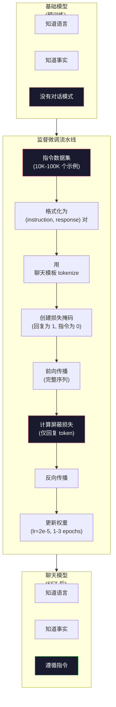

# 指令微调 (SFT)

> 基础模型预测下一个 token。仅此而已。它不会遵循指令、回答问题或拒绝有害请求。SFT 是从 token 预测器到有用助手的桥梁。你交谈过的每个模型——Claude、GPT、Llama Chat——都经历了这一步。

**类型：** 构建
**语言：** Python (with numpy)
**前置条件：** Phase 10, Lesson 04（预训练 Mini GPT）
**时间：** ~90 分钟

## 学习目标

- 实现监督微调 (SFT)，将基础语言模型转换为遵循指令的助手
- 使用 system、user 和 assistant 角色的聊天模板格式化训练数据，并对非 assistant token 屏蔽损失
- 解释为什么需要 SFT：基础模型是续写文本，而不是回答问题
- 通过在保留的指令集上对比基础模型与微调模型的回复来评估 SFT 质量

## 问题

你在 Lesson 04 中训练了一个模型。给定序列，它可以预测下一个 token。输入 "The transformer architecture"，它可能会继续 "has revolutionized natural language processing." 对于下一个 token 预测器来说，这令人印象深刻。

现在试试：输入 "What is the capital of France?" 基础模型不会回答 "Paris." 它会延续模式。它可能会产生 "What is the capital of Germany? What is the capital of Spain?" 因为它从包含问题列表的文档中学到了这些。或者它可能会产生 "is a question that many people ask"，因为这是一个合理的下一个 token 延续。模型没有 *回答* 的概念。它只知道 *续写*。

这就是 GPT-3（基础模型，2020 年 6 月发布）和 ChatGPT（指令微调，2022 年 11 月发布）之间的差距。相同的架构。相同的预训练。区别在于 20,000 到 100,000 个精心制作的（指令，回复）对，教会了模型遵循对话模式。

Stanford Alpaca 证明了你不需要数百万个示例。2023 年 3 月，他们仅用 52,000 个由 GPT-3.5 生成的指令-回复对微调了 Llama 7B。总成本：600 美元。结果是一个可以遵循指令、回答问题和进行对话的聊天机器人。不如 ChatGPT，但对于 600 美元和几小时的训练来说，惊人地接近。

Meta 的 Llama 2 Chat 在初始 SFT 阶段仅使用了约 27,000 个高质量示例。关键洞察：质量比数量更重要。27,000 个由熟练标注员编写的示例胜过了从互联网上抓取的 100 万个嘈杂示例。

## 概念

### SFT 实际做了什么

监督微调延续了预训练中的相同训练循环——前向传播、计算损失、反向传播、更新权重——但使用不同类型的数据。不是原始文本，而是训练结构化对话：

```json
{
  "system": "You are a helpful assistant.",
  "user": "What is the capital of France?",
  "assistant": "The capital of France is Paris."
}
```

模型已经知道巴黎是法国的首都。它在预训练期间从 Wikipedia、教科书和网页中学到了这一点。SFT 不教模型新的事实。它教模型一种新的 *行为*：当你看到问题时，产生答案。当你看到指令时，产生完成。当你看到有害请求时，产生拒绝。

这样想。预训练给模型知识。SFT 给模型礼仪。

### 数据格式

三种格式主导了行业。每种用不同的分隔符编码相同的信息——谁说了什么。

**Alpaca 格式** (Stanford, 2023 年 3 月):

```json
{
  "instruction": "Summarize the following article in 3 sentences.",
  "input": "The European Central Bank raised interest rates...",
  "output": "The ECB increased rates by 25 basis points..."
}
```

简单且广泛使用。`input` 字段是可选的——许多指令不需要额外的上下文。Stanford 以这种格式发布了 52,000 个示例，由 GPT-3.5 生成，成本 600 美元。这开启了开源指令微调运动。

**ShareGPT 格式** (社区, 2023):

```json
{
  "conversations": [
    {"from": "system", "value": "You are a helpful assistant."},
    {"from": "human", "value": "What causes tides?"},
    {"from": "gpt", "value": "Tides are caused by the gravitational pull of the Moon..."},
    {"from": "human", "value": "How often do they occur?"},
    {"from": "gpt", "value": "Most coastal areas experience two high tides and two low tides per day..."}
  ]
}
```

支持多轮对话。"from" 字段按惯例使用 "human" 和 "gpt"，无论实际模型是什么。Vicuna 在从用户共享的 ChatGPT 记录中抓取的 70,000 个 ShareGPT 对话上训练。

**ChatML 格式** (OpenAI, 被许多开源模型使用):

```
<|im_start|>system
You are a helpful assistant.<|im_end|>
<|im_start|>user
What is the capital of France?<|im_end|>
<|im_start|>assistant
The capital of France is Paris.<|im_end|>
```

使用特殊 token (`<|im_start|>`, `<|im_end|>`) 分隔角色。这些 token 在微调期间被添加到 tokenizer 的词汇表中。Qwen、Yi 和许多其他模型使用 ChatML。

所有三种格式都完成了相同的事情：它们告诉模型 "这是指令，这是回复，学习这个模式。"

### 为什么有效

模型已经从预训练中知道了语言。它看到了数十亿个问题后接答案、指令后接完成、人与人之间的对话示例。这些模式已经编码在权重中。

SFT 集中了这种潜在能力。模型不需要从上下文中弄清楚它应该回答问题还是续写文档，SFT 明确地在对话模式上训练。经过几千个示例后，模型学会了：当你看到 assistant 角色标记时，产生有帮助的回复。

这就是为什么 27,000 个示例足够了。你不是在教模型英语。你不是在教它关于世界的事实。你在教它一种简单的行为：响应指令。知识已经在那里了。

### 屏蔽损失

这是 SFT 中最重要的技术细节，大多数教程都跳过了。

在预训练期间，你计算每个 token 的损失。模型学习预测序列中的每个下一个 token。在 SFT 期间，你只在 *回复* token 上计算损失。指令 token 用于上下文，但模型不会因 "预测" 它们错误而受到惩罚。

为什么？因为你不想让模型学习 *生成* 指令。你想让它学习 *响应* 指令。如果你在指令 token 上计算损失，你就是在训练模型预测 "What is the capital of France?"，就好像是它在提问一样。这浪费了梯度信号，可能会让模型对它的角色感到困惑。

实践中，你创建一个损失掩码：回复 token 为 1，指令 token 为 0。在平均之前，将每个 token 的损失乘以这个掩码。

```
Tokens:    [SYS] You are helpful [USER] What is the capital? [ASST] Paris is the capital [EOS]
Loss mask:   0    0    0     0      0     0   0  0     0       1     1    1   1     1      1
```

只有 `[ASST]` 之后的 token 对损失有贡献。模型在前向传播期间看到完整的对话（它需要指令来产生正确的回复），但只根据它预测回复的好坏来更新权重。

### 训练超参数

SFT 使用与预训练截然不同的超参数。你不是从头训练。你是在调整一个已经工作的模型。

| 参数 | 预训练 (Llama 2 7B) | SFT (Llama 2 Chat) |
|-----------|---------------------------|---------------------|
| 学习率 | 3e-4 (峰值) | 2e-5 |
| Epochs | 1 (单次遍历数据) | 2 |
| Batch size | 4M tokens | 64 个示例 |
| Warmup steps | 2,000 | 0-100 |
| Weight decay | 0.1 | 0.0-0.1 |
| 数据量 | 2T tokens | 27,000 个示例 |

SFT 的学习率比预训练低 15 倍。这很关键。微调期间的高学习率会破坏预训练的知识。模型 "遗忘" 了它学到的东西，并过拟合到小的微调数据集。这就是灾难性遗忘。

两个 epoch 意味着模型看到每个训练示例两次。在小数据集上超过 3 个 epoch 会导致记忆——模型开始逐字复现训练示例，而不是泛化。

### 灾难性遗忘

微调可以破坏通用能力。在指令遵循数据上训练太久，模型会失去写代码、做数学或产生创意文本的能力。它变得非常擅长其训练数据的特定格式，而在其他方面表现糟糕。

三种缓解方法：

1. **低学习率。** 1e-5 到 5e-5。更小的更新意味着对预训练特征的破坏更少。

2. **短训练。** 1-3 个 epoch。在模型过拟合之前停止。

3. **混合预训练数据。** Llama 2 Chat 在 SFT 数据集中混合了一小部分（2-5%）原始预训练数据。这在学习新的指令遵循行为的同时 "提醒" 模型它的通用能力。

### 真实数字

在单个 NVIDIA A100 80GB GPU 上，用 10,000 个高质量指令对微调 7B 模型大约需要 1 小时。数学如下：

- 10,000 个示例 x 平均 512 tokens = 5.12M tokens
- 2 个 epoch = 总计 10.24M tokens
- A100 上 7B 模型微调的吞吐：~3,000 tokens/秒
- 10.24M / 3,000 = ~3,400 秒 = ~57 分钟

对于我们的 mini GPT（4 层，128 维），训练几乎是瞬时的。重点是理解机制，而不是规模。



## 构建

### 步骤 1：指令数据集

创建一个合成指令数据集。在生产中，像 Scale AI 和 Anthropic 这样的公司雇佣人类标注员来编写这些。我们将以编程方式创建它们来演示格式。

```python
import numpy as np

INSTRUCTION_DATA = [
    {
        "instruction": "What is the capital of France?",
        "response": "The capital of France is Paris."
    },
    {
        "instruction": "Explain gravity in one sentence.",
        "response": "Gravity is the force that attracts objects with mass toward each other."
    },
    {
        "instruction": "Write a haiku about the ocean.",
        "response": "Waves crash on the shore, salt and foam beneath the sun, endless blue expanse."
    },
    {
        "instruction": "What is 15 multiplied by 7?",
        "response": "15 multiplied by 7 is 105."
    },
    {
        "instruction": "Name three programming languages.",
        "response": "Three programming languages are Python, Rust, and TypeScript."
    },
    {
        "instruction": "Summarize photosynthesis.",
        "response": "Photosynthesis converts sunlight, water, and carbon dioxide into glucose and oxygen."
    },
    {
        "instruction": "What year did World War II end?",
        "response": "World War II ended in 1945."
    },
    {
        "instruction": "Define machine learning.",
        "response": "Machine learning is a field where algorithms learn patterns from data to make predictions."
    },
]
```

八个示例很小。Stanford Alpaca 用了 52,000。但无论你有 8 个还是 52,000 个，机制都是相同的：tokenize、mask、只在回复上计算损失。

### 步骤 2：用聊天模板 Tokenize

将指令-回复对转换为带有特殊角色标记的 token 序列。标记告诉模型指令在哪里结束，回复在哪里开始。

```python
SPECIAL_TOKENS = {
    "INST_START": 253,
    "INST_END": 254,
    "RESP_START": 255,
}


def tokenize_instruction_pair(instruction, response, vocab_size=256):
    inst_tokens = list(instruction.encode("utf-8"))
    resp_tokens = list(response.encode("utf-8"))

    inst_tokens = [min(t, vocab_size - 4) for t in inst_tokens]
    resp_tokens = [min(t, vocab_size - 4) for t in resp_tokens]

    tokens = (
        [SPECIAL_TOKENS["INST_START"]]
        + inst_tokens
        + [SPECIAL_TOKENS["INST_END"]]
        + [SPECIAL_TOKENS["RESP_START"]]
        + resp_tokens
    )

    return tokens


def create_loss_mask(tokens):
    mask = np.zeros(len(tokens), dtype=np.float32)
    in_response = False

    for i, token in enumerate(tokens):
        if token == SPECIAL_TOKENS["RESP_START"]:
            in_response = True
            continue
        if in_response:
            mask[i] = 1.0

    return mask
```

损失掩码对于指令 token 全为零，对于回复 token 全为一。`RESP_START` token 本身的掩码为 0，因为它是分隔符，不是回复内容的一部分。

### 步骤 3：屏蔽交叉熵损失

标准交叉熵，但乘以损失掩码。只有回复 token 对梯度有贡献。

```python
def masked_cross_entropy_loss(logits, targets, loss_mask):
    batch, seq_len, vocab_size = logits.shape
    logits_flat = logits.reshape(-1, vocab_size)
    targets_flat = targets.reshape(-1)
    mask_flat = loss_mask.reshape(-1)

    max_logits = logits_flat.max(axis=-1, keepdims=True)
    log_softmax = logits_flat - max_logits - np.log(
        np.exp(logits_flat - max_logits).sum(axis=-1, keepdims=True)
    )

    per_token_loss = -log_softmax[np.arange(len(targets_flat)), targets_flat]

    masked_loss = per_token_loss * mask_flat
    num_response_tokens = mask_flat.sum()
    if num_response_tokens == 0:
        return 0.0
    loss = masked_loss.sum() / num_response_tokens

    return loss
```

分母是 `num_response_tokens`，不是 `seq_len`。如果你除以总序列长度，更长的指令会稀释梯度信号。除以回复 token 数量确保每个回复 token 无论指令长度如何都有相等的权重。

### 步骤 4：SFT 训练循环

复用 Lesson 04 的 MiniGPT。训练循环看起来几乎与预训练相同，但有指令格式和屏蔽损失。

```python
import sys
import os
sys.path.insert(0, os.path.join(os.path.dirname(__file__), "..", "..", "04-pre-training-mini-gpt", "code"))
from main import MiniGPT, LayerNorm, FeedForward, MultiHeadAttention, TransformerBlock, Embedding


def sft_train(model, dataset, num_epochs=2, lr=2e-5, seq_len=64):
    formatted_data = []
    for example in dataset:
        tokens = tokenize_instruction_pair(example["instruction"], example["response"])
        mask = create_loss_mask(tokens)
        formatted_data.append((tokens, mask))

    print(f"SFT Training: {len(formatted_data)} examples, {num_epochs} epochs, lr={lr}")
    print(f"Total tokens: {sum(len(t) for t, _ in formatted_data):,}")
    print()

    losses = []

    for epoch in range(num_epochs):
        epoch_loss = 0.0
        num_batches = 0

        indices = np.random.permutation(len(formatted_data))

        for idx in indices:
            tokens, mask = formatted_data[idx]

            if len(tokens) < 3:
                continue
            if len(tokens) > seq_len:
                tokens = tokens[:seq_len]
                mask = mask[:seq_len]

            input_ids = np.array(tokens[:-1]).reshape(1, -1)
            target_ids = np.array(tokens[1:]).reshape(1, -1)
            loss_mask = np.array(mask[1:]).reshape(1, -1)

            logits = model.forward(input_ids)
            loss = masked_cross_entropy_loss(logits, target_ids, loss_mask)

            batch_size, s_len, v_size = logits.shape
            probs = np.exp(logits - logits.max(axis=-1, keepdims=True))
            probs = probs / probs.sum(axis=-1, keepdims=True)
            dlogits = probs.copy()
            dlogits[np.arange(batch_size)[:, None], np.arange(s_len), target_ids] -= 1.0

            mask_expanded = loss_mask[:, :, np.newaxis]
            num_resp = loss_mask.sum()
            if num_resp > 0:
                dlogits = dlogits * mask_expanded / num_resp

            for block in model.blocks:
                block.ffn.W1 -= lr * np.random.randn(*block.ffn.W1.shape) * 0.01
                block.ffn.W2 -= lr * np.random.randn(*block.ffn.W2.shape) * 0.01
                block.ffn.b1 -= lr * np.random.randn(*block.ffn.b1.shape) * 0.01
                block.ffn.b2 -= lr * np.random.randn(*block.ffn.b2.shape) * 0.01

            epoch_loss += loss
            num_batches += 1
            losses.append(loss)

        avg_loss = epoch_loss / max(num_batches, 1)
        print(f"Epoch {epoch + 1}/{num_epochs} | Avg Loss: {avg_loss:.4f}")

    return model, losses
```

学习率是 2e-5，与 Llama 2 Chat 一致。与预训练中使用的 3e-4 相比——小了 15 倍。梯度被屏蔽：指令 token 产生零梯度。只有回复 token 推动权重更新。

### 步骤 5：对比基础模型与 SFT 模型

SFT 的全部意义在于行为改变。让我们通过检查模型对指令格式化输入与原始文本延续的响应来衡量它。

```python
def generate_response(model, prompt_tokens, max_new_tokens=50, temperature=0.8):
    tokens = list(prompt_tokens)
    seq_len = model.embedding.pos_embed.shape[0]

    for _ in range(max_new_tokens):
        context = np.array(tokens[-seq_len:]).reshape(1, -1)
        logits = model.forward(context)
        next_logits = logits[0, -1, :]

        next_logits = next_logits / max(temperature, 1e-8)
        probs = np.exp(next_logits - next_logits.max())
        probs = probs / probs.sum()
        probs = np.clip(probs, 1e-10, 1.0)
        probs = probs / probs.sum()

        next_token = np.random.choice(len(probs), p=probs)
        tokens.append(int(next_token))

    return tokens


def evaluate_instruction_following(model, instructions):
    print("Evaluating instruction following:")
    print("-" * 50)

    for instruction in instructions:
        tokens = (
            [SPECIAL_TOKENS["INST_START"]]
            + [min(t, 252) for t in list(instruction.encode("utf-8"))]
            + [SPECIAL_TOKENS["INST_END"]]
            + [SPECIAL_TOKENS["RESP_START"]]
        )

        output = generate_response(model, tokens, max_new_tokens=30, temperature=0.6)
        response_start = len(tokens)
        response_tokens = output[response_start:]
        response_bytes = bytes([t for t in response_tokens if t < 128])
        response_text = response_bytes.decode("utf-8", errors="replace")

        print(f"  Q: {instruction}")
        print(f"  A: {response_text[:80]}")
        print()
```

对于只有 8 个示例的小模型，回复不会有意义。这是预期的。重要的是 *结构*：模型学会在回复标记后产生输出，而不是继续生成更多指令。

### 步骤 6：测量灾难性遗忘

比较 SFT 前后模型对下一个 token 的预测能力。如果 SFT 损害了通用能力，原始文本上的损失会增加。

```python
def measure_forgetting(model, test_text, seq_len=64):
    tokens = np.array(list(test_text.encode("utf-8")[:512]))

    total_loss = 0.0
    num_windows = 0

    for start in range(0, len(tokens) - seq_len - 1, seq_len):
        input_ids = tokens[start:start + seq_len].reshape(1, -1)
        target_ids = tokens[start + 1:start + seq_len + 1].reshape(1, -1)

        logits = model.forward(input_ids)

        batch, s_len, vocab_size = logits.shape
        logits_flat = logits.reshape(-1, vocab_size)
        targets_flat = target_ids.reshape(-1)

        max_logits = logits_flat.max(axis=-1, keepdims=True)
        log_softmax = logits_flat - max_logits - np.log(
            np.exp(logits_flat - max_logits).sum(axis=-1, keepdims=True)
        )

        loss = -log_softmax[np.arange(len(targets_flat)), targets_flat].mean()
        total_loss += loss
        num_windows += 1

    return total_loss / max(num_windows, 1)
```

在真实的微调中，你会在整个训练过程中跟踪这个指标。如果原始文本损失增加超过 10-15%，你的 SFT 过于激进。降低学习率或减少 epoch 数量。

## 使用

### 完整 SFT 流水线演示

```python
if __name__ == "__main__":
    np.random.seed(42)

    test_text = """The transformer architecture processes sequences through self-attention.
Each layer applies multi-head attention followed by a feedforward network.
Residual connections and layer normalization stabilize deep networks.
The model learns to predict the next token given all previous tokens."""

    print("=" * 70)
    print("指令微调 (SFT) 演示")
    print("=" * 70)
    print()

    model = MiniGPT(
        vocab_size=256, embed_dim=128, num_heads=4,
        num_layers=4, max_seq_len=128, ff_dim=512
    )
    print(f"Model: {model.count_parameters():,} parameters")
    print(f"Config: 4 layers, 4 heads, 128 dims (mini GPT from Lesson 04)")
    print()

    print("SFT 前: 测量基础模型在原始文本上的损失")
    base_loss = measure_forgetting(model, test_text)
    print(f"  Base model loss: {base_loss:.4f}")
    print()

    print("=" * 70)
    print("SFT 训练")
    print("=" * 70)

    model, losses = sft_train(
        model, INSTRUCTION_DATA, num_epochs=3, lr=2e-5, seq_len=128
    )

    print()
    print("SFT 后: 测量微调模型在原始文本上的损失")
    sft_loss = measure_forgetting(model, test_text)
    print(f"  SFT model loss: {sft_loss:.4f}")
    print(f"  Change: {((sft_loss - base_loss) / base_loss * 100):+.1f}%")
    if abs(sft_loss - base_loss) / base_loss < 0.15:
        print("  Minimal forgetting (< 15% change)")
    else:
        print("  Significant forgetting detected")
    print()

    print("=" * 70)
    print("指令遵循评估")
    print("=" * 70)
    print()

    test_instructions = [
        "What is the capital of France?",
        "Name a programming language.",
        "Define gravity.",
    ]
    evaluate_instruction_following(model, test_instructions)

    print("=" * 70)
    print("数据格式示例")
    print("=" * 70)
    print()

    for i, example in enumerate(INSTRUCTION_DATA[:3]):
        tokens = tokenize_instruction_pair(example["instruction"], example["response"])
        mask = create_loss_mask(tokens)
        resp_count = int(mask.sum())
        total_count = len(tokens)
        print(f"  Example {i + 1}: {total_count} tokens, {resp_count} response tokens ({resp_count/total_count:.0%} of sequence)")
        print(f"    Instruction: {example['instruction']}")
        print(f"    Response: {example['response']}")
        print()

    print("=" * 70)
    print("训练损失曲线")
    print("=" * 70)
    print()

    if losses:
        window = max(1, len(losses) // 5)
        for i in range(0, len(losses), window):
            chunk = losses[i:i + window]
            avg = sum(chunk) / len(chunk)
            print(f"  Steps {i:3d}-{i + len(chunk) - 1:3d}: avg loss = {avg:.4f}")
```

## 交付

本课产出 `outputs/prompt-sft-data-curator.md` —— 一个帮助你为 SFT 设计和策划指令数据集的 prompt。给定目标能力（代码生成、数学、对话），它产生一个数据收集计划，包括格式规范、质量标准和多样性要求。

## 练习

1. 添加 system prompt 支持。修改 `tokenize_instruction_pair` 以接受 system 消息并将其放在指令之前。创建 5 个带有不同 system prompt 的示例（"You are a poet", "You are a math tutor"）并验证模型在训练期间看到不同的 system prompt。

2. 实现数据混合。创建一个函数，接受 SFT 数据集和原始文本语料库，然后产生训练批次，其中 5% 的示例是原始文本（无掩码），95% 是指令对（有掩码）。运行 3 个 epoch 并将遗忘指标与纯 SFT 训练进行比较。

3. 构建数据质量评分器。对于每个指令-回复对，计算：(a) 回复长度（token），(b) 指令与回复比例，(c) 词汇多样性（唯一 token / 总 token）。过滤掉回复长度 < 10 个 token 或多样性 < 0.3 的示例。展示过滤如何影响最终损失。

4. 实现多轮对话训练。扩展 tokenization 以处理 3 轮对话（user-assistant-user-assistant-user-assistant）。损失掩码应覆盖所有三个 assistant 轮次。通过打印一个示例的 token-mask 对齐来验证掩码是否正确。

5. 对比学习率。用 lr=1e-4、lr=2e-5 和 lr=1e-6 分别训练同一个模型三次。绘制损失曲线。1e-4 的运行应显示快速初始下降但更高的最终损失（过拟合）。1e-6 的运行应几乎不动。2e-5 的运行应是最佳点。

## 关键术语

| 术语 | 人们怎么说 | 实际含义 |
|------|----------------|----------------------|
| SFT | "在对话上微调" | 监督微调：在 (指令, 回复) 对上继续训练，损失仅在回复 token 上计算 |
| 指令微调 | "教模型遵循指令" | 在显式的指令-回复对上训练，使基础模型学习对话模式，而不是新知识 |
| 损失掩码 | "忽略 prompt" | 将指令 token 的损失设为零，使梯度仅从回复 token 预测中流出 |
| ChatML | "Chat Markup Language" | 一种使用 `<\|im_start\|>` 和 `<\|im_end\|>` 分隔符标记对话数据中说话者角色的 token 格式 |
| Alpaca 格式 | "Stanford 的格式" | 一种带有 instruction/input/output 字段的 JSON 格式，用于 52K 个 GPT-3.5 生成的示例，成本 $600 |
| 灾难性遗忘 | "模型变笨了" | 微调破坏了预训练的能力，因为梯度更新用任务特定模式覆盖了通用知识 |
| 权重绑定 | "共享嵌入" | 对输入 token 嵌入和输出预测头使用相同的矩阵，节省参数并提高连贯性 |
| 聊天模板 | "你如何格式化 prompt" | 为模型构建对话的特定 token 序列（角色标记、分隔符） |

## 延伸阅读

- [Ouyang et al., 2022 -- "Training language models to follow instructions with human feedback" (InstructGPT)](https://arxiv.org/abs/2203.02155) —— OpenAI 引入指令微调 + RLHF 的论文
- [Taori et al., 2023 -- "Stanford Alpaca: An Instruction-following LLaMA Model"](https://github.com/tatsu-lab/stanford_alpaca) —— 52K 个指令示例，成本 $600，证明 SFT 在小数据集上有效
- [Touvron et al., 2023 -- "Llama 2: Open Foundation and Fine-Tuned Chat Models"](https://arxiv.org/abs/2307.09288) —— Meta 的 SFT + RLHF 流水线，27K 个高质量示例
- [Chiang et al., 2023 -- "Vicuna: An Open-Source Chatbot Impressing GPT-4"](https://lmsys.org/blog/2023-03-30-vicuna/) —— 在 70K 个 ShareGPT 对话上训练
