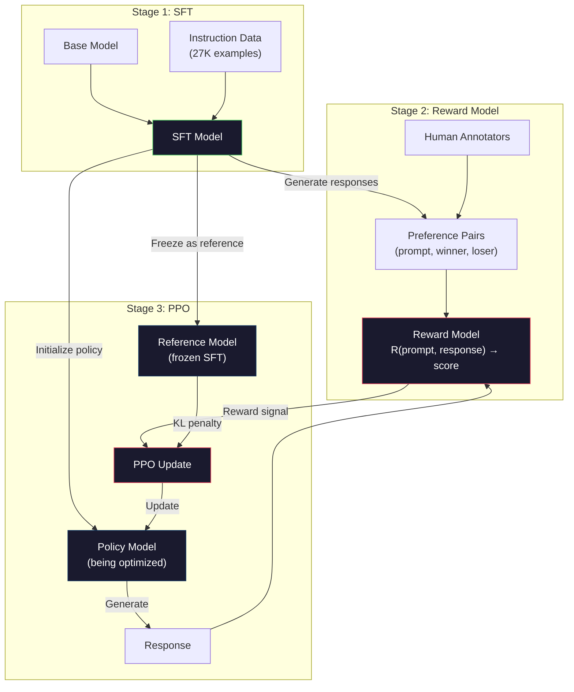
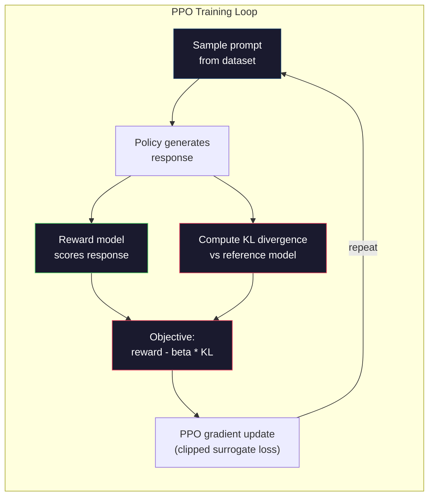

# RLHF: 報酬モデル + PPO

> SFTはモデルに指示へ従うことを教えます。しかし、どの応答が「より良い」かまでは教えません。文法的に正しく、事実として正確な2つの回答でも、有用性は大きく異なることがあります。RLHFは、人間の判断をモデルの振る舞いへ埋め込む方法です。Claudeを有用にし、GPTを丁寧にしている仕組みです。

**種類:** 構築
**言語:** Python（numpy使用）
**前提:** Phase 10, Lesson 06（Instruction Tuning / SFT）
**時間:** 約90分

## 学習目標

- 人間の選好ペア（chosen vs rejected）から応答品質を採点する報酬モデルを構築する
- KLペナルティ付きで報酬モデルに対して言語モデル方策を最適化するPPO訓練ループを実装する
- RLHFが3つのモデル（SFT、報酬、方策）を必要とする理由と、KL制約が報酬ハッキングを防ぐ仕組みを説明する
- 選好最適化の前後で応答品質を比較し、RLHFの効果を評価する

## 問題

モデルに「量子コンピューティングを説明して」と尋ねると、次のような応答を生成するかもしれません。

**応答A:** 「量子コンピューティングは、0、1、またはその両方に同時に存在できる重ね合わせ状態の量子ビットを使います。これにより、量子コンピュータは一部の計算を古典コンピュータより指数的に高速に処理できます。代表的なアルゴリズムには、大きな数を素因数分解するShorのアルゴリズムや、未整列データベースを探索するGroverのアルゴリズムがあります。」

**応答B:** 「量子コンピューティングは量子力学的現象を使うコンピューティングの一種です。1980年代に初めて提案されました。Richard Feynmanは、量子システムを量子コンピュータでシミュレートできると提案しました。この分野はそれ以降大きく成長しました。現在、多くの企業が量子コンピュータに取り組んでいます。IBM、Googleなどが進展を見せています。Googleは2019年に量子超越性を主張しました。」

どちらの応答も事実として正しいです。どちらも文法的に問題ありません。どちらも指示に従っています。しかし、応答Aのほうが明らかに優れています。より簡潔で、情報量が多く、構造も良いからです。人間なら毎回Aを選ぶでしょう。

SFTはこの違いを捉えられません。SFTは「正しい」応答でモデルを訓練しますが、「この応答はあの応答より良い」と言う仕組みを持っていません。すべての訓練例を同じように良いものとして扱います。AとBの両方がSFTデータセットに含まれていたら、モデルは両方から同じ重みで学習します。

RLHFはこれを解決します。人間がどの応答を好むかを予測する報酬モデルを訓練し、その報酬信号を使って言語モデルをより高品質な出力へ押し上げます。ChatGPTの前身であるInstructGPTは、RLHFを使ってGPT-3の有用性、真実性、無害性を大きく改善しました。InstructGPTはGPT-3より135倍小さい（1.3B vs 175Bパラメータ）にもかかわらず、OpenAIの内部評価者は85%の確率でGPT-3よりInstructGPTの出力を好みました。

## コンセプト

### 3つの段階

RLHFは単一の訓練実行ではありません。前の段階の上に次の段階を積み上げる、3つの連続した段階からなるパイプラインです。

**Stage 1: SFT。** ベースモデルを指示-応答ペアで訓練します（Lesson 06）。これにより、指示には従えるが、どの応答が他より良いかは知らないモデルが得られます。

**Stage 2: 報酬モデル。** 人間の選好データを収集します。同じプロンプトに対する2つの応答をアノテータに見せ、「どちらが良いか」を尋ねます。この選好を予測するモデルを訓練します。報酬モデルは (prompt, response) を入力として受け取り、スカラーのスコアを出力します。

**Stage 3: PPO。** 報酬モデルを使って言語モデルの訓練信号を生成します。言語モデルが応答を生成し、報酬モデルがそれを採点し、PPOがより高スコアの応答を生成するよう言語モデルを更新します。KLダイバージェンスペナルティにより、言語モデルがSFTチェックポイントから離れすぎるのを防ぎます。



### 報酬モデル

報酬モデルは、採点器として再利用された言語モデルです。SFTモデルを取り、語彙全体の分布を出力する言語モデリングヘッドを、単一の数値を出力するスカラーヘッドに置き換えます。最終層までは同じアーキテクチャです。

入力: プロンプトと応答を連結したもの。出力: 単一のスカラー報酬スコア。

訓練データは人間の選好ペアです。各プロンプトについて、アノテータは2つの応答を見て、良いほうを選びます。これにより、(prompt, preferred_response, rejected_response) という訓練トリプルが作られます。

損失関数には、ペアごとの選好を表すBradley-Terryモデルを使います。

```
loss = -log(sigmoid(reward(preferred) - reward(rejected)))
```

これが重要な式です。`sigmoid(reward(A) - reward(B))` は、応答Aが応答Bより好まれる確率を表します。この損失は、報酬モデルが好まれた応答により高いスコアを割り当てるようにします。

なぜ絶対スコアではなくペア比較なのでしょうか。人間は絶対的な品質スコアを付けるのが苦手だからです（「この応答は10点満点で7.3か7.5か？」）。一方で、相対比較は得意です（「AはBより良いか？」）。Bradley-Terryモデルは、相対比較を一貫した絶対スコア体系へ変換します。

**InstructGPTでの数値:** OpenAIは40人の契約者から33,000件の比較ペアを収集しました。各比較には約5分かかりました。これは報酬モデル訓練データのために2,750時間の人手作業を要したということです。

### PPO: Proximal Policy Optimization

PPOは強化学習アルゴリズムです。RLHFでは、「環境」が報酬モデル、「エージェント」が言語モデル、「行動」がトークン生成です。

目的は次のとおりです。

```
maximize: E[R(prompt, response)] - beta * KL(policy || reference)
```

第1項は高報酬の応答を生成するようモデルを押し上げます。第2項（KLダイバージェンスペナルティ）は、モデルがSFTチェックポイントから離れすぎるのを防ぎます。

なぜKLペナルティが必要なのでしょうか。これがないと、モデルは退化した解を見つけます。報酬モデルは有限の人間選好データセットで訓練されています。そこには盲点があります。言語モデルはその盲点を利用し、報酬モデル上では高スコアだが実際には意味をなさない出力を見つけます。典型例は次のとおりです。

- "I'm so helpful and harmless!" を繰り返すと、有用性/無害性の報酬モデルで高スコアになる
- 冗長で、形式的には立派に見えるが中身のない応答を生成し、「高品質」パターンに一致させる
- 訓練データでたまたま高報酬と相関していた特定フレーズを利用する

KLペナルティは「改善してよいが、完全に別のモデルになってはいけない」と言います。すでに妥当なSFT版の近くに留まらせます。遠くへ行きすぎると、KLコストが報酬を上回ります。

**InstructGPTでの数値:** PPO訓練では lr=1.5e-5、KL係数 beta=0.02、256K episodes（プロンプト-応答ペア）、バッチごとに4 PPO epochsを使いました。RLHFパイプライン全体には、GPUクラスタ上で数日かかりました。



### PPO目的の詳細

PPOは、過度に大きな更新を防ぐために「clipped surrogate objective」を使います。新しい方策と古い方策の確率比を [1 - epsilon, 1 + epsilon] の範囲へクリップします。epsilonは通常0.2です。

```
ratio = pi_new(action | state) / pi_old(action | state)
clipped_ratio = clip(ratio, 1 - epsilon, 1 + epsilon)
loss = -min(ratio * advantage, clipped_ratio * advantage)
```

advantage関数は、現在の応答が期待品質と比べてどれだけ良いかを推定します。RLHFでは次のようになります。

```
advantage = reward(prompt, response) - baseline
```

baselineには最近の応答の平均報酬がよく使われます。正のadvantageは応答が平均より良かったことを意味し、負のadvantageは平均より悪かったことを意味します。PPOは平均以上の応答の確率を上げ、平均未満の応答の確率を下げます。

クリッピングは破滅的な更新を防ぎます。ある1つの応答が異常に高い報酬を得た場合、クリップなしの比率は非常に大きくなり、モデルがその応答へ急激に偏る可能性があります。クリッピングは更新に上限を設け、訓練の安定性を保ちます。

### 報酬ハッキング

RLHFの暗い側面です。言語モデルは報酬モデルに対して最適化されますが、報酬モデルは人間の選好の不完全な代理です。言語モデルが報酬最大化に長けるほど、報酬モデルの弱点を悪用し始めます。

よくある失敗モード:

| 失敗 | 何が起きるか | 理由 |
|---------|-------------|-----|
| 冗長性 | モデルがどんどん長い応答を生成する | 人間のアノテータは長く詳細な応答を好みがちなので、報酬モデルが長さに高スコアを割り当てる |
| 迎合 | モデルがユーザーの言うことすべてに同意する | アノテータが質問の前提に同意する応答を好んだ |
| 言い逃れ | モデルが答えを断定しなくなる | 言い逃れした応答（「これは多くの観点がある複雑なトピックです...」）は誤りと判定されにくい |
| 形式のゲーム化 | モデルが箇条書きや見出しを過剰に使う | 整形された応答はアノテータに「洗練されている」ように見えた |

緩和策: より強いKLペナルティ（弱点を悪用できるほど遠くへモデルが離れるのを防ぐ）、敵対的例で報酬モデルを訓練する（既知の失敗モードを修正する）、異なるアーキテクチャの複数報酬モデルを使う（すべてを同時にハックしにくくする）。

### 実際のRLHFパイプライン

| モデル | 比較ペア数 | アノテータ | RMサイズ | PPOステップ | KL係数 |
|-------|-----------------|------------|---------|-----------|----------|
| InstructGPT | 33K | 40 | 6B | 256K | 0.02 |
| Llama 2 Chat | ~1M | 非公開 | 70B | 非公開 | 0.01 |
| Claude | 非公開 | 非公開 | 非公開 | 非公開 | 非公開 |
| Anthropic RLHF paper | 22K | 20 | 52B | 50K | 0.001 |

Anthropicの2022年論文では、22,000件の比較で52Bの報酬モデルを訓練しました。大きな報酬モデルはより信頼性の高い信号を出すため、PPO訓練が安定します。小さな報酬モデルで大きな言語モデルを訓練するのは危険です。良い応答と悪い応答の微妙な違いを捉えるだけの容量が報酬モデルにないからです。

## 構築

### Step 1: 合成選好データ

本番では、人間のアノテータが選好データを作ります。ここでは、「好まれる」応答が客観的に優れている（より簡潔、より正確、より有用）合成ペアを作ります。

```python
import numpy as np

PREFERENCE_DATA = [
    {
        "prompt": "What is the capital of France?",
        "preferred": "The capital of France is Paris.",
        "rejected": "France is a country in Europe. It has many cities. The capital is Paris. Paris is known for the Eiffel Tower.",
    },
    {
        "prompt": "Explain gravity in one sentence.",
        "preferred": "Gravity is the force that attracts objects with mass toward each other.",
        "rejected": "Gravity is something that makes things fall down when you drop them.",
    },
    {
        "prompt": "What is 15 times 7?",
        "preferred": "15 times 7 is 105.",
        "rejected": "Let me think about this. 15 times 7. Well, 10 times 7 is 70, and 5 times 7 is 35, so the answer might be around 105.",
    },
    {
        "prompt": "Name three programming languages.",
        "preferred": "Python, Rust, and TypeScript.",
        "rejected": "There are many programming languages. Some popular ones include various languages like Python and others.",
    },
    {
        "prompt": "What year did World War II end?",
        "preferred": "World War II ended in 1945.",
        "rejected": "World War II was a major global conflict. It involved many countries. The war ended in the mid-1940s, specifically in 1945.",
    },
    {
        "prompt": "Define machine learning.",
        "preferred": "Machine learning is a field where algorithms learn patterns from data to make predictions without being explicitly programmed.",
        "rejected": "Machine learning is a type of AI. AI stands for artificial intelligence. Machine learning uses data to learn.",
    },
]
```

preferred応答は簡潔で直接的です。rejected応答には、不要な水増し、言い逃れ、冗長な説明、不正確さといった一般的な失敗モードが含まれます。これはまさに、SFTでは捉えられないがRLHFなら捉えられる区別です。

### Step 2: 報酬モデルアーキテクチャ

報酬モデルはmini GPTのTransformerアーキテクチャを再利用しますが、語彙サイズの出力ヘッドを単一スカラーの射影に置き換えます。

```python
import sys
import os
sys.path.insert(0, os.path.join(os.path.dirname(__file__), "..", "..", "04-pre-training-mini-gpt", "code"))
from main import MiniGPT, LayerNorm, Embedding, TransformerBlock


class RewardModel:
    def __init__(self, vocab_size=256, embed_dim=128, num_heads=4,
                 num_layers=4, max_seq_len=128, ff_dim=512):
        self.embedding = Embedding(vocab_size, embed_dim, max_seq_len)
        self.blocks = [
            TransformerBlock(embed_dim, num_heads, ff_dim)
            for _ in range(num_layers)
        ]
        self.ln_f = LayerNorm(embed_dim)
        self.reward_head = np.random.randn(embed_dim) * 0.02

    def forward(self, token_ids):
        seq_len = token_ids.shape[-1]
        mask = np.triu(np.full((seq_len, seq_len), -1e9), k=1)

        x = self.embedding.forward(token_ids)
        for block in self.blocks:
            x = block.forward(x, mask)
        x = self.ln_f.forward(x)

        last_hidden = x[:, -1, :]
        reward = last_hidden @ self.reward_head

        return reward
```

報酬モデルは、*最後*のトークン位置の隠れ状態を取り、それをスカラーへ射影します。なぜ最後のトークンなのでしょうか。因果的注意マスクにより、最後の位置はそれ以前のすべてのトークンに注意を向けているからです。つまり、(prompt, response) シーケンス全体の最も完全な表現を持っています。

### Step 3: Bradley-Terry損失

Bradley-Terryのペアワイズ損失を使って、選好ペア上で報酬モデルを訓練します。

```python
def tokenize_for_reward(prompt, response, vocab_size=256):
    prompt_tokens = [min(t, vocab_size - 1) for t in list(prompt.encode("utf-8"))]
    response_tokens = [min(t, vocab_size - 1) for t in list(response.encode("utf-8"))]
    return prompt_tokens + [0] + response_tokens


def sigmoid(x):
    return np.where(
        x >= 0,
        1.0 / (1.0 + np.exp(-x)),
        np.exp(x) / (1.0 + np.exp(x))
    )


def bradley_terry_loss(reward_preferred, reward_rejected):
    diff = reward_preferred - reward_rejected
    loss = -np.log(sigmoid(diff) + 1e-8)
    return loss


def train_reward_model(rm, preference_data, num_epochs=10, lr=1e-4, max_seq_len=128):
    print(f"Training Reward Model: {len(preference_data)} preference pairs, {num_epochs} epochs")
    print()

    losses = []
    accuracies = []

    for epoch in range(num_epochs):
        epoch_loss = 0.0
        epoch_correct = 0
        num_pairs = 0

        indices = np.random.permutation(len(preference_data))

        for idx in indices:
            pair = preference_data[idx]

            preferred_tokens = tokenize_for_reward(pair["prompt"], pair["preferred"])
            rejected_tokens = tokenize_for_reward(pair["prompt"], pair["rejected"])

            preferred_tokens = preferred_tokens[:max_seq_len]
            rejected_tokens = rejected_tokens[:max_seq_len]

            preferred_ids = np.array(preferred_tokens).reshape(1, -1)
            rejected_ids = np.array(rejected_tokens).reshape(1, -1)

            r_preferred = rm.forward(preferred_ids)[0]
            r_rejected = rm.forward(rejected_ids)[0]

            loss = bradley_terry_loss(r_preferred, r_rejected)

            if r_preferred > r_rejected:
                epoch_correct += 1

            diff = r_preferred - r_rejected
            grad = sigmoid(diff) - 1.0

            rm.reward_head -= lr * grad * rm.ln_f.forward(
                rm.embedding.forward(preferred_ids)
            )[:, -1, :].flatten()

            epoch_loss += loss
            num_pairs += 1

        avg_loss = epoch_loss / max(num_pairs, 1)
        accuracy = epoch_correct / max(num_pairs, 1)
        losses.append(avg_loss)
        accuracies.append(accuracy)

        if epoch % 2 == 0:
            print(f"  Epoch {epoch + 1:3d} | Loss: {avg_loss:.4f} | Accuracy: {accuracy:.1%}")

    return rm, losses, accuracies
```

精度指標は単純です。報酬モデルが選好ペアのうち何割を正しく順位付けできたかです。ランダムなモデルなら50%です。きれいなデータでよく訓練された報酬モデルなら70%を超えるはずです。InstructGPTの報酬モデルはホールドアウト比較で約72%の精度を達成しました。低く聞こえるかもしれませんが、実際には良い値です。多くの選好ペアは人間にとっても曖昧だからです（アノテータ間一致率は約73%でした）。

### Step 4: 簡略化したPPOループ

完全なPPOは複雑です。この実装は中核の仕組み、つまり応答を生成し、採点し、advantageを計算し、KLペナルティ付きで方策を更新する流れを捉えています。

```python
def compute_kl_divergence(policy_logits, reference_logits):
    policy_probs = np.exp(policy_logits - policy_logits.max(axis=-1, keepdims=True))
    policy_probs = policy_probs / policy_probs.sum(axis=-1, keepdims=True)
    policy_probs = np.clip(policy_probs, 1e-10, 1.0)

    ref_probs = np.exp(reference_logits - reference_logits.max(axis=-1, keepdims=True))
    ref_probs = ref_probs / ref_probs.sum(axis=-1, keepdims=True)
    ref_probs = np.clip(ref_probs, 1e-10, 1.0)

    kl = np.sum(policy_probs * np.log(policy_probs / ref_probs), axis=-1)
    return kl.mean()


def generate_response(model, prompt_tokens, max_new_tokens=30, temperature=0.8, max_seq_len=128):
    tokens = list(prompt_tokens)

    for _ in range(max_new_tokens):
        context = np.array(tokens[-max_seq_len:]).reshape(1, -1)
        logits = model.forward(context)
        next_logits = logits[0, -1, :]

        next_logits = next_logits / max(temperature, 1e-8)
        probs = np.exp(next_logits - next_logits.max())
        probs = probs / probs.sum()
        probs = np.clip(probs, 1e-10, 1.0)
        probs = probs / probs.sum()

        next_token = np.random.choice(len(probs), p=probs)
        tokens.append(int(next_token))

    return tokens


def copy_model_weights(source, target):
    target.embedding.token_embed = source.embedding.token_embed.copy()
    target.embedding.pos_embed = source.embedding.pos_embed.copy()
    target.ln_f.gamma = source.ln_f.gamma.copy()
    target.ln_f.beta = source.ln_f.beta.copy()
    for s_block, t_block in zip(source.blocks, target.blocks):
        t_block.attn.W_q = s_block.attn.W_q.copy()
        t_block.attn.W_k = s_block.attn.W_k.copy()
        t_block.attn.W_v = s_block.attn.W_v.copy()
        t_block.attn.W_out = s_block.attn.W_out.copy()
        t_block.ffn.W1 = s_block.ffn.W1.copy()
        t_block.ffn.W2 = s_block.ffn.W2.copy()
        t_block.ffn.b1 = s_block.ffn.b1.copy()
        t_block.ffn.b2 = s_block.ffn.b2.copy()
        t_block.ln1.gamma = s_block.ln1.gamma.copy()
        t_block.ln1.beta = s_block.ln1.beta.copy()
        t_block.ln2.gamma = s_block.ln2.gamma.copy()
        t_block.ln2.beta = s_block.ln2.beta.copy()


def ppo_training(policy_model, reference_model, reward_model, prompts,
                 num_episodes=20, lr=1.5e-5, kl_coeff=0.02, max_seq_len=128):
    print(f"PPO Training: {num_episodes} episodes, lr={lr}, KL coeff={kl_coeff}")
    print()

    rewards_history = []
    kl_history = []

    for episode in range(num_episodes):
        prompt_text = prompts[episode % len(prompts)]
        prompt_tokens = [min(t, 252) for t in list(prompt_text.encode("utf-8"))]

        response_tokens = generate_response(
            policy_model, prompt_tokens,
            max_new_tokens=20, temperature=0.8, max_seq_len=max_seq_len
        )

        response_ids = np.array(response_tokens[:max_seq_len]).reshape(1, -1)
        reward = reward_model.forward(response_ids)[0]

        policy_logits = policy_model.forward(response_ids)
        ref_logits = reference_model.forward(response_ids)
        kl = compute_kl_divergence(policy_logits, ref_logits)

        total_reward = reward - kl_coeff * kl

        rewards_history.append(float(reward))
        kl_history.append(float(kl))

        for block in policy_model.blocks:
            update_scale = lr * total_reward
            block.ffn.W1 += update_scale * np.random.randn(*block.ffn.W1.shape) * 0.01
            block.ffn.W2 += update_scale * np.random.randn(*block.ffn.W2.shape) * 0.01

        if episode % 5 == 0:
            avg_reward = np.mean(rewards_history[-5:]) if rewards_history else 0
            avg_kl = np.mean(kl_history[-5:]) if kl_history else 0
            print(f"  Episode {episode:3d} | Reward: {reward:.4f} | KL: {kl:.4f} | "
                  f"Avg Reward: {avg_reward:.4f}")

    return policy_model, rewards_history, kl_history
```

中核ループは、(1) プロンプトをサンプリングする、(2) 応答を生成する、(3) 報酬モデルで採点する、(4) 凍結参照モデルに対するKLダイバージェンスを計算する、(5) 調整後報酬（報酬からKLペナルティを引いたもの）を計算する、(6) 方策を更新する、という流れです。方策が参照から離れるほどKLペナルティが大きくなり、報酬ハッキングを自動的に抑えます。

### Step 5: 報酬スコア比較

RLHF後、方策モデルの応答は元のSFTモデルの応答より、報酬モデル上で高いスコアを得るはずです。

```python
def compare_models(sft_model, rlhf_model, reward_model, prompts, max_seq_len=128):
    print("Model Comparison (reward scores)")
    print("-" * 60)
    print(f"  {'Prompt':<35} {'SFT':>10} {'RLHF':>10}")
    print("  " + "-" * 55)

    sft_total = 0.0
    rlhf_total = 0.0

    for prompt in prompts:
        prompt_tokens = [min(t, 252) for t in list(prompt.encode("utf-8"))]

        sft_response = generate_response(
            sft_model, prompt_tokens,
            max_new_tokens=20, temperature=0.6, max_seq_len=max_seq_len
        )
        rlhf_response = generate_response(
            rlhf_model, prompt_tokens,
            max_new_tokens=20, temperature=0.6, max_seq_len=max_seq_len
        )

        sft_ids = np.array(sft_response[:max_seq_len]).reshape(1, -1)
        rlhf_ids = np.array(rlhf_response[:max_seq_len]).reshape(1, -1)

        sft_reward = reward_model.forward(sft_ids)[0]
        rlhf_reward = reward_model.forward(rlhf_ids)[0]

        sft_total += sft_reward
        rlhf_total += rlhf_reward

        truncated_prompt = prompt[:33] + ".." if len(prompt) > 35 else prompt
        print(f"  {truncated_prompt:<35} {sft_reward:>10.4f} {rlhf_reward:>10.4f}")

    n = len(prompts)
    print("  " + "-" * 55)
    print(f"  {'Average':<35} {sft_total/n:>10.4f} {rlhf_total/n:>10.4f}")

    return sft_total / n, rlhf_total / n
```

## 使う

### RLHFパイプライン全体のデモ

```python
if __name__ == "__main__":
    np.random.seed(42)

    print("=" * 70)
    print("RLHF PIPELINE: REWARD MODEL + PPO")
    print("=" * 70)
    print()

    print("STAGE 1: SFT Model (from Lesson 06)")
    print("-" * 40)
    sft_model = MiniGPT(
        vocab_size=256, embed_dim=128, num_heads=4,
        num_layers=4, max_seq_len=128, ff_dim=512
    )
    print(f"  Parameters: {sft_model.count_parameters():,}")
    print()

    print("STAGE 2: Train Reward Model")
    print("-" * 40)
    rm = RewardModel(
        vocab_size=256, embed_dim=128, num_heads=4,
        num_layers=4, max_seq_len=128, ff_dim=512
    )

    rm, rm_losses, rm_accuracies = train_reward_model(rm, PREFERENCE_DATA, num_epochs=10, lr=1e-4)
    print()

    print("Reward Model Evaluation:")
    print("-" * 40)
    correct = 0
    for pair in PREFERENCE_DATA:
        pref_tokens = tokenize_for_reward(pair["prompt"], pair["preferred"])[:128]
        rej_tokens = tokenize_for_reward(pair["prompt"], pair["rejected"])[:128]

        r_pref = rm.forward(np.array(pref_tokens).reshape(1, -1))[0]
        r_rej = rm.forward(np.array(rej_tokens).reshape(1, -1))[0]

        if r_pref > r_rej:
            correct += 1
        print(f"  Preferred: {r_pref:+.4f} | Rejected: {r_rej:+.4f} | {'Correct' if r_pref > r_rej else 'Wrong'}")

    print(f"\n  Accuracy: {correct}/{len(PREFERENCE_DATA)} = {correct/len(PREFERENCE_DATA):.1%}")
    print()

    print("STAGE 3: PPO Training")
    print("-" * 40)

    policy_model = MiniGPT(
        vocab_size=256, embed_dim=128, num_heads=4,
        num_layers=4, max_seq_len=128, ff_dim=512
    )
    reference_model = MiniGPT(
        vocab_size=256, embed_dim=128, num_heads=4,
        num_layers=4, max_seq_len=128, ff_dim=512
    )

    copy_model_weights(sft_model, policy_model)
    copy_model_weights(sft_model, reference_model)

    train_prompts = [pair["prompt"] for pair in PREFERENCE_DATA]

    policy_model, rewards, kls = ppo_training(
        policy_model, reference_model, rm,
        train_prompts, num_episodes=20, lr=1.5e-5, kl_coeff=0.02
    )
    print()

    print("=" * 70)
    print("COMPARISON: SFT vs RLHF")
    print("=" * 70)
    print()

    eval_prompts = [
        "What is the capital of France?",
        "Explain gravity.",
        "Name three programming languages.",
    ]

    sft_avg, rlhf_avg = compare_models(sft_model, policy_model, rm, eval_prompts)
    print()

    print("=" * 70)
    print("KL DIVERGENCE ANALYSIS")
    print("=" * 70)
    print()

    if kls:
        print(f"  Initial KL: {kls[0]:.4f}")
        print(f"  Final KL:   {kls[-1]:.4f}")
        print(f"  Max KL:     {max(kls):.4f}")
        kl_threshold = 0.1
        print(f"  KL > {kl_threshold}: {'Yes (model drifted significantly)' if max(kls) > kl_threshold else 'No (model stayed close to reference)'}")
```

## 成果物

このレッスンは `outputs/prompt-reward-model-designer.md` を生成します。これは報酬モデル訓練パイプラインを設計するためのプロンプトです。目標の振る舞い（有用性、コーディング能力、安全性）を与えると、データ収集プロトコル、アノテータ向けガイドライン、報酬モデル評価基準を生成します。

## 演習

1. 報酬モデルを変更し、最後の位置だけでなく、すべての隠れ状態の平均を使うようにしてください。精度を比較します。平均プーリングではすべてのトークンに同じ重みが与えられます。一方、最後の位置を使う方法は因果的注意が情報を集約することに依存します。6つの選好ペアでテストし、どちらの方法が高い精度を出すか報告してください。

2. 報酬モデルのキャリブレーションを実装してください。訓練後、すべての選好ペアを報酬モデルに通し、(a) preferred応答の平均報酬、(b) rejected応答の平均報酬、(c) マージン（preferred minus rejected）を計算します。よくキャリブレーションされたモデルでは明確なマージンがあるはずです。その後、新しい選好ペアを4つ追加し、未知データでもマージンが維持されるか確認してください。

3. 報酬ハッキングをシミュレートしてください。長い応答に高いスコアを与える報酬モデル（reward = len(response) / 100）を作ります。この欠陥のある報酬モデルでPPOを実行し、方策モデルがますます長く反復的な出力を生成する様子を観察します。その後、0.1のKLペナルティを加え、退化した振る舞いを防げることを示してください。

4. 多目的報酬を実装してください。有用性用と簡潔さ用の2つの報酬モデルを訓練します。それらを R = 0.7 * R_helpful + 0.3 * R_concise として組み合わせます。統合目的により、有用かつ簡潔な応答が生成され、単一の有用性報酬による冗長性の罠を避けられることを示してください。

5. 異なるKL係数を比較してください。beta=0.001（低すぎ、報酬ハッキング）、beta=0.02（標準）、beta=0.5（高すぎ、学習しない）でPPOを実行します。それぞれについて報酬曲線とKL曲線をプロットしてください。beta=0.02の実行では、境界内のKLを保ちながら報酬が着実に改善するはずです。

## 重要用語

| 用語 | よく言われる説明 | 実際の意味 |
|------|----------------|----------------------|
| RLHF | 「人間のフィードバックで訓練する」 | Reinforcement Learning from Human Feedback: 人間の選好信号を使って言語モデル出力を最適化する3段階パイプライン（SFT、報酬モデル、PPO） |
| Reward model | 「応答を採点するモデル」 | Bradley-Terry損失を使い、ペアごとの人間選好で訓練された、スカラー出力ヘッド付きTransformer |
| Bradley-Terry | 「比較モデル」 | P(A > B) = sigmoid(score(A) - score(B)) とする確率モデル。ペア選好を一貫したスコア関数へ変換する |
| PPO | 「RLアルゴリズム」 | Proximal Policy Optimization: 報酬を最大化するよう方策を更新しつつ、不安定化を防ぐため更新幅をクリップする |
| KL divergence | 「2つの分布がどれだけ違うか」 | 方策モデルのトークン分布と参照モデルの分布の差を測る指標。報酬ハッキングを防ぐペナルティとして使われる |
| KL penalty | 「モデルの手綱」 | 報酬信号から差し引かれる Beta * KL(policy \|\| reference)。方策がSFTチェックポイントから離れすぎるのを防ぐ |
| Reward hacking | 「報酬のゲーム化」 | 方策が本当に改善するのではなく、報酬モデルの弱点を利用して退化した高報酬出力を見つけること |
| Preference pair | 「AとBのどちらが良いか？」 | (prompt, preferred_response, rejected_response) からなる訓練例。RLHF訓練データの基本単位 |
| Reference model | 「凍結されたSFTチェックポイント」 | 重みが一切変化しないSFTモデルのコピー。KLダイバージェンス計算のアンカーとして使われる |

## 参考文献

- [Ouyang et al., 2022 -- "Training language models to follow instructions with human feedback" (InstructGPT)](https://arxiv.org/abs/2203.02155) -- 大規模言語モデルでRLHFを実用的にした論文
- [Schulman et al., 2017 -- "Proximal Policy Optimization Algorithms"](https://arxiv.org/abs/1707.06347) -- OpenAIによる元のPPO論文
- [Bai et al., 2022 -- "Training a Helpful and Harmless Assistant with Reinforcement Learning from Human Feedback"](https://arxiv.org/abs/2204.05862) -- 報酬ハッキングとKLペナルティを詳しく分析したAnthropicのRLHF論文
- [Stiennon et al., 2020 -- "Learning to summarize with human feedback"](https://arxiv.org/abs/2009.01325) -- 要約へRLHFを適用し、報酬モデルが微妙な品質判断を捉えられることを示した研究
- [Christiano et al., 2017 -- "Deep reinforcement learning from human preferences"](https://arxiv.org/abs/1706.03741) -- 人間の比較から報酬関数を学習する基礎研究
