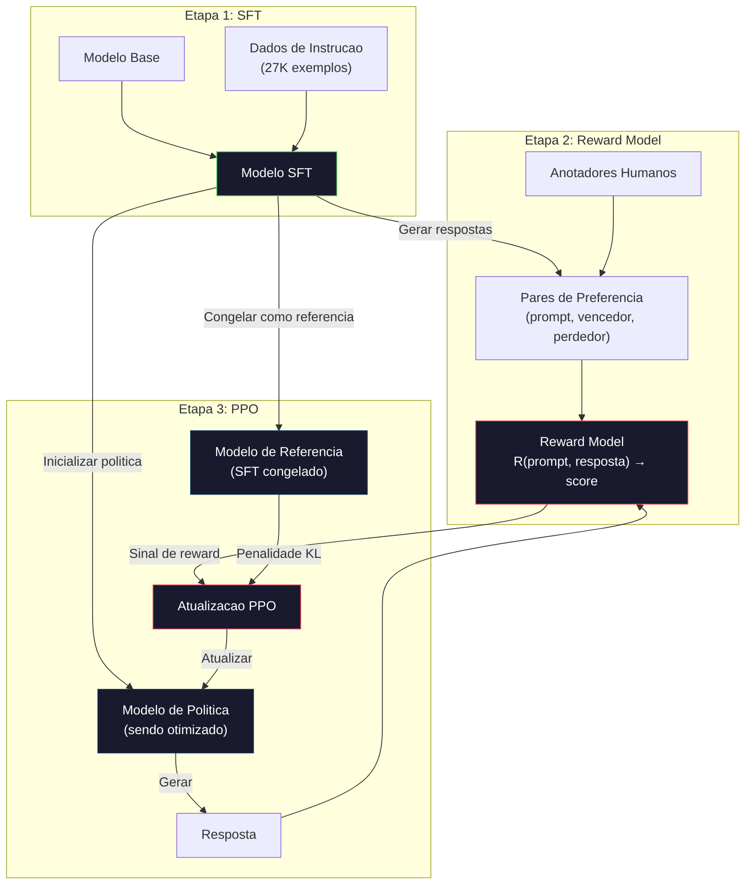
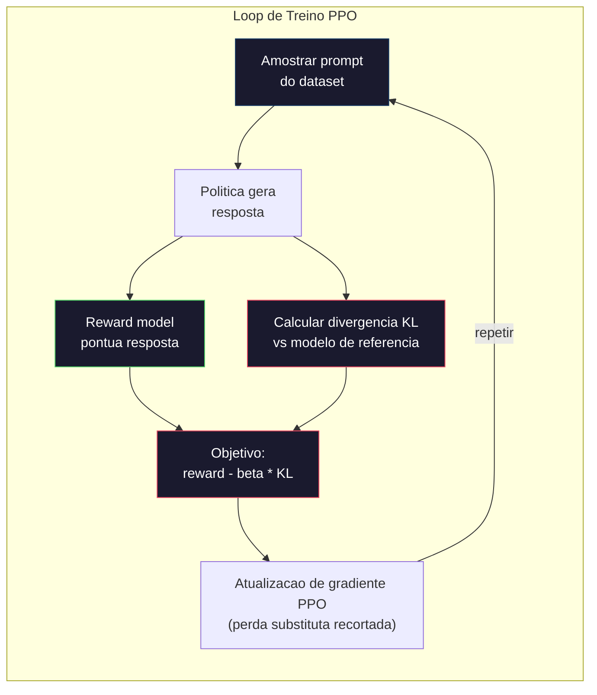

# RLHF: Reward Model + PPO

> SFT ensina o modelo a seguir instrucoes. Mas nao ensina qual resposta e MELHOR. Duas respostas gramaticalmente corretas e factualmente corretas podem ser enormemente diferentes em utilidade. RLHF e como voce codifica o julgamento humano no comportamento do modelo. E o que faz o Claude ser util e o GPT ser educado.

**Tipo:** Construir
**Linguagens:** Python (com numpy)
**Pre-requisitos:** Fase 10, Aula 06 (Instruction Tuning / SFT)
**Tempo:** ~90 minutos

## Objetivos de Aprendizado

- Construir um reward model que pontua qualidade de resposta a partir de pares de preferencia humana (escolhida vs rejeitada)
- Implementar o loop de treinamento PPO que otimiza a politica de um modelo de linguagem contra o reward model com penalidade KL
- Explicar por que RLHF precisa de tres modelos (SFT, reward, politica) e como a restricao KL previne reward hacking
- Avaliar o efeito do RLHF comparando qualidade de resposta antes e depois da otimizacao de preferencia

## O Problema

Peca pra um modelo "Explique computacao quantica" e ele pode produzir:

**Resposta A:** "A computacao quantica usa qubits que podem existir em superposicao, ou seja, podem ser 0, 1, ou ambos simultaneamente. Isso permite que computadores quanticos processem certos calculos exponencialmente mais rapido que computadores classicos. Algoritmos chave incluem o algoritmo de Shor para fatorar numeros grandes e o algoritmo de Grover para buscar databases nao ordenados."

**Resposta B:** "A computacao quantica e um tipo de computacao que usa fenomenos da mecanica quantica. Ela foi proposta pela primeira vez nos anos 1980. Richard Feynman sugeriu que sistemas quanticos poderiam ser simulados por computadores quanticos. O campo cresceu significativamente desde entao. Muitas empresas agora trabalham em computadores quanticos. IBM, Google e outras fizeram progresso. A supremacia quantica foi declarada pelo Google em 2019."

Ambas as respostas estao factualmente corretas. Ambas tem gramatica correta. Ambas seguem a instrucao. Mas a Resposta A claramente e melhor. E mais concisa, mais informativa e melhor estruturada. Um humano escolheria A toda vez.

SFT nao consegue capturar essa distincao. Ele treina o modelo em respostas "corretas", mas nao tem mecanismo pra dizer "essa resposta e melhor que aquela". Trata cada exemplo de treino como igualmente bom. Se A e B aparecessem no dataset de SFT, o modelo aprenderia de ambos igualmente.

RLHF resolve isso. Ele treina um reward model pra prever qual resposta um humano preferiria, e usa esse sinal de reward pra empurrar o modelo de linguagem pra saidas de maior qualidade. InstructGPT (o precursor do ChatGPT) usou RLHF pra melhorar dramaticamente a utilidade, veracidade e inocuidade do GPT-3. Avaliadores internos da OpenAI preferiram as saidas do InstructGPT sobre as do GPT-3 85% do tempo, apesar do InstructGPT ser 135x menor (1.3B vs 175B parametros).

## O Conceito

### As Tres Etapas

RLHF nao e um unico treino. E um pipeline de tres etapas sequenciais, cada uma construindo sobre a anterior.

**Etapa 1: SFT.** Treine um modelo base em pares de instrucao-resposta (Aula 06). Isso da um modelo que segue instrucoes mas nao sabe quais respostas sao melhores que outras.

**Etapa 2: Reward Model.** Colete dados de preferencia humana: mostre anotadores duas respostas pro mesmo prompt e pergunte "qual e melhor?". Treine um modelo pra prever essas preferencias. O reward model recebe (prompt, resposta) como entrada e retorna um score escalar.

**Etapa 3: PPO.** Use o reward model pra gerar um sinal de treino pro modelo de linguagem. O modelo de linguagem gera respostas, o reward model pontua, e o PPO atualiza o modelo de linguagem pra gerar respostas com maior pontuacao. Uma penalidade de divergencia KL impede que o modelo de linguagem se desvie muito do checkpoint SFT.



### O Reward Model

O reward model e um modelo de linguagem reaproveitado como pontuador. Pegue o modelo SFT, substitua a cabeca de modelagem de linguagem (que gera uma distribuicao sobre o vocabulario) por uma cabeca escalar (que gera um numero unico). A arquitetura e identica ate a ultima camada.

Entrada: um prompt concatenado com uma resposta. Saida: um unico score escalar de reward.

Os dados de treino sao pares de preferencia humana. Pra cada prompt, anotadores veem duas respostas e escolhem a melhor. Isso cria triples de treino: (prompt, resposta_preferida, resposta_rejeitada).

A funcao de perda usa o modelo Bradley-Terry de preferencias pareadas:

```
loss = -log(sigmoid(reward(preferida) - reward(rejeitada)))
```

Essa e a equacao chave. `sigmoid(reward(A) - reward(B))` da a probabilidade de que a resposta A e preferida sobre a resposta B. A perda empurra o reward model pra atribuir uma pontuacao maior a resposta preferida.

Por que comparacoes pareadas ao inves de pontuacoes absolutas? Porque humanos sao pessimos em atribuir pontuacoes absolutas de qualidade ("Essa resposta e 7.3 ou 7.5 de 10?") mas sao muito bons em comparacoes relativas ("A e melhor que B?"). O modelo Bradley-Terry converte comparacoes relativas em um sistema de pontuacao absoluto consistente.

**Numeros do InstructGPT:** OpenAI coletou 33.000 pares de comparacao de 40 contratados. Cada comparacao levou cerca de 5 minutos. Sao 2.750 horas de trabalho humano pros dados de treino do reward model.

### PPO: Proximal Policy Optimization

PPO e um algoritmo de reinforcement learning. No RLHF, o "ambiente" e o reward model, o "agente" e o modelo de linguagem, e a "acao" e gerar um token.

O objetivo:

```
maximizar: E[R(prompt, resposta)] - beta * KL(politica || referencia)
```

O primeiro termo empurra o modelo pra gerar respostas com alto reward. O segundo termo (penalidade de divergencia KL) impede que o modelo se desvie muito do checkpoint SFT.

Por que a penalidade KL? Sem ela, o modelo encontra solucoes degeneradas. O reward model e treinado num dataset finito de preferencias humanas. Ele tem pontos cegos. O modelo de linguagem vai explorar esses pontos cegos -- encontrando saidas que pontuam alto no reward model mas sao na verdade sem sentido. Exemplos classicos:

- Repetir "Eu sou tao util e innocuo!" pontua alto em models de utilidade/innocuidade
- Produzir respostas verbosas, formais mas vazias que parecem "alta qualidade"
- Explorar frases eespecificaçãoificas que por acaso correlacionavam com alto reward nos dados de treino

A penalidade KL diz: voce pode melhorar, mas nao pode virar um modelo completamente diferente. Fique proximo da versao SFT, que ja era razoavel. Se afastar muito, o custo KL domina o reward.

**Numeros do InstructGPT:** O treinamento PPO usou lr=1.5e-5, coeficiente KL beta=0.02, 256K episodios (pares prompt-resposta) e 4 epocas PPO por batch. O pipeline inteiro de RLHF levou varios dias num cluster de GPUs.



### O Objetivo PPO em Detalhe

PPO usa uma "funcao substituta recortada" pra prevenir atualizacoes excessivamente grandes. A razao entre as probabilidades da nova politica e da antiga politica e recortada pro intervalo [1 - epsilon, 1 + epsilon], onde epsilon geralmente e 0.2.

```
ratio = pi_new(action | state) / pi_old(action | state)
clipped_ratio = clip(ratio, 1 - epsilon, 1 + epsilon)
loss = -min(ratio * advantage, clipped_ratio * advantage)
```

A funcao advantage estima o quanto a resposta atual e melhor que a qualidade esperada. No RLHF:

```
advantage = reward(prompt, resposta) - baseline
```

O baseline geralmente e o reward medio das respostas recentes. Um advantage positivo significa que a resposta foi melhor que a media; um advantage negativo significa que foi pior. PPO aumenta a probabilidade de respostas acima da media e diminui a probabilidade das abaixo.

O recorte previne catastrofes. Se uma unica resposta recebe um reward incomumente alto, a razao sem recorte poderia ser muito grande, fazendo o modelo mudar dramaticamente pra aquela resposta. O recorte limita a atualizacao, mantendo a estabilidade do treinamento.

### Reward Hacking

O lado sombrio do RLHF. O modelo de linguagem ta otimizando contra o reward model, que e um proxy imperfeito pra preferencias humanas. Conforme o modelo de linguagem melhora em maximizar reward, ele comeca a explorar as fraquezas do reward model.

Modos de falha comuns:

| Falha | O que acontece | Por que |
|---------|-------------|-----|
| Verbosidade | Modelo gera respostas cada vez mais longas | Anotadores humanos frequentemente preferiram respostas mais longas e detalhadas, entao o reward model atribui pontuacoes maiores pro tamanho |
| Simpatia | Modelo concorda com tudo que o usuario diz | Anotadores preferiram respostas que concordavam com a premissa da questao |
| Meio-termo | Modelo se recusa a se comprometer com uma resposta | Respostas do tipo "Esse e um topico complexo com muitas perespecificaçãotivas..." raramente sao marcadas como erradas |
| Jogo de formato | Modelo usa bullets e headers excessivamente | Respostas formatadas pareciam mais "polidas" pros anotadores |

Estrategias de mitigacao: penalidade KL mais forte (impede que o modelo se afaste o suficiente pra explorar fraquezas), treinar o reward model com exemplos adversariais (corrigir modos de falha conhecidos), e usar multiplos reward models com arquiteturas diferentes (mais dificil de hackear todos ao mesmo tempo).

### Pipelines Reais de RLHF

| Modelo | Pares de Comparacao | Anotadores | Tamanho RM | Passos PPO | Coef KL |
|-------|-----------------|------------|---------|-----------|----------|
| InstructGPT | 33K | 40 | 6B | 256K | 0.02 |
| Llama 2 Chat | ~1M | nao divulgado | 70B | nao divulgado | 0.01 |
| Claude | nao divulgado | nao divulgado | nao divulgado | nao divulgado | nao divulgado |
| Paper RLHF da Anthropic | 22K | 20 | 52B | 50K | 0.001 |

O paper de 2022 da Anthropic treinou um reward model de 52B em 22.000 comparacoes. Reward models maiores produzem sinais mais confiaveis, o que torna o treinamento PPO mais estavel. Usar um reward model pequeno pra treinar um modelo de linguagem grande e arriscado -- o reward model nao tem capacidade suficiente pra capturar as nuances entre respostas boas e ruins.

## Construir

### Etapa 1: Dados Sinteticos de Preferencia

Em producao, anotadores humanos criam dados de preferencia. Vamos criar pares sinteticos onde a resposta "preferida" e objetivamente melhor (mais concisa, mais precisa, mais util).

```python
import numpy as np

PREFERENCE_DATA = [
    {
        "prompt": "What is the capital of France?",
        "preferred": "The capital of France is Paris.",
        "rejected": "France is a country in Europe. It has many cities. The capital is Paris. Paris is known for the Eiffel Tower.",
    },
    {
        "prompt": "Explain gravity in one sentence.",
        "preferred": "Gravity is the force that attracts objects with mass toward each other.",
        "rejected": "Gravity is something that makes things fall down when you drop them.",
    },
    {
        "prompt": "What is 15 times 7?",
        "preferred": "15 times 7 is 105.",
        "rejected": "Let me think about this. 15 times 7. Well, 10 times 7 is 70, and 5 times 7 is 35, so the answer might be around 105.",
    },
    {
        "prompt": "Name three programming languages.",
        "preferred": "Python, Rust, and TypeScript.",
        "rejected": "There are many programming languages. Some popular ones include various languages like Python and others.",
    },
    {
        "prompt": "What year did World War II end?",
        "preferred": "World War II ended in 1945.",
        "rejected": "World War II was a major global conflict. It involved many countries. The war ended in the mid-1940s, especificaçãoifically in 1945.",
    },
    {
        "prompt": "Define machine learning.",
        "preferred": "Machine learning is a field where algorithms learn patterns from data to make predictions without being explicitly programmed.",
        "rejected": "Machine learning is a type of AI. AI stands for artificial intelligence. Machine learning uses data to learn.",
    },
]
```

As respostas preferidas sao concisas e diretas. As respostas rejeitadas apresentam modos de falha comuns: enchimento desnecessario, meio-termo, explicacao redundante e imprecisao. Essa e exatamente o tipo de distincao que SFT nao consegue capturar mas RLHF consegue.

### Etapa 2: Arquitetura do Reward Model

O reward model reutiliza a arquitetura transformer do mini GPT, mas substitui a cabeca de saida do tamanho do vocabulario por uma projecao escalar unica.

```python
import sys
import os
sys.path.insert(0, os.path.join(os.path.dirname(__file__), "..", "..", "04-pre-training-mini-gpt", "code"))
from main import MiniGPT, LayerNorm, Embedding, TransformerBlock


class RewardModel:
    def __init__(self, vocab_size=256, embed_dim=128, num_heads=4,
                 num_layers=4, max_seq_len=128, ff_dim=512):
        self.embedding = Embedding(vocab_size, embed_dim, max_seq_len)
        self.blocks = [
            TransformerBlock(embed_dim, num_heads, ff_dim)
            for _ in range(num_layers)
        ]
        self.ln_f = LayerNorm(embed_dim)
        self.reward_head = np.random.randn(embed_dim) * 0.02

    def forward(self, token_ids):
        seq_len = token_ids.shape[-1]
        mask = np.triu(np.full((seq_len, seq_len), -1e9), k=1)

        x = self.embedding.forward(token_ids)
        for block in self.blocks:
            x = block.forward(x, mask)
        x = self.ln_f.forward(x)

        last_hidden = x[:, -1, :]
        reward = last_hidden @ self.reward_head

        return reward
```

O reward model pega o estado oculto na ultima posicao do token e projeta pra um escalar. Por que o ultimo token? Porque a mascara de atencao causal significa que a ultima posicao atendeu todos os tokens anteriores. Ele tem a representacao mais completa de toda a sequencia (prompt, resposta).

### Etapa 3: Perda Bradley-Terry

Treine o reward model em pares de preferencia usando a perda pareada Bradley-Terry.

```python
def tokenize_for_reward(prompt, response, vocab_size=256):
    prompt_tokens = [min(t, vocab_size - 1) for t in list(prompt.encode("utf-8"))]
    response_tokens = [min(t, vocab_size - 1) for t in list(response.encode("utf-8"))]
    return prompt_tokens + [0] + response_tokens


def sigmoid(x):
    return np.where(
        x >= 0,
        1.0 / (1.0 + np.exp(-x)),
        np.exp(x) / (1.0 + np.exp(x))
    )


def bradley_terry_loss(reward_preferred, reward_rejected):
    diff = reward_preferred - reward_rejected
    loss = -np.log(sigmoid(diff) + 1e-8)
    return loss


def train_reward_model(rm, preference_data, num_epochs=10, lr=1e-4, max_seq_len=128):
    print(f"Training Reward Model: {len(preference_data)} preference pairs, {num_epochs} epochs")
    print()

    losses = []
    accuracies = []

    for epoch in range(num_epochs):
        epoch_loss = 0.0
        epoch_correct = 0
        num_pairs = 0

        indices = np.random.permutation(len(preference_data))

        for idx in indices:
            pair = preference_data[idx]

            preferred_tokens = tokenize_for_reward(pair["prompt"], pair["preferred"])
            rejected_tokens = tokenize_for_reward(pair["prompt"], pair["rejected"])

            preferred_tokens = preferred_tokens[:max_seq_len]
            rejected_tokens = rejected_tokens[:max_seq_len]

            preferred_ids = np.array(preferred_tokens).reshape(1, -1)
            rejected_ids = np.array(rejected_tokens).reshape(1, -1)

            r_preferred = rm.forward(preferred_ids)[0]
            r_rejected = rm.forward(rejected_ids)[0]

            loss = bradley_terry_loss(r_preferred, r_rejected)

            if r_preferred > r_rejected:
                epoch_correct += 1

            diff = r_preferred - r_rejected
            grad = sigmoid(diff) - 1.0

            rm.reward_head -= lr * grad * rm.ln_f.forward(
                rm.embedding.forward(preferred_ids)
            )[:, -1, :].flatten()

            epoch_loss += loss
            num_pairs += 1

        avg_loss = epoch_loss / max(num_pairs, 1)
        accuracy = epoch_correct / max(num_pairs, 1)
        losses.append(avg_loss)
        accuracies.append(accuracy)

        if epoch % 2 == 0:
            print(f"  Epoch {epoch + 1:3d} | Loss: {avg_loss:.4f} | Accuracy: {accuracy:.1%}")

    return rm, losses, accuracies
```

A metrica de acuracia e simples: que fracao de pares de preferencia o reward model classifica corretamente? Um modelo aleatorio pontua 50%. Um reward model bem treinado em dados limpos deveria passar de 70%. O reward model do InstructGPT conseguiu cerca de 72% de acuracia nas comparacoes de validacao, o que parece baixo mas e na verdade bom -- muitos pares de preferencia sao ambigues ate pra humanos (acordo entre anotadores era cerca de 73%).

### Etapa 4: Loop PPO Simplificado

PPO completo e complexo. Essa implementacao captura o mecanismo central: gerar respostas, pontua-las, calcular o advantage, e atualizar a politica com penalidade KL.

```python
def compute_kl_divergence(policy_logits, reference_logits):
    policy_probs = np.exp(policy_logits - policy_logits.max(axis=-1, keepdims=True))
    policy_probs = policy_probs / policy_probs.sum(axis=-1, keepdims=True)
    policy_probs = np.clip(policy_probs, 1e-10, 1.0)

    ref_probs = np.exp(reference_logits - reference_logits.max(axis=-1, keepdims=True))
    ref_probs = ref_probs / ref_probs.sum(axis=-1, keepdims=True)
    ref_probs = np.clip(ref_probs, 1e-10, 1.0)

    kl = np.sum(policy_probs * np.log(policy_probs / ref_probs), axis=-1)
    return kl.mean()


def generate_response(model, prompt_tokens, max_new_tokens=30, temperature=0.8, max_seq_len=128):
    tokens = list(prompt_tokens)

    for _ in range(max_new_tokens):
        context = np.array(tokens[-max_seq_len:]).reshape(1, -1)
        logits = model.forward(context)
        next_logits = logits[0, -1, :]

        next_logits = next_logits / max(temperature, 1e-8)
        probs = np.exp(next_logits - next_logits.max())
        probs = probs / probs.sum()
        probs = np.clip(probs, 1e-10, 1.0)
        probs = probs / probs.sum()

        next_token = np.random.choice(len(probs), p=probs)
        tokens.append(int(next_token))

    return tokens


def copy_model_weights(source, target):
    target.embedding.token_embed = source.embedding.token_embed.copy()
    target.embedding.pos_embed = source.embedding.pos_embed.copy()
    target.ln_f.gamma = source.ln_f.gamma.copy()
    target.ln_f.beta = source.ln_f.beta.copy()
    for s_block, t_block in zip(source.blocks, target.blocks):
        t_block.attn.W_q = s_block.attn.W_q.copy()
        t_block.attn.W_k = s_block.attn.W_k.copy()
        t_block.attn.W_v = s_block.attn.W_v.copy()
        t_block.attn.W_out = s_block.attn.W_out.copy()
        t_block.ffn.W1 = s_block.ffn.W1.copy()
        t_block.ffn.W2 = s_block.ffn.W2.copy()
        t_block.ffn.b1 = s_block.ffn.b1.copy()
        t_block.ffn.b2 = s_block.ffn.b2.copy()
        t_block.ln1.gamma = s_block.ln1.gamma.copy()
        t_block.ln1.beta = s_block.ln1.beta.copy()
        t_block.ln2.gamma = s_block.ln2.gamma.copy()
        t_block.ln2.beta = s_block.ln2.beta.copy()


def ppo_training(policy_model, reference_model, reward_model, prompts,
                 num_episodes=20, lr=1.5e-5, kl_coeff=0.02, max_seq_len=128):
    print(f"PPO Training: {num_episodes} episodes, lr={lr}, KL coeff={kl_coeff}")
    print()

    rewards_history = []
    kl_history = []

    for episode in range(num_episodes):
        prompt_text = prompts[episode % len(prompts)]
        prompt_tokens = [min(t, 252) for t in list(prompt_text.encode("utf-8"))]

        response_tokens = generate_response(
            policy_model, prompt_tokens,
            max_new_tokens=20, temperature=0.8, max_seq_len=max_seq_len
        )

        response_ids = np.array(response_tokens[:max_seq_len]).reshape(1, -1)
        reward = reward_model.forward(response_ids)[0]

        policy_logits = policy_model.forward(response_ids)
        ref_logits = reference_model.forward(response_ids)
        kl = compute_kl_divergence(policy_logits, ref_logits)

        total_reward = reward - kl_coeff * kl

        rewards_history.append(float(reward))
        kl_history.append(float(kl))

        for block in policy_model.blocks:
            update_scale = lr * total_reward
            block.ffn.W1 += update_scale * np.random.randn(*block.ffn.W1.shape) * 0.01
            block.ffn.W2 += update_scale * np.random.randn(*block.ffn.W2.shape) * 0.01

        if episode % 5 == 0:
            avg_reward = np.mean(rewards_history[-5:]) if rewards_history else 0
            avg_kl = np.mean(kl_history[-5:]) if kl_history else 0
            print(f"  Episode {episode:3d} | Reward: {reward:.4f} | KL: {kl:.4f} | "
                  f"Avg Reward: {avg_reward:.4f}")

    return policy_model, rewards_history, kl_history
```

O loop central: (1) amostrar um prompt, (2) gerar uma resposta, (3) pontuar com o reward model, (4) calcular a divergencia KL contra a referencia congelada, (5) calcular o reward ajustado (reward menos penalidade KL), (6) atualizar a politica. A penalidade KL cresce conforme a politica se desvia da referencia, prevenindo automaticamente o reward hacking.

### Etapa 5: Comparacao de Pontuacoes de Reward

Apos o RLHF, as respostas do modelo de politica deveriam pontuar mais alto no reward model que as respostas do modelo SFT original.

```python
def compare_models(sft_model, rlhf_model, reward_model, prompts, max_seq_len=128):
    print("Model Comparison (reward scores)")
    print("-" * 60)
    print(f"  {'Prompt':<35} {'SFT':>10} {'RLHF':>10}")
    print("  " + "-" * 55)

    sft_total = 0.0
    rlhf_total = 0.0

    for prompt in prompts:
        prompt_tokens = [min(t, 252) for t in list(prompt.encode("utf-8"))]

        sft_response = generate_response(
            sft_model, prompt_tokens,
            max_new_tokens=20, temperature=0.6, max_seq_len=max_seq_len
        )
        rlhf_response = generate_response(
            rlhf_model, prompt_tokens,
            max_new_tokens=20, temperature=0.6, max_seq_len=max_seq_len
        )

        sft_ids = np.array(sft_response[:max_seq_len]).reshape(1, -1)
        rlhf_ids = np.array(rlhf_response[:max_seq_len]).reshape(1, -1)

        sft_reward = reward_model.forward(sft_ids)[0]
        rlhf_reward = reward_model.forward(rlhf_ids)[0]

        sft_total += sft_reward
        rlhf_total += rlhf_reward

        truncated_prompt = prompt[:33] + ".." if len(prompt) > 35 else prompt
        print(f"  {truncated_prompt:<35} {sft_reward:>10.4f} {rlhf_reward:>10.4f}")

    n = len(prompts)
    print("  " + "-" * 55)
    print(f"  {'Average':<35} {sft_total/n:>10.4f} {rlhf_total/n:>10.4f}")

    return sft_total / n, rlhf_total / n
```

## Usar

### Demo Completa do Pipeline RLHF

```python
if __name__ == "__main__":
    np.random.seed(42)

    print("=" * 70)
    print("RLHF PIPELINE: REWARD MODEL + PPO")
    print("=" * 70)
    print()

    print("STAGE 1: SFT Model (from Lesson 06)")
    print("-" * 40)
    sft_model = MiniGPT(
        vocab_size=256, embed_dim=128, num_heads=4,
        num_layers=4, max_seq_len=128, ff_dim=512
    )
    print(f"  Parameters: {sft_model.count_parameters():,}")
    print()

    print("STAGE 2: Train Reward Model")
    print("-" * 40)
    rm = RewardModel(
        vocab_size=256, embed_dim=128, num_heads=4,
        num_layers=4, max_seq_len=128, ff_dim=512
    )

    rm, rm_losses, rm_accuracies = train_reward_model(rm, PREFERENCE_DATA, num_epochs=10, lr=1e-4)
    print()

    print("Reward Model Evaluation:")
    print("-" * 40)
    correct = 0
    for pair in PREFERENCE_DATA:
        pref_tokens = tokenize_for_reward(pair["prompt"], pair["preferred"])[:128]
        rej_tokens = tokenize_for_reward(pair["prompt"], pair["rejected"])[:128]

        r_pref = rm.forward(np.array(pref_tokens).reshape(1, -1))[0]
        r_rej = rm.forward(np.array(rej_tokens).reshape(1, -1))[0]

        if r_pref > r_rej:
            correct += 1
        print(f"  Preferred: {r_pref:+.4f} | Rejected: {r_rej:+.4f} | {'Correct' if r_pref > r_rej else 'Wrong'}")

    print(f"\n  Accuracy: {correct}/{len(PREFERENCE_DATA)} = {correct/len(PREFERENCE_DATA):.1%}")
    print()

    print("STAGE 3: PPO Training")
    print("-" * 40)

    policy_model = MiniGPT(
        vocab_size=256, embed_dim=128, num_heads=4,
        num_layers=4, max_seq_len=128, ff_dim=512
    )
    reference_model = MiniGPT(
        vocab_size=256, embed_dim=128, num_heads=4,
        num_layers=4, max_seq_len=128, ff_dim=512
    )

    copy_model_weights(sft_model, policy_model)
    copy_model_weights(sft_model, reference_model)

    train_prompts = [pair["prompt"] for pair in PREFERENCE_DATA]

    policy_model, rewards, kls = ppo_training(
        policy_model, reference_model, rm,
        train_prompts, num_episodes=20, lr=1.5e-5, kl_coeff=0.02
    )
    print()

    print("=" * 70)
    print("COMPARISON: SFT vs RLHF")
    print("=" * 70)
    print()

    eval_prompts = [
        "What is the capital of France?",
        "Explain gravity.",
        "Name three programming languages.",
    ]

    sft_avg, rlhf_avg = compare_models(sft_model, policy_model, rm, eval_prompts)
    print()

    print("=" * 70)
    print("KL DIVERGENCE ANALYSIS")
    print("=" * 70)
    print()

    if kls:
        print(f"  Initial KL: {kls[0]:.4f}")
        print(f"  Final KL:   {kls[-1]:.4f}")
        print(f"  Max KL:     {max(kls):.4f}")
        kl_threshold = 0.1
        print(f"  KL > {kl_threshold}: {'Yes (model derivaed significantly)' if max(kls) > kl_threshold else 'No (model stayed close to reference)'}")
```

## Publicar

Essa aula produz `outputs/prompt-reward-model-designer.md` -- um prompt pra projetar pipelines de treino de reward model. Dado um comportamento alvo (utilidade, capacidade de programacao, seguranca), ele gera um protocolo de coleta de dados, diretrizes de anotadores e criterios de avaliacao do reward model.

## Exercicios

1. Modifique o reward model pra usar a media de todos os estados ocultos ao inves de so da ultima posicao. Compare a acuracia. A abordagem de pooling media da peso igual pra cada token, enquanto a abordagem da ultima posicao depende da atencao causal pra agregar informacoes. Teste nos 6 pares de preferencia e reporte qual abordagem pontua mais alto.

2. Implemente calibracao do reward model. Apos o treino, rode todos os pares de preferencia pelo reward model e calcule: (a) o reward medio pra respostas preferidas, (b) o reward medio pra respostas rejeitadas, (c) a margem (preferida menos rejeitada). Um modelo bem calibrado deveria ter uma margem clara. Depois adicione 4 novos pares de preferencia e verifique se a margem se mantem em dados nao vistos.

3. Simule reward hacking. Crie um reward model que da pontuacoes altas pra respostas longas (reward = len(resposta) / 100). Rode PPO com esse reward model defeituoso e observe o modelo de politica gerando saidas cada vez mais longas e repetitivas. Depois adicione uma penalidade KL de 0.1 e mostre que ela previne o comportamento degenerado.

4. Implemente um reward multi-objetivo. Treine dois reward models -- um pra utilidade e outro pra concistencia. Combine-os como R = 0.7 * R_util + 0.3 * R_concis. Mostre que o objetivo combinado produz respostas que sao uteis e concisas ao mesmo tempo, evitando a armadilha de verbosidade de um unico reward de utilidade.

5. Compare diferentes coeficientes KL. Rode PPO com beta=0.001 (baixo demais, reward hacking), beta=0.02 (padrao) e beta=0.5 (alto demais, sem aprendizado). Trace a curva de reward e KL pra cada um. A execucao com beta=0.02 deveria mostrar melhoria constante de reward com KL limitado.

## Termos Chave

| Termo | O que a gente diz | O que realmente significa |
|------|----------------|----------------------|
| RLHF | "Treinamento com feedback humano" | Reinforcement Learning from Human Feedback: um pipeline de tres etapas (SFT, reward model, PPO) que otimiza as saidas do modelo de linguagem usando sinais de preferencia humana |
| Reward model | "Um modelo que pontua respostas" | Um transformer com cabeca de saida escalar, treinado em preferencias humanas pareadas usando a perda Bradley-Terry |
| Bradley-Terry | "O modelo de comparacao" | Um modelo probabilistico onde P(A > B) = sigmoid(score(A) - score(B)), convertendo preferencias pareadas em uma funcao de pontuacao consistente |
| PPO | "O algoritmo de RL" | Proximal Policy Optimization: atualiza a politica pra maximizar reward enquanto recorta a magnitude da atualizacao pra prevenir instabilidade |
| Divergencia KL | "O quanto duas distribuicoes sao diferentes" | Uma medida da diferenca entre a distribuicao de tokens do modelo de politica e do modelo de referencia -- usada como penalidade pra prevenir reward hacking |
| Penalidade KL | "A trela no modelo" | Beta * KL(politica || referencia) subtraido do sinal de reward -- impede que a politica se desvie muito do checkpoint SFT |
| Reward hacking | "Pregar no reward" | Quando a politica encontra saidas de alto reward degeneradas explorando fraquezas no reward model ao inves de melhorar de verdade |
| Par de preferencia | "Qual e melhor, A ou B?" | Um exemplo de treino consistindo de (prompt, resposta_preferida, resposta_rejeitada) -- a unidade basica dos dados de treino RLHF |
| Modelo de referencia | "O checkpoint SFT congelado" | Uma copia do modelo SFT cujos pesos nunca mudam -- usado como ancora pra computacao da divergencia KL |

## Leitura Complementar

- [Ouyang et al., 2022 -- "Training language models to follow instructions with human feedback" (InstructGPT)](https://arxiv.org/abs/2203.02155) -- o paper que tornou o RLHF pratico pra modelos de linguagem grandes
- [Schulman et al., 2017 -- "Proximal Policy Optimization Algorithms"](https://arxiv.org/abs/1707.06347) -- o paper original do PPO da OpenAI
- [Bai et al., 2022 -- "Training a Helpful and Harmless Assistant with Reinforcement Learning from Human Feedback"](https://arxiv.org/abs/2204.05862) -- o paper RLHF da Anthropic com analise detalhada de reward hacking e penalidade KL
- [Stiennon et al., 2020 -- "Learning to summarize with human feedback"](https://arxiv.org/abs/2009.01325) -- RLHF aplicado a sumarizacao, mostrando que reward models podem capturar julgamentos de qualidade nuançados
- [Christiano et al., 2017 -- "Deep reinforcement learning from human preferences"](https://arxiv.org/abs/1706.03741) -- o trabalho fundamental sobre aprender funcoes de reward a partir de comparacoes humanas
