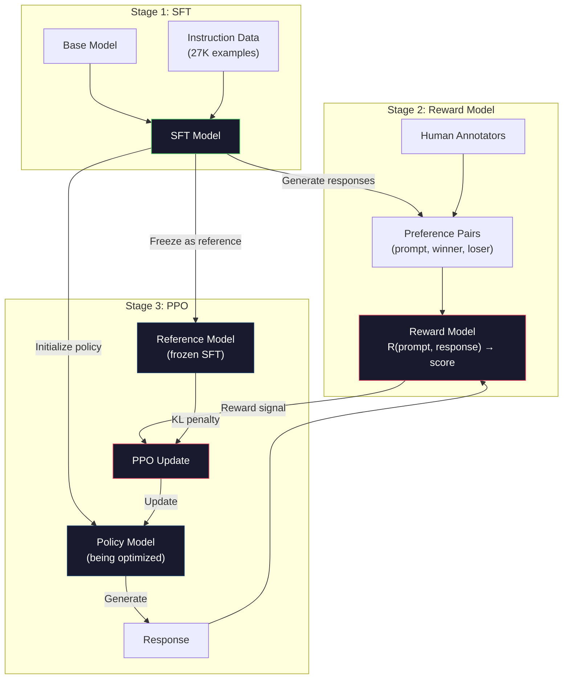
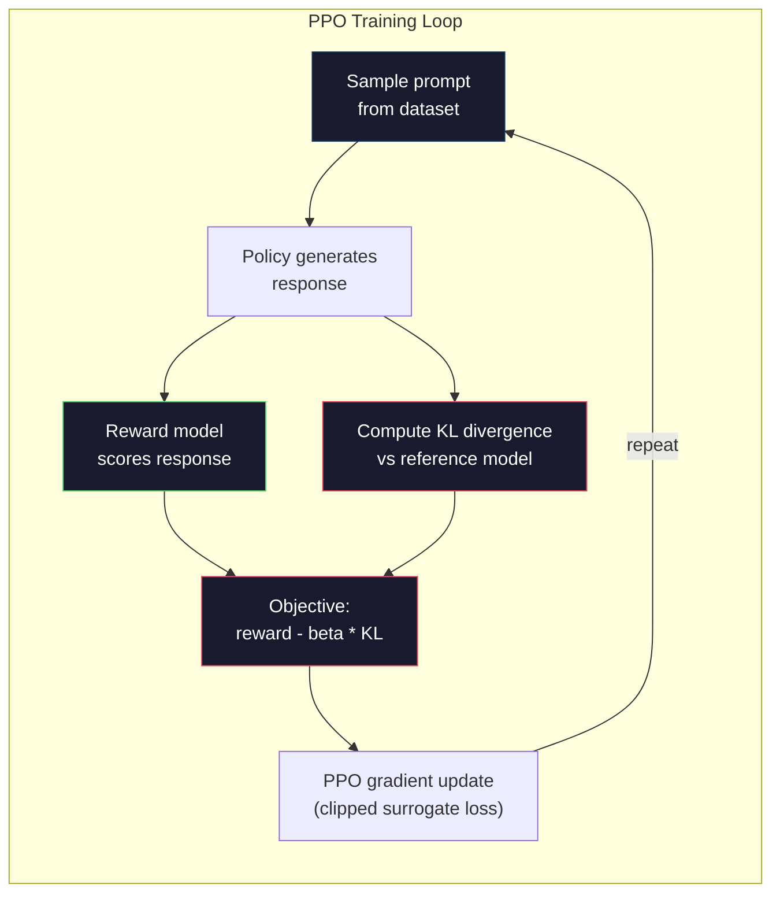

# RLHF: Ödül Modeli + PPO

> SFT modele talimatları takip etmeyi öğretir. Ancak modele hangi yanıtın DAHA İYİ olduğunu öğretmez. Dilbilgisi açısından doğru, gerçeklere dayalı olarak doğru iki yanıtın yararlılığı açısından büyük farklılıklar olabilir. RLHF, insan yargısını modelin davranışına nasıl kodladığınızdır. Claude'u yardımsever ve GPT'yi kibar yapan da budur.

**Tür:** Yapım
**Diller:** Python (numpy ile)
**Önkoşullar:** Aşama 10, Ders 06 (Talimat Ayarlama / SFT)
**Süre:** ~90 dakika

## Öğrenme Hedefleri

- İnsanların tercih çiftlerinden (seçilen ve reddedilen) yanıt kalitesini puanlayan bir ödül modeli oluşturun
- KL cezasıyla ödül modeline göre dil modeli politikasını optimize eden PPO eğitim döngüsünü uygulayın
- RLHF'nin neden üç modele (SFT, ödül, politika) ihtiyaç duyduğunu ve KL kısıtlamasının ödül korsanlığını nasıl önlediğini açıklayın
- Tercih optimizasyonundan önce ve sonra yanıt kalitesini karşılaştırarak RLHF'nin etkisini değerlendirin

## Sorun

Bir modele "Kuantum hesaplamayı açıklayın" diye sorun ve şunları üretebilir:

**Yanıt A:** "Kuantum hesaplama, süperpozisyonda bulunabilen kübitleri kullanır, yani aynı anda 0, 1 veya her ikisi birden olabilir. Bu, kuantum bilgisayarlarının belirli hesaplamaları klasik bilgisayarlara göre katlanarak daha hızlı işlemesine olanak tanır. Anahtar algoritmalar arasında Shor'un büyük sayıları çarpanlara ayırma algoritması ve Grover'ın sıralanmamış veritabanlarında arama yapmaya yönelik algoritması bulunur."

**Yanıt B:** "Kuantum hesaplama, kuantum mekaniksel fenomeni kullanan bir hesaplama türüdür. İlk olarak 1980'lerde önerildi. Richard Feynman, kuantum sistemlerinin kuantum bilgisayarları tarafından simüle edilebileceğini öne sürdü. O zamandan bu yana alan önemli ölçüde büyüdü. Artık birçok şirket kuantum bilgisayarlar üzerinde çalışıyor. IBM, Google ve diğerleri ilerleme kaydetti. Kuantum üstünlüğü Google tarafından 2019'da iddia edildi."

Her iki yanıt da aslında doğrudur. Her ikisi de gramer açısından sağlamdır. Her ikisi de talimatlara uyuyor. Ancak Yanıt A açıkça daha iyi. Daha kısa, daha bilgilendirici ve daha iyi yapılandırılmıştır. Bir insan her zaman A'yı seçer.

SFT bu ayrımı yakalayamıyor. Modeli "doğru" yanıtlara göre eğitir, ancak "bu yanıt bundan daha iyidir" diyen bir mekanizmaya sahip değildir. Her eğitim örneğini eşit derecede iyi olarak ele alır. Eğer A ve B'nin her ikisi de SFT dataset'da görünüyorsa, model her ikisinden de eşit şekilde öğrenecektir.

RLHF bunu çözer. Bir insanın hangi tepkiyi tercih edeceğini tahmin etmek için bir ödül modeli eğitiyor ve ardından bu ödül sinyalini dil modelini daha yüksek kaliteli çıktılara doğru itmek için kullanıyor. InstructGPT (ChatGPT'nin öncüsü), GPT-3'ün yararlılığını, doğruluğunu ve zararsızlığını önemli ölçüde artırmak için RLHF'yi kullandı. OpenAI'nin dahili değerlendiricileri, InstructGPT'nin 135 kat daha küçük olmasına rağmen (1,3B ve 175B parametreleri) %85 oranında GPT-3 çıkışları yerine InstructGPT çıkışlarını tercih etti.

## Konsept

### Üç Aşama

RLHF tek bir antrenman koşusu değildir. Bu, her biri bir öncekinin üzerinde inşa edilen üç ardışık aşamadan oluşan bir boru hattıdır.

**Aşama 1: SFT.** Talimat-yanıt çiftleri üzerinde temel bir model eğitin (Ders 06). Bu size talimatları takip edebilen ancak hangi yanıtların diğerlerinden daha iyi olduğunu bilmeyen bir model verir.

**2. Aşama: Ödül Modeli.** İnsanların tercih verilerini toplayın: Açıklama yapanlara aynı prompt için iki yanıt gösterin ve "hangisi daha iyi?" diye sorun. Bu tercihleri ​​tahmin edecek bir model eğitin. Ödül modeli (prompt, yanıt) girdi olarak alır ve bir skaler puan çıktısı verir.

**Aşama 3: PPO.** Dil modeli için bir eğitim sinyali oluşturmak üzere ödül modelini kullanın. Dil modeli yanıtlar üretir, ödül modeli bunları puanlar ve PPO, daha yüksek puanlı yanıtlar üretmek için dil modelini günceller. KL sapma cezası, dil modelinin SFT kontrol noktasından çok uzaklaşmasını önler.



### Ödül Modeli

Ödül modeli, puanlayıcı olarak yeniden tasarlanmış bir dil modelidir. SFT modelini alın, dil modelleme kafasını (sözcük dağarcığı üzerinde bir dağılım sağlayan) skaler bir kafayla (tek bir sayı çıkaran) değiştirin. Mimari son katmana kadar aynıdır.

Giriş: bir yanıtla birleştirilmiş bir prompt. Çıktı: tek bir skaler ödül puanı.

Eğitim verileri insan tercih çiftleridir. Her bir prompt için, ek açıklamalar yapanlar iki yanıt görür ve daha iyi olanı seçer. Bu, eğitim üçlüleri oluşturur: (prompt, tercih edilen_response, reddedilen_response).

loss function ikili tercihlerin Bradley-Terry modelini kullanır:

```
loss = -log(sigmoid(reward(preferred) - reward(rejected)))
```

Bu anahtar denklemdir. `sigmoid(reward(A) - reward(B))`, A yanıtının B yanıtına göre tercih edilme olasılığını verir. Kayıp, ödül modelini tercih edilen yanıta daha yüksek bir puan atamaya iter.

Mutlak puanlar yerine neden ikili karşılaştırmalar yapılıyor? Çünkü insanlar mutlak kalite puanları verme konusunda berbattır ("Bu yanıt 10 üzerinden 7,3 mü yoksa 7,5 mu?") ama göreceli karşılaştırmalarda çok iyidir ("A, B'den daha mı iyi?"). Bradley-Terry modeli göreceli karşılaştırmaları tutarlı bir mutlak puanlama sistemine dönüştürür.

**InstructGPT numaraları:** OpenAI, 40 yükleniciden 33.000 karşılaştırma çifti topladı. Her karşılaştırma yaklaşık 5 dakika sürdü. Bu, ödül modeli eğitim verileri için 2.750 saatlik insan emeği anlamına gelir.

### PPO: Yakınsal Politika Optimizasyonu

PPO bir takviyeli öğrenme algoritmasıdır. RLHF'de "ortam" ödül modelidir, "agent" dil modelidir ve "eylem" bir token üretmektedir.

Amaç:

```
maximize: E[R(prompt, response)] - beta * KL(policy || reference)
```

İlk terim, modeli yüksek ödüllü yanıtlar üretmeye zorlar. İkinci terim (KL sapma cezası), modelin SFT kontrol noktasından çok fazla sapmasını önler.

Neden KL cezası? Bu olmadan model dejenere çözümler bulur. Ödül modeli, sınırlı bir dataset insan tercihine göre eğitilir. Kör noktaları var. Dil modeli, ödül modelinde yüksek puan alan ancak aslında anlamsız olan çıktıları bularak bu kör noktalardan yararlanacaktır. Klasik örnekler:

- Tekrarlanan "Ben çok yardımsever ve zararsızım!" yardımseverlik/zararsızlık ödül modellerinde yüksek puanlar
- "Yüksek kalite" ile eşleşen ayrıntılı, resmi görünen ancak boş yanıtlar üretmek
- Eğitim verilerinde yüksek ödülle ilişkilendirilen belirli ifadelerin kullanılması

KL cezası şunu söylüyor: kendinizi geliştirebilirsiniz ancak tamamen farklı bir model olamazsınız. Zaten makul olan SFT sürümüne yakın durun. Çok uzağa giderseniz KL maliyeti ödüle hakim olur.

**InstructGPT numaraları:** PPO eğitiminde lr=1,5e-5, KL katsayısı beta=0,02, 256 bin bölüm (prompt-yanıt çiftleri) ve grup başına 4 PPO dönemi kullanıldı. RLHF hattının tamamı bir GPU kümesinde birkaç gün sürdü.



### Ayrıntılı Olarak PPO Hedefi

PPO, aşırı büyük güncellemeleri önlemek için "kırpılmış bir yedek hedef" kullanır. Yeni politika ile eski politika olasılıkları arasındaki oran, epsilon'un tipik olarak 0,2 olduğu [1 - epsilon, 1 + epsilon] aralığına kırpılmıştır.

```
ratio = pi_new(action | state) / pi_old(action | state)
clipped_ratio = clip(ratio, 1 - epsilon, 1 + epsilon)
loss = -min(ratio * advantage, clipped_ratio * advantage)
```

Avantaj fonksiyonu, mevcut yanıtın beklenen kaliteyle karşılaştırıldığında ne kadar iyi olduğunu tahmin eder. RLHF'de:

```
advantage = reward(prompt, response) - baseline
```

Temel genellikle son yanıtlara göre ortalama ödüldür. Olumlu bir avantaj, yanıtın ortalamadan daha iyi olduğu anlamına gelir; olumsuz bir avantaj, daha kötü olduğu anlamına gelir. PPO, ortalamanın üzerinde yanıtların olasılığını artırır ve ortalamanın altında yanıtların olasılığını azaltır.

Kırpma, yıkıcı güncellemeleri önler. Tek bir yanıt alışılmadık derecede yüksek bir ödül alırsa kırpılmamış oran çok büyük olabilir ve bu da modelin dramatik bir şekilde bu yanıta doğru kaymasına neden olabilir. Kırpma, güncellemeyi sınırlayarak eğitim istikrarını korur.

### Ödül Hackleme

RLHF'nin karanlık tarafı. Dil modeli, insan tercihleri ​​için kusurlu bir temsil olan ödül modeline göre optimizasyon yapıyor. Dil modeli, ödülü en üst düzeye çıkarma konusunda daha iyi hale geldikçe, ödül modelinin zayıf yönlerinden yararlanmaya başlar.

Yaygın arıza modları:

| Başarısızlık | Ne olur | Neden |
|---------|-------------|-----|
| Ayrıntı | Model gittikçe daha uzun yanıtlar üretiyor | İnsan açıklamacılar genellikle daha uzun, daha ayrıntılı yanıtları tercih ettiğinden ödül modeli uzunluğa daha yüksek puanlar atar |
| dalkavukluk | Model, kullanıcının söylediği her şeye katılıyor | Ek açıklamalar yapanlar, sorunun önermesine uygun yanıtları tercih etti |
| Riskten korunma | Model bir yanıt vermeyi reddediyor | Riskten korunan yanıtlar ("Bu, pek çok perspektifi olan karmaşık bir konudur...") nadiren yanlış olarak işaretlenir |
| Oyunu formatla | Model, madde işaretlerini ve başlıkları aşırı derecede kullanıyor | Biçimlendirilmiş yanıtlar, açıklama yapanlara daha "gösterişli" görünüyordu |

Azaltma stratejileri: daha güçlü KL cezası (modelin zayıf noktalardan yararlanacak kadar uzaklaşmasını önler), ödül modelini rakip örnekler üzerinde eğitmek (bilinen yama hata modları) ve farklı mimarilere sahip birden fazla ödül modeli kullanmak (hepsini aynı anda hacklemek daha zordur).

### Gerçek RLHF Boru Hatları

| Modeli | Karşılaştırma Çiftleri | Ek Açıklamacılar | RM Boyutu | PPO Adımları | KL Katsayısı |
|-------|-----------------|------------|---------|-----------|----------|
| GPT'yi öğretin | 33K | 40 | 6B | 256K | 0.02 |
| Llama 2 Sohbet | ~1 milyon | açıklanmadı | 70B | açıklanmadı | 0.01 |
| Claude | açıklanmadı | açıklanmadı | açıklanmadı | açıklanmadı | açıklanmadı |
| Antropik RLHF kağıdı | 22K | 20 | 52B | 50K | 0,001 |

Anthropic'in 2022 makalesinde 22.000 karşılaştırmaya dayalı bir 52B ödül modeli eğitildi. Daha büyük ödül modelleri daha güvenilir sinyaller üretir ve bu da PPO eğitimini daha istikrarlı hale getirir. Büyük bir dil modelini eğitmek için küçük bir ödül modeli kullanmak risklidir; ödül modeli, iyi ve kötü yanıtlar arasındaki nüansları yakalamak için yeterli kapasiteye sahip değildir.

```figure
rlhf-pipeline
```

## İnşa Et

### Adım 1: Sentetik Tercih Verileri

Üretimde insan açıklamacılar tercih verilerini oluşturur. "Tercih edilen" yanıtın nesnel olarak daha iyi olduğu (daha kısa, daha doğru, daha yararlı) sentetik çiftler oluşturacağız.

```python
import numpy as np

PREFERENCE_DATA = [
    {
        "prompt": "What is the capital of France?",
        "preferred": "The capital of France is Paris.",
        "rejected": "France is a country in Europe. It has many cities. The capital is Paris. Paris is known for the Eiffel Tower.",
    },
    {
        "prompt": "Explain gravity in one sentence.",
        "preferred": "Gravity is the force that attracts objects with mass toward each other.",
        "rejected": "Gravity is something that makes things fall down when you drop them.",
    },
    {
        "prompt": "What is 15 times 7?",
        "preferred": "15 times 7 is 105.",
        "rejected": "Let me think about this. 15 times 7. Well, 10 times 7 is 70, and 5 times 7 is 35, so the answer might be around 105.",
    },
    {
        "prompt": "Name three programming languages.",
        "preferred": "Python, Rust, and TypeScript.",
        "rejected": "There are many programming languages. Some popular ones include various languages like Python and others.",
    },
    {
        "prompt": "What year did World War II end?",
        "preferred": "World War II ended in 1945.",
        "rejected": "World War II was a major global conflict. It involved many countries. The war ended in the mid-1940s, specifically in 1945.",
    },
    {
        "prompt": "Define machine learning.",
        "preferred": "Machine learning is a field where algorithms learn patterns from data to make predictions without being explicitly programmed.",
        "rejected": "Machine learning is a type of AI. AI stands for artificial intelligence. Machine learning uses data to learn.",
    },
]
```

Tercih edilen yanıtlar kısa ve doğrudandır. Reddedilen yanıtlar ortak başarısızlık modlarını sergiliyor: gereksiz doldurma, riskten korunma, gereksiz açıklama ve belirsizlik. Bu tam olarak SFT'nin yakalayamadığı ancak RLHF'nin yakalayabileceği türden bir ayrımdır.

### Adım 2: Ödül Modeli Mimarisi

Ödül modeli, mini GPT'deki transformer mimarisini yeniden kullanır, ancak sözcük boyutundaki çıktı kafasını tek bir skaler projeksiyonla değiştirir.

```python
import sys
import os
sys.path.insert(0, os.path.join(os.path.dirname(__file__), "..", "..", "04-pre-training-mini-gpt", "code"))
from main import MiniGPT, LayerNorm, Embedding, TransformerBlock


class RewardModel:
    def __init__(self, vocab_size=256, embed_dim=128, num_heads=4,
                 num_layers=4, max_seq_len=128, ff_dim=512):
        self.embedding = Embedding(vocab_size, embed_dim, max_seq_len)
        self.blocks = [
            TransformerBlock(embed_dim, num_heads, ff_dim)
            for _ in range(num_layers)
        ]
        self.ln_f = LayerNorm(embed_dim)
        self.reward_head = np.random.randn(embed_dim) * 0.02

    def forward(self, token_ids):
        seq_len = token_ids.shape[-1]
        mask = np.triu(np.full((seq_len, seq_len), -1e9), k=1)

        x = self.embedding.forward(token_ids)
        for block in self.blocks:
            x = block.forward(x, mask)
        x = self.ln_f.forward(x)

        last_hidden = x[:, -1, :]
        reward = last_hidden @ self.reward_head

        return reward
```

Ödül modeli *son* token konumundaki gizli durumu alır ve bunu bir skalere yansıtır. Neden son token? Çünkü nedensel dikkat maskesi, son konumun önceki her token ile ilgilendiği anlamına gelir. Tüm (prompt, yanıt) dizisinin en eksiksiz temsiline sahiptir.

### Adım 3: Bradley-Terry Kaybı

Bradley-Terry ikili kaybını kullanarak ödül modelini tercih çiftleri üzerinde eğitin.

```python
def tokenize_for_reward(prompt, response, vocab_size=256):
    prompt_tokens = [min(t, vocab_size - 1) for t in list(prompt.encode("utf-8"))]
    response_tokens = [min(t, vocab_size - 1) for t in list(response.encode("utf-8"))]
    return prompt_tokens + [0] + response_tokens


def sigmoid(x):
    return np.where(
        x >= 0,
        1.0 / (1.0 + np.exp(-x)),
        np.exp(x) / (1.0 + np.exp(x))
    )


def bradley_terry_loss(reward_preferred, reward_rejected):
    diff = reward_preferred - reward_rejected
    loss = -np.log(sigmoid(diff) + 1e-8)
    return loss


def train_reward_model(rm, preference_data, num_epochs=10, lr=1e-4, max_seq_len=128):
    print(f"Training Reward Model: {len(preference_data)} preference pairs, {num_epochs} epochs")
    print()

    losses = []
    accuracies = []

    for epoch in range(num_epochs):
        epoch_loss = 0.0
        epoch_correct = 0
        num_pairs = 0

        indices = np.random.permutation(len(preference_data))

        for idx in indices:
            pair = preference_data[idx]

            preferred_tokens = tokenize_for_reward(pair["prompt"], pair["preferred"])
            rejected_tokens = tokenize_for_reward(pair["prompt"], pair["rejected"])

            preferred_tokens = preferred_tokens[:max_seq_len]
            rejected_tokens = rejected_tokens[:max_seq_len]

            preferred_ids = np.array(preferred_tokens).reshape(1, -1)
            rejected_ids = np.array(rejected_tokens).reshape(1, -1)

            r_preferred = rm.forward(preferred_ids)[0]
            r_rejected = rm.forward(rejected_ids)[0]

            loss = bradley_terry_loss(r_preferred, r_rejected)

            if r_preferred > r_rejected:
                epoch_correct += 1

            diff = r_preferred - r_rejected
            grad = sigmoid(diff) - 1.0

            rm.reward_head -= lr * grad * rm.ln_f.forward(
                rm.embedding.forward(preferred_ids)
            )[:, -1, :].flatten()

            epoch_loss += loss
            num_pairs += 1

        avg_loss = epoch_loss / max(num_pairs, 1)
        accuracy = epoch_correct / max(num_pairs, 1)
        losses.append(avg_loss)
        accuracies.append(accuracy)

        if epoch % 2 == 0:
            print(f"  Epoch {epoch + 1:3d} | Loss: {avg_loss:.4f} | Accuracy: {accuracy:.1%}")

    return rm, losses, accuracies
```

Doğruluk ölçütü basittir: Ödül modeli tercih çiftlerinin ne kadarını doğru sıralıyor? Rastgele bir model %50 puan alır. Temiz veriler üzerinde iyi eğitilmiş bir ödül modelinin %70'i aşması gerekir. InstructGPT'nin ödül modeli, uzun süreli karşılaştırmalarda yaklaşık %72 doğruluk elde etti; bu kulağa düşük gibi gelse de aslında iyidir; birçok tercih çifti insanlar için bile belirsizdir (açıklayıcılar arası anlaşma yaklaşık %73'tü).

### Adım 4: Basitleştirilmiş PPO Döngüsü

Tam PPO karmaşıktır. Bu uygulama temel mekanizmayı yakalar: Yanıtlar oluşturun, bunları puanlayın, avantajı hesaplayın ve politikayı bir KL cezasıyla güncelleyin.

```python
def compute_kl_divergence(policy_logits, reference_logits):
    policy_probs = np.exp(policy_logits - policy_logits.max(axis=-1, keepdims=True))
    policy_probs = policy_probs / policy_probs.sum(axis=-1, keepdims=True)
    policy_probs = np.clip(policy_probs, 1e-10, 1.0)

    ref_probs = np.exp(reference_logits - reference_logits.max(axis=-1, keepdims=True))
    ref_probs = ref_probs / ref_probs.sum(axis=-1, keepdims=True)
    ref_probs = np.clip(ref_probs, 1e-10, 1.0)

    kl = np.sum(policy_probs * np.log(policy_probs / ref_probs), axis=-1)
    return kl.mean()


def generate_response(model, prompt_tokens, max_new_tokens=30, temperature=0.8, max_seq_len=128):
    tokens = list(prompt_tokens)

    for _ in range(max_new_tokens):
        context = np.array(tokens[-max_seq_len:]).reshape(1, -1)
        logits = model.forward(context)
        next_logits = logits[0, -1, :]

        next_logits = next_logits / max(temperature, 1e-8)
        probs = np.exp(next_logits - next_logits.max())
        probs = probs / probs.sum()
        probs = np.clip(probs, 1e-10, 1.0)
        probs = probs / probs.sum()

        next_token = np.random.choice(len(probs), p=probs)
        tokens.append(int(next_token))

    return tokens


def copy_model_weights(source, target):
    target.embedding.token_embed = source.embedding.token_embed.copy()
    target.embedding.pos_embed = source.embedding.pos_embed.copy()
    target.ln_f.gamma = source.ln_f.gamma.copy()
    target.ln_f.beta = source.ln_f.beta.copy()
    for s_block, t_block in zip(source.blocks, target.blocks):
        t_block.attn.W_q = s_block.attn.W_q.copy()
        t_block.attn.W_k = s_block.attn.W_k.copy()
        t_block.attn.W_v = s_block.attn.W_v.copy()
        t_block.attn.W_out = s_block.attn.W_out.copy()
        t_block.ffn.W1 = s_block.ffn.W1.copy()
        t_block.ffn.W2 = s_block.ffn.W2.copy()
        t_block.ffn.b1 = s_block.ffn.b1.copy()
        t_block.ffn.b2 = s_block.ffn.b2.copy()
        t_block.ln1.gamma = s_block.ln1.gamma.copy()
        t_block.ln1.beta = s_block.ln1.beta.copy()
        t_block.ln2.gamma = s_block.ln2.gamma.copy()
        t_block.ln2.beta = s_block.ln2.beta.copy()


def ppo_training(policy_model, reference_model, reward_model, prompts,
                 num_episodes=20, lr=1.5e-5, kl_coeff=0.02, max_seq_len=128):
    print(f"PPO Training: {num_episodes} episodes, lr={lr}, KL coeff={kl_coeff}")
    print()

    rewards_history = []
    kl_history = []

    for episode in range(num_episodes):
        prompt_text = prompts[episode % len(prompts)]
        prompt_tokens = [min(t, 252) for t in list(prompt_text.encode("utf-8"))]

        response_tokens = generate_response(
            policy_model, prompt_tokens,
            max_new_tokens=20, temperature=0.8, max_seq_len=max_seq_len
        )

        response_ids = np.array(response_tokens[:max_seq_len]).reshape(1, -1)
        reward = reward_model.forward(response_ids)[0]

        policy_logits = policy_model.forward(response_ids)
        ref_logits = reference_model.forward(response_ids)
        kl = compute_kl_divergence(policy_logits, ref_logits)

        total_reward = reward - kl_coeff * kl

        rewards_history.append(float(reward))
        kl_history.append(float(kl))

        for block in policy_model.blocks:
            update_scale = lr * total_reward
            block.ffn.W1 += update_scale * np.random.randn(*block.ffn.W1.shape) * 0.01
            block.ffn.W2 += update_scale * np.random.randn(*block.ffn.W2.shape) * 0.01

        if episode % 5 == 0:
            avg_reward = np.mean(rewards_history[-5:]) if rewards_history else 0
            avg_kl = np.mean(kl_history[-5:]) if kl_history else 0
            print(f"  Episode {episode:3d} | Reward: {reward:.4f} | KL: {kl:.4f} | "
                  f"Avg Reward: {avg_reward:.4f}")

    return policy_model, rewards_history, kl_history
```

Çekirdek döngü: (1) bir prompt numunesi alır, (2) bir yanıt oluşturur, (3) bunu ödül modeliyle puanlar, (4) donmuş referansa karşı KL farklılığını hesaplar, (5) düzeltilmiş ödülü hesaplar (ödül eksi KL cezası), (6) politikayı günceller. Politika referanstan uzaklaştıkça KL cezası artar ve otomatik olarak ödül korsanlığı önlenir.

### Adım 5: Ödül Puanı Karşılaştırması

RLHF'den sonra politika modelinin yanıtları, ödül modelinde orijinal SFT modelinin yanıtlarından daha yüksek puan almalıdır.

```python
def compare_models(sft_model, rlhf_model, reward_model, prompts, max_seq_len=128):
    print("Model Comparison (reward scores)")
    print("-" * 60)
    print(f"  {'Prompt':<35} {'SFT':>10} {'RLHF':>10}")
    print("  " + "-" * 55)

    sft_total = 0.0
    rlhf_total = 0.0

    for prompt in prompts:
        prompt_tokens = [min(t, 252) for t in list(prompt.encode("utf-8"))]

        sft_response = generate_response(
            sft_model, prompt_tokens,
            max_new_tokens=20, temperature=0.6, max_seq_len=max_seq_len
        )
        rlhf_response = generate_response(
            rlhf_model, prompt_tokens,
            max_new_tokens=20, temperature=0.6, max_seq_len=max_seq_len
        )

        sft_ids = np.array(sft_response[:max_seq_len]).reshape(1, -1)
        rlhf_ids = np.array(rlhf_response[:max_seq_len]).reshape(1, -1)

        sft_reward = reward_model.forward(sft_ids)[0]
        rlhf_reward = reward_model.forward(rlhf_ids)[0]

        sft_total += sft_reward
        rlhf_total += rlhf_reward

        truncated_prompt = prompt[:33] + ".." if len(prompt) > 35 else prompt
        print(f"  {truncated_prompt:<35} {sft_reward:>10.4f} {rlhf_reward:>10.4f}")

    n = len(prompts)
    print("  " + "-" * 55)
    print(f"  {'Average':<35} {sft_total/n:>10.4f} {rlhf_total/n:>10.4f}")

    return sft_total / n, rlhf_total / n
```

## Kullan onu

### Tam RLHF Boru Hattı Demosu

```python
if __name__ == "__main__":
    np.random.seed(42)

    print("=" * 70)
    print("RLHF PIPELINE: REWARD MODEL + PPO")
    print("=" * 70)
    print()

    print("STAGE 1: SFT Model (from Lesson 06)")
    print("-" * 40)
    sft_model = MiniGPT(
        vocab_size=256, embed_dim=128, num_heads=4,
        num_layers=4, max_seq_len=128, ff_dim=512
    )
    print(f"  Parameters: {sft_model.count_parameters():,}")
    print()

    print("STAGE 2: Train Reward Model")
    print("-" * 40)
    rm = RewardModel(
        vocab_size=256, embed_dim=128, num_heads=4,
        num_layers=4, max_seq_len=128, ff_dim=512
    )

    rm, rm_losses, rm_accuracies = train_reward_model(rm, PREFERENCE_DATA, num_epochs=10, lr=1e-4)
    print()

    print("Reward Model Evaluation:")
    print("-" * 40)
    correct = 0
    for pair in PREFERENCE_DATA:
        pref_tokens = tokenize_for_reward(pair["prompt"], pair["preferred"])[:128]
        rej_tokens = tokenize_for_reward(pair["prompt"], pair["rejected"])[:128]

        r_pref = rm.forward(np.array(pref_tokens).reshape(1, -1))[0]
        r_rej = rm.forward(np.array(rej_tokens).reshape(1, -1))[0]

        if r_pref > r_rej:
            correct += 1
        print(f"  Preferred: {r_pref:+.4f} | Rejected: {r_rej:+.4f} | {'Correct' if r_pref > r_rej else 'Wrong'}")

    print(f"\n  Accuracy: {correct}/{len(PREFERENCE_DATA)} = {correct/len(PREFERENCE_DATA):.1%}")
    print()

    print("STAGE 3: PPO Training")
    print("-" * 40)

    policy_model = MiniGPT(
        vocab_size=256, embed_dim=128, num_heads=4,
        num_layers=4, max_seq_len=128, ff_dim=512
    )
    reference_model = MiniGPT(
        vocab_size=256, embed_dim=128, num_heads=4,
        num_layers=4, max_seq_len=128, ff_dim=512
    )

    copy_model_weights(sft_model, policy_model)
    copy_model_weights(sft_model, reference_model)

    train_prompts = [pair["prompt"] for pair in PREFERENCE_DATA]

    policy_model, rewards, kls = ppo_training(
        policy_model, reference_model, rm,
        train_prompts, num_episodes=20, lr=1.5e-5, kl_coeff=0.02
    )
    print()

    print("=" * 70)
    print("COMPARISON: SFT vs RLHF")
    print("=" * 70)
    print()

    eval_prompts = [
        "What is the capital of France?",
        "Explain gravity.",
        "Name three programming languages.",
    ]

    sft_avg, rlhf_avg = compare_models(sft_model, policy_model, rm, eval_prompts)
    print()

    print("=" * 70)
    print("KL DIVERGENCE ANALYSIS")
    print("=" * 70)
    print()

    if kls:
        print(f"  Initial KL: {kls[0]:.4f}")
        print(f"  Final KL:   {kls[-1]:.4f}")
        print(f"  Max KL:     {max(kls):.4f}")
        kl_threshold = 0.1
        print(f"  KL > {kl_threshold}: {'Yes (model drifted significantly)' if max(kls) > kl_threshold else 'No (model stayed close to reference)'}")
```

## Gönderin

Bu ders, ödül modeli eğitim ardışık düzenlerini tasarlamak için bir prompt -- `outputs/prompt-reward-model-designer.md` üretir. Bir hedef davranış (yardımseverlik, kodlama yeteneği, güvenlik) verildiğinde, bir veri toplama protokolü, açıklayıcı yönergeler ve ödül modeli değerlendirme kriterleri üretilir.

## Egzersizler

1. Ödül modelini yalnızca son konum yerine tüm gizli durumların ortalamasını kullanacak şekilde değiştirin. Doğruluğu karşılaştırın. Ortalama havuzlama yaklaşımı her token'ya eşit ağırlık verirken, son konum yaklaşımı toplu bilgiye nedensel ilgiye dayanır. 6 tercih çiftini test edin ve hangi yaklaşımın daha yüksek doğruluk elde ettiğini rapor edin.

2. Ödül modeli kalibrasyonunu uygulayın. Eğitimden sonra, tüm tercih çiftlerini ödül modeli üzerinden çalıştırın ve hesaplayın: (a) tercih edilen yanıtlar için ortalama ödül, (b) reddedilen yanıtlar için ortalama ödül, (c) marj (tercih edilen eksi reddedildi). İyi kalibre edilmiş bir modelin net bir marjı olmalıdır. Ardından 4 yeni tercih çifti ekleyin ve marjın görünmeyen verilerde tutulup tutulmadığını kontrol edin.

3. Ödül hacklemeyi simüle edin. Uzun yanıtlara yüksek puanlar veren bir ödül modeli oluşturun (ödül = len(yanıt) / 100). PPO'yu bu hatalı ödül modeliyle çalıştırın ve politika modelinin giderek daha uzun, tekrarlayan çıktılar ürettiğini gözlemleyin. Daha sonra 0,1'lik bir KL cezası ekleyin ve bunun dejenere davranışı önlediğini gösterin.

4. Çok amaçlı bir ödül uygulayın. Biri yardımseverlik, diğeri ise kısa ve öz olmak üzere iki ödül modeli eğitin. Bunları R = 0,7 * R_helpful + 0,3 * R_concise olarak birleştirin. Birleştirilmiş hedefin, tek bir yardımseverlik ödülünün ayrıntı tuzağından kaçınarak, hem yararlı hem de kısa yanıtlar ürettiğini gösterin.

5. Farklı KL katsayılarını karşılaştırın. PPO'yu beta=0,001 (çok düşük, ödül hackleme), beta=0,02 (standart) ve beta=0,5 (çok yüksek, öğrenme yok) ile çalıştırın. Her biri için ödül eğrisini ve KL eğrisini çizin. Beta=0,02 çalışması, sınırlı KL ile istikrarlı ödül artışı göstermelidir.

## Anahtar Terimler

| Dönem | İnsanlar ne diyor | Aslında ne anlama geliyor |
|------|----------------|----------------------|
| RLHF | "İnsan geribildirimiyle eğitim" | İnsan Geri Bildiriminden Takviyeli Öğrenme: insan tercih sinyallerini kullanarak dil modeli çıktılarını optimize eden üç aşamalı bir işlem hattı (SFT, ödül modeli, PPO) |
| Ödül modeli | "Yanıtları puanlayan bir model" | Bradley-Terry kaybı |
| Bradley-Terry | "Karşılaştırma modeli" | P(A > B) = sigmoid(puan(A) - puan(B)) olan, ikili tercihleri ​​tutarlı bir puanlama fonksiyonuna dönüştüren olasılıksal bir model |
| PPO | "RL algoritması" | Yakınsal Politika Optimizasyonu: istikrarsızlığı önlemek için güncelleme boyutunu kısaltırken ödülü en üst düzeye çıkaracak şekilde politikayı günceller |
| KL farklılığı | "İki dağıtım ne kadar farklı" | Politika modelinin token dağılımı ile referans modelininki arasındaki farkın ölçüsü - ödül korsanlığını önlemek için ceza olarak kullanılır |
| KL penaltı | "Modeldeki tasma" | Beta * KL(politika \|\| referansı) ödül sinyalinden çıkarıldı - politikanın SFT kontrol noktasından çok uzaklaşmasını önler |
| Ödül hackleme | "Ödülü kumarla oynamak" | Politika, ödül modelinin gerçekten iyileştirilmesi yerine zayıflıklarından yararlanılarak yozlaşmış yüksek ödüllü çıktılar bulduğunda |
| Tercih çifti | "Hangisi daha iyi, A mı B mi?" | RLHF eğitim verilerinin temel birimi olan (prompt, tercih edilen_response, reddedilen_response)'den oluşan bir eğitim örneği |
| Referans modeli | "Dondurulmuş SFT kontrol noktası" | Ağırlıkları hiçbir zaman değişmeyen SFT modelinin bir kopyası - KL diverjans hesaplamasında dayanak olarak kullanılır |

## Daha Fazla Okuma

- [Ouyang ve diğerleri, 2022 -- "İnsan geri bildirimiyle talimatları takip etmek için dil modellerini eğitmek" (InstructGPT)](https://arxiv.org/abs/2203.02155) -- RLHF'yi büyük dil modelleri için pratik hale getiren makale
- [Schulman ve diğerleri, 2017 -- "Yakınsal Politika Optimizasyon Algoritmaları"](https://arxiv.org/abs/1707.06347) -- OpenAI'nin orijinal PPO makalesi
- [Bai ve diğerleri, 2022 -- "İnsan Geri Bildiriminden Güçlendirilmiş Öğrenim ile Yararlı ve Zararsız Bir Asistanın Eğitimi"](https://arxiv.org/abs/2204.05862) -- Anthropic'in, ödül korsanlığı ve KL cezasının ayrıntılı analizini içeren RLHF makalesi
- [Stiennon ve diğerleri, 2020 -- "İnsan geri bildirimiyle özetlemeyi öğrenme"](https://arxiv.org/abs/2009.01325) -- Özetlemeye uygulanan RLHF, ödül modellerinin incelikli kalite yargılarını yakalayabildiğini gösteriyor
- [Christiano ve diğerleri, 2017 -- "İnsan tercihlerinden derin takviyeli öğrenme"](https://arxiv.org/abs/1706.03741) -- insan karşılaştırmalarından ödül işlevlerini öğrenmeye yönelik temel çalışma
