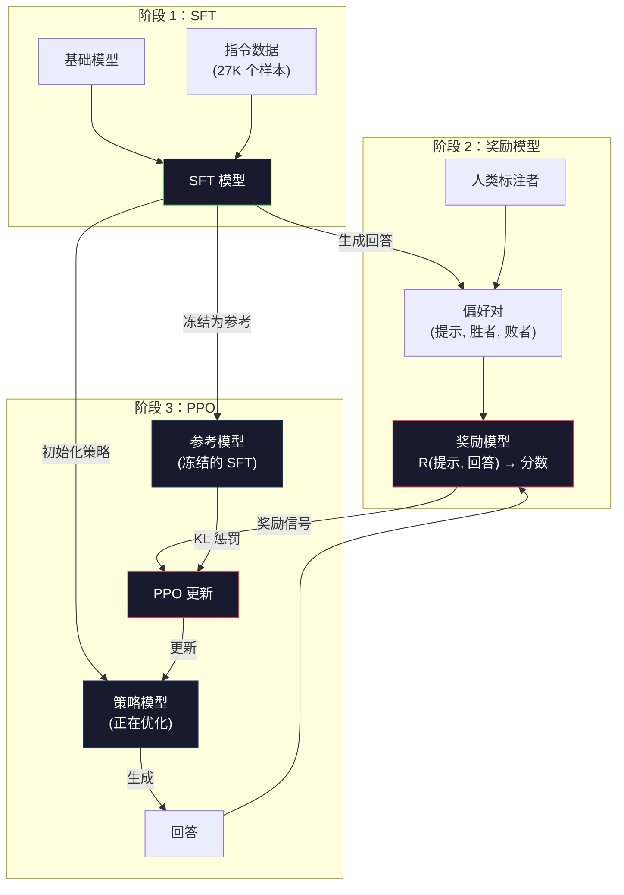
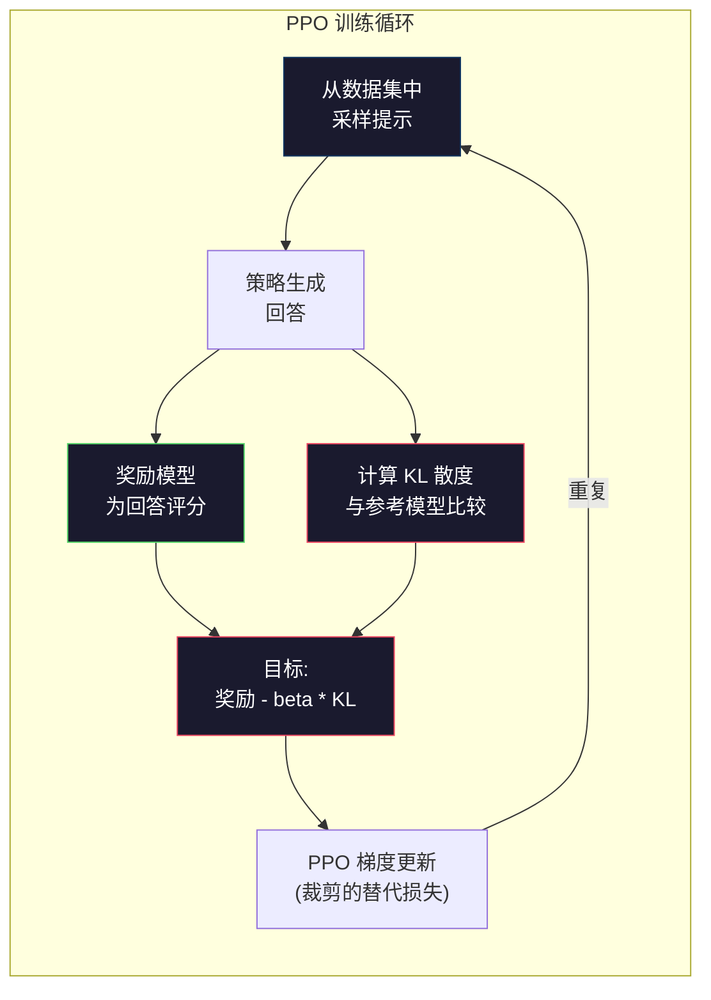

# RLHF：奖励模型 + PPO

> SFT 教会模型遵循指令。但它并未教会模型哪个回答"更好"。两个语法正确、事实准确的回答可能在有用性上存在巨大差异。RLHF 正是将人类判断编码进模型行为的方式。它让 Claude 变得有用，让 GPT 变得礼貌。

**类型：** 构建
**语言：** Python（使用 numpy）
**前置知识：** 阶段 10，第 06 课（指令微调 / SFT）
**时长：** ~90 分钟

## 学习目标

- 构建一个奖励模型，根据人类偏好对（优选 vs 拒绝）对回答质量进行评分
- 实现 PPO 训练循环，优化语言模型策略以对抗奖励模型，并施加 KL 惩罚
- 解释为什么 RLHF 需要三个模型（SFT、奖励、策略），以及 KL 约束如何防止奖励黑客攻击
- 通过比较偏好优化前后的回答质量，评估 RLHF 的效果

## 问题

让模型"解释量子计算"，它可能会产生：

**回答 A：**"量子计算使用可以处于叠加态的量子比特，这意味着它们可以同时是 0、1 或两者。这使得量子计算机在处理某些计算时比经典计算机快指数级。关键算法包括用于大数分解的肖尔算法和用于搜索无序数据库的格罗弗算法。"

**回答 B：**"量子计算是一种利用量子力学现象的计算类型。它最早在 20 世纪 80 年代提出。理查德·费曼建议量子系统可以通过量子计算机模拟。自那以后，该领域取得了显著发展。许多公司现在都在研发量子计算机。IBM、谷歌等公司取得了进展。量子霸权由谷歌在 2019 年宣称。"

两个回答都事实正确，语法正确，并遵循了指令。但回答 A 显然更好：更简洁、信息更丰富、结构更好。人类每次都会选择 A。

SFT 无法捕捉这种区别。它在"正确"的回答上训练模型，但没有机制说"这个回答比那个好"。它将每个训练样本视为同样好。如果 A 和 B 都出现在 SFT 数据集中，模型会从两者平等地学习。

RLHF 解决了这个问题。它训练一个奖励模型来预测人类会偏好哪个回答，然后使用该奖励信号将语言模型推向更高质量的输出。InstructGPT（ChatGPT 的前身）使用 RLHF 显著提高了 GPT-3 的有用性、真实性和无害性。OpenAI 的内部评估员在 85% 的情况下更喜欢 InstructGPT 的输出而非 GPT-3 的输出，尽管 InstructGPT 的参数量是 GPT-3 的 1/135（1.3B vs 175B 参数）。

## 概念

### 三个阶段

RLHF 不是一次单一的训练运行。它是一个由三个连续阶段组成的流水线，每个阶段都建立在前一个阶段之上。

**阶段 1：SFT。** 在指令-回答对（第 06 课）上训练一个基础模型。这会得到一个可以遵循指令但不知道哪些回答更好的模型。

**阶段 2：奖励模型。** 收集人类偏好数据：向标注者展示同一提示的两个回答，并询问"哪个更好？"训练一个模型来预测这些偏好。奖励模型以（提示、回答）为输入，输出一个标量分数。

**阶段 3：PPO。** 使用奖励模型为语言模型生成训练信号。语言模型生成回答，奖励模型为其评分，PPO 更新语言模型以产生更高得分的回答。KL 散度惩罚防止语言模型偏离 SFT 检查点太远。



### 奖励模型

奖励模型是一个被重新用作评分器的语言模型。取 SFT 模型，将语言建模头（输出词汇表上的分布）替换为标量头（输出单个数字）。架构一直到最后一层都是相同的。

输入：一个提示与回答的拼接。输出：一个标量奖励分数。

训练数据是人类偏好对。对于每个提示，标注者会看到两个回答，并选出更好的那个。这创建了三个一组的数据：(提示, 优选回答, 拒绝回答)。

损失函数使用成对偏好的 Bradley-Terry 模型：

```
loss = -log(sigmoid(reward(优选) - reward(拒绝)))
```

这是关键方程。`sigmoid(reward(A) - reward(B))` 给出回答 A 优于回答 B 的概率。损失推动奖励模型为优选回答分配更高的分数。

为什么使用成对比较而不是绝对分数？因为人类在分配绝对质量分数（"这个回答是 7.3 还是 7.5 分？"）方面非常糟糕，但在相对比较（"A 比 B 好吗？"）方面非常出色。Bradley-Terry 模型将相对比较转换为一个一致的绝对评分系统。

**InstructGPT 数据：** OpenAI 收集了来自 40 名承包商的 33,000 个比较对。每个比较大约需要 5 分钟。这相当于为奖励模型训练数据付出了 2,750 小时的劳动。

### PPO：近端策略优化

PPO 是一种强化学习算法。在 RLHF 中，"环境"是奖励模型，"智能体"是语言模型，"动作"是生成一个词元。

目标：

```
最大化: E[R(提示, 回答)] - beta * KL(策略 || 参考)
```

第一项推动模型生成高奖励的回答。第二项（KL 散度惩罚）防止模型偏离 SFT 检查点太远。

为什么需要 KL 惩罚？没有它，模型会找到退化解。奖励模型是在有限的人类偏好数据集上训练的。它有盲点。语言模型会利用这些盲点——找到在奖励模型上得分很高但实际上毫无意义的输出。经典例子：

- 重复"我非常有帮助且无害！"在有用性/无害性奖励模型上得分很高
- 生成冗长、正式但空洞的回答，这些回答模式匹配到"高质量"
- 利用那些恰好与训练数据中高奖励相关的特定短语

KL 惩罚说：你可以改进，但不能变成一个完全不同的模型。保持在 SFT 版本附近，它已经是合理的了。偏离太远，KL 成本就会压过奖励。

**InstructGPT 数据：** PPO 训练使用 lr=1.5e-5，KL 系数 beta=0.02，256K 个回合（提示-回答对），每批 4 个 PPO 周期。整个 RLHF 流水线在 GPU 集群上需要几天时间。



### 详细 PPO 目标

PPO 使用"裁剪的替代目标"来防止过大的更新。新策略与旧策略概率之比被裁剪到 [1 - epsilon, 1 + epsilon] 范围内，其中 epsilon 通常为 0.2。

```
ratio = pi_new(动作 | 状态) / pi_old(动作 | 状态)
clipped_ratio = clip(ratio, 1 - epsilon, 1 + epsilon)
loss = -min(ratio * advantage, clipped_ratio * advantage)
```

优势函数估计当前回答相对于预期质量好多少。在 RLHF 中：

```
advantage = reward(提示, 回答) - baseline
```

基线通常是近期回答的平均奖励。正优势意味着回答优于平均水平；负优势意味着更差。PPO 增加优于平均水平回答的概率，降低低于平均水平回答的概率。

裁剪防止灾难性更新。如果单个回答获得异常高的奖励，未裁剪的比率可能会非常大，导致模型急剧向该回答偏移。裁剪会限制更新幅度，保持训练稳定性。

### 奖励黑客攻击

RLHF 的阴暗面。语言模型正在针对奖励模型进行优化，而奖励模型是人类偏好的不完美代理。随着语言模型在最大化奖励方面变得更好，它开始利用奖励模型的弱点。

常见失败模式：

| 失败模式 | 发生情况 | 原因 |
|---------|----------|------|
| 冗长 | 模型产生越来越长的回答 | 人类标注者通常更喜欢更长、更详细的回答，因此奖励模型为长度分配更高的分数 |
| 奉承 | 模型同意用户所说的一切 | 标注者更喜欢同意问题前提的回答 |
| 回避 | 模型拒绝给出明确答案 | 回避的回答（"这是一个复杂的主题，有多个视角……"）很少被标记为错误 |
| 格式游戏 | 模型过度使用项目符号和标题 | 格式化的回答在标注者看来更"精致" |

缓解策略：更强的 KL 惩罚（防止模型偏离足够远以利用弱点），在对抗性样本上训练奖励模型（修补已知失败模式），以及使用不同架构的多个奖励模型（更难同时 hack）。

### 真实世界的 RLHF 流水线

| 模型 | 比较对 | 标注者 | RM 大小 | PPO 步数 | KL 系数 |
|-------|--------|--------|---------|---------|---------|
| InstructGPT | 33K | 40 | 6B | 256K | 0.02 |
| Llama 2 Chat | ~1M | 未公开 | 70B | 未公开 | 0.01 |
| Claude | 未公开 | 未公开 | 未公开 | 未公开 | 未公开 |
| Anthropic RLHF 论文 | 22K | 20 | 52B | 50K | 0.001 |

Anthropic 2022 年的论文在一个 22,000 个比较对的数据集上训练了一个 52B 的奖励模型。更大的奖励模型产生更可靠的信号，这使 PPO 训练更稳定。使用小的奖励模型来训练大的语言模型是有风险的——奖励模型没有足够的能力来捕捉好回答与坏回答之间的细微差别。

## 构建它

### 第 1 步：合成偏好数据

在生产环境中，人类标注者创建偏好数据。我们将创建合成对，其中"优选"回答在客观上更好（更简洁、更准确、更有帮助）。

```python
import numpy as np

PREFERENCE_DATA = [
    {
        "prompt": "What is the capital of France?",
        "preferred": "The capital of France is Paris.",
        "rejected": "France is a country in Europe. It has many cities. The capital is Paris. Paris is known for the Eiffel Tower.",
    },
    {
        "prompt": "Explain gravity in one sentence.",
        "preferred": "Gravity is the force that attracts objects with mass toward each other.",
        "rejected": "Gravity is something that makes things fall down when you drop them.",
    },
    {
        "prompt": "What is 15 times 7?",
        "preferred": "15 times 7 is 105.",
        "rejected": "Let me think about this. 15 times 7. Well, 10 times 7 is 70, and 5 times 7 is 35, so the answer might be around 105.",
    },
    {
        "prompt": "Name three programming languages.",
        "preferred": "Python, Rust, and TypeScript.",
        "rejected": "There are many programming languages. Some popular ones include various languages like Python and others.",
    },
    {
        "prompt": "What year did World War II end?",
        "preferred": "World War II ended in 1945.",
        "rejected": "World War II was a major global conflict. It involved many countries. The war ended in the mid-1940s, specifically in 1945.",
    },
    {
        "prompt": "Define machine learning.",
        "preferred": "Machine learning is a field where algorithms learn patterns from data to make predictions without being explicitly programmed.",
        "rejected": "Machine learning is a type of AI. AI stands for artificial intelligence. Machine learning uses data to learn.",
    },
]
```

优选回答简洁直接。拒绝回答展示了常见的失败模式：不必要的填充、回避、冗余解释和不精确。这正是 SFT 无法捕捉而 RLHF 可以捕捉的区别。

### 第 2 步：奖励模型架构

奖励模型复用 mini GPT 的 Transformer 架构，但将词汇表大小的输出头替换为单个标量投影。

```python
import sys
import os
sys.path.insert(0, os.path.join(os.path.dirname(__file__), "..", "..", "04-pre-training-mini-gpt", "code"))
from main import MiniGPT, LayerNorm, Embedding, TransformerBlock


class RewardModel:
    def __init__(self, vocab_size=256, embed_dim=128, num_heads=4,
                 num_layers=4, max_seq_len=128, ff_dim=512):
        self.embedding = Embedding(vocab_size, embed_dim, max_seq_len)
        self.blocks = [
            TransformerBlock(embed_dim, num_heads, ff_dim)
            for _ in range(num_layers)
        ]
        self.ln_f = LayerNorm(embed_dim)
        self.reward_head = np.random.randn(embed_dim) * 0.02

    def forward(self, token_ids):
        seq_len = token_ids.shape[-1]
        mask = np.triu(np.full((seq_len, seq_len), -1e9), k=1)

        x = self.embedding.forward(token_ids)
        for block in self.blocks:
            x = block.forward(x, mask)
        x = self.ln_f.forward(x)

        last_hidden = x[:, -1, :]
        reward = last_hidden @ self.reward_head

        return reward
```

奖励模型取*最后一个*词元位置的隐藏状态，并将其投影到一个标量。为什么是最后一个词元？因为因果注意力掩码意味着最后一个位置已经关注了所有前面的词元。它拥有整个（提示、回答）序列最完整的表示。

### 第 3 步：Bradley-Terry 损失

使用 Bradley-Terry 成对损失在偏好对上训练奖励模型。

```python
def tokenize_for_reward(prompt, response, vocab_size=256):
    prompt_tokens = [min(t, vocab_size - 1) for t in list(prompt.encode("utf-8"))]
    response_tokens = [min(t, vocab_size - 1) for t in list(response.encode("utf-8"))]
    return prompt_tokens + [0] + response_tokens


def sigmoid(x):
    return np.where(
        x >= 0,
        1.0 / (1.0 + np.exp(-x)),
        np.exp(x) / (1.0 + np.exp(x))
    )


def bradley_terry_loss(reward_preferred, reward_rejected):
    diff = reward_preferred - reward_rejected
    loss = -np.log(sigmoid(diff) + 1e-8)
    return loss


def train_reward_model(rm, preference_data, num_epochs=10, lr=1e-4, max_seq_len=128):
    print(f"Training Reward Model: {len