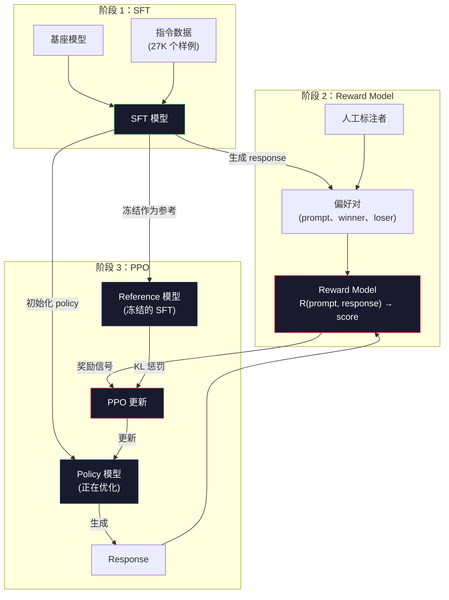
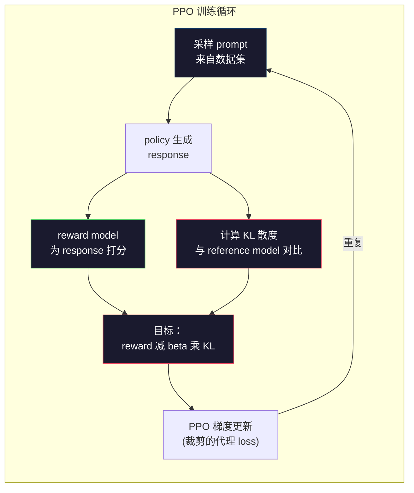

# RLHF：奖励模型 + PPO

> 译注：本文译自同目录 [`en.md`](./en.md)。术语遵循仓根 [TRANSLATION_GUIDE.md](../../../../TRANSLATION_GUIDE.md)。

> SFT 教会模型遵循指令，但它没有教会模型哪个回复**更好**。两个语法正确、事实准确的答案，在「有用性」上可能天差地别。RLHF 就是把人类判断编码进模型行为的方式，是 Claude 之所以乐于助人、GPT 之所以彬彬有礼的关键。

**Type:** Build
**Languages:** Python (with numpy)
**Prerequisites:** Phase 10, Lesson 06 (Instruction Tuning / SFT)
**Time:** ~90 minutes

## 学习目标（Learning Objectives）

- 构建一个奖励模型（reward model），从人类偏好对（chosen vs rejected）中学习给回复质量打分
- 实现 PPO 训练循环，在 KL 惩罚约束下，针对奖励模型优化语言模型 policy
- 解释为什么 RLHF 需要三个模型（SFT、reward、policy），以及 KL 约束如何防止 reward hacking
- 通过对比偏好优化前后的回复质量，评估 RLHF 的效果

## 问题（The Problem）

向模型提问 "Explain quantum computing"，可能得到这样两种回答：

**Response A：** "Quantum computing uses qubits that can exist in superposition, meaning they can be 0, 1, or both simultaneously. This allows quantum computers to process certain calculations exponentially faster than classical computers. Key algorithms include Shor's algorithm for factoring large numbers and Grover's algorithm for searching unsorted databases."

**Response B：** "Quantum computing is a type of computing that uses quantum mechanical phenomena. It was first proposed in the 1980s. Richard Feynman suggested that quantum systems could be simulated by quantum computers. The field has grown significantly since then. Many companies are now working on quantum computers. IBM, Google, and others have made progress. Quantum supremacy was claimed by Google in 2019."

两个回答都事实正确、语法通顺、都遵循了指令。但 Response A 显然更好：更简洁、信息量更大、结构更清晰。任何人类来选都会选 A。

SFT 抓不住这种区别。它在「正确」的回复上训练模型，但没有任何机制告诉模型「这条比那条好」。它把每个训练样本一视同仁。如果 A 和 B 同时出现在 SFT 数据集里，模型会平等地学这两个。

RLHF 解决了这个问题。它训练一个奖励模型来预测人类更偏好哪个回复，然后用这个奖励信号把语言模型推向更高质量的输出。InstructGPT（ChatGPT 的前身）用 RLHF 大幅提升了 GPT-3 的有用性、真实性和无害性。OpenAI 内部评估员在 85% 的情况下更喜欢 InstructGPT 的输出，尽管它比 GPT-3 小 135 倍（1.3B vs 175B 参数）。

## 概念（The Concept）

### 三个阶段（The Three Stages）

RLHF 不是单次训练，而是一条由三个串行阶段组成的流水线，每一阶段都建立在前一阶段之上。

**Stage 1：SFT。** 在指令-回复对上训练 base 模型（见 Lesson 06）。这给你一个能听懂指令、但不知道哪种回复更好的模型。

**Stage 2：Reward Model。** 收集人类偏好数据：给标注员同一 prompt 下的两个回复，问「哪个更好？」。训练一个模型来预测这些偏好。奖励模型的输入是 (prompt, response)，输出是一个标量分数。

**Stage 3：PPO。** 用奖励模型为语言模型生成训练信号。语言模型生成回复，奖励模型打分，PPO 更新语言模型，使其生成得分更高的回复。一个 KL 散度（KL divergence）惩罚项防止语言模型偏离 SFT checkpoint 太远。



### 奖励模型（The Reward Model）

奖励模型是一个被改造成打分器的语言模型。拿来 SFT 模型，把语言建模头（输出 vocabulary 上的分布）换成一个标量头（输出一个数字）。除了最后一层，架构完全一致。

输入：prompt 和 response 拼接起来。输出：一个标量奖励分数。

训练数据是人类偏好对。对每个 prompt，标注员看两个回复，挑出更好的那个。这就形成了训练三元组：(prompt, preferred_response, rejected_response)。

损失函数采用 Bradley-Terry 成对偏好模型：

```
loss = -log(sigmoid(reward(preferred) - reward(rejected)))
```

这是关键公式。`sigmoid(reward(A) - reward(B))` 给出 A 优于 B 的概率。损失会推动奖励模型给偏好回复打更高的分。

为什么用成对比较而不是绝对打分？因为人类极不擅长给绝对质量打分（「这个回复是 7.3 分还是 7.5 分？」），却非常擅长相对比较（「A 比 B 好吗？」）。Bradley-Terry 模型把相对比较转化为一致的绝对打分系统。

**InstructGPT 的数字：** OpenAI 从 40 个外包标注员那里收集了 33,000 对比较数据。每次比较大约耗时 5 分钟。也就是说，奖励模型的训练数据消耗了 2,750 小时的人力。

### PPO：Proximal Policy Optimization

PPO 是一种强化学习算法。在 RLHF 里，「环境」是奖励模型，「agent」是语言模型，「动作」是生成一个 token。

目标函数：

```
maximize: E[R(prompt, response)] - beta * KL(policy || reference)
```

第一项把模型推向高奖励回复。第二项（KL 散度惩罚）防止模型偏离 SFT checkpoint 太远。

为什么要 KL 惩罚？没有它，模型会找到退化解。奖励模型是在有限的人类偏好数据上训练的，存在盲点。语言模型会去钻这些盲点——找到那些在奖励模型上得高分、实际上却毫无意义的输出。经典案例：

- 反复说 "I'm so helpful and harmless!"，在「有用性/无害性」奖励模型上得高分
- 生成冗长、看似正式但内容空洞的回复，去匹配「高质量」的模式
- 钻特定短语的空子——这些短语在训练数据里恰好与高奖励相关

KL 惩罚说的是：你可以变得更好，但不能变成一个完全不同的模型。要靠近 SFT 版本，那已经够好了。走得太远，KL 代价就会盖过奖励。

**InstructGPT 的数字：** PPO 训练用 lr=1.5e-5，KL 系数 beta=0.02，256K 个 episode（prompt-response 对），每个 batch 训 4 个 PPO epoch。整条 RLHF 流水线在一个 GPU 集群上跑了好几天。



### PPO 目标函数细节（The PPO Objective in Detail）

PPO 用一个「clipped surrogate objective（裁剪代理目标）」来防止过大的更新。新 policy 与旧 policy 概率之比被裁剪到 [1 - epsilon, 1 + epsilon] 区间，epsilon 通常取 0.2。

```
ratio = pi_new(action | state) / pi_old(action | state)
clipped_ratio = clip(ratio, 1 - epsilon, 1 + epsilon)
loss = -min(ratio * advantage, clipped_ratio * advantage)
```

advantage（优势）函数估计当前回复比期望质量好多少。在 RLHF 里：

```
advantage = reward(prompt, response) - baseline
```

baseline（基线）通常是近期回复的平均奖励。正 advantage 表示该回复优于平均；负 advantage 表示低于平均。PPO 提高高于平均的回复的概率，降低低于平均的回复的概率。

裁剪防止灾难性更新。如果某个回复拿到一个异常高的奖励，未裁剪的 ratio 可能非常大，导致模型剧烈偏向那个回复。裁剪给更新设了上限，维持训练稳定。

### Reward Hacking（奖励作弊）

RLHF 的阴暗面。语言模型在针对奖励模型做优化，而后者只是人类偏好的不完美代理。当语言模型越来越擅长最大化奖励时，它开始钻奖励模型的弱点。

常见的失败模式：

| 失败模式 | 现象 | 原因 |
|---------|-------------|-----|
| Verbosity（啰嗦） | 模型生成越来越长的回复 | 人类标注员往往偏好更长、更详细的回复，于是奖励模型把长度也当成高分信号 |
| Sycophancy（谄媚） | 模型对用户说的一切都点头称是 | 标注员偏好同意问题前提的回复 |
| Hedging（打太极） | 模型拒绝给出明确答案 | 打太极的回复（"This is a complex topic with many perspectives..."）很少被标错 |
| Format gaming（格式炫技） | 模型滥用项目符号和标题 | 格式化的回复对标注员看起来更「精致」 |

缓解策略：加大 KL 惩罚（防止模型走远到能钻空子）；用对抗样本训练奖励模型（修补已知失败模式）；用多个不同架构的奖励模型（同时骗过所有人更难）。

### 真实的 RLHF 流水线（Real RLHF Pipelines）

| 模型 | 比较对数量 | 标注员数量 | RM 大小 | PPO 步数 | KL 系数 |
|-------|-----------------|------------|---------|-----------|----------|
| InstructGPT | 33K | 40 | 6B | 256K | 0.02 |
| Llama 2 Chat | ~1M | 未公开 | 70B | 未公开 | 0.01 |
| Claude | 未公开 | 未公开 | 未公开 | 未公开 | 未公开 |
| Anthropic RLHF paper | 22K | 20 | 52B | 50K | 0.001 |

Anthropic 2022 年的论文用 22,000 对比较训练了一个 52B 的奖励模型。更大的奖励模型给出更可靠的信号，让 PPO 训练更稳。用小奖励模型去训练大语言模型很危险——奖励模型容量不够，捕捉不到「好坏回复」之间的细微差别。

## 动手实现（Build It）

### Step 1：合成偏好数据（Synthetic Preference Data）

生产环境里，由人类标注员制作偏好数据。我们这里造一些合成对，其中「preferred」回复客观上更好（更简洁、更准确、更有用）。

```python
import numpy as np

PREFERENCE_DATA = [
    {
        "prompt": "What is the capital of France?",
        "preferred": "The capital of France is Paris.",
        "rejected": "France is a country in Europe. It has many cities. The capital is Paris. Paris is known for the Eiffel Tower.",
    },
    {
        "prompt": "Explain gravity in one sentence.",
        "preferred": "Gravity is the force that attracts objects with mass toward each other.",
        "rejected": "Gravity is something that makes things fall down when you drop them.",
    },
    {
        "prompt": "What is 15 times 7?",
        "preferred": "15 times 7 is 105.",
        "rejected": "Let me think about this. 15 times 7. Well, 10 times 7 is 70, and 5 times 7 is 35, so the answer might be around 105.",
    },
    {
        "prompt": "Name three programming languages.",
        "preferred": "Python, Rust, and TypeScript.",
        "rejected": "There are many programming languages. Some popular ones include various languages like Python and others.",
    },
    {
        "prompt": "What year did World War II end?",
        "preferred": "World War II ended in 1945.",
        "rejected": "World War II was a major global conflict. It involved many countries. The war ended in the mid-1940s, specifically in 1945.",
    },
    {
        "prompt": "Define machine learning.",
        "preferred": "Machine learning is a field where algorithms learn patterns from data to make predictions without being explicitly programmed.",
        "rejected": "Machine learning is a type of AI. AI stands for artificial intelligence. Machine learning uses data to learn.",
    },
]
```

preferred 回复简洁直接。rejected 回复展现了常见的失败模式：无谓的注水、打太极、冗余的解释、不精确。这正是 SFT 抓不住、RLHF 能抓住的那种区别。

### Step 2：奖励模型架构（Reward Model Architecture）

奖励模型复用 mini GPT 里的 transformer 架构，但把 vocabulary 大小的输出头换成单个标量投影。

```python
import sys
import os
sys.path.insert(0, os.path.join(os.path.dirname(__file__), "..", "..", "04-pre-training-mini-gpt", "code"))
from main import MiniGPT, LayerNorm, Embedding, TransformerBlock


class RewardModel:
    def __init__(self, vocab_size=256, embed_dim=128, num_heads=4,
                 num_layers=4, max_seq_len=128, ff_dim=512):
        self.embedding = Embedding(vocab_size, embed_dim, max_seq_len)
        self.blocks = [
            TransformerBlock(embed_dim, num_heads, ff_dim)
            for _ in range(num_layers)
        ]
        self.ln_f = LayerNorm(embed_dim)
        self.reward_head = np.random.randn(embed_dim) * 0.02

    def forward(self, token_ids):
        seq_len = token_ids.shape[-1]
        mask = np.triu(np.full((seq_len, seq_len), -1e9), k=1)

        x = self.embedding.forward(token_ids)
        for block in self.blocks:
            x = block.forward(x, mask)
        x = self.ln_f.forward(x)

        last_hidden = x[:, -1, :]
        reward = last_hidden @ self.reward_head

        return reward
```

奖励模型取**最后一个** token 位置的 hidden state，投影成标量。为什么用最后一个 token？因为因果 attention mask 决定了最后位置已经 attend 过此前所有 token，它对整个 (prompt, response) 序列拥有最完整的表示。

### Step 3：Bradley-Terry Loss

用 Bradley-Terry 成对损失在偏好对上训练奖励模型。

```python
def tokenize_for_reward(prompt, response, vocab_size=256):
    prompt_tokens = [min(t, vocab_size - 1) for t in list(prompt.encode("utf-8"))]
    response_tokens = [min(t, vocab_size - 1) for t in list(response.encode("utf-8"))]
    return prompt_tokens + [0] + response_tokens


def sigmoid(x):
    return np.where(
        x >= 0,
        1.0 / (1.0 + np.exp(-x)),
        np.exp(x) / (1.0 + np.exp(x))
    )


def bradley_terry_loss(reward_preferred, reward_rejected):
    diff = reward_preferred - reward_rejected
    loss = -np.log(sigmoid(diff) + 1e-8)
    return loss


def train_reward_model(rm, preference_data, num_epochs=10, lr=1e-4, max_seq_len=128):
    print(f"Training Reward Model: {len(preference_data)} preference pairs, {num_epochs} epochs")
    print()

    losses = []
    accuracies = []

    for epoch in range(num_epochs):
        epoch_loss = 0.0
        epoch_correct = 0
        num_pairs = 0

        indices = np.random.permutation(len(preference_data))

        for idx in indices:
            pair = preference_data[idx]

            preferred_tokens = tokenize_for_reward(pair["prompt"], pair["preferred"])
            rejected_tokens = tokenize_for_reward(pair["prompt"], pair["rejected"])

            preferred_tokens = preferred_tokens[:max_seq_len]
            rejected_tokens = rejected_tokens[:max_seq_len]

            preferred_ids = np.array(preferred_tokens).reshape(1, -1)
            rejected_ids = np.array(rejected_tokens).reshape(1, -1)

            r_preferred = rm.forward(preferred_ids)[0]
            r_rejected = rm.forward(rejected_ids)[0]

            loss = bradley_terry_loss(r_preferred, r_rejected)

            if r_preferred > r_rejected:
                epoch_correct += 1

            diff = r_preferred - r_rejected
            grad = sigmoid(diff) - 1.0

            rm.reward_head -= lr * grad * rm.ln_f.forward(
                rm.embedding.forward(preferred_ids)
            )[:, -1, :].flatten()

            epoch_loss += loss
            num_pairs += 1

        avg_loss = epoch_loss / max(num_pairs, 1)
        accuracy = epoch_correct / max(num_pairs, 1)
        losses.append(avg_loss)
        accuracies.append(accuracy)

        if epoch % 2 == 0:
            print(f"  Epoch {epoch + 1:3d} | Loss: {avg_loss:.4f} | Accuracy: {accuracy:.1%}")

    return rm, losses, accuracies
```

准确率（accuracy）指标很直白：奖励模型对偏好对的排序正确率。随机模型是 50%。在干净数据上训练良好的奖励模型应该超过 70%。InstructGPT 的奖励模型在留出比较集上达到约 72% 准确率——听起来不高，其实很不错，因为很多偏好对连人类都觉得模糊（标注员之间的一致率只有约 73%）。

### Step 4：简化版 PPO 循环（Simplified PPO Loop）

完整 PPO 很复杂。下面这个实现抓住了核心机制：生成回复、打分、计算 advantage，并在 KL 惩罚下更新 policy。

```python
def compute_kl_divergence(policy_logits, reference_logits):
    policy_probs = np.exp(policy_logits - policy_logits.max(axis=-1, keepdims=True))
    policy_probs = policy_probs / policy_probs.sum(axis=-1, keepdims=True)
    policy_probs = np.clip(policy_probs, 1e-10, 1.0)

    ref_probs = np.exp(reference_logits - reference_logits.max(axis=-1, keepdims=True))
    ref_probs = ref_probs / ref_probs.sum(axis=-1, keepdims=True)
    ref_probs = np.clip(ref_probs, 1e-10, 1.0)

    kl = np.sum(policy_probs * np.log(policy_probs / ref_probs), axis=-1)
    return kl.mean()


def generate_response(model, prompt_tokens, max_new_tokens=30, temperature=0.8, max_seq_len=128):
    tokens = list(prompt_tokens)

    for _ in range(max_new_tokens):
        context = np.array(tokens[-max_seq_len:]).reshape(1, -1)
        logits = model.forward(context)
        next_logits = logits[0, -1, :]

        next_logits = next_logits / max(temperature, 1e-8)
        probs = np.exp(next_logits - next_logits.max())
        probs = probs / probs.sum()
        probs = np.clip(probs, 1e-10, 1.0)
        probs = probs / probs.sum()

        next_token = np.random.choice(len(probs), p=probs)
        tokens.append(int(next_token))

    return tokens


def copy_model_weights(source, target):
    target.embedding.token_embed = source.embedding.token_embed.copy()
    target.embedding.pos_embed = source.embedding.pos_embed.copy()
    target.ln_f.gamma = source.ln_f.gamma.copy()
    target.ln_f.beta = source.ln_f.beta.copy()
    for s_block, t_block in zip(source.blocks, target.blocks):
        t_block.attn.W_q = s_block.attn.W_q.copy()
        t_block.attn.W_k = s_block.attn.W_k.copy()
        t_block.attn.W_v = s_block.attn.W_v.copy()
        t_block.attn.W_out = s_block.attn.W_out.copy()
        t_block.ffn.W1 = s_block.ffn.W1.copy()
        t_block.ffn.W2 = s_block.ffn.W2.copy()
        t_block.ffn.b1 = s_block.ffn.b1.copy()
        t_block.ffn.b2 = s_block.ffn.b2.copy()
        t_block.ln1.gamma = s_block.ln1.gamma.copy()
        t_block.ln1.beta = s_block.ln1.beta.copy()
        t_block.ln2.gamma = s_block.ln2.gamma.copy()
        t_block.ln2.beta = s_block.ln2.beta.copy()


def ppo_training(policy_model, reference_model, reward_model, prompts,
                 num_episodes=20, lr=1.5e-5, kl_coeff=0.02, max_seq_len=128):
    print(f"PPO Training: {num_episodes} episodes, lr={lr}, KL coeff={kl_coeff}")
    print()

    rewards_history = []
    kl_history = []

    for episode in range(num_episodes):
        prompt_text = prompts[episode % len(prompts)]
        prompt_tokens = [min(t, 252) for t in list(prompt_text.encode("utf-8"))]

        response_tokens = generate_response(
            policy_model, prompt_tokens,
            max_new_tokens=20, temperature=0.8, max_seq_len=max_seq_len
        )

        response_ids = np.array(response_tokens[:max_seq_len]).reshape(1, -1)
        reward = reward_model.forward(response_ids)[0]

        policy_logits = policy_model.forward(response_ids)
        ref_logits = reference_model.forward(response_ids)
        kl = compute_kl_divergence(policy_logits, ref_logits)

        total_reward = reward - kl_coeff * kl

        rewards_history.append(float(reward))
        kl_history.append(float(kl))

        for block in policy_model.blocks:
            update_scale = lr * total_reward
            block.ffn.W1 += update_scale * np.random.randn(*block.ffn.W1.shape) * 0.01
            block.ffn.W2 += update_scale * np.random.randn(*block.ffn.W2.shape) * 0.01

        if episode % 5 == 0:
            avg_reward = np.mean(rewards_history[-5:]) if rewards_history else 0
            avg_kl = np.mean(kl_history[-5:]) if kl_history else 0
            print(f"  Episode {episode:3d} | Reward: {reward:.4f} | KL: {kl:.4f} | "
                  f"Avg Reward: {avg_reward:.4f}")

    return policy_model, rewards_history, kl_history
```

核心循环：(1) 采一个 prompt，(2) 生成回复，(3) 用奖励模型打分，(4) 对照冻结的 reference 模型计算 KL 散度，(5) 算出调整后的奖励（reward 减去 KL 惩罚），(6) 更新 policy。policy 偏离 reference 越远，KL 惩罚越大，自动防住 reward hacking。

### Step 5：奖励分数对比（Reward Score Comparison）

经过 RLHF，policy 模型的回复在奖励模型上的得分应该高于原始 SFT 模型的回复。

```python
def compare_models(sft_model, rlhf_model, reward_model, prompts, max_seq_len=128):
    print("Model Comparison (reward scores)")
    print("-" * 60)
    print(f"  {'Prompt':<35} {'SFT':>10} {'RLHF':>10}")
    print("  " + "-" * 55)

    sft_total = 0.0
    rlhf_total = 0.0

    for prompt in prompts:
        prompt_tokens = [min(t, 252) for t in list(prompt.encode("utf-8"))]

        sft_response = generate_response(
            sft_model, prompt_tokens,
            max_new_tokens=20, temperature=0.6, max_seq_len=max_seq_len
        )
        rlhf_response = generate_response(
            rlhf_model, prompt_tokens,
            max_new_tokens=20, temperature=0.6, max_seq_len=max_seq_len
        )

        sft_ids = np.array(sft_response[:max_seq_len]).reshape(1, -1)
        rlhf_ids = np.array(rlhf_response[:max_seq_len]).reshape(1, -1)

        sft_reward = reward_model.forward(sft_ids)[0]
        rlhf_reward = reward_model.forward(rlhf_ids)[0]

        sft_total += sft_reward
        rlhf_total += rlhf_reward

        truncated_prompt = prompt[:33] + ".." if len(prompt) > 35 else prompt
        print(f"  {truncated_prompt:<35} {sft_reward:>10.4f} {rlhf_reward:>10.4f}")

    n = len(prompts)
    print("  " + "-" * 55)
    print(f"  {'Average':<35} {sft_total/n:>10.4f} {rlhf_total/n:>10.4f}")

    return sft_total / n, rlhf_total / n
```

## 用起来（Use It）

### 完整 RLHF 流水线 demo（Full RLHF Pipeline Demo）

```python
if __name__ == "__main__":
    np.random.seed(42)

    print("=" * 70)
    print("RLHF PIPELINE: REWARD MODEL + PPO")
    print("=" * 70)
    print()

    print("STAGE 1: SFT Model (from Lesson 06)")
    print("-" * 40)
    sft_model = MiniGPT(
        vocab_size=256, embed_dim=128, num_heads=4,
        num_layers=4, max_seq_len=128, ff_dim=512
    )
    print(f"  Parameters: {sft_model.count_parameters():,}")
    print()

    print("STAGE 2: Train Reward Model")
    print("-" * 40)
    rm = RewardModel(
        vocab_size=256, embed_dim=128, num_heads=4,
        num_layers=4, max_seq_len=128, ff_dim=512
    )

    rm, rm_losses, rm_accuracies = train_reward_model(rm, PREFERENCE_DATA, num_epochs=10, lr=1e-4)
    print()

    print("Reward Model Evaluation:")
    print("-" * 40)
    correct = 0
    for pair in PREFERENCE_DATA:
        pref_tokens = tokenize_for_reward(pair["prompt"], pair["preferred"])[:128]
        rej_tokens = tokenize_for_reward(pair["prompt"], pair["rejected"])[:128]

        r_pref = rm.forward(np.array(pref_tokens).reshape(1, -1))[0]
        r_rej = rm.forward(np.array(rej_tokens).reshape(1, -1))[0]

        if r_pref > r_rej:
            correct += 1
        print(f"  Preferred: {r_pref:+.4f} | Rejected: {r_rej:+.4f} | {'Correct' if r_pref > r_rej else 'Wrong'}")

    print(f"\n  Accuracy: {correct}/{len(PREFERENCE_DATA)} = {correct/len(PREFERENCE_DATA):.1%}")
    print()

    print("STAGE 3: PPO Training")
    print("-" * 40)

    policy_model = MiniGPT(
        vocab_size=256, embed_dim=128, num_heads=4,
        num_layers=4, max_seq_len=128, ff_dim=512
    )
    reference_model = MiniGPT(
        vocab_size=256, embed_dim=128, num_heads=4,
        num_layers=4, max_seq_len=128, ff_dim=512
    )

    copy_model_weights(sft_model, policy_model)
    copy_model_weights(sft_model, reference_model)

    train_prompts = [pair["prompt"] for pair in PREFERENCE_DATA]

    policy_model, rewards, kls = ppo_training(
        policy_model, reference_model, rm,
        train_prompts, num_episodes=20, lr=1.5e-5, kl_coeff=0.02
    )
    print()

    print("=" * 70)
    print("COMPARISON: SFT vs RLHF")
    print("=" * 70)
    print()

    eval_prompts = [
        "What is the capital of France?",
        "Explain gravity.",
        "Name three programming languages.",
    ]

    sft_avg, rlhf_avg = compare_models(sft_model, policy_model, rm, eval_prompts)
    print()

    print("=" * 70)
    print("KL DIVERGENCE ANALYSIS")
    print("=" * 70)
    print()

    if kls:
        print(f"  Initial KL: {kls[0]:.4f}")
        print(f"  Final KL:   {kls[-1]:.4f}")
        print(f"  Max KL:     {max(kls):.4f}")
        kl_threshold = 0.1
        print(f"  KL > {kl_threshold}: {'Yes (model drifted significantly)' if max(kls) > kl_threshold else 'No (model stayed close to reference)'}")
```

## 上线部署（Ship It）

本课产出 `outputs/prompt-reward-model-designer.md`——一个用于设计奖励模型训练流水线的 prompt。给定一个目标行为（有用性、编码能力、安全性），它会生成一份数据收集协议、标注员指南，以及奖励模型评估标准。

## 练习（Exercises）

1. 修改奖励模型，让它使用所有 hidden states 的均值，而不是只取最后位置。对比准确率。mean pooling 方式给每个 token 等权重，而 last-position 方式依赖因果 attention 来聚合信息。在这 6 对偏好数据上测试，看哪种方式准确率更高。

2. 实现奖励模型校准（calibration）。训练完成后，把所有偏好对跑一遍奖励模型，计算：(a) preferred 回复的平均奖励；(b) rejected 回复的平均奖励；(c) margin（preferred 减 rejected）。校准良好的模型应该有清晰的 margin。然后再加 4 对新的偏好数据，看 margin 在没见过的数据上是否成立。

3. 模拟 reward hacking。造一个对长回复打高分的奖励模型（reward = len(response) / 100）。用这个有缺陷的奖励模型跑 PPO，观察 policy 模型生成越来越长、越来越重复的输出。再加一个 0.1 的 KL 惩罚，证明它能阻止退化行为。

4. 实现多目标奖励。训练两个奖励模型——一个面向有用性，一个面向简洁性。组合为 R = 0.7 * R_helpful + 0.3 * R_concise。证明这个组合目标产生的回复既有用又简洁，避开单一有用性奖励的「啰嗦陷阱」。

5. 对比不同 KL 系数。用 beta=0.001（太低，reward hacking）、beta=0.02（标准）和 beta=0.5（太高，学不动）分别跑 PPO。画出每组的奖励曲线和 KL 曲线。beta=0.02 的那组应当呈现稳定上升的奖励，且 KL 有界。

## 关键术语（Key Terms）

| 术语 | 大家是怎么说的 | 它实际是什么 |
|------|----------------|----------------------|
| RLHF | "用人类反馈训练" | Reinforcement Learning from Human Feedback：一条三阶段流水线（SFT、奖励模型、PPO），用人类偏好信号优化语言模型输出 |
| Reward model | "给回复打分的模型" | 一个带标量输出头的 transformer，用 Bradley-Terry 损失在成对人类偏好上训练 |
| Bradley-Terry | "比较模型" | 一个概率模型，P(A > B) = sigmoid(score(A) - score(B))，把成对偏好转成一致的打分函数 |
| PPO | "RL 算法" | Proximal Policy Optimization：在裁剪更新幅度防止不稳定的同时，更新 policy 以最大化奖励 |
| KL divergence | "两个分布有多不同" | policy 模型 token 分布与 reference 模型 token 分布之间的差异度量——用作惩罚项防止 reward hacking |
| KL penalty | "拴住模型的绳子" | 从奖励信号中减去 Beta * KL(policy \|\| reference)——防止 policy 偏离 SFT checkpoint 太远 |
| Reward hacking | "钻奖励的空子" | policy 不是真的在变好，而是通过钻奖励模型弱点，找到了退化的高奖励输出 |
| Preference pair | "A 还是 B 更好？" | 由 (prompt, preferred_response, rejected_response) 组成的训练样本——RLHF 训练数据的基本单元 |
| Reference model | "冻结的 SFT checkpoint" | SFT 模型的一个副本，权重永不更新——作为计算 KL 散度的锚点 |

## 延伸阅读（Further Reading）

- [Ouyang et al., 2022 -- "Training language models to follow instructions with human feedback" (InstructGPT)](https://arxiv.org/abs/2203.02155) -- 让 RLHF 在大语言模型上变得可行的论文
- [Schulman et al., 2017 -- "Proximal Policy Optimization Algorithms"](https://arxiv.org/abs/1707.06347) -- OpenAI 的 PPO 原始论文
- [Bai et al., 2022 -- "Training a Helpful and Harmless Assistant with Reinforcement Learning from Human Feedback"](https://arxiv.org/abs/2204.05862) -- Anthropic 的 RLHF 论文，深入分析了 reward hacking 与 KL 惩罚
- [Stiennon et al., 2020 -- "Learning to summarize with human feedback"](https://arxiv.org/abs/2009.01325) -- 把 RLHF 应用到摘要任务，展示奖励模型能捕捉细致入微的质量判断
- [Christiano et al., 2017 -- "Deep reinforcement learning from human preferences"](https://arxiv.org/abs/1706.03741) -- 从人类比较中学习奖励函数的奠基工作
