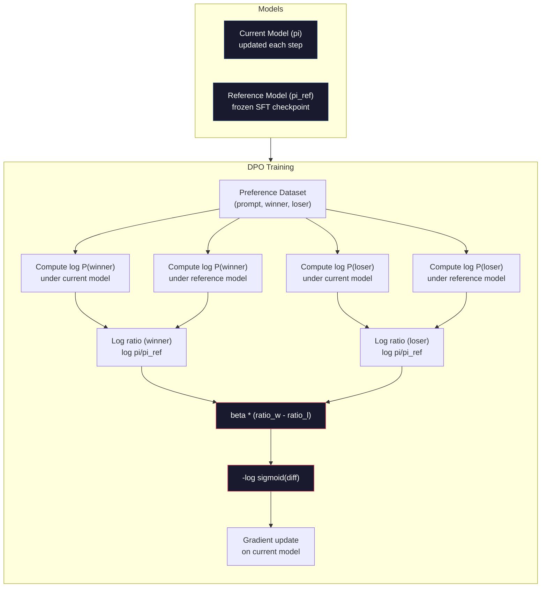

# DPO: Direct Preference Optimization

> RLHFは機能します。ただし、3つのモデル（SFT、報酬モデル、方策）の訓練、PPOの不安定性の管理、KLペナルティの調整が必要です。DPOは問いかけます。もしそれらをすべて省略できたらどうでしょうか。DPOは選好ペア上で言語モデルを直接最適化します。報酬モデルなし。PPOなし。1つの訓練ループ。同じ結果。

**種類:** 構築
**言語:** Python（numpy使用）
**前提:** Phase 10, Lesson 07（RLHF）
**時間:** 約90分

## 学習目標

- 別個の報酬モデルなしに、選好ペア上で言語モデルを直接最適化するDPO訓練を実装する
- DPO損失関数を導出し、方策の対数確率を通じて報酬モデルを暗黙的に表現する仕組みを説明する
- 訓練安定性、計算コスト、必要なモデル数の観点でDPOとRLHFを比較する
- betaパラメータを調整し、訓練済み方策が参照モデルからどれだけ離れるかを制御する

## 問題

Lesson 07でRLHFパイプラインを構築しました。3段階。3つのモデル。SFTモデル、報酬モデル、そしてPPOで最適化される方策モデルです。報酬モデルだけでも、数千件の人間選好ペアと別個の訓練ループが必要でした。PPOでは、KL係数、学習率、clip ratio、エポック数を慎重に調整する必要がありました。

実際には、PPO訓練は不安定なことで有名です。ハイパーパラメータの小さな変更で訓練が発散します。報酬モデルは人間の選好の不完全な代理であり、方策はその弱点を悪用する方法を見つけます。KLペナルティは助けになりますが、それ自体に調整が必要です。低すぎると報酬ハッキングが起き、高すぎるとモデルがほとんど学習しません。

この複雑さのため、InstructGPTの公開後も、ほとんどのオープンソースモデルは何年もの間RLHFに苦戦しました。3段階パイプラインは壊れやすいのです。各段階にそれぞれ失敗モードがあり、誤差は積み重なります。

2023年5月、StanfordのRafael Rafailov、Archit Sharmaらは "Direct Preference Optimization: Your Language Model is Secretly a Reward Model" を発表しました。重要な洞察は、別個の報酬モデルは不要だということです。最適な報酬関数は、言語モデル自身のトークン確率によって数学的に決まります。報酬モデルを完全に省略し、選好ペア上で言語モデルを直接最適化できます。

DPOはRLHFを単一の教師あり学習ステップへ縮約します。1つのモデル。1つの損失関数。1つの訓練ループ。強化学習なし。DPOを大規模に使った初期モデルの1つであるZephyr-7Bは、複数のベンチマークで完全なRLHFで訓練されたモデルに匹敵または上回りました。MetaはLlama 3のアラインメントパイプラインの一部としてDPOを使いました。Anthropicもアラインメント研究でDPOスタイルの手法に言及しています。

## コンセプト

### 重要な洞察

RLHFは次の目的を最適化します。

```
maximize: E[R(x, y)] - beta * KL(pi || pi_ref)
```

ここで、Rは報酬モデル、piは方策、pi_refは参照モデル、betaはKL係数です。

DPO論文は、この目的に閉形式の最適解があることを示しました。任意の報酬関数Rに対して、最適方策は次のようになります。

```
pi*(y | x) = pi_ref(y | x) * exp(R(x, y) / beta) / Z(x)
```

ここでZ(x)は正規化定数です。これを変形すると次のようになります。

```
R(x, y) = beta * log(pi*(y | x) / pi_ref(y | x)) + beta * log Z(x)
```

これが突破口です。報酬は、方策モデルの確率と参照モデルの確率だけで表現されます。別個の報酬モデルを訓練する必要はありません。報酬は確率比の中に*暗黙的*に存在します。

これをBradley-Terry選好モデルへ代入すると次のようになります。

```
P(y_w > y_l | x) = sigmoid(R(x, y_w) - R(x, y_l))
                  = sigmoid(beta * (log pi(y_w|x)/pi_ref(y_w|x) - log pi(y_l|x)/pi_ref(y_l|x)))
```

両方の応答は同じプロンプトxを条件にしているため、Z(x)項は打ち消し合います。残るのは、preferred応答とrejected応答に対する方策モデルおよび参照モデルの対数確率だけの関数です。

### DPO損失

```
L_DPO = -log(sigmoid(beta * (log pi(y_w|x)/pi_ref(y_w|x) - log pi(y_l|x)/pi_ref(y_l|x))))
```

各要素を分解します。

- **y_w** = 好まれた（勝った）応答
- **y_l** = rejected（負けた）応答
- **x** = プロンプト
- **pi** = 現在のモデル（訓練対象）
- **pi_ref** = 参照モデル（凍結されたSFTチェックポイント）
- **beta** = 参照からの乖離を制御するtemperatureパラメータ（通常0.1から0.5）

比率 `log pi(y|x) / pi_ref(y|x)` は対数確率比です。この比率が正なら、現在のモデルは応答yに参照モデルより高い確率を割り当てています。負なら、現在のモデルは低い確率を割り当てています。

DPO損失は、preferred応答の対数確率比を上げ、rejected応答の対数確率比を下げるようモデルを押します。betaパラメータは、モデルが参照からどれだけ積極的に離れてよいかを制御します。小さいbetaは大きな乖離を許し、大きいbetaはモデルを参照の近くに保ちます。



### DPOがより単純な理由

| 観点 | RLHF (PPO) | DPO |
|--------|-----------|-----|
| 訓練するモデル | 3（SFT + reward + policy） | 1（policyのみ） |
| 訓練ループ | 3（SFT、RM訓練、PPO） | 2（SFT、DPO） |
| ハイパーパラメータ | lr、KL coeff、clip ratio、RM lr、epochs x3 | lr、beta、epochs |
| 報酬モデル | 必須（別訓練） | モデル確率に暗黙的 |
| RLアルゴリズム | PPO（複雑、不安定） | 教師あり学習（安定） |
| GPUメモリ | PPO中に3-4モデル | 2モデル（current + reference） |
| 訓練安定性 | ハイパーパラメータに敏感 | SFTに近く頑健 |

DPOでは訓練中に2つのモデル、現在のモデルと凍結参照モデルをメモリに載せる必要があります。RLHFでは3つまたは4つ、つまり方策、参照、報酬モデル、場合によってはvalue function baselineが必要です。70Bモデルでは、各コピーがFP16で140GBを消費します。報酬モデルをなくすことによるメモリ節約は大きいです。

### DPOがRLHFを上回る場面

**小規模データセット。** 5,000-20,000件の選好ペアでは、DPOがRLHFに匹敵または上回ることがよくあります。RLHFの報酬モデルは汎化するのに十分なデータを必要とします。データが限られると過学習し、信頼できない報酬信号を出します。DPOは報酬モデルを必要としないため、この問題を回避します。

**限られた計算資源。** DPOは完全なRLHFのおおよそ3分の1の計算で済みます（3つではなく1つの訓練ループ）。大規模GPUクラスタを持たないチームにとって、実用的な選択肢です。

**素早い反復。** どの選好データセットが最良のモデルを生むか確かめるために、10種類のデータセットを試したいとします。DPOなら各実験を数時間で実行できます。RLHFでは各データセットごとに報酬モデルを再訓練する必要があります。

### RLHFがDPOを上回る場面

**大規模訓練。** GPT-4やClaudeの規模では、RLHFの別個の報酬モデルが、より微妙な選好信号を捉えられます。報酬モデルは複雑な品質基準に適応する学習済み損失関数として機能します。

**複雑な報酬信号。** 「より良い」が有用性、無害性、正直さなど複数の次元を含む場合、報酬モデルはこの多目的トレードオフを学習できます。DPOは各選好ペアを「一方が良く、一方が悪い」という二値信号として扱い、その理由はモデル化しません。

**反復的アラインメント。** RLHFパイプラインでは、現在の方策で新しい応答を生成し、人間に評価してもらい、オンラインループで報酬モデルを再訓練できます。DPOは固定された選好ペアデータセットで動作します。Constitutional AI（Anthropicのアプローチ）は、RLHFのこの反復的性質を広く活用しています。

### DPOの先へ: KTO、ORPO、SimPO

DPOは、単純化されたアラインメント手法のファミリーを生みました。

**KTO（Kahneman-Tversky Optimization, 2024）:** ペアすら不要です。KTOはペアでないフィードバック、つまり各応答に「良い」または「悪い」だけをラベル付けしたデータで動きます。これによりデータ収集が大きく単純化されます。アノテータに2つの応答を見せて「どちらが良いか」と尋ねる代わりに、1つの応答を見せて「これは良いか」と尋ねます。損失関数はプロスペクト理論の損失回避を適用し、良い応答を報いるよりも悪い応答を強く罰します。

**ORPO（Odds Ratio Preference Optimization, 2024）:** SFTとアラインメントを単一の訓練ステップに統合します。最初にSFTをしてからDPOをする代わりに、ORPOはSFT損失を変更して選好信号を含めます。損失は2項からなります。preferred応答に対する標準的な次トークン予測損失と、preferred応答とrejected応答の確率差を広げるodds ratio項です。2つではなく1つの訓練ループです。

**SimPO（Simple Preference Optimization, 2024）:** 参照モデルを完全に取り除きます。凍結参照に対する対数確率比を計算する代わりに、SimPOは応答の平均対数確率（長さで正規化）を暗黙の報酬として使います。これによりメモリを節約し（参照モデル不要）、訓練を単純化します。長さ正規化により、モデルが短い応答を好むことを防ぎます。

| 手法 | 年 | メモリ上のモデル数 | ペアが必要？ | 参照が必要？ | 訓練ループ |
|--------|------|-----------------|-------------|-----------------|----------------|
| RLHF | 2022 | 3-4 | はい（RM用） | はい | 3 |
| DPO | 2023 | 2 | はい | はい | 2 |
| KTO | 2024 | 2 | いいえ（ペアなし） | はい | 2 |
| ORPO | 2024 | 1 | はい | いいえ | 1 |
| SimPO | 2024 | 1 | はい | いいえ | 1 |

傾向は明確です。それぞれの手法が、複雑さの構成要素を1つずつ取り除いています。RLHFには報酬モデルとPPOが必要でした。DPOはその両方を取り除きました。KTOはペアデータを取り除きました。ORPOは別個のSFT段階を取り除きました。SimPOは参照モデルを取り除きました。アラインメント税、つまりベースモデルからアライン済みモデルへ進むための計算・データ・複雑さのコストは下がり続けています。

### 実際のDPO導入例

**Zephyr-7B（HuggingFace, October 2023）:** Mistral 7BベースをUltraChat（200K examples）でSFTし、その後UltraFeedback（60K preference pairs）でDPOしました。MT-Benchで6.47を記録し、当時の7Bモデルとして最高でした。比較として、Llama 2 Chat 70Bは6.86でした。つまりZephyrは、DPOアラインメントだけで、10倍のサイズのモデルに6%以内まで近づきました。

**Llama 3（Meta, April 2024）:** 初期RLHF段階の後にDPOを使用しました。この組み合わせは、DPOとRLHFが相補的になり得ることを示しています。RLHFで広いアラインメントを行い、DPOでターゲットを絞って改良します。

**Neural Magic / nm-chat（2024）:** 複数のオープンソースモデルにDPOを適用し、SFTのみのベースラインに対してアラインメントベンチマークで一貫して5-15%の改善を示しました。

## 構築

### Step 1: 選好データセット

RLHFと同じ形式、つまり (prompt, preferred, rejected) トリプルです。DPOは中間の報酬モデルなしに、このデータを直接消費します。

```python
import numpy as np
import sys
import os
sys.path.insert(0, os.path.join(os.path.dirname(__file__), "..", "..", "04-pre-training-mini-gpt", "code"))
from main import MiniGPT, LayerNorm, Embedding, TransformerBlock

PREFERENCE_DATA = [
    {
        "prompt": "What is the capital of France?",
        "preferred": "The capital of France is Paris.",
        "rejected": "France is a country in Europe. It has many cities. The capital is Paris. Paris is known for the Eiffel Tower.",
    },
    {
        "prompt": "Explain gravity in one sentence.",
        "preferred": "Gravity is the force that attracts objects with mass toward each other.",
        "rejected": "Gravity is something that makes things fall down when you drop them.",
    },
    {
        "prompt": "What is 15 times 7?",
        "preferred": "15 times 7 is 105.",
        "rejected": "Let me think about this. 15 times 7. Well, 10 times 7 is 70, and 5 times 7 is 35, so the answer might be around 105.",
    },
    {
        "prompt": "Name three programming languages.",
        "preferred": "Python, Rust, and TypeScript.",
        "rejected": "There are many programming languages. Some popular ones include various languages like Python and others.",
    },
    {
        "prompt": "What year did World War II end?",
        "preferred": "World War II ended in 1945.",
        "rejected": "World War II was a major global conflict. It involved many countries. The war ended in the mid-1940s, specifically in 1945.",
    },
    {
        "prompt": "Define machine learning.",
        "preferred": "Machine learning is a field where algorithms learn patterns from data to make predictions without being explicitly programmed.",
        "rejected": "Machine learning is a type of AI. AI stands for artificial intelligence. Machine learning uses data to learn.",
    },
]
```

### Step 2: シーケンス対数確率

DPO損失では、プロンプトが与えられたときの応答全体の対数確率を計算する必要があります。つまり、(prompt + response) シーケンス全体でモデルを実行し、各応答トークンの対数確率を合計します。

```python
def tokenize_sequence(text, vocab_size=256):
    return [min(t, vocab_size - 1) for t in list(text.encode("utf-8"))]


def compute_sequence_log_prob(model, prompt_tokens, response_tokens, max_seq_len=128):
    full_sequence = prompt_tokens + response_tokens
    if len(full_sequence) > max_seq_len:
        full_sequence = full_sequence[:max_seq_len]

    if len(full_sequence) < 2:
        return 0.0

    input_ids = np.array(full_sequence[:-1]).reshape(1, -1)
    target_ids = np.array(full_sequence[1:])

    logits = model.forward(input_ids)
    logits = logits[0]

    max_logits = logits.max(axis=-1, keepdims=True)
    log_probs = logits - max_logits - np.log(
        np.exp(logits - max_logits).sum(axis=-1, keepdims=True)
    )

    prompt_len = len(prompt_tokens)
    response_start = max(0, prompt_len - 1)
    response_end = len(target_ids)

    if response_start >= response_end:
        return 0.0

    response_log_probs = log_probs[response_start:response_end, :]
    response_targets = target_ids[response_start:response_end]

    total_log_prob = 0.0
    for i, target in enumerate(response_targets):
        total_log_prob += response_log_probs[i, target]

    return total_log_prob
```

この関数はDPOの中核です。各選好ペアにつき4回実行されます。preferred応答でモデル、rejected応答でモデル、preferred応答で参照、rejected応答で参照です。つまり、訓練例ごとに4回のforward passです。RLHFの生成 + 報酬採点 + value推定 + PPO更新と比べて、より単純で、高速で、安定しています。

### Step 3: DPO損失

論文の中核をコードにしたものです。1つの関数。1つの損失。報酬モデルなし。

```python
def sigmoid(x):
    return np.where(
        x >= 0,
        1.0 / (1.0 + np.exp(-x)),
        np.exp(x) / (1.0 + np.exp(x))
    )


def dpo_loss(policy_logprob_preferred, policy_logprob_rejected,
             ref_logprob_preferred, ref_logprob_rejected, beta=0.1):
    preferred_ratio = policy_logprob_preferred - ref_logprob_preferred
    rejected_ratio = policy_logprob_rejected - ref_logprob_rejected

    logit = beta * (preferred_ratio - rejected_ratio)

    loss = -np.log(sigmoid(logit) + 1e-8)

    preferred_reward = beta * preferred_ratio
    rejected_reward = beta * rejected_ratio

    return loss, {
        "preferred_ratio": float(preferred_ratio),
        "rejected_ratio": float(rejected_ratio),
        "logit": float(logit),
        "implicit_preferred_reward": float(preferred_reward),
        "implicit_rejected_reward": float(rejected_reward),
        "reward_margin": float(preferred_reward - rejected_reward),
    }
```

`preferred_ratio` と `rejected_ratio` はDPO導出で出てきた対数確率比です。現在のモデルが参照に対してpreferred応答へ高い確率を、rejected応答へ低い確率を割り当てると、logitは正になり、損失は低くなります。訓練信号はまさにこの方向へモデルを押します。

`implicit_preferred_reward` と `implicit_rejected_reward` は、DPO損失が暗黙的に割り当てる報酬です。これらを取り出すことで、訓練が機能しているかを確認できます。preferredとrejectedの報酬マージンは、訓練とともに大きくなるはずです。

### Step 4: DPO訓練ループ

標準的な教師あり訓練ループです。PPOなし。報酬モデルなし。forward passと勾配更新だけです。

```python
def copy_model_weights(source, target):
    target.embedding.token_embed = source.embedding.token_embed.copy()
    target.embedding.pos_embed = source.embedding.pos_embed.copy()
    target.ln_f.gamma = source.ln_f.gamma.copy()
    target.ln_f.beta = source.ln_f.beta.copy()
    for s_block, t_block in zip(source.blocks, target.blocks):
        t_block.attn.W_q = s_block.attn.W_q.copy()
        t_block.attn.W_k = s_block.attn.W_k.copy()
        t_block.attn.W_v = s_block.attn.W_v.copy()
        t_block.attn.W_out = s_block.attn.W_out.copy()
        t_block.ffn.W1 = s_block.ffn.W1.copy()
        t_block.ffn.W2 = s_block.ffn.W2.copy()
        t_block.ffn.b1 = s_block.ffn.b1.copy()
        t_block.ffn.b2 = s_block.ffn.b2.copy()
        t_block.ln1.gamma = s_block.ln1.gamma.copy()
        t_block.ln1.beta = s_block.ln1.beta.copy()
        t_block.ln2.gamma = s_block.ln2.gamma.copy()
        t_block.ln2.beta = s_block.ln2.beta.copy()


def dpo_train(policy_model, reference_model, preference_data,
              num_epochs=5, lr=5e-6, beta=0.1, max_seq_len=128):
    print(f"DPO Training: {len(preference_data)} pairs, {num_epochs} epochs, "
          f"lr={lr}, beta={beta}")
    print()

    losses = []
    margins = []

    for epoch in range(num_epochs):
        epoch_loss = 0.0
        epoch_margin = 0.0
        num_examples = 0

        indices = np.random.permutation(len(preference_data))

        for idx in indices:
            pair = preference_data[idx]

            prompt_tokens = tokenize_sequence(pair["prompt"])
            preferred_tokens = tokenize_sequence(pair["preferred"])
            rejected_tokens = tokenize_sequence(pair["rejected"])

            pi_logprob_w = compute_sequence_log_prob(
                policy_model, prompt_tokens, preferred_tokens, max_seq_len
            )
            pi_logprob_l = compute_sequence_log_prob(
                policy_model, prompt_tokens, rejected_tokens, max_seq_len
            )
            ref_logprob_w = compute_sequence_log_prob(
                reference_model, prompt_tokens, preferred_tokens, max_seq_len
            )
            ref_logprob_l = compute_sequence_log_prob(
                reference_model, prompt_tokens, rejected_tokens, max_seq_len
            )

            loss, metrics = dpo_loss(
                pi_logprob_w, pi_logprob_l,
                ref_logprob_w, ref_logprob_l, beta
            )

            update_direction = 1.0 if metrics["logit"] < 0 else -0.1
            for block in policy_model.blocks:
                block.ffn.W1 += lr * update_direction * np.random.randn(*block.ffn.W1.shape) * 0.01
                block.ffn.W2 += lr * update_direction * np.random.randn(*block.ffn.W2.shape) * 0.01

            epoch_loss += loss
            epoch_margin += metrics["reward_margin"]
            num_examples += 1
            losses.append(float(loss))
            margins.append(metrics["reward_margin"])

        avg_loss = epoch_loss / max(num_examples, 1)
        avg_margin = epoch_margin / max(num_examples, 1)

        print(f"  Epoch {epoch + 1}/{num_epochs} | Loss: {avg_loss:.4f} | "
              f"Avg Margin: {avg_margin:.4f}")

    return policy_model, losses, margins
```

訓練ループはRLHFに比べて驚くほど単純です。各選好ペアについて、4つの対数確率（2モデル × 2応答）を計算し、DPO損失に代入し、勾配を計算し、方策を更新します。生成ステップはありません。報酬モデル推論もありません。advantage推定もありません。クリッピングもありません。

### Step 5: DPOとRLHFの比較

暗黙報酬マージンと対数確率の変化を測定し、DPOをLesson 07のRLHFモデルと比較します。

```python
def evaluate_preference_accuracy(model, reference_model, preference_data, beta=0.1, max_seq_len=128):
    correct = 0
    total = 0

    for pair in preference_data:
        prompt_tokens = tokenize_sequence(pair["prompt"])
        preferred_tokens = tokenize_sequence(pair["preferred"])
        rejected_tokens = tokenize_sequence(pair["rejected"])

        pi_w = compute_sequence_log_prob(model, prompt_tokens, preferred_tokens, max_seq_len)
        pi_l = compute_sequence_log_prob(model, prompt_tokens, rejected_tokens, max_seq_len)
        ref_w = compute_sequence_log_prob(reference_model, prompt_tokens, preferred_tokens, max_seq_len)
        ref_l = compute_sequence_log_prob(reference_model, prompt_tokens, rejected_tokens, max_seq_len)

        preferred_reward = beta * (pi_w - ref_w)
        rejected_reward = beta * (pi_l - ref_l)

        if preferred_reward > rejected_reward:
            correct += 1
        total += 1

    return correct / max(total, 1)


def analyze_implicit_rewards(model, reference_model, preference_data, beta=0.1, max_seq_len=128):
    print("Implicit Reward Analysis:")
    print("-" * 65)
    print(f"  {'Prompt':<30} {'Pref Reward':>12} {'Rej Reward':>12} {'Margin':>10}")
    print("  " + "-" * 60)

    for pair in preference_data:
        prompt_tokens = tokenize_sequence(pair["prompt"])
        preferred_tokens = tokenize_sequence(pair["preferred"])
        rejected_tokens = tokenize_sequence(pair["rejected"])

        pi_w = compute_sequence_log_prob(model, prompt_tokens, preferred_tokens, max_seq_len)
        pi_l = compute_sequence_log_prob(model, prompt_tokens, rejected_tokens, max_seq_len)
        ref_w = compute_sequence_log_prob(reference_model, prompt_tokens, preferred_tokens, max_seq_len)
        ref_l = compute_sequence_log_prob(reference_model, prompt_tokens, rejected_tokens, max_seq_len)

        pref_reward = beta * (pi_w - ref_w)
        rej_reward = beta * (pi_l - ref_l)
        margin = pref_reward - rej_reward

        truncated = pair["prompt"][:28] + ".." if len(pair["prompt"]) > 30 else pair["prompt"]
        print(f"  {truncated:<30} {pref_reward:>12.4f} {rej_reward:>12.4f} {margin:>10.4f}")

    print()
```

### Step 6: Beta感度分析

betaパラメータは、RLHFにおけるKL係数に相当します。モデルが参照からどれだけ離れてよいかを制御します。この実験ではその効果を示します。

```python
def beta_sensitivity_analysis(sft_model, preference_data, betas, max_seq_len=128):
    print("Beta Sensitivity Analysis")
    print("-" * 60)
    print(f"  {'Beta':>8} {'Final Loss':>12} {'Final Margin':>14} {'Accuracy':>10}")
    print("  " + "-" * 55)

    results = []

    for beta in betas:
        policy = MiniGPT(
            vocab_size=256, embed_dim=128, num_heads=4,
            num_layers=4, max_seq_len=max_seq_len, ff_dim=512
        )
        reference = MiniGPT(
            vocab_size=256, embed_dim=128, num_heads=4,
            num_layers=4, max_seq_len=max_seq_len, ff_dim=512
        )
        copy_model_weights(sft_model, policy)
        copy_model_weights(sft_model, reference)

        policy, losses, margins_list = dpo_train(
            policy, reference, preference_data,
            num_epochs=3, lr=5e-6, beta=beta, max_seq_len=max_seq_len
        )

        accuracy = evaluate_preference_accuracy(
            policy, reference, preference_data, beta, max_seq_len
        )

        final_loss = losses[-1] if losses else 0
        final_margin = margins_list[-1] if margins_list else 0

        print(f"  {beta:>8.3f} {final_loss:>12.4f} {final_margin:>14.4f} {accuracy:>10.1%}")
        results.append({
            "beta": beta,
            "final_loss": final_loss,
            "final_margin": final_margin,
            "accuracy": accuracy,
        })

        print()

    return results
```

小さいbeta（0.01）は、モデルが参照から自由に離れることを許します。学習は速いですが、退化した解のリスクがあります。大きいbeta（1.0）は、モデルを参照の近くに保ちます。安定しますが、学習は遅くなります。多くの用途でのスイートスポットは0.1から0.3です。

## 使う

### DPOパイプライン全体のデモ

```python
if __name__ == "__main__":
    np.random.seed(42)

    print("=" * 70)
    print("DPO: DIRECT PREFERENCE OPTIMIZATION")
    print("=" * 70)
    print()

    print("STEP 1: Initialize SFT Model (from Lesson 06)")
    print("-" * 50)
    sft_model = MiniGPT(
        vocab_size=256, embed_dim=128, num_heads=4,
        num_layers=4, max_seq_len=128, ff_dim=512
    )
    print(f"  Parameters: {sft_model.count_parameters():,}")
    print()

    print("STEP 2: DPO Training")
    print("-" * 50)

    policy_model = MiniGPT(
        vocab_size=256, embed_dim=128, num_heads=4,
        num_layers=4, max_seq_len=128, ff_dim=512
    )
    reference_model = MiniGPT(
        vocab_size=256, embed_dim=128, num_heads=4,
        num_layers=4, max_seq_len=128, ff_dim=512
    )
    copy_model_weights(sft_model, policy_model)
    copy_model_weights(sft_model, reference_model)

    policy_model, losses, margins = dpo_train(
        policy_model, reference_model, PREFERENCE_DATA,
        num_epochs=5, lr=5e-6, beta=0.1
    )
    print()

    print("=" * 70)
    print("STEP 3: Evaluate")
    print("=" * 70)
    print()

    pre_accuracy = evaluate_preference_accuracy(
        sft_model, reference_model, PREFERENCE_DATA, beta=0.1
    )
    post_accuracy = evaluate_preference_accuracy(
        policy_model, reference_model, PREFERENCE_DATA, beta=0.1
    )

    print(f"  Preference accuracy (pre-DPO):  {pre_accuracy:.1%}")
    print(f"  Preference accuracy (post-DPO): {post_accuracy:.1%}")
    print()

    analyze_implicit_rewards(policy_model, reference_model, PREFERENCE_DATA, beta=0.1)

    print("=" * 70)
    print("STEP 4: Training Dynamics")
    print("=" * 70)
    print()

    if losses:
        print("  Loss curve:")
        window = max(1, len(losses) // 5)
        for i in range(0, len(losses), window):
            chunk = losses[i:i + window]
            avg = sum(chunk) / len(chunk)
            print(f"    Steps {i:3d}-{i + len(chunk) - 1:3d}: loss = {avg:.4f}")
        print()

    if margins:
        print("  Reward margin curve:")
        window = max(1, len(margins) // 5)
        for i in range(0, len(margins), window):
            chunk = margins[i:i + window]
            avg = sum(chunk) / len(chunk)
            print(f"    Steps {i:3d}-{i + len(chunk) - 1:3d}: margin = {avg:.4f}")
        print()

    print("=" * 70)
    print("STEP 5: Beta Sensitivity")
    print("=" * 70)
    print()

    beta_results = beta_sensitivity_analysis(
        sft_model, PREFERENCE_DATA, betas=[0.01, 0.1, 0.3, 1.0]
    )

    print("=" * 70)
    print("DPO vs RLHF COMPARISON")
    print("=" * 70)
    print()
    print("  DPO advantages:")
    print("    - 1 training loop (vs 3 for RLHF)")
    print("    - 2 models in memory (vs 3-4 for RLHF)")
    print("    - Supervised learning (vs RL, more stable)")
    print("    - No reward model to train or maintain")
    print()
    print("  RLHF advantages:")
    print("    - Separate reward model captures complex preferences")
    print("    - Online learning: generate, rate, retrain")
    print("    - Better for multi-objective alignment")
    print("    - Proven at largest scales (GPT-4, Claude)")
    print()
    print("  Practical guidance:")
    print("    - Start with DPO. It's simpler and often sufficient.")
    print("    - Switch to RLHF if DPO plateaus on your eval metrics.")
    print("    - Many production systems use both: RLHF first, DPO to refine.")
```

## 成果物

このレッスンは `outputs/prompt-alignment-method-selector.md` を生成します。これはユースケースに合ったアラインメント手法（SFT、RLHF、DPO、KTO、ORPO、SimPO）を選ぶのを助けるプロンプトです。利用可能なデータ、計算予算、アラインメント目標を与えると、手法と訓練計画を推奨します。

## 演習

1. KTO（Kahneman-Tversky Optimization）を実装してください。KTOはペアを必要とせず、各応答を「良い」または「悪い」とラベル付けするだけです。良い応答の損失は `-log(sigmoid(beta * log_ratio))`、悪い応答の損失は `-log(1 - sigmoid(beta * log_ratio))` で、悪い応答の損失には損失回避乗数（通常1.5x）を掛けます。同じデータで訓練し（preferredを独立に「良い」、rejectedを独立に「悪い」として扱う）、DPOと精度を比較してください。

2. 長さ正規化DPOを実装してください。生の対数確率の代わりに、応答トークン数で割ります: `normalized_logprob = total_logprob / num_tokens`。これにより、総対数確率が高くなりがちな短い応答をモデルが好むことを防ぎます。正規化ありとなしで暗黙報酬マージンを比較してください。

3. ORPOスタイルの統合損失を構築してください。preferred応答に対する標準的な次トークン予測損失をDPO損失へ追加します: `L = L_sft(preferred) + alpha * L_dpo`。alphaを0.1、0.5、1.0で試してください。統合損失により、指示に従い（SFT項から）、より良い応答を好む（DPO項から）モデルが得られ、別個のSFT段階を不要にできるはずです。

4. 反復DPOを実装してください。DPOを3エポック実行し、訓練済みモデルから新しい応答を生成し、元のpreferred応答とペアにして新しい選好ペアを作り、再度DPOを実行します。この「self-play」プロセスを2ラウンド行います。ラウンド1とラウンド2の後の選好精度を比較し、反復的改良が役立つか確認してください。

5. 異なる参照モデルでDPOを比較してください。SFTチェックポイントを参照に使う代わりに、(a) ベースモデル（SFT前）、(b) DPOのepoch 1のチェックポイント、(c) 方策モデルの指数移動平均を試します。どの参照が最も高い選好精度と最も安定した訓練曲線を生むか報告してください。

## 重要用語

| 用語 | よく言われる説明 | 実際の意味 |
|------|----------------|----------------------|
| DPO | 「RLなしのRLHF」 | Direct Preference Optimization: 報酬モデルとPPOを迂回し、選好ペア上で言語モデルを直接最適化する教師あり学習アルゴリズム |
| Implicit reward | 「報酬はモデルの中にある」 | 報酬関数は方策モデルと参照モデルの対数確率比によって決まる。別個の報酬モデルは不要 |
| Beta (DPO) | 「temperature」 | 方策が参照モデルからどれだけ離れてよいかを制御する。小さいbetaは大きな乖離を許し、大きいbetaはモデルを近くに保つ |
| Log-probability ratio | 「モデルがどれだけ変わったか」 | log pi(y\|x) - log pi_ref(y\|x)。正なら現在のモデルが参照より高い確率を割り当てている |
| Reference model | 「凍結チェックポイント」 | 重みが一切変化しないSFTモデルのコピー。確率比を計算するアンカーとして機能する |
| KTO | 「ペアなしのDPO」 | Kahneman-Tversky Optimization: 選好ペアを必要とせず、ペアでない「良い」または「悪い」ラベルで動く |
| ORPO | 「1ステップアラインメント」 | Odds Ratio Preference Optimization: SFT損失に選好項を追加し、SFTとアラインメントを単一の訓練ループに統合する |
| SimPO | 「参照不要」 | Simple Preference Optimization: 長さ正規化された平均対数確率を暗黙報酬として使い、参照モデルを取り除く |
| Alignment tax | 「モデルを安全にするコスト」 | ベースモデルからアライン済みモデルへ進むために必要な追加の計算、データ、複雑さ。DPOはこれを大きく削減する |

## 参考文献

- [Rafailov et al., 2023 -- "Direct Preference Optimization: Your Language Model is Secretly a Reward Model"](https://arxiv.org/abs/2305.18290) -- アラインメントをRLHFから教師あり学習へ単純化したDPO論文
- [Tunstall et al., 2023 -- "Zephyr: Direct Distillation of LM Alignment"](https://arxiv.org/abs/2310.16944) -- UltraFeedback上のDPOがベンチマークでRLHFに匹敵することを示したZephyr-7Bの論文
- [Ethayarajh et al., 2024 -- "KTO: Model Alignment as Prospect Theoretic Optimization"](https://arxiv.org/abs/2402.01306) -- ペア選好の必要性をなくす手法
- [Hong et al., 2024 -- "ORPO: Monolithic Preference Optimization without Reference Model"](https://arxiv.org/abs/2403.07691) -- SFTとアラインメントを1ステップで統合する手法
- [Meng et al., 2024 -- "SimPO: Simple Preference Optimization with a Reference-Free Reward"](https://arxiv.org/abs/2405.14734) -- 参照モデルを完全に取り除く手法
- [Llama 3 Technical Report](https://arxiv.org/abs/2407.21783) -- RLHFとDPOを組み合わせたMetaのアラインメントパイプライン
