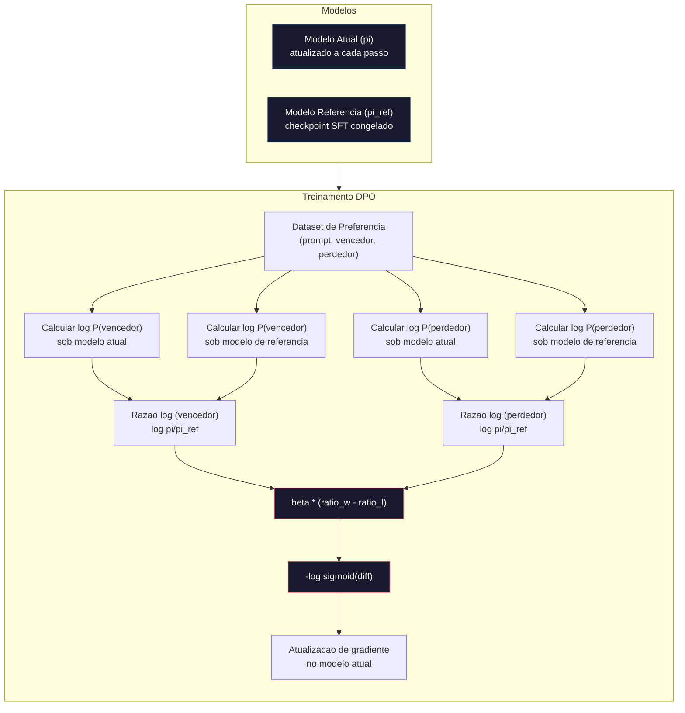

# DPO: Direct Preference Optimization

> RLHF funciona. Tambem precisa treinar tres modelos (SFT, reward model, politica), gerenciar a instabilidade do PPO, e sintonizar uma penalidade KL. DPO pergunta: e se voce pudesse pular tudo isso? DPO otimiza diretamente o modelo de linguagem em pares de preferencia. Sem reward model. Sem PPO. Um loop de treino. Mesmos resultados.

**Tipo:** Construir
**Linguagens:** Python (com numpy)
**Pre-requisitos:** Fase 10, Aula 07 (RLHF)
**Tempo:** ~90 minutos

## Objetivos de Aprendizado

- Implementar treinamento DPO que otimiza diretamente um modelo de linguagem em pares de preferencia sem um reward model separado
- Derivar a funcao de perda DPO e explicar como ela representa implicitamente um reward model atraves das log-probabilidades da politica
- Comparar DPO vs RLHF em termos de estabilidade de treino, custo computacional e numero de modelos necessarios
- Sintonizar o parametro beta pra controlar o quanto a politica treinada se desvia do modelo de referencia

## O Problema

Voce construiu um pipeline de RLHF na Aula 07. Tres etapas. Tres modelos. O modelo SFT, o reward model e o modelo de politica otimizado com PPO. So o reward model ja exigiu milhares de pares de preferencia humana e um loop de treino separado. O PPO exigiu sintonia cuidadosa do coeficiente KL, taxa de aprendizado, ratio de recorte e numero de epocas.

Na pratica, o treinamento PPO e notoriamente instavel. Pequenas mudancas nos hiperparametros fazem o treino divergir. O reward model e um proxy imperfeito pra preferencias humanas, e a politica encontra formas de explorar suas fraquezas. A penalidade KL ajuda mas precisa de sintonia propria -- se for muito baixa voce ganha reward hacking, se for muito alta o modelo mal aprende.

Essa complexidade e por que a maioria dos modelos open source sofreu com RLHF por anos apos a publicacao do InstructGPT. O pipeline de tres etapas e fragil. Cada etapa tem seus proprios modos de falha, e erros se acumulam.

Em maio de 2023, Rafael Rafailov, Archit Sharma e colegas da Stanford publicaram "Direct Preference Optimization: Your Language Model is Secretly a Reward Model." A percepcao chave: voce nao precisa de um reward model separado. A funcao de reward otima e matematicamente determinada pelas proprias probabilidades de tokens do modelo de linguagem. Voce pode pular o reward model inteiramente e otimizar o modelo de linguagem diretamente em pares de preferencia.

DPO reduz o RLHF a um unico passo de aprendizado supervisionado. Um modelo. Uma funcao de perda. Um loop de treino. Sem reinforcement learning. Zephyr-7B, um dos primeiros modelos a usar DPO em escala, igualou ou superou modelos treinados com RLHF completo em varios benchmarks. Meta usou DPO como parte do pipeline de alinhamento do Llama 3. Anthropic citou metodos de estilo DPO na pesquisa de alinhamento.

## O Conceito

### A Percepcao Chave

RLHF otimiza esse objetivo:

```
maximizar: E[R(x, y)] - beta * KL(pi || pi_ref)
```

onde R e o reward model, pi e a politica, pi_ref e o modelo de referencia, e beta e o coeficiente KL.

O paper DPO mostrou que esse objetivo tem uma solucao otima de forma fechada. Pra qualquer funcao de reward R, a politica otima e:

```
pi*(y | x) = pi_ref(y | x) * exp(R(x, y) / beta) / Z(x)
```

onde Z(x) e uma constante normalizadora. Reorganizando:

```
R(x, y) = beta * log(pi*(y | x) / pi_ref(y | x)) + beta * log Z(x)
```

Essa e a quebra de paradigma. O reward e expresso inteiramente em termos das probabilidades do modelo de politica e do modelo de referencia. Voce nao precisa treinar um reward model separado. O reward e *implicito* na razao de probabilidades.

Substituindo no modelo de preferencia Bradley-Terry:

```
P(y_w > y_l | x) = sigmoid(R(x, y_w) - R(x, y_l))
                  = sigmoid(beta * (log pi(y_w|x)/pi_ref(y_w|x) - log pi(y_l|x)/pi_ref(y_l|x)))
```

Os termos Z(x) se cancelam porque ambas as respostas condicionam no mesmo prompt x. O que sobra e uma funcao apenas das log-probabilidades do modelo de politica e do modelo de referencia nas respostas preferidas e rejeitadas.

### A Perda DPO

```
L_DPO = -log(sigmoid(beta * (log pi(y_w|x)/pi_ref(y_w|x) - log pi(y_l|x)/pi_ref(y_l|x))))
```

Vamos desempacotar cada pedaco:

- **y_w** = resposta preferida (vencedora)
- **y_l** = resposta rejeitada (perdedora)
- **x** = prompt
- **pi** = modelo atual (sendo treinado)
- **pi_ref** = modelo de referencia (checkpoint SFT congelado)
- **beta** = parametro de temperatura controlando desvio da referencia (geralmente 0.1 a 0.5)

A razao `log pi(y|x) / pi_ref(y|x)` e a razao de log-probabilidade. Quando essa razao e positiva, o modelo atual atribui maior probabilidade a resposta y que a referencia. Quando negativa, o modelo atual atribui menor probabilidade.

A perda DPO empurra o modelo pra aumentar a razao de log-probabilidade pra respostas preferidas e diminuir pra respostas rejeitadas. O parametro beta controla o quanto o modelo pode desagradecer da referencia -- beta pequeno permite grandes desvios, beta grande mantem o modelo proximo da referencia.



### Por que DPO e Mais Simples

| Aespecificaçãoto | RLHF (PPO) | DPO |
|--------|-----------|-----|
| Modelos pra treinar | 3 (SFT + reward + politica) | 1 (so politica) |
| Loops de treino | 3 (SFT, RM training, PPO) | 2 (SFT, DPO) |
| Hiperparametros | lr, coef KL, ratio clip, RM lr, epocas x3 | lr, beta, epocas |
| Reward model | Necessario (treino separado) | Implicito nas probabilidades do modelo |
| Algoritmo de RL | PPO (complexo, instavel) | Aprendizado supervisionado (estavel) |
| Memoria GPU | 3-4 modelos na memoria durante PPO | 2 modelos (atual + referencia) |
| Estabilidade do treino | Sensivel a hiperparametros | Robusta, similar a SFT |

DPO precisa de dois modelos na memoria durante o treino -- o modelo atual e a referencia congelada. RLHF precisa de tres ou quatro: a politica, a referencia, o reward model e opcionalmente uma funcao valor baseline. Pra um modelo de 70B, cada copia ocupa 140GB em FP16. A economia de memoria por eliminar o reward model e substancial.

### Quando DPO Supera RLHF

**Datasets pequenos.** Com 5.000-20.000 pares de preferencia, DPO frequentemente iguala ou supera RLHF. O reward model no RLHF precisa de dados suficientes pra generalizar -- com dados limitados, ele faz overfitting e produz sinais de reward pouco confiaveis. DPO contorna esse problema nao precisando de um reward model.

**Computacao limitada.** DPO requer mais ou menos um terco da computacao do RLHF completo (um loop de treino ao inves de tres). Pra times sem grandes clusters de GPU, essa e a escolha pratica.

**Iteracao rapida.** Quer testar 10 datasets de preferencia diferentes pra ver qual produz o melhor modelo? DPO permite rodar cada experimento em horas. RLHF requer retreinar o reward model pra cada dataset.

### Quando RLHF Supera DPO

**Treinamento em grande escala.** Na escala do GPT-4 ou Claude, o reward model separado do RLHF pode capturar sinais de preferencia mais nuançados. O reward model funciona como uma funcao de perda aprendida que se adapta a criterios complexos de qualidade.

**Sinais de reward complexos.** Quando "melhor" envolve multiplas dimensoes (utilidade, innocuidade, honestidade), um reward model pode aprender esse tradeoff multi-objetivo. DPO trata cada par de preferencia como um sinal binario -- um e melhor, um e pior -- sem modelar o por que.

**Alinhamento iterativo.** Pipelines de RLHF podem gerar novas respostas com a politica atual, humanos as avaliarem, e retreinar o reward model num loop online. DPO funciona num dataset fixo de pares de preferencia. Constitutional AI (a abordagem da Anthropic) usa extensivamente essa propriedade iterativa do RLHF.

### Alem do DPO: KTO, ORPO, SimPO

DPO inspirou uma familia de metodos simplificados de alinhamento.

**KTO (Kahneman-Tversky Optimization, 2024):** Voce nem precisa de pares. KTO funciona com feedback despareado -- so rotule cada resposta como "boa" ou "ruim" sem comparar com uma alternativa. Isso simplifica dramaticamente a coleta de dados. Ao inves de mostrar duas respostas a anotadores e perguntar "qual e melhor?", voce mostra uma resposta e pergunta "isso e bom?". A funcao de perda aplica aversao a perda da teoria da proespecificaçãoao: respostas ruins sao mais penalizadas que boas sao recompensadas.

**ORPO (Odds Ratio Preference Optimization, 2024):** Combina SFT e alinhamento num unico passo de treino. Ao inves de fazer SFT primeiro e depois DPO, ORPO modifica a perda do SFT pra incluir um sinal de preferencia. A perda tem dois termos: uma perda padrao de previsao de proximo token em respostas preferidas, mais um termo de odds ratio que aumenta a diferenca entre as probabilidades de respostas preferidas e rejeitadas. Um loop de treino ao inves de dois.

**SimPO (Simple Preference Optimization, 2024):** Elimina completamente o modelo de referencia. Ao inves de calcular razoes de log-probabilidade contra uma referencia congelada, SimPO usa a log-probabilidade media da resposta (normalizada por tamanho) como reward implicito. Isso economiza memoria (sem modelo de referencia necessario) e simplifica o treino. A normalizacao por tamanho impede que o modelo favoreca respostas curtas.

| Metodo | Ano | Modelos na Memoria | Precisa de Pares? | Precisa de Referencia? | Loops de Treino |
|--------|------|-----------------|-------------|-----------------|----------------|
| RLHF | 2022 | 3-4 | Sim (pro RM) | Sim | 3 |
| DPO | 2023 | 2 | Sim | Sim | 2 |
| KTO | 2024 | 2 | Nao (despareado) | Sim | 2 |
| ORPO | 2024 | 1 | Sim | Nao | 1 |
| SimPO | 2024 | 1 | Sim | Nao | 1 |

A tendencia e clara: cada metodo elimina mais uma peca de complexidade. RLHF precisava de um reward model e PPO. DPO eliminou ambos. KTO eliminou dados pareados. ORPO eliminou a etapa separada de SFT. SimPO eliminou o modelo de referencia. O imposto de alinhamento -- o custo de computacao e complexidade de ir de um modelo base pra um modelo alinhado -- continua caindo.

### Deployments Reais de DPO

**Zephyr-7B (HuggingFace, Outubro 2023):** Mistral 7B base, SFT no UltraChat (200K exemplos), depois DPO no UltraFeedback (60K pares de preferencia). Pontuou 6.47 no MT-Bench -- o modelo de 7B mais alto da epoca. Pra comparacao, Llama 2 Chat 70B pontuou 6.86, significando que o Zephyr chegou a 6% de um modelo 10x maior usando apenas alinhamento DPO.

**Llama 3 (Meta, Abril 2024):** Usou DPO apos etapas iniciais de RLHF. A combinacao sugere que DPO e RLHF podem ser complementares -- RLHF pra alinhamento amplo, DPO pra refinamento direcionado.

**Neural Magic / nm-chat (2024):** Aplicou DPO em multiplos modelos open source, consistentemente mostrando 5-15% de melhoria em benchmarks de alinhamento sobre baselines de apenas SFT.

## Construir

### Etapa 1: Dataset de Preferencia

Mesmo formato do RLHF -- triples (prompt, preferido, rejeitado). DPO consome esses dados diretamente sem um reward model intermediario.

```python
import numpy as np
import sys
import os
sys.path.insert(0, os.path.join(os.path.dirname(__file__), "..", "..", "04-pre-training-mini-gpt", "code"))
from main import MiniGPT, LayerNorm, Embedding, TransformerBlock

PREFERENCE_DATA = [
    {
        "prompt": "What is the capital of France?",
        "preferred": "The capital of France is Paris.",
        "rejected": "France is a country in Europe. It has many cities. The capital is Paris. Paris is known for the Eiffel Tower.",
    },
    {
        "prompt": "Explain gravity in one sentence.",
        "preferred": "Gravity is the force that attracts objects with mass toward each other.",
        "rejected": "Gravity is something that makes things fall down when you drop them.",
    },
    {
        "prompt": "What is 15 times 7?",
        "preferred": "15 times 7 is 105.",
        "rejected": "Let me think about this. 15 times 7. Well, 10 times 7 is 70, and 5 times 7 is 35, so the answer might be around 105.",
    },
    {
        "prompt": "Name three programming languages.",
        "preferred": "Python, Rust, and TypeScript.",
        "rejected": "There are many programming languages. Some popular ones include various languages like Python and others.",
    },
    {
        "prompt": "What year did World War II end?",
        "preferred": "World War II ended in 1945.",
        "rejected": "World War II was a major global conflict. It involved many countries. The war ended in the mid-1940s, especificaçãoifically in 1945.",
    },
    {
        "prompt": "Define machine learning.",
        "preferred": "Machine learning is a field where algorithms learn patterns from data to make predictions without being explicitly programmed.",
        "rejected": "Machine learning is a type of AI. AI stands for artificial intelligence. Machine learning uses data to learn.",
    },
]
```

### Etapa 2: Log-Probabilidade de Sequencia

A perda DPO requer calcular a log-probabilidade total de uma resposta dado um prompt. Isso significa rodar o modelo na sequencia completa (prompt + resposta) e somar as log-probabilidades de cada token da resposta.

```python
def tokenize_sequence(text, vocab_size=256):
    return [min(t, vocab_size - 1) for t in list(text.encode("utf-8"))]


def compute_sequence_log_prob(model, prompt_tokens, response_tokens, max_seq_len=128):
    full_sequence = prompt_tokens + response_tokens
    if len(full_sequence) > max_seq_len:
        full_sequence = full_sequence[:max_seq_len]

    if len(full_sequence) < 2:
        return 0.0

    input_ids = np.array(full_sequence[:-1]).reshape(1, -1)
    target_ids = np.array(full_sequence[1:])

    logits = model.forward(input_ids)
    logits = logits[0]

    max_logits = logits.max(axis=-1, keepdims=True)
    log_probs = logits - max_logits - np.log(
        np.exp(logits - max_logits).sum(axis=-1, keepdims=True)
    )

    prompt_len = len(prompt_tokens)
    response_start = max(0, prompt_len - 1)
    response_end = len(target_ids)

    if response_start >= response_end:
        return 0.0

    response_log_probs = log_probs[response_start:response_end, :]
    response_targets = target_ids[response_start:response_end]

    total_log_prob = 0.0
    for i, target in enumerate(response_targets):
        total_log_prob += response_log_probs[i, target]

    return total_log_prob
```

Essa funcao e a mao de obra do DPO. Pra cada par de preferencia, ela roda quatro vezes: modelo na resposta preferida, modelo na resposta rejeitada, referencia na resposta preferida, referencia na resposta rejeitada. Sao 4 forward passes por exemplo de treino versus geracao + pontuacao de reward + estimativa de valor + atualizacao PPO do RLHF. Mais simples, mais rapido, mais estavel.

### Etapa 3: A Perda DPO

O nucleo do paper em codigo. Uma funcao. Uma perda. Sem reward model.

```python
def sigmoid(x):
    return np.where(
        x >= 0,
        1.0 / (1.0 + np.exp(-x)),
        np.exp(x) / (1.0 + np.exp(x))
    )


def dpo_loss(policy_logprob_preferred, policy_logprob_rejected,
             ref_logprob_preferred, ref_logprob_rejected, beta=0.1):
    preferred_ratio = policy_logprob_preferred - ref_logprob_preferred
    rejected_ratio = policy_logprob_rejected - ref_logprob_rejected

    logit = beta * (preferred_ratio - rejected_ratio)

    loss = -np.log(sigmoid(logit) + 1e-8)

    preferred_reward = beta * preferred_ratio
    rejected_reward = beta * rejected_ratio

    return loss, {
        "preferred_ratio": float(preferred_ratio),
        "rejected_ratio": float(rejected_ratio),
        "logit": float(logit),
        "implicit_preferred_reward": float(preferred_reward),
        "implicit_rejected_reward": float(rejected_reward),
        "reward_margin": float(preferred_reward - rejected_reward),
    }
```

As `preferred_ratio` e `rejected_ratio` sao as razoes de log-probabilidade da derivacao do DPO. Quando o modelo atual atribui maior probabilidade a resposta preferida (em relacao a referencia) e menor probabilidade a rejeitada, o logit e positivo e a perda e baixa. O sinal de treino empurra o modelo exatamente nessa direcao.

O `implicit_preferred_reward` e `implicit_rejected_reward` sao os rewards que a perda DPO atribui implicitamente. Voce pode extra-los pra verificar se o treino ta funcionando -- a margem entre os rewards preferido e rejeitado deveria aumentar ao longo do treino.

### Etapa 4: Loop de Treino DPO

Um loop padrao de treino supervisionado. Sem PPO. Sem reward model. So forward passes e atualizacoes de gradiente.

```python
def copy_model_weights(source, target):
    target.embedding.token_embed = source.embedding.token_embed.copy()
    target.embedding.pos_embed = source.embedding.pos_embed.copy()
    target.ln_f.gamma = source.ln_f.gamma.copy()
    target.ln_f.beta = source.ln_f.beta.copy()
    for s_block, t_block in zip(source.blocks, target.blocks):
        t_block.attn.W_q = s_block.attn.W_q.copy()
        t_block.attn.W_k = s_block.attn.W_k.copy()
        t_block.attn.W_v = s_block.attn.W_v.copy()
        t_block.attn.W_out = s_block.attn.W_out.copy()
        t_block.ffn.W1 = s_block.ffn.W1.copy()
        t_block.ffn.W2 = s_block.ffn.W2.copy()
        t_block.ffn.b1 = s_block.ffn.b1.copy()
        t_block.ffn.b2 = s_block.ffn.b2.copy()
        t_block.ln1.gamma = s_block.ln1.gamma.copy()
        t_block.ln1.beta = s_block.ln1.beta.copy()
        t_block.ln2.gamma = s_block.ln2.gamma.copy()
        t_block.ln2.beta = s_block.ln2.beta.copy()


def dpo_train(policy_model, reference_model, preference_data,
              num_epochs=5, lr=5e-6, beta=0.1, max_seq_len=128):
    print(f"DPO Training: {len(preference_data)} pairs, {num_epochs} epochs, "
          f"lr={lr}, beta={beta}")
    print()

    losses = []
    margins = []

    for epoch in range(num_epochs):
        epoch_loss = 0.0
        epoch_margin = 0.0
        num_examples = 0

        indices = np.random.permutation(len(preference_data))

        for idx in indices:
            pair = preference_data[idx]

            prompt_tokens = tokenize_sequence(pair["prompt"])
            preferred_tokens = tokenize_sequence(pair["preferred"])
            rejected_tokens = tokenize_sequence(pair["rejected"])

            pi_logprob_w = compute_sequence_log_prob(
                policy_model, prompt_tokens, preferred_tokens, max_seq_len
            )
            pi_logprob_l = compute_sequence_log_prob(
                policy_model, prompt_tokens, rejected_tokens, max_seq_len
            )
            ref_logprob_w = compute_sequence_log_prob(
                reference_model, prompt_tokens, preferred_tokens, max_seq_len
            )
            ref_logprob_l = compute_sequence_log_prob(
                reference_model, prompt_tokens, rejected_tokens, max_seq_len
            )

            loss, metrics = dpo_loss(
                pi_logprob_w, pi_logprob_l,
                ref_logprob_w, ref_logprob_l, beta
            )

            update_direction = 1.0 if metrics["logit"] < 0 else -0.1
            for block in policy_model.blocks:
                block.ffn.W1 += lr * update_direction * np.random.randn(*block.ffn.W1.shape) * 0.01
                block.ffn.W2 += lr * update_direction * np.random.randn(*block.ffn.W2.shape) * 0.01

            epoch_loss += loss
            epoch_margin += metrics["reward_margin"]
            num_examples += 1
            losses.append(float(loss))
            margins.append(metrics["reward_margin"])

        avg_loss = epoch_loss / max(num_examples, 1)
        avg_margin = epoch_margin / max(num_examples, 1)

        print(f"  Epoch {epoch + 1}/{num_epochs} | Loss: {avg_loss:.4f} | "
              f"Avg Margin: {avg_margin:.4f}")

    return policy_model, losses, margins
```

O loop de treino e surpreendentemente simples comparado ao RLHF. Pra cada par de preferencia: calcula quatro log-probabilidades (dois modelos, duas respostas), joga na perda DPO, calcula o gradiente, atualiza a politica. Sem etapa de geracao. Sem inferencia do reward model. Sem estimativa de advantage. Sem recorte.

### Etapa 5: Comparar DPO vs RLHF

Meça as margens de reward implicitas e os deslocamentos de log-probabilidade pra comparar DPO com o modelo RLHF da Aula 07.

```python
def evaluate_preference_accuracy(model, reference_model, preference_data, beta=0.1, max_seq_len=128):
    correct = 0
    total = 0

    for pair in preference_data:
        prompt_tokens = tokenize_sequence(pair["prompt"])
        preferred_tokens = tokenize_sequence(pair["preferred"])
        rejected_tokens = tokenize_sequence(pair["rejected"])

        pi_w = compute_sequence_log_prob(model, prompt_tokens, preferred_tokens, max_seq_len)
        pi_l = compute_sequence_log_prob(model, prompt_tokens, rejected_tokens, max_seq_len)
        ref_w = compute_sequence_log_prob(reference_model, prompt_tokens, preferred_tokens, max_seq_len)
        ref_l = compute_sequence_log_prob(reference_model, prompt_tokens, rejected_tokens, max_seq_len)

        preferred_reward = beta * (pi_w - ref_w)
        rejected_reward = beta * (pi_l - ref_l)

        if preferred_reward > rejected_reward:
            correct += 1
        total += 1

    return correct / max(total, 1)


def analyze_implicit_rewards(model, reference_model, preference_data, beta=0.1, max_seq_len=128):
    print("Implicit Reward Analysis:")
    print("-" * 65)
    print(f"  {'Prompt':<30} {'Pref Reward':>12} {'Rej Reward':>12} {'Margin':>10}")
    print("  " + "-" * 60)

    for pair in preference_data:
        prompt_tokens = tokenize_sequence(pair["prompt"])
        preferred_tokens = tokenize_sequence(pair["preferred"])
        rejected_tokens = tokenize_sequence(pair["rejected"])

        pi_w = compute_sequence_log_prob(model, prompt_tokens, preferred_tokens, max_seq_len)
        pi_l = compute_sequence_log_prob(model, prompt_tokens, rejected_tokens, max_seq_len)
        ref_w = compute_sequence_log_prob(reference_model, prompt_tokens, preferred_tokens, max_seq_len)
        ref_l = compute_sequence_log_prob(reference_model, prompt_tokens, rejected_tokens, max_seq_len)

        pref_reward = beta * (pi_w - ref_w)
        rej_reward = beta * (pi_l - ref_l)
        margin = pref_reward - rej_reward

        truncated = pair["prompt"][:28] + ".." if len(pair["prompt"]) > 30 else pair["prompt"]
        print(f"  {truncated:<30} {pref_reward:>12.4f} {rej_reward:>12.4f} {margin:>10.4f}")

    print()
```

### Etapa 6: Analise de Sensibilidade ao Beta

O parametro beta e o equivalente do DPO do coeficiente KL no RLHF. Ele controla o quanto o modelo pode desagradecer da referencia. Esse experimento mostra seu efeito.

```python
def beta_sensitivity_analysis(sft_model, preference_data, betas, max_seq_len=128):
    print("Beta Sensitivity Analysis")
    print("-" * 60)
    print(f"  {'Beta':>8} {'Final Loss':>12} {'Final Margin':>14} {'Accuracy':>10}")
    print("  " + "-" * 55)

    results = []

    for beta in betas:
        policy = MiniGPT(
            vocab_size=256, embed_dim=128, num_heads=4,
            num_layers=4, max_seq_len=max_seq_len, ff_dim=512
        )
        reference = MiniGPT(
            vocab_size=256, embed_dim=128, num_heads=4,
            num_layers=4, max_seq_len=max_seq_len, ff_dim=512
        )
        copy_model_weights(sft_model, policy)
        copy_model_weights(sft_model, reference)

        policy, losses, margins_list = dpo_train(
            policy, reference, preference_data,
            num_epochs=3, lr=5e-6, beta=beta, max_seq_len=max_seq_len
        )

        accuracy = evaluate_preference_accuracy(
            policy, reference, preference_data, beta, max_seq_len
        )

        final_loss = losses[-1] if losses else 0
        final_margin = margins_list[-1] if margins_list else 0

        print(f"  {beta:>8.3f} {final_loss:>12.4f} {final_margin:>14.4f} {accuracy:>10.1%}")
        results.append({
            "beta": beta,
            "final_loss": final_loss,
            "final_margin": final_margin,
            "accuracy": accuracy,
        })

        print()

    return results
```

Beta pequeno (0.01) deixa o modelo desagradecer livremente da referencia -- aprendizado rapido mas risco de solucoes degeneradas. Beta grande (1.0) mantem o modelo proximo da referencia -- estavel mas aprendizado lento. O ponto ideal pra maioria das aplicacoes e 0.1 a 0.3.

## Usar

### Demo Completa do Pipeline DPO

```python
if __name__ == "__main__":
    np.random.seed(42)

    print("=" * 70)
    print("DPO: DIRECT PREFERENCE OPTIMIZATION")
    print("=" * 70)
    print()

    print("STEP 1: Initialize SFT Model (from Lesson 06)")
    print("-" * 50)
    sft_model = MiniGPT(
        vocab_size=256, embed_dim=128, num_heads=4,
        num_layers=4, max_seq_len=128, ff_dim=512
    )
    print(f"  Parameters: {sft_model.count_parameters():,}")
    print()

    print("STEP 2: DPO Training")
    print("-" * 50)

    policy_model = MiniGPT(
        vocab_size=256, embed_dim=128, num_heads=4,
        num_layers=4, max_seq_len=128, ff_dim=512
    )
    reference_model = MiniGPT(
        vocab_size=256, embed_dim=128, num_heads=4,
        num_layers=4, max_seq_len=128, ff_dim=512
    )
    copy_model_weights(sft_model, policy_model)
    copy_model_weights(sft_model, reference_model)

    policy_model, losses, margins = dpo_train(
        policy_model, reference_model, PREFERENCE_DATA,
        num_epochs=5, lr=5e-6, beta=0.1
    )
    print()

    print("=" * 70)
    print("STEP 3: Evaluate")
    print("=" * 70)
    print()

    pre_accuracy = evaluate_preference_accuracy(
        sft_model, reference_model, PREFERENCE_DATA, beta=0.1
    )
    post_accuracy = evaluate_preference_accuracy(
        policy_model, reference_model, PREFERENCE_DATA, beta=0.1
    )

    print(f"  Preference accuracy (pre-DPO):  {pre_accuracy:.1%}")
    print(f"  Preference accuracy (post-DPO): {post_accuracy:.1%}")
    print()

    analyze_implicit_rewards(policy_model, reference_model, PREFERENCE_DATA, beta=0.1)

    print("=" * 70)
    print("STEP 4: Training Dynamics")
    print("=" * 70)
    print()

    if losses:
        print("  Loss curve:")
        window = max(1, len(losses) // 5)
        for i in range(0, len(losses), window):
            chunk = losses[i:i + window]
            avg = sum(chunk) / len(chunk)
            print(f"    Steps {i:3d}-{i + len(chunk) - 1:3d}: loss = {avg:.4f}")
        print()

    if margins:
        print("  Reward margin curve:")
        window = max(1, len(margins) // 5)
        for i in range(0, len(margins), window):
            chunk = margins[i:i + window]
            avg = sum(chunk) / len(chunk)
            print(f"    Steps {i:3d}-{i + len(chunk) - 1:3d}: margin = {avg:.4f}")
        print()

    print("=" * 70)
    print("STEP 5: Beta Sensitivity")
    print("=" * 70)
    print()

    beta_results = beta_sensitivity_analysis(
        sft_model, PREFERENCE_DATA, betas=[0.01, 0.1, 0.3, 1.0]
    )

    print("=" * 70)
    print("DPO vs RLHF COMPARISON")
    print("=" * 70)
    print()
    print("  DPO advantages:")
    print("    - 1 training loop (vs 3 for RLHF)")
    print("    - 2 models in memory (vs 3-4 for RLHF)")
    print("    - Supervised learning (vs RL, more stable)")
    print("    - No reward model to train or maintain")
    print()
    print("  RLHF advantages:")
    print("    - Separate reward model captures complex preferences")
    print("    - Online learning: generate, rate, retrain")
    print("    - Better for multi-objective alignment")
    print("    - Proven at largest scales (GPT-4, Claude)")
    print()
    print("  Practical guidance:")
    print("    - Start with DPO. It's simpler and often sufficient.")
    print("    - Switch to RLHF if DPO plateaus on your eval metrics.")
    print("    - Many production systems use both: RLHF first, DPO to refine.")
```

## Publicar

Essa aula produz `outputs/prompt-alignment-method-selector.md` -- um prompt que te ajuda a escolher o metodo de alinhamento certo (SFT, RLHF, DPO, KTO, ORPO, SimPO) pro seu caso de uso. Dado a disponibilidade de dados, orcamento computacional e metas de alinhamento, ele recomenda um metodo e plano de treino.

## Exercicios

1. Implemente KTO (Kahneman-Tversky Optimization). KTO nao precisa de pares -- so rotule cada resposta como "boa" ou "ruim". A perda pra uma resposta boa e `-log(sigmoid(beta * log_ratio))` e pra uma ruim e `-log(1 - sigmoid(beta * log_ratio))` com um multiplicador de aversao a perda (geralmente 1.5x) na perda da resposta ruim. Treine nos mesmos dados (trate preferido como "boa" e rejeitado como "ruim" independentemente) e compare a acuracia com DPO.

2. Implemente DPO normalizado por tamanho. Ao inves de log-probabilidades brutas, divida pelo numero de tokens da resposta: `normalized_logprob = total_logprob / num_tokens`. Isso impede que o modelo favoreca respostas curtas (que tem log-prob total maior). Compare as margens de reward implicitas com e sem normalizacao.

3. Construa uma perda combinada estilo ORPO. Adicione uma perda padrao de previsao de proximo token na resposta preferida a perda DPO: `L = L_sft(preferido) + alpha * L_dpo`. Teste valores de alpha de 0.1, 0.5 e 1.0. A perda combinada deveria produzir um modelo que tanto segue instrucoes (do termo SFT) quanto prefere respostas melhores (do termo DPO), eliminando a necessidade de uma etapa SFT separada.

4. Implemente DPO iterativo. Rode DPO por 3 epocas, depois gere novas respostas do modelo treinado, pareie com as respostas preferidas originais como novos pares de preferencia, e rode DPO de novo. Duas rodadas desse processo de "self-play". Compare a acuracia de preferencia apos a rodada 1 e a rodada 2 pra ver se a refinamento iterativo ajuda.

5. Compare DPO com diferentes modelos de referencia. Ao inves de usar o checkpoint SFT como referencia, tente: (a) o modelo base (pre-SFT), (b) um checkpoint da epoca 1 do DPO, (c) uma media movel exponencial do modelo de politica. Reporte qual referencia produz a maior acuracia de preferencia e a curva de treino mais estavel.

## Termos Chave

| Termo | O que a gente diz | O que realmente significa |
|------|----------------|----------------------|
| DPO | "RLHF sem RL" | Direct Preference Optimization: um algoritmo de aprendizado supervisionado que otimiza o modelo de linguagem diretamente em pares de preferencia, contornando o reward model e o PPO |
| Reward implicito | "O reward ta no modelo" | A funcao de reward e determinada pela razao de log-probabilidade entre os modelos de politica e referencia -- sem reward model separado necessario |
| Beta (DPO) | "A temperatura" | Controla o quanto a politica pode desagradecer do modelo de referencia -- beta pequeno permite grandes desvios, beta grande mantem o modelo proximo |
| Razao de log-probabilidade | "O quanto o modelo mudou" | log pi(y|x) - log pi_ref(y|x) -- positivo significa que o modelo atual atribui maior probabilidade que a referencia |
| Modelo de referencia | "O checkpoint congelado" | Uma copia do modelo SFT cujos pesos nunca mudam -- serve como ancora pra computar razoes de probabilidade |
| KTO | "DPO sem pares" | Kahneman-Tversky Optimization: funciona com rotulos despareados "bom" ou "ruim" ao inves de exigir pares de preferencia |
| ORPO | "Alinhamento em um passo" | Odds Ratio Preference Optimization: combina SFT e alinhamento num unico loop de treino adicionando um termo de preferencia a perda do SFT |
| SimPO | "Sem referencia necessaria" | Simple Preference Optimization: elimina o modelo de referencia usando log-probabilidade media normalizada por tamanho como reward implicito |
| Imposto de alinhamento | "O custo de tornar modelos seguros" | A computacao, dados e complexidade adicionais necessarios pra ir de um modelo base pra um modelo alinhado -- DPO reduz isso significativamente |

## Leitura Complementar

- [Rafailov et al., 2023 -- "Direct Preference Optimization: Your Language Model is Secretly a Reward Model"](https://arxiv.org/abs/2305.18290) -- o paper DPO que simplificou o alinhamento de RLHF pra aprendizado supervisionado
- [Tunstall et al., 2023 -- "Zephyr: Direct Distillation of LM Alignment"](https://arxiv.org/abs/2310.16944) -- Zephyr-7B, mostrando DPO no UltraFeedback igualando RLHF em benchmarks
- [Ethayarajh et al., 2024 -- "KTO: Model Alignment as Proespecificaçãot Theoretic Optimization"](https://arxiv.org/abs/2402.01306) -- eliminando a necessidade de preferencias pareadas
- [Hong et al., 2024 -- "ORPO: Monolithic Preference Optimization without Reference Model"](https://arxiv.org/abs/2403.07691) -- combinando SFT e alinhamento em um passo
- [Meng et al., 2024 -- "SimPO: Simple Preference Optimization with a Reference-Free Reward"](https://arxiv.org/abs/2405.14734) -- eliminando completamente o modelo de referencia
- [Llama 3 Technical Report](https://arxiv.org/abs/2407.21783) -- pipeline de alinhamento da Meta combinando RLHF e DPO
