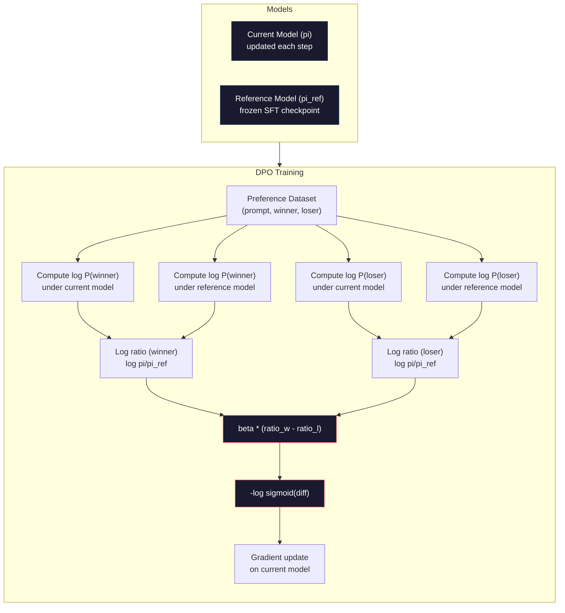

# DPO: Doğrudan Tercih Optimizasyonu

> RLHF çalışıyor. Ayrıca üç modelin (SFT, ödül modeli, politika) eğitilmesini, PPO'nun istikrarsızlığının yönetilmesini ve bir KL cezasının ayarlanmasını gerektirir. DPO şunu soruyor: Peki ya bunların hepsini atlayabilseydiniz? DPO, dil modelini tercih çiftlerine göre doğrudan optimize eder. Ödül modeli yok. PPO yok. Bir eğitim döngüsü. Aynı sonuçlar.

**Tür:** Yapım
**Diller:** Python (numpy ile)
**Önkoşullar:** Aşama 10, Ders 07 (RLHF)
**Süre:** ~90 dakika

## Öğrenme Hedefleri

- Ayrı bir ödül modeli olmadan, tercih çiftlerinde bir dil modelini doğrudan optimize eden DPO eğitimi uygulayın
- DPO loss function'yi türetin ve bunun politikanın günlük olasılıkları aracılığıyla örtülü olarak bir ödül modelini nasıl temsil ettiğini açıklayın
- Eğitim kararlılığı, bilgi işlem maliyeti ve gerekli model sayısı açısından DPO ile RLHF'yi karşılaştırın
- Eğitilen politikanın referans modelden ne kadar uzaklaştığını kontrol etmek için beta parametresini ayarlayın

## Sorun

Ders 07'de bir RLHF boru hattı inşa ettiniz. Üç aşama. Üç model. SFT modeli, ödül modeli ve PPO ile optimize edilmiş politika modeli. Ödül modeli tek başına binlerce insan tercih çiftini ve ayrı bir eğitim döngüsünü gerektiriyordu. PPO, KL katsayısının, öğrenme oranının, klip oranının ve çağ sayısının dikkatli bir şekilde ayarlanmasını gerektiriyordu.

Uygulamada, PPO eğitimi herkesin bildiği gibi dengesizdir. Küçük hiperparametre değişiklikleri eğitimin farklılaşmasına neden olur. Ödül modeli, insan tercihlerinin kusurlu bir temsilcisidir ve politika, onun zayıf noktalarından yararlanmanın yollarını bulur. KL cezası yardımcı olur ancak kendi ayarını gerektirir; çok düşük olursa ödül hackleme alırsınız, çok yüksek olursa model zorlukla öğrenir.

Bu karmaşıklık, InstructGPT'nin yayınlanmasından sonra çoğu açık kaynaklı modelin yıllarca RLHF ile mücadele etmesinin nedenidir. Üç aşamalı boru hattı kırılgandır. Her aşamanın kendi hata modları ve hataların bileşimi vardır.

Mayıs 2023'te Rafael Rafailov, Archit Sharma ve Stanford'daki meslektaşları "Doğrudan Tercih Optimizasyonu: Dil Modeliniz Gizlice Bir Ödül Modelidir" yayınladı. Temel fikir: ayrı bir ödül modeline ihtiyacınız yok. Optimum ödül işlevi, dil modelinin kendi token olasılıklarına göre matematiksel olarak belirlenir. Ödül modelini tamamen atlayabilir ve dil modelini doğrudan tercih çiftlerine göre optimize edebilirsiniz.

DPO, RLHF'yi tek bir denetimli öğrenme adımına indirir. Bir model. Bir loss function. Bir eğitim döngüsü. Takviyeli öğrenme yok. DPO'yu geniş ölçekte kullanan ilk modellerden biri olan Zephyr-7B, çeşitli benchmark'lerde tam RLHF ile eğitilmiş modelleri eşleştirdi veya yendi. Meta, Llama 3'ün hizalama hattının bir parçası olarak DPO'yu kullandı. Anthropic, hizalama araştırmalarında DPO tarzı yöntemlere atıfta bulundu.

## Konsept

### Temel Bilgi

RLHF bu hedefi optimize eder:

```
maximize: E[R(x, y)] - beta * KL(pi || pi_ref)
```

burada R ödül modeli, pi politika, pi_ref referans modeli ve beta KL katsayısıdır.

DPO belgesi, bu hedefin kapalı formda bir optimal çözüme sahip olduğunu gösterdi. Herhangi bir ödül fonksiyonu R için en uygun politika şudur:

```
pi*(y | x) = pi_ref(y | x) * exp(R(x, y) / beta) / Z(x)
```

burada Z(x) bir normalleştirme sabitidir. Yeniden düzenleme:

```
R(x, y) = beta * log(pi*(y | x) / pi_ref(y | x)) + beta * log Z(x)
```

Bu atılımdır. Ödül tamamen politika modelinin olasılıkları ve referans modelin olasılıkları cinsinden ifade edilir. Ayrı bir ödül modeli eğitmenize gerek yok. Ödül olasılık oranında *örtüktür*.

Bunu Bradley-Terry tercih modeline koyarsak:

```
P(y_w > y_l | x) = sigmoid(R(x, y_w) - R(x, y_l))
                  = sigmoid(beta * (log pi(y_w|x)/pi_ref(y_w|x) - log pi(y_l|x)/pi_ref(y_l|x)))
```

Z(x) terimleri iptal edilir çünkü her iki yanıt da aynı prompt x koşuluna bağlıdır. Geriye kalan yalnızca politika modelinin log olasılıklarının ve referans modelinin tercih edilen ve reddedilen yanıtlara ilişkin log olasılıklarının bir fonksiyonudur.

### DPO Kaybı

```
L_DPO = -log(sigmoid(beta * (log pi(y_w|x)/pi_ref(y_w|x) - log pi(y_l|x)/pi_ref(y_l|x))))
```

Her parçayı açalım:

- **y_w** = tercih edilen (kazanan) yanıt
- **y_l** = reddedilen (kaybedilen) yanıt
- **x** = prompt
- **pi** = mevcut model (eğitim altında)
- **pi_ref** = referans modeli (dondurulmuş SFT kontrol noktası)
- **beta** = referanstan sapmayı kontrol eden sıcaklık parametresi (tipik olarak 0,1 ila 0,5)

`log pi(y|x) / pi_ref(y|x)` oranı log-olasılık oranıdır. Bu oran pozitif olduğunda mevcut model, y yanıtına referanstan daha yüksek bir olasılık atar. Negatif olduğunda mevcut model daha düşük olasılık atar.

DPO kaybı, modeli tercih edilen yanıtlar için log-olasılık oranını artırmaya ve reddedilen yanıtlar için ise düşürmeye zorlar. Beta parametresi, modelin referanstan ne kadar agresif bir şekilde sapabileceğini kontrol eder; küçük beta, büyük sapmalara izin verildiği anlamına gelir, büyük beta ise modeli referansa yakın tutar.



### DPO Neden Daha Basittir

| Görünüş | RLHF (PPO) | DPO |
|--------|-----------|-----|
| Eğitilecek modeller | 3 (SFT + ödül + politika) | 1 (yalnızca politika) |
| Eğitim döngüleri | 3 (SFT, RM eğitimi, PPO) | 2 (SFT, DPO) |
| Hiperparametreler | lr, KL katsayısı, klip oranı, RM lr, çağlar x3 | lr, beta, dönemler |
| Ödül modeli | Gerekli (ayrı eğitim) | Model olasılıklarında örtülü |
| RL algoritması | PPO (karmaşık, kararsız) | Denetimli öğrenme (kararlı) |
| GPU belleği | PPO sırasında hafızada 3-4 model | 2 model (güncel + referans) |
| Eğitim istikrarı | Hiperparametrelere duyarlı | Sağlam, SFT'ye benzer |

DPO'nun eğitim sırasında bellekte iki modele ihtiyacı vardır: geçerli model ve donmuş referans. RLHF'nin üç veya dörde ihtiyacı vardır: politika, referans, ödül modeli ve isteğe bağlı olarak değer fonksiyonu temel çizgisi. 70B modeli için FP16'da her kopya 140 GB alır. Ödül modelinin ortadan kaldırılmasıyla elde edilen hafıza tasarrufu oldukça önemlidir.

### DPO RLHF'yi Yendiğinde

**Küçük dataset'ler.** 5.000-20.000 tercih çiftiyle DPO genellikle RLHF ile eşleşir veya onu aşar. RLHF'deki ödül modelinin genelleştirilmesi için yeterli veriye ihtiyacı vardır; sınırlı verilerle aşırı uyum sağlar ve güvenilmez ödül sinyalleri üretir. DPO, bir ödül modeline hiç ihtiyaç duymayarak bu sorunu atlar.

**Sınırlı işlem.** DPO, tam RLHF'nin yaklaşık üçte biri kadar hesaplama gerektirir (üç yerine bir eğitim döngüsü). Büyük GPU kümeleri olmayan ekipler için bu pratik bir seçimdir.

**Hızlı yineleme.** Hangisinin en iyi modeli ürettiğini görmek için 10 farklı dataset tercihini denemek ister misiniz? DPO, her deneyi saatler içinde çalıştırmanıza olanak tanır. RLHF, her dataset için ödül modelinin yeniden eğitilmesini gerektirir.

### RLHF DPO'yu yendiğinde

**Büyük ölçekli eğitim.** GPT-4 veya Claude ölçeğinde, RLHF'nin ayrı ödül modeli daha incelikli tercih sinyallerini yakalayabilir. Ödül modeli, karmaşık kalite kriterlerine uyum sağlayan öğrenilmiş bir loss function gibi davranır.

**Karmaşık ödül sinyalleri.** "Daha iyi" birden fazla boyutu (yardımseverlik, zararsızlık, dürüstlük) içerdiğinde, bir ödül modeli bu çok amaçlı ödünleşimi öğrenebilir. DPO, nedenini modellemeden her tercih çiftini ikili bir sinyal olarak ele alır (biri daha iyi, biri daha kötü).

**Yinelemeli hizalama.** RLHF hatları, mevcut politikayla yeni yanıtlar üretebilir, insanların bunları derecelendirmesini sağlayabilir ve ödül modelini çevrimiçi bir döngüde yeniden eğitebilir. DPO, sabit bir dataset tercih çifti üzerinde çalışır. Anayasal AI (Antropik yaklaşım), RLHF'nin bu yinelemeli özelliğini kapsamlı bir şekilde kullanır.

### DPO'nun ötesinde: KTO, ORPO, SimPO

DPO, basitleştirilmiş hizalama yöntemleri ailesine ilham verdi.

**KTO (Kahneman-Tversky Optimizasyonu, 2024):** Çiftlere bile ihtiyacınız yok. KTO eşleştirilmemiş geri bildirimlerle çalışır; her yanıtı bir alternatifle karşılaştırmadan "iyi" veya "kötü" olarak etiketlemeniz yeterlidir. Bu, veri toplamayı önemli ölçüde basitleştirir. Açıklama yapanlara iki yanıt gösterip "hangisi daha iyi?" diye sormak yerine, tek bir yanıt gösterip "bu iyi mi?" diye sorarsınız. loss function, beklenti teorisinden kayıptan kaçınmayı uygular: kötü tepkiler, iyi tepkilerin ödüllendirilmesinden daha fazla cezalandırılır.

**ORPO (Oran Oranı Tercih Optimizasyonu, 2024):** SFT ve hizalamayı tek bir eğitim adımında birleştirir. ORPO, önce SFT, ardından DPO yapmak yerine, SFT kaybını bir tercih sinyali içerecek şekilde değiştirir. Kaybın iki terimi vardır: tercih edilen yanıtlarda standart bir sonraki token tahmin kaybı ve ayrıca tercih edilen ve reddedilen yanıt olasılıkları arasındaki boşluğu artıran bir olasılık oranı terimi. İki yerine bir eğitim döngüsü.

**SimPO (Basit Tercih Optimizasyonu, 2024):** Referans modelini tamamen ortadan kaldırır. Dondurulmuş bir referansa karşı log-olasılık oranlarını hesaplamak yerine SimPO, örtülü ödül olarak yanıtın ortalama log-olasılığını (uzunluğa göre normalleştirilmiş) kullanır. Bu, hafızadan tasarruf sağlar (referans modele gerek yoktur) ve eğitimi basitleştirir. Uzunluk normalizasyonu, modelin daha kısa yanıtları tercih etmesini engeller.

| Yöntem | Yıl | Bellekteki Modeller | Çiftlere mi ihtiyacınız var? | Referans Gerekiyor mu? | Eğitim Döngüleri |
|--------|------|-----------------|-------------|-----------------|----------------|
| RLHF | 2022 | 3-4 | Evet (RM için) | Evet | 3 |
| DPO | 2023 | 2 | Evet | Evet | 2 |
| KTO | 2024 | 2 | Hayır (eşleştirilmemiş) | Evet | 2 |
| ORPO | 2024 | 1 | Evet | Hayır | 1 |
| SimPO | 2024 | 1 | Evet | Hayır | 1 |

Trend açık: Her yöntem bir parça karmaşıklığı daha ortadan kaldırıyor. RLHF'nin bir ödül modeline ve PPO'ya ihtiyacı vardı. DPO her ikisini de ortadan kaldırdı. KTO eşleştirilmiş verileri ortadan kaldırdı. ORPO ayrı SFT aşamasını ortadan kaldırdı. SimPO referans modeli ortadan kaldırdı. Uyum vergisi (temel modelden uyumlu modele geçmenin bilgi işlem ve karmaşıklık maliyeti) düşmeye devam ediyor.

### Gerçek DPO Deployment'ler

**Zephyr-7B (HuggingFace, Ekim 2023):** Mistral 7B tabanı, UltraChat'te SFT (200K örnekler), ardından UltraFeedback'te DPO (60K tercih çiftleri). O zamanın en yüksek 7B modeli olan MT-Bench'te 6,47 puan aldı. Karşılaştırma için Llama 2 Chat 70B 6,86 puan aldı; bu, Zephyr'in yalnızca DPO hizalaması kullanarak kendi boyutunun 10 katı olan bir modelin %6'sı kadar yakınına ulaştığı anlamına geliyor.

**Llama 3 (Meta, Nisan 2024):** İlk RLHF aşamalarından sonra kullanılan DPO. Kombinasyon, DPO ve RLHF'nin tamamlayıcı olabileceğini öne sürüyor - geniş hizalama için RLHF, hedeflenen iyileştirme için DPO.

**Neural Magic / nm-chat (2024):** Birden fazla açık kaynaklı modele uygulanan DPO, benchmark'lerin hizalanmasında yalnızca SFT taban çizgilerine göre sürekli olarak %5-15 iyileşme gösterdi.

```figure
dpo-loss
```

## İnşa Et

### Adım 1: Tercih Dataset

RLHF ile aynı format -- (prompt, tercih edilir, reddedilir) üçlüleri. DPO, bu verileri bir ara ödül modeli olmaksızın doğrudan tüketir.

```python
import numpy as np
import sys
import os
sys.path.insert(0, os.path.join(os.path.dirname(__file__), "..", "..", "04-pre-training-mini-gpt", "code"))
from main import MiniGPT, LayerNorm, Embedding, TransformerBlock

PREFERENCE_DATA = [
    {
        "prompt": "What is the capital of France?",
        "preferred": "The capital of France is Paris.",
        "rejected": "France is a country in Europe. It has many cities. The capital is Paris. Paris is known for the Eiffel Tower.",
    },
    {
        "prompt": "Explain gravity in one sentence.",
        "preferred": "Gravity is the force that attracts objects with mass toward each other.",
        "rejected": "Gravity is something that makes things fall down when you drop them.",
    },
    {
        "prompt": "What is 15 times 7?",
        "preferred": "15 times 7 is 105.",
        "rejected": "Let me think about this. 15 times 7. Well, 10 times 7 is 70, and 5 times 7 is 35, so the answer might be around 105.",
    },
    {
        "prompt": "Name three programming languages.",
        "preferred": "Python, Rust, and TypeScript.",
        "rejected": "There are many programming languages. Some popular ones include various languages like Python and others.",
    },
    {
        "prompt": "What year did World War II end?",
        "preferred": "World War II ended in 1945.",
        "rejected": "World War II was a major global conflict. It involved many countries. The war ended in the mid-1940s, specifically in 1945.",
    },
    {
        "prompt": "Define machine learning.",
        "preferred": "Machine learning is a field where algorithms learn patterns from data to make predictions without being explicitly programmed.",
        "rejected": "Machine learning is a type of AI. AI stands for artificial intelligence. Machine learning uses data to learn.",
    },
]
```

### Adım 2: Dizi Günlüğü Olasılığı

DPO kaybı, prompt verilen bir yanıtın toplam log olasılığının hesaplanmasını gerektirir. Bu, modeli tam (prompt + yanıt) dizisinde çalıştırmak ve her bir token yanıtının log olasılıklarını toplamak anlamına gelir.

```python
def tokenize_sequence(text, vocab_size=256):
    return [min(t, vocab_size - 1) for t in list(text.encode("utf-8"))]


def compute_sequence_log_prob(model, prompt_tokens, response_tokens, max_seq_len=128):
    full_sequence = prompt_tokens + response_tokens
    if len(full_sequence) > max_seq_len:
        full_sequence = full_sequence[:max_seq_len]

    if len(full_sequence) < 2:
        return 0.0

    input_ids = np.array(full_sequence[:-1]).reshape(1, -1)
    target_ids = np.array(full_sequence[1:])

    logits = model.forward(input_ids)
    logits = logits[0]

    max_logits = logits.max(axis=-1, keepdims=True)
    log_probs = logits - max_logits - np.log(
        np.exp(logits - max_logits).sum(axis=-1, keepdims=True)
    )

    prompt_len = len(prompt_tokens)
    response_start = max(0, prompt_len - 1)
    response_end = len(target_ids)

    if response_start >= response_end:
        return 0.0

    response_log_probs = log_probs[response_start:response_end, :]
    response_targets = target_ids[response_start:response_end]

    total_log_prob = 0.0
    for i, target in enumerate(response_targets):
        total_log_prob += response_log_probs[i, target]

    return total_log_prob
```

Bu işlev DPO'nun en güçlü gücüdür. Her tercih çifti için dört kez çalışır: tercih edilen yanıt üzerine model, reddedilen yanıt üzerine model, tercih edilen yanıt üzerine referans, reddedilen yanıt üzerine referans. Bu, RLHF'nin nesline kıyasla antrenman örneği başına 4 ileri pas + ödül puanlaması + değer tahmini + PPO güncellemesi demektir. Daha basit, daha hızlı, daha kararlı.

### Adım 3: DPO Kaybı

Koddaki makalenin özü. Tek işlev. Bir kayıp. Ödül modeli yok.

```python
def sigmoid(x):
    return np.where(
        x >= 0,
        1.0 / (1.0 + np.exp(-x)),
        np.exp(x) / (1.0 + np.exp(x))
    )


def dpo_loss(policy_logprob_preferred, policy_logprob_rejected,
             ref_logprob_preferred, ref_logprob_rejected, beta=0.1):
    preferred_ratio = policy_logprob_preferred - ref_logprob_preferred
    rejected_ratio = policy_logprob_rejected - ref_logprob_rejected

    logit = beta * (preferred_ratio - rejected_ratio)

    loss = -np.log(sigmoid(logit) + 1e-8)

    preferred_reward = beta * preferred_ratio
    rejected_reward = beta * rejected_ratio

    return loss, {
        "preferred_ratio": float(preferred_ratio),
        "rejected_ratio": float(rejected_ratio),
        "logit": float(logit),
        "implicit_preferred_reward": float(preferred_reward),
        "implicit_rejected_reward": float(rejected_reward),
        "reward_margin": float(preferred_reward - rejected_reward),
    }
```

`preferred_ratio` ve `rejected_ratio`, DPO türetmesinden elde edilen log-olasılık oranlarıdır. Mevcut model, tercih edilen cevaba (referansa göre) daha yüksek olasılık ve reddedilen cevaba daha düşük olasılık atadığında, logit pozitiftir ve kayıp düşüktür. Eğitim sinyali modeli tam olarak bu yöne iter.

`implicit_preferred_reward` ve `implicit_rejected_reward`, DPO kaybının örtülü olarak atadığı ödüllerdir. Eğitimin işe yaradığını doğrulamak için bunları çıkarabilirsiniz; tercih edilen ve reddedilen ödüller arasındaki fark, eğitime göre artmalıdır.

### Adım 4: DPO Eğitim Döngüsü

Standart denetimli bir eğitim döngüsü. PPO yok. Ödül modeli yok. Geçişleri ve gradient güncellemelerini iletmeniz yeterli.

```python
def copy_model_weights(source, target):
    target.embedding.token_embed = source.embedding.token_embed.copy()
    target.embedding.pos_embed = source.embedding.pos_embed.copy()
    target.ln_f.gamma = source.ln_f.gamma.copy()
    target.ln_f.beta = source.ln_f.beta.copy()
    for s_block, t_block in zip(source.blocks, target.blocks):
        t_block.attn.W_q = s_block.attn.W_q.copy()
        t_block.attn.W_k = s_block.attn.W_k.copy()
        t_block.attn.W_v = s_block.attn.W_v.copy()
        t_block.attn.W_out = s_block.attn.W_out.copy()
        t_block.ffn.W1 = s_block.ffn.W1.copy()
        t_block.ffn.W2 = s_block.ffn.W2.copy()
        t_block.ffn.b1 = s_block.ffn.b1.copy()
        t_block.ffn.b2 = s_block.ffn.b2.copy()
        t_block.ln1.gamma = s_block.ln1.gamma.copy()
        t_block.ln1.beta = s_block.ln1.beta.copy()
        t_block.ln2.gamma = s_block.ln2.gamma.copy()
        t_block.ln2.beta = s_block.ln2.beta.copy()


def dpo_train(policy_model, reference_model, preference_data,
              num_epochs=5, lr=5e-6, beta=0.1, max_seq_len=128):
    print(f"DPO Training: {len(preference_data)} pairs, {num_epochs} epochs, "
          f"lr={lr}, beta={beta}")
    print()

    losses = []
    margins = []

    for epoch in range(num_epochs):
        epoch_loss = 0.0
        epoch_margin = 0.0
        num_examples = 0

        indices = np.random.permutation(len(preference_data))

        for idx in indices:
            pair = preference_data[idx]

            prompt_tokens = tokenize_sequence(pair["prompt"])
            preferred_tokens = tokenize_sequence(pair["preferred"])
            rejected_tokens = tokenize_sequence(pair["rejected"])

            pi_logprob_w = compute_sequence_log_prob(
                policy_model, prompt_tokens, preferred_tokens, max_seq_len
            )
            pi_logprob_l = compute_sequence_log_prob(
                policy_model, prompt_tokens, rejected_tokens, max_seq_len
            )
            ref_logprob_w = compute_sequence_log_prob(
                reference_model, prompt_tokens, preferred_tokens, max_seq_len
            )
            ref_logprob_l = compute_sequence_log_prob(
                reference_model, prompt_tokens, rejected_tokens, max_seq_len
            )

            loss, metrics = dpo_loss(
                pi_logprob_w, pi_logprob_l,
                ref_logprob_w, ref_logprob_l, beta
            )

            update_direction = 1.0 if metrics["logit"] < 0 else -0.1
            for block in policy_model.blocks:
                block.ffn.W1 += lr * update_direction * np.random.randn(*block.ffn.W1.shape) * 0.01
                block.ffn.W2 += lr * update_direction * np.random.randn(*block.ffn.W2.shape) * 0.01

            epoch_loss += loss
            epoch_margin += metrics["reward_margin"]
            num_examples += 1
            losses.append(float(loss))
            margins.append(metrics["reward_margin"])

        avg_loss = epoch_loss / max(num_examples, 1)
        avg_margin = epoch_margin / max(num_examples, 1)

        print(f"  Epoch {epoch + 1}/{num_epochs} | Loss: {avg_loss:.4f} | "
              f"Avg Margin: {avg_margin:.4f}")

    return policy_model, losses, margins
```

Eğitim döngüsü RLHF'ye kıyasla canlandırıcı derecede basittir. Her tercih çifti için: dört günlük olasılığını hesaplayın (iki model, iki yanıt), bunları DPO kaybına bağlayın, gradient'yi hesaplayın, politikayı güncelleyin. Nesil adımı yok. Ödül modeli yok inference. Avantaj tahmini yok. Kırpma yok.

### Adım 5: DPO ile RLHF'yi karşılaştırın

DPO'yu Ders 07'deki RLHF modeliyle karşılaştırmak için örtülü ödül marjlarını ve log-olasılık değişimlerini ölçün.

```python
def evaluate_preference_accuracy(model, reference_model, preference_data, beta=0.1, max_seq_len=128):
    correct = 0
    total = 0

    for pair in preference_data:
        prompt_tokens = tokenize_sequence(pair["prompt"])
        preferred_tokens = tokenize_sequence(pair["preferred"])
        rejected_tokens = tokenize_sequence(pair["rejected"])

        pi_w = compute_sequence_log_prob(model, prompt_tokens, preferred_tokens, max_seq_len)
        pi_l = compute_sequence_log_prob(model, prompt_tokens, rejected_tokens, max_seq_len)
        ref_w = compute_sequence_log_prob(reference_model, prompt_tokens, preferred_tokens, max_seq_len)
        ref_l = compute_sequence_log_prob(reference_model, prompt_tokens, rejected_tokens, max_seq_len)

        preferred_reward = beta * (pi_w - ref_w)
        rejected_reward = beta * (pi_l - ref_l)

        if preferred_reward > rejected_reward:
            correct += 1
        total += 1

    return correct / max(total, 1)


def analyze_implicit_rewards(model, reference_model, preference_data, beta=0.1, max_seq_len=128):
    print("Implicit Reward Analysis:")
    print("-" * 65)
    print(f"  {'Prompt':<30} {'Pref Reward':>12} {'Rej Reward':>12} {'Margin':>10}")
    print("  " + "-" * 60)

    for pair in preference_data:
        prompt_tokens = tokenize_sequence(pair["prompt"])
        preferred_tokens = tokenize_sequence(pair["preferred"])
        rejected_tokens = tokenize_sequence(pair["rejected"])

        pi_w = compute_sequence_log_prob(model, prompt_tokens, preferred_tokens, max_seq_len)
        pi_l = compute_sequence_log_prob(model, prompt_tokens, rejected_tokens, max_seq_len)
        ref_w = compute_sequence_log_prob(reference_model, prompt_tokens, preferred_tokens, max_seq_len)
        ref_l = compute_sequence_log_prob(reference_model, prompt_tokens, rejected_tokens, max_seq_len)

        pref_reward = beta * (pi_w - ref_w)
        rej_reward = beta * (pi_l - ref_l)
        margin = pref_reward - rej_reward

        truncated = pair["prompt"][:28] + ".." if len(pair["prompt"]) > 30 else pair["prompt"]
        print(f"  {truncated:<30} {pref_reward:>12.4f} {rej_reward:>12.4f} {margin:>10.4f}")

    print()
```

### Adım 6: Beta Duyarlılık Analizi

Beta parametresi DPO'nun RLHF'deki KL katsayısına eşdeğeridir. Modelin referanstan ne kadar sapabileceğini kontrol eder. Bu deney etkisini gösteriyor.

```python
def beta_sensitivity_analysis(sft_model, preference_data, betas, max_seq_len=128):
    print("Beta Sensitivity Analysis")
    print("-" * 60)
    print(f"  {'Beta':>8} {'Final Loss':>12} {'Final Margin':>14} {'Accuracy':>10}")
    print("  " + "-" * 55)

    results = []

    for beta in betas:
        policy = MiniGPT(
            vocab_size=256, embed_dim=128, num_heads=4,
            num_layers=4, max_seq_len=max_seq_len, ff_dim=512
        )
        reference = MiniGPT(
            vocab_size=256, embed_dim=128, num_heads=4,
            num_layers=4, max_seq_len=max_seq_len, ff_dim=512
        )
        copy_model_weights(sft_model, policy)
        copy_model_weights(sft_model, reference)

        policy, losses, margins_list = dpo_train(
            policy, reference, preference_data,
            num_epochs=3, lr=5e-6, beta=beta, max_seq_len=max_seq_len
        )

        accuracy = evaluate_preference_accuracy(
            policy, reference, preference_data, beta, max_seq_len
        )

        final_loss = losses[-1] if losses else 0
        final_margin = margins_list[-1] if margins_list else 0

        print(f"  {beta:>8.3f} {final_loss:>12.4f} {final_margin:>14.4f} {accuracy:>10.1%}")
        results.append({
            "beta": beta,
            "final_loss": final_loss,
            "final_margin": final_margin,
            "accuracy": accuracy,
        })

        print()

    return results
```

Küçük beta (0,01), modelin referanstan serbestçe sapmasına olanak tanır; hızlı öğrenme ancak dejenere çözüm riski. Büyük beta (1.0), modeli referansa yakın tutar; istikrarlı ancak yavaş öğrenme. Çoğu uygulama için tatlı nokta 0,1 ila 0,3'tür.

## Kullan onu

### Tam DPO Ardışık Düzen Demosu

```python
if __name__ == "__main__":
    np.random.seed(42)

    print("=" * 70)
    print("DPO: DIRECT PREFERENCE OPTIMIZATION")
    print("=" * 70)
    print()

    print("STEP 1: Initialize SFT Model (from Lesson 06)")
    print("-" * 50)
    sft_model = MiniGPT(
        vocab_size=256, embed_dim=128, num_heads=4,
        num_layers=4, max_seq_len=128, ff_dim=512
    )
    print(f"  Parameters: {sft_model.count_parameters():,}")
    print()

    print("STEP 2: DPO Training")
    print("-" * 50)

    policy_model = MiniGPT(
        vocab_size=256, embed_dim=128, num_heads=4,
        num_layers=4, max_seq_len=128, ff_dim=512
    )
    reference_model = MiniGPT(
        vocab_size=256, embed_dim=128, num_heads=4,
        num_layers=4, max_seq_len=128, ff_dim=512
    )
    copy_model_weights(sft_model, policy_model)
    copy_model_weights(sft_model, reference_model)

    policy_model, losses, margins = dpo_train(
        policy_model, reference_model, PREFERENCE_DATA,
        num_epochs=5, lr=5e-6, beta=0.1
    )
    print()

    print("=" * 70)
    print("STEP 3: Evaluate")
    print("=" * 70)
    print()

    pre_accuracy = evaluate_preference_accuracy(
        sft_model, reference_model, PREFERENCE_DATA, beta=0.1
    )
    post_accuracy = evaluate_preference_accuracy(
        policy_model, reference_model, PREFERENCE_DATA, beta=0.1
    )

    print(f"  Preference accuracy (pre-DPO):  {pre_accuracy:.1%}")
    print(f"  Preference accuracy (post-DPO): {post_accuracy:.1%}")
    print()

    analyze_implicit_rewards(policy_model, reference_model, PREFERENCE_DATA, beta=0.1)

    print("=" * 70)
    print("STEP 4: Training Dynamics")
    print("=" * 70)
    print()

    if losses:
        print("  Loss curve:")
        window = max(1, len(losses) // 5)
        for i in range(0, len(losses), window):
            chunk = losses[i:i + window]
            avg = sum(chunk) / len(chunk)
            print(f"    Steps {i:3d}-{i + len(chunk) - 1:3d}: loss = {avg:.4f}")
        print()

    if margins:
        print("  Reward margin curve:")
        window = max(1, len(margins) // 5)
        for i in range(0, len(margins), window):
            chunk = margins[i:i + window]
            avg = sum(chunk) / len(chunk)
            print(f"    Steps {i:3d}-{i + len(chunk) - 1:3d}: margin = {avg:.4f}")
        print()

    print("=" * 70)
    print("STEP 5: Beta Sensitivity")
    print("=" * 70)
    print()

    beta_results = beta_sensitivity_analysis(
        sft_model, PREFERENCE_DATA, betas=[0.01, 0.1, 0.3, 1.0]
    )

    print("=" * 70)
    print("DPO vs RLHF COMPARISON")
    print("=" * 70)
    print()
    print("  DPO advantages:")
    print("    - 1 training loop (vs 3 for RLHF)")
    print("    - 2 models in memory (vs 3-4 for RLHF)")
    print("    - Supervised learning (vs RL, more stable)")
    print("    - No reward model to train or maintain")
    print()
    print("  RLHF advantages:")
    print("    - Separate reward model captures complex preferences")
    print("    - Online learning: generate, rate, retrain")
    print("    - Better for multi-objective alignment")
    print("    - Proven at largest scales (GPT-4, Claude)")
    print()
    print("  Practical guidance:")
    print("    - Start with DPO. It's simpler and often sufficient.")
    print("    - Switch to RLHF if DPO plateaus on your eval metrics.")
    print("    - Many production systems use both: RLHF first, DPO to refine.")
```

## Gönderin

Bu ders, kullanım durumunuz için doğru hizalama yöntemini (SFT, RLHF, DPO, KTO, ORPO, SimPO) seçmenize yardımcı olan bir prompt olan `outputs/prompt-alignment-method-selector.md`'yi üretir. Veri kullanılabilirliğiniz, bilgi işlem bütçeniz ve uyum hedefleriniz göz önüne alındığında, bir yöntem ve eğitim planı önerir.

## Egzersizler

1. KTO'yu (Kahneman-Tversky Optimizasyonu) uygulayın. KTO'nun çiftlere ihtiyacı yoktur; her yanıtı "iyi" veya "kötü" olarak etiketlemeniz yeterlidir. İyi bir yanıt için kayıp `-log(sigmoid(beta * log_ratio))`'dir ve kötü bir yanıt için kayıp, kötü yanıt kaybı üzerindeki kayıptan kaçınma çarpanıyla (tipik olarak 1,5x) `-log(1 - sigmoid(beta * log_ratio))`'dir. Aynı veriler üzerinde eğitim alın (bağımsız olarak "iyi" olarak tercih edilen ve "kötü" olarak reddedilen muamele) ve doğruluğu DPO ile karşılaştırın.

2. Uzunluğa göre normalleştirilmiş DPO'yu uygulayın. Ham log olasılıkları yerine token yanıt sayısına bölün: `normalized_logprob = total_logprob / num_tokens`. Bu, modelin daha kısa yanıtları (toplam log-olasılığı daha yüksek olan) tercih etmesini engeller. Örtülü ödül marjlarını normalleştirmeli ve normalleştirmesiz karşılaştırın.

3. ORPO tarzı birleştirilmiş kayıp oluşturun. DPO kaybına tercih edilen yanıta standart bir next-token tahmin kaybı ekleyin: `L = L_sft(preferred) + alpha * L_dpo`. 0,1, 0,5 ve 1,0 alfa değerlerini deneyin. Birleşik kayıp, hem talimatları takip eden (SFT teriminden) hem de daha iyi yanıtları tercih eden (DPO teriminden) bir model üreterek ayrı bir SFT aşamasına olan ihtiyacı ortadan kaldırmalıdır.

4. Yinelemeli DPO'yu uygulayın. DPO'yu 3 dönem boyunca çalıştırın, ardından eğitilen modelden yeni yanıtlar oluşturun, bunları yeni tercih çiftleri olarak orijinal tercih edilen yanıtlarla eşleştirin ve DPO'yu yeniden çalıştırın. Bu "kendi kendine oynama" sürecinin iki turu. Yinelemeli iyileştirmenin yardımcı olup olmadığını görmek için 1. tur ve 2. turdan sonra tercih doğruluğunu karşılaştırın.

5. DPO'yu farklı referans modelleriyle karşılaştırın. Referans olarak SFT kontrol noktasını kullanmak yerine şunları deneyin: (a) temel modeli (SFT öncesi), (b) DPO'nun 1. döneminden bir kontrol noktası, (c) politika modelinin üstel hareketli ortalamasını. Hangi referansın en yüksek tercih doğruluğunu ve en istikrarlı eğitim eğrisini ürettiğini bildirin.

## Anahtar Terimler

| Dönem | İnsanlar ne diyor | Aslında ne anlama geliyor |
|------|----------------|----------------------|
| DPO | "RL'siz RLHF" | Doğrudan Tercih Optimizasyonu: ödül modelini ve PPO'yu atlayarak dil modelini doğrudan tercih çiftlerine göre optimize eden denetimli bir öğrenme algoritması |
| Örtülü ödül | "Ödül modeldedir" | Ödül işlevi, politika ve referans modelleri arasındaki log-olasılık oranıyla belirlenir; ayrı bir ödül modeline gerek yoktur |
| Beta (DPO) | "Sıcaklık" | Politikanın referans modelden ne kadar sapabileceğini kontrol eder - küçük beta büyük sapmalara izin verir, büyük beta ise modeli yakın tutar |
| Log-olasılık oranı | "Model ne kadar değişti" | log pi(y\|x) - log pi_ref(y\|x) -- pozitif, mevcut modelin referans |
| Referans modeli | "Donmuş kontrol noktası" | Ağırlıkları hiçbir zaman değişmeyen SFT modelinin bir kopyası, olasılık oranlarının hesaplanmasında dayanak noktası görevi görür |
| KTO | "Çiftsiz DPO" | Kahneman-Tversky Optimizasyonu: tercih çiftleri gerektirmek yerine eşleştirilmemiş "iyi" veya "kötü" etiketlerle çalışır |
| ORPO | "Tek adımlı hizalama" | Oran Oranı Tercih Optimizasyonu: SFT kaybına bir tercih terimi ekleyerek SFT ve hizalamayı tek bir eğitim döngüsünde birleştirir |
| SimPO | "Referansa gerek yok" | Basit Tercih Optimizasyonu: örtülü ödül olarak uzunluğa normalleştirilmiş ortalama log-olasılığını kullanarak referans modelini ortadan kaldırır |
| Uyum vergisi | "Modelleri güvenli hale getirmenin maliyeti" | Temel modelden uyumlu modele geçmek için gereken ek bilgi işlem, veri ve karmaşıklık - DPO bunu önemli ölçüde azaltır |

## Daha Fazla Okuma

- [Rafailov ve diğerleri, 2023 -- "Doğrudan Tercih Optimizasyonu: Dil Modeliniz Gizlice Bir Ödül Modelidir"](https://arxiv.org/abs/2305.18290) -- RLHF'den denetimli öğrenmeye uyumlamayı basitleştiren DPO makalesi
- [Tunstall ve diğerleri, 2023 -- "Zephyr: LM Hizalamasının Doğrudan Distilasyonu"](https://arxiv.org/abs/2310.16944) -- Zephyr-7B, UltraFeedback'teki DPO'nun benchmark'lerdeki RLHF ile eşleştiğini gösteriyor
- [Ethayarajh ve diğerleri, 2024 -- "KTO: Olasılık Teorik Optimizasyonu Olarak Model Hizalaması"](https://arxiv.org/abs/2402.01306) -- eşleştirilmiş tercihlere olan ihtiyacı ortadan kaldırır
- [Hong ve diğerleri, 2024 -- "ORPO: Referans Modeli Olmayan Monolitik Tercih Optimizasyonu"](https://arxiv.org/abs/2403.07691) -- SFT ve hizalamayı tek adımda birleştiriyor
- [Meng ve diğerleri, 2024 -- "SimPO: Referanssız Ödüllü Basit Tercih Optimizasyonu"](https://arxiv.org/abs/2405.14734) -- referans modelini tamamen ortadan kaldırmak
- [Llama 3 Teknik Raporu](https://arxiv.org/abs/2407.21783) -- Meta'nın RLHF ve DPO'yu birleştiren hizalama hattı
