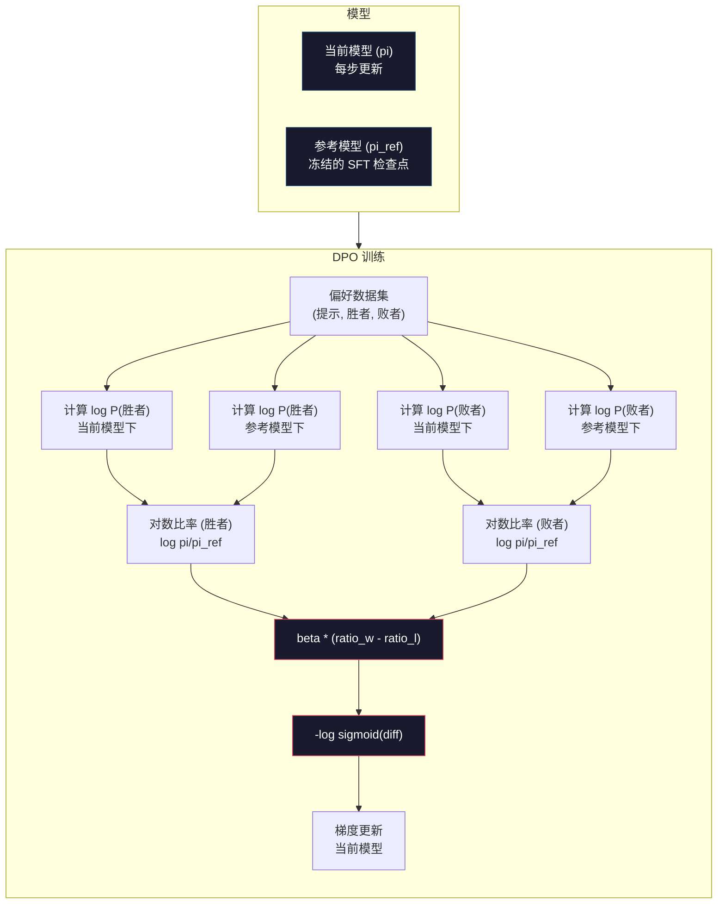

# DPO：直接偏好优化（Direct Preference Optimization）

> RLHF 虽然有效，但它需要训练三个模型（SFT、奖励模型、策略模型），管理 PPO 的不稳定性，并调整 KL 惩罚系数。DPO 提出：如果能跳过所有这些步骤呢？DPO 直接在偏好对（preference pairs）上优化语言模型。无需奖励模型，无需 PPO，只需一次训练循环，效果相同。

**类型:** Build
**语言:** Python（使用 numpy）
**前置条件:** 阶段 10，第 07 课（RLHF）
**时间:** ~90 分钟

## 学习目标

- 实现 DPO 训练，直接在偏好对上优化语言模型，无需单独的奖励模型
- 推导 DPO 损失函数，并解释它如何通过策略的对数概率隐式地表示奖励模型
- 从训练稳定性、计算成本和所需模型数量方面比较 DPO 与 RLHF
- 调整 beta 参数以控制训练策略与参考模型（reference model）的偏差程度

## 问题

你在第 07 课中构建了一个 RLHF 流程。三个阶段，三个模型：SFT 模型、奖励模型（reward model）和用 PPO 优化的策略模型（policy model）。仅奖励模型就需要数千个人类偏好对和单独的训练循环。PPO 需要仔细调整 KL 系数、学习率、裁剪比率和训练 epoch 数。

在实践中，PPO 训练出了名的不稳定。微小的超参数变化就可能导致训练发散。奖励模型只是人类偏好的一种不完美代理，策略会找到利用其弱点的方法。KL 惩罚虽然有用，但需要单独调优——设置过低会导致奖励破解（reward hacking），过高则模型几乎学不到任何东西。

正因为这种复杂性，在 InstructGPT 发布后的几年里，大多数开源模型在 RLHF 上挣扎不已。三阶段流程非常脆弱，每个阶段都有各自的失败模式，并且错误会不断累积。

2023 年 5 月，斯坦福大学的 Rafael Rafailov、Archit Sharma 及其同事发表了《直接偏好优化：你的语言模型秘密地是一个奖励模型》（Direct Preference Optimization: Your Language Model is Secretly a Reward Model）。关键洞察：你不需要一个单独的奖励模型。最优奖励函数在数学上由语言模型自身的 token 概率决定。你可以完全跳过奖励模型，直接在偏好对上优化语言模型。

DPO 将 RLHF 简化为一个监督学习步骤：一个模型，一个损失函数，一次训练循环，无需强化学习。Zephyr-7B 是最早大规模使用 DPO 的模型之一，在多个基准测试中与使用完整 RLHF 训练的模型相当甚至更优。Meta 将 DPO 作为 Llama 3 对齐流程的一部分。Anthropic 在其对齐研究中引用了 DPO 风格的方法。

## 概念

### 关键洞察

RLHF 优化以下目标：

```
最大化: E[R(x, y)] - beta * KL(pi || pi_ref)
```

其中 R 是奖励模型，pi 是策略，pi_ref 是参考模型，beta 是 KL 系数。

DPO 论文表明该目标存在闭式最优解。对于任何奖励函数 R，最优策略为：

```
pi*(y | x) = pi_ref(y | x) * exp(R(x, y) / beta) / Z(x)
```

其中 Z(x) 是归一化常数。重新排列：

```
R(x, y) = beta * log(pi*(y | x) / pi_ref(y | x)) + beta * log Z(x)
```

这就是突破点。奖励完全用策略模型概率和参考模型概率来表示。你不需要训练单独的奖励模型。奖励*隐式地*存在于概率比中。

将其代入 Bradley-Terry 偏好模型：

```
P(y_w > y_l | x) = sigmoid(R(x, y_w) - R(x, y_l))
                  = sigmoid(beta * (log pi(y_w|x)/pi_ref(y_w|x) - log pi(y_l|x)/pi_ref(y_l|x)))
```

Z(x) 项相互抵消，因为两个响应都基于相同的提示 x。剩下的是仅与策略模型在偏好响应和被拒绝响应上的对数概率以及参考模型的对数概率有关的函数。

### DPO 损失

```
L_DPO = -log(sigmoid(beta * (log pi(y_w|x)/pi_ref(y_w|x) - log pi(y_l|x)/pi_ref(y_l|x))))
```

我们来拆解每一部分：

- **y_w** = 偏好（获胜）响应
- **y_l** = 拒绝（失败）响应
- **x** = 提示
- **pi** = 当前模型（正在训练）
- **pi_ref** = 参考模型（冻结的 SFT 检查点）
- **beta** = 控制偏离参考程度的温度参数（通常 0.1 到 0.5）

比率 `log pi(y|x) / pi_ref(y|x)` 是对数概率比。当该比率为正时，当前模型对响应 y 分配的概率高于参考模型；为负时则更低。

DPO 损失推动模型增加偏好响应的对数概率比，降低拒绝响应的对数概率比。beta 参数控制模型偏离参考的激进程度——beta 小则允许大幅偏离，beta 大则使模型接近参考。



### DPO 为何更简单

| 方面 | RLHF (PPO) | DPO |
|--------|-----------|-----|
| 需要训练的模型 | 3（SFT + 奖励 + 策略） | 1（仅策略） |
| 训练循环 | 3（SFT, RM 训练, PPO） | 2（SFT, DPO） |
| 超参数 | lr, KL 系数, 裁剪比率, RM lr, epoch x3 | lr, beta, epoch |
| 奖励模型 | 需要（单独训练） | 隐式存在于模型概率中 |
| 强化学习算法 | PPO（复杂、不稳定） | 监督学习（稳定） |
| GPU 内存 | PPO 期间 3-4 个模型在内存 | 2 个模型（当前 + 参考） |
| 训练稳定性 | 对超参数敏感 | 鲁棒，类似 SFT |

DPO 训练期间需要两个模型在内存：当前模型和冻结的参考模型。RLHF 需要三个或四个：策略、参考、奖励模型，以及可选的基准价值函数。对于 70B 模型，每个副本在 FP16 下占用 140GB。消除奖励模型带来的内存节省非常显著。

### DPO 何时优于 RLHF

**小数据集。** 对于 5000-20000 个偏好对，DPO 通常匹配或超越 RLHF。RLHF 中的奖励模型需要足够的数据来泛化——数据有限时它会过拟合，产生不可靠的奖励信号。DPO 完全不需要奖励模型，绕过了这个问题。

**有限的计算资源。** DPO 大约需要完整 RLHF 三分之一的计算量（一次训练循环而非三次）。对于缺乏大型 GPU 集群的团队来说，这是实际的选择。

**快速迭代。** 想尝试 10 个不同的偏好数据集，看看哪个产生最佳模型？DPO 让你可以在几小时内完成每个实验。RLHF 需要为每个数据集重新训练奖励模型。

### RLHF 何时优于 DPO

**大规模训练。** 在 GPT-4 或 Claude 的规模上，RLHF 的独立奖励模型可以捕捉更细微的偏好信号。奖励模型作为一个学习到的损失函数，能够适应复杂的质量标准。

**复杂的奖励信号。** 当“更好”涉及多个维度（有用性、无害性、诚实性）时，奖励模型可以学习这种多目标权衡。DPO 将每个偏好对视为二元信号（一个更好，一个更差），而不建模原因。

**迭代对齐。** RLHF 流程可以用当前策略生成新响应，让人类评分，然后在线循环中重新训练奖励模型。DPO 在固定的偏好对数据集上工作。Anthropic 的宪法 AI（Constitutional AI）广泛利用了 RLHF 的这种迭代特性。

### 超越 DPO：KTO、ORPO、SimPO

DPO 启发了一系列简化的对齐方法。

**KTO（卡尼曼-特沃斯基优化，2024）：** 你甚至不需要配对。KTO 使用非配对反馈——只需将每个响应标记为“好”或“坏”，无需与替代方案比较。这大大简化了数据收集。你不用让标注者看两个响应并问“哪个更好？”，而是展示一个响应并问“这个好吗？”。损失函数运用了前景理论中的损失厌恶：坏响应受到的惩罚比好响应获得的奖励更多。

**ORPO（优势比偏好优化，2024）：** 将 SFT 和对齐结合为单一训练步骤。ORPO 不先进行 SFT 再进行 DPO，而是修改 SFT 损失以包含偏好信号。损失有两个项：一个是对偏好响应的标准下一个词预测损失，另一个是增加偏好和被拒绝响应概率之间差距的优势比项。一次训练循环替代两次。

**SimPO（简单偏好优化，2024）：** 完全消除了参考模型。SimPO 不使用与冻结参考的对数概率比，而是将响应的平均对数概率（按长度归一化）作为隐式奖励。这节省了内存（不需要参考模型）并简化了训练。长度归一化防止模型偏向更短的响应。

| 方法 | 年份 | 内存中的模型数量 | 是否需要配对？ | 是否需要参考？ | 训练循环数 |
|--------|------|-----------------|-------------|-----------------|----------------|
| RLHF | 2022 | 3-4 | 是（用于 RM） | 是 | 3 |
| DPO | 2023 | 2 | 是 | 是 | 2 |
| KTO | 2024 | 2 | 否（非配对） | 是 | 2 |
| ORPO | 2024 | 1 | 是 | 否 | 1 |
| SimPO | 2024 | 1 | 是 | 否 | 1 |

趋势很明确：每种方法都消除了更多复杂性。RLHF 需要奖励模型和 PPO。DPO 消除了两者。KTO 消除了配对数据。ORPO 消除了独立的 SFT 阶段。SimPO 消除了参考模型。对齐税——从基础模型到对齐模型所需的计算和复杂性成本——持续下降。

### 真实的 DPO 部署案例

**Zephyr-7B（HuggingFace，2023 年 10 月）：** 基于 Mistral 7B，在 UltraChat（20 万样本）上进行 SFT，然后在 UltraFeedback（6 万个偏好对）上进行 DPO。在 MT-Bench 上得分为 6.47——当时最高的 7B 模型。相比之下，Llama 2 Chat 70B 得分为 6.86，意味着 Zephyr 仅使用 DPO 对齐就达到了比它大 10 倍的模型 94% 的性能。

**Llama 3（Meta，2024 年 4 月）：** 在初始 RLHF 阶段后使用了 DPO。这种组合表明 DPO 和 RLHF 可以互补——RLHF 用于广泛对齐，DPO 用于针对性细化。

**Neural Magic / nm-chat（2024）：** 将 DPO 应用于多个开源模型，在对齐基准测试上始终比仅 SFT 的基线高出 5-15%。

## 动手实践

### 第 1 步：偏好数据集

与 RLHF 格式相同——（提示，偏好，拒绝）三元组。DPO 直接使用这些数据，无需中间奖励模型。

```python
import numpy as np
import sys
import os
sys.path.insert(0, os.path.join(os.path.dirname(__file__), "..", "..", "04-pre-training-mini-gpt", "code"))
from main import MiniGPT, LayerNorm, Embedding, TransformerBlock

PREFERENCE_DATA = [
    {
        "prompt": "法国首都是什么？",
        "preferred": "法国首都是巴黎。",
        "rejected": "法国是一个欧洲国家。它有很多城市。首都是巴黎。巴黎以埃菲尔铁塔闻名。",
    },
    {
        "prompt": "用一句话解释引力。",
        "preferred": "引力是使有质量的物体相互吸引的力。",
        "rejected": "引力是让东西掉下来的东西。",
    },
    {
        "prompt": "15 乘以 7 等于多少？",
        "preferred": "15 乘以 7 等于 105。",
        "rejected": "让我想想。15 乘以 7。嗯，10 乘以 7 是 70，5 乘以 7 是 35，所以答案大概是 105。",
    },
    {
        "prompt": "举出三种编程语言。",
        "preferred": "Python、Rust 和 TypeScript。",
        "rejected": "有很多编程语言。一些流行的语言包括各种语言，比如 Python 和其他。",
    },
    {
        "prompt": "二战是哪一年结束的？",
        "preferred": "二战于 1945 年结束。",
        "rejected": "二战是一场重大的全球冲突。涉及许多国家。战争于 20 世纪 40 年代中期结束，确切地说是 1945 年。",
    },
    {
        "prompt": "定义机器学习。",
        "preferred": "机器学习是一个算法从数据中学习模式以进行预测而不被显式编程的领域。",
        "rejected": "机器学习是一种 AI。AI 代表人工智能。机器学习使用数据进行学习。",
    },
]
```

### 第 2 步：序列对数概率

DPO 损失需要计算给定提示下响应的总对数概率。这意味着对完整的（提示 + 响应）序列运行模型，并对每个响应 token 的对数概率求和。

```python
def tokenize_sequence(text, vocab_size=256):
    return [min(t, vocab_size - 1) for t in list(text.encode("utf-8"))]


def compute_sequence_log_prob(model, prompt_tokens, response_tokens, max_seq_len=128):
    full_sequence = prompt_tokens + response_tokens
    if len(full_sequence) > max_seq_len:
        full_sequence = full_sequence[:max_seq_len]

    if len(full_sequence) < 2:
        return 0.0

    input_ids = np.array(full_sequence[:-1]).reshape(1, -1)
    target_ids = np.array(full_sequence[1:])

    logits = model.forward(input_ids)
    logits = logits[0]

    max_logits = logits.max(axis=-1, keepdims=True)
    log_probs = logits - max_logits - np.log(
        np.exp(logits - max_logits).sum(axis=-1, keepdims=True)
    )

    prompt_len = len(prompt_tokens)
    response_start = max(0, prompt_len - 1)
    response_end = len(target_ids)

    if response_start >= response_end:
        return 