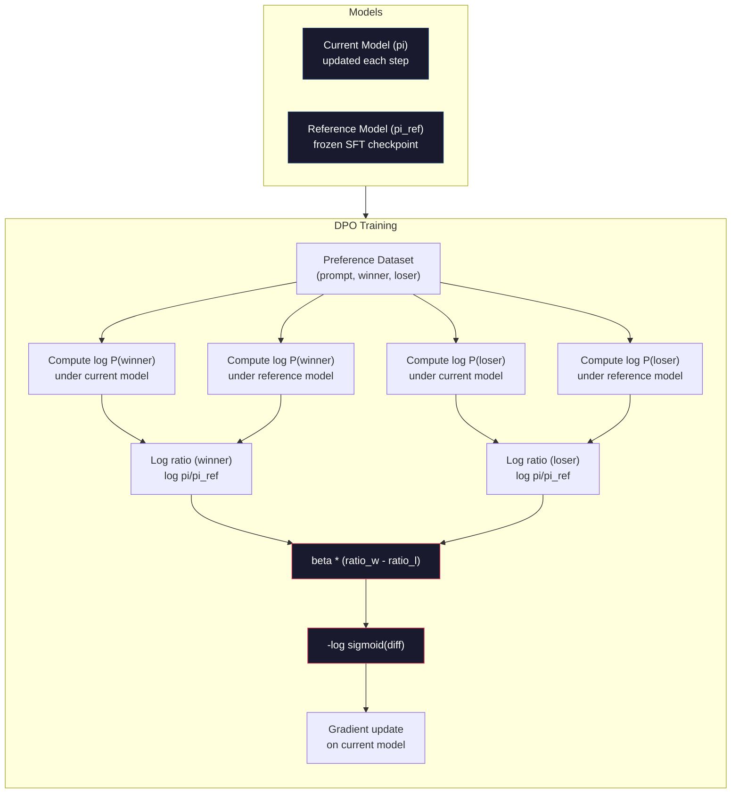

# 08 · DPO：直接偏好优化

> 「人类反馈强化学习（RLHF）」是有效的，但它需要训练三个模型（SFT、奖励模型、策略模型），还要应对 PPO 的不稳定性，并调一个 KL 惩罚项。DPO 提出了一个问题：如果能把这些全部跳过会怎样？DPO 直接在偏好对（preference pairs）上优化语言模型。不需要奖励模型，不需要 PPO，只有一个训练循环，却能得到同样的效果。

**类型：** 构建
**语言：** Python（配合 numpy）
**前置：** 第 10 阶段，第 07 课（RLHF）
**时长：** 约 90 分钟

## 学习目标

- 实现 DPO 训练，直接在偏好对上优化语言模型，无需单独的奖励模型
- 推导 DPO 损失函数，并解释它如何通过策略模型的对数概率隐式地表示一个奖励模型
- 从训练稳定性、计算成本以及所需模型数量三个维度对比 DPO 与 RLHF
- 调节 beta 参数，以控制训练后的策略偏离参考模型的程度

## 问题所在

你在第 07 课构建了一条 RLHF 流水线：三个阶段、三个模型。SFT 模型、奖励模型，以及用 PPO 优化的策略模型。仅奖励模型一项就需要数千组人类偏好对和一个单独的训练循环。PPO 则需要细致地调节 KL 系数、学习率、裁剪比例（clip ratio）以及训练轮数。

实际上，PPO 训练的不稳定性是出了名的。超参数的微小改动就会导致训练发散。奖励模型是对人类偏好的一个不完美的代理，而策略模型总能找到办法去钻它弱点的空子。KL 惩罚项有所帮助，但它本身又需要调参——太低会出现「奖励作弊（reward hacking）」，太高则模型几乎学不到东西。

正是这种复杂性，导致在 InstructGPT 发表后的好几年里，大多数开源模型在 RLHF 上举步维艰。这条三阶段流水线很脆弱。每个阶段都有各自的失败模式，错误会层层累积。

2023 年 5 月，斯坦福的 Rafael Rafailov、Archit Sharma 及其同事发表了《Direct Preference Optimization: Your Language Model is Secretly a Reward Model》（《直接偏好优化：你的语言模型其实就是一个奖励模型》）。其核心洞见是：你并不需要一个单独的奖励模型。最优奖励函数在数学上完全由语言模型自身的 token 概率所决定。你可以彻底跳过奖励模型，直接在偏好对上优化语言模型。

DPO 把 RLHF 简化为单一的监督学习步骤。一个模型、一个损失函数、一个训练循环，不涉及强化学习。Zephyr-7B 是最早大规模采用 DPO 的模型之一，它在多个基准测试上达到或超过了用完整 RLHF 训练的模型。Meta 将 DPO 用作 Llama 3 对齐流水线的一部分。Anthropic 在其对齐研究中也引用过 DPO 风格的方法。

## 核心概念

### 关键洞见

RLHF 优化的目标是：

```
maximize: E[R(x, y)] - beta * KL(pi || pi_ref)
```

其中 R 是奖励模型，pi 是策略，pi_ref 是参考模型，beta 是 KL 系数。

DPO 论文证明，这个目标存在闭式（closed-form）最优解。对于任意奖励函数 R，最优策略为：

```
pi*(y | x) = pi_ref(y | x) * exp(R(x, y) / beta) / Z(x)
```

其中 Z(x) 是归一化常数。重新整理后：

```
R(x, y) = beta * log(pi*(y | x) / pi_ref(y | x)) + beta * log Z(x)
```

这就是突破所在。奖励完全由策略模型的概率和参考模型的概率来表达。你不需要训练一个单独的奖励模型——奖励*隐含*在这个概率比值之中。

将其代入「Bradley-Terry 偏好模型」：

```
P(y_w > y_l | x) = sigmoid(R(x, y_w) - R(x, y_l))
                  = sigmoid(beta * (log pi(y_w|x)/pi_ref(y_w|x) - log pi(y_l|x)/pi_ref(y_l|x)))
```

Z(x) 项相互抵消了，因为两个回答都以同一个提示 x 为条件。剩下的只是一个函数，它仅依赖策略模型与参考模型在偏好回答和被拒回答上的对数概率。

### DPO 损失

```
L_DPO = -log(sigmoid(beta * (log pi(y_w|x)/pi_ref(y_w|x) - log pi(y_l|x)/pi_ref(y_l|x))))
```

我们逐项拆解：

- **y_w** = 偏好（胜出）回答
- **y_l** = 被拒（落败）回答
- **x** = 提示
- **pi** = 当前模型（正在训练的）
- **pi_ref** = 参考模型（冻结的 SFT 检查点）
- **beta** = 控制偏离参考模型程度的温度参数（通常为 0.1 到 0.5）

比值 `log pi(y|x) / pi_ref(y|x)` 是对数概率比。当该比值为正时，当前模型对回答 y 赋予的概率高于参考模型；为负时，当前模型赋予的概率低于参考模型。

DPO 损失推动模型对偏好回答提高对数概率比，对被拒回答降低对数概率比。beta 参数控制模型偏离参考模型的激进程度——beta 越小，允许的偏离越大；beta 越大，模型越贴近参考模型。



### 为什么 DPO 更简单

| 方面 | RLHF（PPO） | DPO |
|--------|-----------|-----|
| 需训练的模型数 | 3 个（SFT + 奖励 + 策略） | 1 个（仅策略） |
| 训练循环数 | 3 个（SFT、RM 训练、PPO） | 2 个（SFT、DPO） |
| 超参数 | lr、KL 系数、clip ratio、RM lr、轮数 x3 | lr、beta、轮数 |
| 奖励模型 | 必需（单独训练） | 隐含在模型概率中 |
| RL 算法 | PPO（复杂、不稳定） | 监督学习（稳定） |
| GPU 显存 | PPO 期间内存中有 3-4 个模型 | 2 个模型（当前 + 参考） |
| 训练稳定性 | 对超参数敏感 | 稳健，与 SFT 类似 |

DPO 训练期间内存中只需两个模型——当前模型和冻结的参考模型。RLHF 需要三到四个：策略模型、参考模型、奖励模型，以及可选的价值函数基线（value function baseline）。对于一个 70B 模型，每份副本在 FP16 下占用 140GB。去掉奖励模型所节省的显存十分可观。

### 何时 DPO 胜过 RLHF

**小数据集。** 在 5,000 到 20,000 组偏好对的情况下，DPO 往往能达到或超过 RLHF。RLHF 中的奖励模型需要足够的数据才能泛化——数据有限时它会过拟合，产生不可靠的奖励信号。DPO 干脆不需要奖励模型，从而绕过了这个问题。

**算力受限。** DPO 所需的算力大致是完整 RLHF 的三分之一（一个训练循环而非三个）。对于没有大型 GPU 集群的团队，这是务实的选择。

**快速迭代。** 想试 10 个不同的偏好数据集，看哪个能训出最好的模型？DPO 让你每个实验只需数小时即可跑完。而 RLHF 对每个数据集都要重新训练奖励模型。

### 何时 RLHF 胜过 DPO

**大规模训练。** 在 GPT-4 或 Claude 这样的规模上，RLHF 单独的奖励模型能捕捉更细致的偏好信号。奖励模型扮演一个学习到的损失函数，能适应复杂的质量标准。

**复杂的奖励信号。** 当「更好」涉及多个维度（有用性、无害性、诚实性）时，奖励模型可以学习这种多目标的权衡。而 DPO 把每个偏好对都当作一个二元信号——一个更好、一个更差——并不建模其原因。

**迭代式对齐。** RLHF 流水线可以用当前策略生成新回答，让人类对其评分，并在一个在线循环中重新训练奖励模型。DPO 只能在固定的偏好对数据集上工作。「宪法式 AI（Constitutional AI，Anthropic 的方法）」就大量利用了 RLHF 的这种迭代特性。

### 超越 DPO：KTO、ORPO、SimPO

DPO 启发了一整套简化的对齐方法。

**KTO（Kahneman-Tversky Optimization，卡尼曼-特沃斯基优化，2024）：** 你甚至不需要成对数据。KTO 适用于非成对反馈——只需把每个回答标注为「好」或「坏」，无需与另一个备选回答比较。这极大简化了数据收集。与其向标注者展示两个回答并问「哪个更好？」，不如展示一个回答并问「这个好不好？」。其损失函数引入了前景理论中的损失厌恶（loss aversion）：对坏回答的惩罚大于对好回答的奖励。

**ORPO（Odds Ratio Preference Optimization，比值比偏好优化，2024）：** 将 SFT 与对齐合并到单一训练步骤中。它不再先做 SFT 再做 DPO，而是修改 SFT 损失以纳入偏好信号。损失包含两项：在偏好回答上的标准下一 token 预测损失，加上一个比值比（odds ratio）项，用于扩大偏好回答与被拒回答概率之间的差距。一个训练循环取代两个。

**SimPO（Simple Preference Optimization，简单偏好优化，2024）：** 彻底去掉参考模型。它不再针对一个冻结的参考模型计算对数概率比，而是使用回答的平均对数概率（按长度归一化）作为隐式奖励。这既省内存（不再需要参考模型）又简化了训练。长度归一化可避免模型偏好更短的回答。

| 方法 | 年份 | 内存中模型数 | 需要成对数据？ | 需要参考模型？ | 训练循环数 |
|--------|------|-----------------|-------------|-----------------|----------------|
| RLHF | 2022 | 3-4 | 是（用于 RM） | 是 | 3 |
| DPO | 2023 | 2 | 是 | 是 | 2 |
| KTO | 2024 | 2 | 否（非成对） | 是 | 2 |
| ORPO | 2024 | 1 | 是 | 否 | 1 |
| SimPO | 2024 | 1 | 是 | 否 | 1 |

趋势很清晰：每种方法都消除了多一层复杂性。RLHF 需要奖励模型和 PPO，DPO 把两者都消除了。KTO 消除了成对数据。ORPO 消除了单独的 SFT 阶段。SimPO 消除了参考模型。「对齐税（alignment tax）」——即从基础模型走向对齐模型所付出的算力与复杂度成本——在持续下降。

### 真实的 DPO 部署案例

**Zephyr-7B（HuggingFace，2023 年 10 月）：** 以 Mistral 7B 为基座，在 UltraChat（20 万条样本）上做 SFT，然后在 UltraFeedback（6 万组偏好对）上做 DPO。在 MT-Bench 上得分 6.47——是当时最强的 7B 模型。作为对比，Llama 2 Chat 70B 得分 6.86，这意味着 Zephyr 仅靠 DPO 对齐就达到了一个体量为其 10 倍的模型 6% 以内的差距。

**Llama 3（Meta，2024 年 4 月）：** 在初始的 RLHF 阶段之后使用了 DPO。这种组合表明 DPO 与 RLHF 可以互补——用 RLHF 做广泛对齐，用 DPO 做有针对性的精修。

**Neural Magic / nm-chat（2024）：** 将 DPO 应用于多个开源模型，相比仅做 SFT 的基线，在对齐基准上持续展现 5-15% 的提升。

## 动手构建

### 步骤 1：偏好数据集

格式与 RLHF 相同——（prompt、preferred、rejected）三元组。DPO 直接消费这些数据，无需中间的奖励模型。

```python
import numpy as np
import sys
import os
sys.path.insert(0, os.path.join(os.path.dirname(__file__), "..", "..", "04-pre-training-mini-gpt", "code"))
from main import MiniGPT, LayerNorm, Embedding, TransformerBlock

PREFERENCE_DATA = [
    {
        "prompt": "What is the capital of France?",
        "preferred": "The capital of France is Paris.",
        "rejected": "France is a country in Europe. It has many cities. The capital is Paris. Paris is known for the Eiffel Tower.",
    },
    {
        "prompt": "Explain gravity in one sentence.",
        "preferred": "Gravity is the force that attracts objects with mass toward each other.",
        "rejected": "Gravity is something that makes things fall down when you drop them.",
    },
    {
        "prompt": "What is 15 times 7?",
        "preferred": "15 times 7 is 105.",
        "rejected": "Let me think about this. 15 times 7. Well, 10 times 7 is 70, and 5 times 7 is 35, so the answer might be around 105.",
    },
    {
        "prompt": "Name three programming languages.",
        "preferred": "Python, Rust, and TypeScript.",
        "rejected": "There are many programming languages. Some popular ones include various languages like Python and others.",
    },
    {
        "prompt": "What year did World War II end?",
        "preferred": "World War II ended in 1945.",
        "rejected": "World War II was a major global conflict. It involved many countries. The war ended in the mid-1940s, specifically in 1945.",
    },
    {
        "prompt": "Define machine learning.",
        "preferred": "Machine learning is a field where algorithms learn patterns from data to make predictions without being explicitly programmed.",
        "rejected": "Machine learning is a type of AI. AI stands for artificial intelligence. Machine learning uses data to learn.",
    },
]
```

### 步骤 2：序列对数概率

DPO 损失需要计算给定提示下某个回答的总对数概率。这意味着要在完整的（prompt + response）序列上运行模型，并把每个回答 token 的对数概率求和。

```python
def tokenize_sequence(text, vocab_size=256):
    return [min(t, vocab_size - 1) for t in list(text.encode("utf-8"))]


def compute_sequence_log_prob(model, prompt_tokens, response_tokens, max_seq_len=128):
    full_sequence = prompt_tokens + response_tokens
    if len(full_sequence) > max_seq_len:
        full_sequence = full_sequence[:max_seq_len]

    if len(full_sequence) < 2:
        return 0.0

    input_ids = np.array(full_sequence[:-1]).reshape(1, -1)
    target_ids = np.array(full_sequence[1:])

    logits = model.forward(input_ids)
    logits = logits[0]

    max_logits = logits.max(axis=-1, keepdims=True)
    log_probs = logits - max_logits - np.log(
        np.exp(logits - max_logits).sum(axis=-1, keepdims=True)
    )

    prompt_len = len(prompt_tokens)
    response_start = max(0, prompt_len - 1)
    response_end = len(target_ids)

    if response_start >= response_end:
        return 0.0

    response_log_probs = log_probs[response_start:response_end, :]
    response_targets = target_ids[response_start:response_end]

    total_log_prob = 0.0
    for i, target in enumerate(response_targets):
        total_log_prob += response_log_probs[i, target]

    return total_log_prob
```

这个函数是 DPO 的核心引擎。对每个偏好对，它要运行四次：模型在偏好回答上、模型在被拒回答上、参考模型在偏好回答上、参考模型在被拒回答上。也就是每个训练样本 4 次前向传播，而 RLHF 则需要生成 + 奖励打分 + 价值估计 + PPO 更新。更简单、更快、更稳定。

### 步骤 3：DPO 损失

论文核心的代码实现。一个函数、一个损失、没有奖励模型。

```python
def sigmoid(x):
    return np.where(
        x >= 0,
        1.0 / (1.0 + np.exp(-x)),
        np.exp(x) / (1.0 + np.exp(x))
    )


def dpo_loss(policy_logprob_preferred, policy_logprob_rejected,
             ref_logprob_preferred, ref_logprob_rejected, beta=0.1):
    preferred_ratio = policy_logprob_preferred - ref_logprob_preferred
    rejected_ratio = policy_logprob_rejected - ref_logprob_rejected

    logit = beta * (preferred_ratio - rejected_ratio)

    loss = -np.log(sigmoid(logit) + 1e-8)

    preferred_reward = beta * preferred_ratio
    rejected_reward = beta * rejected_ratio

    return loss, {
        "preferred_ratio": float(preferred_ratio),
        "rejected_ratio": float(rejected_ratio),
        "logit": float(logit),
        "implicit_preferred_reward": float(preferred_reward),
        "implicit_rejected_reward": float(rejected_reward),
        "reward_margin": float(preferred_reward - rejected_reward),
    }
```

`preferred_ratio` 和 `rejected_ratio` 就是 DPO 推导中的对数概率比。当当前模型（相对参考模型）对偏好回答赋予更高概率、对被拒回答赋予更低概率时，logit 为正，损失就低。训练信号正是朝这个方向推动模型。

`implicit_preferred_reward` 和 `implicit_rejected_reward` 是 DPO 损失隐式赋予的奖励。你可以把它们提取出来以验证训练是否奏效——偏好奖励与被拒奖励之间的差距（margin）应随训练而增大。

### 步骤 4：DPO 训练循环

一个标准的监督训练循环。没有 PPO，没有奖励模型，只有前向传播和梯度更新。

```python
def copy_model_weights(source, target):
    target.embedding.token_embed = source.embedding.token_embed.copy()
    target.embedding.pos_embed = source.embedding.pos_embed.copy()
    target.ln_f.gamma = source.ln_f.gamma.copy()
    target.ln_f.beta = source.ln_f.beta.copy()
    for s_block, t_block in zip(source.blocks, target.blocks):
        t_block.attn.W_q = s_block.attn.W_q.copy()
        t_block.attn.W_k = s_block.attn.W_k.copy()
        t_block.attn.W_v = s_block.attn.W_v.copy()
        t_block.attn.W_out = s_block.attn.W_out.copy()
        t_block.ffn.W1 = s_block.ffn.W1.copy()
        t_block.ffn.W2 = s_block.ffn.W2.copy()
        t_block.ffn.b1 = s_block.ffn.b1.copy()
        t_block.ffn.b2 = s_block.ffn.b2.copy()
        t_block.ln1.gamma = s_block.ln1.gamma.copy()
        t_block.ln1.beta = s_block.ln1.beta.copy()
        t_block.ln2.gamma = s_block.ln2.gamma.copy()
        t_block.ln2.beta = s_block.ln2.beta.copy()


def dpo_train(policy_model, reference_model, preference_data,
              num_epochs=5, lr=5e-6, beta=0.1, max_seq_len=128):
    print(f"DPO Training: {len(preference_data)} pairs, {num_epochs} epochs, "
          f"lr={lr}, beta={beta}")
    print()

    losses = []
    margins = []

    for epoch in range(num_epochs):
        epoch_loss = 0.0
        epoch_margin = 0.0
        num_examples = 0

        indices = np.random.permutation(len(preference_data))

        for idx in indices:
            pair = preference_data[idx]

            prompt_tokens = tokenize_sequence(pair["prompt"])
            preferred_tokens = tokenize_sequence(pair["preferred"])
            rejected_tokens = tokenize_sequence(pair["rejected"])

            pi_logprob_w = compute_sequence_log_prob(
                policy_model, prompt_tokens, preferred_tokens, max_seq_len
            )
            pi_logprob_l = compute_sequence_log_prob(
                policy_model, prompt_tokens, rejected_tokens, max_seq_len
            )
            ref_logprob_w = compute_sequence_log_prob(
                reference_model, prompt_tokens, preferred_tokens, max_seq_len
            )
            ref_logprob_l = compute_sequence_log_prob(
                reference_model, prompt_tokens, rejected_tokens, max_seq_len
            )

            loss, metrics = dpo_loss(
                pi_logprob_w, pi_logprob_l,
                ref_logprob_w, ref_logprob_l, beta
            )

            update_direction = 1.0 if metrics["logit"] < 0 else -0.1
            for block in policy_model.blocks:
                block.ffn.W1 += lr * update_direction * np.random.randn(*block.ffn.W1.shape) * 0.01
                block.ffn.W2 += lr * update_direction * np.random.randn(*block.ffn.W2.shape) * 0.01

            epoch_loss += loss
            epoch_margin += metrics["reward_margin"]
            num_examples += 1
            losses.append(float(loss))
            margins.append(metrics["reward_margin"])

        avg_loss = epoch_loss / max(num_examples, 1)
        avg_margin = epoch_margin / max(num_examples, 1)

        print(f"  Epoch {epoch + 1}/{num_epochs} | Loss: {avg_loss:.4f} | "
              f"Avg Margin: {avg_margin:.4f}")

    return policy_model, losses, margins
```

相比 RLHF，这个训练循环简单得令人耳目一新。对每个偏好对：计算四个对数概率（两个模型、两个回答），代入 DPO 损失，计算梯度，更新策略模型。没有生成步骤，没有奖励模型推理，没有优势估计，没有裁剪。

### 步骤 5：对比 DPO 与 RLHF

测量隐式奖励差距和对数概率偏移，将 DPO 与第 07 课的 RLHF 模型作对比。

```python
def evaluate_preference_accuracy(model, reference_model, preference_data, beta=0.1, max_seq_len=128):
    correct = 0
    total = 0

    for pair in preference_data:
        prompt_tokens = tokenize_sequence(pair["prompt"])
        preferred_tokens = tokenize_sequence(pair["preferred"])
        rejected_tokens = tokenize_sequence(pair["rejected"])

        pi_w = compute_sequence_log_prob(model, prompt_tokens, preferred_tokens, max_seq_len)
        pi_l = compute_sequence_log_prob(model, prompt_tokens, rejected_tokens, max_seq_len)
        ref_w = compute_sequence_log_prob(reference_model, prompt_tokens, preferred_tokens, max_seq_len)
        ref_l = compute_sequence_log_prob(reference_model, prompt_tokens, rejected_tokens, max_seq_len)

        preferred_reward = beta * (pi_w - ref_w)
        rejected_reward = beta * (pi_l - ref_l)

        if preferred_reward > rejected_reward:
            correct += 1
        total += 1

    return correct / max(total, 1)


def analyze_implicit_rewards(model, reference_model, preference_data, beta=0.1, max_seq_len=128):
    print("Implicit Reward Analysis:")
    print("-" * 65)
    print(f"  {'Prompt':<30} {'Pref Reward':>12} {'Rej Reward':>12} {'Margin':>10}")
    print("  " + "-" * 60)

    for pair in preference_data:
        prompt_tokens = tokenize_sequence(pair["prompt"])
        preferred_tokens = tokenize_sequence(pair["preferred"])
        rejected_tokens = tokenize_sequence(pair["rejected"])

        pi_w = compute_sequence_log_prob(model, prompt_tokens, preferred_tokens, max_seq_len)
        pi_l = compute_sequence_log_prob(model, prompt_tokens, rejected_tokens, max_seq_len)
        ref_w = compute_sequence_log_prob(reference_model, prompt_tokens, preferred_tokens, max_seq_len)
        ref_l = compute_sequence_log_prob(reference_model, prompt_tokens, rejected_tokens, max_seq_len)

        pref_reward = beta * (pi_w - ref_w)
        rej_reward = beta * (pi_l - ref_l)
        margin = pref_reward - rej_reward

        truncated = pair["prompt"][:28] + ".." if len(pair["prompt"]) > 30 else pair["prompt"]
        print(f"  {truncated:<30} {pref_reward:>12.4f} {rej_reward:>12.4f} {margin:>10.4f}")

    print()
```

### 步骤 6：Beta 敏感性分析

beta 参数是 DPO 中对应 RLHF 里 KL 系数的角色。它控制模型可以偏离参考模型多远。这个实验展示其效果。

```python
def beta_sensitivity_analysis(sft_model, preference_data, betas, max_seq_len=128):
    print("Beta Sensitivity Analysis")
    print("-" * 60)
    print(f"  {'Beta':>8} {'Final Loss':>12} {'Final Margin':>14} {'Accuracy':>10}")
    print("  " + "-" * 55)

    results = []

    for beta in betas:
        policy = MiniGPT(
            vocab_size=256, embed_dim=128, num_heads=4,
            num_layers=4, max_seq_len=max_seq_len, ff_dim=512
        )
        reference = MiniGPT(
            vocab_size=256, embed_dim=128, num_heads=4,
            num_layers=4, max_seq_len=max_seq_len, ff_dim=512
        )
        copy_model_weights(sft_model, policy)
        copy_model_weights(sft_model, reference)

        policy, losses, margins_list = dpo_train(
            policy, reference, preference_data,
            num_epochs=3, lr=5e-6, beta=beta, max_seq_len=max_seq_len
        )

        accuracy = evaluate_preference_accuracy(
            policy, reference, preference_data, beta, max_seq_len
        )

        final_loss = losses[-1] if losses else 0
        final_margin = margins_list[-1] if margins_list else 0

        print(f"  {beta:>8.3f} {final_loss:>12.4f} {final_margin:>14.4f} {accuracy:>10.1%}")
        results.append({
            "beta": beta,
            "final_loss": final_loss,
            "final_margin": final_margin,
            "accuracy": accuracy,
        })

        print()

    return results
```

小 beta（0.01）让模型可以自由偏离参考模型——学得快，但有产生退化解（degenerate solution）的风险。大 beta（1.0）让模型贴近参考模型——稳定但学得慢。大多数应用的甜点区间在 0.1 到 0.3 之间。

## 实际运用

### 完整 DPO 流水线演示

```python
if __name__ == "__main__":
    np.random.seed(42)

    print("=" * 70)
    print("DPO: DIRECT PREFERENCE OPTIMIZATION")
    print("=" * 70)
    print()

    print("STEP 1: Initialize SFT Model (from Lesson 06)")
    print("-" * 50)
    sft_model = MiniGPT(
        vocab_size=256, embed_dim=128, num_heads=4,
        num_layers=4, max_seq_len=128, ff_dim=512
    )
    print(f"  Parameters: {sft_model.count_parameters():,}")
    print()

    print("STEP 2: DPO Training")
    print("-" * 50)

    policy_model = MiniGPT(
        vocab_size=256, embed_dim=128, num_heads=4,
        num_layers=4, max_seq_len=128, ff_dim=512
    )
    reference_model = MiniGPT(
        vocab_size=256, embed_dim=128, num_heads=4,
        num_layers=4, max_seq_len=128, ff_dim=512
    )
    copy_model_weights(sft_model, policy_model)
    copy_model_weights(sft_model, reference_model)

    policy_model, losses, margins = dpo_train(
        policy_model, reference_model, PREFERENCE_DATA,
        num_epochs=5, lr=5e-6, beta=0.1
    )
    print()

    print("=" * 70)
    print("STEP 3: Evaluate")
    print("=" * 70)
    print()

    pre_accuracy = evaluate_preference_accuracy(
        sft_model, reference_model, PREFERENCE_DATA, beta=0.1
    )
    post_accuracy = evaluate_preference_accuracy(
        policy_model, reference_model, PREFERENCE_DATA, beta=0.1
    )

    print(f"  Preference accuracy (pre-DPO):  {pre_accuracy:.1%}")
    print(f"  Preference accuracy (post-DPO): {post_accuracy:.1%}")
    print()

    analyze_implicit_rewards(policy_model, reference_model, PREFERENCE_DATA, beta=0.1)

    print("=" * 70)
    print("STEP 4: Training Dynamics")
    print("=" * 70)
    print()

    if losses:
        print("  Loss curve:")
        window = max(1, len(losses) // 5)
        for i in range(0, len(losses), window):
            chunk = losses[i:i + window]
            avg = sum(chunk) / len(chunk)
            print(f"    Steps {i:3d}-{i + len(chunk) - 1:3d}: loss = {avg:.4f}")
        print()

    if margins:
        print("  Reward margin curve:")
        window = max(1, len(margins) // 5)
        for i in range(0, len(margins), window):
            chunk = margins[i:i + window]
            avg = sum(chunk) / len(chunk)
            print(f"    Steps {i:3d}-{i + len(chunk) - 1:3d}: margin = {avg:.4f}")
        print()

    print("=" * 70)
    print("STEP 5: Beta Sensitivity")
    print("=" * 70)
    print()

    beta_results = beta_sensitivity_analysis(
        sft_model, PREFERENCE_DATA, betas=[0.01, 0.1, 0.3, 1.0]
    )

    print("=" * 70)
    print("DPO vs RLHF COMPARISON")
    print("=" * 70)
    print()
    print("  DPO advantages:")
    print("    - 1 training loop (vs 3 for RLHF)")
    print("    - 2 models in memory (vs 3-4 for RLHF)")
    print("    - Supervised learning (vs RL, more stable)")
    print("    - No reward model to train or maintain")
    print()
    print("  RLHF advantages:")
    print("    - Separate reward model captures complex preferences")
    print("    - Online learning: generate, rate, retrain")
    print("    - Better for multi-objective alignment")
    print("    - Proven at largest scales (GPT-4, Claude)")
    print()
    print("  Practical guidance:")
    print("    - Start with DPO. It's simpler and often sufficient.")
    print("    - Switch to RLHF if DPO plateaus on your eval metrics.")
    print("    - Many production systems use both: RLHF first, DPO to refine.")
```

## 交付成果

本课产出 `outputs/prompt-alignment-method-selector.md`——一个帮助你为自己的用例选择正确对齐方法（SFT、RLHF、DPO、KTO、ORPO、SimPO）的提示词。给定你的数据可用性、算力预算和对齐目标，它会推荐一种方法和一套训练计划。

## 练习

1. 实现 KTO（Kahneman-Tversky Optimization）。KTO 不需要成对数据——只需把每个回答标注为「好」或「坏」。好回答的损失是 `-log(sigmoid(beta * log_ratio))`，坏回答的损失是 `-log(1 - sigmoid(beta * log_ratio))`，并对坏回答的损失乘上一个损失厌恶系数（通常为 1.5 倍）。在相同数据上训练（把 preferred 当作「好」、rejected 当作「坏」，各自独立处理），并与 DPO 对比准确率。

2. 实现长度归一化的 DPO。不再使用原始对数概率，而是除以回答的 token 数：`normalized_logprob = total_logprob / num_tokens`。这可避免模型偏好更短的回答（更短的回答总对数概率更高）。对比有无归一化时的隐式奖励差距。

3. 构建 ORPO 风格的组合损失。在 DPO 损失上加一项偏好回答的标准下一 token 预测损失：`L = L_sft(preferred) + alpha * L_dpo`。尝试 alpha 取 0.1、0.5 和 1.0。这个组合损失应当训出一个既能遵循指令（来自 SFT 项）又能偏好更优回答（来自 DPO 项）的模型，从而无需单独的 SFT 阶段。

4. 实现迭代式 DPO。先跑 3 轮 DPO，然后从训练后的模型生成新回答，把它们与原始的偏好回答配成新的偏好对，再跑一次 DPO。把这种「自博弈（self-play）」过程做两轮。对比第 1 轮和第 2 轮后的偏好准确率，看迭代精修是否有帮助。

5. 对比使用不同参考模型的 DPO。不用 SFT 检查点作为参考，而是尝试：(a) 基础模型（SFT 之前），(b) DPO 第 1 轮后的检查点，(c) 策略模型的指数移动平均（exponential moving average）。报告哪个参考模型能产生最高的偏好准确率以及最稳定的训练曲线。

## 关键术语

| 术语 | 人们怎么说 | 实际含义 |
|------|----------------|----------------------|
| DPO | 「没有 RL 的 RLHF」 | 直接偏好优化：一种监督学习算法，直接在偏好对上优化语言模型，绕过奖励模型和 PPO |
| 隐式奖励（Implicit reward） | 「奖励就在模型里」 | 奖励函数由策略模型与参考模型之间的对数概率比决定——无需单独的奖励模型 |
| Beta（DPO） | 「温度」 | 控制策略模型偏离参考模型的程度——小 beta 允许大偏离，大 beta 让模型贴近参考 |
| 对数概率比（Log-probability ratio） | 「模型变了多少」 | log pi(y\|x) - log pi_ref(y\|x)——为正表示当前模型赋予的概率高于参考模型 |
| 参考模型（Reference model） | 「冻结的检查点」 | SFT 模型的一份副本，其权重永不改变——作为计算概率比的锚点 |
| KTO | 「不需要成对数据的 DPO」 | Kahneman-Tversky Optimization：使用非成对的「好」或「坏」标签，而不要求偏好对 |
| ORPO | 「一步对齐」 | Odds Ratio Preference Optimization：通过在 SFT 损失中加入偏好项，将 SFT 与对齐合并为单一训练循环 |
| SimPO | 「无需参考模型」 | Simple Preference Optimization：使用长度归一化的平均对数概率作为隐式奖励，从而消除参考模型 |
| 对齐税（Alignment tax） | 「让模型变安全的代价」 | 从基础模型走向对齐模型所需的额外算力、数据和复杂度——DPO 显著降低了这一成本 |

## 延伸阅读

- [Rafailov 等人，2023——《Direct Preference Optimization: Your Language Model is Secretly a Reward Model》](https://arxiv.org/abs/2305.18290)——将对齐从 RLHF 简化为监督学习的 DPO 论文
- [Tunstall 等人，2023——《Zephyr: Direct Distillation of LM Alignment》](https://arxiv.org/abs/2310.16944)——Zephyr-7B，展示在 UltraFeedback 上做 DPO 可在基准上匹敌 RLHF
- [Ethayarajh 等人，2024——《KTO: Model Alignment as Prospect Theoretic Optimization》](https://arxiv.org/abs/2402.01306)——消除对成对偏好的需求
- [Hong 等人，2024——《ORPO: Monolithic Preference Optimization without Reference Model》](https://arxiv.org/abs/2403.07691)——一步合并 SFT 与对齐
- [Meng 等人，2024——《SimPO: Simple Preference Optimization with a Reference-Free Reward》](https://arxiv.org/abs/2405.14734)——彻底消除参考模型
- [Llama 3 技术报告](https://arxiv.org/abs/2407.21783)——Meta 结合 RLHF 与 DPO 的对齐流水线
