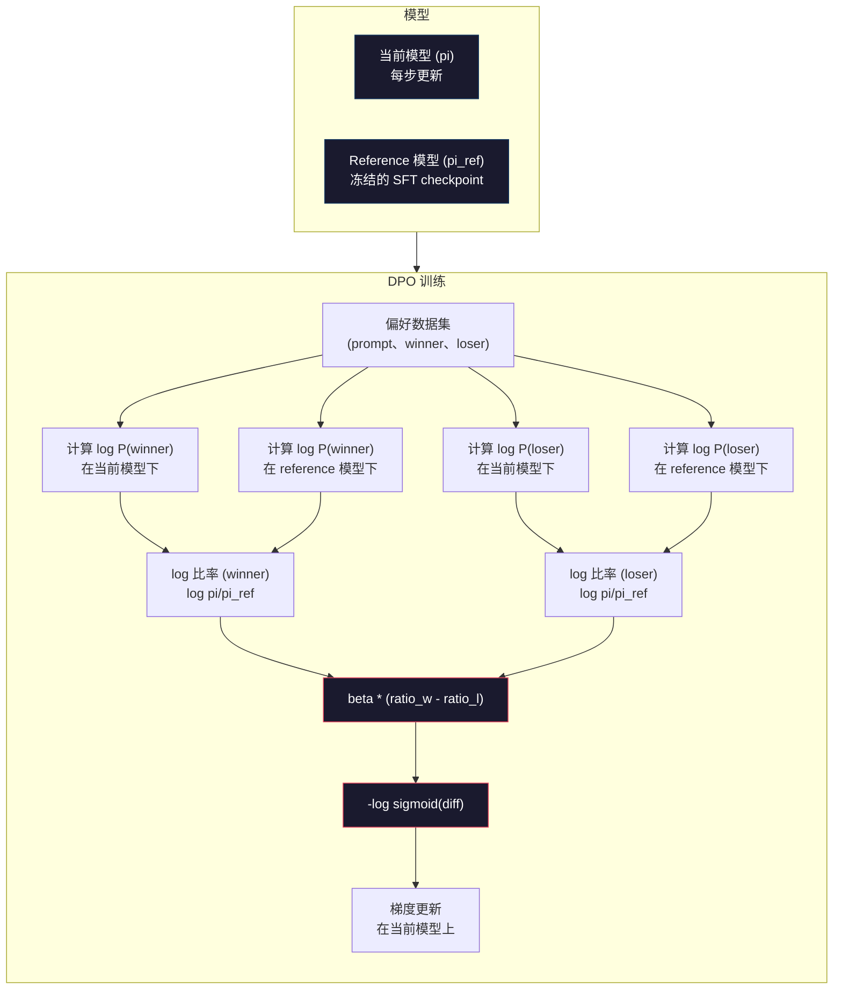

# DPO：直接偏好优化（Direct Preference Optimization）

> 译注：本文译自同目录 [`en.md`](./en.md)。术语遵循仓根 [TRANSLATION_GUIDE.md](../../../../TRANSLATION_GUIDE.md)。

> RLHF 确实有效。但它需要训练三个模型（SFT、reward model、policy），还要应付 PPO 的不稳定性，并调一个 KL 惩罚项。DPO 的提问是：如果可以把这些全部跳过呢？DPO 直接在偏好对上优化语言模型。不需要 reward model。不需要 PPO。一个训练循环。同样的效果。

**Type:** Build
**Languages:** Python（with numpy）
**Prerequisites:** Phase 10, Lesson 07（RLHF）
**Time:** ~90 minutes

## 学习目标（Learning Objectives）

- 实现 DPO 训练，直接在偏好对上优化语言模型，无需单独的 reward model
- 推导 DPO 损失函数，解释它如何通过 policy 的对数概率隐式表示一个 reward model
- 在训练稳定性、计算成本、所需模型数量等维度对比 DPO 与 RLHF
- 调节 beta 参数，控制训练后的 policy 偏离 reference model 的程度

## 问题（The Problem）

你在 Lesson 07 里搭过一条 RLHF 流水线。三个阶段。三个模型。SFT 模型、reward model，以及用 PPO 优化的 policy 模型。光是 reward model 就需要数千对人类偏好数据和一条独立的训练循环。PPO 还要小心调 KL 系数、学习率、clip ratio 和 epoch 数。

实际上，PPO 训练以不稳定著称。一点点超参数变化就能让训练发散。reward model 是人类偏好的不完美代理，policy 总能找到办法钻它的空子。KL 惩罚有用，但本身也要调——太小会出现 reward hacking（奖励作弊），太大模型几乎学不到东西。

正是这种复杂度，让大多数开源模型在 InstructGPT 发表之后好几年里都搞不定 RLHF。三阶段流水线很脆弱。每一阶段都有自己的失败模式，错误层层叠加。

2023 年 5 月，斯坦福的 Rafael Rafailov、Archit Sharma 等人发表了 *"Direct Preference Optimization: Your Language Model is Secretly a Reward Model"*。核心洞察：你不需要单独的 reward model。最优 reward 函数在数学上完全由语言模型自身的 token 概率决定。你可以彻底跳过 reward model，直接在偏好对上优化语言模型。

DPO 把 RLHF 简化成一步监督学习。一个模型。一个损失函数。一个训练循环。没有强化学习。Zephyr-7B 是首批大规模使用 DPO 的模型之一，在多项基准（benchmark）上追平甚至超越完整 RLHF 训练出来的模型。Meta 把 DPO 作为 Llama 3 对齐流水线的一部分。Anthropic 也在他们的对齐研究里引用过 DPO 风格的方法。

## 概念（The Concept）

### 关键洞察（The Key Insight）

RLHF 优化的目标是：

```
maximize: E[R(x, y)] - beta * KL(pi || pi_ref)
```

其中 R 是 reward model，pi 是 policy，pi_ref 是 reference model，beta 是 KL 系数。

DPO 论文证明了这个目标有一个闭式最优解。对任意 reward 函数 R，最优 policy 是：

```
pi*(y | x) = pi_ref(y | x) * exp(R(x, y) / beta) / Z(x)
```

其中 Z(x) 是归一化常数。重新整理：

```
R(x, y) = beta * log(pi*(y | x) / pi_ref(y | x)) + beta * log Z(x)
```

这就是突破点。reward 完全用 policy 模型的概率和 reference model 的概率表达。你不再需要训练单独的 reward model。reward 是 *隐式* 地藏在概率比里。

把它代入 Bradley-Terry 偏好模型：

```
P(y_w > y_l | x) = sigmoid(R(x, y_w) - R(x, y_l))
                  = sigmoid(beta * (log pi(y_w|x)/pi_ref(y_w|x) - log pi(y_l|x)/pi_ref(y_l|x)))
```

Z(x) 项消掉了，因为两个回答都基于同一个 prompt x。剩下的就只是 policy 模型与 reference model 在「优选回答」和「被拒回答」上的对数概率的函数。

### DPO 损失（The DPO Loss）

```
L_DPO = -log(sigmoid(beta * (log pi(y_w|x)/pi_ref(y_w|x) - log pi(y_l|x)/pi_ref(y_l|x))))
```

逐项拆开看：

- **y_w** = 优选（winning）回答
- **y_l** = 被拒（losing）回答
- **x** = prompt
- **pi** = 当前模型（正在训练）
- **pi_ref** = reference model（冻结的 SFT checkpoint）
- **beta** = 控制偏离 reference 程度的温度参数（一般取 0.1 到 0.5）

`log pi(y|x) / pi_ref(y|x)` 这个比值是对数概率比。当它为正时，当前模型给回答 y 的概率高于 reference；为负时则更低。

DPO 损失会推动模型：在优选回答上提高对数概率比、在被拒回答上降低对数概率比。beta 参数控制偏离 reference 的激进程度——小 beta 允许大幅偏离，大 beta 把模型钳在 reference 附近。



### 为什么 DPO 更简单（Why DPO is Simpler）

| 维度 | RLHF（PPO） | DPO |
|--------|-----------|-----|
| 待训模型数 | 3（SFT + reward + policy） | 1（仅 policy） |
| 训练循环 | 3（SFT、RM 训练、PPO） | 2（SFT、DPO） |
| 超参数 | lr、KL 系数、clip ratio、RM lr、3 套 epochs | lr、beta、epochs |
| Reward model | 必需（单独训练） | 隐式包含在模型概率里 |
| RL 算法 | PPO（复杂、不稳定） | 监督学习（稳定） |
| GPU 显存 | PPO 期间 3-4 个模型在显存 | 2 个模型（current + reference） |
| 训练稳定性 | 对超参数敏感 | 鲁棒，类似 SFT |

DPO 训练时显存里有两个模型——当前模型和冻结的 reference。RLHF 则需要三到四个：policy、reference、reward model，可选还有 value function baseline。一个 70B 模型在 FP16 下每份要 140GB。砍掉 reward model 省下的显存非常可观。

### DPO 何时优于 RLHF（When DPO Beats RLHF）

**小数据集。** 在 5,000–20,000 对偏好数据下，DPO 通常追平甚至超过 RLHF。RLHF 里的 reward model 需要足够数据才能泛化——数据有限时它会过拟合，给出不可靠的 reward 信号。DPO 干脆不需要 reward model，于是绕开了这个问题。

**算力有限。** DPO 的算力大约是完整 RLHF 的三分之一（一条训练循环 vs 三条）。对没有大型 GPU 集群的团队，这是务实选择。

**快速迭代。** 想试 10 个不同的偏好数据集看哪个产出最好的模型？DPO 让你几小时跑完一次实验。RLHF 每次都得重训 reward model。

### RLHF 何时优于 DPO（When RLHF Beats DPO）

**大规模训练。** 在 GPT-4 或 Claude 这种规模上，RLHF 独立的 reward model 可以捕捉更细腻的偏好信号。reward model 像一个学习得来的损失函数，能适配复杂的质量准则。

**复杂的 reward 信号。** 当「更好」涉及多个维度（helpful、harmless、honest）时，reward model 能学习这种多目标权衡。DPO 把每对偏好当作二元信号——一个更好、一个更差——而不会建模为什么。

**迭代式对齐。** RLHF 流水线可以用当前 policy 生成新回答、让人类打分、在线循环里重训 reward model。DPO 工作在固定的偏好对数据集上。Constitutional AI（Anthropic 的方案）大量利用了 RLHF 的这种迭代特性。

### DPO 之后：KTO、ORPO、SimPO（Beyond DPO: KTO, ORPO, SimPO）

DPO 启发了一整个简化对齐方法的家族。

**KTO（Kahneman-Tversky Optimization，2024）：** 你甚至不需要成对数据。KTO 在非配对反馈上工作——只需把每条回答标为「好」或「坏」，不必和另一条比较。这极大简化了数据采集。不再是给标注者两条回答问「哪个更好？」，而是给一条问「这个好吗？」。损失函数借用了前景理论中的损失厌恶：坏回答受到的惩罚比好回答得到的奖励要大。

**ORPO（Odds Ratio Preference Optimization，2024）：** 把 SFT 和对齐合并到一步训练里。不是先做 SFT 再做 DPO，而是修改 SFT 损失，把偏好信号塞进去。损失含两项：一是优选回答上的标准 next-token 预测损失，二是 odds ratio 项，用来拉大优选与被拒回答的概率差距。一条训练循环顶两条。

**SimPO（Simple Preference Optimization，2024）：** 彻底去掉 reference model。它不再相对于冻结 reference 计算对数概率比，而是直接用回答的平均对数概率（按长度归一化）作为隐式 reward。这省了显存（不需要 reference model）也简化了训练。长度归一化避免模型偏爱更短的回答。

| 方法 | 年份 | 显存中的模型数 | 需要成对数据？ | 需要 reference？ | 训练循环 |
|--------|------|-----------------|-------------|-----------------|----------------|
| RLHF | 2022 | 3-4 | 是（用于 RM） | 是 | 3 |
| DPO | 2023 | 2 | 是 | 是 | 2 |
| KTO | 2024 | 2 | 否（非配对） | 是 | 2 |
| ORPO | 2024 | 1 | 是 | 否 | 1 |
| SimPO | 2024 | 1 | 是 | 否 | 1 |

趋势很清晰：每个方法都再砍掉一块复杂度。RLHF 需要 reward model 加 PPO。DPO 把两者都干掉了。KTO 干掉成对数据。ORPO 干掉独立的 SFT 阶段。SimPO 干掉 reference model。所谓 alignment tax（对齐税）——从基础模型走到对齐模型所付出的算力与复杂度成本——一直在下降。

### 真实的 DPO 部署（Real DPO Deployments）

**Zephyr-7B（HuggingFace，2023 年 10 月）：** 以 Mistral 7B 为底座，先在 UltraChat（20 万样本）上做 SFT，再在 UltraFeedback（6 万对偏好数据）上做 DPO。MT-Bench 得分 6.47——当时 7B 量级最高分。作为对比，Llama 2 Chat 70B 是 6.86，意味着 Zephyr 仅靠 DPO 对齐就把差距压到 6% 以内，而模型规模只有对方十分之一。

**Llama 3（Meta，2024 年 4 月）：** 在初始的 RLHF 阶段之后又用了 DPO。这种组合提示 DPO 与 RLHF 可以互补——RLHF 做大范围对齐，DPO 做定点精修。

**Neural Magic / nm-chat（2024）：** 把 DPO 应用到多个开源模型，在对齐基准上相较 SFT-only 基线稳定取得 5%-15% 的提升。

## 动手实现（Build It）

### 第 1 步：偏好数据集（Preference Dataset）

格式与 RLHF 相同——(prompt, preferred, rejected) 三元组。DPO 直接消费这种数据，不经过中间的 reward model。

```python
import numpy as np
import sys
import os
sys.path.insert(0, os.path.join(os.path.dirname(__file__), "..", "..", "04-pre-training-mini-gpt", "code"))
from main import MiniGPT, LayerNorm, Embedding, TransformerBlock

PREFERENCE_DATA = [
    {
        "prompt": "What is the capital of France?",
        "preferred": "The capital of France is Paris.",
        "rejected": "France is a country in Europe. It has many cities. The capital is Paris. Paris is known for the Eiffel Tower.",
    },
    {
        "prompt": "Explain gravity in one sentence.",
        "preferred": "Gravity is the force that attracts objects with mass toward each other.",
        "rejected": "Gravity is something that makes things fall down when you drop them.",
    },
    {
        "prompt": "What is 15 times 7?",
        "preferred": "15 times 7 is 105.",
        "rejected": "Let me think about this. 15 times 7. Well, 10 times 7 is 70, and 5 times 7 is 35, so the answer might be around 105.",
    },
    {
        "prompt": "Name three programming languages.",
        "preferred": "Python, Rust, and TypeScript.",
        "rejected": "There are many programming languages. Some popular ones include various languages like Python and others.",
    },
    {
        "prompt": "What year did World War II end?",
        "preferred": "World War II ended in 1945.",
        "rejected": "World War II was a major global conflict. It involved many countries. The war ended in the mid-1940s, specifically in 1945.",
    },
    {
        "prompt": "Define machine learning.",
        "preferred": "Machine learning is a field where algorithms learn patterns from data to make predictions without being explicitly programmed.",
        "rejected": "Machine learning is a type of AI. AI stands for artificial intelligence. Machine learning uses data to learn.",
    },
]
```

### 第 2 步：序列对数概率（Sequence Log-Probability）

DPO 损失需要计算「给定 prompt 时，回答的总对数概率」。这意味着把模型跑在完整的 (prompt + response) 序列上，把每个回答 token 的对数概率加起来。

```python
def tokenize_sequence(text, vocab_size=256):
    return [min(t, vocab_size - 1) for t in list(text.encode("utf-8"))]


def compute_sequence_log_prob(model, prompt_tokens, response_tokens, max_seq_len=128):
    full_sequence = prompt_tokens + response_tokens
    if len(full_sequence) > max_seq_len:
        full_sequence = full_sequence[:max_seq_len]

    if len(full_sequence) < 2:
        return 0.0

    input_ids = np.array(full_sequence[:-1]).reshape(1, -1)
    target_ids = np.array(full_sequence[1:])

    logits = model.forward(input_ids)
    logits = logits[0]

    max_logits = logits.max(axis=-1, keepdims=True)
    log_probs = logits - max_logits - np.log(
        np.exp(logits - max_logits).sum(axis=-1, keepdims=True)
    )

    prompt_len = len(prompt_tokens)
    response_start = max(0, prompt_len - 1)
    response_end = len(target_ids)

    if response_start >= response_end:
        return 0.0

    response_log_probs = log_probs[response_start:response_end, :]
    response_targets = target_ids[response_start:response_end]

    total_log_prob = 0.0
    for i, target in enumerate(response_targets):
        total_log_prob += response_log_probs[i, target]

    return total_log_prob
```

这个函数是 DPO 的主力。每对偏好都要跑四次：模型在优选回答上、模型在被拒回答上、reference 在优选回答上、reference 在被拒回答上。也就是每个训练样本 4 次前向传播——对比 RLHF 的「生成 + reward 打分 + value 估计 + PPO 更新」，更简单、更快、更稳。

### 第 3 步：DPO 损失（The DPO Loss）

论文的核心化作代码。一个函数。一个损失。没有 reward model。

```python
def sigmoid(x):
    return np.where(
        x >= 0,
        1.0 / (1.0 + np.exp(-x)),
        np.exp(x) / (1.0 + np.exp(x))
    )


def dpo_loss(policy_logprob_preferred, policy_logprob_rejected,
             ref_logprob_preferred, ref_logprob_rejected, beta=0.1):
    preferred_ratio = policy_logprob_preferred - ref_logprob_preferred
    rejected_ratio = policy_logprob_rejected - ref_logprob_rejected

    logit = beta * (preferred_ratio - rejected_ratio)

    loss = -np.log(sigmoid(logit) + 1e-8)

    preferred_reward = beta * preferred_ratio
    rejected_reward = beta * rejected_ratio

    return loss, {
        "preferred_ratio": float(preferred_ratio),
        "rejected_ratio": float(rejected_ratio),
        "logit": float(logit),
        "implicit_preferred_reward": float(preferred_reward),
        "implicit_rejected_reward": float(rejected_reward),
        "reward_margin": float(preferred_reward - rejected_reward),
    }
```

`preferred_ratio` 和 `rejected_ratio` 就是 DPO 推导里的对数概率比。当当前模型给优选回答的概率（相对 reference）变高、给被拒回答的概率变低时，logit 为正，loss 很小。训练信号正好把模型往这个方向推。

`implicit_preferred_reward` 与 `implicit_rejected_reward` 是 DPO 损失隐式赋予的 reward。你可以把它们抽出来验证训练有效——优选与被拒 reward 之间的 margin 应当随训练增大。

### 第 4 步：DPO 训练循环（DPO Training Loop）

一个标准的监督训练循环。没有 PPO，没有 reward model。只有前向传播和梯度更新。

```python
def copy_model_weights(source, target):
    target.embedding.token_embed = source.embedding.token_embed.copy()
    target.embedding.pos_embed = source.embedding.pos_embed.copy()
    target.ln_f.gamma = source.ln_f.gamma.copy()
    target.ln_f.beta = source.ln_f.beta.copy()
    for s_block, t_block in zip(source.blocks, target.blocks):
        t_block.attn.W_q = s_block.attn.W_q.copy()
        t_block.attn.W_k = s_block.attn.W_k.copy()
        t_block.attn.W_v = s_block.attn.W_v.copy()
        t_block.attn.W_out = s_block.attn.W_out.copy()
        t_block.ffn.W1 = s_block.ffn.W1.copy()
        t_block.ffn.W2 = s_block.ffn.W2.copy()
        t_block.ffn.b1 = s_block.ffn.b1.copy()
        t_block.ffn.b2 = s_block.ffn.b2.copy()
        t_block.ln1.gamma = s_block.ln1.gamma.copy()
        t_block.ln1.beta = s_block.ln1.beta.copy()
        t_block.ln2.gamma = s_block.ln2.gamma.copy()
        t_block.ln2.beta = s_block.ln2.beta.copy()


def dpo_train(policy_model, reference_model, preference_data,
              num_epochs=5, lr=5e-6, beta=0.1, max_seq_len=128):
    print(f"DPO Training: {len(preference_data)} pairs, {num_epochs} epochs, "
          f"lr={lr}, beta={beta}")
    print()

    losses = []
    margins = []

    for epoch in range(num_epochs):
        epoch_loss = 0.0
        epoch_margin = 0.0
        num_examples = 0

        indices = np.random.permutation(len(preference_data))

        for idx in indices:
            pair = preference_data[idx]

            prompt_tokens = tokenize_sequence(pair["prompt"])
            preferred_tokens = tokenize_sequence(pair["preferred"])
            rejected_tokens = tokenize_sequence(pair["rejected"])

            pi_logprob_w = compute_sequence_log_prob(
                policy_model, prompt_tokens, preferred_tokens, max_seq_len
            )
            pi_logprob_l = compute_sequence_log_prob(
                policy_model, prompt_tokens, rejected_tokens, max_seq_len
            )
            ref_logprob_w = compute_sequence_log_prob(
                reference_model, prompt_tokens, preferred_tokens, max_seq_len
            )
            ref_logprob_l = compute_sequence_log_prob(
                reference_model, prompt_tokens, rejected_tokens, max_seq_len
            )

            loss, metrics = dpo_loss(
                pi_logprob_w, pi_logprob_l,
                ref_logprob_w, ref_logprob_l, beta
            )

            update_direction = 1.0 if metrics["logit"] < 0 else -0.1
            for block in policy_model.blocks:
                block.ffn.W1 += lr * update_direction * np.random.randn(*block.ffn.W1.shape) * 0.01
                block.ffn.W2 += lr * update_direction * np.random.randn(*block.ffn.W2.shape) * 0.01

            epoch_loss += loss
            epoch_margin += metrics["reward_margin"]
            num_examples += 1
            losses.append(float(loss))
            margins.append(metrics["reward_margin"])

        avg_loss = epoch_loss / max(num_examples, 1)
        avg_margin = epoch_margin / max(num_examples, 1)

        print(f"  Epoch {epoch + 1}/{num_epochs} | Loss: {avg_loss:.4f} | "
              f"Avg Margin: {avg_margin:.4f}")

    return policy_model, losses, margins
```

相较 RLHF，这个训练循环简单得令人神清气爽。每对偏好：算四次对数概率（两个模型 × 两条回答），代入 DPO 损失，求梯度，更新 policy。没有生成步骤。没有 reward model 推理。没有 advantage 估计。没有 clipping。

### 第 5 步：DPO 与 RLHF 对比（Compare DPO vs RLHF）

测量隐式 reward margin 与对数概率变化，把 DPO 和 Lesson 07 的 RLHF 模型放在一起比较。

```python
def evaluate_preference_accuracy(model, reference_model, preference_data, beta=0.1, max_seq_len=128):
    correct = 0
    total = 0

    for pair in preference_data:
        prompt_tokens = tokenize_sequence(pair["prompt"])
        preferred_tokens = tokenize_sequence(pair["preferred"])
        rejected_tokens = tokenize_sequence(pair["rejected"])

        pi_w = compute_sequence_log_prob(model, prompt_tokens, preferred_tokens, max_seq_len)
        pi_l = compute_sequence_log_prob(model, prompt_tokens, rejected_tokens, max_seq_len)
        ref_w = compute_sequence_log_prob(reference_model, prompt_tokens, preferred_tokens, max_seq_len)
        ref_l = compute_sequence_log_prob(reference_model, prompt_tokens, rejected_tokens, max_seq_len)

        preferred_reward = beta * (pi_w - ref_w)
        rejected_reward = beta * (pi_l - ref_l)

        if preferred_reward > rejected_reward:
            correct += 1
        total += 1

    return correct / max(total, 1)


def analyze_implicit_rewards(model, reference_model, preference_data, beta=0.1, max_seq_len=128):
    print("Implicit Reward Analysis:")
    print("-" * 65)
    print(f"  {'Prompt':<30} {'Pref Reward':>12} {'Rej Reward':>12} {'Margin':>10}")
    print("  " + "-" * 60)

    for pair in preference_data:
        prompt_tokens = tokenize_sequence(pair["prompt"])
        preferred_tokens = tokenize_sequence(pair["preferred"])
        rejected_tokens = tokenize_sequence(pair["rejected"])

        pi_w = compute_sequence_log_prob(model, prompt_tokens, preferred_tokens, max_seq_len)
        pi_l = compute_sequence_log_prob(model, prompt_tokens, rejected_tokens, max_seq_len)
        ref_w = compute_sequence_log_prob(reference_model, prompt_tokens, preferred_tokens, max_seq_len)
        ref_l = compute_sequence_log_prob(reference_model, prompt_tokens, rejected_tokens, max_seq_len)

        pref_reward = beta * (pi_w - ref_w)
        rej_reward = beta * (pi_l - ref_l)
        margin = pref_reward - rej_reward

        truncated = pair["prompt"][:28] + ".." if len(pair["prompt"]) > 30 else pair["prompt"]
        print(f"  {truncated:<30} {pref_reward:>12.4f} {rej_reward:>12.4f} {margin:>10.4f}")

    print()
```

### 第 6 步：beta 敏感性分析（Beta Sensitivity Analysis）

beta 参数是 DPO 里对应 RLHF 中 KL 系数的角色。它控制模型可以偏离 reference 多远。下面这个实验展示它的效果。

```python
def beta_sensitivity_analysis(sft_model, preference_data, betas, max_seq_len=128):
    print("Beta Sensitivity Analysis")
    print("-" * 60)
    print(f"  {'Beta':>8} {'Final Loss':>12} {'Final Margin':>14} {'Accuracy':>10}")
    print("  " + "-" * 55)

    results = []

    for beta in betas:
        policy = MiniGPT(
            vocab_size=256, embed_dim=128, num_heads=4,
            num_layers=4, max_seq_len=max_seq_len, ff_dim=512
        )
        reference = MiniGPT(
            vocab_size=256, embed_dim=128, num_heads=4,
            num_layers=4, max_seq_len=max_seq_len, ff_dim=512
        )
        copy_model_weights(sft_model, policy)
        copy_model_weights(sft_model, reference)

        policy, losses, margins_list = dpo_train(
            policy, reference, preference_data,
            num_epochs=3, lr=5e-6, beta=beta, max_seq_len=max_seq_len
        )

        accuracy = evaluate_preference_accuracy(
            policy, reference, preference_data, beta, max_seq_len
        )

        final_loss = losses[-1] if losses else 0
        final_margin = margins_list[-1] if margins_list else 0

        print(f"  {beta:>8.3f} {final_loss:>12.4f} {final_margin:>14.4f} {accuracy:>10.1%}")
        results.append({
            "beta": beta,
            "final_loss": final_loss,
            "final_margin": final_margin,
            "accuracy": accuracy,
        })

        print()

    return results
```

beta 小（0.01）让模型可以放飞自我地偏离 reference——学得快但有掉进退化解的风险。beta 大（1.0）把模型钉死在 reference 边上——稳定但学得慢。多数应用的甜蜜点在 0.1 到 0.3。

## 用起来（Use It）

### 完整 DPO 流水线 demo（Full DPO Pipeline Demo）

```python
if __name__ == "__main__":
    np.random.seed(42)

    print("=" * 70)
    print("DPO: DIRECT PREFERENCE OPTIMIZATION")
    print("=" * 70)
    print()

    print("STEP 1: Initialize SFT Model (from Lesson 06)")
    print("-" * 50)
    sft_model = MiniGPT(
        vocab_size=256, embed_dim=128, num_heads=4,
        num_layers=4, max_seq_len=128, ff_dim=512
    )
    print(f"  Parameters: {sft_model.count_parameters():,}")
    print()

    print("STEP 2: DPO Training")
    print("-" * 50)

    policy_model = MiniGPT(
        vocab_size=256, embed_dim=128, num_heads=4,
        num_layers=4, max_seq_len=128, ff_dim=512
    )
    reference_model = MiniGPT(
        vocab_size=256, embed_dim=128, num_heads=4,
        num_layers=4, max_seq_len=128, ff_dim=512
    )
    copy_model_weights(sft_model, policy_model)
    copy_model_weights(sft_model, reference_model)

    policy_model, losses, margins = dpo_train(
        policy_model, reference_model, PREFERENCE_DATA,
        num_epochs=5, lr=5e-6, beta=0.1
    )
    print()

    print("=" * 70)
    print("STEP 3: Evaluate")
    print("=" * 70)
    print()

    pre_accuracy = evaluate_preference_accuracy(
        sft_model, reference_model, PREFERENCE_DATA, beta=0.1
    )
    post_accuracy = evaluate_preference_accuracy(
        policy_model, reference_model, PREFERENCE_DATA, beta=0.1
    )

    print(f"  Preference accuracy (pre-DPO):  {pre_accuracy:.1%}")
    print(f"  Preference accuracy (post-DPO): {post_accuracy:.1%}")
    print()

    analyze_implicit_rewards(policy_model, reference_model, PREFERENCE_DATA, beta=0.1)

    print("=" * 70)
    print("STEP 4: Training Dynamics")
    print("=" * 70)
    print()

    if losses:
        print("  Loss curve:")
        window = max(1, len(losses) // 5)
        for i in range(0, len(losses), window):
            chunk = losses[i:i + window]
            avg = sum(chunk) / len(chunk)
            print(f"    Steps {i:3d}-{i + len(chunk) - 1:3d}: loss = {avg:.4f}")
        print()

    if margins:
        print("  Reward margin curve:")
        window = max(1, len(margins) // 5)
        for i in range(0, len(margins), window):
            chunk = margins[i:i + window]
            avg = sum(chunk) / len(chunk)
            print(f"    Steps {i:3d}-{i + len(chunk) - 1:3d}: margin = {avg:.4f}")
        print()

    print("=" * 70)
    print("STEP 5: Beta Sensitivity")
    print("=" * 70)
    print()

    beta_results = beta_sensitivity_analysis(
        sft_model, PREFERENCE_DATA, betas=[0.01, 0.1, 0.3, 1.0]
    )

    print("=" * 70)
    print("DPO vs RLHF COMPARISON")
    print("=" * 70)
    print()
    print("  DPO advantages:")
    print("    - 1 training loop (vs 3 for RLHF)")
    print("    - 2 models in memory (vs 3-4 for RLHF)")
    print("    - Supervised learning (vs RL, more stable)")
    print("    - No reward model to train or maintain")
    print()
    print("  RLHF advantages:")
    print("    - Separate reward model captures complex preferences")
    print("    - Online learning: generate, rate, retrain")
    print("    - Better for multi-objective alignment")
    print("    - Proven at largest scales (GPT-4, Claude)")
    print()
    print("  Practical guidance:")
    print("    - Start with DPO. It's simpler and often sufficient.")
    print("    - Switch to RLHF if DPO plateaus on your eval metrics.")
    print("    - Many production systems use both: RLHF first, DPO to refine.")
```

## 上线部署（Ship It）

本课产物是 `outputs/prompt-alignment-method-selector.md`——一个帮助你为自身使用场景挑选合适对齐方法（SFT、RLHF、DPO、KTO、ORPO、SimPO）的 prompt。给定你的数据可获得性、算力预算、对齐目标，它会推荐方法和训练计划。

## 练习（Exercises）

1. 实现 KTO（Kahneman-Tversky Optimization）。KTO 不需要成对数据——只把每条回答标为「好」或「坏」。好回答的损失是 `-log(sigmoid(beta * log_ratio))`，坏回答的损失是 `-log(1 - sigmoid(beta * log_ratio))`，并对坏回答的损失乘上一个损失厌恶系数（一般 1.5x）。在同一份数据上训练（把 preferred 当作「好」、rejected 当作「坏」独立处理），并把准确率与 DPO 比较。

2. 实现长度归一化（length-normalized）DPO。不要使用原始对数概率，而是除以回答 token 数：`normalized_logprob = total_logprob / num_tokens`。这能避免模型偏爱较短的回答（它们总对数概率更高）。比较带不带归一化时的隐式 reward margin。

3. 构建一个 ORPO 风格的组合损失。在 DPO 损失上加一项优选回答上的标准 next-token 预测损失：`L = L_sft(preferred) + alpha * L_dpo`。试 alpha = 0.1、0.5、1.0。组合损失应该既让模型遵循指令（来自 SFT 项）又偏好更好的回答（来自 DPO 项），从而省掉独立的 SFT 阶段。

4. 实现迭代式 DPO。先跑 3 个 epoch DPO，然后用训练后的模型生成新回答，把它们与原本的优选回答配成新的偏好对，再跑一轮 DPO。一共做两轮这种「自博弈」。比较第 1 轮、第 2 轮后的偏好准确率，看迭代精修是否有效。

5. 比较 DPO 在不同 reference model 下的表现。除了用 SFT checkpoint 当 reference，再尝试：(a) 基础模型（pre-SFT），(b) DPO 第 1 个 epoch 的 checkpoint，(c) policy 模型的指数移动平均。报告哪种 reference 给出最高的偏好准确率与最稳定的训练曲线。

## 关键术语（Key Terms）

| 术语 | 大家常说 | 实际含义 |
|------|----------------|----------------------|
| DPO | 「不带 RL 的 RLHF」 | Direct Preference Optimization：一种监督学习算法，直接在偏好对上优化语言模型，跳过 reward model 与 PPO |
| Implicit reward（隐式 reward） | 「reward 就在模型里」 | reward 函数由 policy 与 reference model 之间的对数概率比决定——不再需要单独的 reward model |
| Beta（DPO） | 「温度」 | 控制 policy 偏离 reference model 的程度——小 beta 允许大幅偏离，大 beta 把模型钳在 reference 附近 |
| Log-probability ratio（对数概率比） | 「模型变了多少」 | log pi(y\|x) - log pi_ref(y\|x)——为正表示当前模型给出的概率比 reference 高 |
| Reference model | 「冻结的 checkpoint」 | SFT 模型的一份副本，权重永不更新——作为计算概率比的锚点 |
| KTO | 「不要成对数据的 DPO」 | Kahneman-Tversky Optimization：用非配对的「好」/「坏」标签替代偏好对 |
| ORPO | 「单步对齐」 | Odds Ratio Preference Optimization：通过把偏好项加进 SFT 损失，把 SFT 与对齐合并到一条训练循环里 |
| SimPO | 「不需要 reference」 | Simple Preference Optimization：用按长度归一化的平均对数概率作为隐式 reward，从而消除 reference model |
| Alignment tax（对齐税） | 「让模型变安全的代价」 | 从基础模型走到对齐模型所需付出的额外算力、数据与复杂度——DPO 显著降低了这部分 |

## 延伸阅读（Further Reading）

- [Rafailov et al., 2023 -- "Direct Preference Optimization: Your Language Model is Secretly a Reward Model"](https://arxiv.org/abs/2305.18290) -- 把对齐从 RLHF 简化为监督学习的 DPO 论文
- [Tunstall et al., 2023 -- "Zephyr: Direct Distillation of LM Alignment"](https://arxiv.org/abs/2310.16944) -- Zephyr-7B，展示 DPO 在 UltraFeedback 上能在基准测试上追平 RLHF
- [Ethayarajh et al., 2024 -- "KTO: Model Alignment as Prospect Theoretic Optimization"](https://arxiv.org/abs/2402.01306) -- 去掉对成对偏好数据的需求
- [Hong et al., 2024 -- "ORPO: Monolithic Preference Optimization without Reference Model"](https://arxiv.org/abs/2403.07691) -- 一步内合并 SFT 与对齐
- [Meng et al., 2024 -- "SimPO: Simple Preference Optimization with a Reference-Free Reward"](https://arxiv.org/abs/2405.14734) -- 彻底去掉 reference model
- [Llama 3 Technical Report](https://arxiv.org/abs/2407.21783) -- Meta 把 RLHF 与 DPO 组合的对齐流水线
