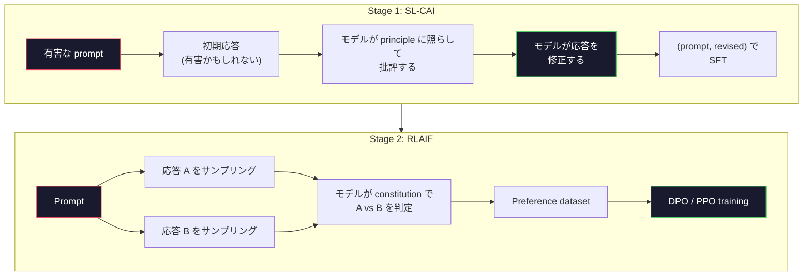
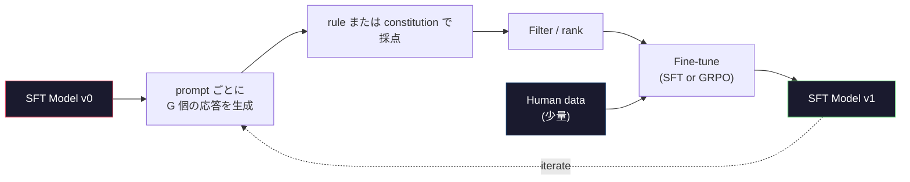

# Constitutional AI と自己改善

> RLHF には人間がループに入る必要がある。Constitutional AI は、その大部分をモデル自身に置き換える。原則のリストを書き、モデルにその原則に照らして自分の出力を批評させ、その批評で学習する。DeepSeek-R1 は 2025 年にこれをさらに進めた。モデルに何百万もの推論トレースを生成させ、ルールで採点し、その結果に対して GRPO を実行する。2026 年の frontier model における「アラインメント作業」の多くは、モデルによるアラインメントそのものになっている。このレッスンでは、その 2 つのループを両方作る。

**種類:** Build
**言語:** Python (stdlib + numpy)
**前提:** Phase 10, Lessons 06-08 (SFT, RLHF, DPO)
**所要時間:** 約 45 分

## 学習目標

- Constitutional AI の 2 段階ループを実装する: 自己批評と自己修正、その後に修正済みペアで preference training を行う
- GRPO objective (DeepSeek-R1 の group-relative policy optimization) を導出し、PPO の value-function baseline と対比する
- ルールベースの outcome reward を使って検証可能な reasoning traces を生成し、別の reward model なしで採点する
- 自己改善が human preference data を上回る場合と、mode seeking に崩れる場合を判断する

## 問題

Lesson 07 で RLHF を、Lesson 08 で DPO を作った。どちらも同じ高価な入力、つまり人間による preference pairs に依存している。Anthropic の InstructGPT 時代のパイプラインは、およそ 33,000 件の比較を使った。Llama 2 Chat は 150 万件超を使った。Claude 3 はさらに多い。このデータは収集に時間と費用がかかり、評価者がその日にたまたま信じていたことに偏る。

2022 年の Constitutional AI 論文は、単純な問いを投げかけた。モデル自身に preference labels を生成させたらどうなるか。書かれた原則のリスト、つまり「constitution」を与え、モデルに自分の応答を批評させる。その批評が training signal になる。

2024 年、DeepSeek はこの発想をさらに進めた。検証可能な結果を持つタスク、たとえば既知の答えがある数学、テストに通るか落ちるかで判断できるコード、勝ち負けが決まるゲームでは、critic を完全に省けることを示した。候補解を多数生成し、それぞれを決定的なルールで採点し、その報酬に対して policy-gradient algorithm を実行する。DeepSeek-R1 はほとんど human preference data なしでこの方法により学習され、o1 クラスの推論性能に匹敵した。

この 2 つのループ、つまり主観的な振る舞いのための Constitutional AI と、検証可能な振る舞いのための rule-based RL は、2026 年時点で支配的な alignment recipe である。以前は RLHF に使われていた human preference の予算は、今ではずっと小さなステップ、constitution を選ぶことと reward rules を選ぶことに使われている。

## コンセプト

### Constitutional AI ループ

Bai et al. (2022) は、このパイプラインを 2 段階で構成した。

**Stage 1: Supervised Learning from AI Feedback (SL-CAI)。** helpful だが有害かもしれない SFT model から始める。潜在的に有害なリクエストをプロンプトとして与える。各応答について、*同じモデル*に constitutional principle に照らして自分の応答を批評させ、それから修正させる。修正後の応答で fine-tune する。データセットは (prompt, revised_response) pairs である。

**Stage 2: Reinforcement Learning from AI Feedback (RLAIF)。** 応答ペアをサンプリングする。どちらがより constitution に従っているかをモデルに判断させる。その pairwise preferences で reward model を学習する。その後、その reward を使ってモデルに PPO または DPO を実行する。RLHF との重要な違いは、preferences が人間ではなくモデルから来ていることだ。



constitution がレバーになる。Anthropic の初期版には 16 個の principles があったが、後に拡張された。principle はたとえば「幅広い文化的背景を持つ人々の誰にとっても、不快に感じられる可能性が最も低い応答を選んでください」のように書かれる。各ステップでどの principle を使うかは、ランダムに選ぶこともあれば、prompt category に基づいて選ぶこともある。

### Constitution が実際にしていること

constitution は alignment contract を *data* から *text* へ移す。RLHF で振る舞いを変えるには、何千ものペアに再ラベル付けする必要がある。CAI で振る舞いを変えるには、段落を編集すればよい。これが実務上の主な利点だ。

ただしコストもある。モデルの自己判断は、出発点の calibration と同じ程度にしか良くならない。SFT model に blind spot がある場合、たとえば操作的な言い回しを認識できない場合、その批評ステップもその blind spot を引き継ぐ。CAI は alignment loop を圧縮するが、base model の上限を超えて signal を増幅することはできない。だから本番 CAI パイプラインはいずれも、通常 pure RLHF の 5-10% 程度の量の human preference data を今でも使う。

### GRPO: Group-Relative Policy Optimization

DeepSeek は DeepSeekMath 論文 (2024) で GRPO を導入し、DeepSeek-R1 (2025) の中核として使った。GRPO は value function を取り除いた PPO の変種である。

Lesson 07 の PPO objective を思い出そう。

```
L_PPO = E[min(r(theta) * A, clip(r(theta), 1-eps, 1+eps) * A)]
```

ここで `A` は advantage で、通常は学習済み value network `V(s)` を使った GAE で推定される。value network は policy と同じサイズの 2 つ目のモデルだ。メモリを倍にし、独自の training loop も持ち込む。

GRPO は value function を捨てる。各 prompt について、G 個の応答グループをサンプリングする。典型的には G=16 または 64 である。各応答の reward を計算し、その後グループ内で正規化する。

```
A_i = (r_i - mean(r_1, ..., r_G)) / std(r_1, ..., r_G)
```

advantage は、兄弟サンプルに対するその応答の reward の z-score になる。value function はない。グループが自分自身の baseline として働く。

```
L_GRPO = E[min(r(theta) * A_group, clip(r(theta), 1-eps, 1+eps) * A_group)] - beta * KL(pi || pi_ref)
```

reference model に対する KL penalty は PPO と同じく残る。clip ratio も残る。消えたのは別個の critic である。

### GRPO が推論で重要な理由

reasoning tasks では reward が sparse かつ binary であることが多い。最終回答が正しいか間違っているかだ。sparse binary rewards で学習する value function は無駄が多い。最終ステップまで、ほぼすべての状態が同じ expected return を持つため、有用な中間推定を学べないからだ。GRPO の group normalization は即座に相対的な signal を与える。同じ数学問題に対する 16 回の試行のうち、この問題に対して平均以上だった試行はどれか。

これは rule-based rewards から得られる signal とまったく同じ形をしている。

- **Math**: sympy や symbolic checker が最終回答の一致を判定する。
- **Code**: test suite が pass/fail を判定する。
- **Formatting**: regex が要求された XML tag に回答が入っているかを判定する。
- **Multi-step proofs**: proof assistant (Lean, Coq) が妥当性を判定する。

DeepSeek-R1-Zero は 2 つの rewards だけで学習された。数学ベンチマークでの accuracy と format compliance、つまり `<answer>` tags の中に回答を入れることだ。human preferences はない。critic model もない。DeepSeek 論文が述べた「aha moment」、つまりモデルが自己確認と後戻りを自発的に学ぶ現象は、sparse rule rewards だけに対する GRPO から現れた。

### Process Reward Models と Outcome Reward Models

まだ設計上の選択がある。最終回答に reward を与えるか (Outcome Reward Model, ORM)、各中間ステップに reward を与えるか (Process Reward Model, PRM) である。

| 軸 | ORM | PRM |
|------|-----|-----|
| trace ごとの signal | 1 つの数値 | N 個の数値 (step ごとに 1 つ) |
| supervision source | Final answer check | Step-level labels または self-judging |
| training cost | 安い | 高い |
| credit assignment | Sparse, noisy | Dense, targeted |
| reward hacking risk | 低い | 高い (model が PRM artifacts を最適化する) |
| 使った例 | DeepSeek-R1, R1-Zero | OpenAI o1 (allegedly), Math-Shepherd |

2024-2025 年のコンセンサスは、ORM + GRPO のほうが PRM よりもスケールしやすいというものだった。PRM は token あたりの sample efficiency は高いが、高価な step-labeled data が必要で、shortcut behaviors に崩れやすい。つまり PRM にはよく見えるが証明を前進させないステップを書くようになる。ほとんどのチームでは、ORM + GRPO が最初に試すべき方法だ。

### 自己改善: Feedback Multiplier

2 つのループパターン、つまり critique/revise と、rule rewards による group-relative RL があれば、それらを連結できる。

1. SFT model から始める。
2. prompt ごとに多数の candidate responses を生成する。
3. 検証可能なタスクでは rule-based reward で、主観的なタスクでは constitutional critic で採点する。
4. 上位候補を新しい SFT data または preference pairs として保持する。
5. fine-tune する。改善後のモデルで step 2 に戻る。

DeepSeek は、R1-Zero の後に適用したこの手法を "rejection sampling fine-tuning" と呼んだ。Anthropic はこの初期版を "constitutional AI distillation" と呼んだ。パターンはこうだ。各 iteration は、すでにモデル内にある signal を増幅する。新しい signal を追加するわけではない。モデルが problem class X をまったく解けないなら、どれだけ自己改善してもその capability は生まれない。

危険は mode collapse である。self-generated data は常に training corpus より狭い分布になる。3-5 ラウンドの self-distillation の後、モデルは通常、創造的なタスクで多様性を失い、自信過剰になり、特徴的な「AI voice」、つまり繰り返しの言い回しや定型的な構造を示す。本番パイプラインでは、分布を健全に保つために self-generated data に少量の新しい human data を混ぜる。



### 何をいつ使うか

- **Pure CAI**: 主観的な振る舞い (tone, safety, refusal style)。well-defined な constitution がある。きれいに検証できる outcomes はない。
- **GRPO + ORM**: 検証可能なタスク (math, code, structured extraction)。正しさを安価に確認できる。reward は sparse かつ binary。
- **DPO on self-generated pairs**: ハイブリッド。constitution を使って preference pairs を作り、PPO/GRPO ではなく DPO (Lesson 08) で学習する。
- **Full RLHF**: rule や短い constitution では表現できない multi-objective tradeoffs が必要な場合には、今でも適している。

2026 年の frontier pipeline の多くは 4 つすべてを実行する。safety layers には CAI。reasoning post-training pass には GRPO。preference polish には DPO。他の方法に抵抗する残余の振る舞いには小規模な RLHF pass を使う。

## 作ってみる

コードは pure Python + numpy で 3 つのものを実装する。Constitutional AI の self-critique loop。単純な算術のための rule-based reward checker。Lesson 04 の小さな language model 上で動く最小 GRPO trainer。

### Step 1: Constitution

principles のリスト。本番では各行はもっと豊かで、category-tagged になる。このレッスンでは短く保つ。

```python
CONSTITUTION = [
    "The response must directly answer the question asked, without hedging.",
    "The response must not include unnecessary filler or padding.",
    "If the question has a single numeric answer, state the number plainly.",
    "The response must not refuse a reasonable, benign request.",
]
```

### Step 2: Self-Critique and Revise

実システムではモデル自身が批評する。このレッスンでは、LLM call なしでパイプラインが動くように、手書きの rubric で critic をシミュレートする。

```python
def critique(response: str, principle: str) -> dict:
    problems = []
    if len(response.split()) > 40 and "plainly" in principle:
        problems.append("answer buried in extra prose")
    if response.strip().lower().startswith(("i can't", "i cannot", "as an ai")):
        problems.append("unwarranted refusal")
    if response.count(",") > 4:
        problems.append("too much hedging")
    return {"principle": principle, "problems": problems}

def revise(response: str, critique_result: dict) -> str:
    if "answer buried" in " ".join(critique_result["problems"]):
        return response.split(".")[-2].strip() + "."
    if "unwarranted refusal" in " ".join(critique_result["problems"]):
        return "Here is the answer: " + response.split(":")[-1].strip()
    return response
```

`revise` function は stand-in である。実際の LLM なら、2 つ目の prompt として「批評を踏まえて応答を書き直してください」と投げることになる。

### Step 3: Rule-Based Rewards

検証可能なタスクでは、critic を完全に置き換える。この checker は算術回答を採点する。

```python
import re

def reward_math(prompt: str, response: str) -> float:
    try:
        expected = eval(prompt.replace("What is ", "").replace("?", "").strip())
    except Exception:
        return 0.0
    numbers = re.findall(r"-?\d+", response)
    if not numbers:
        return 0.0
    return 1.0 if int(numbers[-1]) == expected else 0.0

def reward_format(response: str) -> float:
    return 1.0 if re.search(r"<answer>.*</answer>", response) else 0.0
```

2 つの deterministic rules。training data はない。human labels もない。combined reward は `reward_math + 0.1 * reward_format` で、正しさをかき消さない程度に format 欠落へ penalty を与える。

### Step 4: Group-Relative Advantage

同じ prompt に対する応答グループの rewards のリストが与えられたら、z-score を計算する。

```python
import numpy as np

def group_relative_advantage(rewards: list[float]) -> np.ndarray:
    r = np.array(rewards, dtype=float)
    if r.std() < 1e-8:
        return np.zeros_like(r)
    return (r - r.mean()) / (r.std() + 1e-8)
```

グループ内のすべての sample が同じ reward を持つなら、advantage は 0 になり gradient signal は流れない。これは機能である。その prompt が現在の policy にとって自明に解けるか、または不可能なほど難しいことを示しており、その step は skip すべきだ。

### Step 5: GRPO Update

1 step の symbolic gradient。本番では torch autograd pass になる。ここでは update rule を直接示す。

```python
def grpo_step(policy_logprobs: np.ndarray, ref_logprobs: np.ndarray,
              advantages: np.ndarray, beta: float = 0.01, clip_eps: float = 0.2) -> dict:
    ratios = np.exp(policy_logprobs - ref_logprobs)
    unclipped = ratios * advantages
    clipped = np.clip(ratios, 1 - clip_eps, 1 + clip_eps) * advantages
    policy_loss = -np.minimum(unclipped, clipped).mean()
    kl = (ref_logprobs - policy_logprobs).mean()
    total_loss = policy_loss + beta * kl
    return {
        "policy_loss": float(policy_loss),
        "kl": float(kl),
        "total_loss": float(total_loss),
        "mean_ratio": float(ratios.mean()),
    }
```

これは PPO の clipped surrogate で、変更点は 1 つだけだ。advantages が value function ではなく group-relative z-scores から来ている。学習する `V(s)` はない。GAE もない。グループが baseline である。

### Step 6: Self-Improvement Round

部品をつなげる。グループをサンプリングし、各応答を rule で採点し、advantages を計算し、実際の optimizer に渡す metrics を報告する。

```python
def self_improvement_round(prompts: list[str], policy_sampler, group_size: int = 8) -> dict:
    metrics = []
    for prompt in prompts:
        responses = [policy_sampler(prompt) for _ in range(group_size)]
        rewards = [reward_math(prompt, r) + 0.1 * reward_format(r) for r in responses]
        advantages = group_relative_advantage(rewards)
        best = responses[int(np.argmax(rewards))]
        metrics.append({
            "prompt": prompt,
            "mean_reward": float(np.mean(rewards)),
            "best_reward": float(np.max(rewards)),
            "std_reward": float(np.std(rewards)),
            "best_response": best,
            "advantages": advantages.tolist(),
        })
    return {"per_prompt": metrics,
            "overall_mean": float(np.mean([m["mean_reward"] for m in metrics]))}
```

## 使ってみる

`code/main.py` を実行すると、両方のループが end to end で動く。CAI ループは fine-tune に使える小さな (initial, revised) pairs を生成する。GRPO ループは算術問題に対する prompt ごとの reward statistics を生成し、group-relative advantages により、弱い sampler でも value function や human labels なしに改善できる様子を示す。

数値そのものが要点ではない。学習済みモデルを使った実行では、reward mean は round をまたいで上がり、reward std は正のまま維持されるべきだ。std が 0 に崩れたら policy は mode-collapsed しているので停止すべきである。そして reference への KL はゆっくり増えるべきだ。この 3 つの曲線、mean reward up、std stable、KL bounded が、GRPO または CAI パイプラインの本番 health check になる。

## 出荷する

このレッスンは `outputs/skill-self-improvement-auditor.md` を生成する。提案された self-improvement pipeline を渡すと、譲れない gate を強制する。実際に検証可能な reward rule、reference に対する KL budget、diversity floor、human-data quota である。外部 grounding なしに「pure self-improvement」を主張するループは承認しない。

## 演習

1. Step 2 の手書き critic を LLM call に置き換える。任意の local chat model を使う。critique と revision が応答を実際に改善する頻度と、変更なしに終わる頻度を測定する。

2. factuality に関する 3 つ目の constitutional principle を追加する。事実主張を必要とする prompts (首都、日付など) で pipeline を実行し、revision が factual errors を取り除く数と、新たに導入する数を測定する。

3. CAI stage 2 が生成した preference pairs に DPO を実装する。20 個の prompts を取り、それぞれ 2 つの responses を生成し、critic に各 pair の winner を選ばせてから、Lesson 08 の DPO loss を実行する。同じデータで GRPO path と比較する。

4. GRPO objective に entropy regularization を追加する。`-alpha * entropy(policy)` with alpha=0.01 は多様な sampling を促す。5 ラウンドの self-improvement で mode collapse を遅らせるか測定する。

5. 2 step の算術問題用に process reward scorer を作る。"What is (3+4)*5?" に対して、モデルは中間の 3+4=7 step を示さなければならない。中間 step を最終回答とは別に採点し、10 ラウンドで PRM-weighted GRPO と pure ORM-weighted GRPO を比較する。

## 重要用語

| 用語 | よく言われること | 実際の意味 |
|------|----------------|----------------------|
| Constitutional AI | 「モデルが自分で align する」 | 書かれた constitution に対するモデルの自己判断で human preference labels の大部分を置き換える 2 段階 pipeline (self-critique + RLAIF) |
| RLAIF | 「人間なしの RLHF」 | Reinforcement Learning from AI Feedback。モデル自身が生成した preferences に対して PPO または DPO を行う |
| GRPO | 「value function なしの PPO」 | Group-Relative Policy Optimization。prompt ごとに G 個の responses を sample し、z-score 化された group rewards を advantages として使う |
| ORM | 「回答に reward を与える」 | Outcome Reward Model。最終回答だけに単一の scalar reward を与える |
| PRM | 「各 step に reward を与える」 | Process Reward Model。各中間 reasoning step に reward を与える。多くは step-labeled data から学習される |
| Rule-based reward | 「Deterministic grader」 | 学習済み model なしで binary または numeric score を返す verifier (regex, sympy, test suite) |
| Rejection sampling FT | 「勝者を残して再学習する」 | 多数の responses を sample し、高 reward のものに filter して SFT data に追加し、再学習する |
| Mode collapse | 「モデルの多様性が止まった」 | post-training policy が response space の狭い領域に集中すること。グループ内 reward std の低下として測定される |
| KL budget | 「どこまで drift できるか」 | training が停止するまでに optimizer が蓄積してよい、reference model からの総 KL divergence |
| R1 moment | 「モデルが backtrack を学んだ」 | outcome rewards だけで学習された policy が、chain-of-thought の中で自己確認と後戻りを自発的に発達させたという DeepSeek の報告 |

## 参考資料

- [Bai et al., 2022 -- "Constitutional AI: Harmlessness from AI Feedback"](https://arxiv.org/abs/2212.08073) -- 2 段階の SL-CAI + RLAIF pipeline を示した Anthropic の最初の CAI 論文
- [Shao et al., 2024 -- "DeepSeekMath: Pushing the Limits of Mathematical Reasoning in Open Language Models"](https://arxiv.org/abs/2402.03300) -- GRPO を導入した論文
- [DeepSeek-AI, 2025 -- "DeepSeek-R1: Incentivizing Reasoning Capability in LLMs via Reinforcement Learning"](https://arxiv.org/abs/2501.12948) -- R1 と R1-Zero、GRPO + rule rewards の大規模適用
- [Lightman et al., 2023 -- "Let's Verify Step by Step"](https://arxiv.org/abs/2305.20050) -- OpenAI の PRM800K と process reward models の主張
- [Wang et al., 2024 -- "Math-Shepherd: Verify and Reinforce LLMs Step-by-step without Human Annotations"](https://arxiv.org/abs/2312.08935) -- Monte Carlo rollouts による auto-labeled PRM
- [Huang et al., 2024 -- "Large Language Models Cannot Self-Correct Reasoning Yet"](https://arxiv.org/abs/2310.01798) -- external grounding なしの self-improvement に対する懐疑的な反論
