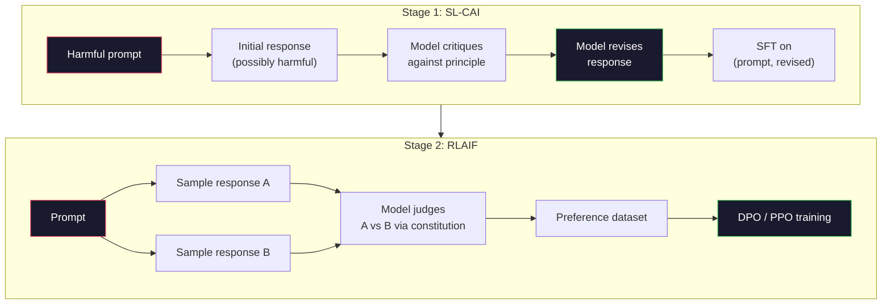
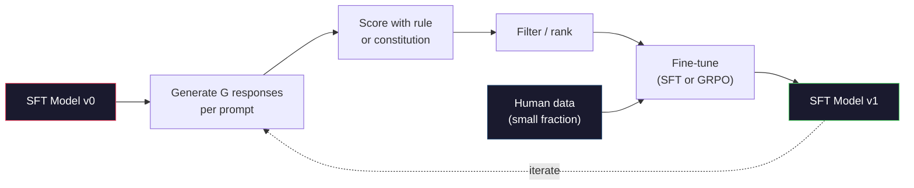

# Anayasal Yapay Zeka ve Kişisel Gelişim

> RLHF'nin döngüde insanlara ihtiyacı var. Anayasal yapay zeka bunların çoğunu modelin kendisi ile değiştiriyor. Bir ilkeler listesi yazın, modelin bu ilkelere göre kendi çıktılarını eleştirmesini sağlayın ve eleştiriler üzerinde eğitim alın. DeepSeek-R1, 2025'te bunu daha da ileri götürdü: Modelin milyonlarca akıl yürütme izi oluşturmasına izin verin, bunları bir kuralla derecelendirin ve sonuç üzerinde GRPO'yu çalıştırın. 2026 sınır modelindeki "hizalama işinin" çoğu, model hizalamanın kendisidir. Bu ders her iki döngüyü de oluşturur.

**Tür:** Yapım
**Diller:** Python (stdlib + numpy)
**Önkoşullar:** Aşama 10, Dersler 06-08 (SFT, RLHF, DPO)
**Süre:** ~45 dakika

## Öğrenme Hedefleri

- Anayasal Yapay Zeka iki aşamalı döngüsünü uygulayın: özeleştiri artı öz revizyon, ardından revize edilen çiftler üzerinde tercih eğitimi
- GRPO hedefini (DeepSeek-R1'in gruba bağlı politika optimizasyonu) türetin ve bunu PPO'nun değer fonksiyonu temel çizgisiyle karşılaştırın
- Kurala dayalı sonuç ödülleriyle doğrulanabilir akıl yürütme izleri oluşturun ve bunları ayrı bir ödül modeli olmadan puanlayın
- Kişisel gelişimin ne zaman insan tercih verilerini geride bırakacağına ve ne zaman mod arayışına dönüşeceğine karar verin

## Sorun

RLHF'yi Ders 07'de ve DPO'yu Ders 08'de oluşturdunuz. Her ikisi de aynı pahalı girdiye bağlıdır: insan tercih çiftleri. Anthropic'in InstructGPT dönemi boru hattı yaklaşık 33.000 karşılaştırma kullandı. Llama 2 Chat 1,5 milyondan fazla kullanıldı. Claude 3 daha fazlasını kullandı. Bu veriler yavaştır, pahalıdır ve derecelendirmeyi yapanların derecelendirme yaptıkları gün inandıkları şeye karşı önyargılıdır.

2022 Anayasal Yapay Zeka makalesi basit bir soru sordu. Peki ya model tercih etiketlerini kendisi oluşturuyorsa? Ona yazılı ilkelerin bir listesini ("anayasa") verin ve kendi yanıtlarını eleştirmesini sağlayın. Eleştiriler eğitim sinyali haline gelir.

2024'te DeepSeek bu fikri daha da ileri götürdü. Doğrulanabilir bir sonucu olan herhangi bir görev için (cevabı bilinen matematik, testleri geçen veya başarısız olan kod, kazanan veya kaybeden bir oyun) eleştirmeni tamamen atlayabileceğinizi gösterdiler. Birçok aday çözüm üretin. Her birini deterministik bir kuralla derecelendirin. Ödüller üzerinde bir politika-gradient algoritması çalıştırın. DeepSeek-R1, neredeyse hiç insan tercihi verisi olmadan ve o1 sınıfı akıl yürütme performansıyla eşleşerek bu şekilde eğitildi.

Bu iki döngü (öznel davranış için Anayasal Yapay Zeka ve doğrulanabilir davranış için kurala dayalı RL) 2026'nın baskın uyum reçeteleridir. Eskiden RLHF'ye giden insan tercihi bütçesi artık çok daha küçük bir adımı karşılıyor: anayasayı seçmek ve ödül kurallarını seçmek.

## Konsept

### Anayasal Yapay Zeka Döngüsü

Bai ve diğerleri. (2022) boru hattını iki aşamada yapılandırdı.

**1. Aşama: Yapay Zeka Geri Bildiriminden Denetimli Öğrenme (SL-CAI).** Yararlı ancak muhtemelen zararlı olan bir SFT modeliyle başlayın. Prompt potansiyel olarak zararlı isteklerle. Her yanıt için, *aynı modelden* tepkisini anayasal bir ilkeye göre eleştirmesini isteyin, ardından revize edin. Gözden geçirilmiş yanıtlara ince ayar yapın. dataset (prompt, revize_response) çiftleridir.

**2. Aşama: Yapay Zeka Geri Bildiriminden (RLAIF) Takviyeli Öğrenme.** Örnek yanıt çiftleri. Modele hangisinin anayasaya daha iyi uyduğunu sorun. İkili tercihler bir ödül modelini eğitir. Daha sonra bu ödülü kullanarak modelde PPO veya DPO'yu çalıştırın. RLHF'den temel fark: tercihler insanlardan değil modelden geliyordu.



Anayasa kaldıraçtır. Anthropic'in orijinalinde 16 prensip vardı (daha sonra genişletildi). Bir prensip şu şekildedir: "Lütfen çok çeşitli kültürel kökenden gelen herhangi biri için en az sakıncalı olan yanıtı seçin." Her adım için prensibi bazen rastgele, bazen de prompt kategorisine göre seçersiniz.

### Anayasa Aslında Ne Yapıyor?

Anayasa, uyum sözleşmesini *veriden* *metne* taşıyor. RLHF kapsamında davranışı değiştirmek, binlerce çiftin yeniden etiketlenmesi anlamına gelir. CAI kapsamında davranışı değiştirmek, bir paragrafı düzenlemek anlamına gelir. Bu ana pratik kazançtır.

Bunun bir bedeli var. Modelin kendi yargıları ancak başlangıç ​​kalibrasyonu kadar iyidir. SFT modelinin kör noktaları varsa (örneğin, manipülatif ifadeleri tanıyamıyorsa), eleştiri adımı bu kör noktaları devralır. CAI, hizalama döngüsünü sıkıştırır ancak temel modelin tavanını aşan sinyali yükseltemez. Bu nedenle her üretim CAI hattı hala bazı insan tercihi verilerini, genellikle saf RLHF hacminin %5-10'unu kullanıyor.

### GRPO: Gruba Göreli Politika Optimizasyonu

DeepSeek, GRPO'yu DeepSeekMath makalesinde (2024) tanıttı ve bunu DeepSeek-R1'in (2025) omurgası olarak kullandı. GRPO, değer işlevini kaldıran bir PPO çeşididir.

PPO'nun hedefini hatırlayın (Ders 07'den):

```
L_PPO = E[min(r(theta) * A, clip(r(theta), 1-eps, 1+eps) * A)]
```

burada `A` avantajdır ve genellikle öğrenilmiş değer ağı `V(s)` kullanılarak GAE ile tahmin edilir. Değer ağı, politikayla aynı boyutta ikinci bir modeldir. Belleği iki katına çıkarır ve kendi eğitim döngüsünü sunar.

GRPO, değer işlevini atar. Her prompt için bir grup G yanıtını örnekler (tipik olarak G=16 veya 64). Her yanıtın ödülü hesaplanır ve grup içinde normalleştirilir:

```
A_i = (r_i - mean(r_1, ..., r_G)) / std(r_1, ..., r_G)
```

Avantajı, yanıtın kardeşlerine göre ödülünün z puanıdır. Değer fonksiyonu yok. Grup kendi temel noktası olarak hareket eder.

```
L_GRPO = E[min(r(theta) * A_group, clip(r(theta), 1-eps, 1+eps) * A_group)] - beta * KL(pi || pi_ref)
```

Referans modele karşı KL cezası hala PPO'da olduğu gibi mevcut. Klip oranı hala orada. Giden şey ayrı bir eleştirmen.

### GRPO Muhakeme Açısından Neden Önemlidir

Muhakeme görevlerinde ödül genellikle seyrek ve ikili olur: Nihai cevap doğru ya da yanlıştır. Seyrek ikili ödüller üzerine eğitilmiş bir değer fonksiyonu israftır; yararlı ara tahminleri öğrenemez çünkü neredeyse her durum, son adıma kadar aynı beklenen getiriye sahiptir. GRPO'nun grup normalleştirmesi size anında göreli bir sinyal verir: Aynı matematik problemindeki 16 denemeden hangileri bu problem için ortalamanın üzerindeydi?

Kurala dayalı ödüllerden alacağınız sinyalin tam şekli budur:

- **Matematik**: sympy veya sembolik denetleyici, son cevabın eşleşip eşleşmediğine karar verir.
- **Kod**: bir test paketi başarılı/başarısız kararı verir.
- **Biçimlendirme**: normal ifade, yanıtın gerekli XML etiketinde olup olmadığına karar verir.
- **Çok adımlı ispatlar**: bir ispat asistanı (Lean, Coq) geçerliliğine karar verir.

DeepSeek-R1-Zero yalnızca iki ödülle eğitildi: matematik benchmark'lerde doğruluk ve format uyumluluğu (cevap `<answer>` etiketleri içinde). İnsan tercihi yok. Eleştirmen modeli yok. DeepSeek makalesinin tanımladığı "aha anı" (kendi kendini kontrol etmeyi ve geri izlemeyi kendiliğinden öğrenen model), yalnızca seyrek kural ödülleri konusunda GRPO'dan ortaya çıktı.

### Süreç Ödül Modelleri ve Sonuç Ödül Modelleri

Hala bir tasarım seçeneğiniz var: son cevabı ödüllendirin (Sonuç Ödül Modeli, ORM) veya her ara adımı ödüllendirin (Süreç Ödül Modeli, PRM).

| Eksen | ORM | PRM |
|------|-----|-----|
| İz başına sinyal | 1 numara | N sayı (adım başına bir) |
| Denetim kaynağı | Son cevap kontrolü | Adım düzeyinde etiketler veya kendi kendini değerlendirme |
| Eğitim maliyeti | Ucuz | Pahalı |
| Kredi tahsisi | Seyrek, gürültülü | Yoğun, hedefe yönelik |
| Ödül hackleme riski | Aşağı | Daha yüksek (model PRM artifact'leri optimize eder) |
| Kullanan | DeepSeek-R1, R1-Sıfır | OpenAI o1 (iddiaya göre), Math-Shepherd |

2024-2025'teki fikir birliği, ORM'ler artı GRPO ölçeğinin PRM'lerden daha iyi olduğu yönündeydi. PRM'ler, token'ye göre örnek açısından daha verimlidir ancak pahalı adım etiketli veriler gerektirir ve kısayol davranışlarına (PRM'ye iyi görünen ancak kanıtı ilerletmeyen yazma adımları) dönüşme eğilimindedir. Çoğu takım için denenecek ilk şey ORM + GRPO'dur.

### Kişisel Gelişim: Geri Bildirim Çarpanı

İki döngülü modele (eleştiri/revize ve kural ödülleriyle grupla ilgili RL) sahip olduğunuzda, bunları zincirleyebilirsiniz.

1. Bir SFT modeliyle başlayın.
2. prompt başına birçok aday yanıtı oluşturun.
3. Bunları kurallara dayalı bir ödülle (doğrulanabilir görevler için) veya yapısal bir eleştiriyle (sübjektif görevler için) puanlayın.
4. En iyi adayları yeni SFT verileri veya tercih çiftleri olarak tutun.
5. İnce ayar yapın. Geliştirilmiş modelle 2. adıma gidin.

DeepSeek, R1-Zero'dan sonra uygulandığında buna "ret örneklemesi fine-tuning" adını verdi. Antropik bu yöntemin daha önceki bir versiyonunu "anayasal yapay zeka damıtma" olarak adlandırdı. Model şu şekildedir: her yineleme, halihazırda modelde bulunan sinyali güçlendirir. Yeni sinyal eklemez. Eğer model X sınıfı problemi hiç çözemezse, hiçbir kişisel gelişim bu yeteneği yaratmayacaktır.

Tehlike modun çökmesidir. Kendi kendine oluşturulan veriler her zaman eğitim kümesinden daha dar bir dağılıma sahiptir. 3-5 turluk kendi kendini damıtmanın ardından modeller genellikle yaratıcı görevlerdeki çeşitliliği kaybeder, kendine aşırı güvenir ve karakteristik "Yapay Zeka sesi" (tekrarlanan ifadeler, kalıplaşmış yapı) sergiler. Üretim hatları, dağıtımın dürüst olmasını sağlamak için kendi kendine oluşturulan verileri küçük bir kısım taze insan verileriyle karıştırır.



### Ne Zaman Kullanılmalı Ne

- **Saf CAI**: Öznel davranış (ses tonu, güvenlik, reddetme tarzı). İyi tanımlanmış bir anayasanız var. Temiz, doğrulanabilir sonuçlarınız yok.
- **GRPO + ORM**: Doğrulanabilir görevler (matematik, kod, yapılandırılmış çıkarma). Doğruluğunu ucuza kontrol edebilirsiniz. Ödül seyrek ve ikilidir.
- **Kendi kendine oluşturulan çiftlerde DPO**: Hibrit. Tercih çiftleri oluşturmak için yapıyı kullanın, ardından PPO/GRPO yerine DPO (Ders 08) ile eğitim alın.
- **Tam RLHF**: Ne bir kuralın ne de kısa bir anayasanın ifade edemeyeceği çok amaçlı ödünleşimlere ihtiyaç duyduğunuzda yine de uygundur.

2026 sınır boru hatlarının çoğu dördünü birden çalıştırıyor. Güvenlik katmanları için CAI. Eğitim sonrası akıl yürütme geçişi için GRPO. Tercih cilası için DPO. Küçük RLHF, diğer yöntemlere direnen artık davranışlar için geçer.

## İnşa Et

Kod saf Python + numpy'de üç şeyi uygular. Anayasal yapay zeka özeleştiri döngüsü. Basit aritmetik için kural tabanlı bir ödül denetleyicisi. Ders 04'teki küçük bir dil modeli üzerinde çalışan minimal bir GRPO eğitmeni.

### Adım 1: Anayasa

İlkelerin bir listesi. Üretimde her satır daha zengin ve kategori etiketli olacaktır. Ders için kısa tutun.

```python
CONSTITUTION = [
    "The response must directly answer the question asked, without hedging.",
    "The response must not include unnecessary filler or padding.",
    "If the question has a single numeric answer, state the number plainly.",
    "The response must not refuse a reasonable, benign request.",
]
```

### Adım 2: Öz Eleştiri ve Gözden Geçirme

Gerçek bir sistemde modelin kendisi eleştirir. Derste, el yazısıyla yazılmış bir değerlendirme listesiyle bir eleştirmeni simüle ediyoruz, böylece işlem hattı bir LLM çağrısı olmadan çalışır.

```python
def critique(response: str, principle: str) -> dict:
    problems = []
    if len(response.split()) > 40 and "plainly" in principle:
        problems.append("answer buried in extra prose")
    if response.strip().lower().startswith(("i can't", "i cannot", "as an ai")):
        problems.append("unwarranted refusal")
    if response.count(",") > 4:
        problems.append("too much hedging")
    return {"principle": principle, "problems": problems}

def revise(response: str, critique_result: dict) -> str:
    if "answer buried" in " ".join(critique_result["problems"]):
        return response.split(".")[-2].strip() + "."
    if "unwarranted refusal" in " ".join(critique_result["problems"]):
        return "Here is the answer: " + response.split(":")[-1].strip()
    return response
```

Gözden geçirme işlevi bir vekildir. Gerçek bir Yüksek Lisans için bu ikinci bir prompt olacaktır: "Eleştiri göz önüne alındığında, yanıtı yeniden yazın."

### Adım 3: Kurala Dayalı Ödüller

Doğrulanabilir görevler için eleştirmeni tamamen değiştirin. Bu denetleyici aritmetik cevapları derecelendirir.

```python
import re

def reward_math(prompt: str, response: str) -> float:
    try:
        expected = eval(prompt.replace("What is ", "").replace("?", "").strip())
    except Exception:
        return 0.0
    numbers = re.findall(r"-?\d+", response)
    if not numbers:
        return 0.0
    return 1.0 if int(numbers[-1]) == expected else 0.0

def reward_format(response: str) -> float:
    return 1.0 if re.search(r"<answer>.*</answer>", response) else 0.0
```

İki deterministik kural. Eğitim verisi yok. İnsan etiketi yok. Birleşik ödül `reward_math + 0.1 * reward_format`'dir ve doğruluğu gölgelemeden eksik formatı cezalandırır.

### Adım 4: Grup Göreli Avantajı

Aynı prompt'ye verilen bir grup yanıt için ödül listesi verildiğinde z-puanını hesaplayın:

```python
import numpy as np

def group_relative_advantage(rewards: list[float]) -> np.ndarray:
    r = np.array(rewards, dtype=float)
    if r.std() < 1e-8:
        return np.zeros_like(r)
    return (r - r.mean()) / (r.std() + 1e-8)
```

Gruptaki her örnek aynı ödüle sahipse avantaj sıfır olur ve gradient sinyali akışı olmaz. Bu bir özelliktir. Size prompt'nin mevcut politika için ya önemsiz bir şekilde çözüldüğünü ya da inanılmaz derecede zor olduğunu ve adımın onu atlaması gerektiğini söyler.

### Adım 5: GRPO Güncellemesi

Bir adım, sembolik gradient. Üretimde bu bir meşale otograd geçişi olacaktır. Burada doğrudan güncelleme kuralını gösteriyoruz.

```python
def grpo_step(policy_logprobs: np.ndarray, ref_logprobs: np.ndarray,
              advantages: np.ndarray, beta: float = 0.01, clip_eps: float = 0.2) -> dict:
    ratios = np.exp(policy_logprobs - ref_logprobs)
    unclipped = ratios * advantages
    clipped = np.clip(ratios, 1 - clip_eps, 1 + clip_eps) * advantages
    policy_loss = -np.minimum(unclipped, clipped).mean()
    kl = (ref_logprobs - policy_logprobs).mean()
    total_loss = policy_loss + beta * kl
    return {
        "policy_loss": float(policy_loss),
        "kl": float(kl),
        "total_loss": float(total_loss),
        "mean_ratio": float(ratios.mean()),
    }
```

Bu, PPO'nun tek bir değişiklikle kısaltılmış vekilidir: avantajlar, bir değer fonksiyonundan değil, gruba bağlı z puanlarından gelmiştir. Eğitilecek V(ler) yok. GAE yok. Grup temeldir.

### Adım 6: Kişisel Gelişim Turu

Parçaları birbirine bağlayın. Bir grubu örnekleyin, her yanıtı kuralla puanlayın, avantajları hesaplayın, gerçek bir optimize ediciye besleyeceğiniz ölçümleri raporlayın.

```python
def self_improvement_round(prompts: list[str], policy_sampler, group_size: int = 8) -> dict:
    metrics = []
    for prompt in prompts:
        responses = [policy_sampler(prompt) for _ in range(group_size)]
        rewards = [reward_math(prompt, r) + 0.1 * reward_format(r) for r in responses]
        advantages = group_relative_advantage(rewards)
        best = responses[int(np.argmax(rewards))]
        metrics.append({
            "prompt": prompt,
            "mean_reward": float(np.mean(rewards)),
            "best_reward": float(np.max(rewards)),
            "std_reward": float(np.std(rewards)),
            "best_response": best,
            "advantages": advantages.tolist(),
        })
    return {"per_prompt": metrics,
            "overall_mean": float(np.mean([m["mean_reward"] for m in metrics]))}
```

## Kullan onu

`code/main.py` çalıştırıldığında her iki döngü de uçtan uca çalıştırılır. CAI döngüsü, ince ayar yapabileceğiniz küçük bir dizi (başlangıç, revize edilmiş) çift üretir. GRPO döngüsü, aritmetik problemler için prompt başına ödül istatistikleri üretir ve gruba bağlı avantajların, zayıf bir örnekleyicinin bir değer fonksiyonu veya insan etiketleri olmadan nasıl iyileşmesine izin verdiğini gösterir.

Önemli olan sayılar değil. Eğitimli bir modelle gerçek bir çalıştırmada, ödül ortalaması turlar arasında yükselmeli, ödül std'si pozitif kalmalı (sıfıra düşerse politika mod çökmüştür ve durmalısınız) ve referansa yönelik KL yavaş yavaş artmalıdır. Bu üç eğri (ödül artışı, std stabil, KL sınırlı) bir GRPO veya CAI boru hattı için üretim sağlık kontrolüdür.

## Gönderin

Bu ders `outputs/skill-self-improvement-auditor.md`'yi üretir. Önerilen bir kişisel gelişim hattını beslerseniz, pazarlık konusu olmayan kapıları zorlar: gerçekten doğrulanabilir bir ödül kuralı, referansa karşılık bir KL bütçesi, bir çeşitlilik tabanı ve bir insan-veri kotası. Herhangi bir dış temele dayanmadan "saf kişisel gelişim" olduğunu iddia eden bir döngüyü onaylamayı reddediyor.

## Egzersizler

1. Adım 2'deki el yazısı eleştirisini bir Yüksek Lisans çağrısıyla değiştirin. Herhangi bir yerel sohbet modelini kullanın. Eleştirinin ve revizyonun, tepkiyi değiştirmeden bırakmak yerine gerçekte ne kadar iyileştirdiğini ölçün.

2. Gerçeklik konusunda üçüncü bir anayasal ilke ekleyin. Gerçek iddialar (büyük harfler, tarihler) gerektiren prompt'ler üzerinde işlem hattını çalıştırın ve kaç revizyonun gerçek hataları ortadan kaldırdığını ve yenilerini tanıttığını ölçün.

3. CAI aşama 2 tarafından oluşturulan tercih çiftlerine DPO uygulayın. 20 prompt alın, her biri iki yanıt oluşturun, eleştirmenin çift başına bir kazanan seçmesini sağlayın, ardından Ders 08'den DPO kaybını çalıştırın. Aynı veriler üzerinde GRPO yolunu karşılaştırın.

4. GRPO hedefine entropi düzenlemesini ekleyin. Alfa=0,01 olan `-alpha * entropy(policy)` terimi, çeşitli örneklemeyi teşvik eder. 5 turluk kişisel gelişim boyunca modun çöküşünü geciktirip geciktirmediğini ölçün.

5. İki adımlı bir aritmetik problemi için bir süreç ödül puanlayıcısı oluşturun. "(3+4)*5 nedir?" verildiğinde modelin ara 3+4=7 adımını göstermesi gerekir. Ara adımı son yanıttan ayrı olarak derecelendirin ve 10 tur boyunca PRM ağırlıklı GRPO'yu saf ORM ağırlıklı GRPO ile karşılaştırın.

## Anahtar Terimler

| Dönem | İnsanlar ne diyor | Aslında ne anlama geliyor |
|------|----------------|----------------------|
| Anayasal Yapay Zeka | "Model kendini hizalıyor" | İnsani tercih etiketlerinin çoğunu, yazılı bir anayasaya karşı model öz-yargılarla değiştiren iki aşamalı bir süreç (öz eleştiri + RLAIF) |
| RLAIF | "İnsansız RLHF" | Yapay Zeka Geri Bildiriminden Takviyeli Öğrenme - Modelin kendisi tarafından oluşturulan tercihlere ilişkin PPO veya DPO |
| GRPO | "Değer işlevi olmayan PPO" | Grup Göreli Politika Optimizasyonu - prompt başına G yanıtlarını örnekleyin, z puanlı grup ödüllerini avantaj olarak kullanın |
| ORM | "Cevabı ödüllendirin" | Sonuç Ödül Modeli - yalnızca son yanıtta tek bir skaler ödül |
| PRM | "Her adımı ödüllendirin" | Süreç Ödül Modeli - genellikle adım etiketli verilerden eğitilen her ara akıl yürütme adımında ödül |
| Kurala dayalı ödül | "Deterministik sınıflandırıcı" | Öğrenilmiş bir model olmadan ikili veya sayısal bir puan döndüren bir doğrulayıcı (regex, sympy, test paketi) |
| Reddetme örneklemesi FT | "Kazananları koruyun, yeniden eğitin" | Birçok yanıtı örnekleyin, en yüksek ödüle sahip olanları filtreleyin, SFT verilerine ekleyin, yeniden eğitin |
| Mod daralt | "Model çeşitlilikten vazgeçti" | Eğitim sonrası politika, müdahale alanının dar bir bölgesine yoğunlaşmaktadır; bir grup genelinde düşen ödül std'si olarak ölçülür |
| KL bütçesi | "Ne kadar uzağa sürüklenebilirsiniz" | Optimize edicinin eğitim durdurulmadan önce biriktirmesine izin verilen referans modelden toplam KL sapması |
| R1 anı | "Model geri adım atmayı öğrendi" | DeepSeek'in, yalnızca sonuç ödülleri üzerine eğitilen bir politikanın, düşünce zincirinde kendiliğinden kontrol ve geri izlemeyi geliştirdiği rapor edilen davranışı |

## Daha Fazla Okuma

- [Bai ve diğerleri, 2022 -- "Anayasal Yapay Zeka: Yapay Zeka Geri Bildiriminden Zararsızlık"](https://arxiv.org/abs/2212.08073) -- Anthropic'in iki aşamalı SL-CAI + RLAIF ardışık düzenine sahip orijinal CAI makalesi
- [Shao ve diğerleri, 2024 -- "DeepSeekMath: Açık Dil Modellerinde Matematiksel Akıl Yürütmenin Sınırlarını Zorlamak"](https://arxiv.org/abs/2402.03300) -- GRPO'yu tanıtıyor
- [DeepSeek-AI, 2025 -- "DeepSeek-R1: Yüksek Lisanslarda Güçlendirme Öğrenimi Yoluyla Muhakeme Yeteneğinin Teşvik Edilmesi"](https://arxiv.org/abs/2501.12948) -- R1 ve R1-Zero, GRPO + geniş ölçekte kural ödülleri
- [Lightman ve diğerleri, 2023 -- "Adım Adım Doğrulayalım"](https://arxiv.org/abs/2305.20050) -- OpenAI'nin PRM800K'si ve süreç ödül modelleri örneği
- [Wang ve diğerleri, 2024 -- "Math-Shepherd: Yüksek Lisans Lisanslarını İnsan Ek Açıklamaları Olmadan Adım Adım Doğrulayın ve Güçlendirin"](https://arxiv.org/abs/2312.08935) -- Monte Carlo sunumları aracılığıyla otomatik etiketli PRM
- [Huang ve diğerleri, 2024 -- "Geniş Dil Modelleri Henüz Kendi Kendini Doğrulayan Akıl Yürütemez"](https://arxiv.org/abs/2310.01798) -- dışsal temel olmadan kişisel gelişime dair şüpheci karşıt görüş
