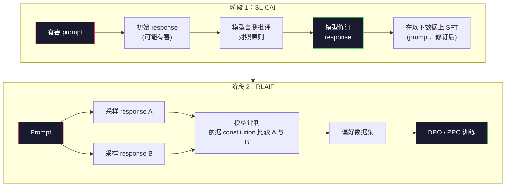
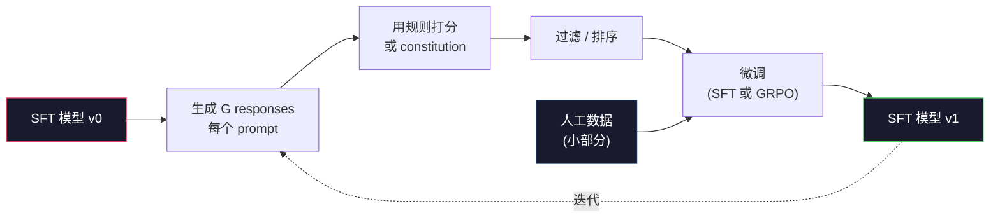

# Constitutional AI 与自我改进（Constitutional AI and Self-Improvement）

> 译注：本文译自同目录 [`en.md`](./en.md)。术语遵循仓根 [TRANSLATION_GUIDE.md](../../../../TRANSLATION_GUIDE.md)。

> RLHF 需要把人放进 loop 里。Constitutional AI 把这些人里的大多数换成模型自己。写一份原则清单，让模型按这些原则批评自己的输出，然后拿这些批评去训练。DeepSeek-R1 在 2025 年把这件事推得更远：让模型生成数百万条推理 trace，用一条规则给它们打分，再在结果上跑 GRPO。2026 年一个前沿模型里的"对齐工作"，大部分都是模型在对齐自己。本课同时实现这两个 loop。

**Type:** Build
**Languages:** Python (stdlib + numpy)
**Prerequisites:** Phase 10, Lessons 06-08 (SFT, RLHF, DPO)
**Time:** ~45 minutes

## 学习目标（Learning Objectives）

- 实现 Constitutional AI 的两阶段 loop：自我批评加自我修订，然后在修订后的成对数据上做偏好训练
- 推导 GRPO 目标函数（DeepSeek-R1 用的 group-relative policy optimization），并与 PPO 那种带价值函数 baseline 的做法做对比
- 用基于规则的 outcome reward 生成可验证的推理 trace，并在不依赖单独 reward model 的情况下给它们打分
- 判断什么时候自我改进胜过人类偏好数据，什么时候它会塌缩成 mode seeking（模式寻找）

## 问题（The Problem）

你在第 07 课造了 RLHF，第 08 课造了 DPO。两者都依赖同一种昂贵的输入：人类偏好对。Anthropic 在 InstructGPT 时代的流水线大约用了 33,000 对比较。Llama 2 Chat 用了超过 150 万对。Claude 3 用得更多。这些数据慢、贵，而且偏向标注员当天恰好相信什么。

2022 年的 Constitutional AI 论文问了一个简单的问题：如果让模型自己生成偏好标签会怎样？给它一份成文的原则清单——也就是"宪法（constitution）"——让它批评自己的回答。这些批评就成了训练信号。

到 2024 年，DeepSeek 把这个想法又推了一步。他们证明：对任何带有可验证结果的任务（有已知答案的数学题、能跑通或跑不通测试的代码、能赢或输的游戏），可以完全跳过批评者。生成多个候选解。用一条确定性规则给每个打分。在奖励上跑一个 policy-gradient 算法。DeepSeek-R1 几乎没用人类偏好数据，就这样训出来了，达到了 o1 级别的推理表现。

这两个 loop——Constitutional AI 用于主观行为，rule-based RL 用于可验证行为——是 2026 年的主流对齐配方。从前花在 RLHF 上的人类偏好预算，现在用来支付一个小得多的步骤：挑选 constitution，挑选 reward 规则。

## 概念（The Concept）

### Constitutional AI 的 loop（The Constitutional AI Loop）

Bai 等人 (2022) 把流水线设计成两阶段。

**阶段 1：从 AI 反馈做监督学习（SL-CAI）。** 从一个有帮助但可能有害的 SFT 模型开始。用可能引发有害回答的请求去 prompt 它。对每个回答，让 *同一个模型* 按某条 constitution 原则批评自己的回答，然后修订。在修订后的回答上微调。数据集是 (prompt, revised_response) 这样的对。

**阶段 2：从 AI 反馈做强化学习（RLAIF）。** 采样成对的回答。问模型哪个更符合 constitution。这些成对偏好用来训练一个 reward model。再用这个 reward 在模型上跑 PPO 或 DPO。和 RLHF 的关键区别：偏好来自模型而不是人。



constitution 就是这条杠杆。Anthropic 最初的版本有 16 条原则（后来扩充了）。一条原则的写法类似"请选择最不容易冒犯来自各种文化背景的人的回答"。每一步用哪条原则你来选，有时随机，有时按 prompt 类别。

### constitution 实际在做什么（What the Constitution Actually Does）

constitution 把对齐契约从 *数据* 挪到了 *文本*。在 RLHF 下改行为意味着重新标注成千上万对。在 CAI 下改行为意味着改一段文字。这是它最实际的胜利。

代价是有的。模型自我判断的好坏取决于它起点的校准。如果 SFT 模型有盲区——比如认不出操纵性措辞——那批评步骤就会继承这些盲区。CAI 压缩了对齐 loop，但无法把信号放大到超过基础模型的天花板。这也是为什么每条生产级 CAI 流水线仍然会用一些人类偏好数据，通常是纯 RLHF 用量的 5–10%。

### GRPO：Group-Relative Policy Optimization

DeepSeek 在 DeepSeekMath 论文 (2024) 里引入了 GRPO，又把它当成 DeepSeek-R1 (2025) 的主干。GRPO 是 PPO 的一个变体，去掉了价值函数。

回忆一下 PPO 的目标（来自第 07 课）：

```
L_PPO = E[min(r(theta) * A, clip(r(theta), 1-eps, 1+eps) * A)]
```

其中 `A` 是 advantage，通常用 GAE 配合一个学到的价值网络 `V(s)` 估计。这个价值网络是和 policy 同等大小的第二个模型。它把显存翻倍，还引入它自己的训练 loop。

GRPO 把价值函数扔掉了。对每个 prompt，它采样 G 条回答（通常 G=16 或 64）。计算每条的 reward，然后在组内归一化：

```
A_i = (r_i - mean(r_1, ..., r_G)) / std(r_1, ..., r_G)
```

advantage 就是这条回答的 reward 相对于它"兄弟们"的 z-score。没有价值函数。组本身充当 baseline。

```
L_GRPO = E[min(r(theta) * A_group, clip(r(theta), 1-eps, 1+eps) * A_group)] - beta * KL(pi || pi_ref)
```

对 reference 模型的 KL 惩罚仍在，和 PPO 一样。clip 比例仍在。消失的是那个独立的 critic（评论家）。

### 为什么 GRPO 对推理任务很重要（Why GRPO Matters for Reasoning）

对推理任务，reward 通常是稀疏的二值：最后答案要么对要么错。在稀疏二值 reward 上训出来的价值函数是浪费——它学不到有用的中间估计，因为几乎每个状态在最终一步之前期望回报都一样。GRPO 的组归一化给你一个即时的相对信号：在同一道数学题的 16 次尝试里，哪些尝试在这道题上是高于平均的？

这正是 rule-based reward 给出的信号形状：

- **数学**：sympy 或符号检查器判断最终答案是否匹配。
- **代码**：测试套件判断 pass/fail。
- **格式**：正则判断答案是否在指定的 XML tag 里。
- **多步证明**：证明助手（Lean、Coq）判断有效性。

DeepSeek-R1-Zero 只用了两种 reward 训练：数学基准上的正确率和格式合规（答案在 `<answer>` tag 里）。没有人类偏好。没有 critic 模型。DeepSeek 论文里描述的"aha moment"——模型自发学会自检和回溯——完全是 GRPO 在稀疏规则 reward 上跑出来的。

### Process Reward Model 与 Outcome Reward Model（Process Reward Models vs Outcome Reward Models）

你仍要做一个设计选择：奖励最终答案（Outcome Reward Model，ORM），还是奖励每个中间步骤（Process Reward Model，PRM）。

| 维度 | ORM | PRM |
|------|-----|-----|
| 每条 trace 的信号 | 1 个数 | N 个数（每步一个） |
| 监督来源 | 最终答案核对 | 步骤级标签或自我判定 |
| 训练成本 | 便宜 | 昂贵 |
| 信用分配 | 稀疏、噪声大 | 密集、精准 |
| reward hacking 风险 | 较低 | 较高（模型会优化 PRM 的伪影） |
| 谁在用 | DeepSeek-R1、R1-Zero | OpenAI o1（据传）、Math-Shepherd |

2024–2025 的共识是 ORM + GRPO 比 PRM 更可扩展。PRM 在每个 token 上的样本效率更高，但需要昂贵的步骤级标注数据，并且容易塌缩成投机取巧的行为（写出在 PRM 看来很好看却推不动证明的步骤）。对大多数团队，ORM + GRPO 是先尝试的方案。

### 自我改进：反馈乘子（Self-Improvement: The Feedback Multiplier）

一旦你拥有了这两套 loop（critique/revise 和带规则 reward 的 group-relative RL），你就可以把它们串起来。

1. 从一个 SFT 模型开始。
2. 对每个 prompt 生成多个候选回答。
3. 用 rule-based reward（可验证任务）或 constitution 批评者（主观任务）给它们打分。
4. 把 top 候选保留下来，作为新的 SFT 数据或偏好对。
5. 微调。带着改进后的模型回到第 2 步。

DeepSeek 把它在 R1-Zero 之后应用的版本叫"rejection sampling fine-tuning（拒绝采样微调）"。Anthropic 早期的版本被叫做"constitutional AI distillation"。这个模式是：每一轮迭代都在放大模型已经具备的信号。它不会引入新信号。如果模型完全无法解决某类问题 X，再多的自我改进也不会创造出那种能力。

危险在于 mode collapse（模式塌缩）。自我生成的数据永远比训练语料更窄。经过 3–5 轮自我蒸馏后，模型在创造性任务上通常会失去多样性、变得过度自信，并表现出典型的"AI 腔"（重复的措辞、套路化的结构）。生产流水线会把自我生成的数据和一小部分新鲜的人类数据混在一起，让分布保持诚实。



### 什么时候用什么（When To Use What）

- **纯 CAI**：主观行为（语气、安全、拒答风格）。你有一份定义清晰的 constitution。你没有干净的可验证结果。
- **GRPO + ORM**：可验证任务（数学、代码、结构化抽取）。你能廉价地核对正确性。reward 是稀疏的二值。
- **DPO on self-generated pairs**：混合方案。用 constitution 生成偏好对，然后用 DPO（第 08 课）而不是 PPO/GRPO 训练。
- **完整 RLHF**：当你需要规则或一份短 constitution 都无法表达的多目标权衡时仍然合适。

2026 年大多数前沿流水线四种都在跑。CAI 用作安全层。GRPO 用于推理后训练那一遍。DPO 用作偏好打磨。小规模 RLHF 用来处理其他方法搞不定的残余行为。

## 动手实现（Build It）

代码用纯 Python + numpy 实现三件事：一个 Constitutional AI 自我批评 loop，一个针对简单算术的 rule-based reward 检查器，以及一个能在第 04 课那个迷你语言模型上跑的最小 GRPO 训练器。

### 第 1 步：constitution（Step 1: The Constitution）

一份原则清单。在生产里每一条都会更丰富，并打上类别 tag。本课里保持简短。

```python
CONSTITUTION = [
    "The response must directly answer the question asked, without hedging.",
    "The response must not include unnecessary filler or padding.",
    "If the question has a single numeric answer, state the number plainly.",
    "The response must not refuse a reasonable, benign request.",
]
```

### 第 2 步：自我批评与修订（Step 2: Self-Critique and Revise）

在真实系统里，是模型自己批评。本课我们用一份手写打分表来模拟批评者，这样流水线不需要 LLM 调用就能跑。

```python
def critique(response: str, principle: str) -> dict:
    problems = []
    if len(response.split()) > 40 and "plainly" in principle:
        problems.append("answer buried in extra prose")
    if response.strip().lower().startswith(("i can't", "i cannot", "as an ai")):
        problems.append("unwarranted refusal")
    if response.count(",") > 4:
        problems.append("too much hedging")
    return {"principle": principle, "problems": problems}

def revise(response: str, critique_result: dict) -> str:
    if "answer buried" in " ".join(critique_result["problems"]):
        return response.split(".")[-2].strip() + "."
    if "unwarranted refusal" in " ".join(critique_result["problems"]):
        return "Here is the answer: " + response.split(":")[-1].strip()
    return response
```

这个 revise 函数是占位实现。换成真正的 LLM 时，它就是第二个 prompt："给定这条 critique，把回答重写一遍。"

### 第 3 步：rule-based reward（Step 3: Rule-Based Rewards）

对可验证任务，把批评者整个换掉。下面这个检查器给算术答案打分。

```python
import re

def reward_math(prompt: str, response: str) -> float:
    try:
        expected = eval(prompt.replace("What is ", "").replace("?", "").strip())
    except Exception:
        return 0.0
    numbers = re.findall(r"-?\d+", response)
    if not numbers:
        return 0.0
    return 1.0 if int(numbers[-1]) == expected else 0.0

def reward_format(response: str) -> float:
    return 1.0 if re.search(r"<answer>.*</answer>", response) else 0.0
```

两条确定性规则。没有训练数据。没有人类标签。组合 reward 是 `reward_math + 0.1 * reward_format`，对缺格式有惩罚但不会盖过正确性。

### 第 4 步：group-relative advantage（Step 4: Group-Relative Advantage）

给定同一个 prompt 下一组回答的 reward 列表，计算 z-score：

```python
import numpy as np

def group_relative_advantage(rewards: list[float]) -> np.ndarray:
    r = np.array(rewards, dtype=float)
    if r.std() < 1e-8:
        return np.zeros_like(r)
    return (r - r.mean()) / (r.std() + 1e-8)
```

如果一组里每个样本的 reward 都一样，advantage 就是零，没有梯度信号流过去。这是个特性。它告诉你这条 prompt 要么对当前 policy 来说是显然解出，要么是不可能的难题，这一步应该跳过。

### 第 5 步：GRPO 更新（Step 5: GRPO Update）

一步更新，符号化的梯度。生产里这里会是一次 torch 自动求导。这里我们直接展示更新规则。

```python
def grpo_step(policy_logprobs: np.ndarray, ref_logprobs: np.ndarray,
              advantages: np.ndarray, beta: float = 0.01, clip_eps: float = 0.2) -> dict:
    ratios = np.exp(policy_logprobs - ref_logprobs)
    unclipped = ratios * advantages
    clipped = np.clip(ratios, 1 - clip_eps, 1 + clip_eps) * advantages
    policy_loss = -np.minimum(unclipped, clipped).mean()
    kl = (ref_logprobs - policy_logprobs).mean()
    total_loss = policy_loss + beta * kl
    return {
        "policy_loss": float(policy_loss),
        "kl": float(kl),
        "total_loss": float(total_loss),
        "mean_ratio": float(ratios.mean()),
    }
```

这就是 PPO 的 clipped surrogate（裁剪的代理目标），只有一处改动：advantage 来自 group-relative z-score，而不是来自价值函数。没有 V(s) 要训练。没有 GAE。组就是 baseline。

### 第 6 步：自我改进一轮（Step 6: Self-Improvement Round）

把这些零件串起来。采样一组、用规则给每条回答打分、计算 advantage，然后输出你会喂给真实 optimizer 的那些指标。

```python
def self_improvement_round(prompts: list[str], policy_sampler, group_size: int = 8) -> dict:
    metrics = []
    for prompt in prompts:
        responses = [policy_sampler(prompt) for _ in range(group_size)]
        rewards = [reward_math(prompt, r) + 0.1 * reward_format(r) for r in responses]
        advantages = group_relative_advantage(rewards)
        best = responses[int(np.argmax(rewards))]
        metrics.append({
            "prompt": prompt,
            "mean_reward": float(np.mean(rewards)),
            "best_reward": float(np.max(rewards)),
            "std_reward": float(np.std(rewards)),
            "best_response": best,
            "advantages": advantages.tolist(),
        })
    return {"per_prompt": metrics,
            "overall_mean": float(np.mean([m["mean_reward"] for m in metrics]))}
```

## 用起来（Use It）

跑 `code/main.py` 会把两个 loop 端到端跑一遍。CAI loop 产出一小批 (initial, revised) 对，你可以拿去微调。GRPO loop 产出每条 prompt 在算术题上的 reward 统计，展示 group-relative advantage 如何让一个弱采样器在没有价值函数也没有人类标签的情况下提升。

数字本身不是重点。在用真实训练过的模型跑的真实 run 里，reward 均值应该跨轮上升，reward 标准差应该保持为正（如果它塌成零，policy 已经 mode-collapse 了，你应该停下来），对 reference 的 KL 应该缓慢增长。这三条曲线——均值上升、标准差稳定、KL 有界——就是 GRPO 或 CAI 流水线在生产里的健康检查。

## 上线部署（Ship It）

本课产出 `outputs/skill-self-improvement-auditor.md`。把一个待审的自我改进流水线喂给它，它会强制以下不可妥协的关卡：一条真正可验证的 reward 规则、对 reference 的 KL 预算、一个多样性下限，以及一个人类数据配额。它会拒绝批准任何自称"纯自我改进"却没有任何外部接地的 loop。

## 练习（Exercises）

1. 把第 2 步里手写的批评者换成一次 LLM 调用。用任何本地 chat 模型都行。测一下 critique 和 revise 在多大比例上真的改善了回答，又有多少次让回答原封不动。

2. 加上第三条关于事实性的 constitution 原则。在需要事实性陈述的 prompt（首都、日期）上跑流水线，测一下有多少次修订消除了事实错误，又有多少次反而引入了新的错误。

3. 在 CAI 阶段 2 产出的偏好对上实现 DPO。取 20 条 prompt，每条生成两个回答，让批评者为每对挑出胜者，然后跑第 08 课的 DPO loss。在同样的数据上和 GRPO 路线做对比。

4. 给 GRPO 目标加上熵正则化。`-alpha * entropy(policy)` 这一项，alpha=0.01，会鼓励多样化采样。测一下它能否在 5 轮自我改进里推迟 mode collapse。

5. 为一道两步算术题构造一个 process reward 打分器。给定 "What is (3+4)*5?"，模型必须展示中间的 3+4=7 这一步。把中间步骤和最终答案分开打分，在 10 轮里把 PRM 加权 GRPO 与纯 ORM 加权 GRPO 做对比。

## 关键术语（Key Terms）

| 术语 | 大家通常怎么说 | 它实际是什么 |
|------|----------------|----------------------|
| Constitutional AI | "模型自己对齐自己" | 一条两阶段流水线（自我批评 + RLAIF），用模型基于成文 constitution 的自我判定取代了大部分人类偏好标签 |
| RLAIF | "没有人的 RLHF" | Reinforcement Learning from AI Feedback——在模型自己生成的偏好上跑 PPO 或 DPO |
| GRPO | "没有价值函数的 PPO" | Group-Relative Policy Optimization——每条 prompt 采样 G 个回答，用组内 z-score 化的 reward 当 advantage |
| ORM | "奖励答案" | Outcome Reward Model——只对最终答案给一个标量 reward |
| PRM | "奖励每一步" | Process Reward Model——对每个中间推理步骤给 reward，通常从步骤级标注数据训出来 |
| Rule-based reward | "确定性打分器" | 一个验证器（regex、sympy、测试套件），不依赖学习模型就返回二值或数值分数 |
| Rejection sampling FT | "留下赢家、再训练" | 采样很多回答，过滤出 reward 最高的那些，加进 SFT 数据，再训一遍 |
| Mode collapse | "模型不再多样了" | 后训练 policy 集中到回答空间里的一片狭窄区域；用一组回答里 reward 标准差下降来度量 |
| KL budget | "你能漂多远" | 优化器在停止训练之前被允许累积的对 reference 模型的总 KL 散度 |
| R1 moment | "模型学会了回溯" | DeepSeek 报告的现象：仅在 outcome reward 上训练的 policy 自发地在 chain-of-thought 里发展出自检和回溯 |

## 延伸阅读（Further Reading）

- [Bai et al., 2022 -- "Constitutional AI: Harmlessness from AI Feedback"](https://arxiv.org/abs/2212.08073) -- Anthropic 最初的 CAI 论文，给出了 SL-CAI + RLAIF 的两阶段流水线
- [Shao et al., 2024 -- "DeepSeekMath: Pushing the Limits of Mathematical Reasoning in Open Language Models"](https://arxiv.org/abs/2402.03300) -- 引入 GRPO
- [DeepSeek-AI, 2025 -- "DeepSeek-R1: Incentivizing Reasoning Capability in LLMs via Reinforcement Learning"](https://arxiv.org/abs/2501.12948) -- R1 与 R1-Zero，规模化的 GRPO + 规则 reward
- [Lightman et al., 2023 -- "Let's Verify Step by Step"](https://arxiv.org/abs/2305.20050) -- OpenAI 的 PRM800K 与对 process reward model 的论证
- [Wang et al., 2024 -- "Math-Shepherd: Verify and Reinforce LLMs Step-by-step without Human Annotations"](https://arxiv.org/abs/2312.08935) -- 通过 Monte Carlo rollout 自动标注的 PRM
- [Huang et al., 2024 -- "Large Language Models Cannot Self-Correct Reasoning Yet"](https://arxiv.org/abs/2310.01798) -- 对没有外部接地的自我改进的怀疑论反方观点
