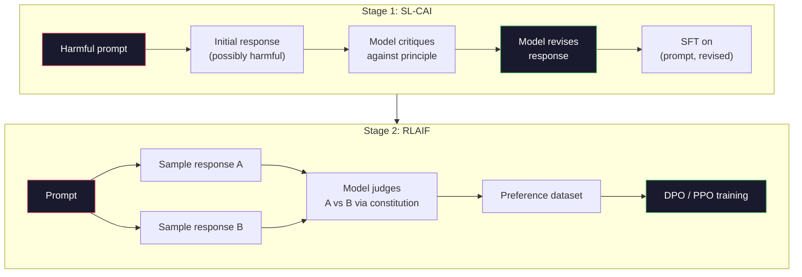
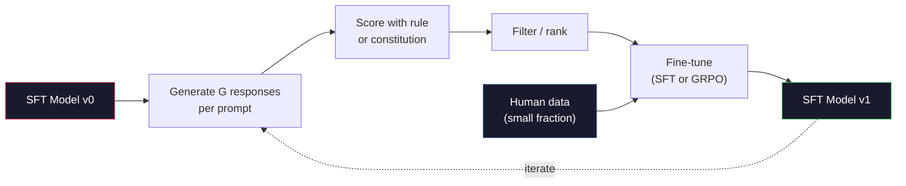

# 09 · 宪法式 AI 与自我改进

> RLHF 需要人类参与回路。宪法式 AI（Constitutional AI）用模型自身替换掉其中大部分人类。写一份原则清单，让模型对照这些原则批判自己的输出，再用这些批判来训练。DeepSeek-R1 在 2025 年把这套思路推得更远：让模型生成数百万条推理轨迹，用一条规则给它们打分，然后对结果跑 GRPO。在 2026 年的前沿模型里，绝大多数「对齐工作」其实就是模型对自己做的对齐。本课会把这两个回路都搭建出来。

**类型：** 构建
**语言：** Python（标准库 + numpy）
**前置：** 第 10 阶段，第 06-08 课（SFT、RLHF、DPO）
**时长：** 约 45 分钟

## 学习目标

- 实现宪法式 AI 的两阶段回路：自我批判加自我修订，然后用修订后的样本对做偏好训练
- 推导 GRPO（DeepSeek-R1 的群组相对策略优化，group-relative policy optimization）目标函数，并与 PPO 基于价值函数的基线做对比
- 用基于规则的结果奖励生成可验证的推理轨迹，并在没有独立奖励模型的情况下给它们打分
- 判断什么时候自我改进胜过人类偏好数据，以及什么时候它会坍缩成「模式寻求」（mode seeking）

## 问题所在

你在第 07 课搭建了 RLHF，在第 08 课搭建了 DPO。两者都依赖同一种昂贵的输入：人类偏好样本对。Anthropic 在 InstructGPT 时代的管线大约用了 33,000 组比较。Llama 2 Chat 用了超过 150 万组。Claude 3 用得更多。这些数据采集慢、成本高，而且会偏向标注者在评分那天恰好持有的任何观点。

2022 年的宪法式 AI 论文提出了一个简单的问题：如果让模型自己生成偏好标签会怎样？给它一份成文的原则清单——也就是「宪法」（constitution）——让它批判自己的回答。这些批判就成了训练信号。

2024 年，DeepSeek 把这个想法又往前推了一步。他们证明，对于任何具有可验证结果的任务（有已知答案的数学题、要么通过要么不通过测试的代码、要么赢要么输的游戏），你完全可以跳过批判者（critic）。生成许多候选解。用一条确定性规则给每个解打分。在奖励上跑策略梯度算法。DeepSeek-R1 几乎没用人类偏好数据就以这种方式训练出来，并达到了 o1 级别的推理性能。

这两个回路——用于主观行为的宪法式 AI，以及用于可验证行为的基于规则的强化学习（RL）——是 2026 年主导的对齐配方。过去投入 RLHF 的人类偏好预算，如今只用在一个小得多的步骤上：挑选宪法和挑选奖励规则。

## 核心概念

### 宪法式 AI 回路

Bai 等人（2022）把整条管线分成两个阶段。

**阶段一：从 AI 反馈中监督学习（Supervised Learning from AI Feedback，SL-CAI）。** 从一个有帮助但可能有害的 SFT 模型出发。用潜在有害的请求去提示它。对每个回答，让*同一个模型*对照某条宪法原则批判自己的回答，然后修订。在修订后的回答上微调。数据集是 (prompt, revised_response) 样本对。

**阶段二：从 AI 反馈中强化学习（Reinforcement Learning from AI Feedback，RLAIF）。** 采样成对的回答。让模型判断哪一个更符合宪法。这些成对偏好用于训练一个奖励模型。然后用该奖励对模型跑 PPO 或 DPO。与 RLHF 的关键区别在于：偏好来自模型，而非人类。



宪法就是那根杠杆。Anthropic 最初的版本有 16 条原则（后来扩充）。一条原则读起来像是「请选择最不可能让来自各种文化背景的人感到反感的回答」。你为每一步挑选原则，有时随机挑，有时根据提示词的类别来挑。

### 宪法实际上做了什么

宪法把对齐契约从*数据*转移到了*文本*。在 RLHF 下改变行为意味着要重新标注成千上万的样本对。在 CAI 下改变行为意味着编辑一个段落。这是它在实践中最主要的胜利。

它也有代价。模型的自我判断只能和它的初始校准（calibration）一样好。如果 SFT 模型有盲区——比如它认不出操纵性的措辞——那么批判步骤就会继承这些盲区。CAI 压缩了对齐回路，但无法把信号放大到超过基座模型的上限。这就是为什么每一条生产级 CAI 管线仍然会用到一些人类偏好数据，通常是纯 RLHF 用量的 5-10%。

### GRPO：群组相对策略优化

DeepSeek 在 DeepSeekMath 论文（2024）中引入了 GRPO，并将其用作 DeepSeek-R1（2025）的骨干。GRPO 是 PPO 的一个变体，去掉了价值函数。

回顾 PPO 的目标函数（来自第 07 课）：

```
L_PPO = E[min(r(theta) * A, clip(r(theta), 1-eps, 1+eps) * A)]
```

其中 `A` 是优势（advantage），通常用 GAE 配合一个学习得到的价值网络 `V(s)` 来估计。价值网络是第二个模型，大小与策略相同。它使内存翻倍，并引入它自己的训练回路。

GRPO 扔掉了价值函数。对于每个提示词，它采样一组共 G 个回答（通常 G=16 或 64）。计算每个回答的奖励，然后在组内归一化：

```
A_i = (r_i - mean(r_1, ..., r_G)) / std(r_1, ..., r_G)
```

优势就是该回答的奖励相对于它的同胞回答的 z 分数（z-score）。没有价值函数。组本身充当自己的基线。

```
L_GRPO = E[min(r(theta) * A_group, clip(r(theta), 1-eps, 1+eps) * A_group)] - beta * KL(pi || pi_ref)
```

针对参考模型的 KL 惩罚仍然在，与 PPO 相同。裁剪比率（clip ratio）仍然在。消失的只是那个独立的批判者。

### GRPO 为何对推理任务重要

对推理任务来说，奖励往往是稀疏且二元的：最终答案要么对要么错。在稀疏二元奖励上训练价值函数是一种浪费——它学不到有用的中间估计，因为几乎每个状态在到达最后一步之前都有相同的期望回报。GRPO 的组内归一化给了你一个即时的相对信号：在对同一道数学题的 16 次尝试中，哪些尝试对这道题来说高于平均水平？

这正是你从基于规则的奖励中得到的信号形态：

- **数学**：由 sympy 或某个符号检查器判定最终答案是否匹配。
- **代码**：由测试套件判定通过/失败。
- **格式**：由正则表达式判定答案是否位于所要求的 XML 标签内。
- **多步证明**：由证明助手（Lean、Coq）判定有效性。

DeepSeek-R1-Zero 仅用两种奖励训练：数学基准上的准确率，以及格式合规性（答案在 `<answer>` 标签内）。没有人类偏好。没有批判者模型。DeepSeek 论文描述的那个「顿悟时刻」（aha moment）——模型自发学会自我检查和回溯——仅仅是从对稀疏规则奖励跑 GRPO 中涌现出来的。

### 过程奖励模型 vs 结果奖励模型

你仍然有一个设计选择：奖励最终答案（结果奖励模型，Outcome Reward Model，ORM）还是奖励每一个中间步骤（过程奖励模型，Process Reward Model，PRM）。

| 维度 | ORM | PRM |
|------|-----|-----|
| 每条轨迹的信号 | 1 个数字 | N 个数字（每步一个） |
| 监督来源 | 最终答案检查 | 步骤级标签或自我判断 |
| 训练成本 | 便宜 | 昂贵 |
| 信用分配 | 稀疏、有噪声 | 密集、有针对性 |
| 奖励作弊风险 | 较低 | 较高（模型会优化 PRM 的伪特征） |
| 使用方 | DeepSeek-R1、R1-Zero | OpenAI o1（据称）、Math-Shepherd |

2024-2025 年的共识是：ORM 加 GRPO 比 PRM 更易扩展。PRM 在每个 token 上的样本效率更高，但需要昂贵的步骤标注数据，而且往往坍缩成走捷径的行为（写出对 PRM 看起来不错、却无助于推进证明的步骤）。对大多数团队来说，ORM + GRPO 是首选尝试的方案。

### 自我改进：反馈放大器

一旦你有了这套双回路模式（批判/修订，以及带规则奖励的群组相对 RL），你就可以把它们串联起来。

1. 从一个 SFT 模型出发。
2. 为每个提示词生成许多候选回答。
3. 用基于规则的奖励（针对可验证任务）或宪法批判者（针对主观任务）给它们打分。
4. 把最优候选保留为新的 SFT 数据或偏好样本对。
5. 微调。用改进后的模型回到第 2 步。

DeepSeek 在 R1-Zero 之后应用这套时称之为「拒绝采样微调」（rejection sampling fine-tuning）。Anthropic 把它的一个更早版本称作「宪法式 AI 蒸馏」（constitutional AI distillation）。这套模式的本质是：每次迭代都放大模型中已有的信号。它不会增加新信号。如果模型根本解不出 X 类问题，那么再多的自我改进也无法凭空创造出那种能力。

危险在于模式坍缩（mode collapse）。自生成数据的分布总是比训练语料更窄。在 3-5 轮自蒸馏之后，模型通常会在创意类任务上失去多样性，变得过度自信，并表现出特征性的「AI 腔」（重复的措辞、套路化的结构）。生产级管线会把自生成数据和一小部分新鲜的人类数据混合，以保持分布的诚实。



### 何时用何种方法

- **纯 CAI**：主观行为（语气、安全性、拒答风格）。你有一份定义良好的宪法。你没有干净的可验证结果。
- **GRPO + ORM**：可验证任务（数学、代码、结构化抽取）。你能廉价地检查正确性。奖励稀疏且二元。
- **在自生成样本对上做 DPO**：混合方案。用宪法产出偏好样本对，然后用 DPO（第 08 课）而非 PPO/GRPO 来训练。
- **完整 RLHF**：当你需要规则或简短宪法都无法表达的多目标权衡时，它仍然合适。

2026 年大多数前沿管线四种都跑。CAI 用于安全层。GRPO 用于推理的后训练环节。DPO 用于偏好打磨。小规模 RLHF 环节用于那些抵抗其他方法的残余行为。

## 动手构建

代码用纯 Python + numpy 实现三样东西。一个宪法式 AI 自我批判回路。一个针对简单算术的基于规则的奖励检查器。一个最小化的 GRPO 训练器，运行在来自第 04 课的微型语言模型上。

### 第 1 步：宪法

一份原则清单。在生产环境中，每一行都会更丰富并带类别标签。本课里我们保持简短。

```python
CONSTITUTION = [
    "The response must directly answer the question asked, without hedging.",
    "The response must not include unnecessary filler or padding.",
    "If the question has a single numeric answer, state the number plainly.",
    "The response must not refuse a reasonable, benign request.",
]
```

### 第 2 步：自我批判与修订

在真实系统中，是模型自己做批判。本课里我们用一份手写的评分标准来模拟批判者，这样整条管线无需调用 LLM 即可运行。

```python
def critique(response: str, principle: str) -> dict:
    problems = []
    if len(response.split()) > 40 and "plainly" in principle:
        problems.append("answer buried in extra prose")
    if response.strip().lower().startswith(("i can't", "i cannot", "as an ai")):
        problems.append("unwarranted refusal")
    if response.count(",") > 4:
        problems.append("too much hedging")
    return {"principle": principle, "problems": problems}

def revise(response: str, critique_result: dict) -> str:
    if "answer buried" in " ".join(critique_result["problems"]):
        return response.split(".")[-2].strip() + "."
    if "unwarranted refusal" in " ".join(critique_result["problems"]):
        return "Here is the answer: " + response.split(":")[-1].strip()
    return response
```

revise 函数只是一个替身。换成真实的 LLM，它会是第二个提示词：「根据这条批判，重写这个回答。」

### 第 3 步：基于规则的奖励

对可验证任务，完全替换掉批判者。这个检查器给算术答案打分。

```python
import re

def reward_math(prompt: str, response: str) -> float:
    try:
        expected = eval(prompt.replace("What is ", "").replace("?", "").strip())
    except Exception:
        return 0.0
    numbers = re.findall(r"-?\d+", response)
    if not numbers:
        return 0.0
    return 1.0 if int(numbers[-1]) == expected else 0.0

def reward_format(response: str) -> float:
    return 1.0 if re.search(r"<answer>.*</answer>", response) else 0.0
```

两条确定性规则。没有训练数据。没有人类标签。组合奖励是 `reward_math + 0.1 * reward_format`，对缺失格式做惩罚，但又不至于淹没正确性。

### 第 4 步：群组相对优势

给定同一提示词下一组回答的奖励列表，计算 z 分数：

```python
import numpy as np

def group_relative_advantage(rewards: list[float]) -> np.ndarray:
    r = np.array(rewards, dtype=float)
    if r.std() < 1e-8:
        return np.zeros_like(r)
    return (r - r.mean()) / (r.std() + 1e-8)
```

如果组内每个样本的奖励都相同，优势就是零，没有梯度信号流动。这是一个特性，不是缺陷。它告诉你：对当前策略而言，这个提示词要么平凡可解，要么不可能解，这一步应当跳过。

### 第 5 步：GRPO 更新

一步更新，符号化梯度。在生产环境中这会是一次 torch 自动求导过程。这里我们直接展示更新规则。

```python
def grpo_step(policy_logprobs: np.ndarray, ref_logprobs: np.ndarray,
              advantages: np.ndarray, beta: float = 0.01, clip_eps: float = 0.2) -> dict:
    ratios = np.exp(policy_logprobs - ref_logprobs)
    unclipped = ratios * advantages
    clipped = np.clip(ratios, 1 - clip_eps, 1 + clip_eps) * advantages
    policy_loss = -np.minimum(unclipped, clipped).mean()
    kl = (ref_logprobs - policy_logprobs).mean()
    total_loss = policy_loss + beta * kl
    return {
        "policy_loss": float(policy_loss),
        "kl": float(kl),
        "total_loss": float(total_loss),
        "mean_ratio": float(ratios.mean()),
    }
```

这就是 PPO 的裁剪代理目标，只有一处改动：优势来自群组相对的 z 分数，而非价值函数。没有要训练的 V(s)。没有 GAE。组就是基线。

### 第 6 步：自我改进一轮

把各部分串起来。采样一组，用规则给每个回答打分，计算优势，报告你会喂给真实优化器的那些指标。

```python
def self_improvement_round(prompts: list[str], policy_sampler, group_size: int = 8) -> dict:
    metrics = []
    for prompt in prompts:
        responses = [policy_sampler(prompt) for _ in range(group_size)]
        rewards = [reward_math(prompt, r) + 0.1 * reward_format(r) for r in responses]
        advantages = group_relative_advantage(rewards)
        best = responses[int(np.argmax(rewards))]
        metrics.append({
            "prompt": prompt,
            "mean_reward": float(np.mean(rewards)),
            "best_reward": float(np.max(rewards)),
            "std_reward": float(np.std(rewards)),
            "best_response": best,
            "advantages": advantages.tolist(),
        })
    return {"per_prompt": metrics,
            "overall_mean": float(np.mean([m["mean_reward"] for m in metrics]))}
```

## 实际运行

运行 `code/main.py` 会把两个回路从头到尾跑一遍。CAI 回路产出一小组 (initial, revised) 样本对，你可以拿去微调。GRPO 回路产出算术问题的逐提示词奖励统计，展示群组相对优势如何让一个弱采样器在没有价值函数、没有人类标签的情况下也能改进。

数字本身不是重点。在用训练好的模型做的真实运行中，奖励均值应当随轮次攀升，奖励标准差应当保持为正（如果它坍缩到零，说明策略已模式坍缩，你应当停止），而对参考模型的 KL 应当缓慢增长。这三条曲线——均值奖励上升、标准差稳定、KL 有界——就是 GRPO 或 CAI 管线的生产级健康检查。

## 交付物

本课产出 `outputs/skill-self-improvement-auditor.md`。把一条拟定的自我改进管线喂给它，它会强制执行那些不可妥协的门禁：一条真正可验证的奖励规则、一个针对参考模型的 KL 预算、一个多样性下限，以及一个人类数据配额。它会拒绝批准任何号称「纯自我改进」却没有任何外部锚定的回路。

## 练习

1. 用一次 LLM 调用替换第 2 步里手写的批判者。使用任意本地聊天模型。测量批判和修订真正改善回答的频率，与让回答保持不变的频率相比如何。

2. 增加第三条关于事实性的宪法原则。在需要事实性论断的提示词（首都、日期）上运行管线，测量有多少次修订消除了事实错误，有多少次反而引入了新错误。

3. 在 CAI 阶段二产出的偏好样本对上实现 DPO。取 20 个提示词，每个生成两个回答，让批判者为每一对挑出胜者，然后跑第 08 课的 DPO 损失。在相同数据上与 GRPO 路径做对比。

4. 给 GRPO 目标加上熵正则化。`-alpha * entropy(policy)` 这一项（alpha=0.01）会鼓励多样化采样。测量它能否在 5 轮自我改进中延缓模式坍缩。

5. 为一道两步算术题构建一个过程奖励打分器。给定「What is (3+4)*5?」，模型必须展示中间步骤 3+4=7。把中间步骤与最终答案分开评分，并在 10 轮中对比 PRM 加权的 GRPO 与纯 ORM 加权的 GRPO。

## 关键术语

| 术语 | 人们怎么说 | 它实际上的意思 |
|------|----------------|----------------------|
| 宪法式 AI（Constitutional AI） | 「模型给自己对齐」 | 一条两阶段管线（自我批判 + RLAIF），用模型对照一份成文宪法的自我判断替换掉大部分人类偏好标签 |
| RLAIF | 「没有人类的 RLHF」 | 从 AI 反馈中强化学习——在模型自己生成的偏好上跑 PPO 或 DPO |
| GRPO | 「没有价值函数的 PPO」 | 群组相对策略优化——每个提示词采样 G 个回答，用 z 分数化的组内奖励作为优势 |
| ORM | 「奖励答案」 | 结果奖励模型——仅对最终答案给出单个标量奖励 |
| PRM | 「奖励每一步」 | 过程奖励模型——对每个中间推理步骤给出奖励，通常用步骤标注数据训练 |
| 基于规则的奖励（Rule-based reward） | 「确定性评分器」 | 一个验证器（正则、sympy、测试套件），不依赖学习得到的模型就返回二元或数值分数 |
| 拒绝采样微调（Rejection sampling FT） | 「留下赢家，重新训练」 | 采样许多回答，过滤出奖励最高的那些，加入 SFT 数据，重新训练 |
| 模式坍缩（Mode collapse） | 「模型不再多样化了」 | 后训练策略集中在回答空间的一个狭窄区域；以一组回答内奖励标准差的下降来衡量 |
| KL 预算（KL budget） | 「你能漂移多远」 | 优化器在训练停止前被允许累积的、相对参考模型的总 KL 散度 |
| R1 时刻（R1 moment） | 「模型学会了回溯」 | DeepSeek 报告的一种行为：仅用结果奖励训练的策略在其思维链中自发发展出自我检查与回溯 |

## 延伸阅读

- [Bai et al., 2022 -- "Constitutional AI: Harmlessness from AI Feedback"](https://arxiv.org/abs/2212.08073) -- Anthropic 关于 CAI 的原始论文，提出两阶段 SL-CAI + RLAIF 管线
- [Shao et al., 2024 -- "DeepSeekMath: Pushing the Limits of Mathematical Reasoning in Open Language Models"](https://arxiv.org/abs/2402.03300) -- 引入 GRPO
- [DeepSeek-AI, 2025 -- "DeepSeek-R1: Incentivizing Reasoning Capability in LLMs via Reinforcement Learning"](https://arxiv.org/abs/2501.12948) -- R1 与 R1-Zero，规模化的 GRPO + 规则奖励
- [Lightman et al., 2023 -- "Let's Verify Step by Step"](https://arxiv.org/abs/2305.20050) -- OpenAI 的 PRM800K 以及支持过程奖励模型的论证
- [Wang et al., 2024 -- "Math-Shepherd: Verify and Reinforce LLMs Step-by-step without Human Annotations"](https://arxiv.org/abs/2312.08935) -- 通过蒙特卡洛 rollout 自动标注的 PRM
- [Huang et al., 2024 -- "Large Language Models Cannot Self-Correct Reasoning Yet"](https://arxiv.org/abs/2310.01798) -- 关于无外部锚定的自我改进的怀疑性反论
