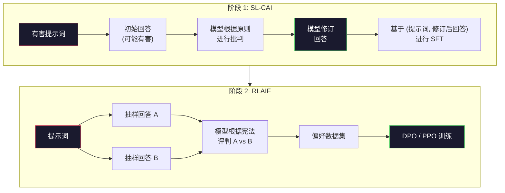
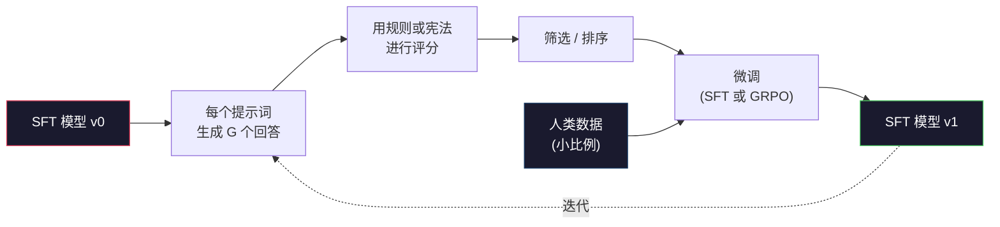

# 宪法式AI（Constitutional AI）与自我改进（Self-Improvement）

> RLHF 需要人类参与循环。宪法式AI（Constitutional AI）用模型自身取代了大部分人类。编写一组原则，让模型根据这些原则批判自己的输出，然后基于批判进行训练。DeepSeek-R1 在 2025 年进一步推进了这一思路：让模型生成数百万条推理轨迹，用规则对其进行评分，并在结果上运行 GRPO。2026 年前沿模型中大部分的"对齐工作"实际上是由模型自身完成的对齐。本课程构建了这两种循环。

**类型：** 构建
**语言：** Python（stdlib + numpy）
**前置条件：** 阶段 10，课程 06-08（SFT, RLHF, DPO）
**时间：** 约 45 分钟

## 学习目标

- 实现宪法式AI的两阶段循环：自我批判（Self-Critique）加自我修订（Self-Revision），然后在修订后的数据对上进行偏好训练（Preference Training）
- 推导 GRPO 目标函数（DeepSeek-R1 的组相对策略优化，Group-Relative Policy Optimization），并将其与 PPO 的值函数基线进行对比
- 生成可验证的推理轨迹，使用基于规则的结局奖励（Outcome Rewards）进行评分，无需独立的奖励模型
- 判断何时自我改进优于人类偏好数据，何时会退化为模式寻求（Mode Seeking）

## 问题背景

你在课程 07 中构建了 RLHF，在课程 08 中构建了 DPO。两者都依赖同一项昂贵的输入：人类偏好数据对。Anthropic 的 InstructGPT 时代流水线使用了约 33,000 次比较。Llama 2 Chat 使用了超过 150 万次。Claude 3 使用了更多。这些数据收集缓慢、成本高昂，并且偏向于标注员在评分当天所持有的任何观点。

2022 年的宪法式AI论文提出了一个简单的问题：如果模型自己生成偏好标签会怎样？给它一份成文的原则列表——"宪法（Constitution）"——让它批判自己的回答。这些批判就成为了训练信号。

2024 年，DeepSeek 将这一想法推得更远。他们表明，对于任何具有可验证结局（有已知答案的数学题、通过或失败的代码、赢或输的游戏）的任务，你可以完全跳过批判者。生成多个候选解，用确定性规则对每个解进行评分，然后在奖励上运行策略梯度算法。DeepSeek-R1 几乎完全没有使用人类偏好数据，以这种方式训练，并达到了 o1 级别的推理性能。

这两个循环——用于主观行为的宪法式AI和用于可验证行为的基于规则的强化学习——是 2026 年主要的对齐方案。过去用于 RLHF 的人类偏好预算现在只用于一个更小的步骤：选择宪法和选择奖励规则。

## 核心概念

### 宪法式AI循环

Bai 等人（2022）将流水线分为两个阶段。

**阶段 1：基于AI反馈的监督学习（SL-CAI）。** 从一个有帮助但可能有害的 SFT 模型开始。用可能有害的提示词（Prompt）对其进行提问。对于每个回答，让*同一个模型*根据宪法原则批判自己的回答，然后进行修订。在修订后的回答上进行微调。数据集是（提示词, 修订后回答）对。

**阶段 2：基于AI反馈的强化学习（RLAIF）。** 对回答进行配对抽样。让模型判断哪一个更符合宪法。成对偏好训练一个奖励模型。然后在该奖励上对模型运行 PPO 或 DPO。与 RLHF 的关键区别：偏好来自模型，而非人类。



宪法就是杠杆。Anthropic 最初的宪法有 16 条原则（后来扩展了）。一条原则如："请选择最不可能引起任何来自广泛文化背景的人反对的回答。" 你可以为每一步选择原则，有时随机，有时根据提示词类别。

### 宪法实际做了什么

宪法将对齐合约从*数据*转移到了*文本*。在 RLHF 下改变行为意味着重新标注成千上万的数据对。在 CAI 下改变行为则意味着编辑一段文字。这是主要的实践优势。

它也有代价。模型的自我判断准确度取决于其初始校准。如果 SFT 模型存在盲点——例如，无法识别操纵性措辞——那么批判步骤也会继承这些盲点。CAI 压缩了对齐循环，但无法将信号放大到基础模型天花板之上。这就是为什么每个生产环境的 CAI 流水线仍然使用一些人类偏好数据，通常是纯 RLHF 数据量的 5-10%。

### GRPO：组相对策略优化（Group-Relative Policy Optimization）

DeepSeek 在 DeepSeekMath 论文（2024）中引入了 GRPO，并在 DeepSeek-R1（2025）中将其作为骨干。GRPO 是 PPO 的一种变体，去掉了值函数（Value Function）。

回顾 PPO 的目标函数（来自课程 07）：

```
L_PPO = E[min(r(theta) * A, clip(r(theta), 1-eps, 1+eps) * A)]
```

其中 `A` 是优势（Advantage），通常通过 GAE 使用学习到的值网络 `V(s)` 来估计。值网络是一个与策略模型大小相同的第二个模型。它使内存加倍，并引入自己的训练循环。

GRPO 抛弃了值函数。对于每个提示词，它抽样一组 G 个回答（通常 G=16 或 64）。计算每个回答的奖励，然后在组内进行归一化：

```
A_i = (r_i - mean(r_1, ..., r_G)) / std(r_1, ..., r_G)
```

优势就是该回答奖励相对于其同组回答的 z 分数。没有值函数。组自身充当基线。

```
L_GRPO = E[min(r(theta) * A_group, clip(r(theta), 1-eps, 1+eps) * A_group)] - beta * KL(pi || pi_ref)
```

针对参考模型的 KL 惩罚仍然存在，与 PPO 相同。裁剪比例也仍然存在。消失的是独立的批判网络（Critic）。

### 为什么 GRPO 对推理很重要

对于推理任务，奖励通常是稀疏且二元的：最终答案对或错。在稀疏二元奖励上训练值函数是一种浪费——它无法学到有用的中间估计，因为几乎每个状态直到最后一步都具有相同的预期回报。GRPO 的组归一化给你一个即时的相对信号：在同一个数学问题的 16 次尝试中，哪些尝试在该问题上高于平均水平？

这正是你从基于规则的奖励中得到的信号形状：

- **数学**：用 sympy 或符号检查器判断最终答案是否匹配。
- **代码**：测试套件决定通过/失败。
- **格式**：正则表达式决定答案是否在要求的 XML 标签内。
- **多步证明**：证明助手（Lean, Coq）决定有效性。

DeepSeek-R1-Zero 仅用两个奖励进行训练：在数学基准上的准确率和格式合规性（答案在 `<answer>` 标签内）。没有人类偏好。没有批判模型。DeepSeek 论文中描述的"顿悟时刻"（Aha moment）——模型自发学会自我检查和回溯——仅仅来自稀疏规则奖励上的 GRPO。

### 过程奖励模型（Process Reward Model）与结局奖励模型（Outcome Reward Model）

你仍然有一个设计选择：奖励最终答案（结局奖励模型，ORM）还是奖励每个中间步骤（过程奖励模型，PRM）。

| 轴 | ORM | PRM |
|------|-----|-----|
| 每条轨迹的信号 | 1 个数值 | N 个数值（每步一个） |
| 监督来源 | 最终答案检查 | 步骤级别标签或自我判断 |
| 训练成本 | 便宜 | 昂贵 |
| 信用分配 | 稀疏、有噪声 | 密集、有针对性 |
| 奖励破解风险 | 较低 | 较高（模型优化 PRM 的伪像） |
| 使用者 | DeepSeek-R1, R1-Zero | OpenAI o1（据称）, Math-Shepherd |

2024-2025 年的共识是，ORM 加上 GRPO 比 PRM 扩展性更好。PRM 在每个 token 上样本效率更高，但需要昂贵的步骤标注数据，并且容易退化为捷径行为（写出对 PRM 看起来很好但并未推进证明的步骤）。对于大多数团队，ORM + GRPO 是首选尝试。

### 自我改进：反馈倍增器

一旦你拥有了双循环模式（批判/修订和组相对强化学习+规则奖励），你就可以将它们串联起来。

1. 从一个 SFT 模型开始。
2. 对每个提示词生成多个候选回答。
3. 用基于规则的奖励（对于可验证任务）或宪法批判者（对于主观任务）对它们进行评分。
4. 保留最佳候选作为新的 SFT 数据或偏好对。
5. 微调。回到步骤 2，使用改进后的模型。

DeepSeek 在 R1-Zero 之后将这种方法称为"拒绝抽样微调（Rejection Sampling Fine-Tuning）"。Anthropic 将早期版本称为"宪法式AI蒸馏"。这种模式是：每次迭代都会放大模型中已有的信号。它不会添加新信号。如果模型根本不能解决 X 类问题，再多的自我改进也无法创造出这种能力。

危险是模式崩溃（Mode Collapse）。自我生成的数据总是比训练语料库的分布更窄。经过 3-5 轮自我蒸馏后，模型在创造性任务上通常会失去多样性，变得过于自信，并表现出标志性的"AI 腔调"（重复措辞、公式化结构）。生产流水线会将自我生成的数据与一小部分新鲜的人类数据混合，以保持分布的真实性。



### 何时使用哪种方法

- **纯 CAI**：主观行为（语气、安全性、拒绝风格）。你有明确界定的宪法。你没有清晰的可验证结局。
- **GRPO + ORM**：可验证任务（数学、代码、结构化提取）。你可以廉价地检查正确性。奖励稀疏且二元。
- **对自生成数据对应用 DPO**：混合方法。使用宪法生成偏好对，然后使用 DPO（课程 08）而不是 PPO/GRPO 进行训练。
- **完整 RLHF**：当你需要多目标权衡，而规则或简短的宪法无法表达时，仍然合适。

大多数 2026 年前沿流水线会同时运行这四种方法。CAI 用于安全层。GRPO 用于推理的后训练阶段。DPO 用于偏好微调。小型 RLHF 用于抵抗其他方法的残余行为。

## 开始构建

代码使用纯 Python + numpy 实现三件事：宪法式AI自我批判循环、一个用于简单算术的基于规则的奖励检查器、以及一个在课程 04 的微型语言模型上运行的极简 GRPO 训练器。

### 步骤 1：宪法

原则列表。在生产环境中，每行会更丰富并带有类别标签。在本课中，保持简短。

```python
CONSTITUTION = [
    "回答必须直接回答问题本身，不要含糊其辞。",
    "回答不得包含不必要的填充或赘述。",
    "如果问题有单一数值答案，直接给出数字。",
    "回答不得拒绝合理、无害的请求。",
]
```

### 步骤 2：自我批判与修订

在实际系统中，模型自身进行批判。在本课中，我们使用手写规则模拟批判者，以便流水线无需 LLM 调用即可运行。

```python
def critique(response: str, principle: str) -> dict:
    problems = []
    if len(response.split()) > 40 and "plainly" in principle:
        problems.append("答案被额外废话埋没")
    if response.strip().lower().startswith(("i can't", "i cannot", "as an ai")):
        problems.append("不合理的拒绝")
    if response.count(",") > 4:
        problems.append("过多含糊其辞")
    return {"principle": principle, "problems": problems}

def revise(response: str, critique_result: dict) -> str:
    if "答案被额外废话埋没" in " ".join(critique_result["problems"]):
        return response.split(".")[-2].strip() + "."
    if "不合理的拒绝" in " ".join(critique_result["problems"]):
        return "这是答案： " + response.split(":")[-1].strip()
    return response
```

`revise` 函数是一个占位符。使用真正的 LLM 时，它会是第二个提示词："根据批判，重写回答。"

### 步骤 3：基于规则的奖励

对于可验证任务，完全替换批判者。这个检查器对算术答案进行评分。

```python
import re

def reward_math(prompt: str, response: str) -> float:
    try:
        expected = eval(prompt.replace("What is ", "").replace("?", "").strip())
    except Exception:
        return 0.0
    numbers = re.findall(r"-?\d+", response)
    if not numbers:
        return 0.0
    return 1.0 if int(numbers[-1]) == expected else 0.0

def reward_format(response: str) -> float:
    return 1.0 if re.search(r"<answer>.*</answer>", response) else 0.0
```

两个确定性规则。没有训练数据。没有人类标签。组合奖励是 `reward_math + 0.1 * reward_format`，惩罚缺少格式但又不淹没正确性。

### 步骤 4：组相对优势

给定同一提示词的一组回答的奖励列表，计算 z 分数：

```python
import numpy as np

def group_relative_advantage(rewards: list[float]) -> np.ndarray:
    r = np.array(rewards, dtype=float)
    if r.std() < 1e-8:
        return np.zeros_like(r)
    return (r - r.mean()) / (r.std() + 1e-8)
```

如果组内每个样本的奖励相同，则优势为零，没有梯度信号流过。这是一个特性。它告诉你对于当前策略，该提示词要么微不足道地被解决，要么不可能解决，并且该步骤应跳过它。

### 步骤 5：GRPO 更新

一步，符号梯度。在生产环境中，这将是 torch 自动求导过程。这里我们直接展示更新规则。

```python
def grpo_step(policy_logprobs: np.ndarray, ref_logprobs: np.ndarray,
              advantages: np.ndarray, beta: float = 0.01, clip_eps: float = 0.2) -> dict:
    ratios = np.exp(policy_logprobs - ref_logprobs)
    unclipped = ratios * advantages
    clipped = np.clip(ratios, 1 - clip_eps, 1 + clip_eps) * advantages
    policy_loss = -np.minimum(unclipped, clipped).mean()
    kl = (ref_logprobs - policy_logprobs).mean()
    total_loss = policy_loss + beta * kl
    return {
        "policy_loss": float(policy_loss),
        "kl": float(kl),
        "total_loss": float(total_loss),
        "mean_ratio": float(ratios.mean()),
    }
```

这是 PPO 的裁剪替代目标，只有一处变化：优势来自组相对 z 分数，而非值函数。没有需要训练的 V(s)。没有 GAE。组就是基线。

### 步骤 6：自我改进轮次

将各部分整合在一起。抽样一个组，用规则对每个回答评分，计算优势，报告你将输入到真正优化器中的指标。

```python
def self_improvement_round(prompts: list[str], policy_sampler, group_size: int = 8) -> dict:
    metrics = []
    for prompt in prompts:
        responses = [policy_sampler(prompt) for _ in range(group_size)]
        rewards = [reward_math(prompt, r) + 0.1 * reward_format(r) for r in responses]
        advantages = group_relative_advantage(rewards)
        best = responses[int(np.argmax(rewards))]
        metrics.append({
            "prompt": prompt,
            "mean_reward": float(np.mean(rewards)),
            "best_reward": float(np