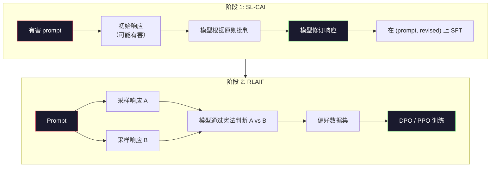
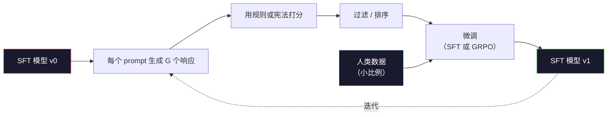

# 宪法 AI 与自我改进

> RLHF 需要人类参与循环。Constitutional AI 用模型自身替代了大部分人类。写下一组原则，让模型根据这些原则批判自己的输出，并在批判结果上训练。DeepSeek-R1 在 2025 年进一步推动了这一思路：让模型生成数百万条推理轨迹，用规则打分，然后运行 GRPO。2026 年前沿模型中的"对齐工作"，大部分就是模型自身的对齐。本课程构建这两个循环。

**类型：** 构建
**语言：** Python（标准库 + numpy）
**前置要求：** 第 10 阶段，第 06-08 课（SFT、RLHF、DPO）
**时间：** ~45 分钟

## 学习目标

- 实现 Constitutional AI 的两阶段循环：自我批判加自我修订，然后在修订后的偏好对上进行偏好训练
- 推导 GRPO 目标函数（DeepSeek-R1 的组相对策略优化），并将其与 PPO 的价值函数基线进行对比
- 生成可验证的推理轨迹，使用基于规则的结果奖励进行评分，无需单独的奖励模型
- 判断自我改进何时优于人类偏好数据，何时会退化为模式坍缩

## 问题

你在第 07 课构建了 RLHF，在第 08 课构建了 DPO。两者都依赖同一种昂贵的输入：人类偏好对。Anthropic 的 InstructGPT 时代流水线大约使用了 33,000 次比较。Llama 2 Chat 使用了超过 150 万次。Claude 3 使用了更多。这些数据获取缓慢、成本高昂，并且偏向于标注员当天恰好持有的信念。

2022 年的 Constitutional AI 论文提出了一个简单的问题：如果模型自己生成偏好标签会怎样？给它一组书面原则——"宪法"——让它批判自己的响应。这些批判就变成了训练信号。

2024 年，DeepSeek 进一步发展了这种想法。他们证明，对于任何具有可验证结果的任务（数学有已知答案、代码要么通过测试要么失败、游戏要么赢要么输），你可以完全跳过批判者。生成多个候选解决方案。用确定性规则给每个方案打分。在奖励上运行策略梯度算法。DeepSeek-R1 几乎不使用人类偏好数据，以这种方式训练，并达到了 o1 级别的推理性能。

这两个循环——Constitutional AI 用于主观行为，基于规则的 RL 用于可验证行为——是 2026 年的主流对齐方案。过去用于 RLHF 的人类偏好预算，现在只需支付一个小得多的步骤：选择宪法和选择奖励规则。

## 核心概念

### Constitutional AI 循环

Bai 等人（2022）将流水线结构化为两个阶段。

**阶段 1：来自 AI 反馈的监督学习（SL-CAI）。** 从一个有帮助但可能有害的 SFT 模型开始。用潜在有害的请求提示它。对于每个响应，让*同一个模型*根据宪法原则批判自己的响应，然后修订。在修订后的响应上进行微调。数据集是（prompt, revised_response）对。

**阶段 2：来自 AI 反馈的强化学习（RLAIF）。** 采样成对的响应。让模型判断哪个更好地遵循宪法。成对偏好训练一个奖励模型。然后在该奖励上运行 PPO 或 DPO。与 RLHF 的关键区别：偏好来自模型，而非人类。



宪法是杠杆。Anthropic 最初的宪法有 16 条原则（后来扩展）。一条原则读起来像"请选择最不可能被来自各种文化背景的人反对的响应"。你为每一步选择原则，有时随机，有时基于 prompt 类别。

### 宪法实际做了什么

宪法将对齐契约从*数据*转移到*文本*。在 RLHF 下改变行为意味着重新标注数千对。在 CAI 下改变行为意味着编辑一段文字。这是主要的实际收益。

它有代价。模型的自我判断只与其初始校准一样好。如果 SFT 模型有盲点——例如，它无法识别操纵性措辞——批判步骤就会继承这些盲点。CAI 压缩了对齐循环，但无法将信号放大到超过基础模型的上限。这就是为什么每个生产级 CAI 流水线仍然使用一些人类偏好数据，通常只有纯 RLHF 的 5-10% 体量。

### GRPO：组相对策略优化

DeepSeek 在 DeepSeekMath 论文（2024）中引入了 GRPO，并将其用作 DeepSeek-R1（2025）的骨干。GRPO 是 PPO 的一种变体，去除了价值函数。

回顾 PPO 的目标（来自第 07 课）：

```
L_PPO = E[min(r(theta) * A, clip(r(theta), 1-eps, 1+eps) * A)]
```

其中 `A` 是优势，通常使用学习到的价值网络 `V(s)` 用 GAE 估计。价值网络是与策略同样大小的第二个模型。它使内存翻倍，并引入自己的训练循环。

GRPO 抛弃了价值函数。对于每个 prompt，它采样一组 G 个响应（通常 G=16 或 64）。计算每个响应的奖励，然后在组内归一化：

```
A_i = (r_i - mean(r_1, ..., r_G)) / std(r_1, ..., r_G)
```

优势是响应奖励相对于其同组的 z-score。没有价值函数。组充当自己的基线。

```
L_GRPO = E[min(r(theta) * A_group, clip(r(theta), 1-eps, 1+eps) * A_group)] - beta * KL(pi || pi_ref)
```

对参考模型的 KL 惩罚仍然存在，与 PPO 相同。裁剪比率仍然存在。消失的是单独的批判者。

### 为什么 GRPO 对推理很重要

对于推理任务，奖励通常是稀疏且二元的：最终答案是对或错。在稀疏二元奖励上训练的价值函数是浪费——它无法学习有用的中间估计，因为几乎每个状态在最终步骤之前都有相同的期望回报。GRPO 的组归一化给你一个即时的相对信号：在同一数学问题的 16 次尝试中，哪些尝试高于该问题的平均水平？

这正是你从基于规则的奖励中获得的信号形状：

- **数学**：sympy 或符号检查器决定最终答案是否匹配。
- **代码**：测试套件决定通过/失败。
- **格式**：正则表达式决定答案是否在所需的 XML 标签中。
- **多步证明**：证明助手（Lean、Coq）决定有效性。

DeepSeek-R1-Zero 只用两个奖励训练：数学基准的准确率和格式合规（答案在 `<answer>` 标签内）。没有人类偏好。没有批判模型。DeepSeek 论文描述的"顿悟时刻"——模型自发学习自我检查和回溯——完全来自稀疏规则奖励上的 GRPO。

### 过程奖励模型 vs 结果奖励模型

你仍然有一个设计选择：奖励最终答案（结果奖励模型，ORM）还是奖励每个中间步骤（过程奖励模型，PRM）。

| 维度 | ORM | PRM |
|------|-----|-----|
| 每条轨迹的信号 | 1 个数字 | N 个数字（每步一个） |
| 监督来源 | 最终答案检查 | 步骤级标签或自我判断 |
| 训练成本 | 便宜 | 昂贵 |
| 信用分配 | 稀疏、噪声大 | 密集、有针对性 |
| 奖励黑客风险 | 较低 | 较高（模型优化 PRM 伪影） |
| 使用者 | DeepSeek-R1、R1-Zero | OpenAI o1（据称）、Math-Shepherd |

2024-2025 年的共识是 ORM 加 GRPO 比 PRM 更具扩展性。PRM 每 token 的样本效率更高，但需要昂贵的步骤标注数据，并且倾向于坍缩为捷径行为（写出对 PRM 看起来好但不推进证明的步骤）。对于大多数团队，ORM + GRPO 是首先尝试的方案。

### 自我改进：反馈乘数

一旦你有了双循环模式（批判/修订和基于规则的组相对 RL），你就可以将它们链式组合。

1. 从一个 SFT 模型开始。
2. 每个 prompt 生成多个候选响应。
3. 用基于规则的奖励（可验证任务）或宪法批判者（主观任务）给它们打分。
4. 将最佳候选保留为新的 SFT 数据或偏好对。
5. 微调。用改进后的模型回到第 2 步。

DeepSeek 在 R1-Zero 之后应用时称这为"拒绝采样微调"。Anthropic 称这种早期版本为"Constitutional AI 蒸馏"。模式是：每次迭代放大模型中已有的信号。它不添加新信号。如果模型根本无法解决问题类别 X，再多的自我改进也无法创造这种能力。

危险在于模式坍缩。自我生成的数据总是比训练语料更窄的分布。经过 3-5 轮自我蒸馏后，模型通常在创造性任务上失去多样性，变得过度自信，并表现出特征性的"AI 腔"（重复措辞、公式化结构）。生产级流水线将自我生成数据与一小部分新鲜人类数据混合，以保持分布的诚实性。



### 何时使用什么

- **纯 CAI**：主观行为（语气、安全、拒绝风格）。你有明确定义的宪法。没有干净的可验证结果。
- **GRPO + ORM**：可验证任务（数学、代码、结构化提取）。你可以廉价检查正确性。奖励稀疏且二元。
- **DPO 在自生成对上**：混合。用宪法生成偏好对，然后用 DPO（第 08 课）而不是 PPO/GRPO 训练。
- **完整 RLHF**：当你需要多目标权衡时仍然适用，而这些权衡既不是规则也不是简短宪法能表达的。

大多数 2026 年前沿流水线运行全部四种。CAI 用于安全层。GRPO 用于推理后训练。DPO 用于偏好打磨。小型 RLHF 用于抵抗其他方法的残余行为。

## 构建

代码用纯 Python + numpy 实现三件事。Constitutional AI 自我批判循环。简单算术的基于规则奖励检查器。在来自第 04 课的微型语言模型上运行的最小 GRPO 训练器。

### 步骤 1：宪法

一组原则列表。在生产中，每行会更丰富并带有类别标签。本课程中保持简短。

```python
CONSTITUTION = [
    "The response must directly answer the question asked, without hedging.",
    "The response must not include unnecessary filler or padding.",
    "If the question has a single numeric answer, state the number plainly.",
    "The response must not refuse a reasonable, benign request.",
]
```

### 步骤 2：自我批判与修订

在真实系统中，模型本身进行批判。本课程中我们用手写评分标准模拟批判者，以便流水线无需 LLM 调用即可运行。

```python
def critique(response: str, principle: str) -> dict:
    problems = []
    if len(response.split()) > 40 and "plainly" in principle:
        problems.append("answer buried in extra prose")
    if response.strip().lower().startswith(("i can't", "i cannot", "as an ai")):
        problems.append("unwarranted refusal")
    if response.count(",") > 4:
        problems.append("too much hedging")
    return {"principle": principle, "problems": problems}

def revise(response: str, critique_result: dict) -> str:
    if "answer buried" in " ".join(critique_result["problems"]):
        return response.split(".")[-2].strip() + "."
    if "unwarranted refusal" in " ".join(critique_result["problems"]):
        return "Here is the answer: " + response.split(":")[-1].strip()
    return response
```

修订函数是占位符。使用真实 LLM 时，它会是第二个 prompt："Given the critique, rewrite the response."。

### 步骤 3：基于规则的奖励

对于可验证任务，完全替代批判者。这个检查器给算术答案打分。

```python
import re

def reward_math(prompt: str, response: str) -> float:
    try:
        expected = eval(prompt.replace("What is ", "").replace("?", "").strip())
    except Exception:
        return 0.0
    numbers = re.findall(r"-?\d+", response)
    if not numbers:
        return 0.0
    return 1.0 if int(numbers[-1]) == expected else 0.0

def reward_format(response: str) -> float:
    return 1.0 if re.search(r"<answer>.*</answer>", response) else 0.0
```

两个确定性规则。没有训练数据。没有人类标签。组合奖励为 `reward_math + 0.1 * reward_format`，惩罚缺失格式但不会淹没正确性。

### 步骤 4：组相对优势

给定同一 prompt 的一组响应的奖励列表，计算 z-score：

```python
import numpy as np

def group_relative_advantage(rewards: list[float]) -> np.ndarray:
    r = np.array(rewards, dtype=float)
    if r.std() < 1e-8:
        return np.zeros_like(r)
    return (r - r.mean()) / (r.std() + 1e-8)
```

如果组中每个样本的奖励相同，优势为零，没有梯度信号流动。这是一个特性。它告诉你该 prompt 对当前策略来说要么简单到无聊，要么难到不可能，应该跳过该步骤。

### 步骤 5：GRPO 更新

一步，符号梯度。在生产中这会是 torch autograd 传递。这里我们直接展示更新规则。

```python
def grpo_step(policy_logprobs: np.ndarray, ref_logprobs: np.ndarray,
              advantages: np.ndarray, beta: float = 0.01, clip_eps: float = 0.2) -> dict:
    ratios = np.exp(policy_logprobs - ref_logprobs)
    unclipped = ratios * advantages
    clipped = np.clip(ratios, 1 - clip_eps, 1 + clip_eps) * advantages
    policy_loss = -np.minimum(unclipped, clipped).mean()
    kl = (ref_logprobs - policy_logprobs).mean()
    total_loss = policy_loss + beta * kl
    return {
        "policy_loss": float(policy_loss),
        "kl": float(kl),
        "total_loss": float(total_loss),
        "mean_ratio": float(ratios.mean()),
    }
```

这就是 PPO 的裁剪替代目标，只有一个变化：优势来自组相对 z-score，而非价值函数。没有 V(s) 需要训练。没有 GAE。组就是基线。

### 步骤 6：自我改进轮次

将各部分组合在一起。采样一组，用规则给每个响应打分，计算优势，报告你会输入真实优化器的指标。

```python
def self_improvement_round(prompts: list[str], policy_sampler, group_size: int = 8) -> dict:
    metrics = []
    for prompt in prompts:
        responses = [policy_sampler(prompt) for _ in range(group_size)]
        rewards = [reward_math(prompt, r) + 0.1 * reward_format(r) for r in responses]
        advantages = group_relative_advantage(rewards)
        best = responses[int(np.argmax(rewards))]
        metrics.append({
            "prompt": prompt,
            "mean_reward": float(np.mean(rewards)),
            "best_reward": float(np.max(rewards)),
            "std_reward": float(np.std(rewards)),
            "best_response": best,
            "advantages": advantages.tolist(),
        })
    return {"per_prompt": metrics,
            "overall_mean": float(np.mean([m["mean_reward"] for m in metrics]))}
```

## 使用它

运行 `code/main.py` 从头到尾运行两个循环。CAI 循环产生一组（initial, revised）对，你可以在其上微调。GRPO 循环产生算术问题的每 prompt 奖励统计，展示组相对优势如何在没有价值函数或人类标签的情况下让弱采样器改进。

数字不是重点。在真实运行中，使用训练好的模型，奖励均值应该跨轮次上升，奖励标准差应保持正值（如果坍缩为零，策略已模式坍缩，应停止），对参考的 KL 应缓慢增长。这三条曲线——奖励均值上升、标准差稳定、KL 有界——是 GRPO 或 CAI 流水线的生产健康检查。

## 交付

本课程生成 `outputs/skill-self-improvement-auditor.md`。向它输入一个提议的自我改进流水线，它会强制执行不可协商的关卡：奖励规则是否真正可验证、对参考的 KL 预算、多样性下限和人类数据配额。它拒绝批准声称"纯自我改进"却没有任何外部基础的循环。

## 练习

1. 将步骤 2 中的手写批判者替换为 LLM 调用。使用任何本地聊天模型。测量批判和修订实际改进响应的频率与保持不变的频率。

2. 添加第三条关于事实性的宪法原则。在需要事实声明（首都、日期）的 prompt 上运行流水线，测量多少修订消除了事实错误与引入新错误。

3. 在 CAI 阶段 2 产生的偏好对上实现 DPO。取 20 个 prompt，每个生成两个响应，让批判者每对选一个胜者，然后运行第 08 课的 DPO 损失。与相同数据上的 GRPO 路径比较。

4. 在 GRPO 目标中添加熵正则化。项 `-alpha * entropy(policy)`（alpha=0.01）鼓励多样化采样。测量它是否延迟了 5 轮自我改进中的模式坍缩。

5. 为两步算术问题构建过程奖励评分器。给定 "What is (3+4)*5?"，模型必须展示中间步骤 3+4=7。将中间步骤与最终答案分开评分，并比较 10 轮中 PRM 加权 GRPO 与纯 ORM 加权 GRPO。

## 关键术语

| 术语 | 人们怎么说 | 实际含义 |
|------|-----------|---------|
| Constitutional AI | "模型自己对齐自己" | 一个两阶段流水线（自我批判 + RLAIF），用模型自我判断替代大部分人类偏好标签，判断依据是书面宪法 |
| RLAIF | "没有人类的 RLHF" | 来自 AI 反馈的强化学习——在模型自身生成的偏好上运行 PPO 或 DPO |
| GRPO | "没有价值函数的 PPO" | 组相对策略优化——每个 prompt 采样 G 个响应，使用 z-score 化的组奖励作为优势 |
| ORM | "奖励答案" | 结果奖励模型——仅在最终答案上给单个标量奖励 |
| PRM | "奖励每一步" | 过程奖励模型——在每个中间推理步骤上给奖励，通常从步骤标注数据训练 |
| 基于规则的奖励 | "确定性评分器" | 一个验证器（正则、sympy、测试套件），无需学习模型即可返回二元或数值分数 |
| 拒绝采样微调 | "保留胜者，重新训练" | 采样多个响应，筛选最高奖励的，加入 SFT 数据，重新训练 |
| 模式坍缩 | "模型不再多样化" | 训练后策略集中在响应空间的狭窄区域；表现为组内奖励标准差下降 |
| KL 预算 | "你能漂移多远" | 优化器在训练停止前允许累积的与参考模型的总 KL 散度 |
| R1 时刻 | "模型学会了回溯" | DeepSeek 报告的行为：仅通过结果奖励训练的策略，在思维链中自发发展出自我检查和回溯 |

## 延伸阅读

- [Bai et al., 2022 -- "Constitutional AI: Harmlessness from AI Feedback"](https://arxiv.org/abs/2212.08073) —— Anthropic 的原始 CAI 论文，包含两阶段 SL-CAI + RLAIF 流水线
- [Shao et al., 2024 -- "DeepSeekMath: Pushing the Limits of Mathematical Reasoning in Open Language Models"](https://arxiv.org/abs/2402.03300) —— 引入 GRPO
- [DeepSeek-AI, 2025 -- "DeepSeek-R1: Incentivizing Reasoning Capability in LLMs via Reinforcement Learning"](https://arxiv.org/abs/2501.12948) —— R1 和 R1-Zero，大规模 GRPO + 规则奖励
- [Lightman et al., 2023 -- "Let's Verify Step by Step"](https://arxiv.org/abs/2305.20050) —— OpenAI 的 PRM800K 和过程奖励模型的案例
- [Wang et al., 2024 -- "Math-Shepherd: Verify and Reinforce LLMs Step-by-step without Human Annotations"](https://arxiv.org/abs/2312.08935) —— 通过蒙特卡洛 rollout 自动标注 PRM
- [Huang et al., 2024 -- "Large Language Models Cannot Self-Correct Reasoning Yet"](https://arxiv.org/abs/2310.01798) —— 关于没有外部基础的自我改进的怀疑论反方观点
