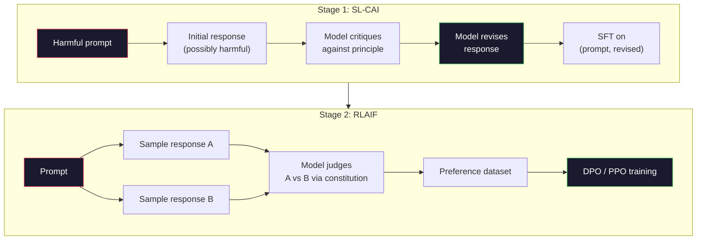
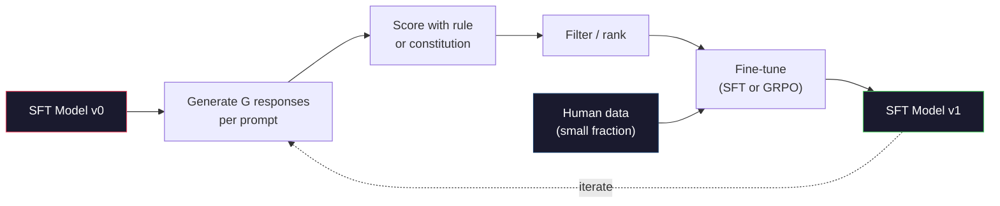

# 宪法 AI 与自我改进

> RLHF 需要人类参与循环。宪法 AI 用模型本身取代了大部分人类。编写一份原则清单，让模型根据这些原则评判自己的输出，并在评判结果上训练。DeepSeek-R1 在 2025 年将这一点推得更远：让模型生成数百万条推理轨迹，用规则评分，然后对结果运行 GRPO。2026 年前沿模型的大部分"对齐工作"是模型自身的对齐。本课程构建这两种循环。

**类型：** 构建
**语言：** Python（标准库 + numpy）
**前置条件：** 阶段 10，第 06-08 课（SFT、RLHF、DPO）
**时长：** ~45 分钟

## 学习目标

- 实现宪法 AI 两阶段循环：自我评判加自我修订，然后在修订后的对上做偏好训练
- 推导 GRPO 目标（DeepSeek-R1 的组相对策略优化），并与 PPO 的值函数基线进行对比
- 生成可验证的推理轨迹，使用基于规则的输出奖励进行评分，无需单独的奖励模型
- 决定何时自我改进胜过人类偏好数据，以及何时会坍缩到模式寻求

## 问题

你在第 07 课构建了 RLHF，在第 08 课构建了 DPO。两者都依赖于同一个昂贵的输入：人类偏好对。Anthropic 的 InstructGPT 时代管线使用了大约 33,000 个比较。Llama 2 Chat 使用了超过 150 万个。Claude 3 使用了更多。这些数据缓慢、昂贵，并且偏向标注员在评分那天碰巧持有的观点。

2022 年的宪法 AI 论文提出了一个简单的问题。如果让模型自己生成偏好标签会怎样？给它一份书面的原则清单——"宪法"——让它评判自己的响应。评判结果就成了训练信号。

2024 年，DeepSeek 将这个想法推得更远。他们表明，对于任何结果可验证的任务（答案已知的数学题、要么通过要么失败的代码、要么赢要么输的游戏），你可以完全跳过评判者。生成多个候选解决方案。用确定性规则对每个评分。在奖励上运行策略梯度算法。DeepSeek-R1 几乎没有任何人类偏好数据就通过这种方式训练，并达到了 o1 级别的推理性能。

这两种循环——用于主观行为的宪法 AI 和用于可验证行为的基于规则的 RL——是 2026 年占主导地位的对齐方案。以前用于 RLHF 的人类偏好预算现在只用于一个更小的步骤：选择宪法和选择奖励规则。

## 概念

### 宪法 AI 循环

Bai 等人（2022）将管线分为两个阶段。

**阶段 1：来自 AI 反馈的监督学习（SL-CAI）。** 从一个有用但可能有害的 SFT 模型开始。用潜在有害的请求提示它。对于每个响应，让*同一个模型*根据宪法原则评判其响应，然后修订。在修订后的响应上进行微调。数据集是（提示、修订后的响应）对。

**阶段 2：来自 AI 反馈的强化学习（RLAIF）。** 采样响应对。让模型判断哪个更符合宪法。成对偏好训练一个奖励模型。然后使用该奖励对模型运行 PPO 或 DPO。与 RLHF 的关键区别：偏好来自模型，而非人类。


```mermaid
graph TD
    subgraph SL["Stage 1: SL-CAI"]
        P1["Harmful prompt"] --> R1["Initial response\n(possibly harmful)"]
        R1 --> C1["Model critiques\nagainst principle"]
        C1 --> REV["Model revises\nresponse"]
        REV --> SFT["SFT on\n(prompt, revised)"]
    end

    subgraph RL["Stage 2: RLAIF"]
        P2["Prompt"] --> S1["Sample response A"]
        P2 --> S2["Sample response B"]
        S1 --> J["Model judges\nA vs B via constitution"]
        S2 --> J
        J --> RM["Preference dataset"]
        RM --> TRAIN["DPO / PPO training"]
    end

    SL --> RL

    style P1 fill:#1a1a2e,stroke:#e94560,color:#fff
    style REV fill:#1a1a2e,stroke:#51cf66,color:#fff
    style P2 fill:#1a1a2e,stroke:#e94560,color:#fff
    style TRAIN fill:#1a1a2e,stroke:#51cf66,color:#fff
```

宪法是杠杆。Anthropic 的原始版本有 16 条原则（后来扩展了）。一条原则读起来像"请选择最不可能引起来自各种文化背景的人中任何人反感的响应"。你为每一步选择原则，有时随机，有时基于提示类别。

### 宪法实际做了什么

宪法将对齐契约从*数据*转移到了*文本*。在 RLHF 下改变行为意味着重新标注数千个对。在 CAI 下改变行为意味着编辑一段文字。这是主要的实际优势。

它是有代价的。模型的自我判断只能达到其初始校准的水平。如果 SFT 模型有盲点——例如，它无法识别操纵性措辞——评判步骤会继承这些盲点。CAI 压缩了对齐循环，但无法将信号放大超过基础模型的天花板。这就是为什么每个生产级 CAI 管线仍然使用一些人类偏好数据，通常是纯 RLHF 数据量的 5-10%。

### GRPO：组相对策略优化

DeepSeek 在 DeepSeekMath 论文（2024）中引入了 GRPO，并在 DeepSeek-R1（2025）中将其作为骨干。GRPO 是 PPO 的一个变体，移除了值函数。

回顾 PPO 的目标（来自第 07 课）：

```
L_PPO = E[min(r(theta) * A, clip(r(theta), 1-eps, 1+eps) * A)]
```

其中 `A` 是优势，通常使用学习到的值网络 `V(s)` 通过 GAE 估计。值网络是与策略相同大小的第二个模型。它使内存翻倍，并引入了自己的训练循环。

GRPO 抛弃了值函数。对于每个提示，它采样一个包含 G 个响应的组（通常 G=16 或 64）。计算每个响应的奖励，然后在组内进行归一化：

```
A_i = (r_i - mean(r_1, ..., r_G)) / std(r_1, ..., r_G)
```

优势是响应奖励相对于其同组的 z 分数。没有值函数。组自身充当基线。

```
L_GRPO = E[min(r(theta) * A_group, clip(r(theta), 1-eps, 1+eps) * A_group)] - beta * KL(pi || pi_ref)
```

针对参考模型的 KL 惩罚仍然存在，与 PPO 相同。裁剪比仍然存在。消失的是单独的评判器。

### 为什么 GRPO 对推理很重要

对于推理任务，奖励通常是稀疏和二元的：最终答案正确或错误。一个在稀疏二元奖励上训练的值函数是浪费——它无法学到有用的中间估计，因为几乎每个状态在最后一步之前都有相同的期望回报。GRPO 的组归一化给你一个直接的相对信号：在同一个数学问题的 16 次尝试中，哪些尝试对这个问题是高于平均的？

这正是从基于规则的奖励中得到的信号形状：

- **数学**：sympy 或符号检查器决定最终答案是否匹配。
- **代码**：测试套件决定通过/失败。
- **格式**：正则表达式决定答案是否在所需的 XML 标签内。
- **多步证明**：证明助手（Lean、Coq）决定有效性。

DeepSeek-R1-Zero 仅使用两种奖励进行训练：数学基准上的准确性和格式合规性（答案在 `<answer>` 标签内）。没有人类偏好。没有评判者模型。DeepSeek 论文描述的"顿悟时刻"——模型自发学会自我检查和回溯——仅从稀疏规则奖励上的 GRPO 中涌现出来。

### 过程奖励模型 vs 输出奖励模型

你仍然有一个设计选择：奖励最终答案（ORM）或奖励每个中间步骤（PRM）。

| 维度 | ORM | PRM |
|------|-----|-----|
| 每条轨迹的信号 | 1 个数字 | N 个数字（每步一个） |
| 监督来源 | 最终答案检查 | 步级标签或自我评判 |
| 训练成本 | 便宜 | 昂贵 |
| 信用分配 | 稀疏、有噪声 | 密集、有针对性 |
| 奖励欺骗风险 | 较低 | 较高（模型优化 PRM 伪影） |
| 使用方 | DeepSeek-R1、R1-Zero | OpenAI o1（据说）、Math-Shepherd |

2024-2025 年的共识是 ORM 加 GRPO 的扩展性比 PRM 更好。PRM 每个 token 的样本效率更高，但需要昂贵的步级标注数据，并且倾向于坍缩为捷径行为（编写看起来对 PRM 很好但并未推进证明的步骤）。对于大多数团队，ORM + GRPO 是首选尝试。

### 自我改进：反馈放大器

一旦你有了双循环模式（评判/修订和带规则奖励的组相对 RL），你可以将它们链接起来。

1. 从一个 SFT 模型开始。
2. 为每个提示生成多个候选响应。
3. 用基于规则的奖励（对于可验证任务）或宪法评判者（对于主观任务）评分。
4. 保留顶级候选作为新的 SFT 数据或偏好对。
5. 微调。用改进后的模型转到步骤 2。

DeepSeek 在 R1-Zero 之后应用时称之为"拒绝采样微调"。Anthropic 将早期版本称为"宪法 AI 蒸馏"。模式是：每次迭代放大模型中已有的信号。它不会添加新信号。如果模型完全无法解决 X 类问题，再多的自我改进也无法创造这种能力。

危险是模式坍缩。自生成数据始终比训练语料库分布更窄。经过 3-5 轮自我蒸馏后，模型在创造性任务上通常会失去多样性，变得过度自信，并表现出特征性的"AI 腔"（重复的措辞、公式化的结构）。生产管线会将自生成数据与少量新鲜人类数据混合，以保持分布真实。


```mermaid
graph LR
    M0["SFT Model v0"] --> G["Generate G responses\nper prompt"]
    G --> S["Score with rule\nor constitution"]
    S --> F["Filter / rank"]
    F --> T["Fine-tune\n(SFT or GRPO)"]
    T --> M1["SFT Model v1"]
    M1 -.->|iterate| G

    H["Human data\n(small fraction)"] --> T

    style M0 fill:#1a1a2e,stroke:#e94560,color:#fff
    style M1 fill:#1a1a2e,stroke:#51cf66,color:#fff
    style H fill:#1a1a2e,stroke:#0f3460,color:#fff
```

### 何时使用什么

- **纯 CAI**：主观行为（语气、安全性、拒绝风格）。你有一个定义良好的宪法。你没有清晰的可验证结果。
- **GRPO + ORM**：可验证任务（数学、代码、结构化提取）。你可以廉价地检查正确性。奖励是稀疏和二元。
- **自生成对上的 DPO**：混合方法。使用宪法生成偏好对，然后用 DPO（第 08 课）而不是 PPO/GRPO 进行训练。
- **完整 RLHF**：当需要既不通过规则也不通过简短宪法表达的多目标权衡时，仍然适用。

2026 年的大多数前沿管线同时运行全部四种方法。CAI 用于安全层。GRPO 用于推理后训练阶段。DPO 用于偏好打磨。小规模 RLHF 用于处理其他方法无法解决的残余行为。

## 动手构建

代码用纯 Python + numpy 实现了三件事。一个宪法 AI 自我评判循环。一个用于简单算术的基于规则的奖励检查器。一个在第 04 课的小型语言模型上运行的最小 GRPO 训练器。

### 步骤 1：宪法

一份原则清单。在生产中，每行会更丰富并按类别标记。对于本课，保持简短。

```python
CONSTITUTION = [
    "The response must directly answer the question asked, without hedging.",
    "The response must not include unnecessary filler or padding.",
    "If the question has a single numeric answer, state the number plainly.",
    "The response must not refuse a reasonable, benign request.",
]
```

### 步骤 2：自我评判与修订

在真实系统中，模型自身进行评判。在本课中，我们用一个人工编写的评分规则模拟评判者，以便管线无需 LLM 调用即可运行。

```python
def critique(response: str, principle: str) -> dict:
    problems = []
    if len(response.split()) > 40 and "plainly" in principle:
        problems.append("answer buried in extra prose")
    if response.strip().lower().startswith(("i can't", "i cannot", "as an ai")):
        problems.append("unwarranted refusal")
    if response.count(",") > 4:
        problems.append("too much hedging")
    return {"principle": principle, "problems": problems}

def revise(response: str, critique_result: dict) -> str:
    if "answer buried" in " ".join(critique_result["problems"]):
        return response.split(".")[-2].strip() + "."
    if "unwarranted refusal" in " ".join(critique_result["problems"]):
        return "Here is the answer: " + response.split(":")[-1].strip()
    return response
```

修订函数是一个占位符。使用真实 LLM 时，它将是一个第二个提示："根据评判结果，重写响应。"

### 步骤 3：基于规则的奖励

对于可验证任务，完全替换评判者。这个检查器对算术答案进行评分。

```python
import re

def reward_math(prompt: str, response: str) -> float:
    try:
        expected = eval(prompt.replace("What is ", "").replace("?", "").strip())
    except Exception:
        return 0.0
    numbers = re.findall(r"-?\d+", response)
    if not numbers:
        return 0.0
    return 1.0 if int(numbers[-1]) == expected else 0.0

def reward_format(response: str) -> float:
    return 1.0 if re.search(r"<answer>.*</answer>", response) else 0.0
```

两个确定性规则。没有训练数据。没有人类标签。组合奖励是 `reward_math + 0.1 * reward_format`，在惩罚缺少格式的同时不淹没正确性。

### 步骤 4：组相对优势

给定同一提示的一组响应的奖励列表，计算 z 分数：

```python
import numpy as np

def group_relative_advantage(rewards: list[float]) -> np.ndarray:
    r = np.array(rewards, dtype=float)
    if r.std() < 1e-8:
        return np.zeros_like(r)
    return (r - r.mean()) / (r.std() + 1e-8)
```

如果组中每个样本的奖励相同，优势为零，没有梯度信号流动。这是一个特性。它告诉你该提示对于当前策略要么太简单要么太难，该步骤应跳过它。

### 步骤 5：GRPO 更新

一步，符号梯度。在生产中这将是一个 torch autograd 传播。这里我们直接展示更新规则。

```python
def grpo_step(policy_logprobs: np.ndarray, ref_logprobs: np.ndarray,
              advantages: np.ndarray, beta: float = 0.01, clip_eps: float = 0.2) -> dict:
    ratios = np.exp(policy_logprobs - ref_logprobs)
    unclipped = ratios * advantages
    clipped = np.clip(ratios, 1 - clip_eps, 1 + clip_eps) * advantages
    policy_loss = -np.minimum(unclipped, clipped).mean()
    kl = (ref_logprobs - policy_logprobs).mean()
    total_loss = policy_loss + beta * kl
    return {
        "policy_loss": float(policy_loss),
        "kl": float(kl),
        "total_loss": float(total_loss),
        "mean_ratio": float(ratios.mean()),
    }
```

这是 PPO 的裁剪替代目标，只有一处改动：优势来自组相对 z 分数，而非值函数。没有需要训练的 V(s)。没有 GAE。组就是基线。

### 步骤 6：自我改进轮次

将所有部分组合在一起。采样一个组、用规则对每个响应评分、计算优势、报告你将输入真实优化器的指标。

```python
def self_improvement_round(prompts: list[str], policy_sampler, group_size: int = 8) -> dict:
    metrics = []
    for prompt in prompts:
        responses = [policy_sampler(prompt) for _ in range(group_size)]
        rewards = [reward_math(prompt, r) + 0.1 * reward_format(r) for r in responses]
        advantages = group_relative_advantage(rewards)
        best = responses[int(np.argmax(rewards))]
        metrics.append({
            "prompt": prompt,
            "mean_reward": float(np.mean(rewards)),
            "best_reward": float(np.max(rewards)),
            "std_reward": float(np.std(rewards)),
            "best_response": best,
            "advantages": advantages.tolist(),
        })
    return {"per_prompt": metrics,
            "overall_mean": float(np.mean([m["mean_reward"] for m in metrics]))}
```

## 使用它

运行 `code/main.py` 将端到端运行两个循环。CAI 循环产生一小组你可以微调的（初始，修订）对。GRPO 循环产生算术问题每个提示的奖励统计，展示组相对优势如何让一个弱采样器在没有值函数或人类标签的情况下改进。

数字不是重点。在使用训练好的模型的真实运行中，奖励均值应在各轮次间上升，奖励标准差应保持正值（如果坍缩到零，说明策略发生了模式坍缩，你应该停止），与参考模型的 KL 应缓慢增长。这三条曲线——均值奖励上升、标准差稳定、KL 有界——是 GRPO 或 CAI 管线的生产健康检查。

## 交付

本课程产出 `outputs/skill-self-improvement-auditor.md`。输入一个提议的自我改进管线，它会强制执行不可协商的门控：一个实际可验证的奖励规则、一个针对参考模型的 KL 预算、一个多样性底线和一个人类数据配额。它拒绝批准声称是"纯自我改进"而没有任何外部基础的循环。

## 练习

1. 将步骤 2 中人工编写的评判者替换为 LLM 调用。使用任何本地聊天模型。测量评判和修订实际改善响应与保持不变的比例。

2. 添加第三条关于事实性的宪法原则。在需要事实声明（首都、日期）的提示上运行管线，测量有多少修订移除了事实错误与引入了新错误。

3. 在 CAI 阶段 2 产生的偏好对上实现 DPO。取 20 个提示，每个生成两个响应，让评判者每对选一个胜者，然后运行第 08 课的 DPO 损失。与相同数据上的 GRPO 路径进行比较。

4. 在 GRPO 目标中添加熵正则化。项 `-alpha * entropy(policy)` 且 alpha=0.01 鼓励多样化采样。测量它是否在 5 轮自我改进中延迟了模式坍缩。

5. 为一个两步算术问题构建过程奖励评分器。给定"What is (3+4)*5?"，模型必须展示中间步骤 3+4=7。分别对中间步骤和最终答案评分，并在 10 轮中比较 PRM 加权的 GRPO 与纯 ORM 加权的 GRPO。

## 关键术语

| 术语 | 人们怎么说 | 实际含义 |
|------|----------------|----------------------|
| 宪法 AI | "模型自我对齐" | 一个两阶段管线（自我评判 + RLAIF），用模型针对书面宪法的自我判断取代大多数人类偏好标签 |
| RLAIF | "没有人类的 RLHF" | 来自 AI 反馈的强化学习——在模型自身生成的偏好上运行 PPO 或 DPO |
| GRPO | "没有值函数的 PPO" | 组相对策略优化——每个提示采样 G 个响应，使用 z 分数的组奖励作为优势 |
| ORM | "奖励答案" | 输出奖励模型——仅对最终答案的单一标量奖励 |
| PRM | "奖励每一步" | 过程奖励模型——对每个中间推理步骤的奖励，通常从步级标注数据训练 |
| 基于规则的奖励 | "确定性评分器" | 一个验证器（正则表达式、sympy、测试套件），无需学习模型即可返回二元或数值分数 |
| 拒绝采样微调 | "保留胜者，重新训练" | 采样多个响应，过滤出最高奖励的响应，添加到 SFT 数据中，重新训练 |
| 模式坍缩 | "模型失去多样性" | 后训练策略集中在响应空间的狭窄区域；表现为组内奖励标准差下降 |
| KL 预算 | "你能漂移多远" | 优化器在训练停止前允许累积的与参考模型的 KL 散度总量 |
| R1 时刻 | "模型学会了回溯" | DeepSeek 报告的行为，其中仅在输出奖励上训练的策略在其思维链中自发发展了自我检查和回溯 |

## 延伸阅读

- [Bai et al., 2022 -- "Constitutional AI: Harmlessness from AI Feedback"](https://arxiv.org/abs/2212.08073) -- Anthropic 的原始 CAI 论文，包含两阶段 SL-CAI + RLAIF 管线
- [Shao et al., 2024 -- "DeepSeekMath: Pushing the Limits of Mathematical Reasoning in Open Language Models"](https://arxiv.org/abs/2402.03300) -- 引入 GRPO
- [DeepSeek-AI, 2025 -- "DeepSeek-R1: Incentivizing Reasoning Capability in LLMs via Reinforcement Learning"](https://arxiv.org/abs/2501.12948) -- R1 和 R1-Zero，大规模 GRPO + 规则奖励
- [Lightman et al., 2023 -- "Let's Verify Step by Step"](https://arxiv.org/abs/2305.20050) -- OpenAI 的 PRM800K 和过程奖励模型的支持理由
- [Wang et al., 2024 -- "Math-Shepherd: Verify and Reinforce LLMs Step-by-step without Human Annotations"](https://arxiv.org/abs/2312.08935) -- 通过蒙特卡洛展开自动标注 PRM
- [Huang et al., 2024 -- "Large Language Models Cannot Self-Correct Reasoning Yet"](https://arxiv.org/abs/2310.01798) -- 关于没有外部基础的自我改进的怀疑性反驳
