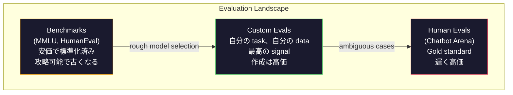
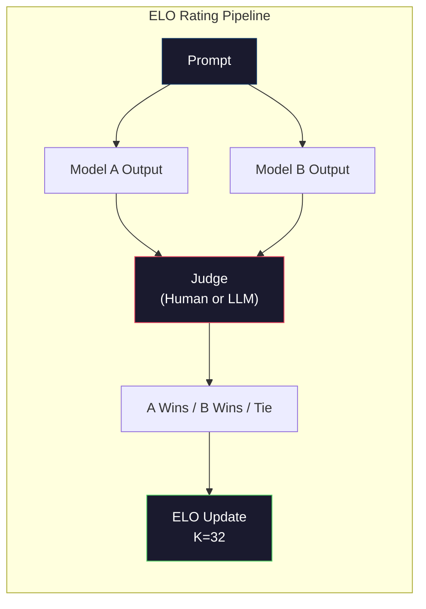

# Evaluation: Benchmarks、Evals、LM Harness

> Goodhart's Law: ある指標が目標になると、それはよい指標ではなくなる。すべての frontier lab は benchmarks を攻略する。MMLU scores は上がる一方で、モデルはいまだに "strawberry" に含まれる R の数を安定して数えられない。重要なのは YOUR eval だけだ。YOUR task、YOUR data に対する評価である。

**種類:** Build
**言語:** Python
**前提:** Phase 10, Lessons 01-05 (LLMs from Scratch)
**所要時間:** 約 90 分

## 学習目標

- multiple-choice benchmarks と open-ended benchmarks を language model に対して実行する custom evaluation harness を作る
- 標準 benchmarks (MMLU, HumanEval) が飽和し、frontier models の差別化に失敗する理由を説明する
- exact match、F1、BLEU、LLM-as-judge scoring など、適切な metrics を持つ task-specific evals を実装する
- public leaderboards だけに頼らず、自分の use case を対象にした custom evaluation suite を設計する

## 問題

MMLU は 2020 年に公開され、57 科目にわたる 15,908 問を含んでいた。3 年以内に frontier models はこれを飽和させた。GPT-4 は 86.4%。Claude 3 Opus は 86.8%。Llama 3 405B は 88.6%。leaderboard は 3 ポイント幅に圧縮され、その差は実際の capability gap ではなく statistical noise になった。

一方で、同じモデルは 10 歳児なら考えずにできるタスクに失敗する。MMLU で 88.7% を記録した Claude 3.5 Sonnet は、当初 "strawberry" の文字を数えられなかった。これは world knowledge も reasoning も不要で、character-level iteration だけが必要なタスクだ。HumanEval は 164 問で code generation をテストする。モデルは 90% 以上を取るが、junior developer なら見つける edge cases でクラッシュするコードを今でも生成する。

benchmark performance と real-world reliability のギャップが、LLM evaluation の中心問題である。benchmarks が教えてくれるのは、その benchmark 上でモデルがどう動くかだけだ。そのモデルがあなたの specific task、specific data、specific failure modes のもとでどう動くかは、ほとんど何も教えてくれない。customer support bot を作っているなら MMLU は無関係だ。code assistant を作っているなら HumanEval は function-level generation しか扱わない。debugging、refactoring、複数ファイルにまたがる code explanation については何も言わない。

custom evals が必要だ。benchmarks が無意味だからではない。rough model selection には有用だ。しかし最終評価は deployment conditions と正確に一致していなければならない。

## コンセプト

### Eval の地図

evaluation には 3 つのカテゴリがあり、それぞれ cost と signal quality が異なる。

**Benchmarks** は標準化された test suites である。MMLU、HumanEval、SWE-bench、MATH、ARC、HellaSwag。モデルを benchmark にかけて score を得る。利点は、全員が同じ test を使うのでモデルを比較できること。欠点は、models と training data がこれらの benchmarks をますます汚染していることだ。labs は benchmark questions を含む data で学習する。scores は上がる。capability は上がっていないかもしれない。

**Custom evals** は、あなたの specific use case のために作る test suites である。inputs、expected outputs、scoring function を定義する。legal document summarizer は legal documents で評価される。SQL generator はあなたの database schema で評価される。作成は高価だが、production performance を予測する唯一の評価である。

**Human evals** は、有料 annotators が model outputs を helpfulness、correctness、fluency、safety などの基準で判定する。automated scoring が失敗する open-ended tasks の gold standard である。Chatbot Arena は 100+ models に対して 200 万件以上の human preference votes を集めている。欠点は cost (judgment あたり $0.10-$2.00) と speed (数時間から数日) である。



### Benchmarks が壊れる理由

3 つの仕組みによって benchmark scores は real capability を反映しなくなる。

**Data contamination。** training corpora はインターネットを scrape する。benchmark questions はインターネットにある。モデルは training 中に答えを見る。これは伝統的な意味での不正ではない。labs が意図的に benchmark data を入れているわけではない。しかし web-scale scraping では、それを除外することがほぼ不可能になる。

**Teaching to the test。** labs は benchmark performance に合わせて training mixtures を最適化する。training mix の 5% が MMLU-style multiple choice なら、モデルは format と answer distribution を学ぶ。MMLU は 4 択である。モデルは答えの分布が A/B/C/D にほぼ均等であることを学び、答えを知らない場合でもそれが助けになる。

**Saturation。** すべての frontier model が benchmark で 85-90% を取るようになると、その benchmark は区別する力を失う。残り 10-15% の questions は曖昧、誤ラベル、または非常に obscure な domain knowledge を要求しているかもしれない。MMLU で 87% から 89% に改善したとしても、それはモデルが 2 問分だけ obscure な問題を記憶しただけで、賢くなったわけではないかもしれない。

### Perplexity: 簡単な Health Check

Perplexity は、token sequence に対してモデルがどれだけ驚くかを測る。形式的には、平均 negative log-likelihood の指数である。

```
PPL = exp(-1/N * sum(log P(token_i | context)))
```

perplexity が 10 なら、モデルは平均的に各 token position で 10 個の選択肢から一様に選ぶのと同じ程度に不確かである。低いほどよい。GPT-2 は WikiText-103 で perplexity 約 30。GPT-3 は約 20。Llama 3 8B は約 7 である。

Perplexity は同じ test set 上で models を比較するには有用だが、blind spots がある。common patterns の予測が得意なら低 perplexity を出せるが、rare だが重要な patterns ではひどいかもしれない。また instruction following、reasoning、factual accuracy については何も言わない。sanity check として使い、final verdict にはしない。

### LLM-as-Judge

強い model を使って弱い model の output を評価する。発想は単純だ。GPT-4o や Claude Sonnet に response を 1-5 scale で correctness、helpfulness、safety について評価させる。GPT-4o-mini なら judgment あたり約 $0.01 で、human judgments と驚くほどよく相関する。多くのタスクで agreement は約 80% である。

scoring prompt は model 以上に重要だ。曖昧な prompt ("Rate this response") は noisy scores を生む。rubric を持つ structured prompt ("Score 5 if the answer is factually correct and cites a source, 4 if correct but unsourced, 3 if partially correct...") は一貫性と再現性のある scores を生む。

failure modes: judge models には position bias (pairwise comparisons で最初の response を好む)、verbosity bias (長い responses を好む)、self-preference (GPT-4 が同等の Claude outputs より GPT-4 outputs を高く評価する) がある。mitigations: order を randomize する、length を normalize する、評価対象モデルとは別の judge を使う。

### Pairwise Comparisons からの ELO Ratings

Chatbot Arena の方式である。同じ prompt に対する 2 つの responses を、異なる models から表示する。human または LLM judge がよいほうを選ぶ。数千件の comparisons から各 model の ELO rating を計算する。チェスで使われるのと同じ system である。

ELO の利点: absolute scoring より relative ranking のほうが信頼できる。ties を自然に扱える。すべての output を独立に scoring するより少ない comparisons で収束する。2026 年初頭時点で、Chatbot Arena の ranks では GPT-4o、Claude 3.5 Sonnet、Gemini 1.5 Pro が top で 20 ELO points 以内に並んでいた。



### Eval Frameworks

**lm-evaluation-harness** (EleutherAI): 標準的な open-source eval framework。200+ benchmarks をサポートする。任意の Hugging Face model を MMLU、HellaSwag、ARC などに対して 1 コマンドで実行できる。Open LLM Leaderboard で使われている。

**RAGAS**: RAG pipelines 専用の evaluation framework。faithfulness (answer が retrieved context と一致しているか)、relevance (retrieved context が question に関連しているか)、answer correctness を測る。

**promptfoo**: prompt engineering のための config-driven eval。YAML で test cases を定義し、複数の models に対して実行し、pass/fail report を得る。prompt の regression testing に有用で、prompt change が既存 test cases を壊さないことを確認できる。

### Custom Evals を作る

production で本当に重要な唯一の eval。プロセスは次のとおり。

1. **Task を定義する。** モデルは正確に何をすべきか。具体的に書く。"Answer questions" は曖昧すぎる。"Given a customer complaint email, extract the product name, issue category, and sentiment" なら評価できる task である。

2. **Test cases を作る。** prototype eval なら最低 50 件、production なら 200+ 件。各 test case は (input, expected_output) pair である。empty inputs、adversarial inputs、ambiguous inputs、他言語 inputs など edge cases を含める。

3. **Scoring を定義する。** structured outputs には exact match。text similarity には BLEU/ROUGE。open-ended quality には LLM-as-judge。extraction tasks には F1。複数 metrics は重み付きで組み合わせる。

4. **Automate する。** すべての eval は 1 コマンドで実行する。manual steps はない。results は時系列で比較できる format に保存する。

5. **Track over time。** eval score は単独では意味がない。trendline が必要だ。最後の prompt change の後で score は改善したか。model を切り替えた後で regress したか。eval は prompts と一緒に version 管理する。

| Eval Type | Cost per judgment | Agreement with humans | Best for |
|-----------|------------------|----------------------|----------|
| Exact match | ~$0 | 100% (適用できる場合) | Structured output, classification |
| BLEU/ROUGE | ~$0 | ~60% | Translation, summarization |
| LLM-as-judge | ~$0.01 | ~80% | Open-ended generation |
| Human eval | $0.10-$2.00 | N/A (ground truth そのもの) | Ambiguous, high-stakes tasks |

## 作ってみる

### Step 1: 最小 Eval Framework

core abstractions を定義する。eval case は input、expected output、省略可能な metadata dict を持つ。scorer は prediction と reference を受け取り、0 から 1 の score を返す。

```python
import json
from collections import Counter

class EvalCase:
    def __init__(self, input_text, expected, metadata=None):
        self.input_text = input_text
        self.expected = expected
        self.metadata = metadata or {}

class EvalSuite:
    def __init__(self, name, cases, scorers):
        self.name = name
        self.cases = cases
        self.scorers = scorers

    def run(self, model_fn):
        results = []
        for case in self.cases:
            prediction = model_fn(case.input_text)
            scores = {}
            for scorer_name, scorer_fn in self.scorers.items():
                scores[scorer_name] = scorer_fn(prediction, case.expected)
            results.append({
                "input": case.input_text,
                "expected": case.expected,
                "prediction": prediction,
                "scores": scores,
            })
        return results
```

### Step 2: Scoring Functions

exact match、token F1、simulated LLM-as-judge scorer を作る。

```python
def exact_match(prediction, expected):
    return 1.0 if prediction.strip().lower() == expected.strip().lower() else 0.0

def token_f1(prediction, expected):
    pred_tokens = set(prediction.lower().split())
    exp_tokens = set(expected.lower().split())
    if not pred_tokens or not exp_tokens:
        return 0.0
    common = pred_tokens & exp_tokens
    precision = len(common) / len(pred_tokens)
    recall = len(common) / len(exp_tokens)
    if precision + recall == 0:
        return 0.0
    return 2 * (precision * recall) / (precision + recall)

def llm_judge_simulated(prediction, expected):
    pred_words = set(prediction.lower().split())
    exp_words = set(expected.lower().split())
    if not exp_words:
        return 0.0
    overlap = len(pred_words & exp_words) / len(exp_words)
    length_penalty = min(1.0, len(prediction) / max(len(expected), 1))
    return round(overlap * 0.7 + length_penalty * 0.3, 3)
```

### Step 3: ELO Rating System

ELO updates を使って pairwise comparisons を実装する。これは Chatbot Arena が models を rank するのに使う system そのものだ。

```python
class ELOTracker:
    def __init__(self, k=32, initial_rating=1500):
        self.ratings = {}
        self.k = k
        self.initial_rating = initial_rating
        self.history = []

    def _ensure_player(self, name):
        if name not in self.ratings:
            self.ratings[name] = self.initial_rating

    def expected_score(self, rating_a, rating_b):
        return 1 / (1 + 10 ** ((rating_b - rating_a) / 400))

    def record_match(self, player_a, player_b, outcome):
        self._ensure_player(player_a)
        self._ensure_player(player_b)

        ea = self.expected_score(self.ratings[player_a], self.ratings[player_b])
        eb = 1 - ea

        if outcome == "a":
            sa, sb = 1.0, 0.0
        elif outcome == "b":
            sa, sb = 0.0, 1.0
        else:
            sa, sb = 0.5, 0.5

        self.ratings[player_a] += self.k * (sa - ea)
        self.ratings[player_b] += self.k * (sb - eb)

        self.history.append({
            "a": player_a, "b": player_b,
            "outcome": outcome,
            "rating_a": round(self.ratings[player_a], 1),
            "rating_b": round(self.ratings[player_b], 1),
        })

    def leaderboard(self):
        return sorted(self.ratings.items(), key=lambda x: -x[1])
```

### Step 4: Perplexity Calculation

token probabilities を使って perplexity を計算する。実際には model の logits から取得する。ここでは probability distribution でシミュレートする。

```python
import numpy as np

def perplexity(log_probs):
    if not log_probs:
        return float("inf")
    avg_neg_log_prob = -np.mean(log_probs)
    return float(np.exp(avg_neg_log_prob))

def token_log_probs_simulated(text, model_quality=0.8):
    np.random.seed(hash(text) % 2**31)
    tokens = text.split()
    log_probs = []
    for i, token in enumerate(tokens):
        base_prob = model_quality
        if len(token) > 8:
            base_prob *= 0.6
        if i == 0:
            base_prob *= 0.7
        prob = np.clip(base_prob + np.random.normal(0, 0.1), 0.01, 0.99)
        log_probs.append(float(np.log(prob)))
    return log_probs
```

### Step 5: Aggregate Results

eval run 全体で summary statistics を計算する。mean、median、threshold に対する pass rate、metric ごとの breakdowns である。

```python
def summarize_results(results, threshold=0.8):
    all_scores = {}
    for r in results:
        for metric, score in r["scores"].items():
            all_scores.setdefault(metric, []).append(score)

    summary = {}
    for metric, scores in all_scores.items():
        arr = np.array(scores)
        summary[metric] = {
            "mean": round(float(np.mean(arr)), 3),
            "median": round(float(np.median(arr)), 3),
            "std": round(float(np.std(arr)), 3),
            "min": round(float(np.min(arr)), 3),
            "max": round(float(np.max(arr)), 3),
            "pass_rate": round(float(np.mean(arr >= threshold)), 3),
            "n": len(scores),
        }
    return summary

def print_summary(summary, suite_name="Eval"):
    print(f"\n{'=' * 60}")
    print(f"  {suite_name} Summary")
    print(f"{'=' * 60}")
    for metric, stats in summary.items():
        print(f"\n  {metric}:")
        print(f"    Mean:      {stats['mean']:.3f}")
        print(f"    Median:    {stats['median']:.3f}")
        print(f"    Std:       {stats['std']:.3f}")
        print(f"    Range:     [{stats['min']:.3f}, {stats['max']:.3f}]")
        print(f"    Pass rate: {stats['pass_rate']:.1%} (threshold >= 0.8)")
        print(f"    N:         {stats['n']}")
```

### Step 6: Full Pipeline を実行する

すべてをつなぐ。task を定義し、test cases を作り、2 つの models をシミュレートし、evals を実行し、pairwise comparisons から ELO を計算し、leaderboard を出力する。

```python
def demo_model_good(prompt):
    responses = {
        "What is the capital of France?": "Paris",
        "What is 2 + 2?": "4",
        "Who wrote Hamlet?": "William Shakespeare",
        "What language is PyTorch written in?": "Python and C++",
        "What is the boiling point of water?": "100 degrees Celsius",
    }
    return responses.get(prompt, "I don't know")

def demo_model_bad(prompt):
    responses = {
        "What is the capital of France?": "Paris is the capital city of France",
        "What is 2 + 2?": "The answer is four",
        "Who wrote Hamlet?": "Shakespeare",
        "What language is PyTorch written in?": "Python",
        "What is the boiling point of water?": "212 Fahrenheit",
    }
    return responses.get(prompt, "Unknown")

cases = [
    EvalCase("What is the capital of France?", "Paris"),
    EvalCase("What is 2 + 2?", "4"),
    EvalCase("Who wrote Hamlet?", "William Shakespeare"),
    EvalCase("What language is PyTorch written in?", "Python and C++"),
    EvalCase("What is the boiling point of water?", "100 degrees Celsius"),
]

suite = EvalSuite(
    name="General Knowledge",
    cases=cases,
    scorers={
        "exact_match": exact_match,
        "token_f1": token_f1,
        "llm_judge": llm_judge_simulated,
    },
)

results_good = suite.run(demo_model_good)
results_bad = suite.run(demo_model_bad)

print_summary(summarize_results(results_good), "Model A (concise)")
print_summary(summarize_results(results_bad), "Model B (verbose)")
```

"good" model は exact answers を返す。"bad" model は verbose paraphrases を返す。exact match は verbose model を厳しく罰する。Token F1 と LLM-as-judge はより寛容である。これは metric choice が重要であることを示している。同じ model が、scoring 方法によって素晴らしくもひどくも見える。

### Step 7: ELO Tournament

複数 round にわたり models 間の pairwise comparisons を実行する。

```python
elo = ELOTracker(k=32)

for case in cases:
    pred_a = demo_model_good(case.input_text)
    pred_b = demo_model_bad(case.input_text)

    score_a = token_f1(pred_a, case.expected)
    score_b = token_f1(pred_b, case.expected)

    if score_a > score_b:
        outcome = "a"
    elif score_b > score_a:
        outcome = "b"
    else:
        outcome = "tie"

    elo.record_match("model_a_concise", "model_b_verbose", outcome)

print("\nELO Leaderboard:")
for name, rating in elo.leaderboard():
    print(f"  {name}: {rating:.0f}")
```

### Step 8: Perplexity Comparison

異なる quality levels の「models」で perplexity を比較する。

```python
test_text = "The quick brown fox jumps over the lazy dog in the garden"

for quality, label in [(0.9, "Strong model"), (0.7, "Medium model"), (0.4, "Weak model")]:
    log_probs = token_log_probs_simulated(test_text, model_quality=quality)
    ppl = perplexity(log_probs)
    print(f"  {label} (quality={quality}): perplexity = {ppl:.2f}")
```

## 使ってみる

### lm-evaluation-harness (EleutherAI)

任意の model で benchmarks を実行するための標準ツール。

```python
# pip install lm-eval
# Command line:
# lm_eval --model hf --model_args pretrained=meta-llama/Llama-3.1-8B --tasks mmlu --batch_size 8

# Python API:
# import lm_eval
# results = lm_eval.simple_evaluate(
#     model="hf",
#     model_args="pretrained=meta-llama/Llama-3.1-8B",
#     tasks=["mmlu", "hellaswag", "arc_easy"],
#     batch_size=8,
# )
# print(results["results"])
```

### promptfoo

prompt engineering のための config-driven eval。YAML で tests を定義し、複数 providers に対して実行する。

```yaml
# promptfoo.yaml
providers:
  - openai:gpt-4o-mini
  - anthropic:claude-3-haiku

prompts:
  - "Answer in one word: {{question}}"

tests:
  - vars:
      question: "What is the capital of France?"
    assert:
      - type: contains
        value: "Paris"
  - vars:
      question: "What is 2 + 2?"
    assert:
      - type: equals
        value: "4"
```

### RAGAS for RAG evaluation

```python
# pip install ragas
# from ragas import evaluate
# from ragas.metrics import faithfulness, answer_relevancy, context_precision
#
# result = evaluate(
#     dataset,
#     metrics=[faithfulness, answer_relevancy, context_precision],
# )
# print(result)
```

RAGAS は generic evals が見逃すものを測る。モデルの answer が abstract に「正しい」かだけでなく、retrieved context に grounded しているかどうかである。

## 出荷する

このレッスンは `outputs/prompt-eval-designer.md` を生成する。これは任意の task に対して custom eval suites を設計する reusable prompt である。task description を与えると、test cases、scoring functions、pass/fail threshold recommendation を生成する。

また `outputs/skill-llm-evaluation.md` も生成する。task type、budget、latency requirements に基づいて適切な evaluation strategy を選ぶための decision framework である。

## 演習

1. "consistency" scorer を追加する。同じ input を model に 5 回通し、outputs がどれだけ一致するかを測る。deterministic inputs に対する inconsistent answers は、fragile prompts または高すぎる temperature settings を示す。

2. ELO tracker を拡張して、複数の judge functions (exact match, F1, LLM-as-judge) とその weight を扱えるようにする。exact match を重くした場合と F1 を重くした場合で leaderboard がどう変わるかを比較する。

3. specific task 用の eval suite を作る。例: email classification into 5 categories。複数カテゴリに属しうる emails、empty emails、他言語 emails などの edge cases を含め、100 件の test cases を作る。異なる「models」(rule-based、keyword matching、simulated LLM) の performance を測定する。

4. contamination detection を実装する。eval questions と training corpus が与えられたとき、eval questions または近い paraphrases が training data に現れる割合を確認する。これは researchers が benchmark validity を監査する方法である。

5. "model diff" tool を作る。2 つの model versions からの eval results が与えられたら、どの specific test cases が改善し、どれが regress し、どれが同じままだったかを highlight する。これは eval 版の code diff であり、変更が役立ったか害になったかを理解するために不可欠である。

## 重要用語

| 用語 | よく言われること | 実際の意味 |
|------|----------------|----------------------|
| MMLU | 「あの benchmark」 | Massive Multitask Language Understanding。57 科目にわたる 15,908 個の multiple choice questions。2025 年までに 88% 超で飽和した |
| HumanEval | 「Code eval」 | OpenAI による 164 個の Python function-completion problems。isolated function generation だけをテストする |
| SWE-bench | 「Real coding eval」 | 12 個の Python repos からの 2,294 個の GitHub issues。test generation を含む end-to-end bug fixing を測る |
| Perplexity | 「モデルがどれだけ混乱しているか」 | exp(-avg(log P(token_i given context)))。低いほど model が実際の tokens に高い probability を割り当てている |
| ELO rating | 「models の chess ranking」 | pairwise win/loss records から計算される relative skill rating。Chatbot Arena が 100+ models を rank するのに使う |
| LLM-as-judge | 「AI で AI を採点する」 | 強い model が rubric に照らして弱い model の outputs を採点する。judgment あたり約 $0.01 で human judges と約 80% agreement |
| Data contamination | 「モデルが test を見た」 | training data に benchmark questions が含まれ、real capability を改善せずに scores を膨らませること |
| Eval suite | 「たくさんの tests」 | specific capability を測る、versioned な (input, expected_output, scorer) triples の集合 |
| Pass rate | 「何パーセント正解したか」 | threshold を超える eval cases の割合。reliability を測るため、mean score より actionable |
| Chatbot Arena | 「Model ranking website」 | 200 万件以上の human preference votes を持つ LMSYS platform。ELO ratings により最も信頼される LLM leaderboard を生成する |

## 参考資料

- [Hendrycks et al., 2021 -- "Measuring Massive Multitask Language Understanding"](https://arxiv.org/abs/2009.03300) -- MMLU 論文。飽和しているにもかかわらず、今でも最も引用される LLM benchmark
- [Chen et al., 2021 -- "Evaluating Large Language Models Trained on Code"](https://arxiv.org/abs/2107.03374) -- OpenAI の HumanEval 論文。code generation evaluation methodology を確立した
- [Zheng et al., 2023 -- "Judging LLM-as-a-Judge"](https://arxiv.org/abs/2306.05685) -- LLMs を使って LLMs を評価することの体系的分析。position bias と verbosity bias の知見を含む
- [LMSYS Chatbot Arena](https://chat.lmsys.org/) -- 200 万件以上の votes を持つ crowdsourced model comparison platform。最も信頼される real-world LLM ranking
