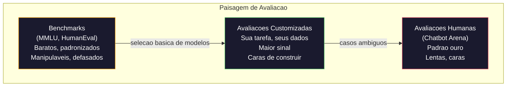
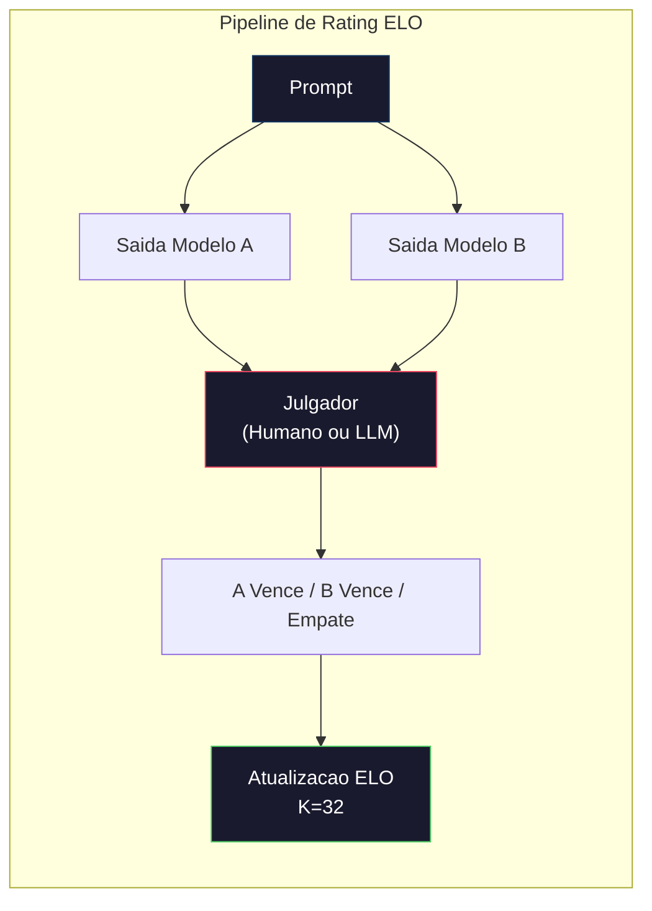

# Avaliacao: Benchmarks, Evals, LM Harness

> Lei de Goodhart: quando uma medida vira alvo, ela deixa de ser uma boa medida. Todo laboratorio frontier manipula benchmarks. Scores do MMLU sobem enquanto modelos ainda nao conseguem contar os R's em "strawberry" de forma confiavel. A unica avaliacao que importa e SUAS avaliacoes -- na SUA tarefa, com SEUS dados.

**Tipo:** Construir
**Linguagens:** Python
**Pre-requisitos:** Fase 10, Aulas 01-05 (LLMs from Scratch)
**Tempo:** ~90 minutos

## Objetivos de Aprendizado

- Construir um framework de avaliacao customizado que roda benchmarks de multipla escolha e abertos contra um modelo de linguagem
- Explicar por que benchmarks padrao (MMLU, HumanEval) saturam e falham em diferenciar modelos frontier
- Implementar avaliacoes eespecificaçãoificas por tarefa com metricas adequadas: exact match, F1, BLEU e pontuacao LLM-as-judge
- Projetar uma suita de avaliacao customizada direcionada pro seu caso de uso ao inves de depender apenas de rankings publicas

## O Problema

MMLU foi publicado em 2020 com 15.908 questoes em 57 materias. Em tres anos, modelos frontier o saturaram. GPT-4 pontuou 86.4%. Claude 3 Opus pontuou 86.8%. Llama 3 405B pontuou 88.6%. A ranking comprimiu num intervalo de 3 pontos onde diferencas sao ruido estatistico, nao gaps reais de capacidade.

Enquanto isso, esses mesmos modelos falham em tarefas que uma crianca de 10 anos faz sem pensar. Claude 3.5 Sonnet, pontuando 88.7% no MMLU, inicialmente nao conseguia contar as letras em "strawberry" -- uma tarefa que exige zero conhecimento do mundo e zero raciocinio, so iteracao no nivel de caractere. HumanEval testa geracao de codigo com 164 problemas. Modelos pontuam 90%+ nele enquanto ainda produzem codigo que trava em edge cases que qualquer dev juninho perceberia.

O gap entre performance em benchmark e confiabilidade no mundo real e o problema central da avaliacao de LLMs. Benchmarks te dizem como um modelo se performa no benchmark. Eles dizem quase nada sobre como esse modelo vai performar na SUA tarefa eespecificaçãoifica, com OS SEUS dados, sob OS SEUS modos de falha. Se voce ta construindo um bot de suporte ao cliente, MMLU e irrelevante. Se voce ta construindo um assistente de codigo, HumanEval so cobre geracao a nivel de funcao -- nao diz nada sobre debug, refatoracao ou explicar codigo entre arquivos.

Voce precisa de avaliacoes customizadas. Nao porque benchmarks sao inuteis -- sao uteis pra selecao basica de modelos -- mas porque a avaliacao final deve corresponder exatamente as suas condicoes de deploy.

## O Conceito

### A Paisagem de Avaliacao

Existem tres categorias de avaliacao, cada uma com custo e qualidade de sinal diferentes.

**Benchmarks** sao suitas de testes padronizadas. MMLU, HumanEval, SWE-bench, MATH, ARC, HellaSwag. Voce roda um modelo no benchmark e ganha uma pontuacao. A vantagem: todo mundo usa o mesmo teste, entao voce pode comparar modelos. A desvantagem: modelos e dados de treino contaminam cada vez mais esses benchmarks. Labs treinam em dados que incluem questoes do benchmark. As pontuacoes sobem. A capacidade pode nao subir.

**Avaliacoes customizadas** sao suites de testes que voce constrói pro seu caso de uso eespecificaçãoifico. Voce define as entradas, as saidas esperadas e a funcao de pontuacao. Um sumarizador de documentos legais e avaliado em documentos legais. Um gerador de SQL e avaliado no schema do seu banco de dados. Essas sao caras de criar mas sao a unica avaliacao que prediz performance em producao.

**Avaliacoes humanas** usam anotadores pagos pra julgar saidas do modelo em criterios como utilidade, correcao, fluencia e seguranca. O padrao ouro pra tarefas abertas onde pontuacao automatizada falha. Chatbot Arena coletou mais de 2 milhoes de votos de preferencia humana em mais de 100 modelos. O lado ruim: custo ($0.10-$2.00 por julgamento) e velocidade (horas a dias).



### Por Que Benchmarks Quebram

Tres mecanismos fazem os scores de benchmark pararem de refletir capacidade real.

**Contaminacao de dados.** Corpora de treinamento sao web-scraped. Questoes de benchmark estao na web. Modelos veem as respostas durante o treino. Isso nao e trapaceirismo no sentido tradicional -- labs nao incluem dados de benchmark de proposito. Mas scraping em escala web torna isso praticamente impossivel de excluir.

**Ensinar pro teste.** Labs otimizam mixtures de treino pra performance em benchmark. Se 5% da mixture de treino e multipla escolha estilo MMLU, o modelo aprende o formato e a distribuicao de respostas. MMLU e multipla escolha de 4 opcoes. Modelos aprendem que a distribuicao de respostas e aproximadamente uniforme entre A/B/C/D, o que ajuda mesmo quando o modelo nao sabe a resposta.

**Saturacao.** Quando todo modelo frontier pontua 85-90% num benchmark, o benchmark para de discriminar. As 10-15% de questoes restantes podem ser ambigues, mal rotuladas ou exigir conhecimento de dominio obscuro. Melhorar de 87% pra 89% no MMLU pode significar que o modelo memorizou duas questoes obscuras a mais, nao que ele ficou mais esperto.

### Perplexity: Checagem de Saude Rapida

Perplexity mede o quanto um modelo ta surpreso por uma sequencia de tokens. Formalmente, e a media negativa de log-likelihood exponenciada:

```
PPL = exp(-1/N * sum(log P(token_i | context)))
```

Uma perplexity de 10 significa que o modelo ta, em media, tao incerto quanto escolher uniformemente entre 10 opcoes em cada posicao de token. Menor e melhor. GPT-2 ganha perplexity de ~30 no WikiText-103. GPT-3 ganha ~20. Llama 3 8B ganha ~7.

Perplexity e util pra comparar modelos no mesmo dataset de teste, mas tem pontos cegos. Um modelo pode ter perplexity baixa por ser bom em prever padroes comuns enquanto e pessimo em padroes raros mas importantes. Tambem nao diz nada sobre seguisao de instrucoes, raciocinio ou acuracia factual. Use como sanity check, nao como veredito final.

### LLM-as-Judge

Use um modelo forte pra avaliar a saida de um modelo mais fraco. A ideia simples: peça pro GPT-4o ou Claude Sonnot avaliar uma resposta numa escala de 1-5 pra correcao, utilidade e seguranca. Isso custa cerca de $0.01 por julgamento com GPT-4o-mini e se correlaciona surpreendentemente bem com julgamentos humanos -- cerca de 80% de acordo na maioria das tarefas.

O prompt de pontuacao importa mais que o modelo. Um prompt vago ("Avalie essa resposta") gera scores ruidosos. Um prompt estruturado com rubrica ("Nota 5 se a resposta e factualmente correta e cita uma fonte, 4 se correta mas sem fonte, 3 se parcialmente correta...") gera scores consistentes e reproduziveis.

Modos de falha: modelos julgadores exibem viés de posicao (preferem a primeira resposta em comparacoes pareadas), viés de verbosidade (preferem respostas mais longas) e autopreferencia (GPT-4 avalia saidas do GPT-4 mais alto que saidas equivalentes do Claude). Mitigacoes: randomizar a ordem, normalizar por tamanho, usar um julgador diferente do modelo sendo avaliado.

### ELO Ratings a partir de Comparacoes Pareadas

A abordagem do Chatbot Arena. Mostre duas respostas pro mesmo prompt de modelos diferentes. Um humano (ou julgador LLM) escolhe a melhor. De milhares dessas comparacoes, compute um rating ELO pra cada modelo -- o mesmo sistema usado no xadrez.

Vantagens do ELO: ranking relativo e mais confiavel que pontuacao absoluta, lida bem com empates e converge com menos comparacoes que pontuar cada saida independentemente. Ate o inicio de 2026, rankings do Chatbot Arena mostram GPT-4o, Claude 3.5 Sonnet e Gemini 1.5 Pro dentro de 20 pontos ELO um do outro no topo.



### Frameworks de Avaliacao

**lm-evaluation-harness** (EleutherAI): o framework de avaliacao open source padrao. Suporta 200+ benchmarks. Rode qualquer modelo Hugging Face contra MMLU, HellaSwag, ARC, etc. com um comando. Usado pelo Open LLM Leaderboard.

**RAGAS**: framework de avaliacao eespecificaçãoifico pra pipelines RAG. Mede fidelidade (a resposta corresponde ao contexto recuperado?), relevancia (o contexto recuperado e relevante pra pergunta?) e correcao da resposta.

**promptfoo**: avaliacao dirigida por config pra engenharia de prompts. Defina testes em YAML, rode contra multiplos modelos, ganhe um relatorio pass/falha. Util pra testes de regressao de prompts -- garanta que uma mudanca no prompt nao quebre testes existentes.

### Construindo Avaliacoes Customizadas

A unica avaliacao que importa pra producao. O processo:

1. **Defina a tarefa.** O que exatamente o modelo deve fazer? Seja preciso. "Responder perguntas" e vago demais. "Dado um email de reclamacao de cliente, extrair o nome do produto, categoria do problema e sentimento" e uma tarefa que voce pode avaliar.

2. **Crie testes.** Minimo 50 pra uma avaliacao prototipo, 200+ pra producao. Cada teste e um par (entrada, saida esperada). Inclua edge cases: entradas vazias, entradas adversarias, entradas ambigues, entradas em outros idiomas.

3. **Defina pontuacao.** Exact match pra saidas estruturadas. BLEU/ROUGE pra similaridade de texto. LLM-as-judge pra qualidade aberta. F1 pra tarefas de extracao. Combine metricas com pesos.

4. **Automatize.** Cada avaliacao roda com um comando. Sem passos manuais. Guarde resultados num formato que permita comparacao ao longo do tempo.

5. **Acompanhe ao longo do tempo.** Um score de avaliacao isolado nao tem significado. Voce precisa da tendencia. O score melhorou apos a ultima mudanca no prompt? Regrediu depois de trocar de modelo? Versionize sua avaliacao junto com seus prompts.

| Tipo de Avaliacao | Custo por julgamento | Concordancia com humanos | Melhor pra |
|-----------|------------------|----------------------|----------|
| Exact match | ~$0 | 100% (quando aplicavel) | Saidas estruturadas, classificacao |
| BLEU/ROUGE | ~$0 | ~60% | Traducao, sumarizacao |
| LLM-as-judge | ~$0.01 | ~80% | Geracao aberta |
| Avaliacao humana | $0.10-$2.00 | N/A (e a verdade fundamental) | Tarefas ambiguas, de alto risco |

## Construir

### Etapa 1: Um Framework Minimo de Avaliacao

Defina as abstracoes centrais. Um caso de avaliacao tem uma entrada, uma saida esperada e um dicionario opcional de metadata. Um pontuador recebe uma previsao e uma referencia e retorna um score entre 0 e 1.

```python
import json
from collections import Counter

class EvalCase:
    def __init__(self, input_text, expected, metadata=None):
        self.input_text = input_text
        self.expected = expected
        self.metadata = metadata or {}

class EvalSuite:
    def __init__(self, name, cases, scorers):
        self.name = name
        self.cases = cases
        self.scorers = scorers

    def run(self, model_fn):
        results = []
        for case in self.cases:
            prediction = model_fn(case.input_text)
            scores = {}
            for scorer_name, scorer_fn in self.scorers.items():
                scores[scorer_name] = scorer_fn(prediction, case.expected)
            results.append({
                "input": case.input_text,
                "expected": case.expected,
                "prediction": prediction,
                "scores": scores,
            })
        return results
```

### Etapa 2: Funcoes de Pontuacao

Construa exact match, token F1 e um pontuador simulado de LLM-as-judge.

```python
def exact_match(prediction, expected):
    return 1.0 if prediction.strip().lower() == expected.strip().lower() else 0.0

def token_f1(prediction, expected):
    pred_tokens = set(prediction.lower().split())
    exp_tokens = set(expected.lower().split())
    if not pred_tokens or not exp_tokens:
        return 0.0
    common = pred_tokens & exp_tokens
    precision = len(common) / len(pred_tokens)
    recall = len(common) / len(exp_tokens)
    if precision + recall == 0:
        return 0.0
    return 2 * (precision * recall) / (precision + recall)

def llm_judge_simulated(prediction, expected):
    pred_words = set(prediction.lower().split())
    exp_words = set(expected.lower().split())
    if not exp_words:
        return 0.0
    overlap = len(pred_words & exp_words) / len(exp_words)
    length_penalty = min(1.0, len(prediction) / max(len(expected), 1))
    return round(overlap * 0.7 + length_penalty * 0.3, 3)
```

### Etapa 3: Sistema de Rating ELO

Implemente comparacoes pareadas com atualizacoes ELO. Esse e exatamente o sistema que o Chatbot Arena usa pra ranquear modelos.

```python
class ELOTracker:
    def __init__(self, k=32, initial_rating=1500):
        self.ratings = {}
        self.k = k
        self.initial_rating = initial_rating
        self.history = []

    def _ensure_player(self, name):
        if name not in self.ratings:
            self.ratings[name] = self.initial_rating

    def expected_score(self, rating_a, rating_b):
        return 1 / (1 + 10 ** ((rating_b - rating_a) / 400))

    def record_match(self, player_a, player_b, outcome):
        self._ensure_player(player_a)
        self._ensure_player(player_b)

        ea = self.expected_score(self.ratings[player_a], self.ratings[player_b])
        eb = 1 - ea

        if outcome == "a":
            sa, sb = 1.0, 0.0
        elif outcome == "b":
            sa, sb = 0.0, 1.0
        else:
            sa, sb = 0.5, 0.5

        self.ratings[player_a] += self.k * (sa - ea)
        self.ratings[player_b] += self.k * (sb - eb)

        self.history.append({
            "a": player_a, "b": player_b,
            "outcome": outcome,
            "rating_a": round(self.ratings[player_a], 1),
            "rating_b": round(self.ratings[player_b], 1),
        })

    def leaderboard(self):
        return sorted(self.ratings.items(), key=lambda x: -x[1])
```

### Etapa 4: Calculo de Perplexity

Compute perplexity usando probabilidades de tokens. Na pratica voce pegaria essas dos logits do modelo. Aqui simulamos com uma distribuicao de probabilidades.

```python
import numpy as np

def perplexity(log_probs):
    if not log_probs:
        return float("inf")
    avg_neg_log_prob = -np.mean(log_probs)
    return float(np.exp(avg_neg_log_prob))

def token_log_probs_simulated(text, model_quality=0.8):
    np.random.seed(hash(text) % 2**31)
    tokens = text.split()
    log_probs = []
    for i, token in enumerate(tokens):
        base_prob = model_quality
        if len(token) > 8:
            base_prob *= 0.6
        if i == 0:
            base_prob *= 0.7
        prob = np.clip(base_prob + np.random.normal(0, 0.1), 0.01, 0.99)
        log_probs.append(float(np.log(prob)))
    return log_probs
```

### Etapa 5: Agregar Resultados

Compute estatisticas resumidas de uma execucao de avaliacao: media, mediana, taxa de passagem num limiar e quebras por metrica.

```python
def summarize_results(results, threshold=0.8):
    all_scores = {}
    for r in results:
        for metric, score in r["scores"].items():
            all_scores.setdefault(metric, []).append(score)

    summary = {}
    for metric, scores in all_scores.items():
        arr = np.array(scores)
        summary[metric] = {
            "mean": round(float(np.mean(arr)), 3),
            "median": round(float(np.median(arr)), 3),
            "std": round(float(np.std(arr)), 3),
            "min": round(float(np.min(arr)), 3),
            "max": round(float(np.max(arr)), 3),
            "pass_rate": round(float(np.mean(arr >= threshold)), 3),
            "n": len(scores),
        }
    return summary

def print_summary(summary, suite_name="Eval"):
    print(f"\n{'=' * 60}")
    print(f"  {suite_name} Summary")
    print(f"{'=' * 60}")
    for metric, stats in summary.items():
        print(f"\n  {metric}:")
        print(f"    Mean:      {stats['mean']:.3f}")
        print(f"    Median:    {stats['median']:.3f}")
        print(f"    Std:       {stats['std']:.3f}")
        print(f"    Range:     [{stats['min']:.3f}, {stats['max']:.3f}]")
        print(f"    Pass rate: {stats['pass_rate']:.1%} (threshold >= 0.8)")
        print(f"    N:         {stats['n']}")
```

### Etapa 6: Rodar o Pipeline Completo

Conecte tudo. Defina uma tarefa, crie testes, simule dois modelos, rode avaliacoes, compute ELO de comparacoes pareadas e imprima a leaderboard.

```python
def demo_model_good(prompt):
    responses = {
        "What is the capital of France?": "Paris",
        "What is 2 + 2?": "4",
        "Who wrote Hamlet?": "William Shakespeare",
        "What language is PyTorch written in?": "Python and C++",
        "What is the boiling point of water?": "100 degrees Celsius",
    }
    return responses.get(prompt, "I don't know")

def demo_model_bad(prompt):
    responses = {
        "What is the capital of France?": "Paris is the capital city of France",
        "What is 2 + 2?": "The answer is four",
        "Who wrote Hamlet?": "Shakespeare",
        "What language is PyTorch written in?": "Python",
        "What is the boiling point of water?": "212 Fahrenheit",
    }
    return responses.get(prompt, "Unknown")

cases = [
    EvalCase("What is the capital of France?", "Paris"),
    EvalCase("What is 2 + 2?", "4"),
    EvalCase("Who wrote Hamlet?", "William Shakespeare"),
    EvalCase("What language is PyTorch written in?", "Python and C++"),
    EvalCase("What is the boiling point of water?", "100 degrees Celsius"),
]

suite = EvalSuite(
    name="General Knowledge",
    cases=cases,
    scorers={
        "exact_match": exact_match,
        "token_f1": token_f1,
        "llm_judge": llm_judge_simulated,
    },
)

results_good = suite.run(demo_model_good)
results_bad = suite.run(demo_model_bad)

print_summary(summarize_results(results_good), "Model A (concise)")
print_summary(summarize_results(results_bad), "Model B (verbose)")
```

O modelo "bom" da respostas exatas. O modelo "ruim" da parafases verbosas. Exact match pune o modelo verboso severamente. Token F1 e LLM-as-judge sao mais permissivos. Isso ilustra por que a escolha da metrica importa: o mesmo modelo parece otimo ou terrivel dependendo de como voce pontua.

### Etapa 7: Torneio ELO

Rode comparacoes pareadas entre modelos em multiplas rodadas.

```python
elo = ELOTracker(k=32)

for case in cases:
    pred_a = demo_model_good(case.input_text)
    pred_b = demo_model_bad(case.input_text)

    score_a = token_f1(pred_a, case.expected)
    score_b = token_f1(pred_b, case.expected)

    if score_a > score_b:
        outcome = "a"
    elif score_b > score_a:
        outcome = "b"
    else:
        outcome = "tie"

    elo.record_match("model_a_concise", "model_b_verbose", outcome)

print("\nELO Leaderboard:")
for name, rating in elo.leaderboard():
    print(f"  {name}: {rating:.0f}")
```

### Etapa 8: Comparacao de Perplexity

Compare perplexity entre "modelos" de diferentes niveis de qualidade.

```python
test_text = "The quick brown fox jumps over the lazy dog in the garden"

for quality, label in [(0.9, "Strong model"), (0.7, "Medium model"), (0.4, "Weak model")]:
    log_probs = token_log_probs_simulated(test_text, model_quality=quality)
    ppl = perplexity(log_probs)
    print(f"  {label} (quality={quality}): perplexity = {ppl:.2f}")
```

## Usar

### lm-evaluation-harness (EleutherAI)

A ferramenta padrao pra rodar benchmarks em qualquer modelo.

```python
# pip install lm-eval
# Command line:
# lm_eval --model hf --model_args pretrained=meta-llama/Llama-3.1-8B --tasks mmlu --batch_size 8

# Python API:
# import lm_eval
# results = lm_eval.simple_evaluate(
#     model="hf",
#     model_args="pretrained=meta-llama/Llama-3.1-8B",
#     tasks=["mmlu", "hellaswag", "arc_easy"],
#     batch_size=8,
# )
# print(results["results"])
```

### promptfoo

Avaliacao dirigida por config pra engenharia de prompts. Defina testes em YAML e rode contra multiplos provedores.

```yaml
# promptfoo.yaml
providers:
  - openai:gpt-4o-mini
  - anthropic:claude-3-haiku

prompts:
  - "Answer in one word: {{question}}"

tests:
  - vars:
      question: "What is the capital of France?"
    assert:
      - type: contains
        value: "Paris"
  - vars:
      question: "What is 2 + 2?"
    assert:
      - type: equals
        value: "4"
```

### RAGAS pra avaliacao RAG

```python
# pip install ragas
# from ragas import evaluate
# from ragas.metrics import faithfulness, answer_relevancy, context_precision
#
# result = evaluate(
#     dataset,
#     metrics=[faithfulness, answer_relevancy, context_precision],
# )
# print(result)
```

RAGAS mede o que avaliacoes genericas perdem: se a resposta do modelo ta ancorada no contexto recuperado, nao so se a resposta e "correta" no abstrato.

## Publicar

Essa aula produz `outputs/prompt-eval-designer.md` -- um prompt reutilizavel que projeta suitas de avaliacao customizadas pra qualquer tarefa. Dê uma descricao da tarefa e ele gera testes, funcoes de pontuacao e uma recomendacao de limiar pass/falha.

Tambem produz `outputs/skill-llm-evaluation.md` -- um framework de decisao pra escolher a estrategia de avaliacao certa baseado no tipo de tarefa, orcamento e requisitos de latencia.

## Exercicios

1. Adicione um pontuador de "consistencia" que roda a mesma entrada pelo modelo 5 vezes e mede com que frequencia as saidas coincidem. Respostas inconsistentes em entradas deterministicas revelam prompts fragils ou configuracoes de temperatura altas.

2. Estenda o rastreador ELO pra suportar multiplas funcoes de julgamento (exact match, F1, LLM-as-judge) e pondera-las. Compare como a ranking muda quando voce pega pesado no exact match vs F1.

3. Construa uma suite de avaliacao pra uma tarefa eespecificaçãoifica: classificacao de emails em 5 categorias. Crie 100 testes com exemplos diversos incluindo edge cases (emails que podem pertencer a multiplas categorias, emails vazios, emails em outros idiomas). Meça como diferentes "modelos" (baseado em regra, correspondencia por palavra-chave, LLM simulado) performam.

4. Implemente deteccao de contaminacao: dado um conjunto de questoes de avaliacao e um corpus de treino, verifique que porcentagem de questoes de avaliacao (ou parafases proximas) aparecem nos dados de treino. E assim que pesquisadores auditam a validade de benchmarks.

5. Construa uma ferramenta de "diff de modelo". Dados resultados de avaliacao de duas versoes de modelo, destaque quais testes eespecificaçãoificos melhoraram, quais regrediram e quais permaneceram iguais. Esse e o equivalente de avaliacao de um diff de codigo -- essencial pra entender se uma mudanca ajudou ou prejudicou.

## Termos Chave

| Termo | O que a gente diz | O que realmente significa |
|------|----------------|----------------------|
| MMLU | "O benchmark" | Massive Multitask Language Understanding -- 15.908 questoes de multipla escolha em 57 materias, saturou acima de 88% em 2025 |
| HumanEval | "Avaliacao de codigo" | 164 problemas de completacao de funcoes Python da OpenAI, testa apenas geracao de funcoes isoladas |
| SWE-bench | "Avaliacao de codigo real" | 2.294 issues do GitHub de 12 repos Python, mede correcao de bugs de ponta a ponta incluindo geracao de testes |
| Perplexity | "O quao confuso o modelo ta" | exp(-avg(log P(token_i dado contexto))) -- menor significa que o modelo atribui maior probabilidade aos tokens reais |
| Rating ELO | "Ranking de xadrez pra modelos" | Um rating de habilidade relativo computado de registros de vitoria/derrota pareados, usado pelo Chatbot Arena pra ranquear 100+ modelos |
| LLM-as-judge | "Usar IA pra avaliar IA" | Um modelo forte pontua as saidas de um modelo mais fraco contra uma rubrica, ~80% de concordancia com julgadores humanos a ~$0.01/julgamento |
| Contaminacao de dados | "O modelo viu o teste" | Dados de treino incluem questoes de benchmark, inflando scores sem melhorar capacidade real |
| Suite de avaliacao | "Um monte de testes" | Uma colecao versionada de triples (entrada, saida_esperada, pontuador) que mede uma capacidade eespecificaçãoifica |
| Taxa de passagem | "Que porcentagem acerta" | Fracao de casos de avaliacao que pontuam acima de um limiar -- mais acionavel que media porque mede confiabilidade |
| Chatbot Arena | "Site de ranking de modelos" | Plataforma LMSYS com 2M+ votos de preferencia humana, produzindo a ranking de LLM mais confiavel via ratings ELO |

## Leitura Complementar

- [Hendrycks et al., 2021 -- "Measuring Massive Multitask Language Understanding"](https://arxiv.org/abs/2009.03300) -- o paper MMLU, ainda o benchmark de LLM mais citado apesar da saturacao
- [Chen et al., 2021 -- "Evaluating Large Language Models Trained on Code"](https://arxiv.org/abs/2107.03374) -- o paper HumanEval da OpenAI, estabeleceu metodologia de avaliacao de geracao de codigo
- [Zheng et al., 2023 -- "Judging LLM-as-a-Judge"](https://arxiv.org/abs/2306.05685) -- analise sistematica de usar LLMs pra avaliar LLMs, incluindo descobertas sobre viés de posicao e viés de verbosidade
- [LMSYS Chatbot Arena](https://chat.lmsys.org/) -- plataforma de comparacao de modelos crowdsourcada com 2M+ votos, o ranking de LLM mais confiavel do mundo real
