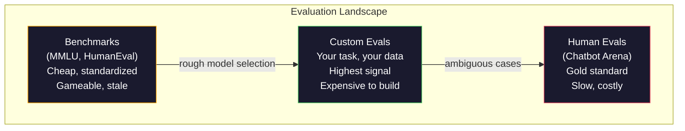
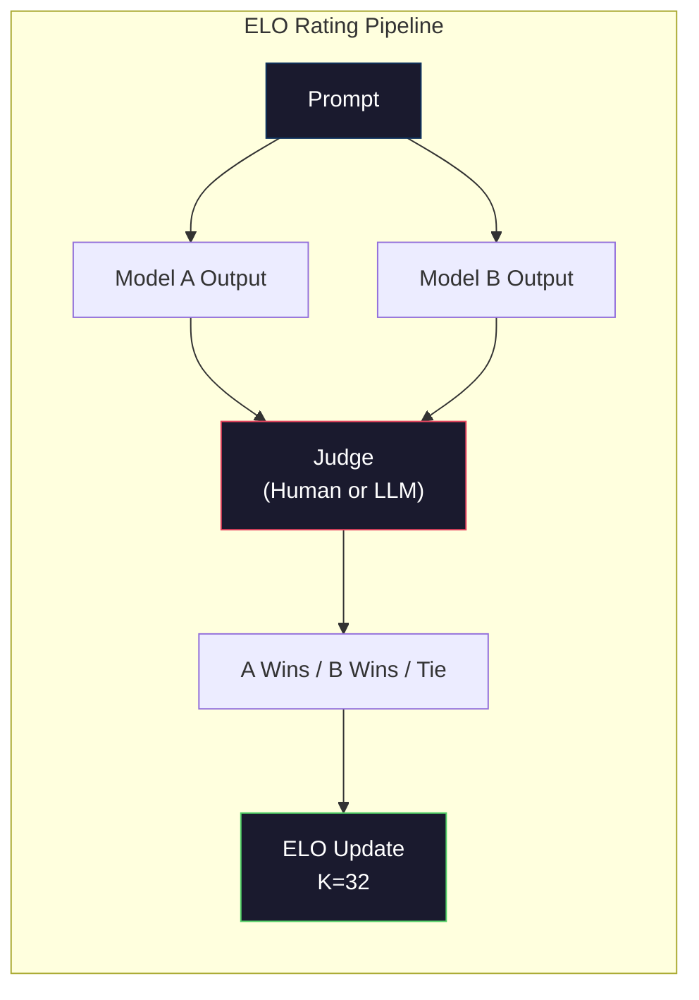

# Değerlendirme: Benchmarks, Evals, LM Harness

> Goodhart Yasası: Bir ölçü hedef haline geldiğinde iyi bir ölçü olmaktan çıkar. Her sınır laboratuvar oyunu benchmarks. MMLU puanları yükselirken modeller hâlâ "çilek"teki R sayısını güvenilir bir şekilde sayamıyor. Önemli olan tek değerlendirme SİZİN görevinizde, SİZİN verilerinizle yapacağınız değerlendirmedir.

**Tür:** Yapım
**Diller:** Python
**Önkoşullar:** Aşama 10, Dersler 01-05 (Sıfırdan Yüksek Lisans)
**Süre:** ~90 dakika

## Öğrenme Hedefleri

- Bir dil modeline karşı çoktan seçmeli ve açık uçlu benchmark'ları çalıştıran özel bir değerlendirme sistemi oluşturun
- Standart benchmark'ların (MMLU, HumanEval) neden sınır modellerini doyurduğunu ve ayırt etmekte başarısız olduğunu açıklayın
- Göreve özgü değerlendirmeleri uygun ölçümlerle uygulayın: tam eşleşme, F1, BLEU ve hakem olarak LLM puanlaması
- Yalnızca herkese açık skor tablolarına güvenmek yerine, özel kullanım durumunuzu hedefleyen özel bir değerlendirme paketi tasarlayın

## Sorun

MMLU, 2020 yılında 57 konuda 15.908 soruyla yayınlandı. Üç yıl içinde sınır modelleri bunu doyuma ulaştırdı. GPT-4 %86,4 puan aldı. Claude 3 Opus %86,8 puan aldı. Llama 3 405B %88,6 puan aldı. Liderlik tablosu, farklılıkların gerçek yetenek boşlukları değil istatistiksel gürültü olduğu 3 noktalı bir aralığa sıkıştırılmıştır.

Bu arada aynı modeller, 10 yaşındaki bir çocuğun düşünmeden yerine getirdiği görevlerde başarısız oluyor. Claude 3.5 MMLU'da %88,7 puan alan Sonnet, başlangıçta "çilek" kelimesindeki harfleri sayamadı; bu, sıfır dünya bilgisi ve sıfır muhakeme gerektiren, sadece karakter düzeyinde yineleme gerektiren bir görevdir. HumanEval, kod oluşturmayı 164 problemle test eder. Modeller %90'ın üzerinde puan alırken, herhangi bir genç geliştiricinin yakalayabileceği uç durumlarda çöken kodlar üretmeye devam ediyor.

benchmark performansı ile gerçek dünya güvenilirliği arasındaki boşluk, Yüksek Lisans değerlendirmesinin temel sorunudur. Benchmark'ler size bir modelin benchmark üzerinde nasıl performans gösterdiğini anlatır. Size, belirli hata modlarınız altında, bu modelin belirli görevinizde, belirli verilerinizle nasıl performans göstereceği hakkında neredeyse hiçbir şey söylemezler. Bir müşteri destek botu oluşturuyorsanız MMLU'nun bir önemi yoktur. Bir kod asistanı oluşturuyorsanız HumanEval yalnızca işlev düzeyinde oluşturmayı kapsar; dosyalar arasında kodun hata ayıklaması, yeniden düzenlenmesi veya açıklanması hakkında hiçbir şey söylemez.

Özel değerlendirmelere ihtiyacınız var. benchmark'lar işe yaramaz oldukları için değil -- kaba model seçimi için faydalıdırlar -- fakat son değerlendirmenin deployment koşullarınıza tam olarak uyması gerektiği için.

## Konsept

### Eval Manzarası

Her biri farklı maliyet ve sinyal kalitesine sahip üç değerlendirme kategorisi vardır.

**Benchmarks** standartlaştırılmış test paketleridir. MMLU, HumanEval, SWE-bench, MATH, ARC, HellaSwag. benchmark'ya karşı bir model çalıştırırsınız ve bir puan alırsınız. Avantajı: Herkes aynı testi kullanır, böylece modelleri karşılaştırabilirsiniz. Dezavantajı: modeller ve eğitim verileri bu benchmark'ları giderek daha fazla kirletiyor. Laboratuvarlar, benchmark soruyu içeren veriler üzerinde eğitim verir. Puanlar artıyor. Yetenek olmayabilir.

**Özel değerlendirmeler**, özel kullanım durumunuz için oluşturduğunuz test paketleridir. Girdileri, beklenen çıktıları ve puanlama işlevini tanımlarsınız. Yasal belge özetleyicisi yasal belgeler üzerinde değerlendirilir. Bir SQL oluşturucu veritabanı şemanızda değerlendirilir. Bunları oluşturmak pahalıdır ancak üretim performansını tahmin eden tek değerlendirmedir.

**İnsan değerlendirmeleri** model çıktılarını yararlılık, doğruluk, akıcılık ve güvenlik gibi kriterlere göre değerlendirmek için ücretli ek açıklamaları kullanır. Otomatik puanlamanın başarısız olduğu açık uçlu görevler için altın standart. Chatbot Arena, 100'den fazla modelde 2 milyondan fazla insan tercihi oyu topladı. Dezavantajı: maliyet ($0.10-$yargı başına 2,00) ve hız (saatlerden günlere).



### Neden BenchmarkMola

Üç mekanizma, benchmark puanlarının gerçek yeteneği yansıtmayı durdurmasına neden olur.

**Veri kirliliği.** Eğitim kurumları interneti sıyırıyor. Benchmark soru internette yayınlanıyor. Modeller eğitim sırasında cevapları görür. Bu, geleneksel anlamda hile değildir; laboratuvarlar kasıtlı olarak benchmark verilerini içermez. Ancak web ölçeğinde kazıma, hariç tutmayı neredeyse imkansız hale getiriyor.

**Test için öğretim.** Laboratuvarlar, eğitim karışımlarını benchmark performansına göre optimize eder. Eğitim karışımının %5'i MMLU tarzı çoktan seçmeliyse model, formatı ve cevap dağılımını öğrenir. MMLU 4 yönlü çoktan seçmeli bir sistemdir. Modeller, A/B/C/D genelinde yanıt dağılımının yaklaşık olarak aynı olduğunu öğrenir; bu, modelin yanıtı bilmediği durumlarda bile yardımcı olur.

**Doygunluk.** Her sınır modeli bir benchmark üzerinde %85-90 puan aldığında, benchmark ayrım yapmayı bırakır. Soruların geri kalan %10-15'i belirsiz olabilir, yanlış etiketlenmiş olabilir veya belirsiz alan bilgisi gerektirebilir. MMLU'da %87'den %89'a iyileşme, modelin daha akıllı hale geldiği anlamına değil, iki belirsiz soruyu daha ezberlediği anlamına gelebilir.

### Şaşkınlık: Hızlı Bir Durum Kontrolü

Şaşkınlık, bir modelin token dizisiyle ne kadar şaşırdığını ölçer. Biçimsel olarak, üstelleştirilmiş ortalama negatif log-olasılıktır:

```
PPL = exp(-1/N * sum(log P(token_i | context)))
```

10'luk bir şaşkınlık, modelin ortalama olarak her token konumunda 10 seçenek arasından tekdüze seçim yapmak kadar belirsiz olduğu anlamına gelir. Daha düşük olması daha iyidir. GPT-2, WikiText-103'te ~30'luk bir şaşkınlık elde ediyor. GPT-3 ~20 alır. Llama 3 8B ~7 alır.

Şaşkınlık, aynı test kümesindeki modelleri karşılaştırmak için kullanışlıdır ancak kör noktaları vardır. Bir model, ortak kalıpları tahmin etmede iyiyken, nadir fakat önemli kalıplarda berbat olması nedeniyle düşük kafa karışıklığına sahip olabilir. Aynı zamanda talimatları takip etme, akıl yürütme veya olgusal doğruluk hakkında da hiçbir şey söylemez. Bunu nihai bir karar olarak değil, akıl sağlığı kontrolü olarak kullanın.

### Hakim Olarak Yüksek Lisans

Daha zayıf bir modelin çıktısını değerlendirmek için güçlü bir model kullanın. Fikir basit: GPT-4o veya Claude Sonnet'ten bir yanıtı doğruluk, yararlılık ve güvenlik açısından 1'den 5'e kadar derecelendirmelerini isteyin. Bu, GPT-4o-mini ile değerlendirme başına yaklaşık 0,01 ABD dolarıdır ve insan kararlarıyla şaşırtıcı derecede iyi bir korelasyon gösterir; çoğu görevde yaklaşık %80 anlaşma.

prompt puanlaması modelden daha önemlidir. Belirsiz bir prompt ("Bu yanıtı derecelendirin") gürültülü puanlar üretir. Dereceli puanlama anahtarı içeren yapılandırılmış bir prompt ("Cevap gerçekten doğruysa ve bir kaynaktan alıntı yapıyorsa 5 puan, doğru ancak kaynaksızsa 4, kısmen doğruysa 3...") tutarlı, tekrarlanabilir puanlar üretir.

Başarısızlık modları: Yargıç modelleri konum yanlılığı (ikili karşılaştırmalarda ilk yanıtı tercih eder), ayrıntı yanlılığı (daha uzun yanıtları tercih eder) ve kendi tercihini (GPT-4, GPT-4 çıktılarını eşdeğer Claude çıktılarından daha yüksek olarak değerlendirir) sergiler. Azaltıcı önlemler: rastgele sıralama, uzunluğa göre normalleştirme, değerlendirilen modelden farklı bir yargıç kullanma.

### İkili Karşılaştırmalardan ELO Derecelendirmeleri

Chatbot Arena'nın yaklaşımı. Aynı prompt'ya farklı modellerden iki yanıt gösterin. Bir insan (veya LLM yargıcı) daha iyi olanı seçer. Bu karşılaştırmaların binlercesinden her model için bir ELO derecesi hesaplayın; satrançta kullanılan sistemin aynısı.

ELO'nun avantajları: göreceli sıralama, mutlak puanlamadan daha güvenilirdir, bağları daha iyi ele alır ve her çıktıyı bağımsız olarak puanlamaktan daha az karşılaştırmayla birleşir. 2026 başı itibarıyla, Chatbot Arena sıralamalarında GPT-4o, Claude 3.5 Sonnet ve Gemini 1.5 Pro birbirlerinden 20 ELO puanı uzakta en üstte yer alıyor.



### Framework'ları değerlendir

**lm-evaluation-harness** (EleutherAI): standart açık kaynaklı değerlendirme framework. 200'den fazla benchmark'yi destekler. Herhangi bir Hugging Face modelini tek komutla MMLU, HellaSwag, ARC vb.'ye karşı çalıştırın. Open LLM Leaderboard tarafından kullanılır.

**RAGAS**: özellikle RAG boru hatları için değerlendirme framework. Doğruluğu (cevap alınan bağlamla eşleşiyor mu?), alaka düzeyini (alınan bağlam soruyla alakalı mı?) ve yanıtın doğruluğunu ölçer.

**promptfoo**: prompt mühendisliği için yapılandırmaya dayalı değerlendirme. YAML'de test senaryolarını tanımlayın, birden fazla modelde çalıştırın, başarılı/başarısız raporu alın. prompts regresyon testi için kullanışlıdır -- bir prompt değişikliğinin mevcut test senaryolarını bozmadığından emin olun.

### Özel Değerlendirmeler Oluşturma

Üretim için önemli olan tek değerlendirme. Süreç:

1. **Görevi tanımlayın.** Model tam olarak ne yapmalı? Kesin olun. "Soruları cevapla" çok belirsiz. "Müşteri şikayeti e-postası verildiğinde ürün adını, sorun kategorisini ve duyarlılığı çıkarmak" değerlendirebileceğiniz bir görevdir.

2. **Test senaryoları oluşturun.** Prototip değerlendirmesi için minimum 50, üretim için 200'den fazla. Her test durumu bir (giriş, beklenen_çıkış) çiftidir. Uç durumları dahil edin: boş girdiler, rakip girdiler, belirsiz girdiler, diğer dillerdeki girdiler.

3. **Puanlamayı tanımlayın.** Yapılandırılmış çıktılar için tam eşleşme. Metin benzerliği için BLEU/ROUGE. Açık uçlu kalite için yüksek lisans jürisi. Çıkarma görevleri için F1. Birden fazla ölçümü ağırlıklarla birleştirin.

4. **Otomatikleştirin.** Her değerlendirme tek komutla çalışır. Manuel adım yok. Sonuçları zaman içinde karşılaştırmaya olanak tanıyan bir biçimde saklayın.

5. **Zaman içinde takip edin.** Değerlendirme puanı tek başına anlamsızdır. Trend çizgisine ihtiyacınız var. Son prompt değişikliğinden sonra puan arttı mı? Model değiştirdikten sonra geriledi mi? Değerlendirmenizi prompt'larınızla birlikte sürümleyin.

| Değerlendirme Türü | Karar başına maliyet | İnsanlarla Anlaşma | Şunun için en iyisi |
|-----------|------------------|----------------------|----------|
| Tam eşleşme | ~$0 | %100 (varsa) | Yapılandırılmış çıktı, sınıflandırma |
| MAVİ/ROUGE | ~$0 | ~%60 | Çeviri, özetleme |
| Hakim olarak Yüksek Lisans | ~0,01$ | ~%80 | Açık uçlu nesil |
| İnsan değerlendirmesi | $0.10-$2.00 | Yok (temel gerçektir) | Belirsiz, yüksek riskli görevler |

```figure
perplexity-loss
```

## İnşa Et

### Adım 1: Minimum Değerlendirme Framework

Temel soyutlamaları tanımlayın. Bir değerlendirme vakasının bir girişi, beklenen bir çıkışı ve isteğe bağlı bir meta veri diktesi vardır. Puanlayıcı bir tahmin ve bir referans alır ve 0 ile 1 arasında bir puan döndürür.

```python
import json
from collections import Counter

class EvalCase:
    def __init__(self, input_text, expected, metadata=None):
        self.input_text = input_text
        self.expected = expected
        self.metadata = metadata or {}

class EvalSuite:
    def __init__(self, name, cases, scorers):
        self.name = name
        self.cases = cases
        self.scorers = scorers

    def run(self, model_fn):
        results = []
        for case in self.cases:
            prediction = model_fn(case.input_text)
            scores = {}
            for scorer_name, scorer_fn in self.scorers.items():
                scores[scorer_name] = scorer_fn(prediction, case.expected)
            results.append({
                "input": case.input_text,
                "expected": case.expected,
                "prediction": prediction,
                "scores": scores,
            })
        return results
```

### Adım 2: Puanlama İşlevleri

Tam eşleşme, token F1 ve simüle edilmiş bir hakem olarak yüksek lisans puanlayıcısı oluşturun.

```python
def exact_match(prediction, expected):
    return 1.0 if prediction.strip().lower() == expected.strip().lower() else 0.0

def token_f1(prediction, expected):
    pred_tokens = set(prediction.lower().split())
    exp_tokens = set(expected.lower().split())
    if not pred_tokens or not exp_tokens:
        return 0.0
    common = pred_tokens & exp_tokens
    precision = len(common) / len(pred_tokens)
    recall = len(common) / len(exp_tokens)
    if precision + recall == 0:
        return 0.0
    return 2 * (precision * recall) / (precision + recall)

def llm_judge_simulated(prediction, expected):
    pred_words = set(prediction.lower().split())
    exp_words = set(expected.lower().split())
    if not exp_words:
        return 0.0
    overlap = len(pred_words & exp_words) / len(exp_words)
    length_penalty = min(1.0, len(prediction) / max(len(expected), 1))
    return round(overlap * 0.7 + length_penalty * 0.3, 3)
```

### Adım 3: ELO Derecelendirme Sistemi

ELO güncellemeleriyle ikili karşılaştırmalar uygulayın. Bu tam olarak Chatbot Arena'nın modelleri sıralamak için kullandığı sistemdir.

```python
class ELOTracker:
    def __init__(self, k=32, initial_rating=1500):
        self.ratings = {}
        self.k = k
        self.initial_rating = initial_rating
        self.history = []

    def _ensure_player(self, name):
        if name not in self.ratings:
            self.ratings[name] = self.initial_rating

    def expected_score(self, rating_a, rating_b):
        return 1 / (1 + 10 ** ((rating_b - rating_a) / 400))

    def record_match(self, player_a, player_b, outcome):
        self._ensure_player(player_a)
        self._ensure_player(player_b)

        ea = self.expected_score(self.ratings[player_a], self.ratings[player_b])
        eb = 1 - ea

        if outcome == "a":
            sa, sb = 1.0, 0.0
        elif outcome == "b":
            sa, sb = 0.0, 1.0
        else:
            sa, sb = 0.5, 0.5

        self.ratings[player_a] += self.k * (sa - ea)
        self.ratings[player_b] += self.k * (sb - eb)

        self.history.append({
            "a": player_a, "b": player_b,
            "outcome": outcome,
            "rating_a": round(self.ratings[player_a], 1),
            "rating_b": round(self.ratings[player_b], 1),
        })

    def leaderboard(self):
        return sorted(self.ratings.items(), key=lambda x: -x[1])
```

### Adım 4: Şaşkınlık Hesaplaması

token olasılıklarını kullanarak karmaşıklığı hesaplayın. Uygulamada bunları modelin logitlerinden elde edersiniz. Burada olasılık dağılımıyla simülasyon yapıyoruz.

```python
import numpy as np

def perplexity(log_probs):
    if not log_probs:
        return float("inf")
    avg_neg_log_prob = -np.mean(log_probs)
    return float(np.exp(avg_neg_log_prob))

def token_log_probs_simulated(text, model_quality=0.8):
    np.random.seed(hash(text) % 2**31)
    tokens = text.split()
    log_probs = []
    for i, token in enumerate(tokens):
        base_prob = model_quality
        if len(token) > 8:
            base_prob *= 0.6
        if i == 0:
            base_prob *= 0.7
        prob = np.clip(base_prob + np.random.normal(0, 0.1), 0.01, 0.99)
        log_probs.append(float(np.log(prob)))
    return log_probs
```

### Adım 5: Sonuçları Toplayın

Bir değerlendirme çalıştırması boyunca özet istatistikleri hesaplayın: ortalama, medyan, eşikteki geçiş oranı ve metrik başına dökümler.

```python
def summarize_results(results, threshold=0.8):
    all_scores = {}
    for r in results:
        for metric, score in r["scores"].items():
            all_scores.setdefault(metric, []).append(score)

    summary = {}
    for metric, scores in all_scores.items():
        arr = np.array(scores)
        summary[metric] = {
            "mean": round(float(np.mean(arr)), 3),
            "median": round(float(np.median(arr)), 3),
            "std": round(float(np.std(arr)), 3),
            "min": round(float(np.min(arr)), 3),
            "max": round(float(np.max(arr)), 3),
            "pass_rate": round(float(np.mean(arr >= threshold)), 3),
            "n": len(scores),
        }
    return summary

def print_summary(summary, suite_name="Eval"):
    print(f"\n{'=' * 60}")
    print(f"  {suite_name} Summary")
    print(f"{'=' * 60}")
    for metric, stats in summary.items():
        print(f"\n  {metric}:")
        print(f"    Mean:      {stats['mean']:.3f}")
        print(f"    Median:    {stats['median']:.3f}")
        print(f"    Std:       {stats['std']:.3f}")
        print(f"    Range:     [{stats['min']:.3f}, {stats['max']:.3f}]")
        print(f"    Pass rate: {stats['pass_rate']:.1%} (threshold >= 0.8)")
        print(f"    N:         {stats['n']}")
```

### Adım 6: Tüm İşlem Hattını Çalıştırın

Her şeyi birbirine bağlayın. Bir görev tanımlayın, test senaryoları oluşturun, iki modeli simüle edin, değerlendirmeleri çalıştırın, ikili karşılaştırmalardan ELO'yu hesaplayın ve sıralama tablosunu yazdırın.

```python
def demo_model_good(prompt):
    responses = {
        "What is the capital of France?": "Paris",
        "What is 2 + 2?": "4",
        "Who wrote Hamlet?": "William Shakespeare",
        "What language is PyTorch written in?": "Python and C++",
        "What is the boiling point of water?": "100 degrees Celsius",
    }
    return responses.get(prompt, "I don't know")

def demo_model_bad(prompt):
    responses = {
        "What is the capital of France?": "Paris is the capital city of France",
        "What is 2 + 2?": "The answer is four",
        "Who wrote Hamlet?": "Shakespeare",
        "What language is PyTorch written in?": "Python",
        "What is the boiling point of water?": "212 Fahrenheit",
    }
    return responses.get(prompt, "Unknown")

cases = [
    EvalCase("What is the capital of France?", "Paris"),
    EvalCase("What is 2 + 2?", "4"),
    EvalCase("Who wrote Hamlet?", "William Shakespeare"),
    EvalCase("What language is PyTorch written in?", "Python and C++"),
    EvalCase("What is the boiling point of water?", "100 degrees Celsius"),
]

suite = EvalSuite(
    name="General Knowledge",
    cases=cases,
    scorers={
        "exact_match": exact_match,
        "token_f1": token_f1,
        "llm_judge": llm_judge_simulated,
    },
)

results_good = suite.run(demo_model_good)
results_bad = suite.run(demo_model_bad)

print_summary(summarize_results(results_good), "Model A (concise)")
print_summary(summarize_results(results_bad), "Model B (verbose)")
```

"İyi" model kesin cevaplar verir. "Kötü" model ayrıntılı açıklamalar verir. Tam eşleşme, ayrıntılı modeli ciddi şekilde cezalandırır. Token F1 ve yüksek lisans hakemi olarak daha bağışlayıcıdır. Bu, metrik seçiminin neden önemli olduğunu gösteriyor: Nasıl puanladığınıza bağlı olarak aynı model harika ya da berbat görünüyor.

### Adım 7: ELO Turnuvası

Birden fazla turda modeller arasında ikili karşılaştırmalar yapın.

```python
elo = ELOTracker(k=32)

for case in cases:
    pred_a = demo_model_good(case.input_text)
    pred_b = demo_model_bad(case.input_text)

    score_a = token_f1(pred_a, case.expected)
    score_b = token_f1(pred_b, case.expected)

    if score_a > score_b:
        outcome = "a"
    elif score_b > score_a:
        outcome = "b"
    else:
        outcome = "tie"

    elo.record_match("model_a_concise", "model_b_verbose", outcome)

print("\nELO Leaderboard:")
for name, rating in elo.leaderboard():
    print(f"  {name}: {rating:.0f}")
```

### Adım 8: Şaşkınlık Karşılaştırması

Farklı kalite seviyelerindeki "modeller" arasındaki karışıklığı karşılaştırın.

```python
test_text = "The quick brown fox jumps over the lazy dog in the garden"

for quality, label in [(0.9, "Strong model"), (0.7, "Medium model"), (0.4, "Weak model")]:
    log_probs = token_log_probs_simulated(test_text, model_quality=quality)
    ppl = perplexity(log_probs)
    print(f"  {label} (quality={quality}): perplexity = {ppl:.2f}")
```

## Kullan onu

### lm-değerlendirme-koşumu (EleutherAI)

benchmark'ları herhangi bir modelde çalıştırmak için standart araç.

```python
# pip install lm-eval
# Command line:
# lm_eval --model hf --model_args pretrained=meta-llama/Llama-3.1-8B --tasks mmlu --batch_size 8

# Python API:
# import lm_eval
# results = lm_eval.simple_evaluate(
#     model="hf",
#     model_args="pretrained=meta-llama/Llama-3.1-8B",
#     tasks=["mmlu", "hellaswag", "arc_easy"],
#     batch_size=8,
# )
# print(results["results"])
```

### promptfoo

prompt mühendisliği için yapılandırmaya dayalı değerlendirme. YAML'de testleri tanımlayın ve birden fazla sağlayıcıya karşı çalıştırın.

```yaml
# promptfoo.yaml
providers:
  - openai:gpt-4o-mini
  - anthropic:claude-3-haiku

prompts:
  - "Answer in one word: {{question}}"

tests:
  - vars:
      question: "What is the capital of France?"
    assert:
      - type: contains
        value: "Paris"
  - vars:
      question: "What is 2 + 2?"
    assert:
      - type: equals
        value: "4"
```

### RAG değerlendirmesi için RAGAS

```python
# pip install ragas
# from ragas import evaluate
# from ragas.metrics import faithfulness, answer_relevancy, context_precision
#
# result = evaluate(
#     dataset,
#     metrics=[faithfulness, answer_relevancy, context_precision],
# )
# print(result)
```

RAGAS, genel değerlendirmelerin neyi gözden kaçırdığını ölçer: modelin cevabının, yalnızca cevabın soyut olarak "doğru" olup olmadığı değil, alınan bağlama dayanıp dayanmadığı.

## Gönderin

Bu ders, herhangi bir görev için özel değerlendirme paketleri tasarlayan yeniden kullanılabilir bir prompt olan `outputs/prompt-eval-designer.md`'ı üretir. Ona bir görev tanımı verin; test senaryoları, puanlama fonksiyonları ve geçme/başarısızlık eşiği önerisi oluşturur.

Aynı zamanda görev türünüze, bütçenize ve gecikme gereksinimlerinize göre doğru değerlendirme stratejisini seçmek için bir karar framework olan `outputs/skill-llm-evaluation.md` üretir.

## Egzersizler

1. Aynı girdiyi model boyunca 5 kez çalıştıran ve çıktıların ne sıklıkta eşleştiğini ölçen bir "tutarlılık" puanlayıcı ekleyin. Deterministik girdilere ilişkin tutarsız yanıtlar, hassas prompt'ları veya yüksek sıcaklık ayarlarını ortaya çıkarır.

2. ELO izleyiciyi birden fazla hakem işlevini (tam eşleşme, F1, hakem olarak yüksek lisans) destekleyecek şekilde genişletin ve bunları ağırlıklandırın. Tam eşleşmeyi ağırlıklı olarak ağırlıklandırdığınızda ve F1'i ağırlıklı olarak ağırlıklandırdığınızda liderlik tablosunun nasıl değiştiğini karşılaştırın.

3. Belirli bir görev için bir değerlendirme paketi oluşturun: 5 kategoriye e-posta sınıflandırması. Uç vakalar (birden fazla kategoriye ait olabilecek e-postalar, boş e-postalar, diğer dillerdeki e-postalar) dahil olmak üzere çeşitli örnekler içeren 100 test senaryosu oluşturun. Farklı "modellerin" (kural tabanlı, anahtar kelime eşleştirme, simüle edilmiş LLM) nasıl performans gösterdiğini ölçün.

4. Kontaminasyon tespitini uygulayın: Bir dizi değerlendirme sorusu ve bir eğitim derlemi verildiğinde, eğitim verilerinde değerlendirme sorularının (veya yakın açıklamaların) yüzde kaçının göründüğünü kontrol edin. Araştırmacılar benchmark geçerliliğini bu şekilde denetlerler.

5. Bir "model farkı" aracı oluşturun. İki model versiyonundan elde edilen değerlendirme sonuçları göz önüne alındığında, hangi belirli test senaryolarının iyileştiğini, hangilerinin gerilediğini ve hangilerinin aynı kaldığını vurgulayın. Bu, bir değişikliğin faydalı mı yoksa zararlı mı olduğunu anlamak için gerekli olan kod farkının değerlendirme eşdeğeridir.

## Anahtar Terimler

| Dönem | İnsanlar ne diyor | Aslında ne anlama geliyor |
|------|----------------|----------------------|
| MMLU | "benchmark" | Devasa Çok Görevli Dil Anlama - 57 konu genelinde 15.908 çoktan seçmeli soru, 2025'e kadar %88'in üzerine çıkacak |
| İnsan Değerlendirmesi | "Kod değerlendirmesi" | 164 OpenAI'den Python işlev tamamlama sorunları, yalnızca yalıtılmış işlev oluşturmayı test eder |
| SWE-bank | "Gerçek kodlama değerlendirmesi" | 12 Python deposundan 2.294 GitHub sorunu, test oluşturma da dahil olmak üzere uçtan uca hata düzeltmeyi ölçüyor |
| Şaşkınlık | "Model ne kadar karışık" | exp(-avg(log P({{T0}__i verilen bağlam))) -- daha düşük, modelin gerçek tokens |
| ELO derecelendirmesi | "Modeller için satranç sıralaması" | Chatbot Arena tarafından 100'den fazla modeli sıralamak için kullanılan, ikili galibiyet/mağlubiyet kayıtlarından hesaplanan göreceli beceri derecelendirmesi |
| Hakim olarak Yüksek Lisans | "Yapay zekaya not vermek için yapay zekayı kullanma" | Güçlü bir model, daha zayıf bir modelin çıktılarını bir değerlendirme tablosuna göre puanlar; insan yargıçlarla ~%80 uyum sağlar ve ~0,01$/yargı |
| Veri kirliliği | "Model testi gördü" | Eğitim verileri, gerçek yeteneği geliştirmeden puanları şişiren benchmark soruyu içeriyor |
| Eval süit | "Bir sürü test" | Belirli bir yeteneği ölçen sürümlendirilmiş (girdi, beklenen_çıktı, puanlayıcı) üçlü koleksiyonu |
| Geçiş oranı | "Yüzde kaçı doğru çıkıyor" | Bir eşiğin üzerinde puan alan değerlendirme vakalarının oranı -- güvenilirliği ölçtüğü için ortalama puandan daha fazla işlem yapılabilir |
| Chatbot Arenası | "Model sıralama web sitesi" | 2 milyondan fazla insan tercihi oyu ile LMSYS platformu, ELO derecelendirmeleri aracılığıyla en güvenilir LLM sıralamasını oluşturuyor |

## Daha Fazla Okuma

- [Hendrycks ve diğerleri, 2021 -- "Measuring Massive Multitask Language Understanding"](https://arxiv.org/abs/2009.03300) -- MMLU makalesi, doygunluğuna rağmen hâlâ en çok alıntı yapılan LLM benchmark
- [Chen ve diğerleri, 2021 -- "Kod Üzerinde Eğitimli Büyük Dil Modellerinin Değerlendirilmesi"](https://arxiv.org/abs/2107.03374) -- OpenAI'nin yerleşik kod oluşturma değerlendirme metodolojisi olan HumanEval makalesi
- [Zheng ve diğerleri, 2023 -- "LLM'yi Yargıç Olarak Değerlendirmek"](https://arxiv.org/abs/2306.05685) -- pozisyon önyargısı ve ayrıntı yanlılığı bulguları dahil olmak üzere LLM'leri değerlendirmek için LLM'leri kullanmanın sistematik analizi
- [LMSYS Chatbot Arena](https://chat.lmsys.org/) -- 2 milyondan fazla oy alan kitle kaynaklı model karşılaştırma platformu, gerçek dünyadaki en güvenilir LLM sıralaması
